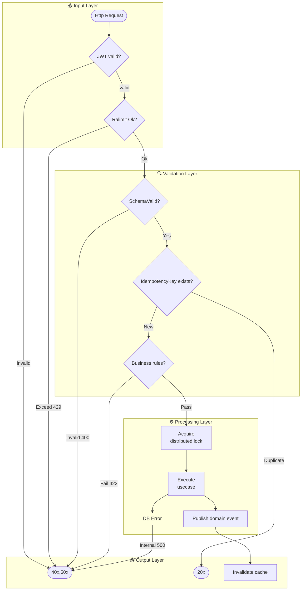

**Điểm cần chú ý:**

- `ERR` node dùng chung cho nhiều nhánh lỗi — tránh vẽ 5 ERR node giống nhau
- Label trên edge phải nói rõ HTTP status code khi có thể: `429`, `400`, `422`
- `IDEMPOT` check trước `BIZ` rule — đây là thứ tự quan trọng về performance (fail fast)
- Subgraph name viết theo RESPONSIBILITY, không phải tech: `"Validation Layer"` không phải `"Middleware"`