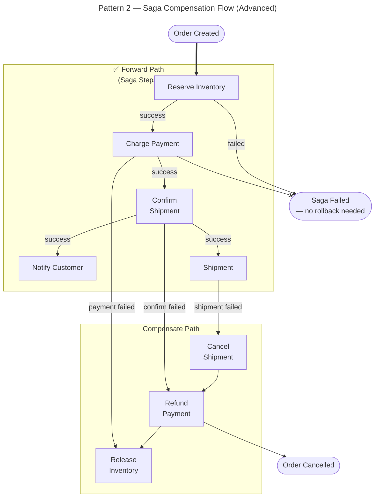

**Expert insight:**

- `==>` (thick) cho forward/happy path — scan nhanh ngay critical path
- `-->` (normal) cho failure branches — secondary
- `--x` (cross) đánh dấu đường bị terminate/blocked
- Compensation steps đi **ngược chiều**: `S3 fails → C3 → C2 → C1` — pattern này phải rõ trong diagram
- Không bao giờ vẽ compensation bằng `-->` thường — người đọc sẽ nhầm với forward path