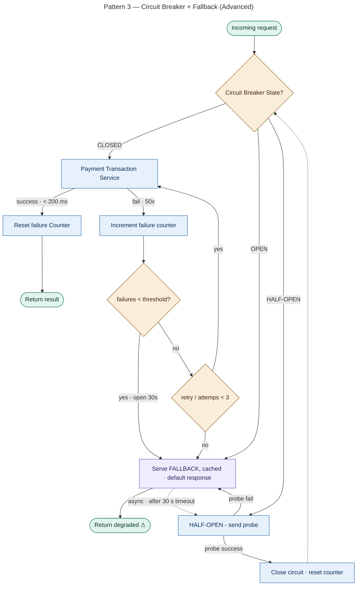
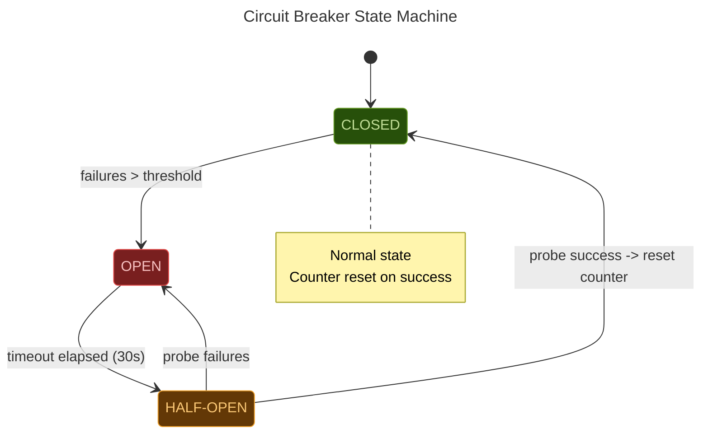

# 1. Flowchart

```mermaid
---
title: Pattern 3 — Circuit Breaker + Fallback (Advanced)
---
flowchart TD
%% -- Entry ------------------
REQ([Incoming request])

%% -- Gate ---------------
CB_STATE{Circuit Breaker State?}

%% Happy path 
CALL_SVC[Payment Transaction Service]
RESET_CTR[Reset failure Counter]
RESP_OK([Return result])

%% Failure path
INCR_FAIL[Increment failure counter]
THRESH{failures < threshold?}
RETRY{retry / attemps < 3}

%% Fallback & recevery 
FALLBACK[Serve FALLBACK, cached · default response]
HALF_OPEN[HALF-OPEN - send probe]
RESP_DEG([Return degraded ⚠])
CLOSE_CB[Close  circuit · reset counter]

%% -- FLOW ----------------------------
REQ --> CB_STATE
CB_STATE --> |CLOSED| CALL_SVC
CB_STATE --> |OPEN| FALLBACK
CB_STATE --> |HALF-OPEN| HALF_OPEN

CALL_SVC --> |success · < 200 ms | RESET_CTR
CALL_SVC --> |fail · 50x| INCR_FAIL

RESET_CTR --> RESP_OK

INCR_FAIL--> THRESH
THRESH --> |yes - open 30s| FALLBACK
THRESH --> |no| RETRY

RETRY --> |yes| CALL_SVC
RETRY --> |no| FALLBACK

FALLBACK --> RESP_DEG
FALLBACK -.-> |async · after 30 s timeout| HALF_OPEN

HALF_OPEN -->|probe fail| FALLBACK
HALF_OPEN --> |probe success| CLOSE_CB

CLOSE_CB -.-> CB_STATE

%% Styles 
classDef terminal fill:#E1F5EE,stroke:#0F6E56,color:#04342C
classDef decision fill:#FAEEDA,stroke:#854F0B,color:#412402
classDef process fill:#E6F1FB,stroke:#185FA5,color:#042C53
classDef fallback fill:#EEEDFE,stroke:#534AB7,color:#26215C

class REQ,RESP_OK,RESP_DEG terminal
class CB_STATE,THRESH,RETRY decision
class CALL_SVC,INCR_FAIL,CLOSE_CB,HALF_OPEN,RESET_CTR process
class FALLBACK fallback
```

# 2. State Diagram

```mermaid
---
title: Circuit Breaker State Machine 
---
stateDiagram-v2
[*] --> CLOSED 

%% --- State declaration ---------------------
state "CLOSED" as CLOSED
state "OPEN" as OPEN
state "HALF-OPEN" as HALF_OPEN

%% --- Transition ----------------------
CLOSED --> OPEN : failures > threshold
OPEN --> HALF_OPEN: timeout elapsed (30s)
HALF_OPEN --> CLOSED: probe success -> reset counter
HALF_OPEN --> OPEN: probe failures

%% --- Notes ----------------------
note right of CLOSED 
    Normal state 
    Counter reset on success 
end note

classDef stClosed   fill:#27500A,color:#C0DD97,stroke:#639922
classDef stOpen     fill:#791F1F,color:#F7C1C1,stroke:#E24B4A
classDef stHalfOpen fill:#633806,color:#FAC775,stroke:#EF9F27

class CLOSED  stClosed
class OPEN stOpen
class HALF_OPEN stHalfOpen 
```

# 3.Flow  

