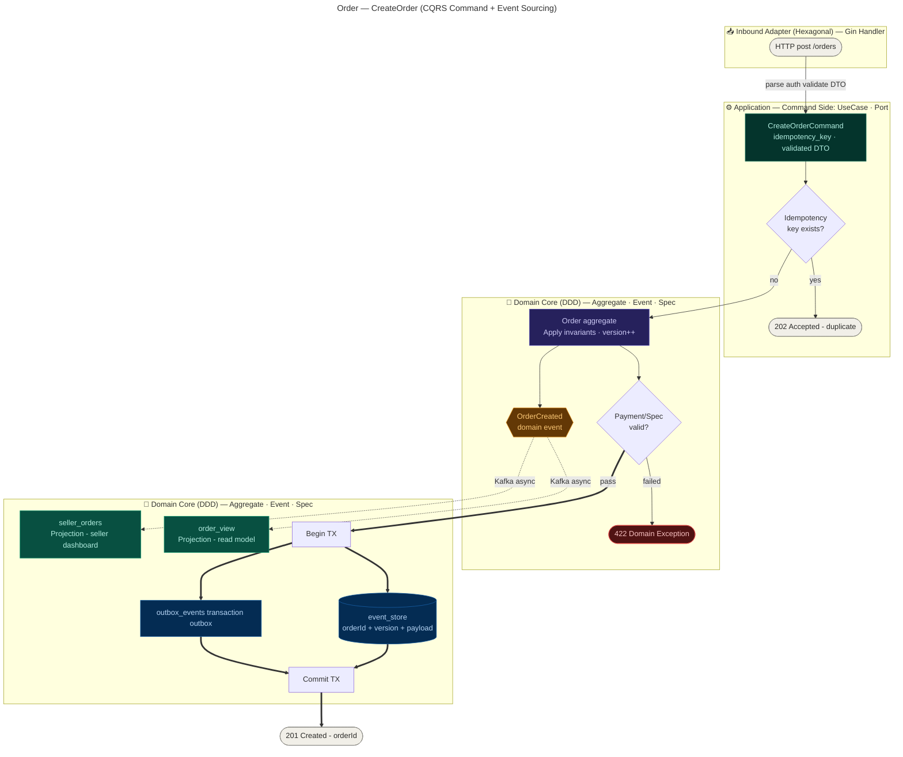
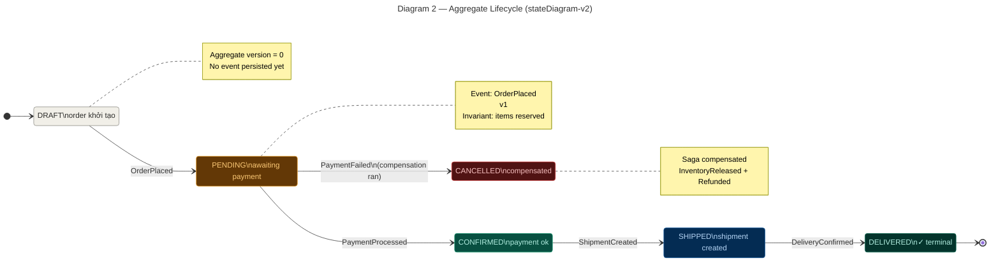
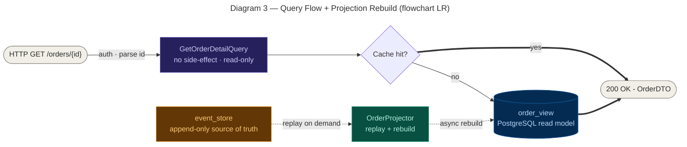

# Flowchart 

```mermaid
---

title: Order — CreateOrder (CQRS Command + Event Sourcing)

---

flowchart TB

%% -- Nodes: inbound adapter ------------------

IN_HAND_HTTP(["HTTP post /orders"])

  

%% -- Nodes: Applications - Command side ------------------

APP_CMD_CREATE_ORDER["CreateOrderCommand\nidempotency_key · validated DTO"]

APP_IDEMPOT{"Idempotency\nkey exists?"}

APP_CMD_RESP_202(["202 Accepted - duplicate"])

  

%%-- Nodes: Domain core

DOM_AGG_ORDER["Order aggregate\nApply invariants · version++"]

DOM_EVT_ORDER_CREATED{{"OrderCreated\ndomain event"}}

DOM_SPEC_PAYMENT{Payment/Spec\n valid?}

DOM_ERR_DOMAIN([422 Domain Exception])

  

%% Nodes: Infrastructure - outbound

OUT_TX["Begin TX"]

OUT_STORE_EVENTS[("event_store\norderId + version + payload")]

OUT_OUTBOX_EVENTS["outbox_events transaction outbox"]

OUT_COMMIT["Commit TX"]

OUT_PROJ_ORDER_VIEW["order_view\nProjection - read model"]

OUT_PROJ_SELLER_ORDER[""seller_orders\nProjection - seller dashboard]

  

%% terminal

RESP_OK(["201 Created - orderId"])

  

%% Flow

IN_HAND_HTTP --> |parse auth validate DTO| APP_CMD_CREATE_ORDER

  

APP_CMD_CREATE_ORDER --> APP_IDEMPOT

APP_IDEMPOT --> |yes| APP_CMD_RESP_202

APP_IDEMPOT --> |no| DOM_AGG_ORDER

  

DOM_AGG_ORDER --> DOM_SPEC_PAYMENT

DOM_SPEC_PAYMENT --> |failed| DOM_ERR_DOMAIN

DOM_SPEC_PAYMENT ==> |pass| OUT_TX

  

OUT_STORE_EVENTS ==> OUT_COMMIT

OUT_OUTBOX_EVENTS ==> OUT_COMMIT

OUT_TX ==> OUT_STORE_EVENTS

OUT_TX ==> OUT_OUTBOX_EVENTS

OUT_COMMIT ==> RESP_OK

  

DOM_AGG_ORDER --> DOM_EVT_ORDER_CREATED

DOM_EVT_ORDER_CREATED -.-> | Kafka async| OUT_PROJ_ORDER_VIEW

DOM_EVT_ORDER_CREATED -.-> |Kafka async|OUT_PROJ_SELLER_ORDER

  

%% Subgraph

subgraph IN_ZONE["📥 Inbound Adapter (Hexagonal) — Gin Handler"]

IN_HAND_HTTP

end

  

subgraph APP_ZONE["⚙️ Application — Command Side: UseCase · Port"]

APP_CMD_CREATE_ORDER

APP_IDEMPOT

APP_CMD_CREATE_ORDER

APP_CMD_RESP_202

end

  

subgraph DOM_ZONE["🔷 Domain Core (DDD) — Aggregate · Event · Spec"]

DOM_AGG_ORDER

DOM_SPEC_PAYMENT

DOM_EVT_ORDER_CREATED

DOM_ERR_DOMAIN

end

  

subgraph OUT_ZONE["🔷 Domain Core (DDD) — Aggregate · Event · Spec"]

OUT_TX

OUT_STORE_EVENTS

OUT_OUTBOX_EVENTS

OUT_COMMIT

OUT_PROJ_ORDER_VIEW

OUT_PROJ_SELLER_ORDER

end

%% Styles

classDef cmdNode fill:#04342C,stroke:#0F6E56,color:#B2EDE0

classDef aggNode fill:#26215C,stroke:#534AB7,color:#CECBF6

classDef eventNode fill:#633806,stroke:#EF9F27,color:#FAC775

classDef storeNode fill:#042C53,stroke:#185FA5,color:#B5D4F4

classDef projNode fill:#085041,stroke:#1D9E75,color:#B2EDE0

classDef errNode fill:#501313,stroke:#E24B4A,color:#F7C1C1

classDef termNode fill:#F1EFE8,stroke:#888780,color:#2C2C2A

  

class APP_CMD_CREATE_ORDER cmdNode

class DOM_AGG_ORDER aggNode

class DOM_EVT_ORDER_CREATED eventNode

class OUT_PROJ_ORDER_VIEW,OUT_PROJ_SELLER_ORDER projNode

class DOM_ERR_DOMAIN errNode

class IN_HAND_HTTP,RESP_OK,APP_CMD_RESP_202 termNode

class OUT_STORE_EVENTS,OUT_OUTBOX_EVENTS storeNode
```

# State Machine 

```mermaid 
---

title: Diagram 2 — Aggregate Lifecycle (stateDiagram-v2)

---

stateDiagram-v2

direction LR

[*] --> DRAFT

  

%% State Declaration

  

state "DRAFT\norder khởi tạo" as DRAFT

state "PENDING\nawaiting payment" as PENDING

state "CANCELLED\ncompensated" as CANCELLED

state "CONFIRMED\npayment ok" as CONFIRMED

state "SHIPPED\nshipment created" as SHIPPED

state "DELIVERED\n✓ terminal" as DELIVERED

  

%% Transitions

DRAFT --> PENDING: OrderPlaced

PENDING --> CANCELLED: PaymentFailed\n(compensation ran)

PENDING --> CONFIRMED: PaymentProcessed

CONFIRMED --> SHIPPED: ShipmentCreated

SHIPPED --> DELIVERED: DeliveryConfirmed

DELIVERED --> [*]

  

%%---Notes

note right of DRAFT

Aggregate version = 0

No event persisted yet

end note

  

note right of PENDING

Event: OrderPlaced

v1

Invariant: items reserved

end note

  

note right of CANCELLED

Saga compensated

InventoryReleased + Refunded

end note

  

%% Styles

classDef stateDraft fill:#F1EFE8,stroke:#888780,color:#2C2C2A

classDef statePending fill:#633806,stroke: #EF9F27,color: #FAC775

classDef stateConfirmed fill: #085041,stroke: #1D9E75,color: #B2EDE0

classDef stateCancelled fill: #501313,stroke: #E24B4A,color: #F7C1C1

classDef stateShipped fill: #042C53,stroke: #185FA5,color: #B5D4F4

classDef stateDelivered fill: #04342C,stroke: #0F6E56,color: #B2EDE0

  
  

class DRAFT stateDraft

class PENDING statePending

class CONFIRMED stateConfirmed

class CANCELLED stateCancelled

class SHIPPED stateShipped

class DELIVERED stateDelivered
```

# Query Flow

```mermaid
---

title: Diagram 3 — Query Flow + Projection Rebuild (flowchart LR)

---

flowchart LR

%% Nodes

IN_HAND_HTTP(["HTTP GET /orders/{id}"])

APP_QUERY_GET_ORDER_DETAIL["GetOrderDetailQuery\nno side-effect · read-only"]

APP_CACHE_HIT{Cache hit?}

OUT_RESULT_OK([200 OK - OrderDTO])

OUT_ORDER_VIEW[(order_view\nPostgreSQL read model)]

OUT_ORDER_PROJECTOR[OrderProjector\nreplay + rebuild]

OUT_EVENT_STORE[event_store\nappend-only source of truth]

  

%%Flow

IN_HAND_HTTP -->|auth · parse id| APP_QUERY_GET_ORDER_DETAIL

APP_QUERY_GET_ORDER_DETAIL --> APP_CACHE_HIT

APP_CACHE_HIT ==> |yes|OUT_RESULT_OK

APP_CACHE_HIT --> |no| OUT_ORDER_VIEW

OUT_ORDER_VIEW ==> OUT_RESULT_OK

OUT_ORDER_PROJECTOR -.-> |async rebuild| OUT_ORDER_VIEW

OUT_EVENT_STORE -.->|replay on demand| OUT_ORDER_PROJECTOR

  

classDef termNode fill:#F1EFE8,stroke:#888780,color:#2C2C2A

classDef aggNode fill:#26215C,stroke:#534AB7,color:#CECBF6

classDef storeNode fill:#042C53,stroke:#185FA5,color:#B5D4F4

classDef evtNode fill:#633806,stroke:#EF9F27,color:#FAC775

classDef projNode fill:#085041,stroke:#1D9E75,color:#B2EDE0

  

class IN_HAND_HTTP,OUT_RESULT_OK termNode

class APP_QUERY_GET_ORDER_DETAIL aggNode

class OUT_ORDER_VIEW storeNode

class OUT_EVENT_STORE evtNode

class OUT_ORDER_PROJECTOR projNode
```