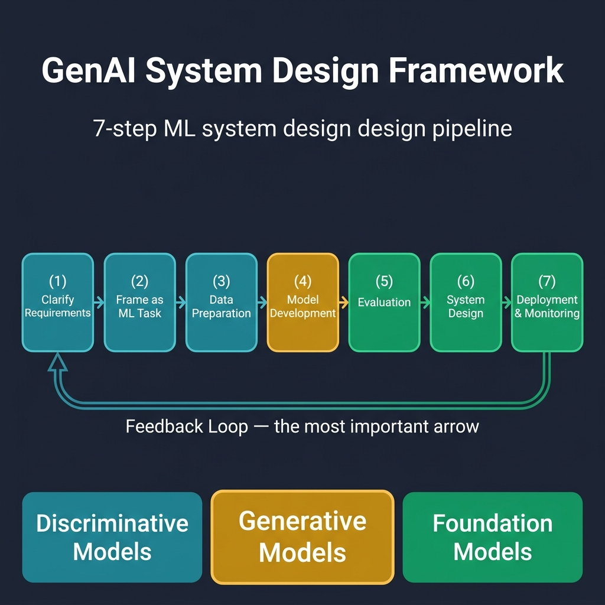

<!-- tags: genai, system-design, ml-pipeline, llm, transformer, scaling-law -->
# 🏗️ GenAI System Design — Introduction & Overview

📅 Created: 2026-04-21 · 🔄 Updated: 2026-04-21 · ⏱️ 25 min read

> Building a GenAI application is not the same as training a model. The model is one component inside a system that collects data, evaluates quality, serves predictions at scale, and monitors drift over time. This document maps the full pipeline — from clarifying requirements to production monitoring — so you can design GenAI systems that survive contact with real users.

| Aspect         | Detail                                                          |
| -------------- | --------------------------------------------------------------- |
| **Complexity** | ⭐⭐⭐⭐                                                          |
| **Audience**   | ML Engineers, Backend Engineers integrating GenAI, Interview Prep |
| **Keywords**   | GenAI, System Design, Scaling Law, Transformer, Evaluation       |

---

## 1. DEFINE

*(Prerequisite: General understanding of ML concepts → [01-llm-fundamentals.md](./01-llm-fundamentals.md))*

Picture this. Your team ships a chatbot powered by a fine-tuned LLM. Demo day goes well. The CEO types a question, the model answers fluently, and everyone claps. Two weeks later, latency spikes to 8 seconds under real traffic. Users paste 10,000-word legal documents into the input box. The model hallucinates a company policy that does not exist. A customer screenshots the response and posts it on social media.

The model itself did not change. Everything around it failed.

That gap between "the model works" and "the system works" is exactly what GenAI system design addresses.

### 1.1 AI, ML, and Generative Models — The Taxonomy

AI is a broad field focused on building systems that perform tasks requiring human intelligence. ML is a subset that learns from data instead of hand-coded rules. Within ML, two families of models matter most:

| Family | Goal | Output | Example Tasks |
|--------|------|--------|---------------|
| **Discriminative** | Learn P(Y\|X) — boundaries between classes | Labels, scores, rankings | Fraud detection, object detection, sentiment analysis |
| **Generative** | Learn P(X) or P(X,Y) — the data distribution itself | New data instances | Text generation, image synthesis, audio creation |

Discriminative models decide which bucket data belongs to. Generative models create new data that resembles the training distribution.

### 1.2 Classical vs. Modern Generative Algorithms

Classical generative algorithms — Naive Bayes, Gaussian Mixture Models, Hidden Markov Models, Boltzmann Machines — handle structured data well. They struggle with complex, high-dimensional distributions.

Modern generative algorithms break that ceiling:

| Algorithm | Mechanism | Typical Use |
|-----------|-----------|-------------|
| **VAEs** | Encode → latent space → decode | Image reconstruction, anomaly detection |
| **GANs** | Generator vs. discriminator adversarial training | Face generation, style transfer |
| **Diffusion Models** | Reverse noise process | Image and video generation (Stable Diffusion, DALL·E) |
| **Autoregressive Models** | Predict next token given previous tokens | Text generation (GPT, LLaMA, Gemini) |

### 1.3 Why GenAI Became Powerful — Three Forces

Three forces converged to make modern GenAI models viable:

**Data.** Self-supervised learning removed the dependency on labeled datasets. Models like LLaMA 3 train on 15 trillion tokens scraped from the open internet — roughly 50 terabytes. A human reading nonstop at 250 words per minute would need 85,000 years to cover that volume.

**Model Capacity.** More parameters capture more complex patterns. PaLM has 540 billion parameters. LLaMA 3 has 405 billion. The FLOP count — floating-point operations for a single forward pass — measures computational complexity independently of parameter count. Dense architectures demand more FLOPs than sparse ones, even at identical parameter counts.

**Compute.** Specialized hardware (GPUs like NVIDIA H100, TPUs) and distributed training techniques make it feasible to train these massive models. Training GPT-4 cost more than $100 million. A single H100 GPU would need 5.5 years to replicate the compute budget of PaLM-2.

### 1.4 Scaling Laws — The Predictable Relationship

In 2020, OpenAI researchers discovered that model performance improves predictably as a power-law function of three variables: model size (N), dataset size (D), and compute budget (C). Architecture variations matter far less than scale.

In 2022, DeepMind extended this finding: many existing LLMs were *undertrained*. Data should scale linearly with model size. Training a 10× larger model on the same dataset wastes capacity.

> **Key insight:** Scaling law means you can predict performance before training starts — if you know your compute budget. This makes cost estimation a first-class design concern.

### 1.5 GenAI Risks and Limitations

| Risk Category | Concrete Threat |
|---------------|----------------|
| **Ethical** | Bias amplification, IP infringement, misinformation at scale |
| **Environmental** | Training one large model can emit as much CO₂ as five cars over their lifetimes |
| **Model Limitations** | Hallucination, lack of true reasoning, brittle under adversarial prompts |
| **Security** | Deepfakes for manipulation, automated phishing, prompt injection attacks |

These are not edge cases. They are design constraints that shape architecture from day one.

---

Definition alone does not reveal why each stage of the framework matters more than the model itself. The visual below maps the full pipeline — and the feedback loop that keeps it alive in production.

## 2. VISUAL

The 7-step ML System Design Framework structures every GenAI system — from a chatbot to a text-to-video generator. Each stage feeds the next. The feedback loop from deployment back to requirements is what separates a demo from a production system.



*Each stage answers a different question. Requirements asks "what?" Data Preparation asks "with what?" Model Development asks "how?" Evaluation asks "how well?" Deployment asks "for how long?"*

The pipeline is not linear in practice. Evaluation failures loop back to data preparation. Monitoring alerts trigger re-training. The feedback arrow at the bottom is the most important arrow in the diagram.

---

The framework gives you structure. But each stage has depth that a diagram cannot show. The next section walks through implementation decisions — the kind you discuss in a system design interview or make when building a real GenAI product.

## 3. CODE

> This section does not contain runnable code in the traditional sense. GenAI system design is an architecture discipline. The "code" here is the structured reasoning you walk through at each stage — with Go examples where implementation surfaces.

### 3.1 Stage 1 — Clarifying Requirements

Every GenAI project starts with ambiguity. "Design an image generation system" tells you almost nothing. The first job is to decompose that into functional and non-functional requirements.

**Functional requirements** define *what* the system does:
- What input modalities does it accept? (text, image, audio, video)
- What output does it produce?
- What features affect ML design? (user feedback, multi-language support)

**Non-functional requirements** define *how well* it performs:
- Latency: must images generate in under 3 seconds?
- Throughput: how many concurrent users?
- Quality vs. speed trade-off: is generation fidelity more important than response time?

```go
// requirements.go — Modeling GenAI system requirements
package design

// FunctionalReq captures what the system must do.
type FunctionalReq struct {
    InputModalities  []string // e.g., ["text", "image"]
    OutputModality   string   // e.g., "image"
    SupportsFeedback bool     // user can rate/flag outputs
    Languages        []string // supported input languages
}

// NonFunctionalReq captures quality attributes.
type NonFunctionalReq struct {
    MaxLatencyMs     int     // e.g., 3000
    TargetThroughput int     // requests per second
    QualityPriority  float64 // 0.0 = speed first, 1.0 = quality first
    CloudBased       bool    // false = on-device inference
}
```

> **Why Go?** Requirements modeling is not language-specific. But Go structs enforce clarity — every field has a type, every constraint is explicit. This is the mindset you need at the requirements stage.

### 3.2 Stage 2 — Framing the Problem as an ML Task

Once requirements are clear, frame the problem for ML. Three decisions:

1. **Discriminative or generative?** If the output is a label or score, discriminative. If the output is new content, generative.
2. **What is the task type?** Text generation, image generation, classification, regression.
3. **Which algorithm?** Diffusion models for images, autoregressive Transformers for text, GANs for style transfer.

| System | Input | Output | Task Type | Algorithm Family |
|--------|-------|--------|-----------|-----------------|
| Chatbot | Text query | Text response | Text generation | Autoregressive Transformer |
| Image generator | Text prompt | Image | Image generation | Diffusion model |
| Content moderator | User post | Safe/Unsafe label | Classification | Discriminative (fine-tuned LLM) |
| Video creator | Text + image | Video | Video generation | Diffusion + Autoregressive |

### 3.3 Stage 3 — Data Preparation

GenAI models consume unstructured data at massive scale. Data preparation differs fundamentally from traditional ML:

| Aspect | Traditional ML | GenAI |
|--------|---------------|-------|
| **Data type** | Structured (tables, features) | Unstructured (text, images, video) |
| **Key process** | Feature engineering | Data collection + cleaning |
| **Scale** | Thousands to millions of rows | Billions of tokens / millions of images |
| **Labeling** | Required (supervised) | Often unnecessary (self-supervised) |

**Data cleaning is non-negotiable.** Internet-scale datasets contain harmful content, duplicates, low-quality entries, and NSFW material. A data pipeline must filter all four before training begins.

```go
// pipeline.go — Data cleaning pipeline stages
package data

// CleaningStage represents one step in the data cleaning pipeline.
type CleaningStage struct {
    Name    string
    Filter  func(record DataRecord) bool // returns true to keep
    Priority int // lower = runs first
}

// StandardPipeline returns the default cleaning stages for GenAI training data.
func StandardPipeline() []CleaningStage {
    return []CleaningStage{
        {Name: "harm-detection", Priority: 1,
            Filter: func(r DataRecord) bool { return r.HarmScore < 0.3 }},
        {Name: "quality-score", Priority: 2,
            Filter: func(r DataRecord) bool { return r.QualityScore > 0.5 }},
        {Name: "deduplication", Priority: 3,
            Filter: func(r DataRecord) bool { return !r.IsDuplicate }},
        {Name: "nsfw-filter", Priority: 4,
            Filter: func(r DataRecord) bool { return !r.IsNSFW }},
    }
}
```

### 3.4 Stage 4 — Model Development

Model development has three sub-stages: architecture selection, training, and sampling.

**Architecture.** The Transformer's self-attention mechanism is the backbone of modern GenAI. Each token produces Query (Q), Key (K), and Value (V) vectors. Attention scores compute how much each token should attend to every other token:

```
Attention(Q, K, V) = softmax(Q × K^T / √d_K) × V
```

Multi-head attention runs this computation in parallel across multiple "heads," each with its own weight matrices. The heads are concatenated and linearly transformed. This lets the model capture different types of relationships simultaneously.

**Training methodology.** LLMs typically follow three stages:
1. **Pre-training** on massive unlabeled data (self-supervised, next-token prediction)
2. **Supervised fine-tuning** on curated task-specific data
3. **Alignment** (RLHF or DPO) to match human preferences

**Distributed training** is essential at scale. Three parallelism strategies:

| Strategy | What It Splits | Best For |
|----------|---------------|----------|
| **Data parallelism** | Dataset across GPUs; each GPU holds full model | Large datasets, model fits in one GPU |
| **Tensor parallelism** | Single layer's operations across GPUs | Layers too large for one GPU's memory |
| **Pipeline parallelism** | Model layers across GPUs in sequence | Very deep models (100+ layers) |

Hybrid approaches combine all three. ZeRO (Microsoft) and FSDP (Meta) further reduce memory redundancy.

### 3.5 Stage 5 — Evaluation

Two evaluation modes exist:

**Offline evaluation** uses held-out datasets and automated metrics before deployment. Metrics vary by task:

| Task | Common Metrics |
|------|---------------|
| Text generation | BLEU, ROUGE, perplexity, human preference |
| Image generation | FID (Fréchet Inception Distance), CLIP score |
| Classification | Precision, recall, F1, AUC-ROC |

**Online evaluation** measures real-world performance after deployment:
- A/B testing: compare model versions with live traffic
- User engagement: click-through rate, session length, satisfaction scores
- Safety monitoring: hallucination rate, harmful output frequency

### 3.6 Stage 6 — Overall System Design

The ML model sits inside a larger system. Components include:

- **Data pipelines** for continuous ingestion and preprocessing
- **Model serving infrastructure** (GPU clusters, load balancers, caching)
- **RAG (Retrieval-Augmented Generation)** for grounding outputs in factual data
- **Safety layers** for input validation and output filtering
- **API gateway** for rate limiting, authentication, and routing

### 3.7 Stage 7 — Deployment and Monitoring

Deployment is not the end. It is the beginning of the operational lifecycle:

- **Model versioning** with rollback capability
- **Canary deployments** to test new versions on a fraction of traffic
- **Monitoring dashboards** tracking latency, error rates, token costs, and output quality
- **Drift detection** to identify when the model's performance degrades on new data distributions
- **Feedback loops** that route user signals back into the training pipeline

---

The framework covers what to build. The next section covers what breaks — the traps that catch teams who treat model accuracy as the only metric that matters.

## 4. PITFALLS

| # | Severity | Mistake | Consequence | Fix |
|---|----------|---------|-------------|-----|
| 1 | 🔴 Fatal | Skipping requirements clarification | Building a system that solves the wrong problem | Spend 10-15% of interview or project time on requirements |
| 2 | 🔴 Fatal | No data cleaning pipeline | Model learns from toxic, biased, or duplicated data | Implement harm detection, quality scoring, dedup, NSFW filtering |
| 3 | 🟡 Major | Ignoring scaling laws | Over-spending on compute or under-training the model | Use Chinchilla-optimal ratios: scale data linearly with model size |
| 4 | 🟡 Major | Single evaluation metric | Model scores high on BLEU but hallucinates in production | Combine offline metrics with online A/B tests and safety monitoring |
| 5 | 🟡 Major | No feedback loop from production | Model performance degrades silently over time | Route user feedback and monitoring alerts back into the training pipeline |
| 6 | 🟠 Medium | Choosing architecture before framing the problem | Picking a diffusion model when the task needs autoregressive generation | Frame the task first (discriminative vs. generative → task type → algorithm) |
| 7 | 🟠 Medium | Treating the model as the entire system | Neglecting data pipelines, safety layers, serving infra, and monitoring | Design the system, not just the model |

---

The framework and its failure modes are clear. The references below point to the original research and the sources that informed each section.

## 5. REF

| Resource | Link |
|----------|------|
| ByteByteGo — GenAI System Design Interview (Ch. 1) | [bytebytego.com](https://bytebytego.com/courses/genai-system-design-interview/introduction-and-overview) |
| Attention Is All You Need (Vaswani et al., 2017) | [arxiv.org/abs/1706.03762](https://arxiv.org/abs/1706.03762) |
| Scaling Laws for Neural Language Models (Kaplan et al., 2020) | [arxiv.org/abs/2001.08361](https://arxiv.org/abs/2001.08361) |
| Training Compute-Optimal LLMs — Chinchilla (Hoffmann et al., 2022) | [arxiv.org/abs/2203.15556](https://arxiv.org/abs/2203.15556) |
| LLaMA 3 Technical Report (Meta, 2024) | [arxiv.org/abs/2407.21783](https://arxiv.org/abs/2407.21783) |
| ZeRO: Memory Optimizations for Training (Rajbhandari et al., 2020) | [arxiv.org/abs/1910.02054](https://arxiv.org/abs/1910.02054) |
| McKinsey — Economic Potential of GenAI (2023) | [mckinsey.com](https://www.mckinsey.com/capabilities/mckinsey-digital/our-insights/the-economic-potential-of-generative-ai-the-next-productivity-frontier) |

---

## 6. RECOMMEND

You now have the map. Each stage of the framework becomes its own deep-dive in the chapters that follow — and in the sibling documents already in this directory.

| Next Step | When | Why | File |
|-----------|------|-----|------|
| **LLM Fundamentals** | First | Understand the Transformer architecture that powers most GenAI text models | [01-llm-fundamentals.md](./01-llm-fundamentals.md) |
| **Prompt Engineering** | After fundamentals | The cheapest way to improve GenAI output — no training required | [02-prompt-engineering.md](./02-prompt-engineering.md) |
| **RAG** | When you need factual grounding | Reduces hallucination by retrieving real data before generation | [03-rag.md](./03-rag.md) |
| **Fine-Tuning** | When prompting is not enough | Adapts the model's behavior and output format to your domain | [04-fine-tuning.md](./04-fine-tuning.md) |
| **Deployment & Inference** | Production readiness | Quantization, serving infrastructure, cost optimization | [05-deployment-inference.md](./05-deployment-inference.md) |

The framework is the skeleton. The sibling documents are the muscles. Start with fundamentals, then follow the path that matches your problem.

---

← Back to [LLM Documentation](./README.md) · → Next: [LLM Fundamentals](./01-llm-fundamentals.md)
