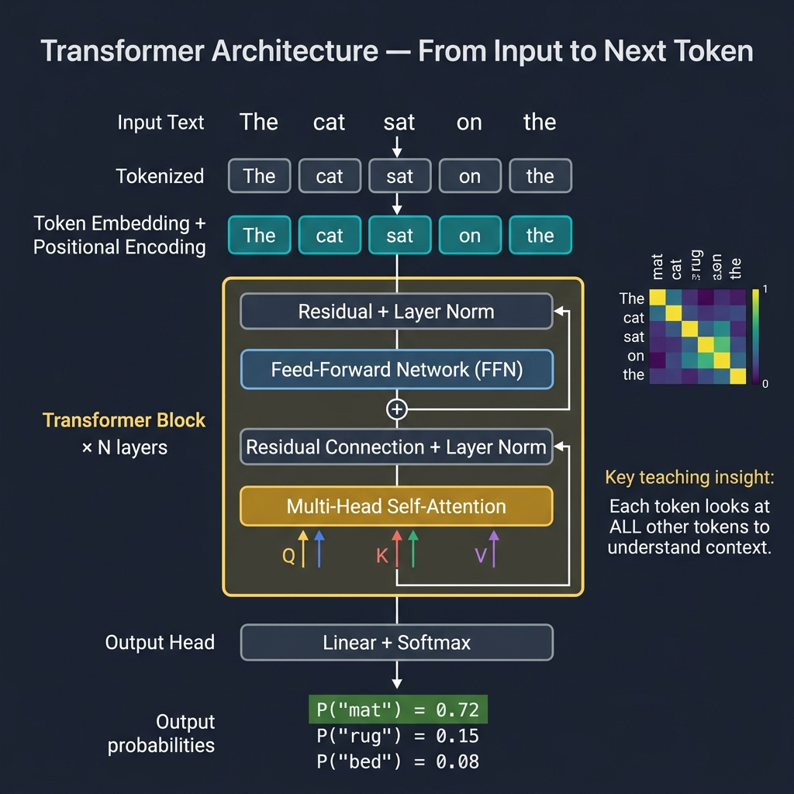

<!-- tags: llm, transformer, attention, tokenization, ai -->
<!-- tags: llm, transformer, attention, tokenization -->
# 🧠 LLM Fundamentals — Transformer, Attention & Tokenization

> Hiểu kiến trúc nền tảng đằng sau ChatGPT, Claude, Gemini — từ Attention mechanism đến cách model "đọc" văn bản.

📅 Ngày tạo: 2026-03-27 · 🔄 Cập nhật: 2026-03-27 · ⏱️ 20 phút đọc

| Aspect         | Detail                                                    |
| -------------- | --------------------------------------------------------- |
| **Complexity** | ⭐⭐⭐                                                     |
| **Use case**   | AI/ML Engineering, Backend Integration, Prompt Design     |
| **Keywords**   | Transformer, Self-Attention, Tokenizer, BPE, Embedding    |

---

## 1. DEFINE

### LLM là gì?

Large Language Model (LLM) là mô hình AI được train trên lượng text khổng lồ (hàng TB dữ liệu) để học xác suất của token tiếp theo. Về bản chất, LLM là một **next-token predictor** cực kỳ mạnh mẽ.

| Khái niệm          | Giải thích                                                           |
| ------------------- | -------------------------------------------------------------------- |
| **Token**           | Đơn vị nhỏ nhất LLM xử lý — có thể là từ, phần từ, hoặc ký tự     |
| **Embedding**       | Vector số học đại diện cho token (VD: 768-4096 dimensions)           |
| **Context Window**  | Số tokens tối đa model xử lý một lần (4K → 1M+)                    |
| **Parameters**      | Trọng số (weights) của model — GPT-4: ~1.8T, LLaMA 3: 8B-405B      |
| **Inference**       | Quá trình model sinh ra output từ input (prompt → response)         |
| **Temperature**     | Độ "sáng tạo" — 0: deterministic, 1: creative, >1: chaotic         |
| **Top-p (nucleus)** | Sampling từ top-p% tokens có xác suất cao nhất                      |

### Tokenization — Cách LLM "đọc" text

| Method     | Mô tả                                   | Ví dụ                                    |
| ---------- | ---------------------------------------- | ----------------------------------------- |
| **Word**   | Tách theo từ (space-separated)           | `"Hello world"` → `["Hello", "world"]`    |
| **Char**   | Tách theo ký tự                          | `"Hello"` → `["H","e","l","l","o"]`       |
| **BPE**    | Byte-Pair Encoding — merge frequent pairs | `"lower"` → `["low", "er"]`              |
| **WordPiece** | Giống BPE, dùng bởi BERT              | `"unaffable"` → `["un", "##aff", "##able"]` |
| **SentencePiece** | Language-agnostic, dùng bởi LLaMA | Xử lý Unicode/CJK tốt hơn              |

Tokenization đã cover. Nhưng transformer cần attention mechanism — hãy hiểu.

### Transformer Architecture

| Component            | Vai trò                                                     |
| -------------------- | ------------------------------------------------------------ |
| **Input Embedding**  | Chuyển tokens → vectors (lookup table)                       |
| **Positional Encoding** | Thêm thông tin vị trí vào embedding (sin/cos hoặc RoPE)  |
| **Self-Attention**   | Mỗi token "nhìn" tất cả tokens khác → tính relevance        |
| **Multi-Head Attention** | Chạy N attention heads song song → capture nhiều patterns |
| **Feed-Forward (FFN)** | 2 linear layers + activation → transform representations  |
| **Layer Norm**       | Normalize activations để training ổn định                    |
| **Residual Connection** | Skip connection: `output = layer(x) + x` → tránh vanishing gradient |

### So sánh các LLM phổ biến

| Model           | Provider   | Parameters | Context   | Open Source | Đặc điểm                   |
| --------------- | ---------- | ---------- | --------- | ----------- | --------------------------- |
| **GPT-4o**      | OpenAI     | ~1.8T (MoE) | 128K    | ❌          | Multimodal, fast            |
| **Claude 3.5**  | Anthropic  | N/A        | 200K      | ❌          | Long context, safe          |
| **Gemini 2.0**  | Google     | N/A        | 1M+       | ❌          | Multimodal, huge context    |
| **LLaMA 3.1**   | Meta       | 8B-405B    | 128K      | ✅          | Best open-source            |
| **Mistral**     | Mistral AI | 7B-8x22B  | 32K-128K  | ✅          | Efficient, MoE              |
| **Qwen 2.5**    | Alibaba    | 0.5B-72B   | 128K      | ✅          | Strong multilingual         |
| **DeepSeek V3** | DeepSeek   | 671B (MoE) | 128K      | ✅          | Cost-effective training     |

---

Các failure mode trên nghe quen. Nhưng có trap: không hiểu tokenization = prompt dài tốn token bất ngờ, và temperature setting sai = output quá random. Trap đó sẽ xuất hiện ở PITFALLS.

## 2. VISUAL

The Transformer architecture powers every modern LLM — from GPT-4 to LLaMA to Gemini. The diagram below traces the full path from raw text input through tokenization, embedding, multi-head self-attention, and feed-forward layers to the final next-token prediction.



*Each token produces Q, K, V vectors; attention scores determine how much every token "looks at" every other token. The highest-probability next token becomes the output.*

### Transformer Architecture (Simplified)

```text
Input: "The cat sat on the"

┌─────────────────────────────────────────────────┐
│                   TRANSFORMER                   │
│                                                 │
│  ┌──────────┐                                   │
│  │ Tokenizer │ → ["The", "cat", "sat", "on", "the"]
│  └──────────┘                                   │
│       ↓                                         │
│  ┌──────────────────┐                           │
│  │ Token Embedding   │ → [0.12, -0.34, 0.56, …] × 5
│  │ + Position Embed  │                           │
│  └──────────────────┘                           │
│       ↓                                         │
│  ╔══════════════════════════════╗  ×N layers     │
│  ║  ┌────────────────────────┐ ║                 │
│  ║  │  Multi-Head Attention  │ ║ ← Q, K, V      │
│  ║  │  (Self-Attention)      │ ║                 │
│  ║  └────────────┬───────────┘ ║                 │
│  ║       + Residual + LayerNorm║                 │
│  ║  ┌────────────┴───────────┐ ║                 │
│  ║  │   Feed-Forward (FFN)   │ ║                 │
│  ║  └────────────┬───────────┘ ║                 │
│  ║       + Residual + LayerNorm║                 │
│  ╚══════════════════════════════╝                │
│       ↓                                         │
│  ┌──────────────┐                               │
│  │ Output Head   │ → Softmax → P("mat") = 0.72  │
│  │ (Linear+SM)   │            P("rug") = 0.15  │
│  └──────────────┘            P("bed") = 0.08  │
│                                                 │
│  Output: "mat" (highest probability)            │
└─────────────────────────────────────────────────┘
```

### Self-Attention Mechanism

```text
Query (Q), Key (K), Value (V) — mỗi token tạo ra 3 vectors:

Token:  "The"   "cat"   "sat"   "on"   "the"
         ↓       ↓       ↓       ↓       ↓
Q:     [q1]    [q2]    [q3]    [q4]    [q5]
K:     [k1]    [k2]    [k3]    [k4]    [k5]
V:     [v1]    [v2]    [v3]    [v4]    [v5]

Attention Score = softmax(Q × K^T / √d_k) × V

         The   cat   sat   on   the    ← Keys
The  [  0.1   0.2   0.1   0.1  0.5 ]  ← "The" chú ý "the" nhiều nhất
cat  [  0.1   0.3   0.4   0.1  0.1 ]  ← "cat" chú ý "sat" nhiều
sat  [  0.2   0.5   0.1   0.1  0.1 ]  ← "sat" chú ý "cat" nhiều
on   [  0.1   0.1   0.3   0.2  0.3 ]
the  [  0.3   0.1   0.1   0.1  0.4 ]

→ Đây chính là cách model hiểu ngữ cảnh!
```

---

## 3. CODE

### 3.1 Tokenization — Hands-on

```python
# tokenization.py — So sánh các tokenizer
# ━━━ ✅ OpenAI tiktoken (GPT-4) ━━━

import tiktoken

# GPT-4 tokenizer
enc = tiktoken.encoding_for_model("gpt-4o")

text = "Xin chào! Tôi đang học về Large Language Models 🧠"
tokens = enc.encode(text)
print(f"Text: {text}")
print(f"Tokens: {tokens}")
print(f"Token count: {len(tokens)}")
print(f"Decoded: {[enc.decode([t]) for t in tokens]}")
# → ['X', 'in', ' ch', 'ào', '!', ' T', 'ôi', ' đ', 'ang', ' h', 'ọc',
#    ' về', ' Large', ' Language', ' Models', ' 🧠']

# ✅ Estimate cost (GPT-4o: $2.50/1M input tokens)
cost_per_1m = 2.50
estimated_cost = len(tokens) / 1_000_000 * cost_per_1m
print(f"Cost estimate: ${estimated_cost:.6f}")

# ━━━ ✅ Hugging Face tokenizer (LLaMA) ━━━
from transformers import AutoTokenizer

tokenizer = AutoTokenizer.from_pretrained("meta-llama/Llama-3.1-8B")
encoded = tokenizer(text, return_tensors="pt")
print(f"LLaMA tokens: {encoded['input_ids'].shape[1]}")
print(f"Decoded: {tokenizer.tokenize(text)}")
```

### 3.2 Embedding — Vector Representations

```python
# embedding.py — Text → Vector
# ━━━ ✅ OpenAI Embeddings ━━━

from openai import OpenAI

client = OpenAI()

def get_embedding(text: str, model="text-embedding-3-small") -> list[float]:
    """Chuyển text → vector (1536 dimensions)."""
    response = client.embeddings.create(input=text, model=model)
    return response.data[0].embedding

# ✅ So sánh semantic similarity
import numpy as np

def cosine_similarity(a: list[float], b: list[float]) -> float:
    a, b = np.array(a), np.array(b)
    return np.dot(a, b) / (np.linalg.norm(a) * np.linalg.norm(b))

texts = [
    "Docker containerizes applications",
    "Containers package software with dependencies",
    "PostgreSQL is a relational database",
]

embeddings = [get_embedding(t) for t in texts]

# So sánh similarity
for i in range(len(texts)):
    for j in range(i+1, len(texts)):
        sim = cosine_similarity(embeddings[i], embeddings[j])
        print(f"Similarity({i},{j}): {sim:.4f}")
        # (0,1): ~0.85 — rất giống (cùng topic Docker)
        # (0,2): ~0.45 — khác topic
        # (1,2): ~0.42 — khác topic
```

### 3.3 API Integration — Chat Completion

```python
# chat_completion.py — Gọi LLM API
# ━━━ ✅ OpenAI Chat API ━━━

from openai import OpenAI

client = OpenAI()

def chat(
    prompt: str,
    system: str = "You are a helpful assistant.",
    model: str = "gpt-4o",
    temperature: float = 0.7,
    max_tokens: int = 1024,
) -> str:
    """Simple chat completion wrapper."""
    response = client.chat.completions.create(
        model=model,
        messages=[
            {"role": "system", "content": system},
            {"role": "user", "content": prompt},
        ],
        temperature=temperature,
        max_tokens=max_tokens,
    )
    return response.choices[0].message.content

# ✅ Basic usage
answer = chat("Giải thích Transformer architecture trong 3 câu")
print(answer)

# ✅ Structured output (JSON mode)
response = client.chat.completions.create(
    model="gpt-4o",
    response_format={"type": "json_object"},
    messages=[
        {"role": "system", "content": "Output valid JSON."},
        {"role": "user", "content": "List 3 popular databases with their types"},
    ],
)
import json
data = json.loads(response.choices[0].message.content)
print(json.dumps(data, indent=2))

# ✅ Streaming response
stream = client.chat.completions.create(
    model="gpt-4o",
    messages=[{"role": "user", "content": "Explain Docker in detail"}],
    stream=True,
)
for chunk in stream:
    if chunk.choices[0].delta.content:
        print(chunk.choices[0].delta.content, end="", flush=True)
```

### 3.4 Go Integration — LLM API Client

```go
// llm_client.go — Go client cho OpenAI-compatible APIs
package llm

import (
    "bytes"
    "context"
    "encoding/json"
    "fmt"
    "io"
    "net/http"
    "os"
)

type Message struct {
    Role    string `json:"role"`
    Content string `json:"content"`
}

type ChatRequest struct {
    Model       string    `json:"model"`
    Messages    []Message `json:"messages"`
    Temperature float64   `json:"temperature,omitempty"`
    MaxTokens   int       `json:"max_tokens,omitempty"`
    Stream      bool      `json:"stream,omitempty"`
}

type ChatResponse struct {
    Choices []struct {
        Message Message `json:"message"`
    } `json:"choices"`
    Usage struct {
        PromptTokens     int `json:"prompt_tokens"`
        CompletionTokens int `json:"completion_tokens"`
        TotalTokens      int `json:"total_tokens"`
    } `json:"usage"`
}

type Client struct {
    apiKey  string
    baseURL string
    http    *http.Client
}

func NewClient() *Client {
    return &Client{
        apiKey:  os.Getenv("OPENAI_API_KEY"),
        baseURL: "https://api.openai.com/v1",
        http:    &http.Client{},
    }
}

// Chat sends a prompt and returns the response
func (c *Client) Chat(ctx context.Context, prompt, system string) (string, error) {
    req := ChatRequest{
        Model: "gpt-4o",
        Messages: []Message{
            {Role: "system", Content: system},
            {Role: "user", Content: prompt},
        },
        Temperature: 0.7,
        MaxTokens:   1024,
    }

    body, _ := json.Marshal(req)
    httpReq, err := http.NewRequestWithContext(
        ctx, "POST", c.baseURL+"/chat/completions", bytes.NewReader(body),
    )
    if err != nil {
        return "", fmt.Errorf("create request: %w", err)
    }

    httpReq.Header.Set("Authorization", "Bearer "+c.apiKey)
    httpReq.Header.Set("Content-Type", "application/json")

    resp, err := c.http.Do(httpReq)
    if err != nil {
        return "", fmt.Errorf("http request: %w", err)
    }
    defer resp.Body.Close()

    respBody, _ := io.ReadAll(resp.Body)
    if resp.StatusCode != http.StatusOK {
        return "", fmt.Errorf("API error %d: %s", resp.StatusCode, respBody)
    }

    var chatResp ChatResponse
    if err := json.Unmarshal(respBody, &chatResp); err != nil {
        return "", fmt.Errorf("decode response: %w", err)
    }

    if len(chatResp.Choices) == 0 {
        return "", fmt.Errorf("no choices in response")
    }

    return chatResp.Choices[0].Message.Content, nil
}
```

### 3.5 Token Counting & Cost Estimation

```python
# cost_estimation.py — Ước tính chi phí LLM
# ━━━ ✅ Cost per model ━━━

PRICING = {
    # Model: (input $/1M tokens, output $/1M tokens)
    "gpt-4o":           (2.50,  10.00),
    "gpt-4o-mini":      (0.15,   0.60),
    "claude-3.5-sonnet": (3.00, 15.00),
    "claude-3-haiku":   (0.25,  1.25),
    "gemini-2.0-flash": (0.10,  0.40),
}

import tiktoken

def estimate_cost(
    prompt: str,
    estimated_output_tokens: int = 500,
    model: str = "gpt-4o"
) -> dict:
    """Ước tính chi phí cho 1 API call."""
    enc = tiktoken.encoding_for_model("gpt-4o")
    input_tokens = len(enc.encode(prompt))

    input_price, output_price = PRICING.get(model, (0, 0))

    input_cost = input_tokens / 1_000_000 * input_price
    output_cost = estimated_output_tokens / 1_000_000 * output_price

    return {
        "model": model,
        "input_tokens": input_tokens,
        "output_tokens": estimated_output_tokens,
        "input_cost": f"${input_cost:.6f}",
        "output_cost": f"${output_cost:.6f}",
        "total_cost": f"${input_cost + output_cost:.6f}",
        "cost_per_1k_calls": f"${(input_cost + output_cost) * 1000:.4f}",
    }

# ✅ Usage
result = estimate_cost(
    "Explain the Transformer architecture in detail",
    estimated_output_tokens=800,
    model="gpt-4o"
)
print(result)
# {'model': 'gpt-4o', 'input_tokens': 7, 'total_cost': '$0.000018', ...}
```

---

Bạn đã đi qua LLM fundamentals. Bây giờ đến phần nguy hiểm: tokenization surprise và temperature tuning — trap đã được setup từ đầu bài.

## 4. PITFALLS

| # | Lỗi | Hậu quả | Fix |
| - | --- | ------- | --- |
| 1 | Không set temperature → mỗi lần output khác nhau | Inconsistent responses | Set `temperature=0` cho deterministic tasks |
| 2 | Vượt context window | API error hoặc truncated input | Đếm tokens trước, chunking nếu cần |
| 3 | Nhầm token count ≠ word count | Ước tính cost sai | Vietnamese: ~1.5-2 tokens/word, English: ~1.3 tokens/word |
| 4 | Hardcode API key | Security breach | Dùng env vars: `OPENAI_API_KEY` |
| 5 | Không handle rate limits | 429 errors, app crash | Implement exponential backoff + retry |
| 6 | Tin tuyệt đối vào LLM output | Hallucination gây sai thông tin | Luôn validate critical outputs, dùng RAG cho facts |
| 7 | Gửi PII/sensitive data vào API | Data privacy violation | Mask PII trước khi gửi, hoặc dùng self-hosted model |

---

Bạn đã đi qua LLM Fundamentals và cạm bẫy. Các resources dưới đây giúp đi sâu hơn.

## 5. REF

| Resource | Link |
| -------- | ---- |
| Attention Is All You Need (paper) | [arxiv.org/abs/1706.03762](https://arxiv.org/abs/1706.03762) |
| OpenAI Tokenizer | [platform.openai.com/tokenizer](https://platform.openai.com/tokenizer) |
| Hugging Face NLP Course | [huggingface.co/learn/nlp-course](https://huggingface.co/learn/nlp-course) |
| Jay Alammar — Illustrated Transformer | [jalammar.github.io](https://jalammar.github.io/illustrated-transformer/) |
| Andrej Karpathy — Let's build GPT | [YouTube](https://www.youtube.com/watch?v=kCc8FmEb1nY) |

---

## 6. RECOMMEND

| Mở rộng | Khi nào | Lý do |
| ------- | ------- | ----- |
| **Prompt Engineering** | Ngay sau fundamentals | Kỹ thuật quan trọng nhất khi dùng LLM |
| **RAG** | Cần knowledge base riêng | Giảm hallucination, custom domain knowledge |
| **Fine-Tuning** | Output format/style cụ thể | Khi prompt engineering không đủ |
| **Function Calling** | LLM cần gọi external tools | Cho phép LLM tương tác với APIs/databases |
| **Multimodal** | Xử lý image + text | GPT-4V, Claude Vision, Gemini |

---

← Quay về [LLM Documentation](./README.md) · → Next: [Prompt Engineering](./02-prompt-engineering.md)
