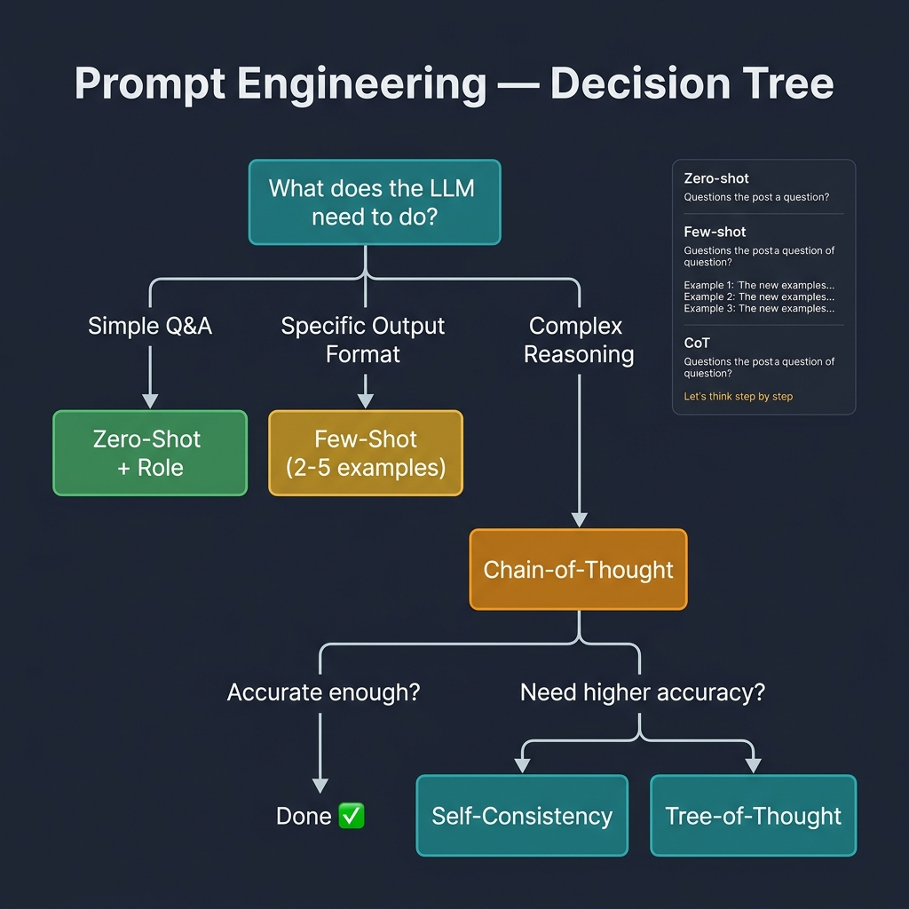

<!-- tags: llm, prompt-engineering, few-shot, chain-of-thought -->
<!-- tags: llm, prompt-engineering, few-shot -->
# 🎯 Prompt Engineering — Kỹ thuật viết prompt hiệu quả

> Prompt Engineering là kỹ năng quan trọng nhất khi làm việc với LLM. Một prompt tốt có thể biến model tầm thường thành expert.

📅 Ngày tạo: 2026-03-27 · 🔄 Cập nhật: 2026-03-27 · ⏱️ 18 phút đọc

| Aspect         | Detail                                                          |
| -------------- | --------------------------------------------------------------- |
| **Complexity** | ⭐⭐                                                             |
| **Use case**   | Mọi ứng dụng sử dụng LLM                                       |
| **Keywords**   | System Prompt, Few-shot, CoT, Role-playing, Output Format       |

---

## 1. DEFINE

### Prompt Structure

| Component       | Vai trò                                          | Ví dụ                                   |
| --------------- | ------------------------------------------------ | ---------------------------------------- |
| **System**      | Định nghĩa behavior, personality, constraints    | "You are a senior Go developer"          |
| **User**        | Input/question từ end user                        | "Explain goroutines"                     |
| **Assistant**   | Previous LLM responses (multi-turn)              | "Goroutines are lightweight threads..."  |
| **Context**     | Dữ liệu bổ sung (RAG, documents)                | Code snippet, documentation              |

### Các kỹ thuật Prompt Engineering

| Technique            | Mô tả                                                 | Khi nào dùng                     |
| -------------------- | ------------------------------------------------------ | --------------------------------- |
| **Zero-shot**        | Hỏi trực tiếp, không ví dụ                             | Câu hỏi đơn giản, general       |
| **One-shot**         | Cho 1 ví dụ mẫu                                       | Cần format cụ thể               |
| **Few-shot**         | Cho 2-5 ví dụ mẫu                                     | Output pattern phức tạp          |
| **Chain-of-Thought** | Yêu cầu suy nghĩ từng bước                            | Math, logic, reasoning           |
| **Role-playing**     | Gán vai trò cụ thể cho model                          | Expert-level output              |
| **Tree-of-Thought**  | Explore nhiều nhánh reasoning rồi chọn                 | Complex problem solving          |
| **Self-Consistency** | Chạy nhiều lần, vote majority                          | Tăng accuracy cho reasoning      |
| **ReAct**            | Reasoning + Acting (think → act → observe → repeat)   | Agent tasks, tool use            |

---

Các failure mode trên nghe rõ. Nhưng có trap: prompt quá vague = hallucination, và few-shot examples biased = output skewed. Trap đó sẽ xuất hiện ở PITFALLS.

## 2. VISUAL

Choosing the right prompting technique is a decision tree, not a guessing game. Start simple with zero-shot, escalate to few-shot when you need format consistency, and reach for chain-of-thought only when reasoning complexity demands it.



*Start simple and escalate only when needed. Zero-shot → Few-shot → CoT → Self-Consistency / Tree-of-Thought.*

### Prompt Engineering Decision Tree

```text
                    ┌─────────────────┐
                    │ Bạn cần LLM     │
                    │ làm gì?         │
                    └────────┬────────┘
                             │
              ┌──────────────┼──────────────┐
              ▼              ▼              ▼
        ┌──────────┐  ┌──────────┐   ┌──────────┐
        │ Đơn giản │  │ Format   │   │ Reasoning│
        │ Q&A      │  │ cụ thể   │   │ phức tạp │
        └────┬─────┘  └────┬─────┘   └────┬─────┘
             │              │              │
             ▼              ▼              ▼
      ┌────────────┐ ┌────────────┐ ┌─────────────┐
      │ Zero-shot  │ │ Few-shot   │ │ Chain-of-   │
      │ + Role     │ │ (2-5 ví dụ)│ │ Thought     │
      └────────────┘ └────────────┘ └──────┬──────┘
                                           │
                                    ┌──────┴──────┐
                                    ▼             ▼
                              ┌──────────┐  ┌──────────┐
                              │ Đủ chính │  │ Cần độ   │
                              │ xác?     │  │ chính xác│
                              │ → Done ✅ │  │ cao hơn  │
                              └──────────┘  └────┬─────┘
                                                 │
                                          ┌──────┴──────┐
                                          ▼             ▼
                                    ┌──────────┐  ┌──────────┐
                                    │ Self-    │  │ Tree-of- │
                                    │ Consist. │  │ Thought  │
                                    └──────────┘  └──────────┘
```

---

## 3. CODE

### 3.1 System Prompt Design Patterns

```python
# system_prompts.py — Các pattern system prompt hiệu quả

# ━━━ ✅ Pattern 1: Role + Constraints + Format ━━━
SYSTEM_CODE_REVIEWER = """
You are a Senior Software Engineer reviewing Go code.

## Rules
- Focus on: correctness, performance, security, readability
- Rate severity: 🔴 Critical, 🟡 Warning, 🟢 Suggestion
- Always explain WHY something is an issue
- Suggest specific fixes with code examples

## Output Format
For each issue:
**[SEVERITY] Issue Title**
- File: `filename.go:line`
- Problem: Description
- Fix: Code suggestion
"""

# ━━━ ✅ Pattern 2: Expert with Constraints ━━━
SYSTEM_SQL_EXPERT = """
You are a PostgreSQL performance expert.

## Guidelines
- Always use EXPLAIN ANALYZE for query optimization suggestions
- Prefer CTEs over subqueries for readability
- Consider indexes for WHERE, JOIN, ORDER BY columns
- Use parameterized queries ($1, $2) never string concatenation

## Response Format
1. Optimized query
2. EXPLAIN output interpretation
3. Suggested indexes
4. Performance estimate
"""

# ━━━ ✅ Pattern 3: Structured Output Enforcer ━━━
SYSTEM_JSON_EXTRACTOR = """
You extract structured data from unstructured text.
Always respond with valid JSON matching this schema:

{
  "entities": [
    {
      "name": "string",
      "type": "person|organization|location|date",
      "confidence": 0.0-1.0
    }
  ],
  "summary": "string (1-2 sentences)",
  "language": "vi|en|other"
}

Rules:
- Never include text outside the JSON object
- Set confidence based on how clearly the entity is mentioned
- If no entities found, return empty array
"""
```

System prompt design đã cover. Nhưng few-shot cần exemplars — hãy demo.

### 3.2 Few-Shot Prompting

```python
# few_shot.py — Few-shot examples
from openai import OpenAI

client = OpenAI()

# ━━━ ✅ Few-shot: SQL Generation ━━━
def text_to_sql(question: str, schema: str) -> str:
    """Convert natural language → SQL via few-shot prompting."""
    messages = [
        {"role": "system", "content": f"""
You are a SQL expert. Convert questions to PostgreSQL queries.
Database schema:
{schema}
"""},
        # ✅ Few-shot example 1
        {"role": "user", "content": "Top 5 customers by total spending"},
        {"role": "assistant", "content": """```sql
SELECT c.name, SUM(o.total) AS total_spent
FROM customers c
    JOIN orders o ON o.customer_id = c.id
GROUP BY c.id, c.name
ORDER BY total_spent DESC
LIMIT 5;
```"""},
        # ✅ Few-shot example 2
        {"role": "user", "content": "Orders in the last 7 days with status pending"},
        {"role": "assistant", "content": """```sql
SELECT id, customer_id, total, created_at
FROM orders
WHERE status = 'pending'
  AND created_at >= NOW() - INTERVAL '7 days'
ORDER BY created_at DESC;
```"""},
        # ✅ Actual question
        {"role": "user", "content": question},
    ]

    response = client.chat.completions.create(
        model="gpt-4o",
        messages=messages,
        temperature=0,  # ✅ Deterministic cho SQL
    )
    return response.choices[0].message.content

# Usage
schema = """
customers (id, name, email, tier, created_at)
orders (id, customer_id, total, status, created_at)
products (id, name, category, price, stock)
order_items (order_id, product_id, quantity, unit_price)
"""

sql = text_to_sql("Monthly revenue for 2025 grouped by product category", schema)
print(sql)
```

### 3.3 Chain-of-Thought (CoT)

```python
# chain_of_thought.py — Step-by-step reasoning

# ━━━ ✅ Zero-shot CoT (thêm "Let's think step by step") ━━━
def solve_with_cot(problem: str) -> str:
    return client.chat.completions.create(
        model="gpt-4o",
        messages=[
            {"role": "system", "content": "You solve problems step by step. Show your reasoning."},
            {"role": "user", "content": f"{problem}\n\nLet's think step by step:"},
        ],
        temperature=0,
    ).choices[0].message.content

# ━━━ ✅ Structured CoT with output format ━━━
def analyze_code_cot(code: str) -> str:
    return client.chat.completions.create(
        model="gpt-4o",
        messages=[
            {"role": "system", "content": """
Analyze code for bugs and security issues using this process:

## Step 1: Understand
- What does this code do?
- What are the inputs and outputs?

## Step 2: Identify Issues
- Check for: SQL injection, XSS, race conditions, memory leaks
- Check for: error handling, edge cases, null checks

## Step 3: Rate Severity
- 🔴 Critical: Security vulnerability or data loss
- 🟡 Medium: Performance or maintainability issue
- 🟢 Low: Style or minor improvement

## Step 4: Suggest Fixes
- Provide corrected code for each issue
"""},
            {"role": "user", "content": f"```\n{code}\n```"},
        ],
    ).choices[0].message.content
```

### 3.4 Advanced: Prompt Templates

```python
# prompt_templates.py — Reusable prompt templates
from string import Template
from dataclasses import dataclass
from typing import Optional

@dataclass
class PromptTemplate:
    """Reusable prompt template with variables."""
    system: str
    user: str
    examples: list[dict] = None

    def format(self, **kwargs) -> list[dict]:
        messages = [
            {"role": "system", "content": Template(self.system).safe_substitute(**kwargs)},
        ]
        if self.examples:
            messages.extend(self.examples)
        messages.append(
            {"role": "user", "content": Template(self.user).safe_substitute(**kwargs)},
        )
        return messages

# ✅ Predefined templates
TEMPLATES = {
    "code_review": PromptTemplate(
        system="You are a $language expert reviewing code for a $project_type project.",
        user="Review this code:\n```$language\n$code\n```\nFocus on: $focus_areas",
    ),
    "translate": PromptTemplate(
        system="You are a professional translator. Translate from $source to $target. Maintain technical terms.",
        user="$text",
    ),
    "summarize": PromptTemplate(
        system="Summarize the following $content_type in $language. Max $max_words words.",
        user="$content",
    ),
}

# ✅ Usage
messages = TEMPLATES["code_review"].format(
    language="Go",
    project_type="microservice",
    code='func handler(w http.ResponseWriter, r *http.Request) {\n  id := r.URL.Query().Get("id")\n  db.Query("SELECT * FROM users WHERE id = " + id)\n}',
    focus_areas="security, SQL injection, error handling",
)
```

### 3.5 Prompt Optimization Techniques

```python
# optimization.py — Kỹ thuật tối ưu prompt

# ━━━ ✅ Technique 1: Output structure enforcement ━━━
def extract_with_schema(text: str) -> dict:
    """Force JSON output with specific schema."""
    response = client.chat.completions.create(
        model="gpt-4o",
        response_format={"type": "json_object"},
        messages=[
            {"role": "system", "content": """Extract entities. Respond only in JSON:
{"entities": [{"name": "str", "type": "str", "confidence": float}]}"""},
            {"role": "user", "content": text},
        ],
        temperature=0,
    )
    return json.loads(response.choices[0].message.content)

# ━━━ ✅ Technique 2: Self-verification ━━━
def generate_and_verify(prompt: str) -> str:
    """Generate → then ask model to verify its own output."""
    # Step 1: Generate
    initial = chat(prompt)

    # Step 2: Verify
    verified = chat(f"""
Review your previous answer for accuracy and completeness:

Question: {prompt}
Your answer: {initial}

If the answer is correct, repeat it.
If there are errors, provide the corrected version.
Start with "VERIFIED:" or "CORRECTED:" accordingly.
""")
    return verified

# ━━━ ✅ Technique 3: Negative prompting ━━━
SYSTEM_WITH_NEGATIVES = """
You are a technical writer.

DO:
- Use clear, concise language
- Include code examples
- Explain WHY, not just WHAT

DO NOT:
- Use marketing language ("revolutionary", "cutting-edge")
- Make claims without evidence
- Include personal opinions
- Use filler phrases ("In this article, we will...")
"""
```

---

Bạn đã đi qua prompt engineering. Bây giờ đến phần nguy hiểm: vague prompts và biased examples — trap đã được setup từ đầu bài.

## 4. PITFALLS

| # | Lỗi | Hậu quả | Fix |
| - | --- | ------- | --- |
| 1 | Prompt quá dài (>50% context window) | Ít không gian cho response, cost cao | Tóm tắt context, chia nhỏ tasks |
| 2 | Thiếu output format trong prompt | Output không nhất quán | Luôn specify format: JSON, markdown, list |
| 3 | Few-shot examples không đại diện | Model xuất ra sai pattern | Chọn examples đa dạng, cover edge cases |
| 4 | System prompt quá phức tạp | Model confused, output kém | Chia thành sections rõ ràng với headings |
| 5 | Temperature quá cao cho coding tasks | Code có syntax errors | `temperature=0` cho code generation |
| 6 | Đặt hướng dẫn ở cuối prompt dài | LLM "quên" instructions đầu | Đặt critical instructions ở ĐẦU và CUỐI |
| 7 | Không test prompt với edge cases | Production failures | Tạo test suite cho prompts như test code |

---

Bạn đã đi qua Prompt Engineering và cạm bẫy. Các resources dưới đây giúp đi sâu hơn.

## 5. REF

| Resource | Link |
| -------- | ---- |
| OpenAI Prompt Engineering Guide | [platform.openai.com/docs/guides/prompt-engineering](https://platform.openai.com/docs/guides/prompt-engineering) |
| Anthropic Prompt Engineering | [docs.anthropic.com/claude/docs/prompt-engineering](https://docs.anthropic.com/claude/docs/prompt-engineering) |
| Google Prompting Guide | [ai.google.dev/docs/prompting](https://ai.google.dev/docs/prompting_intro) |
| Prompt Engineering Guide | [promptingguide.ai](https://www.promptingguide.ai/) |

---

## 6. RECOMMEND

| Mở rộng | Khi nào | Lý do |
| ------- | ------- | ----- |
| **RAG** | Cần domain-specific knowledge | Giảm hallucination bằng retrieved context |
| **Function Calling** | LLM cần interact với APIs | Structured tool use thay vì text parsing |
| **Evaluation (Evals)** | Production prompts | Đo lường quality systematically |
| **Prompt Caching** | Repeated system prompts | Giảm cost 50%+ (Anthropic, OpenAI) |
| **Guardrails** | Safety-critical applications | Validate + filter LLM output |

---

← Previous: [LLM Fundamentals](./01-llm-fundamentals.md) · → Next: [RAG](./03-rag.md)
