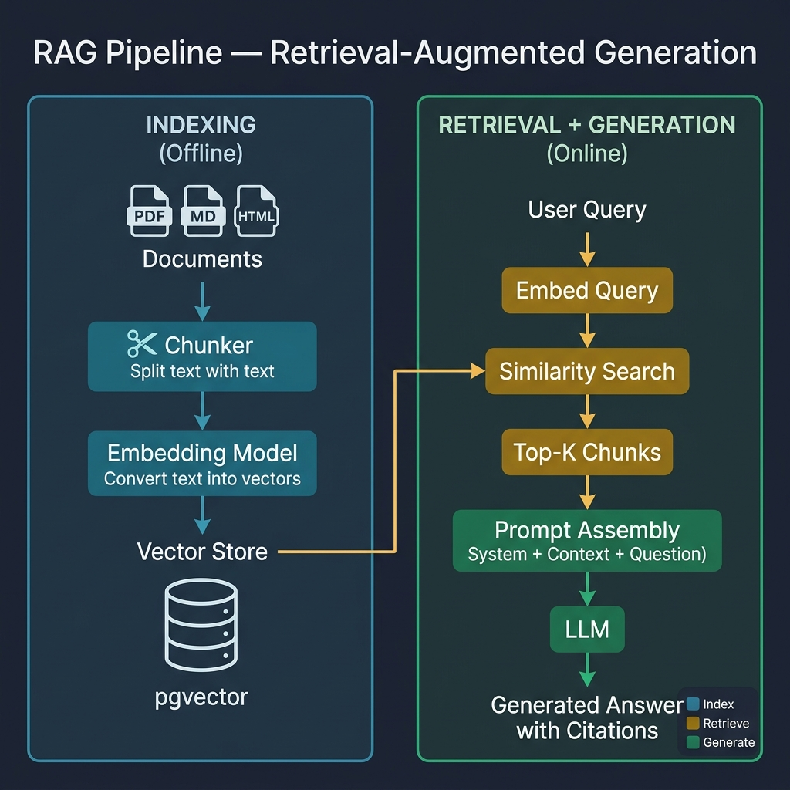

<!-- tags: llm, rag, retrieval-augmented-generation, vector-database, embedding -->
# 🔍 RAG — Retrieval-Augmented Generation

> RAG kết hợp sức mạnh retrieval (tìm kiếm) với generation (sinh text), giúp LLM trả lời chính xác dựa trên dữ liệu riêng thay vì chỉ dựa vào training data.

📅 Ngày tạo: 2026-03-27 · 🔄 Cập nhật: 2026-03-27 · ⏱️ 20 phút đọc

| Aspect         | Detail                                                     |
| -------------- | ---------------------------------------------------------- |
| **Complexity** | ⭐⭐⭐                                                       |
| **Use case**   | Q&A trên documents, Customer support, Code search          |
| **Keywords**   | Embedding, Vector DB, Chunking, Reranking, Hybrid Search   |

---

## 1. DEFINE

### RAG là gì?

RAG = **Retrieve** relevant documents + **Augment** prompt with context + **Generate** answer

Thay vì fine-tune model (tốn kém, lỗi thời nhanh), RAG cho phép LLM truy cập knowledge base real-time → giảm hallucination, cập nhật dễ dàng.

### RAG Pipeline Components

| Component           | Vai trò                                           | Tools phổ biến                       |
| ------------------- | ------------------------------------------------- | ------------------------------------- |
| **Document Loader** | Load docs từ nhiều nguồn                          | LangChain, Unstructured, PyPDF       |
| **Chunker**         | Chia document thành chunks nhỏ                    | RecursiveCharacterTextSplitter       |
| **Embedding Model** | Chuyển text → vector                              | OpenAI, Cohere, BGE, E5               |
| **Vector Store**    | Lưu + tìm kiếm vectors                           | pgvector, Pinecone, Qdrant, Weaviate |
| **Retriever**       | Tìm chunks relevant nhất                         | Similarity search, MMR, Hybrid       |
| **Reranker**        | Xếp hạng lại kết quả retrieval                   | Cohere Rerank, ColBERT, BGE-reranker |
| **Generator**       | LLM sinh response từ context                     | GPT-4, Claude, LLaMA                  |

### Chunking Strategies

| Strategy            | Mô tả                              | Khi nào dùng                     | Chunk size     |
| ------------------- | ----------------------------------- | -------------------------------- | -------------- |
| **Fixed Size**      | Cắt cố định N characters           | Simple, general purpose          | 500-1000 chars |
| **Recursive**       | Split by separators hierarchy       | Code, markdown, structured text  | 500-1500 chars |
| **Semantic**        | Split by meaning (embedding-based)  | Complex, multi-topic documents   | Varies         |
| **Sentence**        | Split by sentences                  | Narrative text, articles          | 3-5 sentences  |
| **Document**        | Giữ nguyên document boundaries     | Short documents, FAQs            | Full doc       |

Chunking strategies đã cover. Nhưng embedding selection cần benchmark — hãy chọn.

### Embedding Models So sánh

| Model                     | Dimensions | Context  | Cost     | Quality |
| ------------------------- | ---------- | -------- | -------- | ------- |
| **text-embedding-3-small** | 1536       | 8191     | $0.02/1M | Good    |
| **text-embedding-3-large** | 3072       | 8191     | $0.13/1M | Great   |
| **Cohere embed-v3**        | 1024       | 512      | $0.10/1M | Great   |
| **BGE-M3** (open)          | 1024       | 8192     | Free     | Great   |
| **E5-large-v2** (open)     | 1024       | 512      | Free     | Good    |

---

Các failure mode trên nghe dễ tránh. Nhưng có trap: chunk size quá lớn = context dilution, và embedding model mismatch = retrieval irrelevant. Trap đó sẽ xuất hiện ở PITFALLS.

## 2. VISUAL

RAG splits into two distinct workflows: an **offline indexing pipeline** that chunks documents and stores embeddings in a vector database, and an **online retrieval + generation pipeline** that finds relevant chunks and feeds them as context to the LLM.



*The indexing and retrieval pipelines must use the same embedding model — a mismatch here causes silent retrieval failures that are hard to debug.*

### RAG Architecture

```text
┌─────────────────────────────────────────────────────────────────┐
│                        RAG Pipeline                             │
│                                                                 │
│  ┌─ INDEXING (offline) ────────────────────────────────────┐    │
│  │                                                         │    │
│  │  📄 Documents    →  ✂️ Chunker    →  🧮 Embeddings      │    │
│  │  (PDF/MD/HTML)       (split)          (vectorize)       │    │
│  │                                           ↓             │    │
│  │                                    ┌──────────────┐     │    │
│  │                                    │ Vector Store │     │    │
│  │                                    │ (pgvector)   │     │    │
│  │                                    └──────────────┘     │    │
│  └─────────────────────────────────────────────────────────┘    │
│                                                                 │
│  ┌─ RETRIEVAL + GENERATION (online) ──────────────────────┐    │
│  │                                                         │    │
│  │  ❓ User Query                                          │    │
│  │       ↓                                                 │    │
│  │  🧮 Embed Query → 🔍 Similarity Search                  │    │
│  │                         ↓                               │    │
│  │                   Top-K Chunks (relevant context)       │    │
│  │                         ↓                               │    │
│  │              ┌─────────────────────┐                    │    │
│  │              │ Prompt:             │                    │    │
│  │              │ System: You are...  │                    │    │
│  │              │ Context: [chunks]   │  →  🤖 LLM → 💬   │    │
│  │              │ Question: [query]   │      Answer       │    │
│  │              └─────────────────────┘                    │    │
│  └─────────────────────────────────────────────────────────┘    │
└─────────────────────────────────────────────────────────────────┘
```

---

## 3. CODE

### 3.1 RAG with pgvector (PostgreSQL)

```sql
-- pgvector_setup.sql — Vector search trong PostgreSQL
-- ═══════════════════════════════════════════
-- Setup pgvector extension
-- ═══════════════════════════════════════════

CREATE EXTENSION IF NOT EXISTS vector;

CREATE TABLE documents (
    id          BIGSERIAL PRIMARY KEY,
    title       TEXT NOT NULL,
    content     TEXT NOT NULL,
    embedding   vector(1536),       -- ✅ OpenAI text-embedding-3-small
    metadata    JSONB DEFAULT '{}',
    chunk_index INT DEFAULT 0,
    source      TEXT,
    created_at  TIMESTAMPTZ DEFAULT NOW()
);

-- ✅ IVFFlat index (faster search, approximate)
CREATE INDEX idx_documents_embedding
ON documents USING ivfflat (embedding vector_cosine_ops)
WITH (lists = 100);

-- ✅ HNSW index (better recall, more memory)
CREATE INDEX idx_documents_embedding_hnsw
ON documents USING hnsw (embedding vector_cosine_ops)
WITH (m = 16, ef_construction = 64);

-- ═══════════════════════════════════════════
-- Semantic Search Query
-- ═══════════════════════════════════════════

-- ✅ Find top-5 similar documents (cosine similarity)
SELECT
    id,
    title,
    content,
    1 - (embedding <=> $1::vector) AS similarity  -- cosine similarity
FROM documents
WHERE 1 - (embedding <=> $1::vector) > 0.7        -- threshold
ORDER BY embedding <=> $1::vector
LIMIT 5;

-- ✅ Hybrid search: keyword + semantic
SELECT
    id,
    title,
    content,
    1 - (embedding <=> $1::vector) AS semantic_score,
    ts_rank(to_tsvector('english', content), plainto_tsquery($2)) AS keyword_score,
    -- ✅ Weighted hybrid score
    0.7 * (1 - (embedding <=> $1::vector)) +
    0.3 * ts_rank(to_tsvector('english', content), plainto_tsquery($2)) AS hybrid_score
FROM documents
WHERE to_tsvector('english', content) @@ plainto_tsquery($2)
   OR 1 - (embedding <=> $1::vector) > 0.5
ORDER BY hybrid_score DESC
LIMIT 10;
```

### 3.2 Full RAG Pipeline (Python)

```python
# rag_pipeline.py — Complete RAG implementation
from openai import OpenAI
import psycopg2
import json

client = OpenAI()

# ━━━ ✅ Step 1: Document Processing ━━━

def chunk_document(text: str, chunk_size: int = 1000, overlap: int = 200) -> list[str]:
    """Split document into overlapping chunks."""
    chunks = []
    start = 0
    while start < len(text):
        end = start + chunk_size
        # Tìm điểm cắt tự nhiên (end of sentence)
        if end < len(text):
            for sep in ['\n\n', '\n', '. ', '! ', '? ']:
                last_sep = text[start:end].rfind(sep)
                if last_sep > chunk_size * 0.5:
                    end = start + last_sep + len(sep)
                    break
        chunks.append(text[start:end].strip())
        start = end - overlap
    return chunks

# ━━━ ✅ Step 2: Embedding Generation ━━━

def get_embeddings(texts: list[str], model="text-embedding-3-small") -> list[list[float]]:
    """Batch embedding generation."""
    response = client.embeddings.create(input=texts, model=model)
    return [item.embedding for item in response.data]

# ━━━ ✅ Step 3: Store in pgvector ━━━

def store_chunks(conn, chunks: list[str], title: str, source: str):
    """Store document chunks with embeddings in pgvector."""
    embeddings = get_embeddings(chunks)

    with conn.cursor() as cur:
        for i, (chunk, embedding) in enumerate(zip(chunks, embeddings)):
            cur.execute("""
                INSERT INTO documents (title, content, embedding, chunk_index, source)
                VALUES (%s, %s, %s::vector, %s, %s)
            """, (title, chunk, embedding, i, source))
    conn.commit()

# ━━━ ✅ Step 4: Retrieval ━━━

def retrieve(conn, query: str, top_k: int = 5) -> list[dict]:
    """Retrieve most relevant chunks for a query."""
    query_embedding = get_embeddings([query])[0]

    with conn.cursor() as cur:
        cur.execute("""
            SELECT id, title, content,
                   1 - (embedding <=> %s::vector) AS similarity
            FROM documents
            WHERE 1 - (embedding <=> %s::vector) > 0.5
            ORDER BY embedding <=> %s::vector
            LIMIT %s
        """, (query_embedding, query_embedding, query_embedding, top_k))

        return [
            {"id": row[0], "title": row[1], "content": row[2], "similarity": row[3]}
            for row in cur.fetchall()
        ]

# ━━━ ✅ Step 5: Generate Answer ━━━

def rag_answer(conn, question: str) -> str:
    """Full RAG pipeline: retrieve → augment → generate."""
    # Retrieve
    chunks = retrieve(conn, question, top_k=5)

    if not chunks:
        return "Không tìm thấy thông tin liên quan trong knowledge base."

    # Build context
    context = "\n\n---\n\n".join([
        f"[Source: {c['title']} | Relevance: {c['similarity']:.2f}]\n{c['content']}"
        for c in chunks
    ])

    # Generate
    response = client.chat.completions.create(
        model="gpt-4o",
        messages=[
            {"role": "system", "content": f"""
You are a helpful assistant that answers questions based on the provided context.

Rules:
- ONLY use information from the context below
- If the context doesn't contain the answer, say "I don't have enough information"
- Cite sources when possible
- Be concise and accurate

Context:
{context}
"""},
            {"role": "user", "content": question},
        ],
        temperature=0.3,
    )

    return response.choices[0].message.content
```

### 3.3 RAG with Go

```go
// rag.go — Go RAG implementation with pgvector
package rag

import (
    "context"
    "fmt"
    "strings"

    "github.com/jackc/pgx/v5/pgxpool"
    "github.com/pgvector/pgvector-go"
)

type Document struct {
    ID         int64   `json:"id"`
    Title      string  `json:"title"`
    Content    string  `json:"content"`
    Similarity float64 `json:"similarity"`
}

type RAGService struct {
    db     *pgxpool.Pool
    llm    *LLMClient   // from 01-llm-fundamentals
}

func NewRAGService(db *pgxpool.Pool, llm *LLMClient) *RAGService {
    return &RAGService{db: db, llm: llm}
}

// Retrieve finds the top-k most relevant documents
func (s *RAGService) Retrieve(ctx context.Context, query string, topK int) ([]Document, error) {
    // Get query embedding from OpenAI
    embedding, err := s.llm.GetEmbedding(ctx, query)
    if err != nil {
        return nil, fmt.Errorf("get embedding: %w", err)
    }

    vec := pgvector.NewVector(embedding)
    rows, err := s.db.Query(ctx, `
        SELECT id, title, content,
               1 - (embedding <=> $1::vector) AS similarity
        FROM documents
        WHERE 1 - (embedding <=> $1::vector) > 0.5
        ORDER BY embedding <=> $1::vector
        LIMIT $2
    `, vec, topK)
    if err != nil {
        return nil, fmt.Errorf("query: %w", err)
    }
    defer rows.Close()

    var docs []Document
    for rows.Next() {
        var d Document
        if err := rows.Scan(&d.ID, &d.Title, &d.Content, &d.Similarity); err != nil {
            return nil, fmt.Errorf("scan: %w", err)
        }
        docs = append(docs, d)
    }
    return docs, nil
}

// Answer performs full RAG: retrieve → augment → generate
func (s *RAGService) Answer(ctx context.Context, question string) (string, error) {
    docs, err := s.Retrieve(ctx, question, 5)
    if err != nil {
        return "", err
    }

    if len(docs) == 0 {
        return "No relevant information found.", nil
    }

    // Build context from retrieved documents
    var contextParts []string
    for _, d := range docs {
        contextParts = append(contextParts,
            fmt.Sprintf("[Source: %s | Score: %.2f]\n%s", d.Title, d.Similarity, d.Content),
        )
    }
    context := strings.Join(contextParts, "\n\n---\n\n")

    system := fmt.Sprintf(`Answer based on context only. Cite sources.
If no answer found, say "I don't have enough information."

Context:
%s`, context)

    return s.llm.Chat(ctx, question, system)
}
```

---

Bạn đã đi qua RAG pipeline. Bây giờ đến phần nguy hiểm: chunk dilution và embedding mismatch — trap đã được setup từ đầu bài.

## 4. PITFALLS

| # | Lỗi | Hậu quả | Fix |
| - | --- | ------- | --- |
| 1 | Chunk size quá lớn | Embedding mất meaning, retrieval kém | 500-1000 chars, có overlap 10-20% |
| 2 | Không có overlap giữa chunks | Mất context ở ranh giới chunk | Overlap 100-200 chars |
| 3 | Dùng cosine similarity threshold quá thấp | Trả về noise, LLM bị confused | Threshold >= 0.7 cho cosine similarity |
| 4 | Embedding model và LLM không tương thích | Semantic mismatch | Dùng cùng vendor hoặc test cross-model |
| 5 | Không rerank kết quả retrieval | Top-K có thể chứa duplicates/noise | Thêm reranker (Cohere, cross-encoder) |
| 6 | Context window overflow | API error hoặc truncated context | Đếm tokens, limit chunks sao cho fit |
| 7 | Metadata không đủ | Không thể filter by source/date | Lưu metadata (source, date, category) cùng embedding |

---

Bạn đã đi qua RAG và cạm bẫy. Các resources dưới đây giúp đi sâu hơn.

## 5. REF

| Resource | Link |
| -------- | ---- |
| pgvector | [github.com/pgvector/pgvector](https://github.com/pgvector/pgvector) |
| LangChain RAG | [python.langchain.com/docs/tutorials/rag](https://python.langchain.com/docs/tutorials/rag) |
| OpenAI Embeddings Guide | [platform.openai.com/docs/guides/embeddings](https://platform.openai.com/docs/guides/embeddings) |
| MTEB Benchmark | [huggingface.co/spaces/mteb/leaderboard](https://huggingface.co/spaces/mteb/leaderboard) |

---

## 6. RECOMMEND

| Mở rộng | Khi nào | Lý do |
| ------- | ------- | ----- |
| **Hybrid Search** | Keyword + semantic | Tăng recall cho specific terms |
| **Reranking** | Top-K có noise | Cross-encoder reranker cải thiện precision |
| **GraphRAG** | Complex relationships | Knowledge graph + vector search |
| **Multi-modal RAG** | Images + text | Parse diagrams, charts cùng text |
| **Agentic RAG** | Complex queries | Agent decides what/when to retrieve |

---

← Previous: [Prompt Engineering](./02-prompt-engineering.md) · → Next: [Fine-Tuning](./04-fine-tuning.md)
