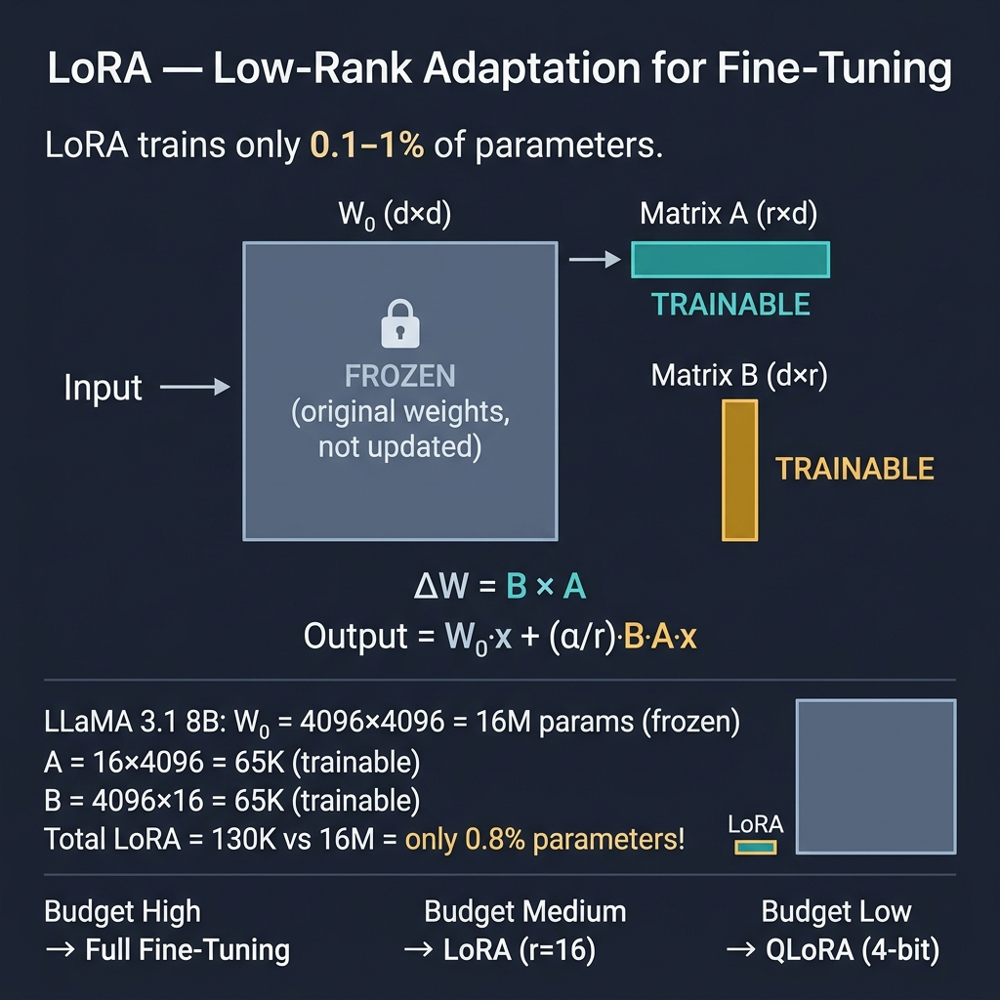

<!-- tags: llm, fine-tuning, lora, qlora, peft, training -->
# 🔧 Fine-Tuning & Training — Customize LLM cho domain riêng

> Khi prompt engineering và RAG không đủ, fine-tuning cho phép "dạy" model style, format, và domain knowledge riêng.

📅 Ngày tạo: 2026-03-27 · 🔄 Cập nhật: 2026-03-27 · ⏱️ 18 phút đọc

| Aspect         | Detail                                                     |
| -------------- | ---------------------------------------------------------- |
| **Complexity** | ⭐⭐⭐⭐                                                     |
| **Use case**   | Custom output style, domain adaptation, small model tuning |
| **Keywords**   | LoRA, QLoRA, PEFT, SFT, DPO, Dataset Preparation          |

---

## 1. DEFINE

### Khi nào cần Fine-Tuning?

| Scenario                       | Prompt Engineering | RAG   | Fine-Tuning |
| ------------------------------ | ------------------ | ----- | ----------- |
| Trả lời câu hỏi chung          | ✅                 | —     | —           |
| Cần domain knowledge cụ thể     | —                  | ✅    | —           |
| Cần output format/style riêng   | 🟡                 | —     | ✅          |
| Cần model nhỏ hơn, nhanh hơn    | —                  | —     | ✅          |
| Cần giảm hallucination          | 🟡                 | ✅    | ✅          |
| Data sensitivity (on-premise)   | —                  | —     | ✅          |

### Các phương pháp Fine-Tuning

| Method          | Mô tả                                           | Resources cần | Use case                    |
| --------------- | ------------------------------------------------ | ------------- | --------------------------- |
| **Full FT**     | Update tất cả parameters                         | GPU: 80GB+    | Maximum quality, full model |
| **LoRA**        | Low-Rank Adaptation — thêm trainable matrices    | GPU: 16-24GB  | Best balance quality/cost   |
| **QLoRA**       | LoRA + 4-bit quantization                        | GPU: 8-12GB   | Limited GPU budget          |
| **PEFT**        | Parameter-Efficient FT (umbrella term)           | GPU: 8-24GB   | General efficient FT        |
| **SFT**         | Supervised Fine-Tuning on instruction pairs       | Varies        | Instruction following       |
| **DPO**         | Direct Preference Optimization                   | Varies        | Alignment, quality control  |
| **API FT**      | OpenAI/Anthropic managed fine-tuning              | None (cloud)  | Fastest, no infra needed    |

Fine-tuning methods đã cover. Nhưng LoRA cần parameter efficiency — hãy hiểu.

### LoRA — Cách hoạt động

| Concept          | Giải thích                                                     |
| ---------------- | -------------------------------------------------------------- |
| **Rank (r)**     | Rank của low-rank matrices (4, 8, 16, 32) — cao hơn = nhiều params |
| **Alpha (α)**    | Scaling factor, thường = 2 × rank                               |
| **Target Modules** | Layers được apply LoRA (q_proj, v_proj, k_proj, o_proj)      |
| **Trainable %**  | Chỉ 0.1-1% parameters → tiết kiệm 10-100x memory              |

---

Các failure mode trên nghe cơ bản. Nhưng có trap: fine-tune trên noisy data = model hallucinate worse, và LoRA rank quá cao = overfitting. Trap đó sẽ xuất hiện ở PITFALLS.

## 2. VISUAL

LoRA freezes the original weight matrix and injects two tiny trainable matrices that capture task-specific adaptations. The result: you train only 0.1–1% of parameters while achieving quality close to full fine-tuning.



*The key insight: LoRA decomposes weight updates into low-rank matrices — same quality, 10-100x less memory.*

### Fine-Tuning Decision Tree

```text
❓ Bạn cần gì từ LLM?

├── Custom knowledge? → 🔍 RAG (không cần fine-tune)
│
├── Custom output format/style?
│   ├── Budget cao → Full Fine-Tuning
│   ├── Budget vừa → LoRA (r=16, α=32)
│   └── Budget thấp → QLoRA (4-bit)
│
├── Không có GPU?
│   ├── OpenAI Fine-Tuning API
│   └── Cloud GPU (RunPod, Lambda)
│
└── Need alignment/safety?
    └── DPO/RLHF after SFT
```

Fine-tuning methods đã cover. Nhưng LoRA cần parameter efficiency — hãy hiểu.

### LoRA Architecture

```text
Original Model                  LoRA Adapter
┌─────────────┐                ┌──────────┐
│             │                │          │
│  W (frozen) │  ←  Δ=B×A  ←  │  A (r×d) │  ← Trainable
│  (d × d)    │                │  B (d×r) │  ← Trainable
│             │                │  r << d  │
└─────────────┘                └──────────┘

Output = W·x + α/r · B·A·x

Example (LLaMA 3.1 8B):
- W: 4096×4096 = 16M params (frozen)
- A: 16×4096 = 65K params (trainable)
- B: 4096×16 = 65K params (trainable)
- Total LoRA: 130K vs 16M = 0.8% parameters!
```

---

## 3. CODE

### 3.1 Dataset Preparation

```python
# dataset_preparation.py — Chuẩn bị dataset cho fine-tuning

# ━━━ ✅ Format: OpenAI Fine-Tuning (JSONL) ━━━
import json

def create_training_data(examples: list[dict]) -> str:
    """Create JSONL format for OpenAI fine-tuning."""
    lines = []
    for ex in examples:
        entry = {
            "messages": [
                {"role": "system", "content": ex.get("system", "You are a helpful assistant.")},
                {"role": "user", "content": ex["input"]},
                {"role": "assistant", "content": ex["output"]},
            ]
        }
        lines.append(json.dumps(entry, ensure_ascii=False))
    return "\n".join(lines)

# ✅ Example: Code review dataset
examples = [
    {
        "system": "You are a Go code reviewer. Respond in Vietnamese.",
        "input": "Review this code:\n```go\nfunc getUser(id string) User {\n  row := db.QueryRow(`SELECT * FROM users WHERE id = '` + id + `'`)\n  var u User\n  row.Scan(&u.ID, &u.Name)\n  return u\n}\n```",
        "output": """🔴 **SQL Injection Critical**
- Dòng 2: String concatenation trong SQL query
- Fix: Dùng parameterized query `db.QueryRow("SELECT * FROM users WHERE id = $1", id)`

🟡 **Error Handling Missing**
- `row.Scan()` có thể return error (no rows, connection error)
- Fix: `if err := row.Scan(...); err != nil { return User{}, err }`

🟢 **SELECT * Anti-pattern**
- Specify explicit columns: `SELECT id, name FROM users`"""
    },
    # ... thêm 100+ examples tương tự
]

# Save
with open("training_data.jsonl", "w") as f:
    f.write(create_training_data(examples))

# ━━━ ✅ Format: Alpaca/LLaMA ━━━
def create_alpaca_dataset(examples: list[dict]) -> list[dict]:
    """Create Alpaca-style dataset for HuggingFace training."""
    return [
        {
            "instruction": ex.get("system", "") + "\n" + ex["input"],
            "input": "",
            "output": ex["output"],
        }
        for ex in examples
    ]
```

### 3.2 OpenAI Fine-Tuning (API)

```python
# openai_finetune.py — Managed fine-tuning via API
from openai import OpenAI

client = OpenAI()

# ━━━ ✅ Step 1: Upload training file ━━━
file = client.files.create(
    file=open("training_data.jsonl", "rb"),
    purpose="fine-tune"
)
print(f"File ID: {file.id}")

# ━━━ ✅ Step 2: Create fine-tuning job ━━━
job = client.fine_tuning.jobs.create(
    training_file=file.id,
    model="gpt-4o-mini-2024-07-18",   # ✅ Base model
    hyperparameters={
        "n_epochs": 3,                 # Number of training epochs
        "batch_size": "auto",
        "learning_rate_multiplier": "auto",
    },
    suffix="go-code-reviewer",         # ✅ Custom model name suffix
)
print(f"Job ID: {job.id}")

# ━━━ ✅ Step 3: Monitor progress ━━━
import time

while True:
    job = client.fine_tuning.jobs.retrieve(job.id)
    print(f"Status: {job.status}")
    if job.status in ["succeeded", "failed", "cancelled"]:
        break
    time.sleep(60)

# ━━━ ✅ Step 4: Use fine-tuned model ━━━
if job.status == "succeeded":
    model_id = job.fine_tuned_model  # ft:gpt-4o-mini-2024-07-18:org::go-code-reviewer
    response = client.chat.completions.create(
        model=model_id,
        messages=[
            {"role": "user", "content": "Review this Go code:\n```go\n...\n```"},
        ],
    )
    print(response.choices[0].message.content)
```

### 3.3 LoRA Fine-Tuning (Open Source)

```python
# lora_finetune.py — LoRA with Hugging Face + PEFT
import torch
from datasets import load_dataset
from transformers import (
    AutoModelForCausalLM,
    AutoTokenizer,
    TrainingArguments,
    BitsAndBytesConfig,
)
from peft import LoraConfig, get_peft_model, prepare_model_for_kbit_training
from trl import SFTTrainer

# ━━━ ✅ Step 1: Load model with 4-bit quantization (QLoRA) ━━━
model_name = "meta-llama/Llama-3.1-8B-Instruct"

bnb_config = BitsAndBytesConfig(
    load_in_4bit=True,
    bnb_4bit_quant_type="nf4",
    bnb_4bit_compute_dtype=torch.bfloat16,
    bnb_4bit_use_double_quant=True,
)

model = AutoModelForCausalLM.from_pretrained(
    model_name,
    quantization_config=bnb_config,
    device_map="auto",
    trust_remote_code=True,
)
tokenizer = AutoTokenizer.from_pretrained(model_name)
tokenizer.pad_token = tokenizer.eos_token

# ━━━ ✅ Step 2: Configure LoRA ━━━
lora_config = LoraConfig(
    r=16,                             # Rank (8, 16, 32)
    lora_alpha=32,                    # Scaling factor (usually 2×r)
    target_modules=[                  # Layers to apply LoRA
        "q_proj", "k_proj", "v_proj", "o_proj",
        "gate_proj", "up_proj", "down_proj",
    ],
    lora_dropout=0.05,
    bias="none",
    task_type="CAUSAL_LM",
)

model = prepare_model_for_kbit_training(model)
model = get_peft_model(model, lora_config)
model.print_trainable_parameters()
# trainable params: 13,631,488 || all params: 8,030,261,248 || trainable%: 0.17

# ━━━ ✅ Step 3: Load dataset ━━━
dataset = load_dataset("json", data_files="training_data_alpaca.json", split="train")

def format_prompt(example):
    return f"""### Instruction:
{example['instruction']}

### Response:
{example['output']}{tokenizer.eos_token}"""

# ━━━ ✅ Step 4: Training ━━━
training_args = TrainingArguments(
    output_dir="./lora-go-reviewer",
    num_train_epochs=3,
    per_device_train_batch_size=4,
    gradient_accumulation_steps=4,
    learning_rate=2e-4,
    weight_decay=0.01,
    warmup_ratio=0.03,
    lr_scheduler_type="cosine",
    logging_steps=10,
    save_strategy="epoch",
    fp16=True,
    report_to="wandb",               # Optional: W&B tracking
)

trainer = SFTTrainer(
    model=model,
    train_dataset=dataset,
    tokenizer=tokenizer,
    args=training_args,
    formatting_func=format_prompt,
    max_seq_length=2048,
)

trainer.train()

# ━━━ ✅ Step 5: Save & merge ━━━
trainer.save_model("./lora-go-reviewer/final")

# Merge LoRA weights with base model (for inference)
from peft import AutoPeftModelForCausalLM

merged = AutoPeftModelForCausalLM.from_pretrained(
    "./lora-go-reviewer/final",
    low_cpu_mem_usage=True,
)
merged = merged.merge_and_unload()
merged.save_pretrained("./merged-go-reviewer")
```

### 3.4 Evaluation

```python
# evaluation.py — Đánh giá model sau fine-tuning

from datasets import load_dataset

def evaluate_model(model, tokenizer, test_data, max_samples=50):
    """Evaluate fine-tuned model on test set."""
    results = []

    for sample in test_data[:max_samples]:
        # Generate
        inputs = tokenizer(
            format_prompt({"instruction": sample["instruction"], "output": ""}),
            return_tensors="pt"
        ).to(model.device)

        with torch.no_grad():
            outputs = model.generate(
                **inputs,
                max_new_tokens=512,
                temperature=0.1,
                do_sample=True,
            )

        generated = tokenizer.decode(outputs[0], skip_special_tokens=True)
        predicted = generated.split("### Response:")[-1].strip()

        results.append({
            "input": sample["instruction"],
            "expected": sample["output"],
            "predicted": predicted,
        })

    return results

# ✅ Metrics
def compute_metrics(results):
    """Simple evaluation metrics."""
    exact_match = sum(1 for r in results if r["expected"].strip() == r["predicted"].strip())
    return {
        "total": len(results),
        "exact_match": exact_match,
        "exact_match_rate": exact_match / len(results),
    }
```

---

Bạn đã đi qua fine-tuning. Bây giờ đến phần nguy hiểm: noisy data và LoRA overfitting — trap đã được setup từ đầu bài.

## 4. PITFALLS

| # | Lỗi | Hậu quả | Fix |
| - | --- | ------- | --- |
| 1 | Dataset quá nhỏ (<100 samples) | Overfit, không generalize | Minimum 200-500 ví dụ quality cao |
| 2 | Training quá nhiều epochs | Catastrophic forgetting | 1-3 epochs thường đủ, monitor loss |
| 3 | LoRA rank quá cao (r=128+) | Không efficient, giống full FT | r=8-32 cho hầu hết use cases |
| 4 | Dataset không đa dạng | Model chỉ hoạt động trên narrow cases | Cover edge cases, negative examples |
| 5 | Không eval trên test set | Không biết model tốt hay xấu | Tách 90/10 train/test, track metrics |
| 6 | Mix languages trong dataset | Confused model | Consistency: chọn 1 language chính |
| 7 | Quên benchmark trước fine-tune | Không có baseline để so sánh | Luôn eval base model trước |

---

Bạn đã đi qua Fine-Tuning và cạm bẫy. Các resources dưới đây giúp đi sâu hơn.

## 5. REF

| Resource | Link |
| -------- | ---- |
| LoRA Paper | [arxiv.org/abs/2106.09685](https://arxiv.org/abs/2106.09685) |
| QLoRA Paper | [arxiv.org/abs/2305.14314](https://arxiv.org/abs/2305.14314) |
| HuggingFace PEFT | [huggingface.co/docs/peft](https://huggingface.co/docs/peft) |
| OpenAI Fine-tuning | [platform.openai.com/docs/guides/fine-tuning](https://platform.openai.com/docs/guides/fine-tuning) |
| TRL Library | [huggingface.co/docs/trl](https://huggingface.co/docs/trl) |

---

## 6. RECOMMEND

| Mở rộng | Khi nào | Lý do |
| ------- | ------- | ----- |
| **DPO** | Sau SFT, cần alignment | Preference optimization không cần reward model |
| **Unsloth** | Speed up LoRA training | 2-5x faster training trên single GPU |
| **Merging** | Nhiều LoRA adapters | Merge experts cho multi-task model |
| **GGUF export** | Inference trên CPU | Quantized format cho llama.cpp/Ollama |
| **Synthetic Data** | Ít training data | Dùng GPT-4 generate training pairs |

---

← Previous: [RAG](./03-rag.md) · → Next: [Deployment & Inference](./05-deployment-inference.md)
