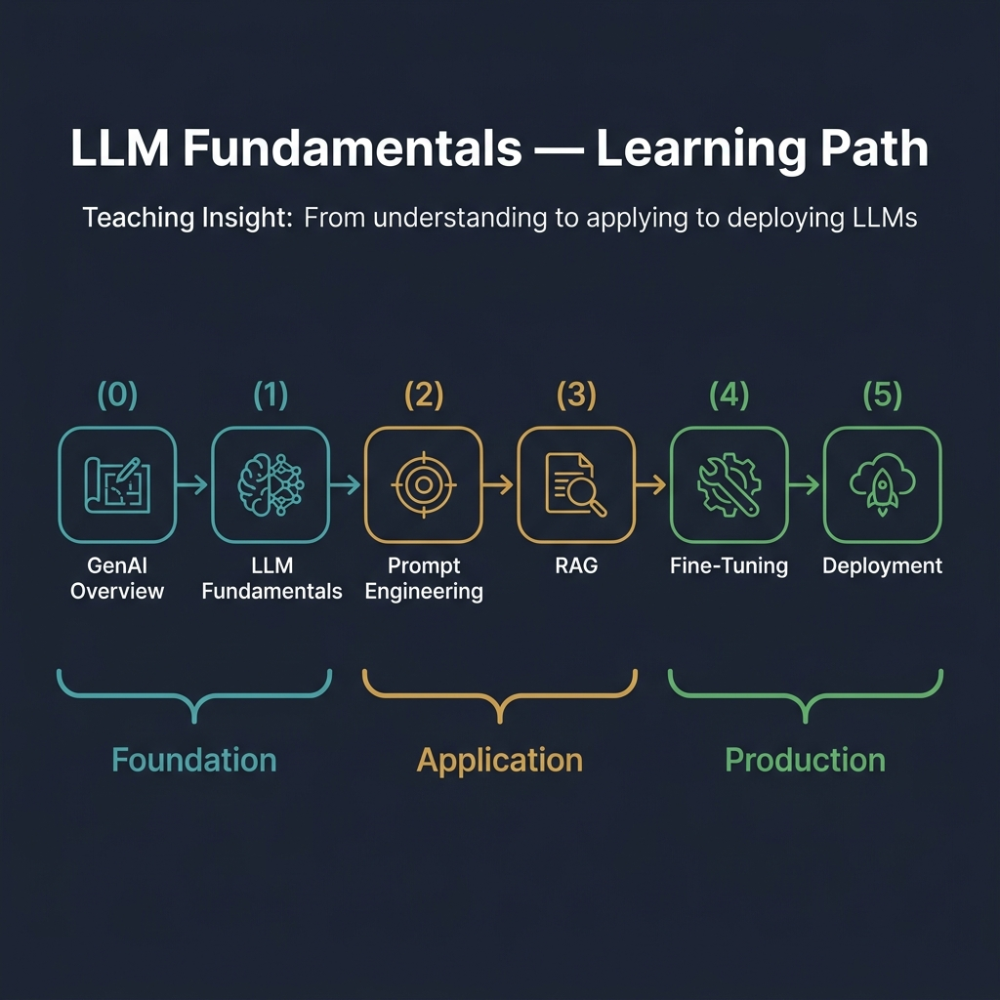

<!-- tags: llm, fundamentals, transformer, prompt-engineering, rag, fine-tuning, deployment, overview -->
# 🧠 LLM Fundamentals — From Transformer to Production

📅 Created: 2026-04-21 · 🔄 Updated: 2026-04-21

> Everything a software engineer needs to understand and deploy Large Language Models — from how the Transformer architecture predicts the next token, to prompting techniques that cost nothing, to RAG pipelines that ground outputs in facts, to fine-tuning when prompting is not enough, and finally to serving models at production scale.

---

## Learning Path

The six modules progress through three phases: **Foundation** (understand the model), **Application** (use the model effectively), and **Production** (deploy and operate the model).



*Start at the top and work your way down. Each module builds on the one before it — but you can jump to any module if you already have the prerequisites.*

---

## Module Index

### 🏗️ Foundation — Understanding How LLMs Work

| # | Module | Complexity | What You Learn |
|---|--------|:----------:|----------------|
| 00 | [GenAI System Design Overview](./00-genai-system-design-overview.md) | ⭐⭐⭐⭐ | The 7-step ML system design framework: requirements → problem framing → data → model → evaluation → system design → deployment. Scaling laws, discriminative vs. generative models, and risks. |
| 01 | [LLM Fundamentals](./01-llm-fundamentals.md) | ⭐⭐⭐ | Transformer architecture (self-attention, multi-head attention, FFN), tokenization (BPE, WordPiece, SentencePiece), embeddings, context windows, and the major LLM comparison table. |

### 🎯 Application — Using LLMs Effectively

| # | Module | Complexity | What You Learn |
|---|--------|:----------:|----------------|
| 02 | [Prompt Engineering](./02-prompt-engineering.md) | ⭐⭐ | System/user/assistant prompt structure. Zero-shot, few-shot, chain-of-thought, tree-of-thought, ReAct. Prompt templates, optimization, and self-verification patterns. |
| 03 | [RAG (Retrieval-Augmented Generation)](./03-rag.md) | ⭐⭐⭐ | Full RAG pipeline: document loading → chunking → embedding → vector store (pgvector) → retrieval → reranking → generation. Hybrid search (keyword + semantic). |

### 🚀 Production — Deploying and Operating LLMs

| # | Module | Complexity | What You Learn |
|---|--------|:----------:|----------------|
| 04 | [Fine-Tuning & Training](./04-fine-tuning.md) | ⭐⭐⭐⭐ | When to fine-tune vs. prompt vs. RAG. Full fine-tuning, LoRA, QLoRA, PEFT, SFT, DPO. Dataset preparation, OpenAI API fine-tuning, and open-source LoRA with Hugging Face. |
| 05 | [Deployment & Inference](./05-deployment-inference.md) | ⭐⭐⭐⭐ | Quantization (FP16/INT8/INT4/AWQ/GPTQ), serving frameworks (vLLM, Ollama, llama.cpp, TGI), LLM API gateway in Go, Docker Compose self-hosted stack, cost optimization strategies. |

---

## Technology Stack Across Modules

| Module | Primary Language | Key Libraries / Tools |
|--------|:----------------:|----------------------|
| GenAI Overview | Go | Struct-based requirements modeling |
| LLM Fundamentals | Python + Go | tiktoken, transformers, OpenAI SDK |
| Prompt Engineering | Python | OpenAI SDK, string.Template |
| RAG | SQL + Python + Go | pgvector, OpenAI Embeddings, pgx |
| Fine-Tuning | Python | PEFT, LoRA, trl, bitsandbytes, OpenAI Fine-tuning API |
| Deployment | Bash + Python + Go | Ollama, vLLM, Docker Compose |

---

## Decision Guide — When to Use What

```text
Need to improve LLM output?
│
├── Is the knowledge up-to-date and domain-specific?
│   └── YES → RAG (Module 03)
│
├── Is the output format/style wrong?
│   └── YES → Prompt Engineering first (Module 02)
│         └── Still not enough? → Fine-Tuning (Module 04)
│
├── Is the model too slow or too expensive?
│   └── YES → Quantization + Model Routing (Module 05)
│
└── Do you need the model on your own infrastructure?
    └── YES → Self-hosted Deployment (Module 05)
```

---

## How to Use This Suite

1. **Linear path**: Read modules 00 → 05 for a complete understanding
2. **Just need to use LLMs**: Start at Module 02 (Prompt Engineering)
3. **Building a knowledge base app**: Jump to Module 03 (RAG)
4. **Need custom model behavior**: Module 04 (Fine-Tuning)
5. **Production deployment**: Module 05 (Deployment & Inference)
6. **Interview prep**: Module 00 gives you the system design framework; each subsequent module fills in the technical depth

---

## Related

| Resource | Link |
|----------|------|
| GenAI System Design Interview (11 chapters) | [../genai-system-design/](../genai-system-design/) |
| Parent LLM Documentation Hub | [../README.md](../README.md) |

---

← Back to [LLM Documentation](../README.md)
