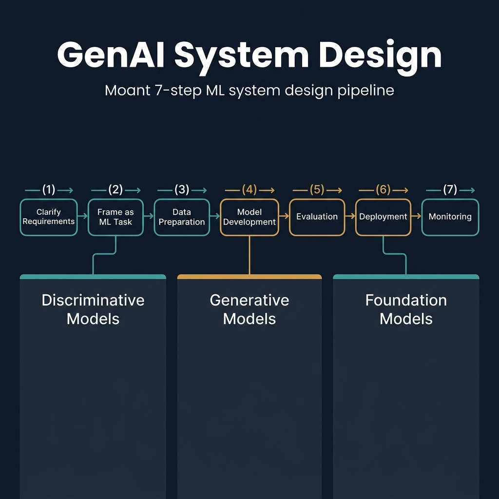
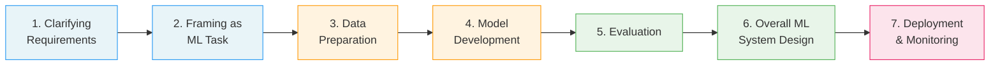

<!-- tags: genai, system-design, ml, llm, overview -->
# 🧠 Introduction and Overview — GenAI System Design

📅 Created: 2026-04-21 · 🔄 Updated: 2026-04-21 · ⏱️ 18 min read

> Building GenAI systems requires far more than training a model. This chapter lays the foundation — from discriminative vs. generative models to a seven-step framework you can carry into any ML system design interview.

| Aspect | Detail |
|--------|--------|
| **Scope** | GenAI fundamentals + ML system design interview framework |
| **Audience** | ML engineers, data scientists, system design interviewees |
| **Prerequisites** | Basic ML concepts, familiarity with neural networks |

---

## 1. DEFINE

Imagine you are sitting in a system design interview. The interviewer says: *"Design an AI-powered image editing tool."* You know diffusion models exist. You know about GANs. But how do you go from that vague prompt to a complete system — with data pipelines, evaluation loops, deployment strategies, and monitoring?

Most engineers freeze here. They jump straight into model architecture, skip requirements, ignore data preparation, and forget evaluation entirely. The result is a disjointed answer that never forms a coherent system.

That gap — between knowing ML algorithms and designing ML *systems* — is exactly what this chapter bridges.

### 1.1 What Are AI, ML, and GenAI?

**Artificial Intelligence (AI)** is the broad field of creating systems that perform tasks requiring human intelligence: reasoning, planning, problem-solving. **Machine Learning (ML)** is the subset that learns patterns from data rather than following predefined rules.

ML models split into two families:

- **Discriminative models** learn the boundary between classes. They model P(Y|X) — the probability of a target Y given input X. Think fraud detection classifying transactions as legitimate or fraudulent.
- **Generative models** learn the underlying data distribution P(X) or the joint distribution P(X, Y). They can create new data instances that resemble the training data — new faces, new text, new music.

Common discriminative algorithms include logistic regression, SVMs, decision trees, KNN, and neural networks. They predict or classify but cannot generate new samples.

### 1.2 Classical vs. Modern Generative Models

Classical generative algorithms — Naive Bayes, Gaussian Mixture Models, Hidden Markov Models, Boltzmann machines — handle structured data well but struggle with complex, unstructured inputs.

Modern generative algorithms changed the game:

| Algorithm | Mechanism | Primary Use |
|-----------|-----------|-------------|
| **VAEs** | Encode to latent space, decode to reconstruct | Image generation, representation learning |
| **GANs** | Generator vs. discriminator adversarial training | Realistic image synthesis |
| **Diffusion models** | Learn reverse denoising process | High-quality image and video generation |
| **Autoregressive models** | Predict next element from preceding ones | Text generation, time series |

### 1.3 Why GenAI Is Gaining Popularity

Two forces drive GenAI's rise. First, **versatility**: a single model can generate text, create images, compose music, and write code. This cross-domain capability makes GenAI valuable from healthcare to entertainment.

Second, **productivity amplification**. McKinsey predicts GenAI will enable labor productivity growth of 0.1–0.6% annually through 2040. Tools like ChatGPT already assist with drafting, answering complex questions, and code generation.

### 1.4 Three Pillars of GenAI Power

Three factors explain why GenAI models have become so capable:

**Data.** Self-supervised learning lets models train on unlabeled internet data — no expensive annotation required. Meta's Llama 3 trained on 15 trillion tokens (~50 TB). Google's Flamingo used 1.8 billion image-text pairs. A human reading nonstop at 250 words per minute would need 85,000 years to read Llama 3's training data.

**Model capacity.** Measured by parameter count and FLOPs. Google's PaLM has 540B parameters. Meta's Llama 3 has 405B. More parameters mean greater ability to capture complex patterns — provided sufficient training data exists.

**Compute.** Training PaLM-2 required 10²² FLOPs. A single Nvidia H100 GPU delivers ~60 TFLOP/s, completing ~5.18 EFLOPs per day. Training PaLM-2 on one H100 would take 5.5 years. Sam Altman stated GPT-4's training cost exceeded $100 million.

### 1.5 Scaling Laws

Within a fixed compute budget, what combination of model size and data size yields the lowest loss?

OpenAI's 2020 research revealed that scaling model size, dataset size, or compute produces predictable improvements following a **power-law trend**. Architecture variations matter far less than scale.

DeepMind extended this in 2022, finding that many LLMs were undertrained — data should scale linearly with model size for optimal performance.

### 1.6 Risks and Limitations

GenAI brings critical risks that system designers must address:

- **Ethical concerns**: bias, IP issues, misinformation, deepfake misuse
- **Environmental impact**: massive energy consumption and carbon emissions
- **Model limitations**: hallucination, lack of true reasoning, factual inaccuracies
- **Security risks**: phishing automation, adversarial attacks, deepfake blackmail

Addressing these requires technical solutions, ethical frameworks, and legal regulations working together.

---

The definition is clear: GenAI generates new data by learning underlying distributions. But knowing what GenAI *is* only gets you halfway through an interview. The real challenge is designing a complete system around it.

---

## 2. VISUAL

*The seven-step ML system design pipeline flows left-to-right: Clarify Requirements → Frame as ML Task → Data Preparation → Model Development → Evaluation → Deployment → Monitoring. Below, the three pillars of GenAI — Discriminative, Generative, and Foundation Models — ground the framework in architectural choices.*

*The seven-step ML system design framework. Steps 1–2 define the problem. Steps 3–4 build the solution. Steps 5–7 validate, integrate, and ship it.*

Each step builds on the previous one. Skip clarifying requirements and you'll design the wrong system. Skip evaluation and you'll ship a model that hallucinates in production.

---

## 3. CODE

The framework has seven steps. Each step has specific talking points and design decisions. Let's walk through them as you would in an actual interview.

### 3.1 Step 1: Clarifying Requirements

Every ML system design starts with questions — not answers.

**Functional requirements** describe *what* the system does. "Generate an image and customize its style based on the user's prompt" is a functional requirement for a text-to-image system.

**Non-functional requirements** describe *how* it performs: latency, throughput, fairness, security, scalability.

Key questions to ask:

| Category | Example Questions |
|----------|-------------------|
| **Business objective** | Will this captioning system serve e-commerce descriptions or social media captions? |
| **System features** | Can users provide feedback on generated images? Which languages must the LLM support? |
| **Data** | What data sources exist? How large is the dataset? Is it labeled? |
| **Constraints** | Cloud-based or on-device? What compute budget? |
| **Scale** | How many users? What's the expected growth? |
| **Performance** | Real-time generation required? Quality vs. speed priority? |

By the end of this step, you and the interviewer should be aligned on scope.

### 3.2 Step 2: Framing the Problem as an ML Task

You cannot simply "ask AI to summarize emails." You need to frame the problem so ML techniques can address it.

**Step 2a — Define input and output.** Identify the data modality (text, image, audio, video) for both input and output. A chatbot takes text input and produces text output. An image captioning system takes image input and produces text output.

**Step 2b — Choose a suitable ML approach.** Follow this decision tree:

1. **Discriminative vs. generative?** If the output is a class label → discriminative. If the output is new content → generative.
2. **Identify the task type.** Classification, regression, text generation, image generation, audio synthesis, or video generation.
3. **Select the algorithm.** Compare options by considering input modality support, efficiency, and quality trade-offs.

For a text-to-image system, the algorithm must process text input and generate image output. VAEs and GANs can generate images but may not handle text conditioning well. Diffusion models with text encoders handle this naturally.

### 3.3 Step 3: Data Preparation

ML models learn from data. The data preparation strategy differs fundamentally between traditional ML and GenAI.

**Traditional ML** works with structured data through two pipelines:
- *Data engineering*: ETL processes — extract, transform, load
- *Feature engineering*: selecting and transforming predictive features using stores like Tecton or Amazon SageMaker

**GenAI** works primarily with unstructured data. The focus shifts to:

**Data collection.** Advanced models need massive datasets. Llama 3 trained on 15 trillion tokens from web scraping. Synthetic data from existing models can augment training sets — but risks quality degradation and distribution gaps.

**Data cleaning.** Internet data is noisy. Essential cleaning steps include:
- Harm and NSFW content detection
- Low-quality content filtering
- Deduplication
- Bias detection and mitigation

**Data efficiency.** Storing and retrieving massive datasets requires distributed storage (HDFS, S3), columnar formats (Parquet, ORC), sharding, indexing (Elasticsearch), and caching.

### 3.4 Step 4: Model Development

Model development has three components: architecture, training, and sampling.

**Architecture.** Different algorithms offer multiple architecture choices. Diffusion models can use U-Net or DiT. Discuss the layers, how input transforms to output, and trade-offs between architectures.

The **Transformer** is the cornerstone of modern GenAI. At its core is **self-attention** (scaled dot-product attention):

$$\text{Attention}(Q, K, V) = \text{softmax}\left(\frac{QK^T}{\sqrt{d_K}}\right)V$$

where Q, K, V are derived from input embeddings X via learned weight matrices. Multi-head attention extends this by computing multiple attention heads in parallel, capturing different relationship types simultaneously.

**Training.** Key considerations include:
- *Training methodology*: diffusion denoising, adversarial training, multi-stage LLM training (pretrain → fine-tune → align)
- *Training data*: source, size, and per-stage differences (Common Crawl for pretraining vs. curated data for alignment)
- *Loss function*: measures prediction-target alignment; next-token prediction for LLMs, reconstruction loss for VAEs
- *Efficiency techniques*: gradient checkpointing (save memory), mixed precision training (speed + memory), distributed training (scale)

**Distributed training** uses three parallelism strategies:

| Strategy | What's Split | When to Use |
|----------|-------------|-------------|
| **Data parallelism** | Dataset across GPUs, full model on each | Large datasets, model fits in one GPU |
| **Pipeline parallelism** | Model layers across GPUs | Very deep models |
| **Tensor parallelism** | Single-layer operations across GPUs | Single layer too large for one GPU |
| **Hybrid** | Combines data + model parallelism | Largest models (GPT-4, Llama 3) |

**Sampling.** After training, generate outputs using methods like greedy search, beam search, top-k, or top-p sampling. Each balances coherence against diversity.

### 3.5 Step 5: Evaluation

Evaluation splits into two categories:

**Offline evaluation** uses held-out test data before deployment. For GenAI, common metrics include:
- *BLEU* and *ROUGE*: measure overlap between generated and reference text
- *FID (Fréchet Inception Distance)*: compares generated and real image distributions
- *Human evaluation*: judges rate quality, relevance, and safety

**Online evaluation** measures real-world performance after deployment:
- A/B testing: compare model versions with real users
- Click-through rate, engagement, user satisfaction scores
- Safety and bias monitoring in production

### 3.6 Step 6: Overall ML System Design

This step integrates all components into a cohesive system architecture. Consider:
- How data pipelines feed into training and serving
- Model versioning and experiment tracking
- API design for model serving
- Caching strategies for repeated queries
- Fallback mechanisms when the model fails

### 3.7 Step 7: Deployment and Monitoring

Deployment brings the model to users. Key topics include:
- *Serving infrastructure*: GPU clusters, model optimization (quantization, distillation)
- *Scaling*: auto-scaling based on traffic
- *Monitoring*: track latency, error rates, output quality degradation
- *Data drift detection*: alert when input distributions shift
- *Model updates*: versioning, canary deployments, rollback strategies

---

## 4. PITFALLS

| # | Severity | Mistake | Consequence | Fix |
|---|----------|---------|-------------|-----|
| 1 | 🔴 Fatal | Jumping to model architecture without clarifying requirements | Design the wrong system; waste the entire interview | Always start with Step 1. Spend 5–8 minutes on requirements |
| 2 | 🔴 Fatal | Ignoring evaluation entirely | Ship a model that hallucinates or produces unsafe content | Define both offline metrics and online monitoring before deployment |
| 3 | 🟡 Common | Treating the model as the entire system | Miss data pipelines, serving infra, monitoring, and feedback loops | Use the seven-step framework to ensure completeness |
| 4 | 🟡 Common | Using only automated metrics for GenAI evaluation | Automated metrics miss nuance — BLEU score doesn't capture creativity or safety | Combine automated metrics with human evaluation |
| 5 | 🟡 Common | Assuming one parallelism strategy fits all | Data parallelism alone fails when model exceeds GPU memory | Match parallelism to model size: data for small, tensor/pipeline for large, hybrid for massive |
| 6 | 🔵 Minor | Overlooking synthetic data quality | Model inherits biases and errors from the generator | Validate synthetic data against real-world distributions before training |

### 🔴 Pitfall #1 — Designing Without Requirements

This mistake kills more interview answers than any technical gap. An engineer hears "design an image generation system" and immediately starts discussing diffusion model architecture.

The interviewer wanted to know: Is this for professional designers or casual social media users? Desktop or mobile? Real-time or batch? High resolution or thumbnails?

Each answer changes the architecture fundamentally. Without requirements, every subsequent decision is a guess.

**Fix**: Treat Step 1 as mandatory. Write down the agreed requirements before moving forward.

---

## 5. REF

| Resource | Type | Link | Notes |
|----------|------|------|-------|
| OpenAI Scaling Laws (Kaplan et al., 2020) | Research Paper | [arxiv.org/abs/2001.08361](https://arxiv.org/abs/2001.08361) | Power-law relationship between scale and performance |
| Chinchilla (Hoffmann et al., 2022) | Research Paper | [arxiv.org/abs/2203.15556](https://arxiv.org/abs/2203.15556) | Optimal data-to-model-size ratio |
| Attention Is All You Need (Vaswani et al., 2017) | Research Paper | [arxiv.org/abs/1706.03762](https://arxiv.org/abs/1706.03762) | Transformer architecture origin |
| ByteByteGo GenAI System Design Interview | Course | [bytebytego.com](https://bytebytego.com/courses/genai-system-design-interview/introduction-and-overview) | Source material for this chapter |
| McKinsey GenAI Productivity Report | Industry Report | [mckinsey.com](https://www.mckinsey.com/capabilities/mckinsey-digital/our-insights/the-economic-potential-of-generative-ai-the-next-productivity-frontier) | Economic impact projections |
| Llama 3 Technical Report (Meta, 2024) | Technical Report | [ai.meta.com](https://ai.meta.com/research/publications/the-llama-3-herd-of-models/) | Training data scale and methodology |

---

## 6. RECOMMEND

You now have the complete seven-step framework for ML system design interviews. But a framework is only useful when applied to real problems. Each subsequent chapter takes one GenAI application — from Gmail Smart Compose to text-to-video generation — and walks through the entire framework.

| Next Step | When | Why | Link |
|-----------|------|-----|------|
| Gmail Smart Compose | Start here for text-focused GenAI | Real-world autoregressive text generation at scale | [→ 02-gmail-smart-compose.md](./02-gmail-smart-compose.md) |
| Google Translate | After Smart Compose | Sequence-to-sequence with encoder-decoder architecture | [→ 03-google-translate.md](./03-google-translate.md) |
| ChatGPT Personal Assistant | After Translate | LLM system design with RLHF alignment | [→ 04-chatgpt-personal-assistant.md](./04-chatgpt-personal-assistant.md) |
| RAG (Retrieval-Augmented Generation) | When knowledge grounding matters | Combining retrieval with generation for factual accuracy | [→ 06-retrieval-augmented-generation.md](./06-retrieval-augmented-generation.md) |

**Navigation**: [← Back to Hub](./README.md) · [→ Next: Gmail Smart Compose](./02-gmail-smart-compose.md)
