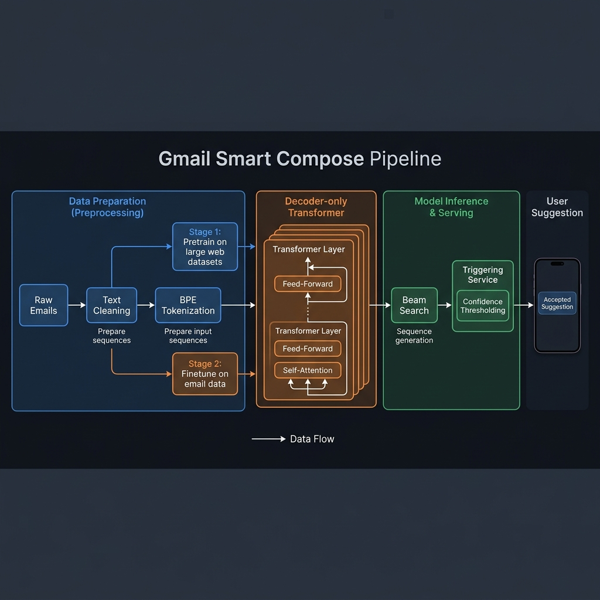
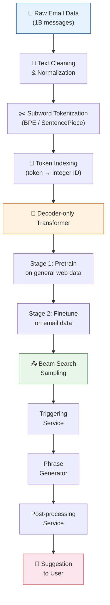

<!-- tags: genai, system-design, smart-compose, transformer, text-generation -->
# ✉️ Gmail Smart Compose — Real-Time Text Generation at Scale

📅 Created: 2026-04-21 · 🔄 Updated: 2026-04-21 · ⏱️ 22 min read

> Gmail's Smart Compose predicts the next few words as you type an email. Behind that seamless autocomplete lies a decoder-only Transformer trained on billions of emails — a clean case study in applying the seven-step ML system design framework to production text generation.

| Aspect | Detail |
|--------|--------|
| **Scope** | End-to-end system design for email autocompletion |
| **Architecture** | Decoder-only Transformer with beam search |
| **Scale** | 1.8B users, ≤100ms latency, ~1B training emails |
| **Prerequisites** | [Introduction and Overview](./01-introduction-and-overview.md) |

---

## 1. DEFINE

*(Prerequisite: [Introduction and Overview](./01-introduction-and-overview.md))*

You are composing an email. You type "Hi Alex, I hope you" — and before your fingers reach the next key, a gray suggestion appears: "are doing well." You press Tab. Four words saved. Multiply that by the 1.8 billion Gmail users sending up to 500 emails per day, and the productivity impact becomes enormous.

But building this feature is harder than it looks. The model must generate suggestions in under 100 milliseconds — imperceptible to the user. It must avoid biased assumptions. It must handle partial context and still produce useful completions. And it must know when *not* to suggest — because a premature or irrelevant suggestion is worse than no suggestion at all.

### 1.1 Clarifying Requirements

A well-scoped design starts with the right questions. Here are the key requirements for Smart Compose:

| Requirement | Detail |
|-------------|--------|
| **Personalization** | Not included for simplicity |
| **Confidence gating** | Show suggestions only when model confidence is high |
| **Training data** | ~1 billion email messages |
| **Context scope** | Email body as primary input; expand to subject, recipient, thread if time permits |
| **Language** | English only |
| **Bias control** | System must not make biased assumptions |
| **Latency** | ≤100ms — suggestions must appear before the user types them |
| **Scale** | 1.8B users, up to 500 emails/user/day |

### 1.2 Framing as an ML Task

The input is a sequence of words the user has typed. The output is a continuation of that sequence. This is a **text generation** task.

Two architectures handle sequential data: RNNs and Transformers.

| Feature | RNN (GRU, LSTM) | Transformer |
|---------|-----------------|-------------|
| **Training efficiency** | Inefficient — sequential processing | Efficient — parallel processing |
| **Long sequences** | Struggles with long-range dependencies | Handles long sequences via self-attention |
| **Scalability** | Limited | Highly scalable |
| **Applications** | Simple tasks (time series) | Complex tasks (language completion, translation) |

Transformers win on every dimension that matters for Smart Compose. Self-attention processes all input tokens simultaneously, and the architecture scales to billions of parameters.

One trade-off: self-attention has O(n²) complexity where n is sequence length. For email completion, sequences are short enough that this cost is manageable. For longer contexts, techniques like Group Attention and Flash Attention reduce the cost.

---

The choice is made: a Transformer-based model for text generation. But before any model can learn to write emails, we need to transform raw text into something a neural network can process.

---

## 2. VISUAL

*Gmail Smart Compose end-to-end pipeline — from raw emails through BPE tokenization, decoder-only Transformer, beam search, to user suggestion display.*

*The complete Smart Compose pipeline — from raw email data through two-stage training to real-time suggestion delivery. Data preparation (blue) feeds model development (orange), which drives serving (green) and user-facing output (red).*

Each stage introduces specific design decisions. Data cleaning determines what the model learns. Tokenization determines how it represents language. The two-stage training strategy determines how quickly it adapts to email-specific patterns.

---

## 3. CODE

### 3.1 Data Preparation — From Raw Text to Numbers

ML models require numerical input. Converting raw email text into a sequence of integers requires two steps: cleaning and tokenization.

**Text cleaning** removes noise that would degrade model performance:

| Step | Purpose | Example |
|------|---------|---------|
| Remove non-English text | Language filtering | Use language identification to filter |
| Remove confidential info | Privacy protection | Replace `john@gmail.com` → `##@gmail.com` |
| Remove irrelevant symbols | Noise reduction | Strip `©`, `™`, emojis that don't carry meaning |
| Deduplicate | Prevent bias | Remove identical text from multiple sources |

**Text normalization** standardizes format — converting `(123) 456-7890`, `123.456.7890`, and `123-456-7890` into a single canonical form.

**Tokenization** splits text into processable units. Three levels exist:

| Level | Granularity | Vocab Size | Trade-off |
|-------|------------|------------|-----------|
| **Character** | Individual characters | ~100 | Simple but poor semantic representation |
| **Word** | Whole words | ~300,000+ | Rich semantics but massive vocabulary |
| **Subword** | Meaningful fragments | ~50,000–150,000 | Best balance — handles unseen words via decomposition |

Subword tokenization wins. It decomposes rare words into known fragments ("unhappily" → "unhappy" + "ly") while keeping frequent words intact. GPT-4 uses BPE (Byte-Pair Encoding); Gemini uses SentencePiece. We adopt subword-level tokenization for Smart Compose.

After tokenization, **token indexing** maps each token to a unique integer via a vocabulary lookup table. The result: raw email text becomes a sequence of integers ready for the Transformer.

### 3.2 Model Architecture — Decoder-Only Transformer

Three Transformer variations exist:

| Variation | Mechanism | Use Case | Examples |
|-----------|-----------|----------|----------|
| **Encoder-only** | Processes input as whole, predicts about it | Classification, NER | BERT, RoBERTa |
| **Decoder-only** | Generates sequence one token at a time | Text generation | GPT-4, LLaMA, Gemini |
| **Encoder-decoder** | Encodes input, decodes to transformed output | Translation, summarization | T5, BART |

Smart Compose generates text completions. A **decoder-only Transformer** is the natural fit.

The decoder-only Transformer has four components:

**1. Text Embedding.** Converts token IDs into dense, fixed-length vectors. Token IDs are arbitrary integers — embeddings learned during training capture semantic relationships. "Happy" and "joyful" end up near each other in embedding space; "happy" and "car" do not.

**2. Positional Encoding.** Transformers have no inherent notion of word order — the attention mechanism is permutation-invariant. Positional encoding injects position information so the model distinguishes "initialize the variable, then use it" from "use the variable, then initialize it."

Two approaches:
- **Fixed** (sine-cosine): No extra parameters, generalizes to unseen lengths. Used in the original Transformer paper.
- **Learned**: Optimized during training for task-specific performance, but risks overfitting to training-time sequence lengths.

We use **fixed positional encoding** for Smart Compose — efficient and generalizes well to varying email lengths.

**3. Transformer Blocks.** A stack of identical blocks, each containing:
- *Self-attention*: Each embedding attends to all preceding embeddings, capturing contextual relationships across the sequence.
- *Feed-forward network*: Two linear transformations with ReLU activation, applied independently to each position.

**4. Prediction Head.** Transforms the Transformer's output into a probability distribution over the entire vocabulary. The token with the highest probability becomes the prediction.

### 3.3 Training Strategy — Pretrain, Then Finetune

Training directly on email data alone is risky: limited data leads to overfitting, and the model misses general language understanding. The solution is a **two-stage approach**.

**Stage 1: Pretraining** on massive general text data (e.g., Common Crawl — petabytes of web pages). The ML objective is **next-token prediction**: given a sequence, predict the next token. The loss function is **cross-entropy** between predicted probabilities and the correct token.

The model processes all positions in parallel during training — computing loss for every token simultaneously rather than sequentially.

**Stage 2: Finetuning** on ~1 billion email conversations. The same objective (next-token prediction) and loss function (cross-entropy) apply, but now the model learns email-specific patterns: formal vs. informal tone, common phrases, email-specific vocabulary.

To improve finetuning quality, we expand the input beyond just the email body. A prompt template combines the subject, recipient, previous emails, and current partial body into a single token sequence — the model architecture stays the same, but the context becomes richer.

Benefits of two-stage training:
- **Adaptability**: Same base model serves different downstream tasks
- **Fast finetuning**: General knowledge transfers, so adaptation is cheap
- **Handles data scarcity**: Pretraining compensates for limited task-specific data
- **Mitigates overfitting**: Pretraining acts as regularization

### 3.4 Sampling — Choosing the Right Generation Strategy

After training, the model generates completions by sampling tokens one at a time. Two strategy families exist:

| Strategy | Mechanism | Pros | Cons |
|----------|-----------|------|------|
| **Deterministic** | Always select highest-probability token | Consistent, predictable | Lacks diversity, can repeat |
| **Stochastic** | Sample from probability distribution | Diverse, novel | Inconsistent, may produce inappropriate output |

For email completion, **deterministic methods** are preferred — users expect predictable suggestions, and randomness risks inappropriate output.

Among deterministic methods, **beam search** outperforms greedy search. While greedy search follows a single path (highest probability at each step, leading to repetitive output), beam search tracks the top-k sequences simultaneously:

1. **Initialize**: Predict next token, keep top-k candidates
2. **Expand**: For each candidate, predict next token
3. **Prune**: Keep only top-k sequences by cumulative probability
4. **Repeat** until all sequences reach `⟨EOS⟩` or max length

We select beam search as the sampling algorithm for Smart Compose — it balances quality with computational cost, and email suggestions are short enough that beam search's weakness with long sequences is irrelevant.

### 3.5 System Architecture — Beyond the Model

The Smart Compose system has three components beyond the ML model:

**Triggering Service.** Monitors keystrokes and decides when to activate suggestions. Typing "I" is too early — not enough context. Typing "I hope" provides enough signal to generate useful completions. The service prevents over-frequent suggestions that would annoy users.

**Phrase Generator.** The core component. It takes the user's partial text, runs beam search against the trained model, and produces the top-k completions with confidence scores. Two filters apply:
- *Remove long suggestions*: Short phrases are easier to scan while typing. "help me with this?" is useful; "help me with this project that is due next week" is too specific.
- *Remove low-confidence suggestions*: If the model isn't confident, showing no suggestion is better than a wrong one.

**Post-processing Service.** Applies safety checks — bias detection, content filtering, formatting — before presenting the top suggestion to the user.

---

## 4. PITFALLS

| # | Severity | Mistake | Consequence | Fix |
|---|----------|---------|-------------|-----|
| 1 | 🔴 Fatal | Training directly on email data without pretraining | Overfitting on limited domain data; poor generalization | Use two-stage training: pretrain on general data, then finetune |
| 2 | 🔴 Fatal | Using only email body as context | Model cannot predict recipient names or subject-related phrases | Combine subject, recipient, thread history via prompt template |
| 3 | 🟡 Common | Using greedy search instead of beam search | Repetitive, low-quality completions | Use beam search with appropriate beam width |
| 4 | 🟡 Common | Showing every suggestion regardless of confidence | Users lose trust in the feature when suggestions are irrelevant | Set confidence threshold; suppress low-confidence predictions |
| 5 | 🟡 Common | Ignoring suggestion length | Long suggestions are harder to read while typing | Cap suggestion length; filter overly specific completions |
| 6 | 🔵 Minor | Using word-level tokenization | Vocabulary explodes to 300K+ tokens; training becomes expensive | Use subword tokenization (BPE or SentencePiece) |

### 🔴 Pitfall #1 — Skipping Pretraining

A team trains a Transformer directly on their email corpus. The model memorizes common email templates perfectly — "Thanks for your email" scores high confidence every time.

But give it an email about a technical topic, and the model collapses. It has never seen diverse vocabulary, varied syntax, or domain-specific language. The model learned to autocomplete emails but never learned *language*.

**Fix**: Pretrain on large general text data first. The model builds a broad understanding of language, then adapts to email-specific patterns during finetuning. This is not optional — it is the foundation.

---

## 5. REF

| Resource | Type | Link | Notes |
|----------|------|------|-------|
| Gmail Smart Compose (Chen et al., 2019) | Research Paper | [arxiv.org/abs/1906.00080](https://arxiv.org/abs/1906.00080) | Original Smart Compose paper |
| Attention Is All You Need (Vaswani et al., 2017) | Research Paper | [arxiv.org/abs/1706.03762](https://arxiv.org/abs/1706.03762) | Transformer architecture |
| BPE (Sennrich et al., 2016) | Research Paper | [arxiv.org/abs/1508.07909](https://arxiv.org/abs/1508.07909) | Byte-Pair Encoding for tokenization |
| SentencePiece (Kudo & Richardson, 2018) | Research Paper | [arxiv.org/abs/1808.06226](https://arxiv.org/abs/1808.06226) | Unsupervised tokenizer |
| ByteByteGo GenAI System Design | Course | [bytebytego.com](https://bytebytego.com/courses/genai-system-design-interview/gmail-smart-compose) | Source material |

---

## 6. RECOMMEND

Smart Compose demonstrates how a decoder-only Transformer handles autoregressive text generation with strict latency constraints. The next chapter tackles a fundamentally different challenge — translating between languages — where the architecture shifts from decoder-only to encoder-decoder.

| Next Step | When | Why | Link |
|-----------|------|-----|------|
| Google Translate | After mastering decoder-only | Encoder-decoder architecture for seq-to-seq tasks | [→ 03-google-translate.md](./03-google-translate.md) |
| ChatGPT Personal Assistant | After Translate | Full LLM system with RLHF alignment | [→ 04-chatgpt-personal-assistant.md](./04-chatgpt-personal-assistant.md) |
| Introduction and Overview | If framework feels unfamiliar | Review the seven-step ML system design framework | [← 01-introduction-and-overview.md](./01-introduction-and-overview.md) |

**Navigation**: [← Previous: Introduction](./01-introduction-and-overview.md) · [→ Next: Google Translate](./03-google-translate.md)
