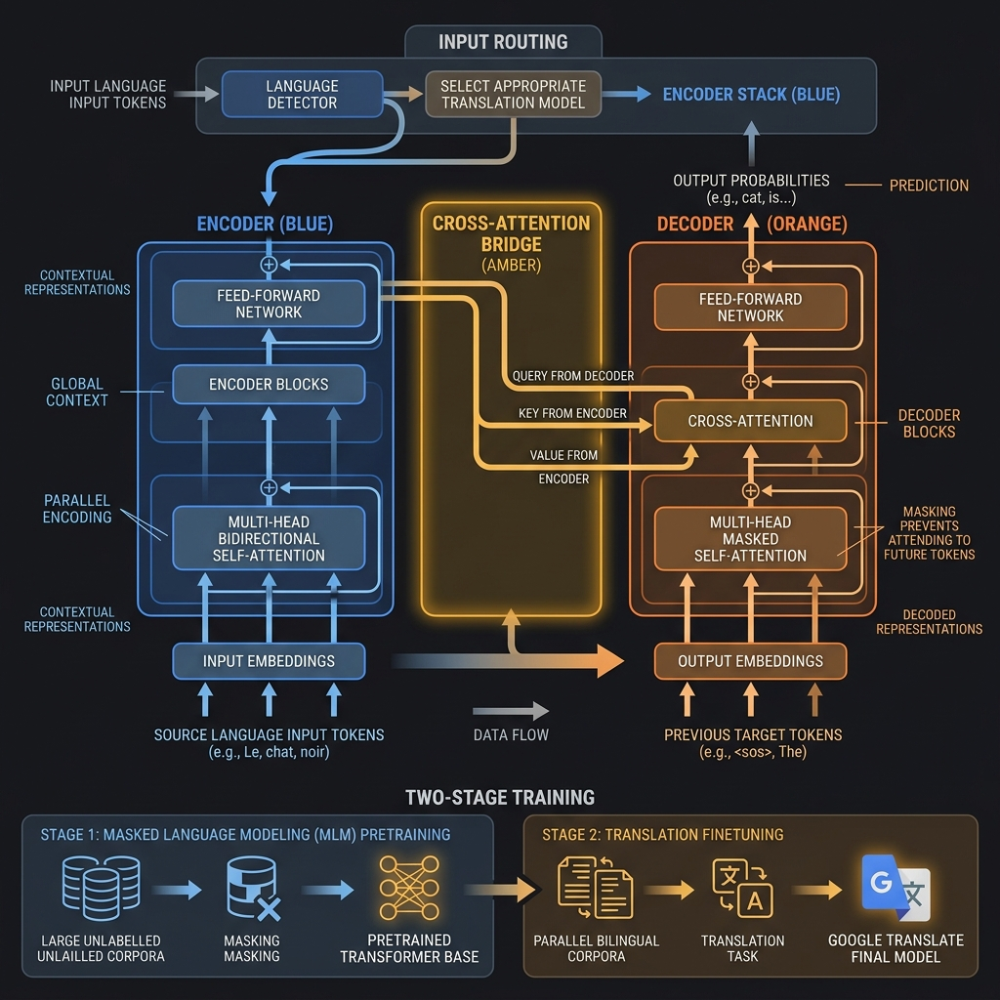
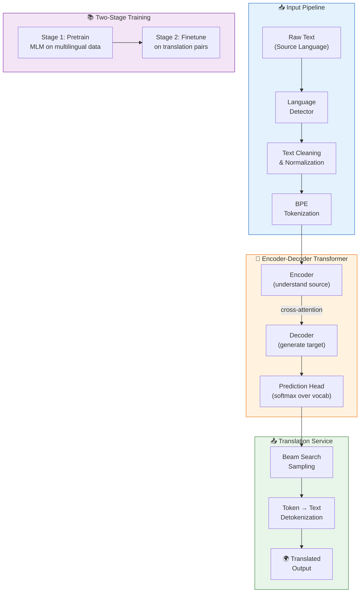

<!-- tags: genai, system-design, google-translate, encoder-decoder, machine-translation -->
# 🌐 Google Translate — Encoder-Decoder Architecture for Machine Translation

📅 Created: 2026-04-21 · 🔄 Updated: 2026-04-21 · ⏱️ 20 min read

> Google Translate supports 130+ languages and serves over a billion users. This chapter shifts from decoder-only to encoder-decoder Transformers — the architecture that separates understanding input from generating output, making it ideal for sequence-to-sequence tasks like translation.

| Aspect | Detail |
|--------|--------|
| **Scope** | End-to-end machine translation system design |
| **Architecture** | Encoder-decoder Transformer (T5/BART family) |
| **Scale** | 4 languages initially, 300M sentence pairs, 1000-word inputs |
| **Prerequisites** | [Gmail Smart Compose](./02-gmail-smart-compose.md) (decoder-only fundamentals) |

---

## 1. DEFINE

You paste a paragraph of Korean text into Google Translate and receive fluent English in under a second. Behind that simplicity lies a fundamental architectural shift: translation is not text completion. The model must *understand* the source language fully before it *generates* the target language. This is why encoder-decoder Transformers exist.

### 1.1 Clarifying Requirements

| Requirement | Detail |
|-------------|--------|
| **Languages** | English, Spanish, Korean, French (expandable) |
| **Training data** | 300M source–target sentence pairs + terabytes of general text per language |
| **Language detection** | Automatic — users may not know the input language |
| **Input length** | Up to 1,000 words |
| **Deployment** | Cloud-based (not on-device) |
| **Real-time** | Not initially required |

### 1.2 Why Encoder-Decoder?

In Chapter 2, we used a decoder-only Transformer for text completion. Translation requires a different architecture because the output is not a *continuation* of the input — it is a *transformation*.

| Architecture | Strengths for Translation | Weaknesses |
|-------------|--------------------------|------------|
| **Decoder-only** | Simple, proven for generation | Must learn alignment implicitly; less efficient for seq2seq |
| **Encoder-decoder** | Separates understanding from generation; cross-attention aligns output with source | More complex architecture |

The encoder-decoder wins because:
- It handles variable-length input and output naturally
- Cross-attention explicitly aligns each generated token with the relevant source tokens
- The encoder processes the full input before generation begins — no information is lost

---

## 2. VISUAL

*Google Translate encoder-decoder Transformer — bidirectional encoder processes source language, cross-attention bridges to masked decoder generating target language, with two-stage training below.*

*The translation pipeline: language detection routes input to the correct model, the encoder processes the source text, cross-attention bridges encoder and decoder, and beam search generates the translated output.*

---

## 3. CODE

### 3.1 Data Preparation

Two data categories drive training:

**General data** — terabytes of multilingual web text (C4, Wikipedia, StackExchange). Used during pretraining to build language understanding.

**Translation data** — 300M aligned sentence pairs across all supported language combinations. Used during finetuning.

**Preprocessing pipeline:**

| Step | Action | Rationale |
|------|--------|-----------|
| Filter missing/noisy data | Remove incomplete or corrupted pairs | Prevents learning from garbage |
| Deduplicate | Remove identical or near-identical entries | Prevents overfitting to repeated content |
| Handle named entities | Replace with placeholder tokens (e.g., `ENTITY_1`) | Preserves translation structure without memorizing names |
| Preserve punctuation & casing | Skip lowercasing, stop-word removal, stemming | Modern models benefit from full context |

**Tokenization: Byte-Pair Encoding (BPE)**

BPE builds a vocabulary by iteratively merging the most frequent character pairs:

1. Start with individual characters + special end-of-word token `</w>`
2. Count all adjacent character pairs across the corpus
3. Merge the most frequent pair into a new token
4. Repeat until vocabulary reaches target size (~50K–100K tokens)

Result: frequent words stay whole ("the", "is"), rare words decompose into known subwords ("unhappily" → "un" + "happ" + "ily"). This handles out-of-vocabulary words gracefully — critical for multilingual systems.

### 3.2 Architecture Deep Dive

**Encoder** — Processes the full source sentence:
- Text embedding converts token IDs to dense vectors
- Sine-cosine positional encoding adds position information
- Stacked Transformer blocks with self-attention (each token attends to *all* source tokens — no masking)

**Decoder** — Generates the target sentence one token at a time:
- Text embedding + positional encoding for target tokens
- **Masked self-attention**: Each token attends only to *previous* target tokens (prevents information leakage)
- **Cross-attention**: Each target token attends to *all* encoder outputs — this is the critical bridge between languages
- Prediction head: Linear layer + softmax produces probability distribution over target vocabulary

The cross-attention mechanism is what makes encoder-decoder architectures excel at translation. It allows every generated word to "look back" at the entire source sentence, finding the most relevant parts to translate next.

### 3.3 Two-Stage Training

**Stage 1: Unsupervised Pretraining (Masked Language Modeling)**

The objective is MLM: randomly mask a subset of tokens in the input, then train the model to reconstruct them.

| Component | Detail |
|-----------|--------|
| **Data** | Large multilingual general corpus |
| **Objective** | Predict masked tokens given surrounding context |
| **Loss** | Cross-entropy on masked positions only |
| **Result** | Base model with multilingual language understanding |

Publicly available pretrained models (T5, mBART) can serve as starting points, saving significant compute.

**Stage 2: Supervised Finetuning (Translation)**

The base model adapts to translation using parallel sentence pairs.

| Component | Detail |
|-----------|--------|
| **Data** | 300M source–target sentence pairs |
| **Objective** | Next-token prediction in target language, conditioned on source |
| **Loss** | Cross-entropy across all target positions (computed in parallel) |

**Bilingual vs. Multilingual approach:**

| Approach | Pros | Cons |
|----------|------|------|
| **Bilingual** (one model per pair) | Higher accuracy, easier debugging | More models to maintain, higher cost |
| **Multilingual** (one model for all) | Single model, transfer learning across languages | Risk of interference between languages |

We choose the **bilingual approach** for production quality — each language pair gets a dedicated, optimized model.

### 3.4 Sampling

Beam search is preferred for translation:
- **Accuracy**: Evaluates multiple candidate sequences simultaneously
- **Consistency**: Produces coherent, deterministic translations
- **Reproducibility**: Same input always yields the same translation

Stochastic methods (top-k, top-p) are avoided — creative variation is a bug, not a feature, in translation.

### 3.5 System Architecture

The production system has two main components:

**Language Detector** — Identifies the source language to route to the correct translation model.
- Framed as a sequence classification task
- Uses an encoder-only Transformer (BERT-family)
- Two approaches: average pooling over all token representations, or using the final token representation
- Feeds into the translation service for model selection

**Translation Service** — Orchestrates the end-to-end translation:
1. Receives detected language + input text
2. Selects the correct bilingual model
3. Tokenizes input, runs through encoder-decoder
4. Applies beam search for generation
5. Detokenizes output back to readable text

---

## 4. PITFALLS

| # | Severity | Mistake | Consequence | Fix |
|---|----------|---------|-------------|-----|
| 1 | 🔴 Fatal | Using decoder-only for translation | Loses explicit source-target alignment; lower translation quality | Use encoder-decoder with cross-attention |
| 2 | 🔴 Fatal | Training one multilingual model for all pairs | Language interference degrades quality for each pair | Use bilingual models for production accuracy |
| 3 | 🟡 Common | Applying lowercasing/stemming during preprocessing | Destroys casing and morphological information that affects meaning | Preserve full text; modern Transformers handle raw text |
| 4 | 🟡 Common | Using word-level tokenization for multilingual systems | Vocabulary explodes across languages; OOV words break the model | Use BPE or SentencePiece for subword tokenization |
| 5 | 🟡 Common | Evaluating only with BLEU score | BLEU penalizes valid alternative wordings | Combine BLEU with METEOR (synonym-aware) and human evaluation |
| 6 | 🔵 Minor | Using stochastic sampling for translation | Introduces unwanted variation in translations | Use beam search for consistency and accuracy |

### 🔴 Pitfall #1 — Wrong Architecture Choice

A team tries to fine-tune GPT-4 for translation. The decoder-only model must learn alignment implicitly — which source words correspond to which target words. Without cross-attention, it relies on positional patterns in the concatenated source+target sequence.

For simple sentences, this works. For complex sentences with reordering (e.g., English → Korean, where verb-final word order differs), the model frequently drops or mistranslates clauses.

**Fix**: Use an encoder-decoder architecture. The encoder fully processes the source sentence, and cross-attention in the decoder explicitly aligns each generated token with relevant source positions. This is not a minor optimization — it is an architectural requirement for reliable translation.

---

## 5. REF

| Resource | Type | Link | Notes |
|----------|------|------|-------|
| Attention Is All You Need (Vaswani et al., 2017) | Paper | [arxiv.org/abs/1706.03762](https://arxiv.org/abs/1706.03762) | Original Transformer with encoder-decoder |
| T5: Text-to-Text Transfer Transformer | Paper | [arxiv.org/abs/1910.10683](https://arxiv.org/abs/1910.10683) | Encoder-decoder pretrained model |
| mBART (Liu et al., 2020) | Paper | [arxiv.org/abs/2001.08210](https://arxiv.org/abs/2001.08210) | Multilingual denoising pretraining |
| BLEU Score (Papineni et al., 2002) | Paper | [aclanthology.org/P02-1040](https://aclanthology.org/P02-1040/) | Bilingual evaluation metric |
| METEOR (Banerjee & Lavie, 2005) | Paper | [aclanthology.org/W05-0909](https://aclanthology.org/W05-0909/) | Synonym-aware translation metric |
| ByteByteGo GenAI System Design | Course | [bytebytego.com](https://bytebytego.com/courses/genai-system-design-interview/google-translate) | Source material |

### Evaluation Metrics Comparison

| Metric | Type | Mechanism | Strength | Weakness |
|--------|------|-----------|----------|----------|
| **BLEU** | Precision-based | Counts n-gram matches with brevity penalty | Standard benchmark, fast to compute | Penalizes valid alternative wordings |
| **ROUGE** | Recall-based | N-gram overlap with reference | Simple, efficient | Lacks semantic understanding |
| **METEOR** | Harmonic mean | Weighted precision + recall with synonym matching | Handles synonyms, correlates with human judgment | Computationally expensive, needs WordNet |

---

## 6. RECOMMEND

Google Translate demonstrates why architecture choice matters: encoder-decoder Transformers excel when input understanding and output generation are distinct tasks. The next chapter tackles a fundamentally different challenge — building a general-purpose chatbot that must be aligned with human values through RLHF.

| Next Step | When | Why | Link |
|-----------|------|-----|------|
| ChatGPT Personal Assistant | After mastering encoder-decoder | Full LLM system with three-stage training (pretrain → SFT → RLHF) | [→ 04-chatgpt-personal-assistant.md](./04-chatgpt-personal-assistant.md) |
| Gmail Smart Compose | If decoder-only needs review | Revisit decoder-only architecture and beam search fundamentals | [← 02-gmail-smart-compose.md](./02-gmail-smart-compose.md) |
| Introduction and Overview | If framework feels unfamiliar | Review the seven-step ML system design framework | [← 01-introduction-and-overview.md](./01-introduction-and-overview.md) |

**Navigation**: [← Previous: Gmail Smart Compose](./02-gmail-smart-compose.md) · [→ Next: ChatGPT Personal Assistant](./04-chatgpt-personal-assistant.md)
