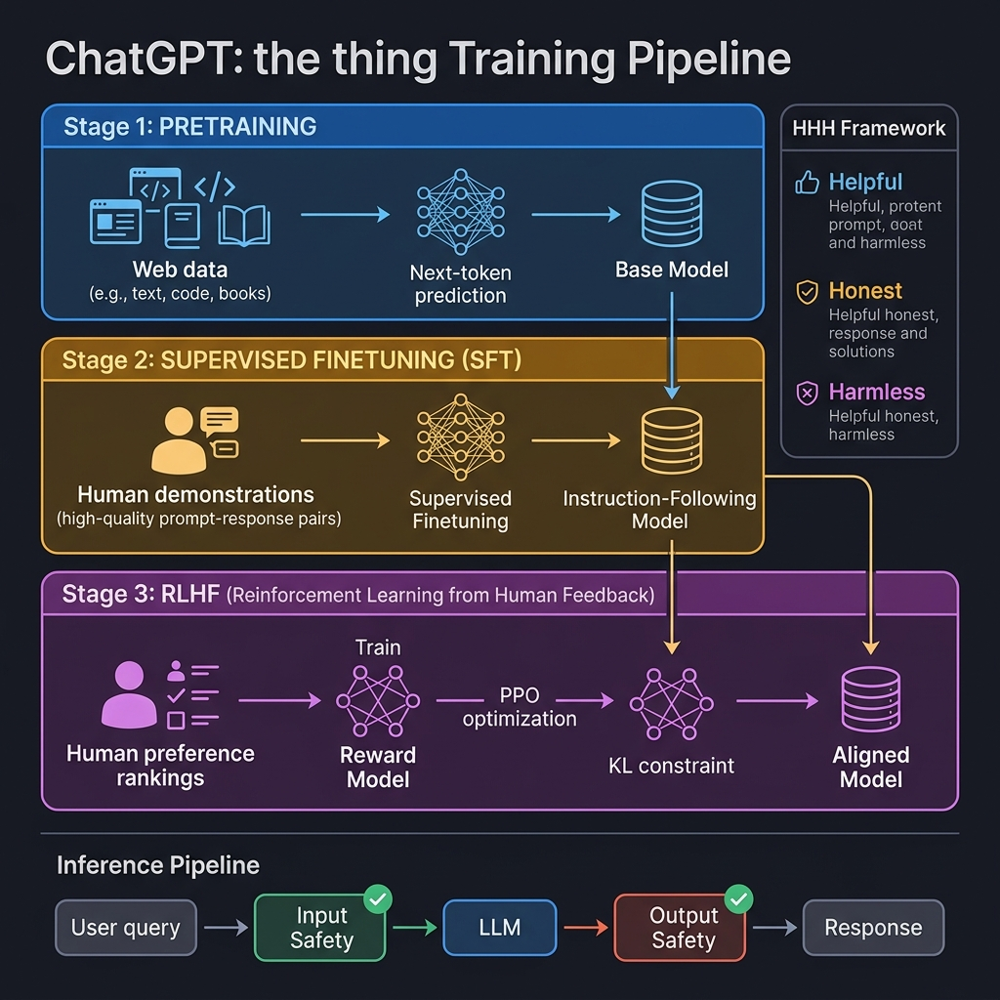
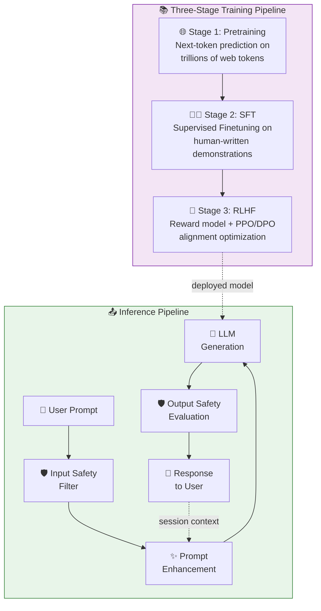

<!-- tags: genai, system-design, chatgpt, rlhf, alignment, llm -->
# 🤖 ChatGPT — Personal Assistant Chatbot with RLHF Alignment

📅 Created: 2026-04-21 · 🔄 Updated: 2026-04-21 · ⏱️ 22 min read

> ChatGPT gained 100 million users in under three months — the fastest adoption in application history. This chapter examines the three-stage training pipeline (pretrain → SFT → RLHF) that transforms a raw language model into a helpful, harmless, and honest conversational assistant.

| Aspect | Detail |
|--------|--------|
| **Scope** | End-to-end design for a general-purpose text chatbot |
| **Architecture** | Decoder-only Transformer with RLHF alignment |
| **Key Innovation** | Three-stage training: Pretraining → SFT → RLHF |
| **Prerequisites** | [Gmail Smart Compose](./02-gmail-smart-compose.md), [Google Translate](./03-google-translate.md) |

---

## 1. DEFINE

A user types "Explain quantum entanglement to a five-year-old." The chatbot responds with a clear, age-appropriate explanation using an analogy about magic socks. The user follows up: "Now explain it to a physics PhD student." The chatbot adjusts its response — same topic, different register, same conversation context.

This is a fundamentally different challenge from Smart Compose or Translate. The model does not complete text or transform between languages. It must *follow instructions*, *maintain context across turns*, and *refuse harmful requests* — all while sounding natural. A raw pretrained language model cannot do this. It takes three stages of training to get there.

### 1.1 Clarifying Requirements

| Requirement | Detail |
|-------------|--------|
| **Language** | English initially |
| **Modalities** | Text-only input and output |
| **Tasks** | Information retrieval, question answering, explanations, creative content |
| **Safety** | Strict content moderation; unbiased, safe outputs |
| **Context window** | ≥4,096 tokens |
| **Multi-turn** | Must handle follow-up questions within a session |

### 1.2 Architecture Choice

A chatbot generates text based on conversation history — this is autoregressive generation. A **decoder-only Transformer** is the right choice:
- Generates tokens one at a time, conditioned on all previous tokens
- No need for a separate encoder — the "input" (user's message) and "output" (assistant's response) live in the same sequence
- Industry standard: GPT-4, LLaMA, Gemini, Claude all use decoder-only

---

## 2. VISUAL

*ChatGPT three-stage training pipeline — Pretraining on web data, Supervised Finetuning on human demonstrations, and RLHF alignment via reward model and PPO optimization, with HHH framework and inference safety pipeline.*

*The chatbot's lifecycle: three training stages produce an aligned model, which is served through a safety-aware inference pipeline with session context management.*

The critical insight: pretraining alone produces a model that *continues* text. SFT teaches it to *follow instructions*. RLHF teaches it to follow instructions *the way humans prefer*.

---

## 3. CODE

### 3.1 Data Preparation

Pretraining data comes from massive web crawls (Common Crawl, Wikipedia, GitHub, books). The cleaning pipeline is rigorous:

| Step | Action | Why |
|------|--------|-----|
| HTML extraction | Parse and extract text from raw web pages | Remove boilerplate, scripts, navigation |
| URL/domain filtering | Blocklist known low-quality or harmful sources | Prevent toxic content from entering training |
| Language filtering | Keep only target language(s) | Maintain quality for each supported language |
| Safety filtering | ML-based classifiers to flag toxic/explicit content | Prevent the model from learning harmful patterns |
| PII anonymization | Remove names, emails, phone numbers, addresses | Privacy compliance and preventing memorization |
| Deduplication | Remove exact and near-duplicate documents | Prevent overfitting to repeated content |
| Tokenization | Subword BPE tokenization | Balanced vocabulary, handles rare words |

The result: trillions of clean, deduplicated tokens ready for pretraining.

### 3.2 Positional Encoding — RoPE

Standard sine-cosine positional encoding has a fixed maximum length. For chatbots with long conversations, we need something better.

**Rotary Positional Encoding (RoPE)** addresses this:
- Encodes positions using rotation matrices rather than additive vectors
- Captures *both* absolute position and relative distance between tokens
- Generalizes better to sequence lengths not seen during training
- Used by LLaMA, Gemini, and most modern LLMs

The key advantage: RoPE's geometric encoding of position decays naturally with distance, so the model learns that nearby tokens are more related than distant ones — without a hard positional limit.

### 3.3 Three-Stage Training

This is the core contribution of the ChatGPT architecture. Each stage builds on the previous one.

#### Stage 1: Pretraining — Building the Foundation

| Component | Detail |
|-----------|--------|
| **Data** | Trillions of tokens from web, books, code |
| **Objective** | Next-token prediction |
| **Loss** | Cross-entropy |
| **Output** | Base model — understands language but cannot follow instructions |

The base model is a powerful text predictor. Given "The capital of France is", it predicts "Paris." But given "What is the capital of France?", it might respond with another question rather than an answer — because in web text, questions are often followed by more questions.

#### Stage 2: Supervised Finetuning (SFT) — Teaching Instruction-Following

| Component | Detail |
|-----------|--------|
| **Data** | Human-written (prompt, response) pairs — thousands of high-quality demonstrations |
| **Objective** | Next-token prediction on demonstration responses |
| **Loss** | Cross-entropy (computed only on the response tokens, not the prompt) |
| **Output** | SFT model — follows instructions but may still produce suboptimal responses |

Human labelers write ideal responses to diverse prompts. The model learns the *format* of helpful responses: answering questions directly, providing explanations step by step, refusing inappropriate requests politely.

SFT is necessary but insufficient. The model learns to *imitate* demonstrations, but it has no mechanism to distinguish between a good response and a great one.

#### Stage 3: RLHF — Aligning with Human Preferences

RLHF closes the gap between "follows instructions" and "follows instructions the way humans prefer."

**Step 3a: Train a Reward Model**

1. Generate multiple responses from the SFT model for each prompt
2. Human rankers order the responses from best to worst
3. Train a separate model (the *reward model*) to predict these rankings
4. The reward model learns to score any (prompt, response) pair

**Step 3b: Optimize with Reinforcement Learning**

| Component | Detail |
|-----------|--------|
| **Algorithm** | PPO (Proximal Policy Optimization) or DPO (Direct Preference Optimization) |
| **Objective** | Maximize reward model score while staying close to SFT model |
| **Constraint** | KL divergence penalty prevents the model from diverging too far from SFT behavior |
| **Output** | Aligned model — helpful, honest, and harmless |

The KL constraint is critical. Without it, the model would learn to "hack" the reward model — generating outputs that score highly but are incoherent or repetitive.

**The HHH Framework** — RLHF optimizes for three properties:
- **Helpful**: Provides accurate, relevant, and useful information
- **Honest**: Acknowledges uncertainty; does not fabricate facts
- **Harmless**: Refuses to generate toxic, biased, or dangerous content

### 3.4 Sampling — Temperature and Nucleus Sampling

Unlike Smart Compose (deterministic) and Translate (beam search), a chatbot benefits from controlled randomness. Stochastic sampling produces more natural, varied responses.

**Temperature** controls the probability distribution:

| Temperature | Effect | Use Case |
|------------|--------|----------|
| 0.1 (low) | Sharp distribution — model picks high-probability tokens | Code generation, factual Q&A |
| 0.7 (medium) | Balanced diversity | General conversation |
| 1.0+ (high) | Flat distribution — more creative, less predictable | Creative writing, brainstorming |

**Top-k sampling**: Only consider the k most probable tokens at each step.

**Top-p (nucleus) sampling**: Only consider tokens whose cumulative probability reaches p. More adaptive than top-k because the number of candidates varies with the model's confidence.

In practice, chatbots combine temperature with top-p: temperature shapes the distribution, top-p truncates the tail.

### 3.5 Evaluation

Chatbot evaluation is harder than translation or completion because quality is subjective and multi-dimensional.

**Offline Metrics:**

| Benchmark | What It Tests | Format |
|-----------|--------------|--------|
| **MMLU** | General knowledge across 57 subjects | Multiple choice |
| **GSM8K** | Mathematical reasoning | Word problems |
| **HumanEval** | Code generation correctness | Function completion |
| **TruthfulQA** | Resistance to common misconceptions | True/false with explanation |
| **RealToxicityPrompts** | Safety under adversarial prompts | Toxicity scoring |
| **BBQ (Bias Benchmark)** | Bias across demographic categories | Stereotyping detection |

**Human Evaluation** remains the gold standard. Evaluators rate responses on:
- Helpfulness, relevance, and accuracy
- Safety and refusal appropriateness
- Fluency and naturalness

**Online Metrics:**
- User engagement (session length, return rate)
- Explicit feedback (thumbs up/down on responses)
- External leaderboards (LMSYS Chatbot Arena — Elo-based ranking from blind user comparisons)

### 3.6 System Architecture — Inference Pipeline

The production system is a multi-stage pipeline:

**Input Stage:**
- *Safety filter*: ML classifier rejects harmful, illegal, or manipulative prompts before they reach the model
- *Prompt enhancement*: Reformulates vague queries for clarity (e.g., adding system instructions, expanding abbreviations)

**Generation Stage:**
- The aligned LLM generates a response using temperature + top-p sampling
- Session management maintains conversation history within the context window

**Output Stage:**
- *Response safety evaluation*: Separate classifier checks generated output for harmful content
- *Rejection generation*: If the prompt was unsafe, generate a polite refusal instead of blocking silently

**Session Management** — Multi-turn conversations require maintaining context. The full conversation history (user messages + assistant responses) is concatenated and passed as input for each new turn. When the conversation exceeds the context window, older turns are truncated or summarized.

---

## 4. PITFALLS

| # | Severity | Mistake | Consequence | Fix |
|---|----------|---------|-------------|-----|
| 1 | 🔴 Fatal | Deploying a pretrained model without SFT or RLHF | Model continues text instead of following instructions; generates unsafe content | Apply all three training stages |
| 2 | 🔴 Fatal | Skipping RLHF after SFT | Model follows instructions but may produce harmful, biased, or low-quality responses | Train reward model on human preferences; apply PPO/DPO |
| 3 | 🔴 Fatal | No input/output safety filters | Users can extract harmful content or the model generates toxic responses | Add ML-based safety classifiers at both input and output stages |
| 4 | 🟡 Common | Using beam search for chatbot generation | Repetitive, generic responses that feel robotic | Use temperature + top-p sampling for natural conversation |
| 5 | 🟡 Common | Removing KL constraint during RLHF | Model "hacks" the reward model — generates high-scoring but incoherent output | Apply KL divergence penalty to keep model close to SFT baseline |
| 6 | 🟡 Common | Evaluating only with perplexity | Perplexity measures prediction accuracy, not helpfulness or safety | Use task-specific benchmarks + human evaluation + safety audits |
| 7 | 🔵 Minor | Fixed sine-cosine positional encoding | Limits context window to training-time maximum length | Use RoPE for flexible, generalizable position encoding |

### 🔴 Pitfall #2 — SFT Without RLHF

A team skips RLHF because SFT already produces reasonable-looking responses. In evaluation, the model scores well on fluency metrics.

In production, problems surface: the model confidently fabricates citations. When asked about sensitive topics, it provides detailed answers instead of declining. When users probe with adversarial prompts, it complies because it learned to *always* answer helpfully during SFT.

**Fix**: RLHF teaches the model to distinguish between "helpful" and "harmfully helpful." The reward model penalizes fabrication and unsafe compliance. The KL constraint prevents the model from losing its instruction-following ability. All three stages are necessary — none is optional.

---

## 5. REF

| Resource | Type | Link | Notes |
|----------|------|------|-------|
| Training language models to follow instructions (Ouyang et al., 2022) | Paper | [arxiv.org/abs/2203.02155](https://arxiv.org/abs/2203.02155) | InstructGPT / RLHF methodology |
| RoPE (Su et al., 2021) | Paper | [arxiv.org/abs/2104.09864](https://arxiv.org/abs/2104.09864) | Rotary Positional Encoding |
| PPO (Schulman et al., 2017) | Paper | [arxiv.org/abs/1707.06347](https://arxiv.org/abs/1707.06347) | Proximal Policy Optimization |
| DPO (Rafailov et al., 2023) | Paper | [arxiv.org/abs/2305.18290](https://arxiv.org/abs/2305.18290) | Direct Preference Optimization |
| LMSYS Chatbot Arena | Leaderboard | [chat.lmsys.org](https://chat.lmsys.org) | Elo-based LLM comparison |
| ByteByteGo GenAI System Design | Course | [bytebytego.com](https://bytebytego.com/courses/genai-system-design-interview/chatgpt-personal-assistant-chatbot) | Source material |

---

## 6. RECOMMEND

ChatGPT demonstrates the full training pipeline for modern LLMs — from raw web text to an aligned assistant. The next chapters shift from text to vision: how do we generate text *from* images, and how do we generate images *from* text?

| Next Step | When | Why | Link |
|-----------|------|-----|------|
| Image Captioning | After mastering text-only LLMs | Cross-modal: vision encoder + language decoder | [→ 05-image-captioning.md](./05-image-captioning.md) |
| RAG | If retrieval augmentation is the priority | Grounding LLM output in external knowledge | [→ 06-retrieval-augmented-generation.md](./06-retrieval-augmented-generation.md) |
| Google Translate | If encoder-decoder needs review | Compare decoder-only vs. encoder-decoder training strategies | [← 03-google-translate.md](./03-google-translate.md) |

**Navigation**: [← Previous: Google Translate](./03-google-translate.md) · [→ Next: Image Captioning](./05-image-captioning.md)
