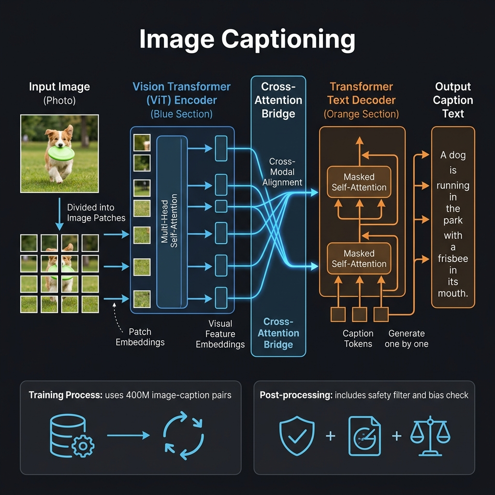
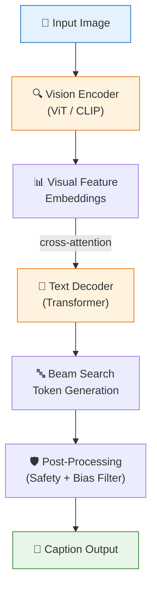

<!-- tags: genai, system-design, image-captioning, vision-transformer, multimodal -->
# 🖼️ Image Captioning — Vision Encoder Meets Language Decoder

📅 Created: 2026-04-21 · 🔄 Updated: 2026-04-21 · ⏱️ 18 min read

> Image captioning bridges vision and language — a Vision Transformer encodes visual features while a Transformer decoder generates descriptive text. This chapter introduces multimodal architectures and cross-modal alignment.

| Aspect | Detail |
|--------|--------|
| **Scope** | ML system that generates short descriptive captions for images |
| **Architecture** | Encoder-decoder: Vision Transformer (ViT/CLIP) encoder + Transformer decoder |
| **Scale** | 400M image–caption pairs, everyday images |
| **Prerequisites** | [Google Translate](./03-google-translate.md) (encoder-decoder fundamentals) |

---

## 1. DEFINE

A designer uploads a photo of a sunset over a mountain range. Instead of manually naming the file, the system suggests "golden sunset behind snow-capped mountains." The captioning model analyzed pixel data, identified objects and their relationships, and produced a natural-language description — all in under a second.

Image captioning has applications beyond file naming: NSFW content moderation (generating text descriptions for classifier input), cold-start resolution in recommendation systems (describing new items without interaction data), and accessibility (alt-text generation for screen readers).

### 1.1 Clarifying Requirements

| Requirement | Detail |
|-------------|--------|
| **Image types** | General everyday images (not medical or technical) |
| **Use case** | Asset name suggestions for designers |
| **Caption style** | Short, descriptive, and clear |
| **Language** | English only |
| **Dataset** | 400M image–caption pairs |

### 1.2 Architecture Choice

This is an encoder-decoder task — but the input modality is visual and the output is textual:
- **Encoder**: A Vision Transformer (ViT) or CNN-based model (CLIP's image encoder) extracts high-level visual features
- **Decoder**: A Transformer decoder generates text tokens conditioned on visual features via cross-attention

---

## 2. VISUAL

*Image captioning architecture — Vision Transformer encoder divides input into patches, cross-attention bridge aligns visual features with text decoder that generates caption tokens autoregressively.*

*The image captioning pipeline: visual features flow from the encoder through cross-attention into the text decoder, which generates captions via beam search.*

---

## 3. CODE

### 3.1 Vision Encoder

The vision encoder converts raw pixel data into a sequence of feature embeddings that the text decoder can attend to.

**Vision Transformer (ViT)** approach:
1. Divide the image into fixed-size patches (e.g., 16×16 pixels)
2. Flatten each patch into a vector and project through a linear layer
3. Add positional embeddings to encode spatial location
4. Process through Transformer encoder blocks with self-attention

**CLIP-based** approach:
- Use the pretrained CLIP image encoder, which already aligns visual features with text in a shared embedding space
- Advantage: Pre-aligned representations reduce the gap between vision and language

### 3.2 Text Decoder

The decoder generates caption tokens one at a time:
- **Masked self-attention**: Each token attends only to previous tokens
- **Cross-attention**: Each token attends to all visual feature embeddings from the encoder
- **Prediction head**: Softmax over vocabulary produces next-token probabilities

The cross-attention mechanism here mirrors Google Translate — except instead of attending to source language tokens, the decoder attends to image patch embeddings.

### 3.3 Training

**Pretraining** leverages large image-text datasets (400M pairs). The model learns to associate visual patterns with textual descriptions.

**Finetuning** adapts to the specific caption style (short, descriptive names for designer assets).

**Loss**: Cross-entropy on predicted vs. ground-truth caption tokens.

### 3.4 Sampling and Post-Processing

**Beam search** generates captions — consistency and accuracy matter more than creativity for asset naming.

**Post-processing pipeline:**
- NSFW content detection
- Bias removal (gender, racial, cultural assumptions)
- Offensive word filtering
- Length constraints enforcement

### 3.5 Evaluation

| Metric | Type | What It Measures |
|--------|------|-----------------|
| **BLEU** | Precision | N-gram overlap with reference captions |
| **METEOR** | Harmonic | Synonym-aware precision + recall |
| **CIDEr** | Consensus | Agreement across multiple reference captions |
| **ROUGE-L** | Recall | Longest common subsequence with reference |

---

## 4. PITFALLS

| # | Severity | Mistake | Fix |
|---|----------|---------|-----|
| 1 | 🔴 Fatal | Training from scratch without pretrained vision encoder | Use pretrained ViT or CLIP — visual understanding requires massive data |
| 2 | 🟡 Common | No safety post-processing | Add NSFW detection, bias filtering, and offensive word checks |
| 3 | 🟡 Common | Using only BLEU for evaluation | BLEU misses semantic correctness; combine with CIDEr and METEOR |
| 4 | 🔵 Minor | Generating overly long captions for file naming | Enforce length constraints; short captions are more useful |

---

## 5. REF

| Resource | Type | Link |
|----------|------|------|
| ViT (Dosovitskiy et al., 2020) | Paper | [arxiv.org/abs/2010.11929](https://arxiv.org/abs/2010.11929) |
| CLIP (Radford et al., 2021) | Paper | [arxiv.org/abs/2103.00020](https://arxiv.org/abs/2103.00020) |
| CIDEr (Vedantam et al., 2015) | Paper | [arxiv.org/abs/1411.5726](https://arxiv.org/abs/1411.5726) |

---

## 6. RECOMMEND

| Next Step | Why | Link |
|-----------|-----|------|
| RAG | Ground LLM output in external knowledge | [→ 06-retrieval-augmented-generation.md](./06-retrieval-augmented-generation.md) |
| ChatGPT | Review text-only LLM pipeline before multimodal | [← 04-chatgpt-personal-assistant.md](./04-chatgpt-personal-assistant.md) |

**Navigation**: [← Previous: ChatGPT](./04-chatgpt-personal-assistant.md) · [→ Next: RAG](./06-retrieval-augmented-generation.md)
