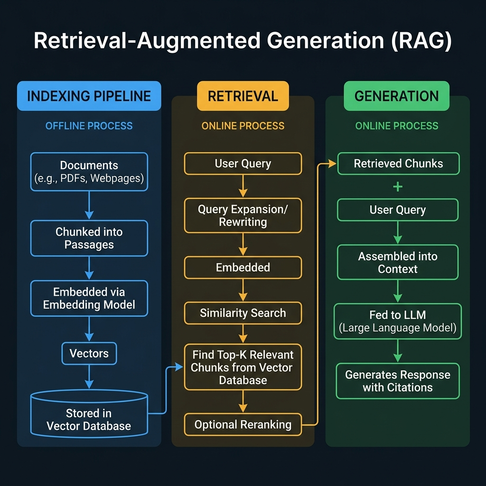
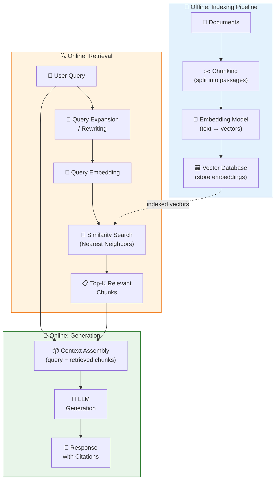

<!-- tags: genai, system-design, rag, retrieval, vector-database, embeddings -->
# 📚 Retrieval-Augmented Generation — Grounding LLMs in External Knowledge

📅 Created: 2026-04-21 · 🔄 Updated: 2026-04-21 · ⏱️ 20 min read

> LLMs hallucinate because they generate from parametric memory alone. RAG fixes this by retrieving relevant documents before generation — turning the model into a system that can cite its sources and stay current without retraining.

| Aspect | Detail |
|--------|--------|
| **Scope** | System that augments LLM generation with external knowledge retrieval |
| **Architecture** | Indexing pipeline + retrieval engine + LLM generator |
| **Key Innovation** | Query expansion, vector similarity search, RAFT training |
| **Prerequisites** | [ChatGPT](./04-chatgpt-personal-assistant.md) (LLM fundamentals) |

---

## 1. DEFINE

A developer asks a chatbot: "How do I configure connection pooling in PostgreSQL 16?" A vanilla LLM might hallucinate configuration parameters from PostgreSQL 14 that no longer exist. A RAG-enabled system retrieves the current PostgreSQL 16 documentation, grounds its response in those specific pages, and provides citations.

RAG solves three fundamental LLM limitations:
- **Hallucination**: Generating plausible but incorrect information
- **Staleness**: Knowledge frozen at training cutoff date
- **Opacity**: No way to verify where the model's claims come from

### 1.1 The Three-Stage RAG Pipeline

RAG operates in three phases: **Index**, **Retrieve**, **Generate**.

---

## 2. VISUAL

*RAG three-stage pipeline — offline indexing (chunk, embed, store), online retrieval (query expansion, similarity search, reranking), and grounded generation (context assembly, LLM response with citations).*

*RAG pipeline: documents are indexed offline into a vector database, then at query time, relevant chunks are retrieved and fed alongside the query into the LLM for grounded generation.*

---

## 3. CODE

### 3.1 Indexing Pipeline

**Chunking**: Documents are split into passages of consistent size. Chunk size affects quality:
- Too small → loses context; retrieved chunks lack sufficient information
- Too large → dilutes relevance; noisy context confuses the model
- Typical range: 256–512 tokens with overlap

**Embedding**: Each chunk is encoded into a dense vector using an embedding model (e.g., CLIP for multimodal, or specialized text embedders like `text-embedding-3-large`). The same model must encode both documents and queries.

**Vector Database**: Embeddings are stored in a vector database (Pinecone, Weaviate, pgvector) with metadata for filtering. Approximate Nearest Neighbor (ANN) algorithms enable sub-millisecond retrieval at scale.

### 3.2 Retrieval

**Query expansion/rewriting**: The raw user query may be vague or incomplete. An LLM rewrites it into a more precise search query or generates multiple query variants to improve recall.

**Similarity search**: The query embedding is compared against all document embeddings using cosine similarity or dot product. Top-K most similar chunks are retrieved.

**Reranking** (optional): A cross-encoder model re-scores retrieved chunks with fine-grained relevance judgment, improving precision after the initial retrieval.

### 3.3 Generation

The LLM receives a prompt containing:
1. System instruction ("Answer using only the provided context")
2. Retrieved context chunks
3. User's original query

The model generates a response grounded in the retrieved documents. Citation markers link claims to specific source chunks.

### 3.4 Training — RAFT

**Retrieval-Augmented Fine-Tuning (RAFT)** trains the model to use retrieved context effectively:
- Training samples include both *relevant* and *distractor* documents
- The model learns to focus on relevant chunks while ignoring distractors
- This mimics real retrieval scenarios where not every returned chunk is useful

### 3.5 Evaluation — RAGAS Framework

| Metric | What It Measures | Direction |
|--------|-----------------|-----------|
| **Faithfulness** | Is the response supported by retrieved context? | Higher = better |
| **Answer Relevance** | Does the response address the user's question? | Higher = better |
| **Context Precision** | Are retrieved chunks relevant to the query? | Higher = better |
| **Context Recall** | Did retrieval capture all relevant information? | Higher = better |

---

## 4. PITFALLS

| # | Severity | Mistake | Fix |
|---|----------|---------|-----|
| 1 | 🔴 Fatal | Using different embedding models for indexing vs. queries | Use the same model for both — embedding spaces must align |
| 2 | 🔴 Fatal | No chunk overlap during splitting | Overlapping chunks prevent information loss at boundaries |
| 3 | 🟡 Common | Returning too many chunks (high K) | Dilutes signal; use reranking to improve precision |
| 4 | 🟡 Common | No query expansion | Raw queries often miss relevant documents; rewriting improves recall |
| 5 | 🔵 Minor | Skipping RAFT training | Model may follow distractors; RAFT teaches selective attention |

---

## 5. REF

| Resource | Type | Link |
|----------|------|------|
| RAG (Lewis et al., 2020) | Paper | [arxiv.org/abs/2005.11401](https://arxiv.org/abs/2005.11401) |
| RAFT (Zhang et al., 2024) | Paper | [arxiv.org/abs/2403.10131](https://arxiv.org/abs/2403.10131) |
| RAGAS Framework | Tool | [docs.ragas.io](https://docs.ragas.io) |

---

## 6. RECOMMEND

| Next Step | Why | Link |
|-----------|-----|------|
| Face Generation | Shift from text to image generation (GANs) | [→ 07-realistic-face-generation.md](./07-realistic-face-generation.md) |
| Image Captioning | Review vision-language bridge | [← 05-image-captioning.md](./05-image-captioning.md) |

**Navigation**: [← Previous: Image Captioning](./05-image-captioning.md) · [→ Next: Face Generation](./07-realistic-face-generation.md)
