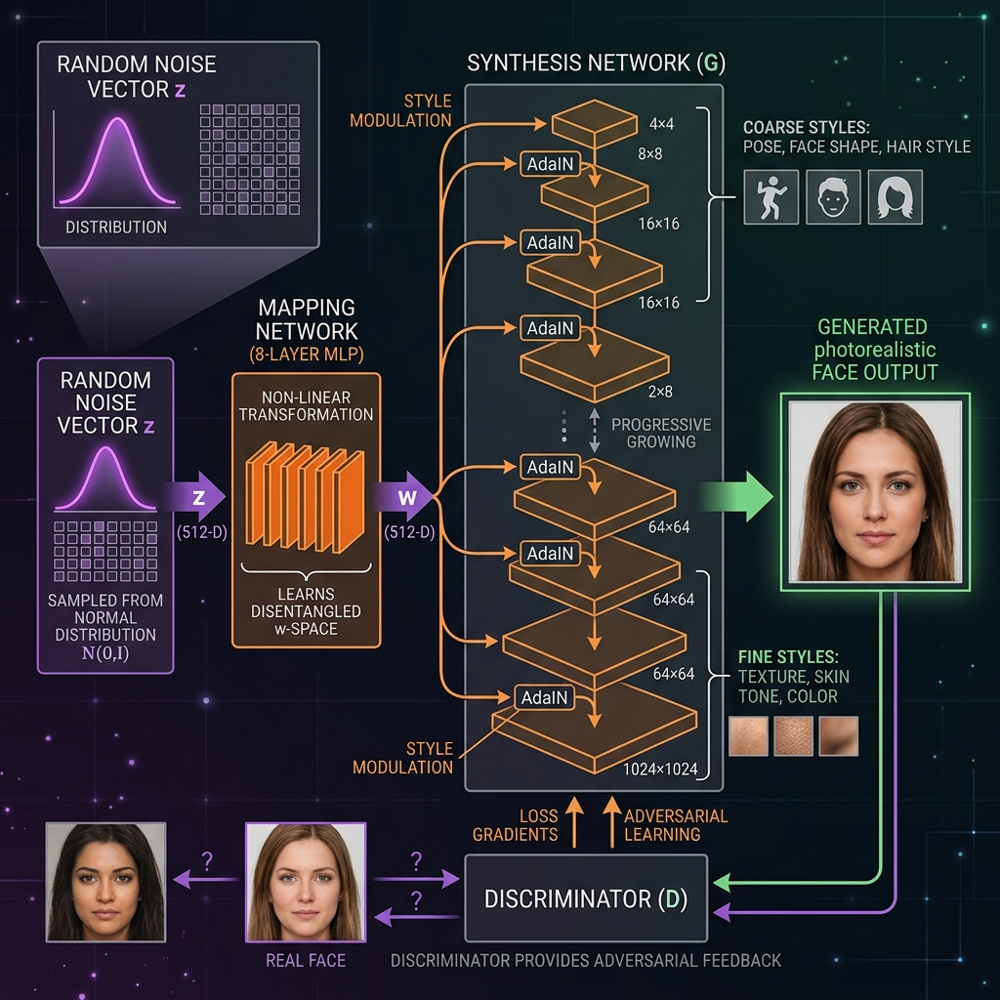
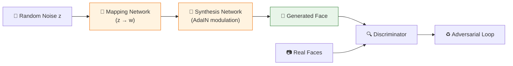

<!-- tags: genai, system-design, face-generation, gan, stylegan -->
# 👤 Realistic Face Generation — StyleGAN and Adversarial Training

📅 Created: 2026-04-21 · 🔄 Updated: 2026-04-21 · ⏱️ 18 min read

> Generating photorealistic human faces that do not exist — StyleGAN separates *what* a face looks like from *how* it is synthesized, enabling precise control over attributes like age, gender, and pose.

| Aspect | Detail |
|--------|--------|
| **Scope** | Generating 1024×1024 photorealistic faces |
| **Architecture** | GAN: StyleGAN with mapping + synthesis networks |
| **Key Innovation** | Disentangled latent space; style-based modulation (AdaIN) |
| **Prerequisites** | [Image Captioning](./05-image-captioning.md) |

---

## 1. DEFINE

A content platform needs avatar images for users who have not uploaded photos. Each avatar must look photorealistic, diverse across demographics, and controllable — generate a 30-year-old woman or a 60-year-old man on demand. No real person's face should be reproduced.

### 1.1 Requirements

| Requirement | Detail |
|-------------|--------|
| **Resolution** | 1024×1024 pixels |
| **Diversity** | Balanced across age, gender, ethnicity |
| **Attribute control** | Precise manipulation of facial attributes |
| **Latency** | Near real-time (<1s) |

---

## 2. VISUAL

*StyleGAN architecture — random noise maps through 8-layer MLP to disentangled w-space, synthesis network progressively generates from 4×4 to 1024×1024 via AdaIN modulation, discriminator provides adversarial feedback.*

---

## 3. CODE

### 3.1 GAN Fundamentals

Two competing networks train adversarially:
- **Generator**: Creates fake images from random noise
- **Discriminator**: Classifies images as real or fake

### 3.2 StyleGAN Architecture

**Mapping Network** — 8-layer MLP transforms noise z into intermediate w-space. This disentangles attributes: each w dimension controls a single attribute (age, hair color) independently.

**Synthesis Network** — Generates progressively from 4×4 to 1024×1024:
- **AdaIN modulation**: w vector controls style at each resolution
- Coarse layers: pose, face shape
- Fine layers: skin texture, color details

### 3.3 Training

- **R1 regularization** or **WGAN-GP** for training stability
- **Progressive growing**: Start low-res, gradually increase

### 3.4 Truncation Trick

Sample from truncated normal distribution:
- ψ → 0: High quality, low diversity (average face)
- ψ → 1: Full diversity, some artifacts
- Sweet spot: ψ ≈ 0.5–0.7

### 3.5 Evaluation

| Metric | Measures |
|--------|----------|
| **FID** | Distribution distance (lower = better) |
| **Precision** | Fraction of realistic generated images |
| **Recall** | Diversity coverage of real data |

---

## 4. PITFALLS

| # | Mistake | Fix |
|---|---------|-----|
| 1 | Sampling from z-space for control | Use w-space via mapping network |
| 2 | No truncation trick | Apply truncation for quality-diversity balance |
| 3 | Ignoring mode collapse | Use R1 regularization or WGAN-GP |

---

## 5. REF

| Resource | Link |
|----------|------|
| StyleGAN (Karras et al., 2019) | [arxiv.org/abs/1812.04948](https://arxiv.org/abs/1812.04948) |
| StyleGAN2 (Karras et al., 2020) | [arxiv.org/abs/1912.04958](https://arxiv.org/abs/1912.04958) |
| FID (Heusel et al., 2017) | [arxiv.org/abs/1706.08500](https://arxiv.org/abs/1706.08500) |

---

## 6. RECOMMEND

| Next Step | Link |
|-----------|------|
| High-Resolution Image Synthesis | [→ 08-high-resolution-image-synthesis.md](./08-high-resolution-image-synthesis.md) |
| RAG | [← 06-retrieval-augmented-generation.md](./06-retrieval-augmented-generation.md) |

**Navigation**: [← Previous: RAG](./06-retrieval-augmented-generation.md) · [→ Next: Image Synthesis](./08-high-resolution-image-synthesis.md)
