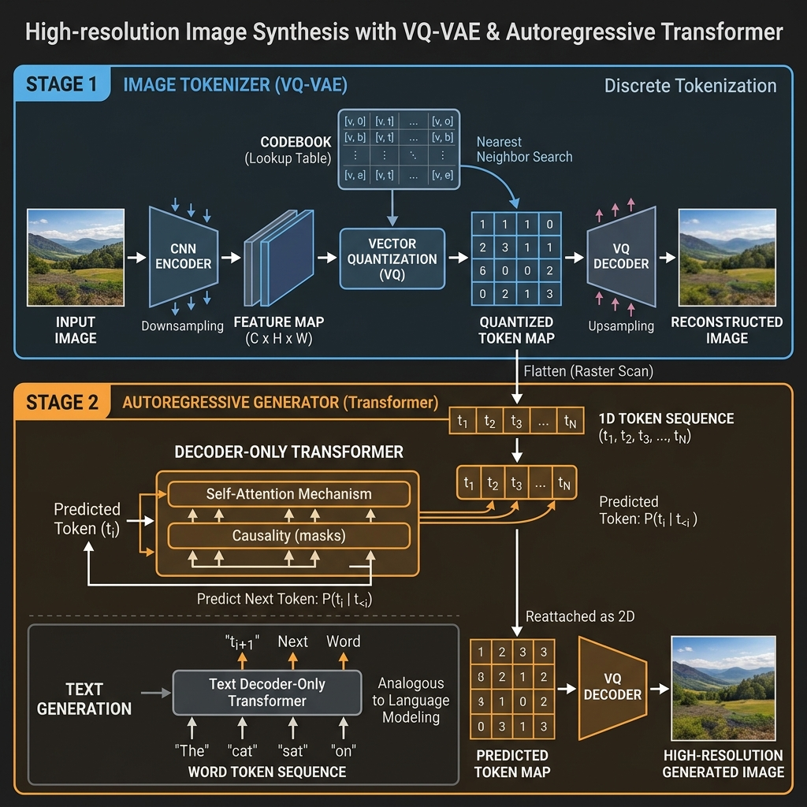

<!-- tags: genai, system-design, image-synthesis, vq-vae, autoregressive -->
# 🎨 High-Resolution Image Synthesis — VQ-VAE and Autoregressive Transformers

📅 Created: 2026-04-21 · 🔄 Updated: 2026-04-21 · ⏱️ 18 min read

> Synthesizing complex scenes (landscapes, urban environments) at 2048×2048 by treating images as sequences of discrete tokens — the same autoregressive approach that powers language models, applied to visual generation.

| Aspect | Detail |
|--------|--------|
| **Scope** | High-resolution scene synthesis (up to 2048×2048) |
| **Architecture** | Two-stage: VQ-VAE/VQ-GAN tokenizer + autoregressive Transformer |
| **Key Innovation** | Image tokenization via vector quantization; sequence modeling for images |
| **Prerequisites** | [Face Generation](./07-realistic-face-generation.md) (GAN fundamentals) |

---

## 1. DEFINE

Generate a photorealistic landscape: rolling hills, a winding river, distant mountains under a sunset sky. Unlike face generation (which has a fixed structure), scenes have arbitrary compositions — the model must learn spatial relationships, lighting, and coherent object placement at high resolution.

GANs struggle with this complexity. The solution: convert images into discrete tokens (like words in a sentence), then let a Transformer predict image tokens autoregressively — the same paradigm that generates text.

---

## 2. VISUAL

*VQ-VAE two-stage image synthesis — Stage 1 tokenizer (CNN encoder, vector quantization codebook, decoder) and Stage 2 autoregressive Transformer that predicts image tokens like text generation.*

```mermaid
flowchart TD
    subgraph Stage1["Stage 1: Image Tokenizer (VQ-VAE/VQ-GAN)"]
        A["📸 Input Image"] --> B["🔽 Encoder<br/>(downsample)"]
        B --> C["📖 Codebook<br/>Quantization"]
        C --> D["🔼 Decoder<br/>(reconstruct)"]
    end

    subgraph Stage2["Stage 2: Autoregressive Generator"]
        E["🎲 Start Token"] --> F["🧠 Decoder-only<br/>Transformer"]
        F --> G["🔤 Predict Next<br/>Image Token"]
        G -->|"feed back"| F
        G --> H["📖 Codebook<br/>Lookup"]
        H --> I["🔼 VQ Decoder<br/>(tokens → pixels)"]
        I --> J["🖼️ Generated Image"]
    end

    style Stage1 fill:#e3f2fd,stroke:#1565C0
    style Stage2 fill:#fff3e0,stroke:#EF6C00
```

---

## 3. CODE

### 3.1 Stage 1: Image Tokenizer (VQ-VAE / VQ-GAN)

The tokenizer compresses images into a grid of discrete latent codes:

1. **Encoder**: CNN downsamples the image (e.g., 256×256 → 32×32 feature map)
2. **Vector Quantization**: Each spatial position is replaced by the nearest entry in a learned **codebook** (vocabulary of visual tokens)
3. **Decoder**: Reconstructs the image from quantized codes

**Training losses:**
- **Reconstruction loss**: Pixel-level similarity to the original
- **Perceptual loss**: Feature-level similarity (using a pretrained VGG)
- **Adversarial loss** (VQ-GAN only): Discriminator enforces visual realism
- **Codebook loss**: Keeps encoder outputs close to codebook entries

Result: any image can be represented as a sequence of codebook indices — just like text is a sequence of token IDs.

### 3.2 Stage 2: Autoregressive Transformer

A decoder-only Transformer predicts image tokens left-to-right, top-to-bottom (raster scan order):

1. Flatten the 2D token grid into a 1D sequence
2. Train with next-token prediction (cross-entropy loss)
3. At generation time, sample tokens one by one and decode through the VQ decoder

This mirrors text generation exactly — the same architecture, the same training objective, just applied to visual tokens instead of text tokens.

### 3.3 Evaluation

| Metric | Measures |
|--------|----------|
| **Inception Score (IS)** | Quality and diversity of generated images |
| **FID** | Distribution distance between real and generated |
| **Human assessment** | Global coherence, fine-grained detail, naturalness |

---

## 4. PITFALLS

| # | Mistake | Fix |
|---|---------|-----|
| 1 | Codebook collapse (few codes used) | Use codebook reset, EMA updates, or increased codebook diversity |
| 2 | Blurry reconstructions | Add perceptual and adversarial losses (VQ-GAN > VQ-VAE) |
| 3 | Ignoring spatial structure in raster scan | Consider 2D-aware attention patterns or multi-scale generation |

---

## 5. REF

| Resource | Link |
|----------|------|
| VQ-VAE (van den Oord et al., 2017) | [arxiv.org/abs/1711.00937](https://arxiv.org/abs/1711.00937) |
| VQ-GAN (Esser et al., 2021) | [arxiv.org/abs/2012.09841](https://arxiv.org/abs/2012.09841) |
| DALL-E (Ramesh et al., 2021) | [arxiv.org/abs/2102.12092](https://arxiv.org/abs/2102.12092) |

---

## 6. RECOMMEND

| Next Step | Link |
|-----------|------|
| Text-to-Image Generation | [→ 09-text-to-image-generation.md](./09-text-to-image-generation.md) |
| Face Generation | [← 07-realistic-face-generation.md](./07-realistic-face-generation.md) |

**Navigation**: [← Previous: Face Generation](./07-realistic-face-generation.md) · [→ Next: Text-to-Image](./09-text-to-image-generation.md)
