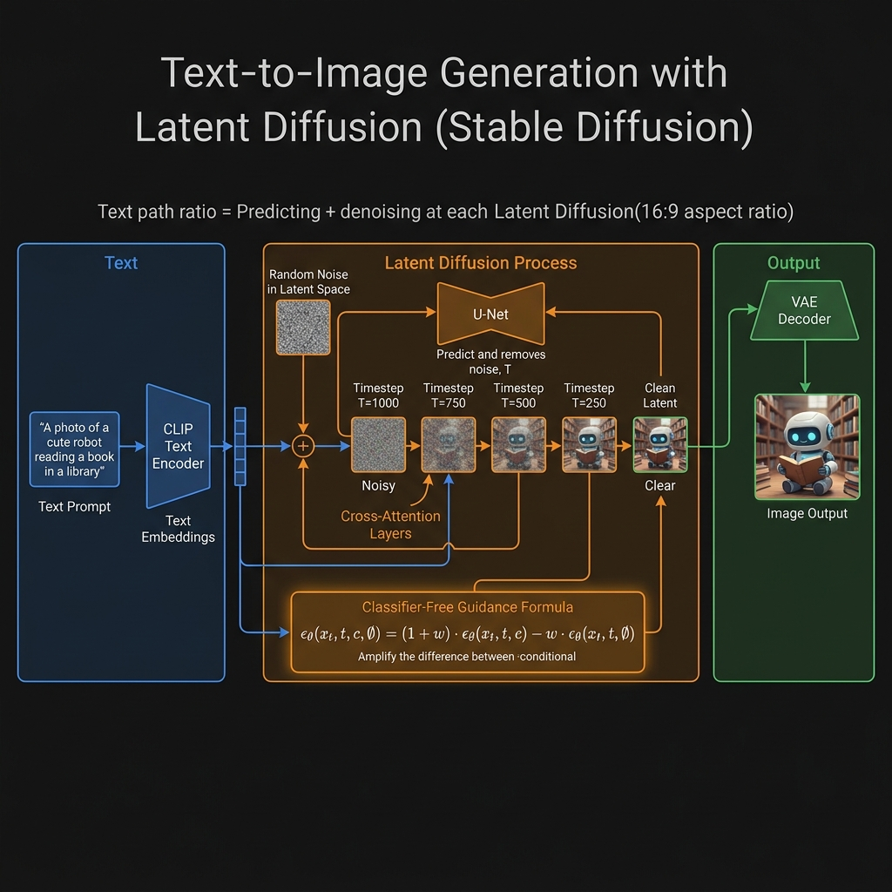
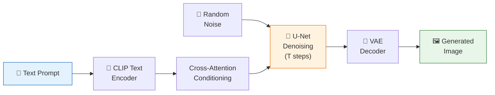

<!-- tags: genai, system-design, text-to-image, diffusion, stable-diffusion, dall-e -->
# 🎭 Text-to-Image Generation — Diffusion Models and DALL-E

📅 Created: 2026-04-21 · 🔄 Updated: 2026-04-21 · ⏱️ 20 min read

> "A corgi riding a skateboard in Times Square, digital art" → a photorealistic image. Text-to-image generation uses diffusion models to iteratively denoise random noise into coherent images, guided by text prompts through cross-attention.

| Aspect | Detail |
|--------|--------|
| **Scope** | Generating images from text descriptions |
| **Architecture** | Latent diffusion model with CLIP text encoder |
| **Key Innovation** | Iterative denoising in latent space; classifier-free guidance |
| **Prerequisites** | [Image Synthesis](./08-high-resolution-image-synthesis.md) |

---

## 1. DEFINE

A designer types "a cozy cabin in the mountains during winter, oil painting style." The model generates a unique image matching this description. The system must handle arbitrary creative prompts, maintain visual coherence, and produce high-resolution output.

### 1.1 Key Challenges

- **Open-vocabulary**: Any text prompt, including novel combinations never seen in training
- **Text-image alignment**: Generated images must faithfully reflect the prompt
- **Quality vs. diversity**: Users want both creative variety and high fidelity

---

## 2. VISUAL



*Text-to-image latent diffusion — CLIP text encoder conditions U-Net denoising through cross-attention, iteratively refining random noise into clean latent, then VAE decoder produces final image.*



---

## 3. CODE

### 3.1 Diffusion Process

**Forward process (training)**: Gradually add Gaussian noise to a real image over T timesteps until it becomes pure noise.

**Reverse process (generation)**: Start from pure noise and iteratively denoise, predicting and removing noise at each step. The U-Net learns to predict the noise component at each timestep.

### 3.2 Latent Diffusion (Stable Diffusion)

Operating in pixel space is computationally expensive. Latent diffusion compresses images into a lower-dimensional latent space first:

1. **VAE Encoder**: Image → compact latent representation
2. **Diffusion in latent space**: Forward/reverse processes operate on latent vectors (much smaller than pixel space)
3. **VAE Decoder**: Latent → full-resolution image

This reduces compute by 4–16× while maintaining quality.

### 3.3 Text Conditioning

**CLIP text encoder** converts the prompt into embeddings. These embeddings guide the U-Net via **cross-attention layers** at each denoising step — the model attends to the text representation while deciding how to denoise.

**Classifier-free guidance (CFG)**: During training, the text condition is randomly dropped (replaced with null). At inference, the model generates both conditional and unconditional predictions. The final prediction amplifies the difference:

```
output = unconditional + guidance_scale × (conditional - unconditional)
```

Higher guidance scale → stronger text adherence (but potential artifacts).

### 3.4 Training Data

Large-scale image-text pair datasets:
- **LAION-5B**: 5 billion image-text pairs scraped from the web
- **COYO-700M**: 700M curated pairs
- Filtering for quality, safety, and copyright compliance is critical

### 3.5 Evaluation

| Metric | Measures |
|--------|----------|
| **FID** | Overall image quality and diversity |
| **CLIP Score** | Text-image alignment (higher = better prompt adherence) |
| **Human preference** | Side-by-side comparisons for quality and relevance |

---

## 4. PITFALLS

| # | Mistake | Fix |
|---|---------|-----|
| 1 | Diffusion in pixel space | Use latent diffusion for 4–16× compute reduction |
| 2 | No classifier-free guidance | CFG dramatically improves text adherence |
| 3 | Insufficient safety filtering of training data | Filter NSFW, copyrighted, and harmful content from datasets |
| 4 | Evaluating only FID | Add CLIP Score for text alignment and human evaluation |

---

## 5. REF

| Resource | Link |
|----------|------|
| Latent Diffusion (Rombach et al., 2022) | [arxiv.org/abs/2112.10752](https://arxiv.org/abs/2112.10752) |
| DALL-E 2 (Ramesh et al., 2022) | [arxiv.org/abs/2204.06125](https://arxiv.org/abs/2204.06125) |
| Classifier-Free Guidance (Ho & Salimans, 2022) | [arxiv.org/abs/2207.12598](https://arxiv.org/abs/2207.12598) |

---

## 6. RECOMMEND

| Next Step | Link |
|-----------|------|
| Personalized Headshot Generation | [→ 10-personalized-headshot-generation.md](./10-personalized-headshot-generation.md) |
| Image Synthesis | [← 08-high-resolution-image-synthesis.md](./08-high-resolution-image-synthesis.md) |

**Navigation**: [← Previous: Image Synthesis](./08-high-resolution-image-synthesis.md) · [→ Next: Personalized Headshots](./10-personalized-headshot-generation.md)
