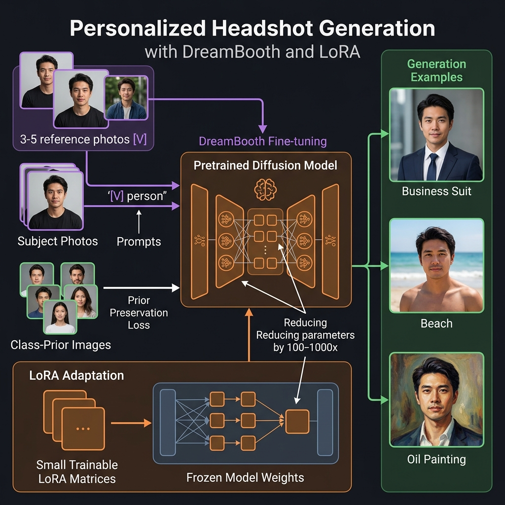
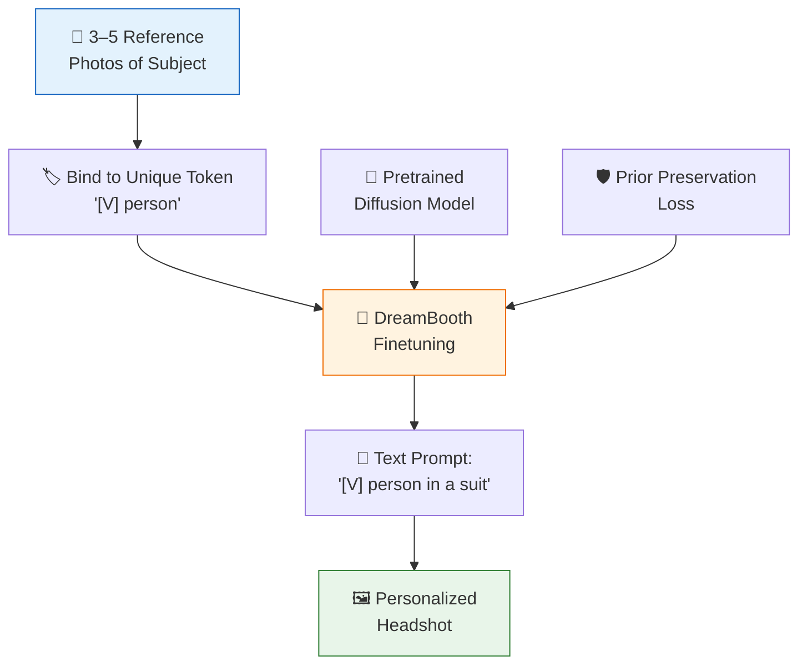

<!-- tags: genai, system-design, dreambooth, personalization, finetuning -->
# 🤳 Personalized Headshot Generation — DreamBooth and Few-Shot Adaptation

📅 Created: 2026-04-21 · 🔄 Updated: 2026-04-21 · ⏱️ 16 min read

> Generate professional headshots of a specific person in any style, setting, or outfit — from just 3–5 reference photos. DreamBooth fine-tunes a text-to-image model to bind a unique identifier to one person's visual identity.

| Aspect | Detail |
|--------|--------|
| **Scope** | Personalized image generation preserving individual identity |
| **Architecture** | Finetuned latent diffusion model (DreamBooth/LoRA) |
| **Key Innovation** | Few-shot subject binding with prior preservation loss |
| **Prerequisites** | [Text-to-Image](./09-text-to-image-generation.md) |

---

## 1. DEFINE

A user uploads 5 selfies. The system generates professional headshots of *that specific person* in a business suit, on a beach, or in oil painting style — maintaining their exact facial identity while changing everything else.

### 1.1 Key Challenges

- **Identity preservation**: The generated face must be recognizably the same person
- **Few-shot learning**: Only 3–5 reference images available
- **Editability**: Must still respond to text prompts for style/setting changes
- **Avoiding overfitting**: The model must not lose general generation ability

---

## 2. VISUAL

*DreamBooth personalization — 3-5 reference photos bound to unique token, finetuned with prior preservation loss, LoRA injects small trainable matrices for efficient adaptation, generating identity-consistent images in any style.*

---

## 3. CODE

### 3.1 DreamBooth Method

1. **Choose a rare token identifier** (e.g., `[V]`) that doesn't conflict with existing vocabulary
2. **Create training pairs**: Associate reference photos with prompts like "a photo of [V] person"
3. **Finetune** the diffusion model on these pairs — the model learns to associate `[V]` with the subject's visual identity

### 3.2 Prior Preservation Loss

Without this, the model overfits to the subject and forgets how to generate other people:

- Generate class-specific images ("a photo of a person") using the *original* model
- Include these in training alongside the subject-specific pairs
- The combined loss preserves general knowledge while learning the new subject

### 3.3 LoRA — Efficient Finetuning

Full finetuning is expensive. **Low-Rank Adaptation (LoRA)** injects small trainable matrices into existing layers:
- Freezes original model weights entirely
- Adds low-rank decomposition matrices (A × B) at attention layers
- Reduces trainable parameters by 100–1000×
- Multiple LoRA adapters can coexist for different subjects

### 3.4 Evaluation

| Metric | Measures |
|--------|----------|
| **Face identity similarity** | Cosine similarity between generated and reference face embeddings |
| **CLIP Score** | Text-image alignment for style/setting |
| **FID** | Overall image quality |
| **Human evaluation** | Identity recognition, naturalness, prompt adherence |

---

## 4. PITFALLS

| # | Mistake | Fix |
|---|---------|-----|
| 1 | No prior preservation loss | Model forgets general generation; add class-prior images |
| 2 | Too many finetuning steps | Overfits to reference images; use early stopping |
| 3 | Common token as identifier | Token conflicts with existing vocabulary; use rare/invented tokens |
| 4 | Full model finetuning for each user | Unsustainable cost; use LoRA for efficient per-user adaptation |

---

## 5. REF

| Resource | Link |
|----------|------|
| DreamBooth (Ruiz et al., 2023) | [arxiv.org/abs/2208.12242](https://arxiv.org/abs/2208.12242) |
| LoRA (Hu et al., 2021) | [arxiv.org/abs/2106.09685](https://arxiv.org/abs/2106.09685) |
| Textual Inversion (Gal et al., 2022) | [arxiv.org/abs/2208.01618](https://arxiv.org/abs/2208.01618) |

---

## 6. RECOMMEND

| Next Step | Link |
|-----------|------|
| Text-to-Video Generation | [→ 11-text-to-video-generation.md](./11-text-to-video-generation.md) |
| Text-to-Image | [← 09-text-to-image-generation.md](./09-text-to-image-generation.md) |

**Navigation**: [← Previous: Text-to-Image](./09-text-to-image-generation.md) · [→ Next: Text-to-Video](./11-text-to-video-generation.md)
