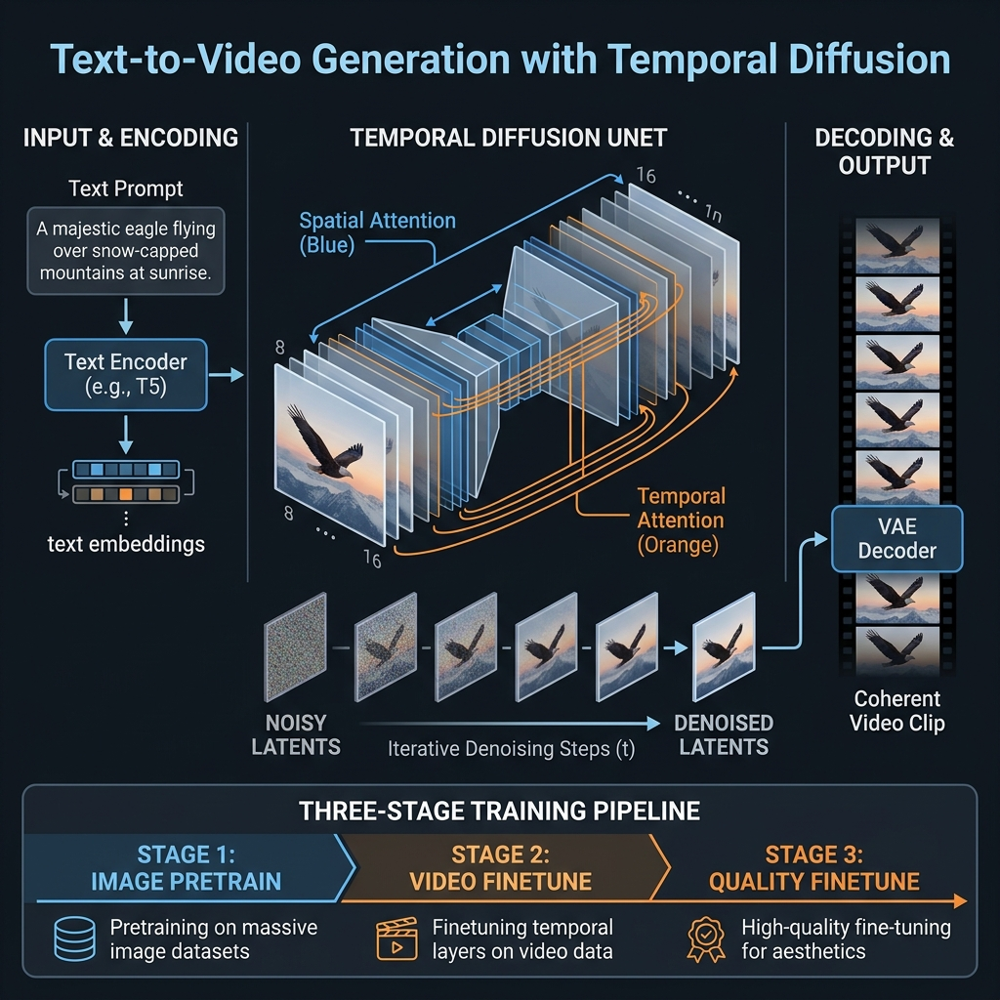
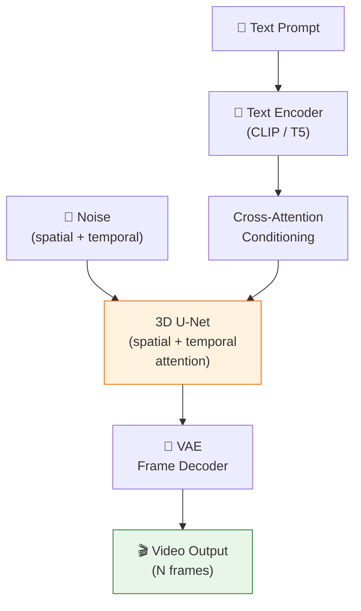

<!-- tags: genai, system-design, text-to-video, video-generation, temporal-coherence -->
# 🎬 Text-to-Video Generation — Temporal Diffusion and Motion Coherence

📅 Created: 2026-04-21 · 🔄 Updated: 2026-04-21 · ⏱️ 18 min read

> "A drone shot over a coral reef with tropical fish swimming" → a coherent, smooth video clip. Text-to-video extends diffusion models from single frames to temporal sequences, adding motion modeling and frame consistency as first-class architectural concerns.

| Aspect | Detail |
|--------|--------|
| **Scope** | Generating short video clips from text descriptions |
| **Architecture** | 3D U-Net with temporal attention layers + text conditioning |
| **Key Innovation** | Temporal attention for frame coherence; video-aware training |
| **Prerequisites** | [Text-to-Image](./09-text-to-image-generation.md) |

---

## 1. DEFINE

Text-to-video adds a third dimension to image generation: time. Each frame must be individually photorealistic *and* temporally coherent with neighboring frames. A face cannot flicker between identities. A walking person cannot teleport between frames.

### 1.1 Key Challenges

| Challenge | Why It Is Hard |
|-----------|---------------|
| **Temporal coherence** | Objects must maintain consistent identity, position, and motion across frames |
| **Motion modeling** | Natural-looking movement requires understanding physics and dynamics |
| **Compute scale** | Generating N frames costs roughly N× the compute of a single image |
| **Training data** | High-quality text-video pairs are scarce compared to text-image pairs |

---

## 2. VISUAL

*Text-to-video temporal diffusion — 3D U-Net processes frame stack with spatial attention (within-frame) and temporal attention (cross-frame) for coherent motion, with three-stage training pipeline.*

---

## 3. CODE

### 3.1 Architecture — Inflating Image Models

The core approach: take a pretrained text-to-image diffusion model and **inflate** it to handle video:

1. **Spatial attention** (from the image model): Handles within-frame visual quality
2. **Temporal attention** (new): Added between frames to model motion and consistency
3. The U-Net becomes a **3D U-Net** — processing spatial dimensions (H×W) across a temporal dimension (T frames)

### 3.2 Temporal Attention

At each denoising step, temporal attention layers allow each frame to attend to all other frames. This ensures:
- Object identity persists across frames
- Motion trajectories are smooth
- Lighting and color remain consistent
- Background elements don't randomly change

### 3.3 Training Strategy

**Stage 1**: Pretrain on text-image pairs (leverages massive image datasets).

**Stage 2**: Finetune on text-video pairs with temporal attention layers:
- Freeze spatial layers (preserve image quality)
- Train only temporal attention layers (learn motion)
- Gradually unfreeze spatial layers for joint optimization

**Stage 3** (optional): Finetune on high-quality, curated video clips for improved quality.

### 3.4 Inference Optimizations

Video generation is compute-intensive. Key optimizations:
- **Keyframe generation**: Generate sparse keyframes, then interpolate intermediate frames
- **Temporal super-resolution**: Generate at low frame rate, upsample to target FPS
- **Spatial super-resolution**: Generate at low resolution, upscale each frame

### 3.5 Evaluation

| Metric | Measures |
|--------|----------|
| **FVD (Fréchet Video Distance)** | Distribution distance for video quality |
| **FID per frame** | Individual frame quality |
| **Temporal consistency score** | Optical flow smoothness between frames |
| **CLIP Score** | Text-video alignment |
| **Human evaluation** | Motion naturalness, coherence, prompt adherence |

---

## 4. PITFALLS

| # | Mistake | Fix |
|---|---------|-----|
| 1 | Training temporal and spatial layers simultaneously from scratch | Inflate from pretrained image model; train temporal layers first |
| 2 | No temporal attention | Frames generated independently lack coherence; add cross-frame attention |
| 3 | Generating all frames at target resolution directly | Use keyframe + interpolation + super-resolution for efficiency |
| 4 | Evaluating only per-frame quality | FID misses temporal artifacts; add FVD and consistency metrics |

---

## 5. REF

| Resource | Link |
|----------|------|
| Video Diffusion Models (Ho et al., 2022) | [arxiv.org/abs/2204.03458](https://arxiv.org/abs/2204.03458) |
| Make-A-Video (Singer et al., 2022) | [arxiv.org/abs/2209.14792](https://arxiv.org/abs/2209.14792) |
| Sora (OpenAI, 2024) | [openai.com/sora](https://openai.com/sora) |
| Veo (Google DeepMind, 2024) | [deepmind.google/veo](https://deepmind.google/technologies/veo) |

---

## 6. RECOMMEND

This is the final chapter. Text-to-video represents the current frontier of generative AI — extending diffusion models from 2D to 3D+time.

| Next Step | Link |
|-----------|------|
| Review the full course | [← 01-introduction-and-overview.md](./01-introduction-and-overview.md) |
| Revisit text-to-image foundations | [← 09-text-to-image-generation.md](./09-text-to-image-generation.md) |

**Navigation**: [← Previous: Personalized Headshots](./10-personalized-headshot-generation.md) · [🏠 Course Overview](./README.md)
