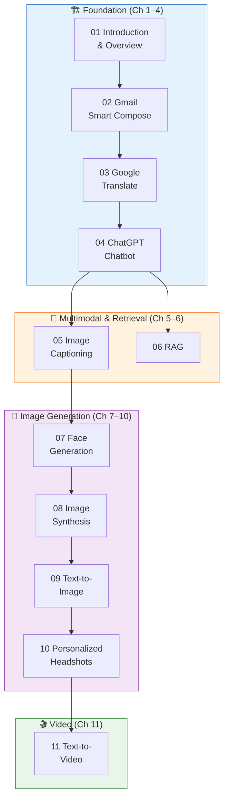

<!-- tags: genai, system-design, bytebytego, llm, course-index -->
# 🧠 GenAI System Design Interview — Complete Documentation Suite

📅 Created: 2026-04-21 · 🔄 Updated: 2026-04-21

> A comprehensive rewrite of the ByteByteGo "Generative AI System Design Interview" course — 11 chapters covering text generation, machine translation, chatbots, multimodal systems, image synthesis, and video generation. Each chapter follows the DEFINE → VISUAL → CODE → PITFALLS → REF → RECOMMEND framework.

---

## Course Map

---

## Chapter Index

### 🏗️ Foundation — Text Generation & LLM Fundamentals

| # | Chapter | Architecture | Key Concept |
|---|---------|-------------|-------------|
| 01 | [Introduction and Overview](./01-introduction-and-overview.md) | — | Seven-step ML system design framework |
| 02 | [Gmail Smart Compose](./02-gmail-smart-compose.md) | Decoder-only Transformer | Tokenization, beam search, two-stage training |
| 03 | [Google Translate](./03-google-translate.md) | Encoder-decoder Transformer | Cross-attention, BPE, BLEU/METEOR evaluation |
| 04 | [ChatGPT Personal Assistant](./04-chatgpt-personal-assistant.md) | Decoder-only + RLHF | Three-stage training (Pretrain → SFT → RLHF) |

### 🔀 Multimodal & Knowledge-Grounded Generation

| # | Chapter | Architecture | Key Concept |
|---|---------|-------------|-------------|
| 05 | [Image Captioning](./05-image-captioning.md) | ViT encoder + text decoder | Vision-language bridge, CIDEr evaluation |
| 06 | [RAG](./06-retrieval-augmented-generation.md) | Retrieval + LLM pipeline | Vector search, chunking, RAGAS evaluation |

### 🎨 Image Generation

| # | Chapter | Architecture | Key Concept |
|---|---------|-------------|-------------|
| 07 | [Realistic Face Generation](./07-realistic-face-generation.md) | StyleGAN | Adversarial training, disentangled latent space |
| 08 | [High-Resolution Image Synthesis](./08-high-resolution-image-synthesis.md) | VQ-VAE/VQ-GAN + Transformer | Image tokenization, autoregressive visual generation |
| 09 | [Text-to-Image Generation](./09-text-to-image-generation.md) | Latent Diffusion (Stable Diffusion) | Denoising, classifier-free guidance, CLIP conditioning |
| 10 | [Personalized Headshot Generation](./10-personalized-headshot-generation.md) | DreamBooth / LoRA | Few-shot adaptation, prior preservation loss |

### 🎬 Video Generation

| # | Chapter | Architecture | Key Concept |
|---|---------|-------------|-------------|
| 11 | [Text-to-Video Generation](./11-text-to-video-generation.md) | 3D U-Net with temporal attention | Model inflation, temporal coherence, FVD evaluation |

---

## Architecture Evolution Across Chapters

| Chapter | Input | Output | Architecture | Training Strategy |
|---------|-------|--------|-------------|------------------|
| Smart Compose | Text prefix | Text continuation | Decoder-only | Pretrain → Finetune |
| Google Translate | Source text | Target text | Encoder-decoder | MLM Pretrain → Translation Finetune |
| ChatGPT | Conversation | Response | Decoder-only | Pretrain → SFT → RLHF |
| Image Captioning | Image | Text | ViT + Decoder | Pretrain encoder → Finetune end-to-end |
| RAG | Query + Docs | Grounded text | Retrieval + LLM | RAFT finetuning |
| Face Generation | Noise | Face image | GAN (StyleGAN) | Adversarial training |
| Image Synthesis | Noise / tokens | Scene image | VQ-VAE + Transformer | Tokenizer → Autoregressive |
| Text-to-Image | Text | Image | Latent Diffusion | Diffusion training + CFG |
| Personalized Headshots | Text + reference | Personalized image | Diffusion + DreamBooth | Few-shot finetuning |
| Text-to-Video | Text | Video | 3D Diffusion | Image pretrain → Video finetune |

---

## How to Use This Suite

1. **Sequential reading**: Follow chapters 01 → 11 for a complete learning path
2. **Architecture deep-dive**: Jump to chapters grouped by architecture family
3. **Interview prep**: Each chapter follows the seven-step framework from Chapter 01
4. **Cross-reference**: Use the architecture evolution table to compare design decisions

---

## Source

Synthesized from the [ByteByteGo GenAI System Design Interview](https://bytebytego.com/courses/genai-system-design-interview/introduction-and-overview) course, rewritten to follow the repository's R1–R8 documentation standards with the Concept-First pedagogical profile.
