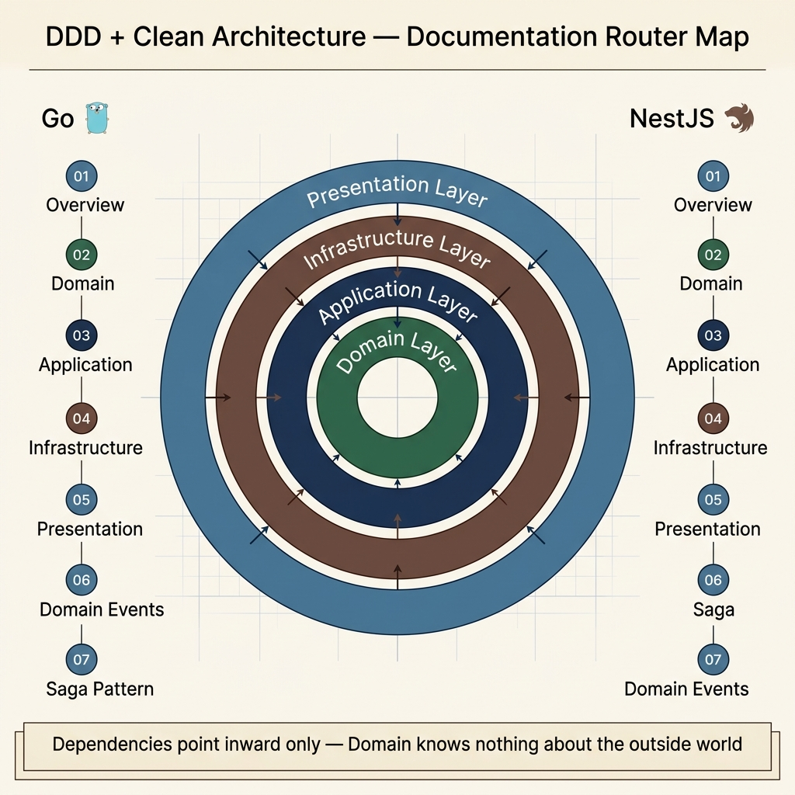

<!-- tags: architecture, ddd, clean-architecture, overview -->
# 🏛️ Architecture — DDD & Clean Architecture

> Software architecture documentation: Domain-Driven Design (DDD) and Clean Architecture.

📅 Created: 2026-03-27 · 🔄 Updated: 2026-03-27 · ⏱️ 3 min read

---

## 📂 Contents



| Subfolder | Language / Framework | Description | Complexity |
|-----------|----------------------|-------------|------------|
| [go/](./go/) | 🐹 Go | DDD + Clean Architecture in Go: layers, folder structure, dependency injection, repository pattern | ⭐⭐⭐ |
| [nestjs/](./nestjs/) | 🐈 NestJS | DDD + Clean Architecture in NestJS: modules, use-cases, CQRS, layered architecture | ⭐⭐⭐ |

---

## 🗺️ Architecture Overview

```text
┌─────────────────────────────────────────────────────────────────┐
│                        Clean Architecture                        │
│                                                                 │
│    ┌─────────────────────────────────────────────────────┐      │
│    │              Presentation / Delivery Layer          │      │
│    │         (HTTP Controllers, gRPC, GraphQL, CLI)      │      │
│    └───────────────────────┬─────────────────────────────┘      │
│                            │ (injects via DI)                   │
│    ┌───────────────────────▼─────────────────────────────┐      │
│    │              Application Layer (Use Cases)          │      │
│    │         Commands, Queries, DTOs, CQRS handlers      │      │
│    └───────────────────────┬─────────────────────────────┘      │
│                            │ (depends on interfaces)            │
│    ┌───────────────────────▼─────────────────────────────┐      │
│    │              Domain Layer (Core Business)           │      │
│    │    Entities, Value Objects, Aggregates, Events      │      │
│    │    Domain Services, Repository interfaces           │      │
│    └─────────────────────────────────────────────────────┘      │
│    ┌─────────────────────────────────────────────────────┐      │
│    │           Infrastructure Layer (Adapters)           │      │
│    │   DB, Cache, MQ, External APIs — implements Domain  │      │
│    └─────────────────────────────────────────────────────┘      │
│                                                                 │
└─────────────────────────────────────────────────────────────────┘
```

### Dependency Rule

> **All dependencies point inward** — outer layers know about inner layers, but never the reverse.

```text
Infrastructure → Application → Domain
   (knows)          (knows)      (knows nothing)
```

---

## 🧱 Domain-Driven Design (DDD)

| Concept | Description | Example |
|---------|-------------|---------|
| **Entity** | Object with identity, mutable | `User`, `Order`, `Product` |
| **Value Object** | Immutable, no identity, equality by value | `Email`, `Money`, `Address` |
| **Aggregate** | Cluster of entities with 1 Aggregate Root | `Order` (root) + `OrderItem` |
| **Repository** | Interface for persisting/retrieving aggregates | `UserRepository` |
| **Domain Service** | Business logic that belongs to no single entity | `PricingService`, `InventoryService` |
| **Domain Event** | A business event that has occurred | `OrderPlaced`, `PaymentProcessed` |
| **Bounded Context** | Boundary of a subdomain/module | `Ordering`, `Inventory`, `Payment` |

---

## 🔑 Key Principles

| Principle | Description |
|-----------|-------------|
| **Dependency Inversion** | High-level modules do not depend on low-level modules; both depend on abstractions |
| **Single Responsibility** | Each class/module has only one reason to change |
| **Open/Closed** | Open for extension, closed for modification |
| **Repository Pattern** | Domain does not know how data is stored; it only knows the interface |
| **CQRS** | Commands (write) and Queries (read) are completely separated |

---

## 🚀 Quick Start

Read in order:

1. **[go/](./go/)** — If you work with Go, Gin, Fiber
2. **[nestjs/](./nestjs/)** — If you work with NestJS, TypeScript

---

← [Assets Overview](../README.md)
