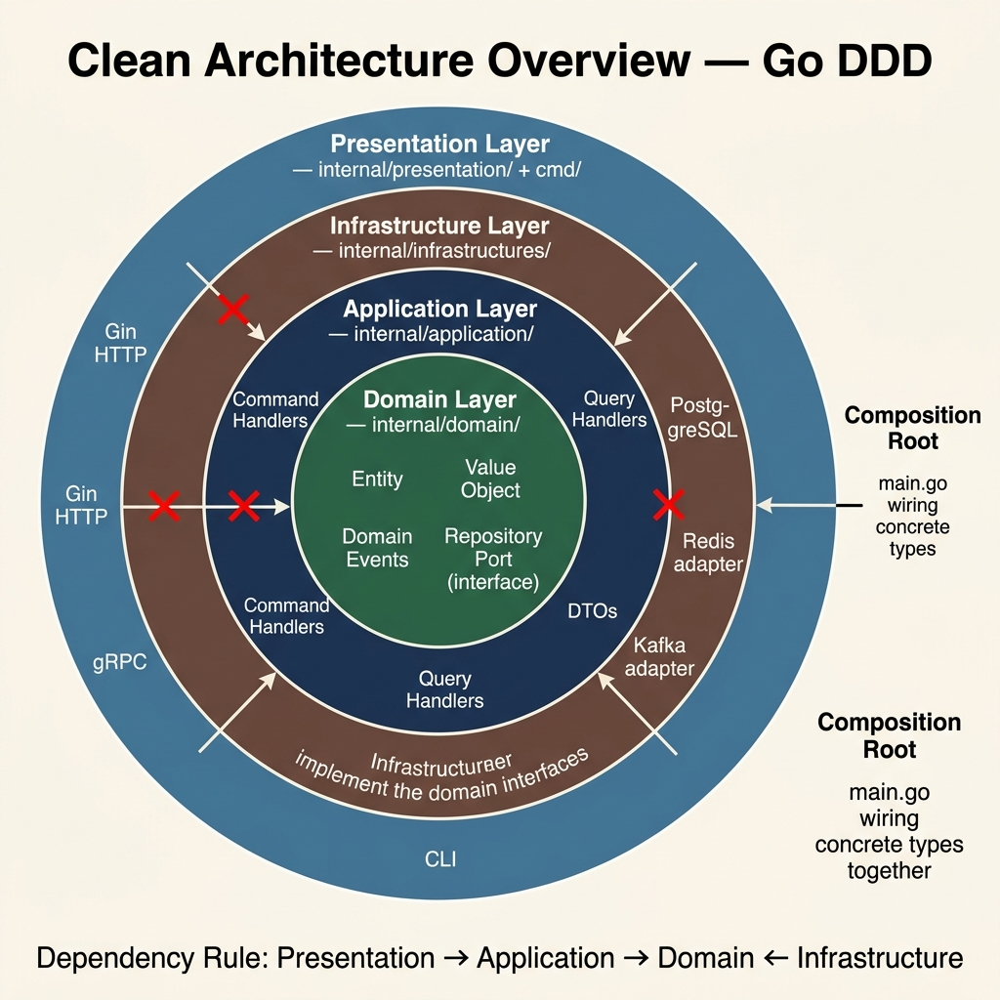
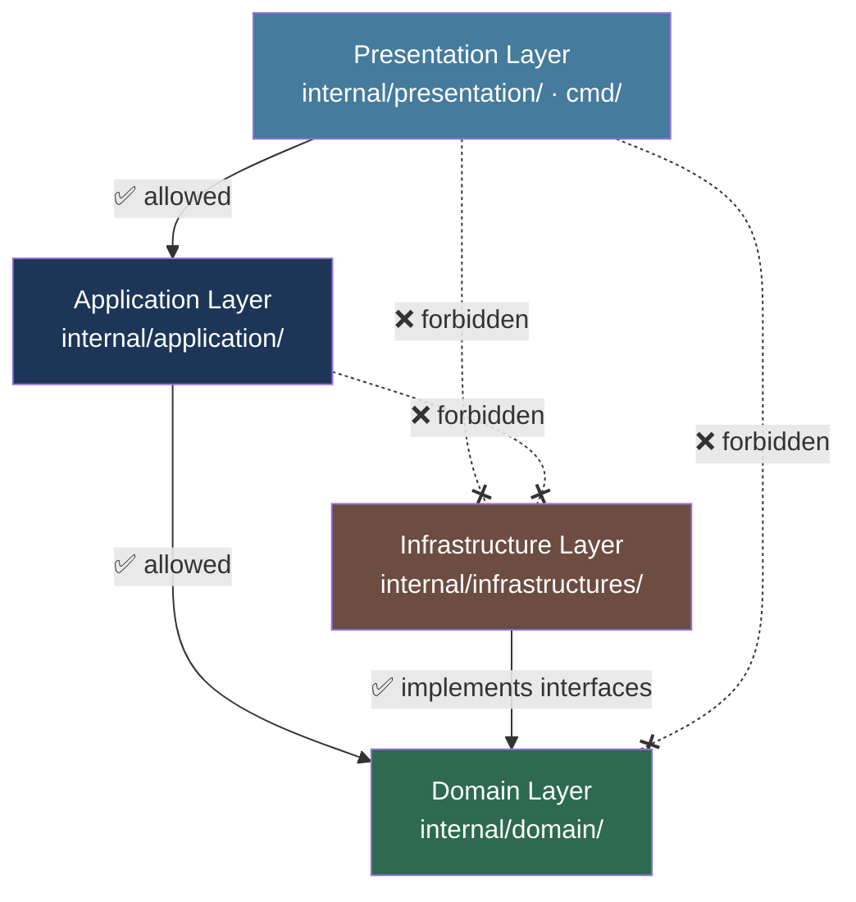
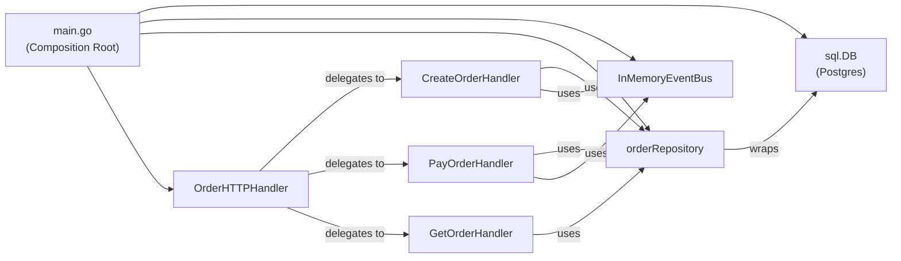

<!-- tags: architecture, clean-architecture, golang -->
# 🏗️ Clean Architecture Overview — Go DDD

> Overview of 4 layers, dependency rules, and Go project organization using DDD + Clean Architecture.

📅 Created: 2026-03-24 · 🔄 Updated: 2026-03-24 · ⏱️ 15 min read

| Aspect | Detail |
|--------|--------|
| **Pattern** | Clean Architecture + DDD |
| **Language** | Go 1.21+ |
| **Key libs** | `database/sql`, `gin-gonic/gin`, `google.golang.org/grpc` |
| **Dependency Rule** | `Presentation → Application → Domain ← Infrastructure` |

---

## 1. DEFINE

### Clean Architecture in Go

Clean Architecture organizes code into four concentric circles. The **Dependency Rule** dictates that code only points inward. External layers never depend on internal layers.

| Layer | Package | Depends On | Unaware Of |
|-------|---------|---------------|---------------------|
| **Domain** | `internal/domain/` | Nothing (Pure Go) | Application, Infra, Presentation |
| **Application** | `internal/application/` | Domain | Infra, Presentation |
| **Infrastructure** | `internal/infrastructures/` | Domain (interfaces) | Application |
| **Presentation** | `internal/presentation/`, `cmd/` | Application | Direct Domain access |

### Go vs NestJS: No DI Framework

Go uses manual dependency injection instead of frameworks like NestJS. Developers pass dependencies through constructors. This approach avoids magic and reflection-based systems.

```go
// Go: explicit dependency wiring allows manual tree tracing
handler := commands.NewCreateOrderHandler(
    persistence.NewOrderRepository(db),
    messaging.NewEventBus(),
    logger,
)
```

### Why avoid `database/sql` in `internal/domain/`?

The Domain layer contains pure business logic. It remains unaware of databases or frameworks. The Infrastructure layer implements Domain interfaces to maintain this separation.

---

These failure modes seem common. However, importing domain packages from infrastructure breaks dependency inversion. Missing graceful shutdowns causes resource leaks during deployment. We examine these traps in the PITFALLS section.

## 2. VISUAL



### Project Structure

```
go-domain-driven-design/
├── cmd/
│   └── api/
│       └── main.go              ← Entry point: wire dependencies
│
├── internal/
│   ├── domain/                  ← Layer 1: Business rules
│   │   ├── order/
│   │   │   ├── order.go         ← Aggregate Root (entity)
│   │   │   ├── order_item.go    ← Entity
│   │   │   ├── money.go         ← Value Object
│   │   │   ├── order_status.go  ← Value Object (enum)
│   │   │   ├── events/
│   │   │   │   ├── order_created.go
│   │   │   │   └── order_paid.go
│   │   │   └── repository.go    ← Repository Port (interface)
│   │   └── shared/
│   │       └── domain_event.go  ← DomainEvent interface + base
│   │
│   ├── application/             ← Layer 2: Use cases
│   │   └── order/
│   │       ├── commands/
│   │       │   ├── create_order.go
│   │       │   └── pay_order.go
│   │       ├── queries/
│   │       │   └── get_order.go
│   │       └── events/
│   │           └── order_event_handler.go
│   │
│   ├── infrastructures/         ← Layer 3: Implements interfaces
│   │   ├── persistence/
│   │   │   └── order_repository.go
│   │   ├── messaging/
│   │   │   └── event_bus.go
│   │   └── tasks/               ← Asynq background tasks
│   │
│   └── presentation/            ← Layer 4: HTTP/gRPC
│       └── http/
│           └── order_handler.go
│
└── pkg/                         ← Reusable libraries
    ├── events/                  ← EventBus interface
    ├── logger/
    └── middleware/
```

### Dependency Flow Diagram

```
┌──────────────────────────────────────────┐
│              cmd/api/main.go             │
│  Composition Root: wires everything     │
│  together. It is the only place         │
│  knowing concrete types.                │
└──────────┬───────────────────────────────┘
           │ creates & injects
           ▼
┌──────────────────────────────────────────┐
│         Presentation Layer               │
│  presentation/http/order_handler.go     │
│  Knows: CommandHandler interface        │
│  Unaware of: DB, Kafka, Domain          │
└──────────┬───────────────────────────────┘
           │ calls
           ▼
┌──────────────────────────────────────────┐
│          Application Layer               │
│  application/order/commands/            │
│  Knows: Domain types, Repo interface    │
│  Unaware of: SQL, Gin, Kafka            │
└──────────┬───────────────────────────────┘
           │ uses interfaces from
           ▼
┌──────────────────────────────────────────┐
│            Domain Layer                  │
│  domain/order/order.go                  │
│  domain/order/repository.go (interface) │
│  Pure Go: no external dependencies      │
└──────────────────────────────────────────┘
           ▲
           │ implements
┌──────────┴───────────────────────────────┐
│        Infrastructure Layer              │
│  infrastructures/persistence/           │
│  infrastructures/messaging/             │
│  Implements domain interfaces          │
└──────────────────────────────────────────┘
```

### Diagram: 4-Layer Dependency Flow



### Diagram: Composition Root (main.go) Wiring



---

## 3. CODE

### Basic: Wiring in main.go (Composition Root)

The Composition Root knows all concrete implementations. Domain and application layers remain unaware. Only main.go handles these mappings.

```go
// cmd/api/main.go
package main

import (
    "context"
    "database/sql"
    "log/slog"
    "net/http"
    "os"

    _ "github.com/lib/pq"
    "go-domain-driven-design/internal/application/order/commands"
    "go-domain-driven-design/internal/application/order/queries"
    "go-domain-driven-design/internal/infrastructures/messaging"
    "go-domain-driven-design/internal/infrastructures/persistence"
    httphandler "go-domain-driven-design/internal/presentation/http"
)

func main() {
    logger := slog.New(slog.NewJSONHandler(os.Stdout, nil))

    // ✅ Compose Infrastructure
    db, err := sql.Open("postgres", os.Getenv("DATABASE_URL"))
    if err != nil {
        logger.Error("failed to connect db", "error", err)
        os.Exit(1)
    }
    defer db.Close()

    // ✅ Compose Event Bus: uses in-memory for development
    eventBus := messaging.NewInMemoryEventBus(logger)

    // ✅ Compose Repository: Infrastructure implements Domain interface
    orderRepo := persistence.NewOrderRepository(db)

    // ✅ Compose Command Handlers (Application)
    createOrderHandler := commands.NewCreateOrderHandler(orderRepo, eventBus, logger)
    payOrderHandler    := commands.NewPayOrderHandler(orderRepo, eventBus, logger)

    // ✅ Compose Query Handlers (Application)
    getOrderHandler := queries.NewGetOrderHandler(orderRepo)

    // ✅ Compose HTTP Handler (Presentation)
    orderHTTPHandler := httphandler.NewOrderHandler(
        createOrderHandler,
        payOrderHandler,
        getOrderHandler,
        logger,
    )

    // Register routes and start server
    mux := http.NewServeMux()
    mux.HandleFunc("POST /orders", orderHTTPHandler.CreateOrder)
    mux.HandleFunc("POST /orders/{id}/pay", orderHTTPHandler.PayOrder)
    mux.HandleFunc("GET /orders/{id}", orderHTTPHandler.GetOrder)

    logger.Info("server starting", "addr", ":8080")
    if err := http.ListenAndServe(":8080", mux); err != nil {
        logger.Error("server failed", "error", err)
    }
}
```

Basic wiring covers the fundamentals. However, module grouping requires the provider pattern for better organization.

### Intermediate: Module-level Grouping (Provider Pattern)

As the application grows, separate wiring into provider functions.

```go
// cmd/api/providers.go
package main

import (
    "database/sql"
    "log/slog"
    "go-domain-driven-design/internal/application/order/commands"
    "go-domain-driven-design/internal/infrastructures/messaging"
    "go-domain-driven-design/internal/infrastructures/persistence"
)

// OrderModule groups dependencies for the Order bounded context
type OrderModule struct {
    CreateOrder *commands.CreateOrderHandler
    PayOrder    *commands.PayOrderHandler
}

func NewOrderModule(db *sql.DB, bus messaging.EventBus, logger *slog.Logger) *OrderModule {
    repo := persistence.NewOrderRepository(db)
    return &OrderModule{
        CreateOrder: commands.NewCreateOrderHandler(repo, bus, logger),
        PayOrder:    commands.NewPayOrderHandler(repo, bus, logger),
    }
}
```

Module grouping manages complexity. Now, implement graceful shutdowns using context chains for production safety.

### Advanced: Graceful Shutdown with Context

```go
// cmd/api/main.go: production-grade startup and shutdown
func main() {
    // ✅ Root context: propagates cancellation to all goroutines
    ctx, cancel := context.WithCancel(context.Background())
    defer cancel()

    // Wire dependencies...

    server := &http.Server{
        Addr:    ":8080",
        Handler: router,
    }

    // ✅ Start server: runs in a separate goroutine
    go func() {
        if err := server.ListenAndServe(); err != nil && err != http.ErrServerClosed {
            logger.Error("server error", "error", err)
            cancel()
        }
    }()

    // ✅ Wait for OS signals
    quit := make(chan os.Signal, 1)
    signal.Notify(quit, syscall.SIGINT, syscall.SIGTERM)

    select {
    case <-quit:
        logger.Info("shutting down...")
    case <-ctx.Done():
        logger.Info("context cancelled, shutting down...")
    }

    // ✅ Graceful shutdown: uses a 30s timeout
    shutdownCtx, shutdownCancel := context.WithTimeout(context.Background(), 30*time.Second)
    defer shutdownCancel()

    if err := server.Shutdown(shutdownCtx); err != nil {
        logger.Error("shutdown failed", "error", err)
    }

    // Clean up resources
    db.Close()
    logger.Info("server stopped")
}
```

---

You have mastered wiring, module grouping, and graceful shutdowns. Beware of dependency inversion failures and resource leaks. These traps appear in the following section.

## 4. PITFALLS

| # | Error | Fix |
|---|-----|-----|
| 1 | Domain imports `database/sql` | Domain defines interfaces; Infra implements them |
| 2 | Shared mutable global state | Pass dependencies through constructors |
| 3 | Using `init()` for wiring | Wire in `main()`; `init()` is opaque and hard to test |
| 4 | Circular imports between packages | Organize packages by layer, not by feature |
| 5 | Repository returns `*sql.Rows` | Return domain types; avoid DB-specific types |
| 6 | Using `context.Background()` in handlers | Use `r.Context()` to propagate request context |
| 7 | Missing `defer db.Close()` | Resource leaks; always defer cleanup |

---

You have explored Clean Architecture foundations and common pitfalls. Use the resources below to deepen your understanding.

## 5. REF

| Resource | Link |
|----------|------|
| Clean Architecture (Robert Martin) | https://blog.cleancoder.com/uncle-bob/2012/08/13/the-clean-architecture.html |
| Go Project Layout | https://github.com/golang-standards/project-layout |
| DDD_PACKAGE_ORGANIZATION.md | `/DDD_PACKAGE_ORGANIZATION.md` (project root) |
| Effective Go | https://go.dev/doc/effective_go |
| Wire (Google DI tool) | https://github.com/google/wire |

---

## 6. RECOMMEND

| Expansion | When | Reason |
|---------|---------|-------|
| `google/wire` | App >5 modules | Auto-generate wiring code |
| `uber-go/fx` | Large microservice | Full DI framework, lifecycle management |
| Multi-binary | Separate API + Worker | Separate `cmd/api`, `cmd/worker`, `cmd/cli` |
| Feature flags via config | Production rollout | Swap implementations without redeploying |
| Testcontainers | Integration test | Test with real Postgres instead of mocks |

---

→ [Domain Layer](./02-domain-layer.md)
