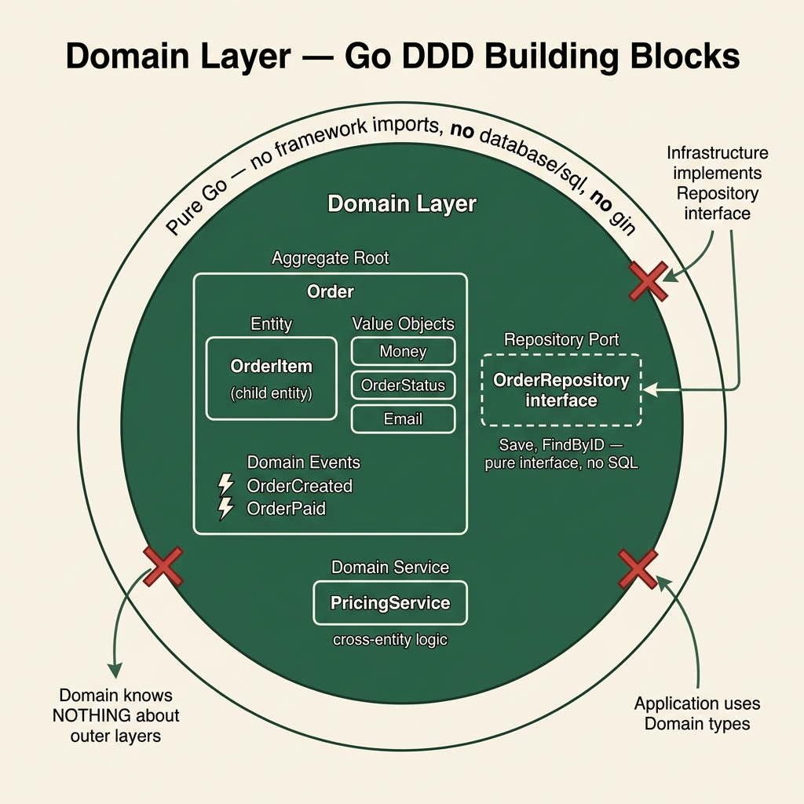

<!-- tags: architecture, clean-architecture, golang, ddd -->
# 🎯 Domain Layer — Go DDD

> Entity, Value Object, Aggregate Root, Domain Events, and Repository Port — pure Go, no frameworks.

📅 Created: 2026-03-24 · 🔄 Updated: 2026-03-24 · ⏱️ 20 min read

| Aspect | Detail |
|--------|--------|
| **Package** | `internal/domain/` |
| **Dependencies** | Pure Go stdlib only (`time`, `errors`). |
| **Forbidden** | `database/sql`, `gin`, `grpc`, or any other framework. |
| **Patterns** | Entity, AggregateRoot, ValueObject, DomainEvent, Repository Port. |

---

## 1. DEFINE

### What is the Domain Layer?

The Domain Layer contains **all business logic**. This includes rules, invariants, and validation. It remains unaware of databases, HTTP, or frameworks. It represents the innermost circle of Clean Architecture.

### Core Building Blocks

| Block | Definition | Example |
|-------|-----------|-------|
| **Value Object** | Immutable, defined by value, has no identity. | `Money`, `Email`, `OrderStatus`. |
| **Entity** | Has a unique identity and is mutable. | `OrderItem`. |
| **Aggregate Root** | Entry point for entity clusters; maintains invariants. | `Order`. |
| **Domain Event** | Record of a business event that occurred. | `OrderCreated`, `OrderPaid`. |
| **Repository Port** | Interface defining persistence without implementation. | `OrderRepository` interface. |
| **Domain Service** | Logic not belonging to a specific entity. | `PricingService`, `CancellationPolicy`. |

### Comparing Value Objects and Entities

| | Value Object | Entity |
|--|-------------|--------|
| **Identity** | None. | Unique (UUID/ID). |
| **Equality** | Based on values. | Based on ID. |
| **Mutability** | Immutable. | Mutable through methods. |
| **Go Example** | `type Money struct{ value int; currency string }` | `type OrderItem struct{ id OrderItemID; ... }` |

---

These patterns are clear but contain risks. Entities using DB tags leak infrastructure details into the domain. Mutable value objects break invariants silently. These traps appear in the PITFALLS section.

## 2. VISUAL



### Domain Model — Order Aggregate

```
Order (Aggregate Root)
├── OrderID (Value Object)
├── CustomerID (Value Object)
├── Money (Value Object — totalAmount)
├── OrderStatus (Value Object — enum)
├── []OrderItem (Entity)
│   ├── OrderItemID (Value Object)
│   ├── ProductID (Value Object)
│   ├── Quantity (Value Object)
│   └── Money (price)
└── []DomainEvent (events queue)

Domain Events:
├── OrderCreatedEvent
├── OrderItemAddedEvent
└── OrderPaidEvent
```

### Domain Layer Flow

```
HTTP Request
      │
      ▼ (Application Layer calls)
  Order.Create()     ← Static factory validates invariants.
      │
      ├─ Validates: totalAmount > 0.
      ├─ Validates: items not empty.
      └─ addEvent(OrderCreatedEvent).
             │
             ▼ (After Repository.Save())
      Events dispatched to EventBus.
```

---

## 3. CODE

### Basic: Value Object

A Value Object is an immutable struct with validation in its constructor. Two VOs with the same values are equal.

```go
// internal/domain/order/money.go
package order

import (
    "errors"
    "fmt"
)

// ✅ Value Object: immutable, equality by value
type Money struct {
    amount   int64  // use cents to avoid float precision issues
    currency string // "VND", "USD"
}

// ✅ Constructor with validation — do not use struct literals directly
func NewMoney(amount int64, currency string) (Money, error) {
    if amount < 0 {
        return Money{}, errors.New("amount cannot be negative")
    }
    if currency == "" {
        return Money{}, errors.New("currency cannot be empty")
    }
    return Money{amount: amount, currency: currency}, nil
}

// ✅ MustNewMoney — used in tests or when validation is guaranteed
func MustNewMoney(amount int64, currency string) Money {
    m, err := NewMoney(amount, currency)
    if err != nil {
        panic(err)
    }
    return m
}

// ✅ Accessors — do not expose fields directly
func (m Money) Amount() int64    { return m.amount }
func (m Money) Currency() string { return m.currency }

// ✅ Equality by value
func (m Money) Equals(other Money) bool {
    return m.amount == other.amount && m.currency == other.currency
}

// ✅ Business operations return new VOs (immutability)
func (m Money) Add(other Money) (Money, error) {
    if m.currency != other.currency {
        return Money{}, fmt.Errorf("cannot add %s to %s", other.currency, m.currency)
    }
    return Money{amount: m.amount + other.amount, currency: m.currency}, nil
}

func (m Money) Multiply(factor int64) Money {
    return Money{amount: m.amount * factor, currency: m.currency}
}

func (m Money) String() string {
    return fmt.Sprintf("%d %s", m.amount, m.currency)
}
```

```go
// internal/domain/order/order_status.go
package order

import "errors"

// ✅ Value Object as typed string — enum pattern
type OrderStatus string

const (
    StatusPending   OrderStatus = "PENDING"
    StatusPaid      OrderStatus = "PAID"
    StatusCancelled OrderStatus = "CANCELLED"
    StatusShipped   OrderStatus = "SHIPPED"
)

func NewOrderStatus(s string) (OrderStatus, error) {
    switch OrderStatus(s) {
    case StatusPending, StatusPaid, StatusCancelled, StatusShipped:
        return OrderStatus(s), nil
    default:
        return "", errors.New("invalid order status: " + s)
    }
}

// ✅ Business transitions
func (s OrderStatus) CanTransitionTo(next OrderStatus) bool {
    allowed := map[OrderStatus][]OrderStatus{
        StatusPending:  {StatusPaid, StatusCancelled},
        StatusPaid:     {StatusShipped, StatusCancelled},
        StatusShipped:  {},
        StatusCancelled: {},
    }
    for _, allowed := range allowed[s] {
        if allowed == next {
            return true
        }
    }
    return false
}
```

Entities are covered. Value objects must remain immutable to protect state consistency.

### Intermediate: Aggregate Root with Domain Events

The Aggregate Root controls the state of entity clusters and enforces invariants.

```go
// internal/domain/shared/domain_event.go
package shared

import (
    "time"
    "github.com/google/uuid"
)

// ✅ DomainEvent interface — domain defines shape, not the bus
type DomainEvent interface {
    GetID() string
    GetType() string
    GetOccurredAt() time.Time
    GetAggregateID() string
}

// ✅ BaseDomainEvent — embedded in concrete events
type BaseDomainEvent struct {
    id          string
    eventType   string
    occurredAt  time.Time
    aggregateID string
}

func NewBaseDomainEvent(eventType, aggregateID string) BaseDomainEvent {
    return BaseDomainEvent{
        id:          uuid.New().String(),
        eventType:   eventType,
        occurredAt:  time.Now(),
        aggregateID: aggregateID,
    }
}

func (e BaseDomainEvent) GetID() string          { return e.id }
func (e BaseDomainEvent) GetType() string        { return e.eventType }
func (e BaseDomainEvent) GetOccurredAt() time.Time { return e.occurredAt }
func (e BaseDomainEvent) GetAggregateID() string { return e.aggregateID }
```

```go
// internal/domain/order/order.go
package order

import (
    "errors"
    "time"
    "github.com/google/uuid"
    "go-domain-driven-design/internal/domain/order/events"
    "go-domain-driven-design/internal/domain/shared"
)

// ✅ OrderID — typed string Value Object
type OrderID string

func NewOrderID() OrderID { return OrderID(uuid.New().String()) }
func (id OrderID) String() string { return string(id) }

// ✅ Aggregate Root — private fields with controlled mutation
type Order struct {
    id         OrderID
    customerID string
    items      []*OrderItem
    total      Money
    status     OrderStatus
    createdAt  time.Time
    updatedAt  time.Time

    // ✅ Events queue — dispatched after successful save
    events []shared.DomainEvent
}

// CreateOrderInput — input DTO for factory method
type CreateOrderInput struct {
    CustomerID string
    Items      []CreateOrderItemInput
}

type CreateOrderItemInput struct {
    ProductID string
    Quantity  int
    UnitPrice Money
}

// ✅ Create — static factory validating invariants
func Create(input CreateOrderInput) (*Order, error) {
    if input.CustomerID == "" {
        return nil, errors.New("customerID is required")
    }
    if len(input.Items) == 0 {
        return nil, errors.New("order must have at least one item")
    }

    order := &Order{
        id:         NewOrderID(),
        customerID: input.CustomerID,
        status:     StatusPending,
        createdAt:  time.Now(),
        updatedAt:  time.Now(),
    }

    // ✅ Build items and calculate total
    total := MustNewMoney(0, "VND")
    for _, itemInput := range input.Items {
        item, err := newOrderItem(itemInput)
        if err != nil {
            return nil, err
        }
        order.items = append(order.items, item)
        itemTotal := itemInput.UnitPrice.Multiply(int64(itemInput.Quantity))
        total, err = total.Add(itemTotal)
        if err != nil {
            return nil, err
        }
    }
    order.total = total

    // ✅ Queue event — published after save
    order.addEvent(events.NewOrderCreatedEvent(
        string(order.id),
        order.customerID,
        total.Amount(),
        total.Currency(),
    ))

    return order, nil
}

// ✅ Reconstitute — rebuilds from DB without emitting events
func Reconstitute(
    id OrderID, customerID string,
    items []*OrderItem, total Money,
    status OrderStatus, createdAt, updatedAt time.Time,
) *Order {
    return &Order{
        id:         id,
        customerID: customerID,
        items:      items,
        total:      total,
        status:     status,
        createdAt:  createdAt,
        updatedAt:  updatedAt,
        events:     make([]shared.DomainEvent, 0),
    }
}

// ✅ Pay — business method with invariant check
func (o *Order) Pay() error {
    if !o.status.CanTransitionTo(StatusPaid) {
        return errors.New("order cannot be paid in status: " + string(o.status))
    }
    o.status = StatusPaid
    o.updatedAt = time.Now()
    o.addEvent(events.NewOrderPaidEvent(string(o.id), o.total.Amount(), o.total.Currency()))
    return nil
}

// ✅ Cancel — provides a reason for cancellation
func (o *Order) Cancel(reason string) error {
    if !o.status.CanTransitionTo(StatusCancelled) {
        return errors.New("order cannot be cancelled in status: " + string(o.status))
    }
    o.status = StatusCancelled
    o.updatedAt = time.Now()
    o.addEvent(events.NewOrderCancelledEvent(string(o.id), reason))
    return nil
}

// ✅ Accessors — readonly access; do not expose fields
func (o *Order) ID() OrderID          { return o.id }
func (o *Order) CustomerID() string   { return o.customerID }
func (o *Order) Total() Money         { return o.total }
func (o *Order) Status() OrderStatus  { return o.status }
func (o *Order) Items() []*OrderItem  { return o.items }
func (o *Order) CreatedAt() time.Time { return o.createdAt }

// ✅ Event management methods
func (o *Order) addEvent(event shared.DomainEvent) {
    o.events = append(o.events, event)
}

func (o *Order) Events() []shared.DomainEvent {
    return o.events
}

func (o *Order) ClearEvents() {
    o.events = make([]shared.DomainEvent, 0)
}
```

```go
// internal/domain/order/events/order_created.go
package events

import "go-domain-driven-design/internal/domain/shared"

type OrderCreatedEvent struct {
    shared.BaseDomainEvent
    CustomerID  string
    TotalAmount int64
    Currency    string
}

func NewOrderCreatedEvent(orderID, customerID string, amount int64, currency string) OrderCreatedEvent {
    return OrderCreatedEvent{
        BaseDomainEvent: shared.NewBaseDomainEvent("order.created", orderID),
        CustomerID:      customerID,
        TotalAmount:     amount,
        Currency:        currency,
    }
}
```

Aggregate roots must protect business invariants. We separate logic using ports.

### Advanced: Repository Port (Domain Interface)

```go
// internal/domain/order/repository.go
package order

import "context"

// ✅ Repository Port — interface only; implemented by Infrastructure
// Domain defines WHAT is needed, not HOW it is done
type Repository interface {
    Save(ctx context.Context, order *Order) error
    FindByID(ctx context.Context, id OrderID) (*Order, error)
    FindByCustomerID(ctx context.Context, customerID string) ([]*Order, error)
    Delete(ctx context.Context, id OrderID) error
}

// ✅ Domain Service — business logic spanning multiple aggregates
type PricingService interface {
    ApplyDiscount(order *Order, couponCode string) (Money, error)
}
```

---

We explored entities, value objects, and aggregate roots. Beware of infrastructure leaks and mutable VOs. These common traps are summarized below.

## 4. PITFALLS

| # | Error | Solution |
|---|-------|----------|
| 1 | Exporting all fields in an Entity. | Use private fields and accessor methods instead. |
| 2 | Calling `addEvent()` in `Reconstitute()`. | Only `Create()` or business methods should emit events. |
| 3 | Using pointer receivers for Value Objects. | VOs are immutable values; use value receivers. |
| 4 | Validating in callers instead of constructors. | Perform validation within `NewEmail()` or `NewMoney()`. |
| 5 | Putting Repository interfaces in `infra`. | Keep interfaces in `domain`; infra only implements them. |
| 6 | Domain methods returning free string errors. | Use sentinel errors or custom error types with context. |
| 7 | Using `float64` for `Money`. | Use `int64` (cents) to avoid floating point issues. |
| 8 | Large Aggregate Roots (>500 lines). | Extract logic into Domain Services or separate Aggregates. |

---

We have covered the Domain Layer and its traps. Use the references below to study further.

## 5. REF

| Resource | Link |
|----------|------|
| DDD Tactical Patterns | https://khalilstemmler.com/articles/domain-driven-design-intro/ |
| Value Objects in Go | https://threedots.tech/post/ddd-lite-in-go-introduction/ |
| Aggregate Pattern | https://martinfowler.com/bliki/DDD_Aggregate.html |
| Go errors | https://pkg.go.dev/errors |
| google/uuid | https://pkg.go.dev/github.com/google/uuid |

---

## 6. RECOMMEND

| Expansion | Use Case | Reason |
|---------|---------|-------|
| Sentinel errors | Diverse error handling. | `ErrOrderNotFound` with `errors.Is()` support. |
| `errors.As()` typed errors | Rich error contexts. | Provides HTTP status mapping for the presentation layer. |
| Multiple aggregates | Complexity management. | Split large orders into payment or fulfillment aggregates. |
| Event Sourcing | Audit trail requirements. | Store events instead of current state. |
| Domain Services | Cross-aggregate logic. | Handles `CancellationPolicy` or `DiscountCalculator`. |

---

← [Overview](./01-clean-architecture-overview.md) · → [Application Layer](./03-application-layer.md)
