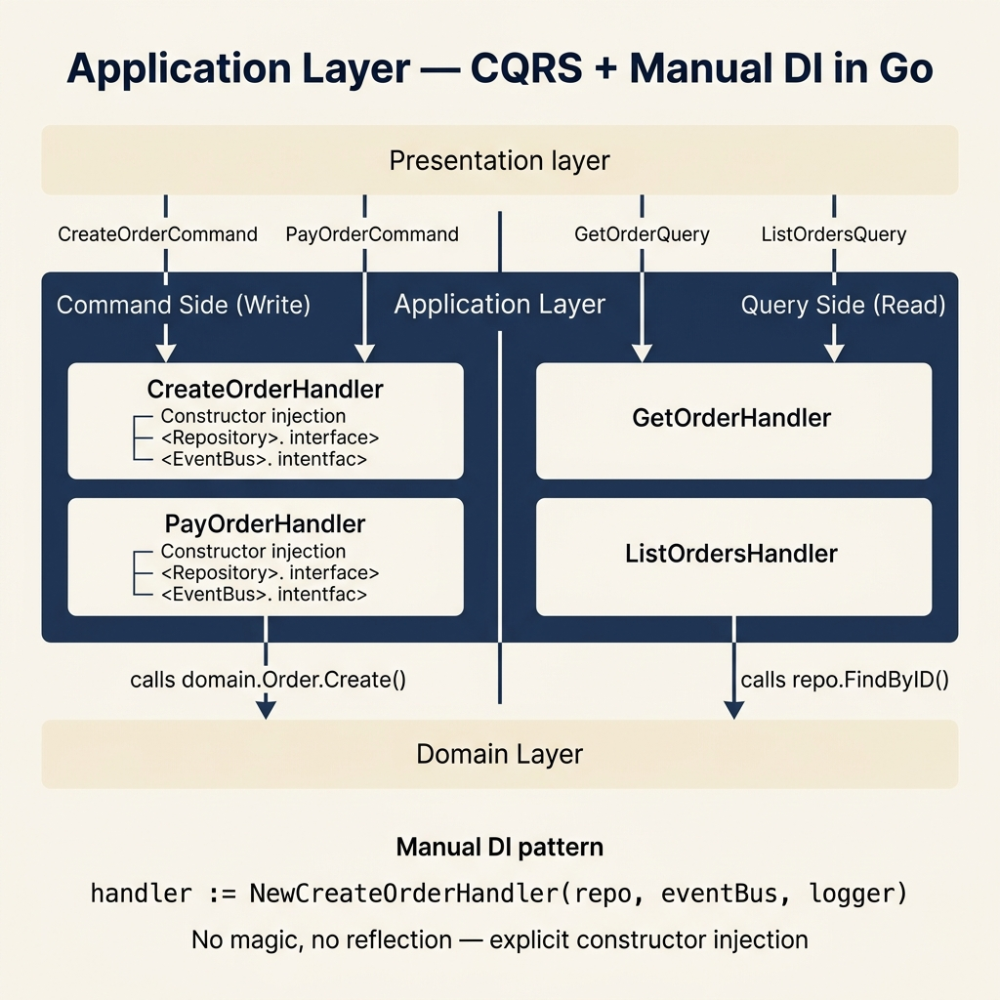

<!-- tags: architecture, clean-architecture, golang, application-layer -->
# ⚙️ Application Layer — Go DDD

> CQRS handlers, manual dependency injection, use cases, event dispatching after save

📅 Created: 2026-03-24 · 🔄 Updated: 2026-03-24 · ⏱️ 18 min read

| Aspect | Detail |
|--------|--------|
| **Package** | `internal/application/` |
| **Dependencies** | Domain layer only |
| **Pattern** | CQRS — Command Handler + Query Handler |
| **Forbidden** | `database/sql`, `gin`, gRPC types, Kafka — knows interfaces, not concrete types |

---

## 1. DEFINE

### What does the Application Layer do?

The Application Layer **orchestrates domain objects** to fulfill use cases. It:
- Receives input (Command/Query)
- Calls domain methods
- Calls the repository to persist
- Dispatches domain events
- Returns an output DTO

It **does not** contain business rules — all rules live in the Domain.

### CQRS in Go

| | Command | Query |
|--|---------|-------|
| **Purpose** | Change state | Read data |
| **Return** | `error` or `(ID, error)` | `(DTO, error)` |
| **Side effects** | Domain events | None |
| **Package** | `application/commands/` | `application/queries/` |

### Command Handler Interface (Generic)

```go
// pkg/cqrs/handler.go
type CommandHandler[C any, R any] interface {
    Handle(ctx context.Context, cmd C) (R, error)
}

type QueryHandler[Q any, R any] interface {
    Handle(ctx context.Context, query Q) (R, error)
}
```

---

These failure modes sound easy to avoid. But there is a trap: a use case that mixes business logic with infra logic blurs the layer boundary, and a command handler without idempotency causes duplicate side effects. That trap will surface in PITFALLS.

## 2. VISUAL



### Application Layer Structure

```
internal/application/
└── order/
    ├── commands/
    │   ├── create_order.go      ← CreateOrderCommand + Handler
    │   └── pay_order.go         ← PayOrderCommand + Handler
    ├── queries/
    │   └── get_order.go         ← GetOrderQuery + Handler + OrderDTO
    └── events/
        └── order_event_handler.go ← handles OrderCreatedEvent side effects
```

### Command Flow

```
HTTP Request
     │
     ▼ parse + validate input
CreateOrderCommand{ CustomerID, Items }
     │
     ▼ CreateOrderHandler.Handle(ctx, cmd)
         │
         ├─ order.Create(input)     ← domain: validates invariants, emits event
         │
         ├─ orderRepo.Save(ctx, order)  ← persist
         │
         └─ dispatch order.Events()     ← publish events AFTER successful save
                │
                ▼
         eventBus.Publish(ctx, OrderCreatedEvent)
```

---

## 3. CODE

### Basic: Command Handler

```go
// internal/application/order/commands/create_order.go
package commands

import (
    "context"
    "errors"
    "log/slog"
    "go-domain-driven-design/internal/domain/order"
    "go-domain-driven-design/internal/domain/shared"
)

// ✅ Command — input struct, no methods
type CreateOrderCommand struct {
    CustomerID string
    Items      []CreateOrderItemCmd
    IdempotencyKey string  // optional: prevent duplicate
}

type CreateOrderItemCmd struct {
    ProductID string
    Quantity  int
    UnitPrice int64  // cents
    Currency  string
}

// ✅ Response — output DTO
type CreateOrderResponse struct {
    OrderID string
    Total   int64
}

// ✅ Handler struct — dependencies injected via constructor
type CreateOrderHandler struct {
    orderRepo order.Repository
    eventBus  shared.EventBus
    logger    *slog.Logger
}

// ✅ Constructor — explicit DI, no magic
func NewCreateOrderHandler(
    repo order.Repository,
    bus shared.EventBus,
    logger *slog.Logger,
) *CreateOrderHandler {
    return &CreateOrderHandler{
        orderRepo: repo,
        eventBus:  bus,
        logger:    logger,
    }
}

func (h *CreateOrderHandler) Handle(ctx context.Context, cmd CreateOrderCommand) (CreateOrderResponse, error) {
    // ✅ Build domain input from command
    items := make([]order.CreateOrderItemInput, 0, len(cmd.Items))
    for _, item := range cmd.Items {
        price, err := order.NewMoney(item.UnitPrice, item.Currency)
        if err != nil {
            return CreateOrderResponse{}, err
        }
        items = append(items, order.CreateOrderItemInput{
            ProductID: item.ProductID,
            Quantity:  item.Quantity,
            UnitPrice: price,
        })
    }

    // ✅ Call domain factory — business rules enforced here
    o, err := order.Create(order.CreateOrderInput{
        CustomerID: cmd.CustomerID,
        Items:      items,
    })
    if err != nil {
        return CreateOrderResponse{}, err
    }

    // ✅ Persist via repository interface
    if err := h.orderRepo.Save(ctx, o); err != nil {
        return CreateOrderResponse{}, err
    }

    // ✅ Dispatch domain events AFTER successful save
    if err := h.dispatchEvents(ctx, o); err != nil {
        // ⚠️ Log but don't fail — order was saved successfully
        h.logger.Error("failed to dispatch events", "orderID", o.ID(), "error", err)
    }

    return CreateOrderResponse{
        OrderID: o.ID().String(),
        Total:   o.Total().Amount(),
    }, nil
}

func (h *CreateOrderHandler) dispatchEvents(ctx context.Context, o *order.Order) error {
    for _, event := range o.Events() {
        if err := h.eventBus.Publish(ctx, event); err != nil {
            return err
        }
    }
    o.ClearEvents()
    return nil
}
```

The basic use case is covered. But CQRS requires separating read and write — let us split them.

### Intermediate: Query Handler with DTO Mapping

The Query Handler only reads data — no domain methods called, no events emitted.

```go
// internal/application/order/queries/get_order.go
package queries

import (
    "context"
    "go-domain-driven-design/internal/domain/order"
)

// ✅ Query — read-only input
type GetOrderQuery struct {
    OrderID string
}

// ✅ DTO — presentation-friendly shape, does not expose domain types
type OrderDTO struct {
    ID         string        `json:"id"`
    CustomerID string        `json:"customer_id"`
    Status     string        `json:"status"`
    Total      MoneyDTO      `json:"total"`
    Items      []OrderItemDTO `json:"items"`
    CreatedAt  string        `json:"created_at"`
}

type MoneyDTO struct {
    Amount   int64  `json:"amount"`
    Currency string `json:"currency"`
}

type OrderItemDTO struct {
    ID        string   `json:"id"`
    ProductID string   `json:"product_id"`
    Quantity  int      `json:"quantity"`
    Price     MoneyDTO `json:"price"`
}

type GetOrderHandler struct {
    orderRepo order.Repository
}

func NewGetOrderHandler(repo order.Repository) *GetOrderHandler {
    return &GetOrderHandler{orderRepo: repo}
}

func (h *GetOrderHandler) Handle(ctx context.Context, q GetOrderQuery) (*OrderDTO, error) {
    id := order.OrderID(q.OrderID)

    o, err := h.orderRepo.FindByID(ctx, id)
    if err != nil {
        return nil, err
    }
    if o == nil {
        return nil, nil
    }

    // ✅ Map domain → DTO: Application layer handles transformation
    return toOrderDTO(o), nil
}

func toOrderDTO(o *order.Order) *OrderDTO {
    items := make([]OrderItemDTO, 0, len(o.Items()))
    for _, item := range o.Items() {
        items = append(items, OrderItemDTO{
            ID:        item.ID().String(),
            ProductID: item.ProductID(),
            Quantity:  item.Quantity(),
            Price: MoneyDTO{
                Amount:   item.Price().Amount(),
                Currency: item.Price().Currency(),
            },
        })
    }

    return &OrderDTO{
        ID:         o.ID().String(),
        CustomerID: o.CustomerID(),
        Status:     string(o.Status()),
        Total: MoneyDTO{
            Amount:   o.Total().Amount(),
            Currency: o.Total().Currency(),
        },
        Items:     items,
        CreatedAt: o.CreatedAt().Format("2006-01-02T15:04:05Z07:00"),
    }
}
```

CQRS is covered. But saga/orchestration needs a state machine — let us coordinate.

### Advanced: Event Handler in the Application Layer

The Application Event Handler processes side effects after a domain event (email, notification, read model update):

```go
// internal/application/order/events/order_event_handler.go
package events

import (
    "context"
    "log/slog"
    "go-domain-driven-design/internal/domain/order/events"
    "go-domain-driven-design/internal/domain/shared"
)

// EmailService — interface, implemented by Infrastructure
type EmailService interface {
    SendOrderConfirmation(ctx context.Context, customerID, orderID string, total int64) error
}

// ✅ OrderEventHandler — handles side effects for Order events
type OrderEventHandler struct {
    emailSvc EmailService
    logger   *slog.Logger
}

func NewOrderEventHandler(emailSvc EmailService, logger *slog.Logger) *OrderEventHandler {
    return &OrderEventHandler{emailSvc: emailSvc, logger: logger}
}

// ✅ Handle — implements shared.EventHandler
func (h *OrderEventHandler) Handle(ctx context.Context, event shared.DomainEvent) error {
    switch e := event.(type) {
    case events.OrderCreatedEvent:
        return h.onOrderCreated(ctx, e)
    case events.OrderPaidEvent:
        return h.onOrderPaid(ctx, e)
    default:
        h.logger.Debug("unhandled event", "type", event.GetType())
        return nil
    }
}

func (h *OrderEventHandler) onOrderCreated(ctx context.Context, e events.OrderCreatedEvent) error {
    h.logger.Info("order created", "orderID", e.GetAggregateID(), "customerID", e.CustomerID)
    return h.emailSvc.SendOrderConfirmation(ctx, e.CustomerID, e.GetAggregateID(), e.TotalAmount)
}

func (h *OrderEventHandler) onOrderPaid(ctx context.Context, e events.OrderPaidEvent) error {
    h.logger.Info("order paid", "orderID", e.GetAggregateID())
    // Trigger fulfillment, etc.
    return nil
}
```

### Register Event Handlers (in main.go)

```go
// cmd/api/main.go — register handlers at startup
orderEventHandler := appEvents.NewOrderEventHandler(emailSvc, logger)

// ✅ Subscribe handlers to event types
eventBus.Subscribe("order.created", orderEventHandler)
eventBus.Subscribe("order.paid", orderEventHandler)
```

---

You have covered use cases, CQRS, and event handling. Now comes the dangerous part: boundary blur and missing idempotency — the trap set up from the beginning of this article.

## 4. PITFALLS

| # | Mistake | Fix |
|---|---------|-----|
| 1 | Business logic inside Handler | Logic belongs in Domain only — handler just orchestrates |
| 2 | Dispatch events before save | Dispatch AFTER `repo.Save()` succeeds |
| 3 | Query Handler calls domain methods | Query only reads — `repo.FindByID()`, not `order.Pay()` |
| 4 | DTO contains domain types | DTO is a plain struct — do not expose `order.Money`, `order.OrderStatus` |
| 5 | Handler knows DB types (sql.Tx) | Handler only knows the `order.Repository` interface |
| 6 | Event dispatch error = fail request | Log error + continue — order was already saved |
| 7 | Command missing IdempotencyKey | Duplicate requests cause duplicate orders |

---

You have covered the Application Layer and its traps. The resources below help go deeper.

## 5. REF

| Resource | Link |
|----------|------|
| CQRS Pattern | https://martinfowler.com/bliki/CQRS.html |
| Three Dots Labs — DDD Go | https://threedots.tech/post/ddd-lite-in-go-introduction/ |
| DDD_PACKAGE_ORGANIZATION.md | `/DDD_PACKAGE_ORGANIZATION.md` |
| Go generic interfaces | https://go.dev/blog/intro-generics |

---

## 6. RECOMMEND

| Next step | When | Reason |
|-----------|------|--------|
| Idempotency check | Duplicate POST requests | Check `idempotency_key` in DB before creating |
| Outbox Pattern | Reliable event delivery | Store event in DB within the same transaction as the entity |
| Read Model / Projection | CQRS read side | Query handler reads from a denormalized table instead of joining |
| Saga | Cross-service transactions | `application/sagas/` for distributed workflows |
| Transactional Handler | DB + events atomically | Wrap save + outbox in a transaction |

---

← [Domain Layer](./02-domain-layer.md) · → [Infrastructure Layer](./04-infrastructure-layer.md)
