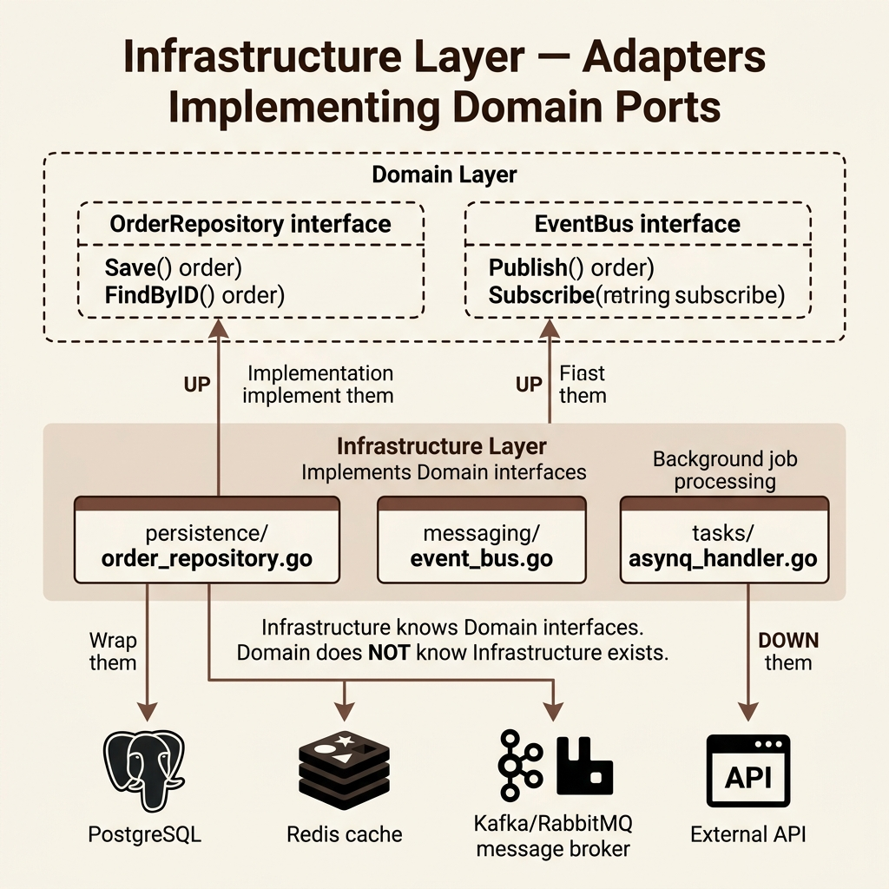

<!-- tags: architecture, clean-architecture, golang, infrastructure -->
# 🔧 Infrastructure Layer — Go DDD

> Repository implementation, Event Bus, Asynq background tasks, and Outbox pattern — implements domain interfaces.

📅 Created: 2026-03-24 · 🔄 Updated: 2026-03-24 · ⏱️ 22 min read

| Aspect | Detail |
|--------|--------|
| **Package** | `internal/infrastructures/` |
| **Implements** | Domain interfaces (`order.Repository`, `shared.EventBus`) |
| **Key libs** | `database/sql`, `pgx`, `hibiken/asynq`, `redis/go-redis` |
| **Patterns** | Repository, Mapper, Event Bus, Outbox, Background Tasks |

---

## 1. DEFINE

### What Does the Infrastructure Layer Do?

The Infrastructure Layer **implements interfaces defined in the Domain**. It handles databases, message brokers, and external APIs. The Domain remains unaware of these concrete implementations.

| Component | Role |
|-----------|------|
| `persistence/` | Implements `order.Repository` for SQL queries. |
| `messaging/` | Implements `shared.EventBus` via memory or Kafka. |
| `tasks/` | Manages background jobs with Asynq (Redis queue). |
| `external/` | Provides HTTP clients for third-party APIs. |
| `config/` | Loads and validates application configuration. |

### Repository Pattern: ORM Row vs. Domain Object

Infrastructure **maps** between DB rows and Domain objects. DB rows are often flat or nullable. Domain objects are rich and validated.

```
DB Row (UserRow)       ←→    Domain Object (Order)
id: string                   id: OrderID
status: string               status: OrderStatus (validated)
total_amount: int64          total: Money (with currency)
total_currency: string
created_at: time.Time        createdAt: time.Time
```

---

These patterns seem straightforward but contain risks. A repository might leak ORM fields into domain entities. Misconfigured connection pools can cause exhaustion under load. These traps appear in the PITFALLS section.

## 2. VISUAL



### Repository Flow

```
Application Layer
    │ orderRepo.Save(ctx, order)       ← interface call
    ▼
Infrastructure Layer (persistence/)
    │
    ├─ toRow(order)                    ← domain → DB row mapping
    ├─ db.ExecContext(ctx, INSERT ...)  ← SQL execution
    └─ (on read) toDomain(row)         ← DB row → domain mapping

Domain Layer
    ← order.Reconstitute(...)          ← rebuild aggregate from data
```

### Event Bus Architecture

```
eventBus.Publish(ctx, OrderCreatedEvent)
    │
    ▼
InMemoryEventBus                    KafkaEventBus
    │                                    │
    ├─ handlers["order.created"]        ├─ kafkaProducer.Produce(topic, msg)
    └─ handler.Handle(ctx, event)       └─ (consumer side) handler.Handle()
```

---

## 3. CODE

### Basic: Shared EventBus Interface

```go
// internal/domain/shared/event_bus.go
package shared

import "context"

// ✅ EventBus interface — defined in domain, implemented in infra
type EventBus interface {
    Publish(ctx context.Context, event DomainEvent) error
    Subscribe(eventType string, handler EventHandler)
}

type EventHandler interface {
    Handle(ctx context.Context, event DomainEvent) error
}
```

```go
// internal/infrastructures/messaging/in_memory_event_bus.go
package messaging

import (
    "context"
    "fmt"
    "log/slog"
    "sync"
    "go-domain-driven-design/internal/domain/shared"
)

// ✅ InMemoryEventBus — used for dev/test; swap to Kafka for prod
type InMemoryEventBus struct {
    handlers map[string][]shared.EventHandler
    mu       sync.RWMutex
    logger   *slog.Logger
}

func NewInMemoryEventBus(logger *slog.Logger) *InMemoryEventBus {
    return &InMemoryEventBus{
        handlers: make(map[string][]shared.EventHandler),
        logger:   logger,
    }
}

func (b *InMemoryEventBus) Subscribe(eventType string, handler shared.EventHandler) {
    b.mu.Lock()
    defer b.mu.Unlock()
    b.handlers[eventType] = append(b.handlers[eventType], handler)
    b.logger.Debug("subscribed handler", "eventType", eventType)
}

func (b *InMemoryEventBus) Publish(ctx context.Context, event shared.DomainEvent) error {
    b.mu.RLock()
    handlers := b.handlers[event.GetType()]
    b.mu.RUnlock()

    for _, h := range handlers {
        if err := h.Handle(ctx, event); err != nil {
            // ✅ Log and continue — do not fail for one handler error
            b.logger.Error("event handler failed",
                "eventType", event.GetType(),
                "eventID", event.GetID(),
                "error", err,
            )
        }
    }
    return nil
}
```

The basic repository is covered. Adapter patterns require clear interface separation. We separate them below.

### Intermediate: Repository Implementation with `database/sql`

```go
// internal/infrastructures/persistence/order_repository.go
package persistence

import (
    "context"
    "database/sql"
    "errors"
    "fmt"
    "time"
    "go-domain-driven-design/internal/domain/order"
)

// ✅ DB row struct — flat, nullable, maps to SQL columns
type orderRow struct {
    ID            string
    CustomerID    string
    Status        string
    TotalAmount   int64
    TotalCurrency string
    CreatedAt     time.Time
    UpdatedAt     time.Time
}

type orderItemRow struct {
    ID        string
    OrderID   string
    ProductID string
    Quantity  int
    PriceAmt  int64
    PriceCur  string
}

// ✅ orderRepository implements order.Repository
type orderRepository struct {
    db *sql.DB
}

func NewOrderRepository(db *sql.DB) order.Repository {
    return &orderRepository{db: db}
}

func (r *orderRepository) Save(ctx context.Context, o *order.Order) error {
    tx, err := r.db.BeginTx(ctx, nil)
    if err != nil {
        return fmt.Errorf("begin transaction: %w", err)
    }
    defer tx.Rollback() // ✅ no-op if committed

    // Upsert order record
    _, err = tx.ExecContext(ctx, `
        INSERT INTO orders (id, customer_id, status, total_amount, total_currency, created_at, updated_at)
        VALUES ($1, $2, $3, $4, $5, $6, $7)
        ON CONFLICT (id) DO UPDATE SET
            status = EXCLUDED.status,
            total_amount = EXCLUDED.total_amount,
            updated_at = EXCLUDED.updated_at
    `,
        o.ID().String(),
        o.CustomerID(),
        string(o.Status()),
        o.Total().Amount(),
        o.Total().Currency(),
        o.CreatedAt(),
        time.Now(),
    )
    if err != nil {
        return fmt.Errorf("upsert order: %w", err)
    }

    // ✅ Upsert order items
    for _, item := range o.Items() {
        _, err = tx.ExecContext(ctx, `
            INSERT INTO order_items (id, order_id, product_id, quantity, price_amount, price_currency)
            VALUES ($1, $2, $3, $4, $5, $6)
            ON CONFLICT (id) DO NOTHING
        `,
            item.ID().String(),
            o.ID().String(),
            item.ProductID(),
            item.Quantity(),
            item.Price().Amount(),
            item.Price().Currency(),
        )
        if err != nil {
            return fmt.Errorf("upsert item: %w", err)
        }
    }

    return tx.Commit()
}

func (r *orderRepository) FindByID(ctx context.Context, id order.OrderID) (*order.Order, error) {
    // ✅ Fetch order row from database
    var row orderRow
    err := r.db.QueryRowContext(ctx,
        `SELECT id, customer_id, status, total_amount, total_currency, created_at, updated_at
         FROM orders WHERE id = $1`,
        id.String(),
    ).Scan(&row.ID, &row.CustomerID, &row.Status,
        &row.TotalAmount, &row.TotalCurrency, &row.CreatedAt, &row.UpdatedAt)

    if errors.Is(err, sql.ErrNoRows) {
        return nil, nil
    }
    if err != nil {
        return nil, fmt.Errorf("query order: %w", err)
    }

    // ✅ Fetch associated order items
    items, err := r.findItems(ctx, row.ID)
    if err != nil {
        return nil, err
    }

    return r.toDomain(row, items)
}

func (r *orderRepository) findItems(ctx context.Context, orderID string) ([]orderItemRow, error) {
    rows, err := r.db.QueryContext(ctx,
        `SELECT id, order_id, product_id, quantity, price_amount, price_currency
         FROM order_items WHERE order_id = $1`, orderID)
    if err != nil {
        return nil, fmt.Errorf("query items: %w", err)
    }
    defer rows.Close()

    var items []orderItemRow
    for rows.Next() {
        var item orderItemRow
        if err := rows.Scan(&item.ID, &item.OrderID, &item.ProductID,
            &item.Quantity, &item.PriceAmt, &item.PriceCur); err != nil {
            return nil, err
        }
        items = append(items, item)
    }
    return items, rows.Err()
}

// ✅ toDomain — DB rows → Domain Aggregate (uses Reconstitute, NOT Create)
func (r *orderRepository) toDomain(row orderRow, itemRows []orderItemRow) (*order.Order, error) {
    total, err := order.NewMoney(row.TotalAmount, row.TotalCurrency)
    if err != nil {
        return nil, err
    }
    status, err := order.NewOrderStatus(row.Status)
    if err != nil {
        return nil, err
    }

    var items []*order.OrderItem
    for _, ir := range itemRows {
        price, err := order.NewMoney(ir.PriceAmt, ir.PriceCur)
        if err != nil {
            return nil, err
        }
        item := order.ReconstitueItem(order.OrderItemID(ir.ID), ir.ProductID, ir.Quantity, price)
        items = append(items, item)
    }

    return order.Reconstitute(
        order.OrderID(row.ID),
        row.CustomerID,
        items,
        total,
        status,
        row.CreatedAt,
        row.UpdatedAt,
    ), nil
}

func (r *orderRepository) FindByCustomerID(ctx context.Context, customerID string) ([]*order.Order, error) {
    rows, err := r.db.QueryContext(ctx,
        `SELECT id FROM orders WHERE customer_id = $1`, customerID)
    if err != nil {
        return nil, fmt.Errorf("query orders by customer: %w", err)
    }
    defer rows.Close()

    var orders []*order.Order
    for rows.Next() {
        var id string
        if err := rows.Scan(&id); err != nil {
            return nil, err
        }
        o, err := r.FindByID(ctx, order.OrderID(id))
        if err != nil {
            return nil, err
        }
        if o != nil {
            orders = append(orders, o)
        }
    }
    return orders, rows.Err()
}

func (r *orderRepository) Delete(ctx context.Context, id order.OrderID) error {
    _, err := r.db.ExecContext(ctx, `DELETE FROM orders WHERE id = $1`, id.String())
    return err
}
```

The adapters are covered. Reliable publishing requires atomicity through the outbox pattern.

### Advanced: Background Tasks with Asynq

Asynq uses Redis as a queue. It offloads expensive operations to background workers.

```go
// internal/infrastructures/tasks/tasks.constant.go
package tasks

const TypeEmail = "email:send"
const TypeOrderFulfillment = "order:fulfillment"

// internal/infrastructures/tasks/email.go
package tasks

import (
    "context"
    "encoding/json"
    "fmt"
    "github.com/hibiken/asynq"
)

type EmailPayload struct {
    To      string `json:"to"`
    Subject string `json:"subject"`
    Body    string `json:"body"`
}

// ✅ NewEmailTask — creates task for enqueueing
func NewEmailTask(to, subject, body string) (*asynq.Task, error) {
    payload, err := json.Marshal(EmailPayload{To: to, Subject: subject, Body: body})
    if err != nil {
        return nil, err
    }
    return asynq.NewTask(TypeEmail, payload), nil
}

// ✅ HandleEmailTask — task processor (runs in consumer worker)
func HandleEmailTask(ctx context.Context, t *asynq.Task) error {
    var p EmailPayload
    if err := json.Unmarshal(t.Payload(), &p); err != nil {
        return fmt.Errorf("unmarshal email payload: %w", err)
    }
    // TODO: integrate with real SMTP client
    fmt.Printf("Sending email to %s: %s\n", p.To, p.Subject)
    return nil
}
```

```go
// Enqueue from Application Event Handler
func (h *OrderEventHandler) onOrderCreated(ctx context.Context, e events.OrderCreatedEvent) error {
    // ✅ Enqueue async task — does not block the request
    task, err := tasks.NewEmailTask(
        e.CustomerEmail,
        "Order Confirmation",
        fmt.Sprintf("Your order %s has been created!", e.GetAggregateID()),
    )
    if err != nil {
        return err
    }
    _, err = h.asynqClient.EnqueueContext(ctx, task)
    return err
}
```

```go
// internal/infrastructures/consumers/main.go
package main

import (
    "log"
    "go-domain-driven-design/internal/infrastructures/tasks"
    "github.com/hibiken/asynq"
)

func main() {
    srv := asynq.NewServer(asynq.RedisClientOpt{Addr: "localhost:6379"}, asynq.Config{
        Concurrency: 10,
        Queues: map[string]int{
            "critical": 6,
            "default":  3,
            "low":      1,
        },
    })

    mux := asynq.NewServeMux()
    mux.HandleFunc(tasks.TypeEmail, tasks.HandleEmailTask)

    if err := srv.Run(mux); err != nil {
        log.Fatalf("asynq server failed: %v", err)
    }
}
```

---

We explored repositories, adapters, and the outbox pattern. Now we examine critical risks like abstraction leaks and pool exhaustion.

## 4. PITFALLS

| # | Error | Solution |
|---|-------|----------|
| 1 | `toDomain()` calling `order.Create()` | Use `order.Reconstitute()` to avoid emitting load events. |
| 2 | Forgetting `defer tx.Rollback()` | Always defer rollback after `BeginTx` for safety. |
| 3 | Repository returning `*sql.Row` | Return Domain types to prevent infra leaks. |
| 4 | N+1 queries in `FindByCustomerID` | Use joins or batch queries instead of loops. |
| 5 | Leaking `rows.Close()` | Defer `rows.Close()` immediately after `QueryContext` calls. |
| 6 | Non-idempotent Asynq tasks | Ensure handlers handle retries safely via idempotency. |
| 7 | Blocking requests via Event Bus | Use async publishing or Outbox to avoid blocking. |
| 8 | Infra importing Application | Infra must only implement domain interfaces. |

---

We have covered the Infrastructure Layer and its common traps. Use the resources below for deeper study.

## 5. REF

| Resource | Link |
|----------|------|
| hibiken/asynq | https://github.com/hibiken/asynq |
| database/sql | https://pkg.go.dev/database/sql |
| pgx (PostgreSQL driver) | https://github.com/jackc/pgx |
| Outbox Pattern | https://microservices.io/patterns/data/transactional-outbox.html |
| Three Dots Labs — Repository | https://threedots.tech/post/repository-pattern-in-go/ |

---

## 6. RECOMMEND

| Extension | Use Case | Benefit |
|-----------|----------|---------|
| `pgx` instead of `sql` | Production PostgreSQL | Native types, connection pool, and better performance. |
| `sqlx` | Reducing scan boilerplate | `StructScan` simplifies row mapping tasks. |
| Outbox Pattern | Reliable event delivery | Persists events in the same entity transaction. |
| Kafka EventBus | Cross-service events | Replaces `InMemoryEventBus` for distributed systems. |
| `testcontainers-go` | Integration testing | Runs real Postgres instances during test execution. |
| Redis cache | Frequent read operations | Layers a cache before the repository layer. |

---

← [Application Layer](./03-application-layer.md) · → [Presentation Layer](./05-presentation-layer.md)
