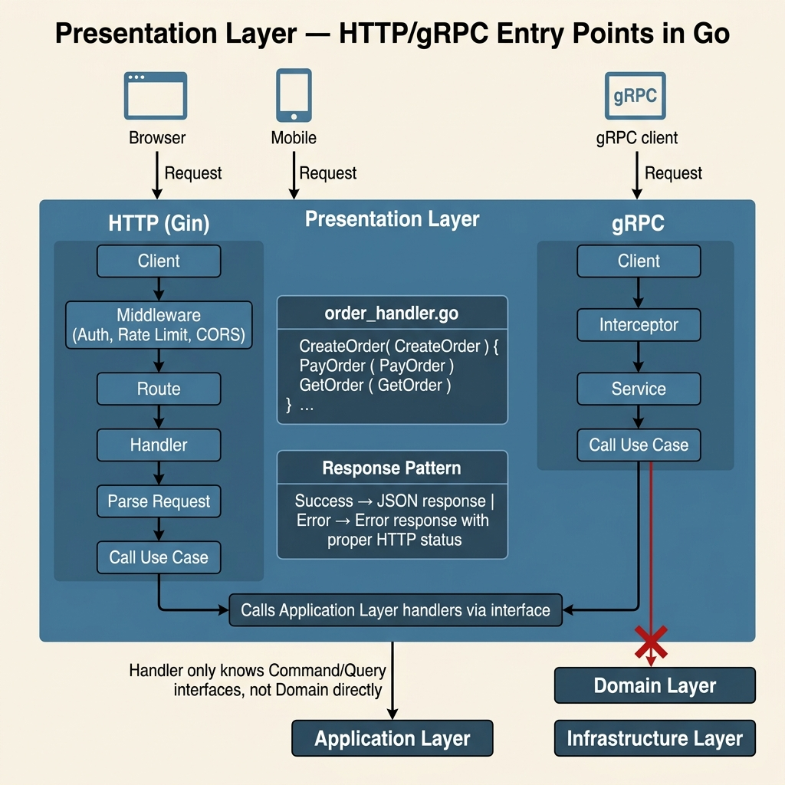

<!-- tags: architecture, clean-architecture, golang, api -->
# 🌐 Presentation Layer — Go DDD

> HTTP handlers (net/http / Gin), gRPC, Middleware, and Request/Response DTOs.

📅 Created: 2026-03-24 · 🔄 Updated: 2026-03-24 · ⏱️ 18 min read

| Aspect | Detail |
|--------|--------|
| **Package** | `internal/presentation/`, `cmd/` |
| **Dependencies** | Application layer (Command/Query handlers) |
| **Key libs** | `net/http` (stdlib), `gin-gonic/gin`, `google.golang.org/grpc` |
| **Pattern** | Thin handler — parse, delegate, and respond. |

---

## 1. DEFINE

### What Does the Presentation Layer Do?

The Presentation Layer acts as the **entry point** for external requests. It performs the following tasks:
- Parses and validates HTTP/gRPC requests.
- Maps requests to Commands or Queries.
- Calls Application handlers.
- Maps results to HTTP responses.
- Handles errors by returning appropriate HTTP status codes.

This layer **must not** contain business logic. Handlers should be **thin**. Move all logic to the Application or Domain layers.

### Handlers Should Be Thin, Not Thick

| Thick Handler (Anti-pattern) | Thin Handler (Standard) |
|---------------------|---------------------|
| Contains SQL queries. | Calls CommandHandlers only. |
| Includes business logic. | Validates input format only. |
| Returns Domain objects directly. | Maps to DTOs before responding. |
| Checks business states like `if PAID`. | Remains unaware of business states. |

---

Common failure modes include handlers containing direct business logic. This causes controllers to bloat. Non-standard error responses also prevent clients from parsing errors correctly. These issues are discussed in PITFALLS.

## 2. VISUAL



### HTTP Request Lifecycle

```
POST /orders
     │
     ▼ net/http / Gin router
OrderHTTPHandler.CreateOrder(w, r)
     │
     ├─ decode JSON body → CreateOrderRequest DTO
     ├─ validate: required fields and format
     │
     ▼ map to Command
CreateOrderCommand{ CustomerID, Items }
     │
     ▼ handler.Handle(ctx, cmd)
  Application Layer
     │
     ▼ (success)
CreateOrderResponse{ OrderID, Total }
     │
     ▼ map to HTTP response JSON
201 Created { "order_id": "...", "total": 150000 }
```

---

## 3. CODE

### Basic: Stdlib `net/http` Handler

```go
// internal/presentation/http/order_handler.go
package http

import (
    "encoding/json"
    "errors"
    "log/slog"
    "net/http"
    "go-domain-driven-design/internal/application/order/commands"
    "go-domain-driven-design/internal/application/order/queries"
)

// ✅ Request/Response DTOs — define presentation layer shapes
type CreateOrderRequest struct {
    CustomerID string             `json:"customer_id"`
    Items      []OrderItemRequest `json:"items"`
}

type OrderItemRequest struct {
    ProductID string `json:"product_id"`
    Quantity  int    `json:"quantity"`
    UnitPrice int64  `json:"unit_price"`
    Currency  string `json:"currency"`
}

type CreateOrderResponse struct {
    OrderID string `json:"order_id"`
    Total   int64  `json:"total"`
}

// ✅ Handler — holds Application handlers (no domain or db access)
type OrderHandler struct {
    createOrder *commands.CreateOrderHandler
    payOrder    *commands.PayOrderHandler
    getOrder    *queries.GetOrderHandler
    logger      *slog.Logger
}

func NewOrderHandler(
    create *commands.CreateOrderHandler,
    pay *commands.PayOrderHandler,
    get *queries.GetOrderHandler,
    logger *slog.Logger,
) *OrderHandler {
    return &OrderHandler{
        createOrder: create,
        payOrder:    pay,
        getOrder:    get,
        logger:      logger,
    }
}

func (h *OrderHandler) CreateOrder(w http.ResponseWriter, r *http.Request) {
    // ✅ Decode the JSON request body
    var req CreateOrderRequest
    if err := json.NewDecoder(r.Body).Decode(&req); err != nil {
        h.writeError(w, http.StatusBadRequest, "invalid request body")
        return
    }

    // ✅ Basic input validation (format only)
    if req.CustomerID == "" {
        h.writeError(w, http.StatusBadRequest, "customer_id is required")
        return
    }
    if len(req.Items) == 0 {
        h.writeError(w, http.StatusBadRequest, "items cannot be empty")
        return
    }

    // ✅ Map the request to a Command
    items := make([]commands.CreateOrderItemCmd, 0, len(req.Items))
    for _, item := range req.Items {
        items = append(items, commands.CreateOrderItemCmd{
            ProductID: item.ProductID,
            Quantity:  item.Quantity,
            UnitPrice: item.UnitPrice,
            Currency:  item.Currency,
        })
    }

    cmd := commands.CreateOrderCommand{
        CustomerID: req.CustomerID,
        Items:      items,
    }

    // ✅ Delegate the task to the Application layer
    result, err := h.createOrder.Handle(r.Context(), cmd)
    if err != nil {
        h.handleError(w, err)
        return
    }

    // ✅ Map the result to an HTTP response
    h.writeJSON(w, http.StatusCreated, CreateOrderResponse{
        OrderID: result.OrderID,
        Total:   result.Total,
    })
}

func (h *OrderHandler) GetOrder(w http.ResponseWriter, r *http.Request) {
    // Go 1.22+: retrieve path params via r.PathValue
    orderID := r.PathValue("id")
    if orderID == "" {
        h.writeError(w, http.StatusBadRequest, "order id is required")
        return
    }

    result, err := h.getOrder.Handle(r.Context(), queries.GetOrderQuery{OrderID: orderID})
    if err != nil {
        h.handleError(w, err)
        return
    }
    if result == nil {
        h.writeError(w, http.StatusNotFound, "order not found")
        return
    }

    h.writeJSON(w, http.StatusOK, result)
}

// ✅ Helpers for writing responses
func (h *OrderHandler) writeJSON(w http.ResponseWriter, status int, v any) {
    w.Header().Set("Content-Type", "application/json")
    w.WriteHeader(status)
    if err := json.NewEncoder(w).Encode(v); err != nil {
        h.logger.Error("encoding response failed", "error", err)
    }
}

func (h *OrderHandler) writeError(w http.ResponseWriter, status int, msg string) {
    h.writeJSON(w, status, map[string]string{"error": msg})
}

// ✅ handleError — maps domain errors to HTTP status codes
func (h *OrderHandler) handleError(w http.ResponseWriter, err error) {
    var notFound *NotFoundError
    if errors.As(err, &notFound) {
        h.writeError(w, http.StatusNotFound, err.Error())
        return
    }

    var validation *ValidationError
    if errors.As(err, &validation) {
        h.writeError(w, http.StatusUnprocessableEntity, err.Error())
        return
    }

    // Handle unknown errors with a 500 status
    h.logger.Error("internal error", "error", err)
    h.writeError(w, http.StatusInternalServerError, "internal server error")
}
```

Standard handlers are covered. DTO validation often requires middleware to keep handlers clean.

### Intermediate: Gin Handler

```go
// internal/presentation/http/gin/order_handler.go
package gin

import (
    "net/http"
    "github.com/gin-gonic/gin"
    "go-domain-driven-design/internal/application/order/commands"
    "go-domain-driven-design/internal/application/order/queries"
)

type GinOrderHandler struct {
    createOrder *commands.CreateOrderHandler
    getOrder    *queries.GetOrderHandler
}

func NewGinOrderHandler(
    create *commands.CreateOrderHandler,
    get *queries.GetOrderHandler,
) *GinOrderHandler {
    return &GinOrderHandler{createOrder: create, getOrder: get}
}

// ✅ Register routes with the router group
func (h *GinOrderHandler) RegisterRoutes(r *gin.RouterGroup) {
    orders := r.Group("/orders")
    orders.POST("", h.CreateOrder)
    orders.GET("/:id", h.GetOrder)
    orders.POST("/:id/pay", h.PayOrder)
}

func (h *GinOrderHandler) CreateOrder(c *gin.Context) {
    var req CreateOrderRequest
    // ✅ Gin ShouldBindJSON validates binding tags automatically
    if err := c.ShouldBindJSON(&req); err != nil {
        c.JSON(http.StatusBadRequest, gin.H{"error": err.Error()})
        return
    }

    items := make([]commands.CreateOrderItemCmd, 0, len(req.Items))
    for _, item := range req.Items {
        items = append(items, commands.CreateOrderItemCmd{
            ProductID: item.ProductID,
            Quantity:  item.Quantity,
            UnitPrice: item.UnitPrice,
            Currency:  item.Currency,
        })
    }

    result, err := h.createOrder.Handle(c.Request.Context(), commands.CreateOrderCommand{
        CustomerID: req.CustomerID,
        Items:      items,
    })
    if err != nil {
        c.JSON(http.StatusInternalServerError, gin.H{"error": err.Error()})
        return
    }

    c.JSON(http.StatusCreated, gin.H{
        "order_id": result.OrderID,
        "total":    result.Total,
    })
}

func (h *GinOrderHandler) GetOrder(c *gin.Context) {
    id := c.Param("id")
    result, err := h.getOrder.Handle(c.Request.Context(), queries.GetOrderQuery{OrderID: id})
    if err != nil {
        c.JSON(http.StatusInternalServerError, gin.H{"error": err.Error()})
        return
    }
    if result == nil {
        c.JSON(http.StatusNotFound, gin.H{"error": "not found"})
        return
    }
    c.JSON(http.StatusOK, result)
}

func (h *GinOrderHandler) PayOrder(c *gin.Context) {
    c.JSON(http.StatusOK, gin.H{"status": "ok"})
}
```

Validation is handled. Standardizing error responses across the application improves client integration.

### Advanced: Middleware — Auth, Logging, and Error Recovery

```go
// internal/presentation/http/middleware/middleware.go
package middleware

import (
    "log/slog"
    "net/http"
    "time"
)

// ✅ Logger middleware — logs every incoming request
func Logger(logger *slog.Logger) func(http.Handler) http.Handler {
    return func(next http.Handler) http.Handler {
        return http.HandlerFunc(func(w http.ResponseWriter, r *http.Request) {
            start := time.Now()

            // Capture the status code using a custom wrapper
            ww := &responseWriter{ResponseWriter: w, statusCode: http.StatusOK}

            next.ServeHTTP(ww, r)

            logger.Info("request",
                "method", r.Method,
                "path", r.URL.Path,
                "status", ww.statusCode,
                "duration", time.Since(start),
                "ip", r.RemoteAddr,
            )
        })
    }
}

type responseWriter struct {
    http.ResponseWriter
    statusCode int
}

func (rw *responseWriter) WriteHeader(code int) {
    rw.statusCode = code
    rw.ResponseWriter.WriteHeader(code)
}

// ✅ Recovery middleware — catches panics to prevent crashes
func Recovery(logger *slog.Logger) func(http.Handler) http.Handler {
    return func(next http.Handler) http.Handler {
        return http.HandlerFunc(func(w http.ResponseWriter, r *http.Request) {
            defer func() {
                if err := recover(); err != nil {
                    logger.Error("panic recovered", "error", err, "path", r.URL.Path)
                    http.Error(w, "internal server error", http.StatusInternalServerError)
                }
            }()
            next.ServeHTTP(w, r)
        })
    }
}

// ✅ Auth middleware — injects the user ID into the context
type contextKey string
const UserIDKey contextKey = "user_id"

func Auth(next http.Handler) http.Handler {
    return http.HandlerFunc(func(w http.ResponseWriter, r *http.Request) {
        token := r.Header.Get("Authorization")
        if token == "" {
            http.Error(w, "unauthorized", http.StatusUnauthorized)
            return
        }
        // Validate token and extract the user ID
        userID := "user-123" // TODO: implement real JWT validation
        ctx := context.WithValue(r.Context(), UserIDKey, userID)
        next.ServeHTTP(w, r.WithContext(ctx))
    })
}
```

---

Handlers, DTO validation, and error mapping are complete. Be careful of fat controllers and inconsistent errors. These pitfalls often break system cleanlines.

## 4. PITFALLS

| # | Error | Solution |
|---|-------|----------|
| 1 | Business logic in handlers. | Move logic to Domain layers. |
| 2 | Exposing Domain types in JSON. | Map to DTOs like `OrderDTO`. |
| 3 | Forgetting to close `r.Body`. | Defer `r.Body.Close()` in stdlib handlers. |
| 4 | Handler panics crashing the server. | Use Recovery middleware to catch panics. |
| 5 | Not passing `r.Context()` down. | Always propagate `r.Context()` to lower layers. |
| 6 | Returning 500 for all errors. | Map domain errors to specific status codes. |
| 7 | Logging sensitive request data. | Exclude passwords and tokens from logs. |
| 8 | Calling `c.JSON()` after `c.Abort()`. | Use `c.AbortWithStatusJSON()` to avoid duplicates. |

---

We have reviewed the Presentation Layer and its traps. Use these references to explore further.

## 5. REF

| Resource | Link |
|----------|------|
| net/http | https://pkg.go.dev/net/http |
| gin-gonic/gin | https://github.com/gin-gonic/gin |
| Go 1.22 routing | https://go.dev/blog/routing-enhancements |
| google.golang.org/grpc | https://pkg.go.dev/google.golang.org/grpc |
| chi router | https://github.com/go-chi/chi |

---

## 6. RECOMMEND

| Extension | Use Case | Benefit |
|-----------|----------|---------|
| Gin validator tags | Input validation | Reduces boilerplate with `binding` tags. |
| gRPC + protobuf | Internal service calls | Provides type-safety and faster serialization. |
| OpenAPI / Swagger | Public API docs | Generates documentation via `swaggo/gin-swagger`. |
| Rate limiting | Public endpoints | Protects services using middleware or x/time/rate. |
| Request ID middleware | Distributed tracing | Injects `X-Request-ID` into every context. |
| `go-chi/chi` | Middleware flexibility | Offers a cleaner middleware stack than stdlib. |

---

← [Infrastructure Layer](./04-infrastructure-layer.md) · → [README](./README.md)
