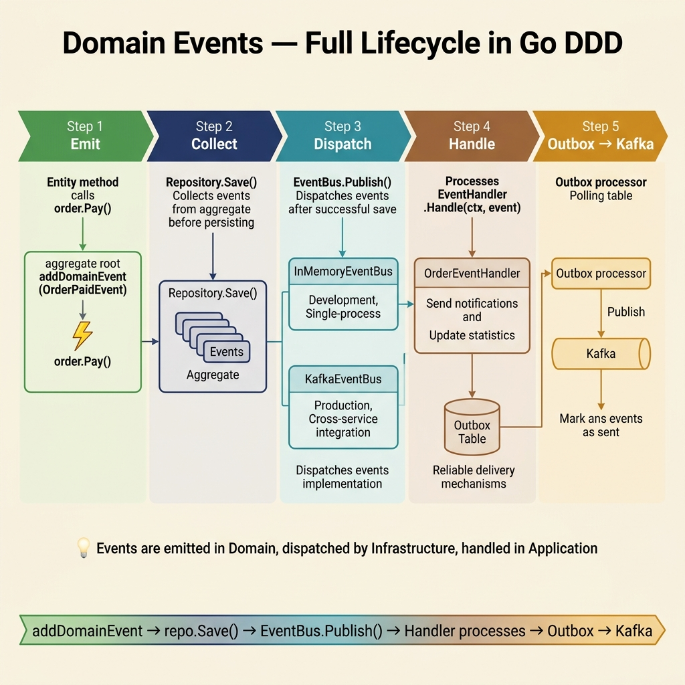

<!-- tags: architecture, clean-architecture, golang, ddd, domain-events -->
# 📡 Domain Events — Go DDD

> Domain Event lifecycle in Go: `addEvent()` → `EventBus` → Kafka → Consumer — interface-based and framework-free.

📅 Created: 2026-03-24 · 🔄 Updated: 2026-03-24 · ⏱️ 20 min read

| Aspect | Detail |
|--------|--------|
| **Interfaces** | `shared.DomainEvent`, `shared.EventBus` |
| **Implementations** | `InMemoryEventBus` (dev/test) · `KafkaEventBus` (production) |
| **Dispatch** | Manual — Application handlers call `eventBus.Publish()` after `repo.Save()`. |
| **Reliable Delivery** | Outbox Pattern (persists events within the same DB transaction). |

---

## 1. DEFINE

### What Is a Domain Event?

A Domain Event is an **immutable record** of an event that happened in the domain. It uses past tense and business language. Examples include `OrderCreatedEvent` or `OrderPaidEvent`.

### Go vs. NestJS: No Static Dispatcher

NestJS uses a static `DomainEventDispatcher` to auto-dispatch events. In Go, dispatching is **explicit**. The Application handler manually calls `eventBus.Publish()` after `repo.Save()` succeeds.

### Two Types of Delivery

| Type | Mechanism | Guarantee | Use Case |
|------|-----------|-----------|----------|
| **In-Process** | `InMemoryEventBus` via goroutines. | Fire-and-forget. | Dev, test, or internal monoliths. |
| **Reliable** | Outbox pattern with Kafka. | At-least-once. | Production cross-service communication. |

### Event Flow Pipeline

```
Order.Pay()
    └─ addEvent(OrderPaidEvent)  ← Queued in memory; not yet published.

repo.Save(ctx, order)            ← Entity is persisted.
    │
    ▼ (Application Handler)
eventBus.Publish(ctx, event)     ← Explicit dispatch after successful save.
    │
    ├─ InMemoryEventBus: Calls local handlers in goroutines.
    └─ KafkaEventBus: Produces to the 'order.paid' topic.
```

---

Failure modes seem clear. However, publishing events outside transactions creates dual-write gaps. Non-idempotent handlers also cause duplicate business effects. These risks are detailed in PITFALLS.

## 2. VISUAL



### Folder Structure

```
internal/
├── domain/
│   ├── shared/
│   │   ├── domain_event.go    ← DomainEvent interface and BaseDomainEvent.
│   │   └── event_bus.go       ← EventBus and EventHandler interfaces.
│   └── order/
│       └── events/
│           ├── order_created.go
│           ├── order_paid.go
│           └── order_cancelled.go
│
├── application/
│   └── order/
│       ├── commands/
│       │   └── create_order.go   ← Dispatches events after saving.
│       └── events/
│           └── order_event_handler.go ← Handles side effects.
│
└── infrastructures/
    └── messaging/
        ├── in_memory_event_bus.go   ← Dev and test implementation.
        └── kafka_event_bus.go       ← Production implementation.
```

### Complete Flow Diagram

```
┌──── DOMAIN ───────────────────────────────────┐
│  order.Pay()                                  │
│    └─ o.addEvent(OrderPaidEvent{...})         │
│         (stored in o.events slice)            │
└───────────────────────────────────────────────┘
                     │
                     ▼ handler.Handle(ctx, cmd)
┌──── APPLICATION (Command Handler) ────────────┐
│  repo.Save(ctx, order)    ← 1. Persist record.│
│  for _, e := range order.Events() {           │
│      eventBus.Publish(ctx, e)  ← 2. Dispatch. │
│  }                                            │
│  order.ClearEvents()                          │
└───────────────────────────────────────────────┘
                     │
         ┌───────────┴───────────┐
         ▼                       ▼
┌── InMemoryEventBus ──┐  ┌── KafkaEventBus ──────┐
│  handlers["order.paid"]│  │  producer.Produce()   │
│  → handler.Handle()   │  │  topic: "order.paid"  │
└───────────────────────┘  └───────────────────────┘
                                      │
                                      ▼ Kafka Consumer
                            ┌── OrderEventConsumer ─┐
                            │  unmarshal envelope   │
                            │  eventBus.Dispatch()  │
                            │  → local handlers     │
                            └───────────────────────┘
```

---

## 3. CODE

### Step 1 — Domain Event Interface & Base

```go
// internal/domain/shared/domain_event.go
package shared

import (
    "time"
    "github.com/google/uuid"
)

// ✅ DomainEvent interface — the domain defines the event shape
type DomainEvent interface {
    GetID() string
    GetType() string
    GetOccurredAt() time.Time
    GetAggregateID() string
}

// ✅ EventBus interface — declared in domain, implemented in infra
type EventBus interface {
    Publish(ctx context.Context, event DomainEvent) error
    Subscribe(eventType string, handler EventHandler)
}

type EventHandler interface {
    Handle(ctx context.Context, event DomainEvent) error
}

// ✅ BaseDomainEvent — embedded into concrete event types
type BaseDomainEvent struct {
    id          string
    eventType   string
    occurredAt  time.Time
    aggregateID string
}

func NewBaseDomainEvent(eventType, aggregateID string) BaseDomainEvent {
    return BaseDomainEvent{
        id:          uuid.New().String(),
        eventType:   eventType,
        occurredAt:  time.Now(),
        aggregateID: aggregateID,
    }
}

func (e BaseDomainEvent) GetID() string            { return e.id }
func (e BaseDomainEvent) GetType() string          { return e.eventType }
func (e BaseDomainEvent) GetOccurredAt() time.Time { return e.occurredAt }
func (e BaseDomainEvent) GetAggregateID() string   { return e.aggregateID }
```

### Step 2 — Concrete Domain Events

```go
// internal/domain/order/events/order_paid.go
package events

import (
    "go-domain-driven-design/internal/domain/shared"
    "time"
)

// ✅ Event type constant — used as a routing key for EventBus
const TypeOrderPaid = "order.paid"

// ✅ OrderPaidEvent — embeds BaseDomainEvent with business fields
type OrderPaidEvent struct {
    shared.BaseDomainEvent
    CustomerID string
    Amount     int64
    Currency   string
    PaidAt     time.Time
}

func NewOrderPaidEvent(orderID, customerID string, amount int64, currency string) OrderPaidEvent {
    return OrderPaidEvent{
        BaseDomainEvent: shared.NewBaseDomainEvent(TypeOrderPaid, orderID),
        CustomerID:      customerID,
        Amount:          amount,
        Currency:        currency,
        PaidAt:          time.Now(),
    }
}
```

```go
// internal/domain/order/events/order_created.go
package events

import "go-domain-driven-design/internal/domain/shared"

const TypeOrderCreated = "order.created"

type OrderCreatedEvent struct {
    shared.BaseDomainEvent
    CustomerID  string
    TotalAmount int64
    Currency    string
}

func NewOrderCreatedEvent(orderID, customerID string, amount int64, currency string) OrderCreatedEvent {
    return OrderCreatedEvent{
        BaseDomainEvent: shared.NewBaseDomainEvent(TypeOrderCreated, orderID),
        CustomerID:      customerID,
        TotalAmount:     amount,
        Currency:        currency,
    }
}
```

### Step 3 — Emit from Aggregate

```go
// internal/domain/order/order.go

// ✅ Pay — business method that emits an event
func (o *Order) Pay() error {
    if !o.status.CanTransitionTo(StatusPaid) {
        return errors.New("cannot transition to PAID from: " + string(o.status))
    }
    o.status = StatusPaid
    o.updatedAt = time.Now()

    // ✅ Queue the event — it remains unheld until repo.Save()
    o.addEvent(events.NewOrderPaidEvent(
        string(o.id),
        o.customerID,
        o.total.Amount(),
        o.total.Currency(),
    ))
    return nil
}

// ✅ Internal event management methods
func (o *Order) addEvent(e shared.DomainEvent) {
    o.events = append(o.events, e)
}

func (o *Order) Events() []shared.DomainEvent { return o.events }
func (o *Order) ClearEvents()                 { o.events = nil }

// ⚠️ Reconstitute() — must NOT call addEvent()
func Reconstitute(id OrderID, customerID string, items []*OrderItem,
    total Money, status OrderStatus, createdAt, updatedAt time.Time) *Order {
    return &Order{
        id: id, customerID: customerID, items: items,
        total: total, status: status,
        createdAt: createdAt, updatedAt: updatedAt,
        // events remains nil to prevent load-time emissions
    }
}
```

### Step 4 — Dispatch at the Application Handler

Go requires explicit dispatching within the Application handler:

```go
// internal/application/order/commands/pay_order.go
package commands

import (
    "context"
    "fmt"
    "log/slog"
    "go-domain-driven-design/internal/domain/order"
    "go-domain-driven-design/internal/domain/shared"
)

type PayOrderCommand struct {
    OrderID string
}

type PayOrderHandler struct {
    orderRepo order.Repository
    eventBus  shared.EventBus
    logger    *slog.Logger
}

func NewPayOrderHandler(repo order.Repository, bus shared.EventBus, logger *slog.Logger) *PayOrderHandler {
    return &PayOrderHandler{orderRepo: repo, eventBus: bus, logger: logger}
}

func (h *PayOrderHandler) Handle(ctx context.Context, cmd PayOrderCommand) error {
    // 1. Load the aggregate from the repository
    o, err := h.orderRepo.FindByID(ctx, order.OrderID(cmd.OrderID))
    if err != nil {
        return fmt.Errorf("find order: %w", err)
    }
    if o == nil {
        return fmt.Errorf("order not found: %s", cmd.OrderID)
    }

    // 2. Execute the domain method
    if err := o.Pay(); err != nil {
        return err
    }

    // 3. Persist changes to the database
    if err := h.orderRepo.Save(ctx, o); err != nil {
        return fmt.Errorf("save order: %w", err)
    }

    // ✅ 4. Dispatch events ONLY AFTER a successful save
    for _, event := range o.Events() {
        if err := h.eventBus.Publish(ctx, event); err != nil {
            // ⚠️ Log error but do not fail the request
            h.logger.Error("failed to publish event",
                "eventType", event.GetType(),
                "eventID", event.GetID(),
                "error", err,
            )
        }
    }
    o.ClearEvents()

    return nil
}
```

### Step 5 — Application Event Handler (Side Effects)

```go
// internal/application/order/events/order_event_handler.go
package events

import (
    "context"
    "log/slog"
    "go-domain-driven-design/internal/domain/order/events"
    "go-domain-driven-design/internal/domain/shared"
)

// EmailService interface implemented by the Infrastructure layer
type EmailService interface {
    SendOrderConfirmation(ctx context.Context, to, orderID string, amount int64) error
}

type OrderEventHandler struct {
    emailSvc EmailService
    logger   *slog.Logger
}

func NewOrderEventHandler(emailSvc EmailService, logger *slog.Logger) *OrderEventHandler {
    return &OrderEventHandler{emailSvc: emailSvc, logger: logger}
}

// ✅ Handle — performs a type switch on the event
func (h *OrderEventHandler) Handle(ctx context.Context, event shared.DomainEvent) error {
    switch e := event.(type) {
    case events.OrderCreatedEvent:
        return h.onOrderCreated(ctx, e)
    case events.OrderPaidEvent:
        return h.onOrderPaid(ctx, e)
    default:
        h.logger.Debug("unhandled event", "type", event.GetType())
        return nil
    }
}

func (h *OrderEventHandler) onOrderCreated(ctx context.Context, e events.OrderCreatedEvent) error {
    h.logger.Info("order created", "orderID", e.GetAggregateID(), "customer", e.CustomerID)
    return h.emailSvc.SendOrderConfirmation(ctx, e.CustomerID, e.GetAggregateID(), e.TotalAmount)
}

func (h *OrderEventHandler) onOrderPaid(ctx context.Context, e events.OrderPaidEvent) error {
    h.logger.Info("order paid", "orderID", e.GetAggregateID(), "amount", e.Amount)
    return nil
}
```

### Step 6 — Kafka EventBus (Production Implementation)

```go
// internal/infrastructures/messaging/kafka_event_bus.go
package messaging

import (
    "context"
    "encoding/json"
    "fmt"
    "log/slog"
    "sync"
    "go-domain-driven-design/internal/domain/shared"
    "github.com/segmentio/kafka-go"
)

// ✅ DomainEventEnvelope — transport wrapper for Kafka messages
type DomainEventEnvelope struct {
    ID          string          `json:"id"`
    Type        string          `json:"type"`
    AggregateID string          `json:"aggregate_id"`
    OccurredAt  string          `json:"occurred_at"`
    Payload     json.RawMessage `json:"payload"`
}

type KafkaEventBus struct {
    writer   *kafka.Writer
    handlers map[string][]shared.EventHandler
    mu       sync.RWMutex
    logger   *slog.Logger
    // ✅ topic routing maps event types to Kafka topics
    topicMap map[string]string
    defaultTopic string
}

func NewKafkaEventBus(brokers []string, defaultTopic string, logger *slog.Logger) *KafkaEventBus {
    return &KafkaEventBus{
        writer: &kafka.Writer{
            Addr:     kafka.TCP(brokers...),
            Balancer: &kafka.LeastBytes{},
        },
        handlers:     make(map[string][]shared.EventHandler),
        topicMap:     make(map[string]string),
        defaultTopic: defaultTopic,
        logger:       logger,
    }
}

// ✅ RegisterTopic sets per-event topic routing
func (b *KafkaEventBus) RegisterTopic(eventType, topic string) {
    b.topicMap[eventType] = topic
}

func (b *KafkaEventBus) Subscribe(eventType string, handler shared.EventHandler) {
    b.mu.Lock()
    defer b.mu.Unlock()
    b.handlers[eventType] = append(b.handlers[eventType], handler)
}

func (b *KafkaEventBus) Publish(ctx context.Context, event shared.DomainEvent) error {
    payload, err := json.Marshal(event)
    if err != nil {
        return fmt.Errorf("marshal event: %w", err)
    }

    envelope := DomainEventEnvelope{
        ID:          event.GetID(),
        Type:        event.GetType(),
        AggregateID: event.GetAggregateID(),
        OccurredAt:  event.GetOccurredAt().Format(time.RFC3339),
        Payload:     payload,
    }

    data, err := json.Marshal(envelope)
    if err != nil {
        return fmt.Errorf("marshal envelope: %w", err)
    }

    // ✅ Route to a dedicated topic or use the default
    topic := b.defaultTopic
    if t, ok := b.topicMap[event.GetType()]; ok {
        topic = t
    }

    return b.writer.WriteMessages(ctx, kafka.Message{
        Topic: topic,
        Key:   []byte(event.GetAggregateID()),
        Value: data,
    })
}

// ✅ DispatchReceived routes Kafka messages to local handlers
func (b *KafkaEventBus) DispatchReceived(ctx context.Context, event shared.DomainEvent) {
    b.mu.RLock()
    handlers := b.handlers[event.GetType()]
    b.mu.RUnlock()

    for _, h := range handlers {
        if err := h.Handle(ctx, event); err != nil {
            b.logger.Error("handler failed", "eventType", event.GetType(), "error", err)
        }
    }
}
```

Basic dispatching is covered. Reliable delivery requires the outbox pattern.

### Advanced: Outbox Pattern for Reliable Delivery

Use the outbox pattern to ensure events persist if Kafka goes down:

```go
// internal/application/order/commands/create_order.go — using Outbox
func (h *CreateOrderHandler) Handle(ctx context.Context, cmd CreateOrderCommand) (CreateOrderResponse, error) {
    tx, err := h.db.BeginTx(ctx, nil)
    if err != nil {
        return CreateOrderResponse{}, err
    }
    defer tx.Rollback()

    // 1. Save the entity
    if err := h.orderRepo.SaveTx(ctx, tx, order); err != nil {
        return CreateOrderResponse{}, err
    }

    // 2. ✅ Save events to the Outbox within the SAME transaction
    for _, event := range order.Events() {
        payload, _ := json.Marshal(event)
        _, err = tx.ExecContext(ctx, `
            INSERT INTO outbox_events (id, type, aggregate_id, payload, created_at)
            VALUES ($1, $2, $3, $4, NOW())
        `, event.GetID(), event.GetType(), event.GetAggregateID(), payload)
        if err != nil {
            return CreateOrderResponse{}, err
        }
    }

    if err := tx.Commit(); err != nil {
        return CreateOrderResponse{}, err
    }

    // 3. Background poller publishes events to Kafka asynchronously
    order.ClearEvents()
    return CreateOrderResponse{OrderID: order.ID().String()}, nil
}
```

---

We have reviewed domain events and dispatch patterns. Now we look at dual-write gaps and missing idempotency. These traps are critical for distributed systems.

## 4. PITFALLS

| # | Error | Solution |
|---|-------|----------|
| 1 | `Reconstitute()` calling `addEvent()`. | Spurious events on load. Only business methods should emit. |
| 2 | Dispatching events BEFORE `repo.Save()`. | Risk of inconsistent states if database saves fail. |
| 3 | Forgetting to `ClearEvents()`. | Events will be dispatched multiple times. |
| 4 | EventBus failures failing requests. | Log errors and continue; entity is already saved. |
| 5 | Missing cases in `type switch`. | Use default cases to avoid silent failures. |
| 6 | Handlers modifying domain objects. | Handlers should only call services or read events. |
| 7 | Forgetting to register handlers. | Subscribe at application startup in `main.go`. |
| 8 | Non-idempotent Kafka consumers. | Always check event IDs before processing. |

---

We have covered Domain Events and common traps. Use these resources for deeper investigation.

## 5. REF

| Resource | Link |
|----------|------|
| Martin Fowler — Domain Event | https://martinfowler.com/eaaDev/DomainEvent.html |
| Outbox Pattern | https://microservices.io/patterns/data/transactional-outbox.html |
| segmentio/kafka-go | https://github.com/segmentio/kafka-go |
| Three Dots Labs — Events Go | https://threedots.tech/post/event-driven-domain-events-go/ |
| Domain vs Integration Events | https://learn.microsoft.com/en-us/dotnet/architecture/microservices/microservice-ddd-cqrs-patterns/domain-events-design-implementation |

---

## 6. RECOMMEND

| Extension | Use Case | Benefit |
|-----------|----------|---------|
| Outbox Pattern | Production environments | Guarantees at-least-once delivery if Kafka fails. |
| Dead Letter Queue | Handling persistent failures | Prevents event loss and allows manual retries. |
| Idempotent consumer | Standard Kafka setups | Prevents duplicate processing from at-least-once delivery. |
| Event versioning | Schema evolution | Ensures backward compatibility with older consumers. |
| Integration Event DTOs | Decoupling domain schemas | Separates internal domain events from public messages. |

---

← [Presentation Layer](./05-presentation-layer.md) · → [Saga Pattern](./07-saga-pattern.md)
