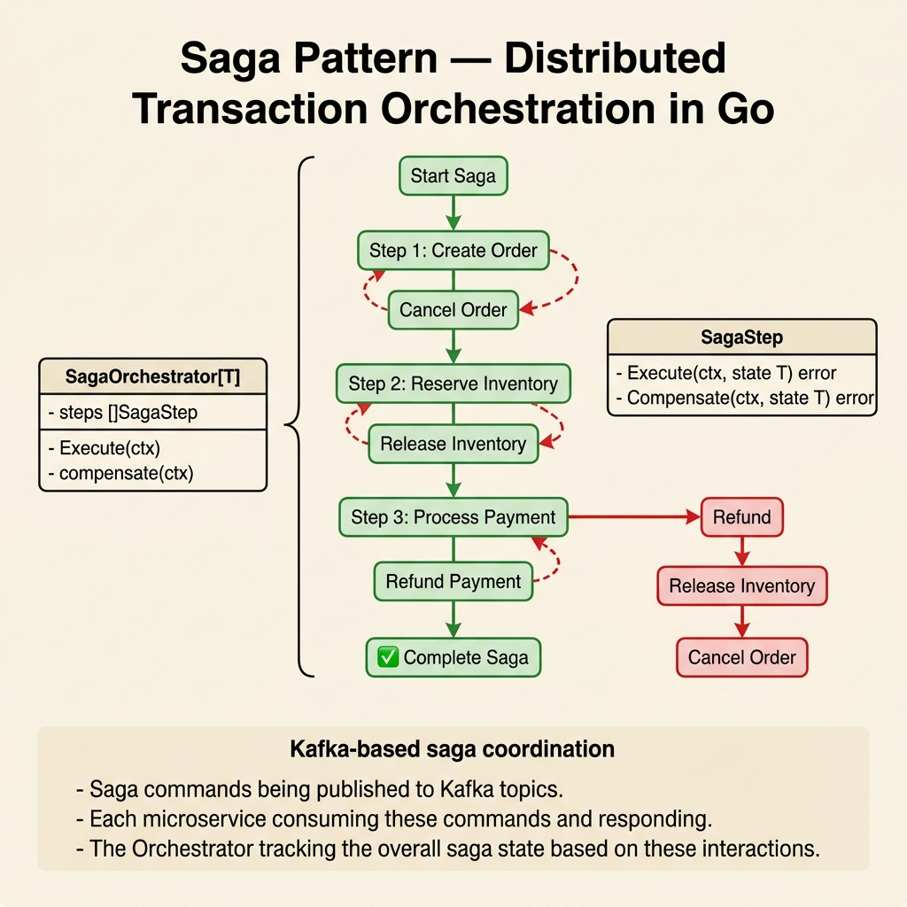

<!-- tags: architecture, clean-architecture, golang, saga-pattern -->
# 🔄 Saga Pattern — Distributed Transactions (Go DDD)

> Pure Go Orchestration Saga: `SagaStep`, `SagaOrchestrator`, automatic compensation — no framework, Kafka-based.

📅 Created: 2026-03-24 · 🔄 Updated: 2026-03-24 · ⏱️ 25 min read

| Aspect | Detail |
|--------|--------|
| **Pattern** | Saga Orchestration (not Choreography) |
| **Transport** | Kafka command/reply topics |
| **State** | Persist saga state to DB (at-rest resumability) |
| **Idempotency** | `idempotencyKey` required at start |
| **Go approach** | Interfaces and generic structs — no framework |

---

## 1. DEFINE

### What problem does Saga solve?

Sagas ensure eventual consistency in distributed transactions. This pattern helps when a business process updates multiple services without 2-phase commit.

**Two types of Sagas:**

| Type | Mechanism | Use Case |
|------|-----------|----------|
| **Choreography** | Services react to each other's events | Simple flows with three or fewer services |
| **Orchestration** ✅ | Central orchestrator manages the flow | Complex flows requiring explicit rollbacks |

### Core Abstractions in Go

Go lacks a native `SagaDefinition` framework. Instead, we build abstractions using generics (Go 1.18+):

| Type/Interface | Role |
|----------------|------|
| `SagaStep[T]` | Defines a step with `Name`, `Execute`, and `Compensate` |
| `SagaOrchestrator[T]` | Runs steps, handles replies, and triggers compensation |
| `SagaRepository` | Persists or loads saga state from the database |
| `SagaState[T]` | Holds saga instance state, data, and step index |

### Actors

```
Orchestrator (SagaOrchestrator)
  └─ Runs in order-service to coordinate steps.

Participant (inventory-service, payment-service)
  └─ Receives Kafka commands and replies with SUCCESS or FAILURE.

Reply Consumer
  └─ Consumer goroutine that forwards replies to the Orchestrator.
```

### Invariants

- Provide an `idempotencyKey` when starting a saga to prevent duplicates.
- Participants must echo `sagaID` and `stepName` headers in replies.
- Remote steps with side effects must include a `Compensate` action.
- Use the `{sagaType}.reply` topic for all responses.
- Compensation runs in reverse order (N-1, N-2, ..., 0).

Common failure modes seem easy to avoid. However, non-idempotent compensation can rollback the wrong state. Non-persistent state causes lost progress during crashes. We address these traps in the PITFALLS section.

---

## 2. VISUAL



### Happy Path Flow

```
cmd := PayOrderCommand{OrderID: "ord-123", ...}
    │
    ▼ PayOrderHandler.Handle(ctx, cmd)
SagaOrchestrator.Start(ctx, "OrderFulfillmentSaga", idempotencyKey, data)
    │
    ▼ Step 1: TrackOrder (Local)
    │   execute: persist tracking record → return data
    │
    ▼ Step 2: DecreaseInventory (Remote → Kafka)
    │   publish to topic 'inventory.commands'
    │   headers: { saga_id, saga_type, step_name, reply_to }
    │
    │   [Kafka] ─────────────────────────────────────────►
    │                                           inventory-service
    │                                             execute command
    │                                             publish reply SUCCESS
    │   [Kafka reply] ◄──────────────────────────────────
    │
    ▼ ReplyConsumer receives from 'order-fulfillment-saga.reply'
    │   → orchestrator.ProcessReply(ctx, replyMsg)
    │
    ▼ Step 3: ChargePayment (Remote → Kafka)
    │   ... similar flow ...
    │
    ▼ Step 4: FinalizeOrder (Local)
    │   execute: update order status = CONFIRMED
    │
    ▼ SAGA COMPLETED ✅
```

### Compensation Flow

```
...Step 3 reply FAILURE...

SagaOrchestrator enters COMPENSATING mode
    │
    ▼ Compensate Step 2: IncreaseInventory (Remote)
    │   publish to 'inventory.commands'
    │   wait reply SUCCESS
    │
    ▼ Compensate Step 1: TrackOrder (Local)
    │   delete tracking record
    │
    ▼ SAGA COMPENSATED ⚠️
```

### Kafka Header Contract

```
Orchestrator → Participant:
  headers: {
    "saga_id":    "<uuid>",
    "saga_type":  "OrderFulfillmentSaga",
    "step_name":  "DecreaseInventory",
    "reply_to":   "order-fulfillment-saga.reply",
  }

Participant → Orchestrator (reply):
  headers: {
    "saga_id":    "<same uuid>",     ← MUST echo
    "saga_type":  "<same>",          ← MUST echo
    "step_name":  "<same>",          ← MUST echo
    "outcome":    "SUCCESS" | "FAILURE",
  }
```

---

## 3. CODE

### Basic: SagaStep and SagaState

```go
// internal/domain/shared/saga.go
package shared

import "context"

// ✅ SagaStepType — local (in-process) or remote (Kafka)
type SagaStepType string

const (
    SagaStepLocal  SagaStepType = "LOCAL"
    SagaStepRemote SagaStepType = "REMOTE"
)

// ✅ RemoteCommand — command sent via Kafka
type RemoteCommand struct {
    Topic       string         // Kafka topic (e.g., "inventory.commands")
    CommandType string         // Command identifier for participant
    Payload     map[string]any // Data to send
}

// ✅ SagaStep[T] — generic step definition
type SagaStep[T any] struct {
    Name     string
    Type     SagaStepType

    // Local step: runs in-process, returns updated data
    Execute  func(ctx context.Context, data T) (T, error)

    // Remote step: returns command to publish
    Command  func(ctx context.Context, data T) (RemoteCommand, error)

    // Handle reply from participant, merge into data
    OnReply  func(ctx context.Context, data T, reply map[string]any) (T, error)

    // Compensation — local: Execute func, remote: Command func
    Compensate     func(ctx context.Context, data T) (T, error)  // local
    CompensateCmd  func(ctx context.Context, data T) (RemoteCommand, error) // remote
    CompensateType SagaStepType
}
```

```go
// internal/domain/shared/saga_state.go
package shared

import "time"

type SagaStatus string

const (
    SagaStatusStarted      SagaStatus = "STARTED"
    SagaStatusCompleted    SagaStatus = "COMPLETED"
    SagaStatusCompensating SagaStatus = "COMPENSATING"
    SagaStatusCompensated  SagaStatus = "COMPENSATED"
    SagaStatusFailed       SagaStatus = "FAILED"
)

// ✅ SagaState[T] — saga instance state, persisted to DB
type SagaState[T any] struct {
    ID             string
    SagaType       string
    IdempotencyKey string
    Status         SagaStatus
    CurrentStep    int   // index into steps slice
    Data           T     // cross-step state
    CreatedAt      time.Time
    UpdatedAt      time.Time
}
```

The basic saga definitions are set. Compensation requires rolling back steps in reverse order.

### Intermediate: SagaOrchestrator

```go
// internal/application/shared/saga_orchestrator.go
package shared

import (
    "context"
    "encoding/json"
    "fmt"
    "log/slog"
    "time"
    "github.com/google/uuid"
    domain "go-domain-driven-design/internal/domain/shared"
)

// SagaRepository — persist/load saga state
type SagaRepository interface {
    Save(ctx context.Context, state *domain.SagaState[json.RawMessage]) error
    FindByID(ctx context.Context, id string) (*domain.SagaState[json.RawMessage], error)
    FindByIdempotencyKey(ctx context.Context, key string) (*domain.SagaState[json.RawMessage], error)
}

// KafkaPublisher — publish command to participant
type KafkaPublisher interface {
    Publish(ctx context.Context, topic string, key string, headers map[string]string, payload []byte) error
}

// ✅ SagaOrchestrator[T] — generic orchestrator
type SagaOrchestrator[T any] struct {
    sagaType  string
    steps     []domain.SagaStep[T]
    repo      SagaRepository
    publisher KafkaPublisher
    logger    *slog.Logger
}

func NewSagaOrchestrator[T any](
    sagaType string,
    steps []domain.SagaStep[T],
    repo SagaRepository,
    publisher KafkaPublisher,
    logger *slog.Logger,
) *SagaOrchestrator[T] {
    return &SagaOrchestrator[T]{
        sagaType:  sagaType,
        steps:     steps,
        repo:      repo,
        publisher: publisher,
        logger:    logger,
    }
}

// ✅ Start — create new saga, check idempotency
func (o *SagaOrchestrator[T]) Start(ctx context.Context, idempotencyKey string, initialData T) (string, error) {
    // ✅ Idempotency check — avoid duplicate sagas
    existing, err := o.repo.FindByIdempotencyKey(ctx, idempotencyKey)
    if err != nil {
        return "", fmt.Errorf("idempotency check: %w", err)
    }
    if existing != nil {
        o.logger.Info("saga already exists, returning existing", "sagaID", existing.ID)
        return existing.ID, nil
    }

    dataBytes, err := json.Marshal(initialData)
    if err != nil {
        return "", fmt.Errorf("marshal initial data: %w", err)
    }

    state := &domain.SagaState[json.RawMessage]{
        ID:             uuid.New().String(),
        SagaType:       o.sagaType,
        IdempotencyKey: idempotencyKey,
        Status:         domain.SagaStatusStarted,
        CurrentStep:    0,
        Data:           dataBytes,
        CreatedAt:      time.Now(),
        UpdatedAt:      time.Now(),
    }

    if err := o.repo.Save(ctx, state); err != nil {
        return "", fmt.Errorf("save saga state: %w", err)
    }

    // ✅ Execute first step immediately
    if err := o.executeStep(ctx, state, 0); err != nil {
        return "", err
    }

    return state.ID, nil
}

func (o *SagaOrchestrator[T]) executeStep(ctx context.Context, state *domain.SagaState[json.RawMessage], stepIdx int) error {
    if stepIdx >= len(o.steps) {
        return o.complete(ctx, state)
    }

    step := o.steps[stepIdx]
    o.logger.Info("executing saga step", "saga", state.ID, "step", step.Name, "type", step.Type)

    var data T
    if err := json.Unmarshal(state.Data, &data); err != nil {
        return fmt.Errorf("unmarshal data: %w", err)
    }

    switch step.Type {
    case domain.SagaStepLocal:
        // ✅ Execute locally, advance to next step
        newData, err := step.Execute(ctx, data)
        if err != nil {
            o.logger.Error("local step failed, starting compensation", "step", step.Name, "error", err)
            return o.startCompensation(ctx, state, stepIdx-1)
        }
        dataBytes, _ := json.Marshal(newData)
        state.Data = dataBytes
        state.CurrentStep = stepIdx + 1
        state.UpdatedAt = time.Now()
        if err := o.repo.Save(ctx, state); err != nil {
            return err
        }
        return o.executeStep(ctx, state, stepIdx+1)

    case domain.SagaStepRemote:
        // ✅ Publish Kafka command, STOP — wait for reply
        cmd, err := step.Command(ctx, data)
        if err != nil {
            return fmt.Errorf("build command for step %s: %w", step.Name, err)
        }
        payload, _ := json.Marshal(cmd.Payload)
        headers := map[string]string{
            "saga_id":   state.ID,
            "saga_type": o.sagaType,
            "step_name": step.Name,
            "reply_to":  o.sagaType + ".reply",
        }
        return o.publisher.Publish(ctx, cmd.Topic, state.ID, headers, payload)
    }

    return nil
}

// ✅ ProcessReply — called by Kafka reply consumer
func (o *SagaOrchestrator[T]) ProcessReply(ctx context.Context, sagaID, stepName, outcome string, replyData map[string]any) error {
    state, err := o.repo.FindByID(ctx, sagaID)
    if err != nil || state == nil {
        return fmt.Errorf("saga not found: %s", sagaID)
    }

    stepIdx := o.findStepIndex(stepName)
    if stepIdx < 0 {
        return fmt.Errorf("unknown step: %s", stepName)
    }

    if outcome == "FAILURE" {
        o.logger.Warn("step failed, compensating", "saga", sagaID, "step", stepName)
        return o.startCompensation(ctx, state, stepIdx-1)
    }

    // ✅ Merge reply data, advance step
    step := o.steps[stepIdx]
    var data T
    json.Unmarshal(state.Data, &data)

    if step.OnReply != nil {
        data, err = step.OnReply(ctx, data, replyData)
        if err != nil {
            return fmt.Errorf("onReply for step %s: %w", stepName, err)
        }
    }

    dataBytes, _ := json.Marshal(data)
    state.Data = dataBytes
    state.CurrentStep = stepIdx + 1
    state.UpdatedAt = time.Now()
    o.repo.Save(ctx, state)

    return o.executeStep(ctx, state, stepIdx+1)
}

func (o *SagaOrchestrator[T]) startCompensation(ctx context.Context, state *domain.SagaState[json.RawMessage], fromStep int) error {
    state.Status = domain.SagaStatusCompensating
    state.UpdatedAt = time.Now()
    o.repo.Save(ctx, state)
    return o.compensateStep(ctx, state, fromStep)
}

func (o *SagaOrchestrator[T]) compensateStep(ctx context.Context, state *domain.SagaState[json.RawMessage], stepIdx int) error {
    if stepIdx < 0 {
        state.Status = domain.SagaStatusCompensated
        state.UpdatedAt = time.Now()
        o.repo.Save(ctx, state)
        o.logger.Info("saga compensated", "saga", state.ID)
        return nil
    }

    step := o.steps[stepIdx]
    var data T
    json.Unmarshal(state.Data, &data)

    switch step.CompensateType {
    case domain.SagaStepLocal:
        if step.Compensate != nil {
            if _, err := step.Compensate(ctx, data); err != nil {
                o.logger.Error("compensation failed", "step", step.Name, "error", err)
                state.Status = domain.SagaStatusFailed
                o.repo.Save(ctx, state)
                return err
            }
        }
        return o.compensateStep(ctx, state, stepIdx-1)

    case domain.SagaStepRemote:
        if step.CompensateCmd != nil {
            cmd, _ := step.CompensateCmd(ctx, data)
            payload, _ := json.Marshal(cmd.Payload)
            headers := map[string]string{
                "saga_id":   state.ID,
                "saga_type": o.sagaType,
                "step_name": step.Name + "_compensation",
                "reply_to":  o.sagaType + ".reply",
            }
            return o.publisher.Publish(ctx, cmd.Topic, state.ID, headers, payload)
        }
        return o.compensateStep(ctx, state, stepIdx-1)
    }

    return nil
}

func (o *SagaOrchestrator[T]) complete(ctx context.Context, state *domain.SagaState[json.RawMessage]) error {
    state.Status = domain.SagaStatusCompleted
    state.UpdatedAt = time.Now()
    o.repo.Save(ctx, state)
    o.logger.Info("saga completed", "saga", state.ID)
    return nil
}

func (o *SagaOrchestrator[T]) findStepIndex(name string) int {
    for i, s := range o.steps {
        if s.Name == name {
            return i
        }
    }
    return -1
}
```

The orchestrator now handles state transitions and compensation logic. Next, we integrate this into a real-world use case.

### Advanced: OrderFulfillmentSaga — Real Usage

```go
// internal/application/order/sagas/order_fulfillment_saga.go
package sagas

import (
    "context"
    "fmt"
    "log/slog"
    domain "go-domain-driven-design/internal/domain/shared"
    appShared "go-domain-driven-design/internal/application/shared"
    "go-domain-driven-design/internal/domain/order"
)

// ✅ SagaData — cross-step state
type OrderFulfillmentData struct {
    OrderID               string `json:"order_id"`
    CustomerID            string `json:"customer_id"`
    TotalAmount           int64  `json:"total_amount"`
    Currency              string `json:"currency"`
    PaymentMethodID       string `json:"payment_method_id"`
    InventoryReservationID string `json:"inventory_reservation_id,omitempty"`
    PaymentTransactionID  string `json:"payment_transaction_id,omitempty"`
}

// ✅ BuildOrderFulfillmentSteps — step definitions (pure functions, testable)
func BuildOrderFulfillmentSteps(orderRepo order.Repository) []domain.SagaStep[OrderFulfillmentData] {
    return []domain.SagaStep[OrderFulfillmentData]{
        // ─────────────────────────────────────
        // Step 1: Local — Track order
        // ─────────────────────────────────────
        {
            Name: "TrackOrder",
            Type: domain.SagaStepLocal,
            Execute: func(ctx context.Context, data OrderFulfillmentData) (OrderFulfillmentData, error) {
                // Create tracking record or log
                slog.Info("tracking order", "orderID", data.OrderID)
                return data, nil
            },
            Compensate: func(ctx context.Context, data OrderFulfillmentData) (OrderFulfillmentData, error) {
                // Rollback: delete order
                if err := orderRepo.Delete(ctx, order.OrderID(data.OrderID)); err != nil {
                    return data, fmt.Errorf("rollback order: %w", err)
                }
                return data, nil
            },
            CompensateType: domain.SagaStepLocal,
        },

        // ─────────────────────────────────────
        // Step 2: Remote — Decrease inventory
        // ─────────────────────────────────────
        {
            Name: "DecreaseInventory",
            Type: domain.SagaStepRemote,
            Command: func(ctx context.Context, data OrderFulfillmentData) (domain.RemoteCommand, error) {
                return domain.RemoteCommand{
                    Topic:       "inventory.commands",
                    CommandType: "DecreaseInventoryCommand",
                    Payload: map[string]any{
                        "order_id":   data.OrderID,
                        "amount":     data.TotalAmount,
                    },
                }, nil
            },
            OnReply: func(ctx context.Context, data OrderFulfillmentData, reply map[string]any) (OrderFulfillmentData, error) {
                if id, ok := reply["reservation_id"].(string); ok {
                    data.InventoryReservationID = id
                }
                return data, nil
            },
            CompensateCmd: func(ctx context.Context, data OrderFulfillmentData) (domain.RemoteCommand, error) {
                return domain.RemoteCommand{
                    Topic:       "inventory.commands",
                    CommandType: "IncreaseInventoryCommand",
                    Payload: map[string]any{
                        "order_id":       data.OrderID,
                        "reservation_id": data.InventoryReservationID,
                    },
                }, nil
            },
            CompensateType: domain.SagaStepRemote,
        },

        // ─────────────────────────────────────
        // Step 3: Remote — Charge payment
        // ─────────────────────────────────────
        {
            Name: "ChargePayment",
            Type: domain.SagaStepRemote,
            Command: func(ctx context.Context, data OrderFulfillmentData) (domain.RemoteCommand, error) {
                return domain.RemoteCommand{
                    Topic:       "payment.commands",
                    CommandType: "ChargePaymentCommand",
                    Payload: map[string]any{
                        "order_id":          data.OrderID,
                        "amount":            data.TotalAmount,
                        "currency":          data.Currency,
                        "payment_method_id": data.PaymentMethodID,
                    },
                }, nil
            },
            OnReply: func(ctx context.Context, data OrderFulfillmentData, reply map[string]any) (OrderFulfillmentData, error) {
                if id, ok := reply["transaction_id"].(string); ok {
                    data.PaymentTransactionID = id
                }
                return data, nil
            },
            CompensateCmd: func(ctx context.Context, data OrderFulfillmentData) (domain.RemoteCommand, error) {
                return domain.RemoteCommand{
                    Topic:       "payment.commands",
                    CommandType: "RefundPaymentCommand",
                    Payload: map[string]any{
                        "order_id":       data.OrderID,
                        "transaction_id": data.PaymentTransactionID,
                    },
                }, nil
            },
            CompensateType: domain.SagaStepRemote,
        },

        // ─────────────────────────────────────
        // Step 4: Local — Finalize order
        // ─────────────────────────────────────
        {
            Name: "FinalizeOrder",
            Type: domain.SagaStepLocal,
            Execute: func(ctx context.Context, data OrderFulfillmentData) (OrderFulfillmentData, error) {
                o, err := orderRepo.FindByID(ctx, order.OrderID(data.OrderID))
                if err != nil || o == nil {
                    return data, fmt.Errorf("order not found")
                }
                if err := o.Confirm(); err != nil {
                    return data, err
                }
                return data, orderRepo.Save(ctx, o)
            },
            // No compensation for final step — order is confirmed
        },
    }
}

// ✅ Start from Command Handler
func (h *PayOrderHandler) Handle(ctx context.Context, cmd PayOrderCommand) error {
    o, err := h.orderRepo.FindByID(ctx, order.OrderID(cmd.OrderID))
    if err != nil || o == nil {
        return fmt.Errorf("order not found: %s", cmd.OrderID)
    }

    steps := BuildOrderFulfillmentSteps(h.orderRepo)
    orchestrator := appShared.NewSagaOrchestrator(
        "OrderFulfillmentSaga",
        steps,
        h.sagaRepo,
        h.kafkaPublisher,
        h.logger,
    )

    // ✅ Start saga — idempotency key = cmd.IdempotencyKey
    _, err = orchestrator.Start(ctx, cmd.IdempotencyKey, OrderFulfillmentData{
        OrderID:         cmd.OrderID,
        CustomerID:      cmd.CustomerID,
        TotalAmount:     cmd.TotalAmount,
        Currency:        cmd.Currency,
        PaymentMethodID: cmd.PaymentMethodID,
    })
    return err
    // ⚠️ Return immediately after start — saga continues async via Kafka
}
```

### Reply Consumer

```go
// internal/presentation/http/consumers/saga_reply_consumer.go
package consumers

import (
    "context"
    "encoding/json"
    "log/slog"
    "github.com/segmentio/kafka-go"
    appShared "go-domain-driven-design/internal/application/shared"
    "go-domain-driven-design/internal/application/order/sagas"
)

type SagaReplyConsumer struct {
    reader       *kafka.Reader
    orchestrator *appShared.SagaOrchestrator[sagas.OrderFulfillmentData]
    logger       *slog.Logger
}

func (c *SagaReplyConsumer) Start(ctx context.Context) {
    for {
        msg, err := c.reader.FetchMessage(ctx)
        if err != nil {
            c.logger.Error("fetch reply message failed", "error", err)
            break
        }

        if err := c.processReply(ctx, msg); err != nil {
            c.logger.Error("process reply failed", "error", err)
        }
        c.reader.CommitMessages(ctx, msg)
    }
}

func (c *SagaReplyConsumer) processReply(ctx context.Context, msg kafka.Message) error {
    // ✅ Extract required saga headers
    headers := extractHeaders(msg.Headers)
    sagaID    := headers["saga_id"]
    stepName  := headers["step_name"]
    outcome   := headers["outcome"]

    if sagaID == "" || stepName == "" || outcome == "" {
        c.logger.Warn("missing saga headers, skipping", "headers", headers)
        return nil  // ✅ Don't fail, skip invalid reply
    }

    var replyData map[string]any
    json.Unmarshal(msg.Value, &replyData)

    return c.orchestrator.ProcessReply(ctx, sagaID, stepName, outcome, replyData)
}

func extractHeaders(headers []kafka.Header) map[string]string {
    result := make(map[string]string)
    for _, h := range headers {
        result[h.Key] = string(h.Value)
    }
    return result
}
```

---

We have covered saga implementation, compensation, and persistent state. Now we examine critical traps like non-idempotent compensation and state loss.

## 4. PITFALLS

| # | Error | Fix |
|---|-------|-----|
| 1 | Participant fails to echo `saga_id` or `step_name` headers | `ProcessReply` cannot find the saga, causing it to stall forever. |
| 2 | `outcome` value is not `"SUCCESS"` or `"FAILURE"` | Validate headers before processing. Ignore unknown outcomes to prevent errors. |
| 3 | Remote step lacks a `CompensateCmd` | Leads to data inconsistency when subsequent steps fail. Every remote side-effect needs compensation. |
| 4 | No idempotency check in `Start()` | Causes duplicate sagas when the initial command is retried. |
| 5 | Compensation step itself fails | Log the error and mark as `FAILED`. Alert for manual intervention. |
| 6 | Reply consumer does not commit offsets | Results in replayed messages. Handlers must be idempotent. |
| 7 | Orchestrator fails to persist state | Service restarts lose the saga. Always persist state before publishing to Kafka. |
| 8 | `SagaOrchestrator` located in Domain layer | Orchestrators belong in the Application layer. Avoid importing into Domain. |
| 9 | Steps query the DB between operations | Steps should only use data from previous steps. Only Local steps query DB directly. |
| 10 | Missing saga timeout mechanism | Sagas can get stuck PENDING. Use cron jobs to trigger compensation after timeouts. |

---

We have explored the Saga Pattern and its common pitfalls. Use the following resources to dive deeper.

## 5. REF

| Resource | Link |
|----------|------|
| Saga Pattern | https://microservices.io/patterns/data/saga.html |
| Choreography vs Orchestration | https://microservices.io/post/microservices/2019/07/09/developing-sagas-e-book.html |
| Three Dots Labs — Sagas in Go | https://threedots.tech/post/saga-pattern-in-go/ |
| segmentio/kafka-go | https://github.com/segmentio/kafka-go |
| Go Generics | https://go.dev/blog/intro-generics |

---

## 6. RECOMMEND

| Expansion | When | Reason |
|-----------|------|--------|
| Saga State Persistence (Redis/Postgres) | Production | Resumes progress after service restarts. |
| Saga Timeout (cron check) | Stuck PENDING | Kills and compensates after N minutes without reply. |
| Dead Letter Queue | Failed compensation | Allows manual intervention when rollbacks fail. |
| Saga Dashboard | Observability | Tracks counts for PENDING, COMPLETED, and COMPENSATED states. |
| Idempotent Participants | Always | Handles Kafka retries when participants receive duplicate commands. |
| Saga Test Harness | Unit testing | Mocks Kafka to test happy paths and failure scenarios. |

---

## 🃏 Quick Reference

```
Start saga:
  orchestrator.Start(ctx, idempotencyKey, initialData)

Local step:
  SagaStep[T]{
    Name: "StepName", Type: SagaStepLocal,
    Execute:        func(ctx, data) (data, error) {...},
    Compensate:     func(ctx, data) (data, error) {...},
    CompensateType: SagaStepLocal,
  }

Remote step:
  SagaStep[T]{
    Name: "StepName", Type: SagaStepRemote,
    Command:        func(ctx, data) (RemoteCommand, error) {...},
    OnReply:        func(ctx, data, reply) (data, error) {...},
    CompensateCmd:  func(ctx, data) (RemoteCommand, error) {...},
    CompensateType: SagaStepRemote,
  }

Reply topic:  {sagaType}.reply
Headers echo: saga_id, saga_type, step_name → participant MUST echo
Outcome:      "SUCCESS" | "FAILURE"
```

## 🔍 Debug Checklist

| # | Check | Method |
|---|-------|--------|
| 1 | Saga does not advance | Ensure participants echo `saga_id` and `step_name` headers correctly. |
| 2 | Saga does not compensate | Verify the `outcome` is exactly `"FAILURE"` in the reply header. |
| 3 | Duplicate sagas | Confirm `FindByIdempotencyKey` returns nil before calling `Start()`. |
| 4 | Reply consumer not receiving | Check if the topic matches `{sagaType}.reply` exactly. |
| 5 | Compensation not running | Verify `CompensateType` is set correctly to `LOCAL` or `REMOTE`. |
| 6 | State lost after restart | Ensure `repo.Save()` is called before publishing the Kafka command. |

---

← [Domain Events](./06-domain-events.md) · → [README](./README.md)
