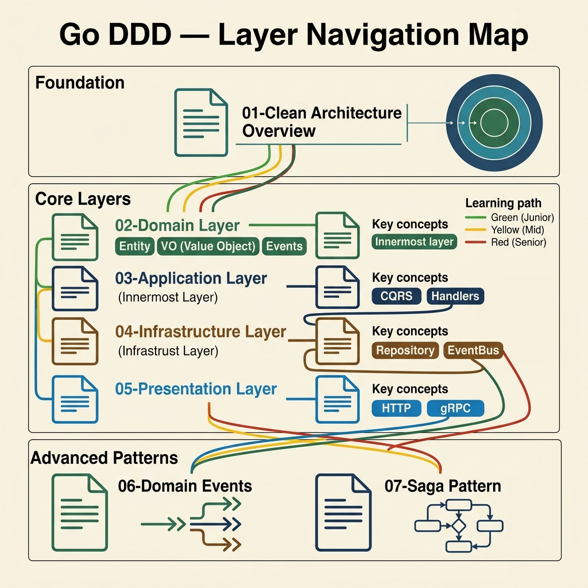
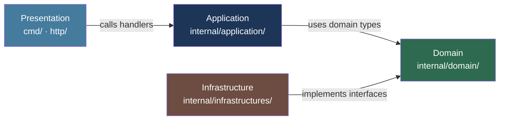

<!-- tags: architecture, clean-architecture, golang, overview -->
# 🐹 Go DDD + Clean Architecture

> A documentation suite for implementing Domain-Driven Design and Clean Architecture in Go.

---

## Architecture Overview



```
┌────────────────────────────────────────────────┐
│          PRESENTATION LAYER (cmd/, http/)       │
│     Gin handlers · gRPC · CLI · WebSocket       │
├────────────────────────────────────────────────┤
│          APPLICATION LAYER (internal/app/)      │
│     Command handlers · Query handlers · DTOs   │
├────────────────────────────────────────────────┤
│            DOMAIN LAYER (internal/domain/)      │
│  Entity · Value Object · Events · Repo Port    │
├────────────────────────────────────────────────┤
│       INFRASTRUCTURE LAYER (internal/infra/)    │
│  Postgres · Redis · Kafka · External APIs      │
└────────────────────────────────────────────────┘
         ↑ Infrastructure implements Domain interfaces
```

**Dependency Rule**: `Presentation → Application → Domain ← Infrastructure`

### Diagram: Layer Dependencies



---

## Document List

| # | File | Content | Level |
|---|------|----------|--------|
| 01 | [Clean Architecture Overview](./01-clean-architecture-overview.md) | Four layers, dependency rules, and module setup. | ⭐ |
| 02 | [Domain Layer](./02-domain-layer.md) | Entities, Value Objects, Domain Events, and Repository Ports. | ⭐⭐ |
| 03 | [Application Layer](./03-application-layer.md) | CQRS handlers, manual dependency injection, and use cases. | ⭐⭐ |
| 04 | [Infrastructure Layer](./04-infrastructure-layer.md) | Repository implementations, Event Bus, Asynq, and Outbox. | ⭐⭐⭐ |
| 05 | [Presentation Layer](./05-presentation-layer.md) | Gin HTTP, gRPC, middleware, and response patterns. | ⭐⭐ |
| 06 | [Domain Events](./06-domain-events.md) | EventBus interfaces, Kafka implementations, and the Outbox lifecycle. | ⭐⭐⭐ |
| 07 | [Saga Pattern](./07-saga-pattern.md) | Distributed transactions, SagaOrchestrators, and Kafka-based compensation. | ⭐⭐⭐⭐ |

---

## Learning Path

### 🟢 Junior / New to Go + DDD
```
01 (overview) → 02 (domain) → 03 (application) → 05 (http)
```
Understand the four layers, value objects, basic handlers, and Gin routing.

### 🟡 Mid-level / Backend Engineer
```
01 → 02 → 03 → 04 (repository + event bus) → 05
```
Focus on the Repository pattern, interface-based dependency injection, and event dispatching.

### 🔴 Senior / Architect
```
02 (advanced DDD) → 06 (Domain Events) → 07 (Saga) → 04 (infra patterns) → 01 (design decisions)
```
Focus on tactical DDD patterns, Outbox, distributed events, and system resilience.

---

## Go vs NestJS — Key Differences

| Aspect | NestJS | Go |
|--------|--------|-----|
| **DI** | `@Injectable()` + Modules | Constructor injection (manual) |
| **Base Classes** | `BaseAggregateRoot`, `BaseCommand` | Interfaces and struct embedding |
| **Repository** | `extends BaseRepositoryTypeORM` | Implements interface |
| **Events** | `EventEmitter2` + Kafka | `EventBus` interface and manual dispatch |
| **Error Handling** | Throw exceptions | Return `error` |
| **Context** | Request scope (NestJS) | `context.Context` propagated explicitly |
| **CQRS** | `BaseCommand/BaseQuery` extend | `CommandHandler/QueryHandler` interfaces |
| **Validation** | class-validator decorators | Custom in Value Object constructors |

---

## Core Base Patterns (Go)

```go
// Domain Event interface
type DomainEvent interface {
    GetID() string
    GetType() string
    GetOccurredAt() time.Time
    GetAggregateID() string
}

// Repository port (domain layer — interface only)
type OrderRepository interface {
    Save(ctx context.Context, order *Order) error
    FindByID(ctx context.Context, id OrderID) (*Order, error)
}

// Command handler pattern
type CommandHandler[C any, R any] interface {
    Handle(ctx context.Context, cmd C) (R, error)
}

// Event handler
type EventHandler interface {
    Handle(ctx context.Context, event DomainEvent) error
}
```

---

## Common Violations

| Violation | Example | Fix |
|-----------|---------|-----|
| Domain imports Infrastructure | `domain` imports `persistence` | Depend on interfaces, not concrete types. |
| Infrastructure imports Application | `persistence` imports `commands` | Infrastructure should only implement domain interfaces. |
| Application bypasses Domain | Handler calls SQL directly | Handlers must use Repository interfaces. |
| VO without validation | `type Email string` | Validate in the `NewEmail()` constructor. |
| Exporting entity fields | `user.Email = ""` | Use domain methods like `user.ChangeEmail()`. |
