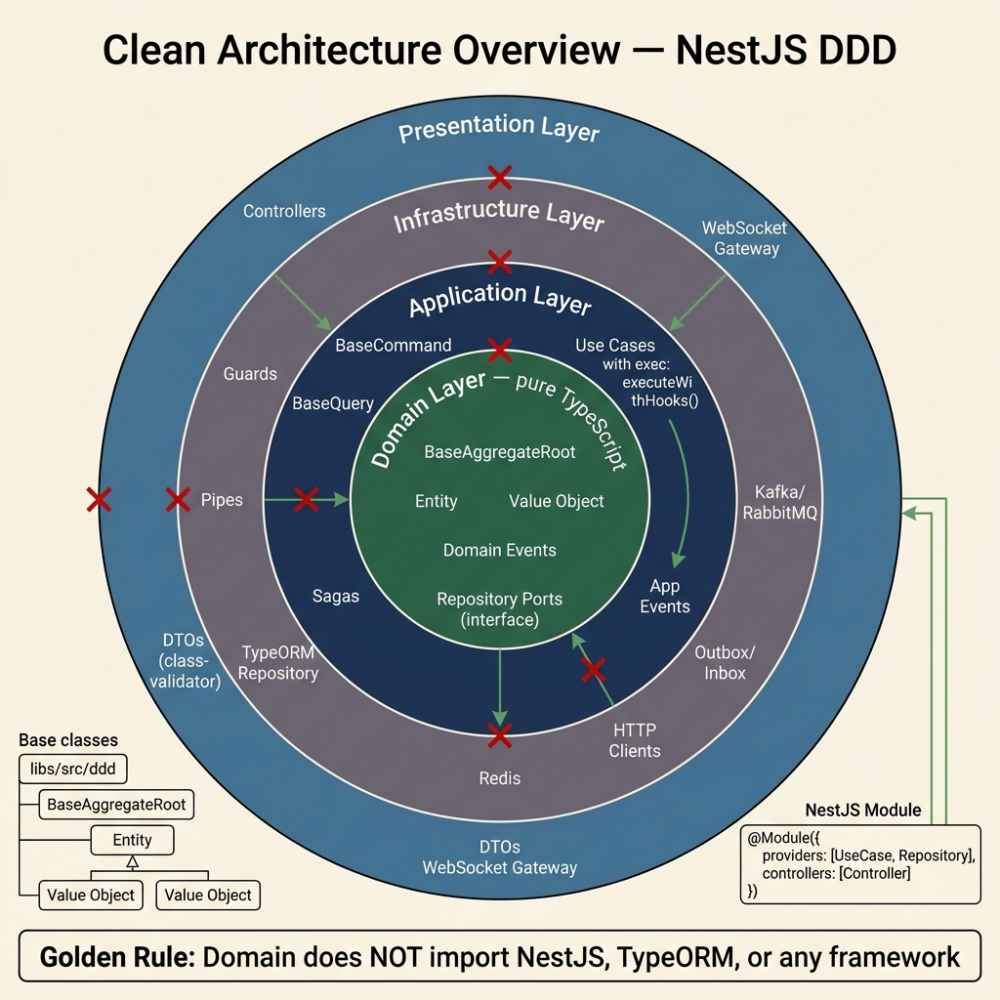
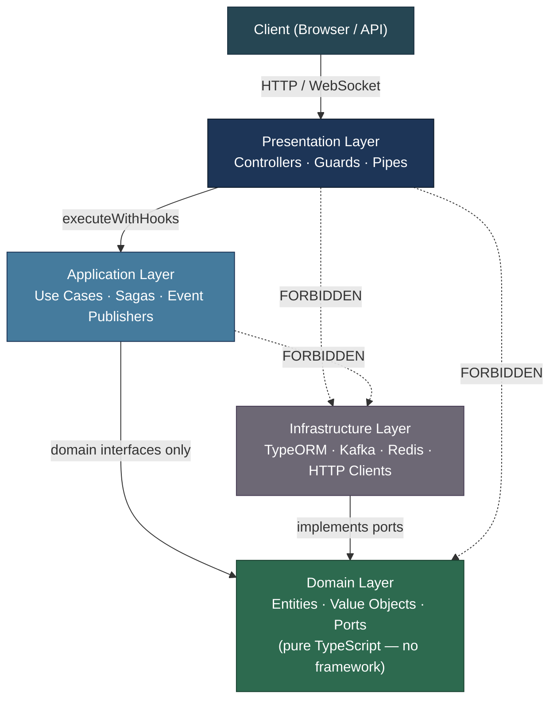
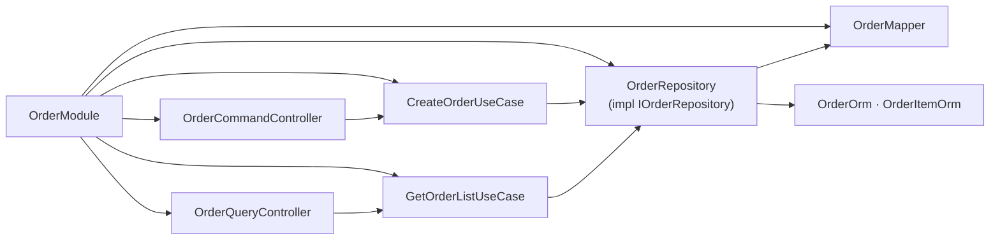

<!-- tags: architecture, clean-architecture, nestjs, typescript -->
# 🏗️ Clean Architecture Overview — NestJS DDD

> Overview of the 4-layer architecture (Clean Architecture + DDD) applied in a NestJS Monorepo

📅 Created: 2026-03-24 · 🔄 Updated: 2026-03-24 · ⏱️ 20 min read

| Aspect | Detail |
|--------|--------|
| **Pattern** | Clean Architecture + Domain-Driven Design |
| **Framework** | NestJS (Node.js) |
| **Database** | TypeORM (PostgreSQL) |
| **Messaging** | RabbitMQ / Kafka |
| **Base Classes** | `libs/src/ddd` |

---

## 1. DEFINE

### What is Clean Architecture?

Clean Architecture (Robert C. Martin) is a layering principle that keeps **business logic (Domain) completely independent** from external adapters (HTTP, Database, Message Broker).

**4 main layers:**

| Layer | Role | Depends on |
|-------|------|------------|
| **Domain** | Pure business logic — imports no framework | Nothing |
| **Application** | Orchestrates use-cases | Domain |
| **Infrastructure** | Implements ports/interfaces | Domain |
| **Presentation** | Receives HTTP/WebSocket requests from clients | Application |

### Dependency Rule (MANDATORY)

```
Presentation → Application → Domain ← Infrastructure
```

All dependencies point toward the **center** (Domain). Domain knows nothing about Infrastructure.

### DDD (Domain-Driven Design)

DDD places **the business domain** at the center of design. Building blocks:

| Concept | Description | Example |
|---------|-------------|---------|
| **Entity** | Object with identity (ID) | `Order`, `Agreement` |
| **Value Object** | Object without identity, defined by value | `Money`, `Address` |
| **Aggregate Root** | Cluster of entities, enforces consistency | `Order` (contains `OrderItem`) |
| **Domain Event** | An event that occurred in the domain | `OrderCreated`, `OrderPaid` |
| **Repository Port** | Interface for persisting/retrieving entities | `IOrderRepository` |
| **Domain Service** | Logic spanning multiple entities | `PricingDomainService` |
| **Factory** | Creates complex objects | `OrderFactory` |
| **Policy** | Pluggable business rule | `CancellationPolicy` |

### Invariants

- Domain must not import NestJS, TypeORM, or HTTP clients
- Use-cases must extend `BaseCommand` or `BaseQuery`
- Repository implementations must inject `DataSource` (not `@InjectRepository`)
- Mappers must use `XxxMapper.create()` (not `new`)
- Port interfaces belong in `Domain/ports/` (not Application)

---

These failure modes sound familiar. But there is a trap: the NestJS DI container masks dependency direction, causing domain to silently import infrastructure. Uncontrolled module re-exports lead to circular dependencies. That trap will surface in PITFALLS.

## 2. VISUAL



### Full Architecture

```
┌─────────────────────────────────────────────────────────────────┐
│                      CLIENT (Browser/API)                       │
└──────────────────────────┬──────────────────────────────────────┘
                           │ HTTP / WebSocket
┌──────────────────────────▼──────────────────────────────────────┐
│                     PRESENTATION LAYER                          │
│                                                                 │
│  ┌─────────────────┐  ┌──────────────┐  ┌───────────────────┐  │
│  │   Controllers   │  │    Guards    │  │   Event Gateway   │  │
│  │ (Command/Query) │  │  (Auth/Rate) │  │  (WebSocket push) │  │
│  └────────┬────────┘  └──────────────┘  └───────────────────┘  │
│           │ DTOs (class-validator)                              │
└───────────┼─────────────────────────────────────────────────────┘
            │ calls executeWithHooks() / queryWithHooks()
┌───────────▼─────────────────────────────────────────────────────┐
│                     APPLICATION LAYER                           │
│                                                                 │
│  ┌──────────────────────────────────────────────────────────┐   │
│  │              Use Cases (BaseCommand / BaseQuery)         │   │
│  │  CreateOrderUseCase · PayOrderUseCase · GetOrderUseCase  │   │
│  └─────────────────────────┬────────────────────────────────┘   │
│                            │                                    │
│  ┌──────────────┐  ┌───────▼──────┐  ┌──────────────────────┐  │
│  │    Sagas     │  │  App Service │  │   Event Publishers   │  │
│  │ (Distributed │  │  (Orchestrat │  │  (Kafka/RabbitMQ)    │  │
│  │  Txn)        │  │  ion only)   │  │                      │  │
│  └──────────────┘  └──────────────┘  └──────────────────────┘  │
└───────────┬─────────────────────────────────────────────────────┘
            │ depends on Domain interfaces (Ports)
┌───────────▼─────────────────────────────────────────────────────┐
│                       DOMAIN LAYER                              │
│                  (Framework-free — pure TypeScript)             │
│                                                                 │
│  ┌─────────────────────────────────────────────────────────┐    │
│  │  Aggregate Root (BaseAggregateRoot)                     │    │
│  │  ┌──────────────────────────────────────────────────┐   │    │
│  │  │  Order (root)                                    │   │    │
│  │  │  ├── OrderItem[] (entity)                        │   │    │
│  │  │  ├── Money (value object)                        │   │    │
│  │  │  └── Address (value object)                      │   │    │
│  │  └──────────────────────────────────────────────────┘   │    │
│  └─────────────────────────────────────────────────────────┘    │
│                                                                 │
│  ┌──────────────┐  ┌──────────────┐  ┌───────────────────────┐  │
│  │Domain Events │  │  Repository  │  │   Domain Service /    │  │
│  │(OrderCreated)│  │  Ports (IF)  │  │   Factory / Policy    │  │
│  └──────────────┘  └──────────────┘  └───────────────────────┘  │
└───────────┬─────────────────────────────────────────────────────┘
            │ implements ports
┌───────────▼─────────────────────────────────────────────────────┐
│                   INFRASTRUCTURE LAYER                          │
│                                                                 │
│  ┌──────────────┐  ┌──────────────┐  ┌───────────────────────┐  │
│  │  TypeORM     │  │ HTTP Clients │  │  Kafka / RabbitMQ     │  │
│  │  Repository  │  │ (Wallet/SSO) │  │  Publisher/Consumer   │  │
│  └──────────────┘  └──────────────┘  └───────────────────────┘  │
│  ┌──────────────┐  ┌──────────────┐  ┌───────────────────────┐  │
│  │    Redis     │  │  Resilience  │  │  Outbox / Inbox       │  │
│  │  (Cache/Lock)│  │ (CB/Retry)   │  │  (Reliable Delivery)  │  │
│  └──────────────┘  └──────────────┘  └───────────────────────┘  │
└─────────────────────────────────────────────────────────────────┘
```

### Diagram: 4-Layer Dependency Flow



> Dashed arrows (`.->`) = **FORBIDDEN** — violates Clean Architecture.

### Diagram: NestJS Module Dependency Graph



### Project Folder Structure

```
src/
├── domain/                    ← DOMAIN LAYER
│   ├── order/
│   │   ├── entities/          ← Aggregate root + child entities
│   │   ├── value-objects/     ← Money, Address, OrderNumber
│   │   ├── events/            ← OrderCreated, OrderPaid
│   │   ├── services/          ← PricingDomainService
│   │   ├── factories/         ← OrderFactory
│   │   └── policies/          ← CancellationPolicy
│   └── payment/
│       └── entities/          ← PaymentMethod variants
│
├── application/               ← APPLICATION LAYER
│   ├── order/
│   │   ├── use-cases/         ← CreateOrder, PayOrder, CancelOrder
│   │   ├── sagas/             ← OrderSaga (distributed txn)
│   │   ├── services/          ← Orchestration only
│   │   ├── policies/          ← Retry/timeout per domain
│   │   └── events/            ← Publish to Kafka
│   └── agreement/
│       └── use-cases/
│
├── infrastructure/            ← INFRASTRUCTURE LAYER
│   ├── persistence/           ← TypeORM repos, ORM entities
│   │   ├── outbox/            ← Outbox pattern (reliable events)
│   │   └── inbox/             ← Inbox pattern (idempotent consume)
│   ├── http/                  ← Wallet, SSO, Connector clients
│   ├── resilience/            ← Circuit breaker, retry, bulkhead
│   ├── redis/
│   └── rabbitmq/
│
├── presentation/              ← PRESENTATION LAYER
│   └── portal/
│       └── order/
│           ├── controllers/   ← OrderCommandController, OrderQueryController
│           ├── subscribers/   ← Event handlers
│           └── dtos/          ← CreateOrderDto, SearchOrdersDto
│
└── shared/
    └── mappers/               ← Domain ↔ ORM mappers (shared across layers)

libs/
└── src/
    └── ddd/                   ← CORE BASE CLASSES (must be extended)
        ├── domain/            ← BaseAggregateRoot, BaseEntity, BaseDomainEvents
        ├── application/       ← BaseCommand, BaseQuery
        └── infrastructure/    ← BaseRepositoryTypeORM, BaseMapper
```

### Request Flow Sequence

```
Client
  │
  ▼
Controller (Presentation)
  │ validates DTO (class-validator)
  ▼
UseCase.executeWithHooks() (Application)
  │ calls domain logic
  ▼
AggregateRoot.create/update (Domain)
  │ emits domain events
  ▼
Repository.save() (Application → via Port)
  │ implemented by Infrastructure
  ▼
TypeORM Repository (Infrastructure)
  │ maps Domain → ORM via Mapper
  │ persists to PostgreSQL
  │ dispatches domain events
  ▼
DomainEventDispatcher
  │ publishes events to Outbox
  ▼
Outbox → Kafka/RabbitMQ → Other services
```

---

## 3. CODE

### Basic: Module Setup (NestJS DI Wiring)

For a feature to work end-to-end, you need to wire **4 components**: Module → Controller → UseCase → Repository.

```typescript
// infrastructure/modules/order/order.module.ts
// ✅ Wire all: Mapper + Repository + UseCase + Controller
import { Module } from '@nestjs/common';
import { LibTypeOrmModule } from '@libs/core/database';     // ⚠️ LibTypeOrmModule (not LibTypeormModule)

// Domain
import { IOrderRepository } from '@domain/order/repositories/order.repository.port';

// Infrastructure
import { OrderOrm } from '../persistence/order.orm.entity';
import { OrderItemOrm } from '../persistence/order-item.orm.entity';
import { OrderMapper } from '@modules-shared/mappers/order.mapper';
import { OrderRepository } from '../persistence/order.repository';

// Application
import { CreateOrderUseCase } from '@application/order/use-cases/create-order.use-case';
import { GetOrderListUseCase } from '@application/order/use-cases/get-order-list.use-case';

// Presentation
import { OrderCommandController } from '@presentation/portal/order/controllers/order-command.controller';
import { OrderQueryController } from '@presentation/portal/order/controllers/order-query.controller';

@Module({
    imports: [
        LibTypeOrmModule.forFeature([OrderOrm, OrderItemOrm]), // ✅ register ORM entities
    ],
    controllers: [
        OrderCommandController,
        OrderQueryController,
    ],
    providers: [
        // ✅ Mapper first (Repository depends on Mapper)
        OrderMapper,
        // ✅ Repository implementation + bind to interface token
        {
            provide: IOrderRepository,
            useClass: OrderRepository,
        },
        // ✅ Use cases
        CreateOrderUseCase,
        GetOrderListUseCase,
    ],
})
export class OrderModule {}
```

The basic module is covered. But DI wiring needs clear boundaries — let us separate them.

### Intermediate: End-to-End Flow (Create Order)

```typescript
// === DOMAIN LAYER ===
// domain/order/entities/order.entity.ts
import { BaseAggregateRoot } from '@ddd/domain';
import { UniqueEntityId } from '@ddd/domain';
import { Money } from '../value-objects/money.vo';
import { OrderCreatedEvent } from '../events/order-created.event';

interface OrderProps {
    customerId: string;
    items: OrderItem[];
    totalAmount: Money;
    status: 'PENDING' | 'PAID' | 'CANCELLED';
    createdAt: Date;
}

export class Order extends BaseAggregateRoot {
    private constructor(
        id: UniqueEntityId,
        private props: OrderProps,
    ) {
        super(id);
    }

    // ✅ Factory method — validate before creating
    static create(customerId: string, items: OrderItem[]): Order {
        const id = new UniqueEntityId();
        const totalAmount = Money.calculate(items);

        const order = new Order(id, {
            customerId,
            items,
            totalAmount,
            status: 'PENDING',
            createdAt: new Date(),
        });

        // ✅ Emit domain event — dispatched after save
        order.addDomainEvent(new OrderCreatedEvent(order.id.toString(), customerId));
        return order;
    }

    // ✅ Reconstitute — used when loading from DB (no event emitted)
    static reconstitute(id: UniqueEntityId, props: OrderProps): Order {
        return new Order(id, props);
    }

    // ✅ Getters only — no setters
    get customerId(): string { return this.props.customerId; }
    get totalAmount(): Money { return this.props.totalAmount; }
    get status(): string { return this.props.status; }
    get createdAt(): Date { return this.props.createdAt; }

    // ✅ Domain behavior method
    pay(): void {
        if (this.props.status !== 'PENDING') {
            throw new Error('Only PENDING orders can be paid');
        }
        this.props.status = 'PAID';
        this.addDomainEvent(new OrderPaidEvent(this.id.toString()));
    }
}
```

```typescript
// === APPLICATION LAYER ===
// application/order/use-cases/create-order.use-case.ts
import { Injectable, Inject } from '@nestjs/common';
import { BaseCommand } from '@ddd/application';
import { IOrderRepository } from '@domain/order/repositories/order.repository.port';
import { Order } from '@domain/order/entities/order.entity';

export interface CreateOrderRequest {
    customerId: string;
    items: Array<{ productId: string; quantity: number; price: number }>;
}

export interface CreateOrderResponse {
    orderId: string;
    totalAmount: number;
    status: string;
}

@Injectable()
export class CreateOrderUseCase extends BaseCommand<CreateOrderRequest, CreateOrderResponse> {
    constructor(
        @Inject(IOrderRepository)
        private readonly orderRepository: IOrderRepository,
    ) {
        super();
    }

    // ✅ executeWithHooks() calls execute() with validation + lifecycle hooks
    async execute(req: CreateOrderRequest): Promise<CreateOrderResponse> {
        // 1. Create domain entity (business logic lives here)
        const order = Order.create(req.customerId, req.items);

        // 2. Persist via Repository Port (interface — does not know TypeORM)
        const savedOrder = await this.orderRepository.save(order);

        // 3. Return response DTO
        return {
            orderId: savedOrder.id.toString(),
            totalAmount: savedOrder.totalAmount.value,
            status: savedOrder.status,
        };
    }
}
```

```typescript
// === PRESENTATION LAYER ===
// presentation/portal/order/controllers/order-command.controller.ts
import { Controller, Post, Body } from '@nestjs/common';
import { CreateOrderUseCase } from '@application/order/use-cases/create-order.use-case';
import { CreateOrderDto } from '../dtos/create-order.dto';
import { OrderResponseDto } from '../dtos/order-response.dto';

@Controller('orders')
export class OrderCommandController {
    constructor(
        private readonly createOrderUseCase: CreateOrderUseCase,
    ) {}

    @Post()
    async create(@Body() dto: CreateOrderDto): Promise<OrderResponseDto> {
        // ✅ executeWithHooks() = execute() + validation + hooks (from BaseCommand)
        return this.createOrderUseCase.executeWithHooks({
            customerId: dto.customerId,
            items: dto.items,
        });
    }
}
```

DI boundaries are covered. But module composition needs encapsulation — let us wrap it up.

### Advanced: DDD Patterns Stack

This is the full pattern stack when implementing a complex feature with distributed transactions:

```typescript
// === ADVANCED: Saga + Outbox + Resilience ===
// application/order/use-cases/pay-order.use-case.ts

import { Injectable, Inject } from '@nestjs/common';
import { BaseCommand } from '@ddd/application';
import { IOrderRepository } from '@domain/order/repositories/order.repository.port';
import { IPaymentPort } from '@domain/order/ports/payment.port';
import { IIdempotencyStore } from '@domain/ports/idempotency.port';

export interface PayOrderRequest {
    orderId: string;
    paymentMethodId: string;
    idempotencyKey: string; // ⚠️ mutation endpoints must have an idempotency key
}

@Injectable()
export class PayOrderUseCase extends BaseCommand<PayOrderRequest, void> {
    constructor(
        @Inject(IOrderRepository) private orderRepo: IOrderRepository,
        @Inject(IPaymentPort) private paymentPort: IPaymentPort,     // ✅ Port interface (not impl)
        @Inject(IIdempotencyStore) private idempotency: IIdempotencyStore,
    ) {
        super();
    }

    async execute(req: PayOrderRequest): Promise<void> {
        // 1. ✅ Idempotency check — prevent duplicate processing
        const existing = await this.idempotency.get(req.idempotencyKey);
        if (existing) return; // Already processed

        // 2. Load aggregate
        const order = await this.orderRepo.findById(req.orderId);
        if (!order) throw new OrderNotFoundError(req.orderId);

        // 3. Domain behavior (business rule enforcement)
        order.pay(); // ⚠️ throws if status !== PENDING

        // 4. External call via resilience stack (circuit breaker + retry)
        //    PaymentPort is implemented in Infrastructure with CircuitBreaker wrapping
        await this.paymentPort.charge({
            orderId: req.orderId,
            amount: order.totalAmount.value,
            paymentMethodId: req.paymentMethodId,
        });

        // 5. Persist — BaseRepositoryTypeORM dispatches domain events to Outbox
        await this.orderRepo.save(order);

        // 6. Mark idempotency key as processed
        await this.idempotency.set(req.idempotencyKey, { processedAt: new Date() });
    }
}
```

---

You have covered module setup, DI boundaries, and encapsulation. Now comes the dangerous part: masked dependency direction and circular imports — the trap set up from the beginning of this article.

## 4. PITFALLS

| # | Mistake | Fix |
|---|---------|-----|
| 1 | Domain imports TypeORM `@Column()` | Domain must use pure TypeScript only — ORM entities belong in Infrastructure |
| 2 | Port interface in Application layer | Always place `IXxxRepository` in `domain/<module>/repositories/` or `domain/ports/` |
| 3 | `@InjectRepository(OrderOrm)` in Repository | Inject `DataSource` via constructor — `super(OrderOrm, dataSource, mapper)` |
| 4 | `new OrderMapper()` | Must use `OrderMapper.create()` — static factory method |
| 5 | Use-case does not extend BaseCommand | Loses lifecycle hooks (validation, logging, error handling) |
| 6 | Controller contains business logic | Controller may only validate DTO and call use-case |
| 7 | Missing `export` on interface | TS4053: Controller cannot see return type |
| 8 | `LibTypeormModule` (typo) | Correct spelling: `LibTypeOrmModule` (capital O) |
| 9 | Use-case bundles multiple classes in 1 file | Each use-case gets its own file |
| 10 | Long relative imports `../../../domain/` | Use aliases: `@domain/`, `@application/`, `@infrastructure/` |

---

You have covered NestJS Clean Architecture and its traps. The resources below help go deeper.

## 5. REF

| Resource | Link |
|----------|------|
| NestJS Documentation | https://docs.nestjs.com |
| Clean Architecture (Robert C. Martin) | https://blog.cleancoder.com/uncle-bob/2012/08/13/the-clean-architecture.html |
| Domain-Driven Design — Eric Evans | Book: "Domain-Driven Design: Tackling Complexity in the Heart of Software" |
| DDD Reference — Martin Fowler | https://martinfowler.com/tags/domain%20driven%20design.html |
| TypeORM | https://typeorm.io |
| CQRS Pattern — NestJS | https://docs.nestjs.com/recipes/cqrs |
| Outbox Pattern | https://microservices.io/patterns/data/transactional-outbox.html |

---

## 6. RECOMMEND

| Next step | When | Reason |
|-----------|------|--------|
| [Domain Layer →](./02-domain-layer.md) | When you need to understand Entity/AggregateRoot | Core of DDD — must be mastered |
| [Application Layer →](./03-application-layer.md) | When implementing a use-case | BaseCommand/BaseQuery + Saga |
| [Infrastructure Layer →](./04-infrastructure-layer.md) | When implementing repository/adapter | Repository pattern + resilience |
| [Presentation Layer →](./05-presentation-layer.md) | When implementing Controller/DTO | REST API patterns + Swagger |
| Event Sourcing | When you need a full audit trail | Rebuild state from event history |
| GraphQL Federation | When multiple services share a schema | Integrates with NestJS @nestjs/graphql |
| OpenTelemetry | Production observability | End-to-end distributed tracing |

---

← [README](./README.md) · → [Domain Layer](./02-domain-layer.md)
