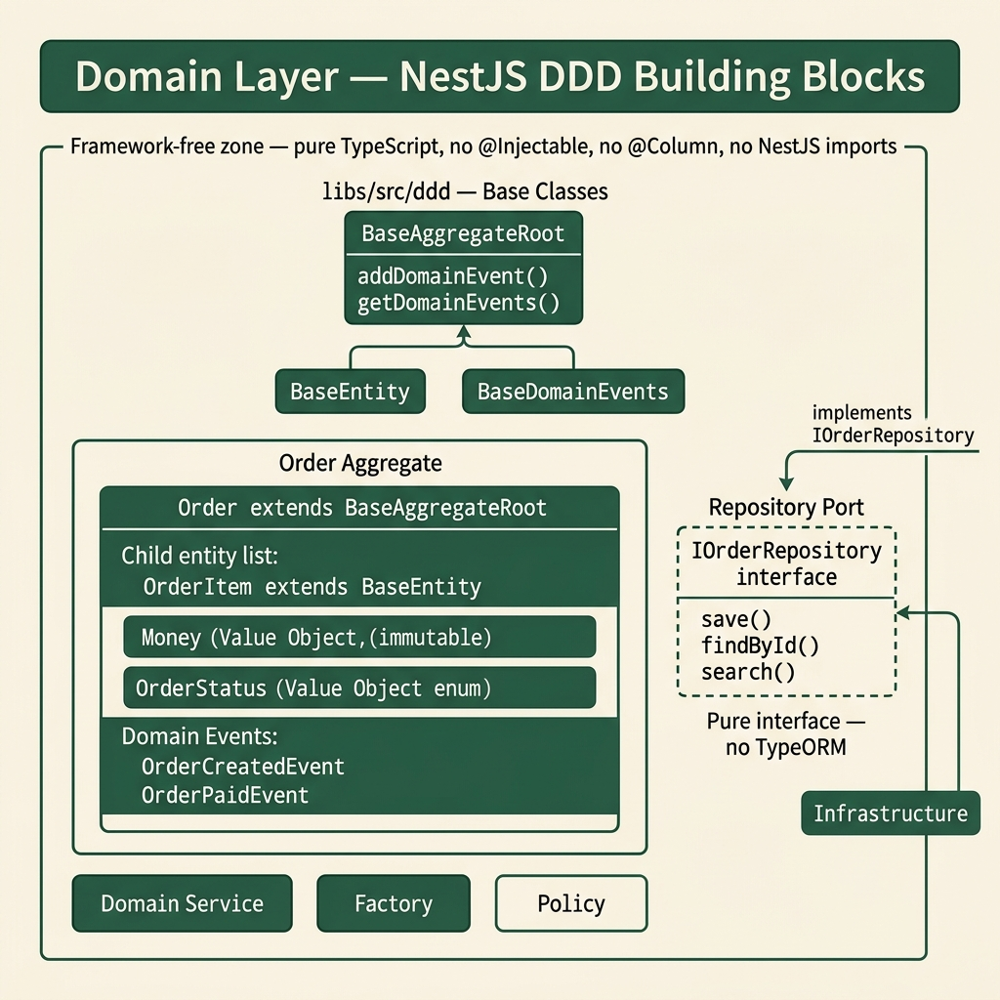

<!-- tags: architecture, clean-architecture, nestjs, typescript, ddd -->
# 🧠 Domain Layer — NestJS DDD

> The heart of DDD architecture: Entity, Aggregate Root, Value Object, Domain Events, and Ports — completely framework-independent

📅 Created: 2026-03-24 · 🔄 Updated: 2026-03-24 · ⏱️ 25 min read

| Aspect | Detail |
|--------|--------|
| **Layer** | Domain (innermost layer) |
| **Dependencies** | Depends on no other layer |
| **Base Classes** | `BaseAggregateRoot`, `BaseEntity`, `BaseDomainEvents` |
| **Forbidden** | NestJS decorators, TypeORM, HTTP client, Redis |

---

## 1. DEFINE

### What is the Domain Layer?

The Domain Layer is the **pure business** tier — it contains all business logic and depends on no framework or database. This is why domain code can run on any framework.

**Golden Rule**: The Domain Layer uses only pure TypeScript. No `@Injectable()`, no `@Column()`, no `import { redis } from ...`.

### Domain Layer Building Blocks

| Concept | Extends | Purpose | Example |
|---------|---------|---------|---------|
| **Aggregate Root** | `BaseAggregateRoot` | Single entry point for modifying a group of entities | `Order` (manages `OrderItem[]`) |
| **Entity** | `BaseEntity` | Object with unique identity (ID) | `OrderItem` |
| **Value Object** | — | Object without ID, compared by value | `Money`, `Address` |
| **Domain Event** | `BaseDomainEvents` | Event that occurred in the domain, dispatched after save | `OrderCreated`, `OrderPaid` |
| **Repository Port** | Interface | Abstract contract for persistence | `IOrderRepository` |
| **Domain Service** | — | Logic spanning multiple entities | `PricingDomainService` |
| **Factory** | — | Creates complex objects with validation | `OrderFactory` |
| **Policy** | Interface | Pluggable business rule | `CancellationPolicy` |

### Aggregate vs Entity

```
Aggregate Boundary
┌─────────────────────────────────┐
│  Order (Aggregate Root)         │  ← Single point of modification
│  ┌───────────────────────────┐  │
│  │  OrderItem (Entity)       │  │  ← Can only be modified through Order
│  │  OrderItem (Entity)       │  │
│  └───────────────────────────┘  │
│  Money (Value Object)           │
│  Address (Value Object)         │
└─────────────────────────────────┘
```

**Invariant**: Never hold a direct reference to `OrderItem` from outside the aggregate — always go through `Order`.

### Value Object vs Entity

| | Entity | Value Object |
|-|--------|-------------|
| **Identity** | Has ID (unique) | No ID |
| **Comparison** | By ID | By all fields |
| **Mutability** | Can change (via methods) | Immutable |
| **Example** | `Order`, `User` | `Money(100, "VND")`, `Email` |

### Failure Modes

| Mistake | Cause | Fix |
|---------|-------|-----|
| Domain imports NestJS/TypeORM | Copy-paste from infrastructure | Separate ORM entity into its own file |
| Business logic in Use-case | Unclear layer boundaries | Move into Entity method |
| Setting property directly (`order.status = ...`) | Missing domain method | Create `order.pay()`, `order.cancel()` |
| Emitting event without dispatch | Missing `dispatchDomainEventsForAggregates` | Call it inside Repository.save() |

---

These failure modes are clear. But there is a trap: an entity that uses TypeORM decorators directly leaks ORM into the domain, and a mutable value object breaks invariants silently. That trap will surface in PITFALLS.

## 2. VISUAL



### Domain Layer Internal Structure

```
src/domain/order/
│
├── entities/
│   ├── order.entity.ts          ← Aggregate Root (extends BaseAggregateRoot)
│   ├── order-event-sourced.entity.ts  ← Event Sourcing variant
│   └── order-item.entity.ts     ← Child Entity (extends BaseEntity)
│
├── value-objects/
│   ├── money.vo.ts              ← Immutable, compare by value
│   ├── order-number.vo.ts
│   └── address.vo.ts
│
├── events/
│   ├── order-created.event.ts   ← extends BaseDomainEvents
│   ├── order-paid.event.ts
│   └── order-shipped.event.ts
│
├── services/
│   ├── pricing-domain.service.ts   ← Multi-entity logic
│   └── inventory-domain.service.ts
│
├── factories/
│   └── order.factory.ts         ← Complex creation logic
│
├── policies/
│   ├── cancellation-policy.interface.ts   ← Pluggable rule contract
│   ├── standard-cancellation.policy.ts
│   └── premium-cancellation.policy.ts
│
└── repositories/
    └── order.repository.port.ts  ← IOrderRepository interface (Port)
```

### Domain Event Flow

```
Order.pay()
    │
    ▼ addDomainEvent(new OrderPaidEvent(...))
    │
    ▼ [events stored in BaseAggregateRoot internally]
    │
Repository.save(order)
    │
    ▼ BaseRepositoryTypeORM.saveOne(domain)
        │
        ▼ dispatch: dispatchDomainEventsForAggregates(savedDomain)
            │
            ▼ DomainEventDispatcher.dispatch(event)
                │
                ├─▶ Outbox: persist event for reliable delivery
                └─▶ EventBus: fire-and-forget listeners (local)
```

### Policy Pattern (Pluggable Business Rules)

```
┌────────────────────────────┐
│  CancellationPolicy (IF)   │  ← Domain defines the interface
│  + canCancel(order): bool  │
│  + cancel(order): void     │
└────────────────────────────┘
         ▲                ▲
         │                │
┌────────┴──────┐  ┌──────┴───────────┐
│ StandardPolicy│  │  PremiumPolicy   │
│ (24h window)  │  │  (7 day window)  │
└───────────────┘  └──────────────────┘

Usage in Order:
  order.cancel(policy, reason)
  → policy.canCancel(order) → throws if not allowed
  → policy.cancel(order) → apply cancellation logic
```

---

## 3. CODE

### Basic: Value Object

Value Objects are immutable — once created, they cannot be changed. Create a new instance when you need a new value.

```typescript
// domain/order/value-objects/money.vo.ts
// ✅ Value Object: immutable, compare by value, no ID

export class Money {
    private constructor(
        private readonly _value: number,
        private readonly _currency: string,
    ) {
        // ✅ Validation in constructor — invariant enforcement
        if (_value < 0) {
            throw new Error('Money value cannot be negative');
        }
        if (!_currency || _currency.length !== 3) {
            throw new Error('Currency must be 3-letter ISO code');
        }
    }

    // ✅ Static factory method (do not use `new` from outside)
    static create(value: number, currency: string): Money {
        return new Money(value, currency);
    }

    // ✅ Sum from list (domain utility)
    static sum(items: Array<{ price: number; quantity: number }>, currency: string): Money {
        const total = items.reduce((sum, item) => sum + item.price * item.quantity, 0);
        return new Money(total, currency);
    }

    get value(): number { return this._value; }
    get currency(): string { return this._currency; }

    // ✅ Compare by value (not by reference)
    equals(other: Money): boolean {
        return this._value === other._value && this._currency === other._currency;
    }

    // ✅ Operations return a new Money (immutable)
    add(other: Money): Money {
        if (this._currency !== other._currency) {
            throw new Error('Cannot add different currencies');
        }
        return new Money(this._value + other._value, this._currency);
    }

    toString(): string {
        return `${this._value} ${this._currency}`;
    }
}

// Usage:
// const price = Money.create(100_000, 'VND');
// const total = price.add(Money.create(50_000, 'VND')); // new Money(150_000, 'VND')
```

### Basic: Domain Event

```typescript
// domain/order/events/order-created.event.ts
import { BaseDomainEvents } from '@ddd/domain';
import { IUniqueEntityID } from '@ddd/interfaces';

// ✅ Define props type separately
export interface OrderCreatedProps {
    customerId: string;
    totalAmount: number;
    currency: string;
}

// ✅ BaseDomainEvents<T> — constructor takes (aggregateId, props?)
// eventName is derived from this.constructor.name → 'OrderCreatedEvent'
export class OrderCreatedEvent extends BaseDomainEvents<OrderCreatedProps> {
    constructor(aggregateId: IUniqueEntityID, props: OrderCreatedProps) {
        super(aggregateId, props);
    }
    // ✅ No need to override get eventName() — base class handles it
}

// Access:
// event.eventName       → 'OrderCreatedEvent'
// event.aggregateId     → IUniqueEntityID
// event.props.customerId
// event.eventId         → uuidv7
// event.occurredAt      → Date
```

Basic entities are covered. But value objects need immutability — let us enforce it.

### Intermediate: Aggregate Root

The Aggregate Root is the central object that enforces consistency across an entire group of entities.

```typescript
// domain/order/entities/order.entity.ts
import { BaseAggregateRoot, UniqueEntityId } from '@ddd/domain';
import { Money } from '../value-objects/money.vo';
import { Address } from '../value-objects/address.vo';
import { OrderCreatedEvent } from '../events/order-created.event';
import { OrderPaidEvent } from '../events/order-paid.event';
import { OrderCancelledEvent } from '../events/order-cancelled.event';
import { CancellationPolicy } from '../policies/cancellation-policy.interface';

export type OrderStatus = 'PENDING' | 'PAID' | 'SHIPPED' | 'CANCELLED';

interface OrderProps {
    customerId: string;
    items: OrderItemProps[];
    shippingAddress: Address;
    totalAmount: Money;
    status: OrderStatus;
    createdAt: Date;
    updatedAt: Date;
}

interface CreateOrderInput {
    customerId: string;
    items: Array<{ productId: string; quantity: number; unitPrice: number; currency: string }>;
    shippingAddress: { street: string; city: string; country: string };
}

export class Order extends BaseAggregateRoot {
    private constructor(
        id: UniqueEntityId,
        private props: OrderProps,
    ) {
        super(id);
    }

    // ✅ Factory method for creation — emits domain event
    static create(input: CreateOrderInput): Order {
        const id = new UniqueEntityId();

        // ✅ Validate business rules before creation
        if (!input.items || input.items.length === 0) {
            throw new Error('Order must have at least one item');
        }

        const items = input.items.map(i => ({
            productId: i.productId,
            quantity: i.quantity,
            unitPrice: Money.create(i.unitPrice, i.currency),
        }));

        const totalAmount = Money.sum(
            input.items.map(i => ({ price: i.unitPrice, quantity: i.quantity })),
            input.items[0].currency,
        );

        const order = new Order(id, {
            customerId: input.customerId,
            items,
            shippingAddress: Address.create(input.shippingAddress),
            totalAmount,
            status: 'PENDING',
            createdAt: new Date(),
            updatedAt: new Date(),
        });

        // ✅ Emit event — will be dispatched after Repository.save()
        // Constructor: (aggregateId: IUniqueEntityID, props: OrderCreatedProps)
        order.addDomainEvent(new OrderCreatedEvent(id, {
            customerId: input.customerId,
            totalAmount: totalAmount.value,
            currency: totalAmount.currency,
        }));

        return order;
    }

    // ✅ Reconstitute — load from DB, does NOT emit events
    static reconstitute(id: UniqueEntityId, props: OrderProps): Order {
        return new Order(id, props);
    }

    // ✅ Getters only — no setters (immutable props access)
    get customerId(): string { return this.props.customerId; }
    get totalAmount(): Money { return this.props.totalAmount; }
    get status(): OrderStatus { return this.props.status; }
    get items(): OrderItemProps[] { return [...this.props.items]; } // defensive copy
    get createdAt(): Date { return this.props.createdAt; }
    get updatedAt(): Date { return this.props.updatedAt; }

    // ✅ Domain behavior methods — enforce business rules
    pay(): void {
        if (this.props.status !== 'PENDING') {
            throw new InvalidOrderStatusError(
                `Cannot pay order in status: ${this.props.status}`
            );
        }
        this.props.status = 'PAID';
        this.props.updatedAt = new Date();
        this.addDomainEvent(new OrderPaidEvent(this.id, { paidAt: this.props.updatedAt }));
    }

    // ✅ Policy Pattern — pluggable cancellation rule
    cancel(policy: CancellationPolicy, reason: string): void {
        policy.assertCanCancel(this); // throws if cannot cancel
        this.props.status = 'CANCELLED';
        this.props.updatedAt = new Date();
        this.addDomainEvent(new OrderCancelledEvent(this.id, { reason }));
    }
}
```

Basic entities are covered. But value objects need immutability — let us enforce it.

### Intermediate: Repository Port (Interface)

The Port interface lives in **Domain** — Application calls this interface, Infrastructure implements it.

```typescript
// domain/order/repositories/order.repository.port.ts
// ✅ Interface defines the CONTRACT — knows nothing about TypeORM or any DB

import { Order } from '../entities/order.entity';
import { PaginatedResult } from '@shared/types';

export interface OrderFilters {
    customerId?: string;
    status?: string;
    fromDate?: Date;
    toDate?: Date;
}

export abstract class IOrderRepository {
    // Must be implemented in Infrastructure
    abstract findById(id: string): Promise<Order | null>;
    abstract save(order: Order): Promise<Order>;
    abstract findAll(filters: OrderFilters, page: number, limit: number): Promise<PaginatedResult<Order>>;
    abstract delete(id: string): Promise<void>;
    abstract existsById(id: string): Promise<boolean>;
}

// ⚠️ Uses abstract class instead of interface for NestJS DI token support
// @Inject(IOrderRepository) works because abstract class has a runtime representation
```

Value objects are covered. But the aggregate root needs a consistency boundary — let us protect it.

### Advanced: Domain Service (Multi-Entity Logic)

```typescript
// domain/order/services/pricing-domain.service.ts
// ✅ Domain Service: logic that belongs to no single entity

import { Injectable } from '@nestjs/common'; // ✅ @Injectable is allowed in domain service
import { Order } from '../entities/order.entity';
import { Customer } from '@domain/customer/entities/customer.entity';
import { Money } from '../value-objects/money.vo';

@Injectable()
export class PricingDomainService {
    // ✅ Discount calculation needs both Order (items) + Customer (tier) — belongs to no single entity
    calculateDiscount(order: Order, customer: Customer): Money {
        const baseAmount = order.totalAmount;
        let discountRate = 0;

        // Business rule: VIP customers get 10% discount on orders > 1,000,000 VND
        if (customer.tier === 'VIP' && baseAmount.value > 1_000_000) {
            discountRate = 0.10;
        } else if (customer.tier === 'PREMIUM' && baseAmount.value > 500_000) {
            discountRate = 0.05;
        }

        const discountAmount = baseAmount.value * discountRate;
        return Money.create(discountAmount, baseAmount.currency);
    }

    // ✅ Free shipping rule — needs Order total
    isFreeShipping(order: Order): boolean {
        return order.totalAmount.value >= 500_000;
    }
}
```

Value objects are covered. But the aggregate root needs a consistency boundary — let us protect it.

### Advanced: Policy Pattern

```typescript
// domain/order/policies/cancellation-policy.interface.ts
// ✅ Interface — Domain defines the contract

import { Order } from '../entities/order.entity';

export interface CancellationPolicy {
    assertCanCancel(order: Order): void; // throws if cannot cancel
}

// ---

// domain/order/policies/standard-cancellation.policy.ts
// ✅ Standard: can only cancel within 24 hours

export class StandardCancellationPolicy implements CancellationPolicy {
    assertCanCancel(order: Order): void {
        const hoursElapsed = (Date.now() - order.createdAt.getTime()) / (1000 * 60 * 60);

        if (order.status === 'SHIPPED') {
            throw new Error('Cannot cancel shipped order');
        }
        if (order.status === 'CANCELLED') {
            throw new Error('Order already cancelled');
        }
        if (hoursElapsed > 24) {
            throw new Error('Standard orders can only be cancelled within 24 hours');
        }
    }
}

// ---

// domain/order/policies/premium-cancellation.policy.ts
// ✅ Premium customers: 7-day window

export class PremiumCancellationPolicy implements CancellationPolicy {
    assertCanCancel(order: Order): void {
        const daysElapsed = (Date.now() - order.createdAt.getTime()) / (1000 * 60 * 60 * 24);

        if (order.status === 'SHIPPED') {
            throw new Error('Cannot cancel shipped order');
        }
        if (daysElapsed > 7) {
            throw new Error('Premium orders can only be cancelled within 7 days');
        }
    }
}

// Usage in Use Case:
// const policy = customer.isPremium
//     ? new PremiumCancellationPolicy()
//     : new StandardCancellationPolicy();
// order.cancel(policy, reason);
```

Value objects are covered. But the aggregate root needs a consistency boundary — let us protect it.

### Advanced: Double Dispatch (Polymorphic Payment)

```typescript
// domain/payment/entities/payment-method.base.ts
// ✅ Double Dispatch: Order calls method on PaymentMethod, which processes itself

export abstract class PaymentMethod {
    abstract charge(amount: number, currency: string): Promise<void>;
    abstract refund(amount: number, currency: string): Promise<void>;
}

// ---

// domain/payment/entities/credit-card-payment.ts
export class CreditCardPayment extends PaymentMethod {
    constructor(
        private readonly cardToken: string,
        private readonly last4Digits: string,
    ) { super(); }

    async charge(amount: number, currency: string): Promise<void> {
        // Credit card specific charging logic
        console.log(`Charging ${amount} ${currency} to card ending ${this.last4Digits}`);
    }

    async refund(amount: number, currency: string): Promise<void> {
        console.log(`Refunding ${amount} ${currency} to card ending ${this.last4Digits}`);
    }
}

// Usage in Order aggregate:
// async pay(paymentMethod: PaymentMethod): Promise<void> {
//     await paymentMethod.charge(this.totalAmount.value, this.totalAmount.currency);
//     this.props.status = 'PAID';
// }
// → order.pay(new CreditCardPayment(token, last4)) — automatically calls the correct implementation
```

---

You have covered entities, value objects, and aggregate roots. Now comes the dangerous part: ORM decorator leaks and mutable VOs — the trap set up from the beginning of this article.

## 4. PITFALLS

| # | Mistake | Fix |
|---|---------|-----|
| 1 | `import { TypeOrmModule } from '@nestjs/typeorm'` in Entity | Domain must be pure TypeScript — move to Infrastructure ORM entity |
| 2 | `order.status = 'PAID'` from outside the aggregate | Create an `order.pay()` method with business validation |
| 3 | Aggregate root does not call `addDomainEvent()` | Events will not be published — add events in state-changing methods |
| 4 | `reconstitute()` emits domain event | Reconstitute only rebuilds state; it must not emit new events |
| 5 | Value Object with `let` fields | VOs must be immutable — use `readonly` or `private readonly` |
| 6 | Port interface in Application layer | Creates circular dependency — always place ports in `domain/ports/` |
| 7 | Repository Port is `interface` (not abstract class) | NestJS DI needs a runtime token — use `abstract class IXxx` |
| 8 | Domain Service injects Repository | Domain Service must not know about persistence — inject via Application layer |
| 9 | Business logic in Constructor | Use `create()` factory method; constructor only assigns props |
| 10 | Value Object missing `equals()` | Cannot compare correctly — implement `equals(other: T): boolean` |

---

You have covered the NestJS Domain Layer and its traps. The resources below help go deeper.

## 5. REF

| Resource | Link |
|----------|------|
| Eric Evans — DDD Book | "Domain-Driven Design: Tackling Complexity" |
| Martin Fowler — Aggregate | https://martinfowler.com/bliki/DDD_Aggregate.html |
| Martin Fowler — Value Object | https://martinfowler.com/bliki/ValueObject.html |
| Martin Fowler — Domain Event | https://martinfowler.com/eaaDev/DomainEvent.html |
| NestJS Custom Providers | https://docs.nestjs.com/fundamentals/custom-providers |
| Khalil Stemmler — DDD TypeScript | https://khalilstemmler.com/articles/domain-driven-design-intro/ |
| Domain Events in TypeScript | https://khalilstemmler.com/articles/typescript-domain-driven-design/chain-business-logic-domain-events/ |

---

## 6. RECOMMEND

| Next step | When | Reason |
|-----------|------|--------|
| Event Sourcing | When you need an audit trail | `OrderEventSourced.fromHistory()` — rebuild state from events |
| Specification Pattern | Complex filter queries | Composable predicates for domain queries |
| Aggregate Boundaries Review | When 2 aggregates need sync | If frequently updated together → merge; different transactions → separate |
| Domain Exception Hierarchy | Consistent error handling | `BusinessError`, `NotFoundError`, `ValidationError` extends `ExceptionBase` |
| Unit Testing Domain | Test domain logic in isolation | Domain needs no database — test pure business logic |

---

← [Clean Architecture Overview](./01-clean-architecture-overview.md) · → [Application Layer](./03-application-layer.md)
