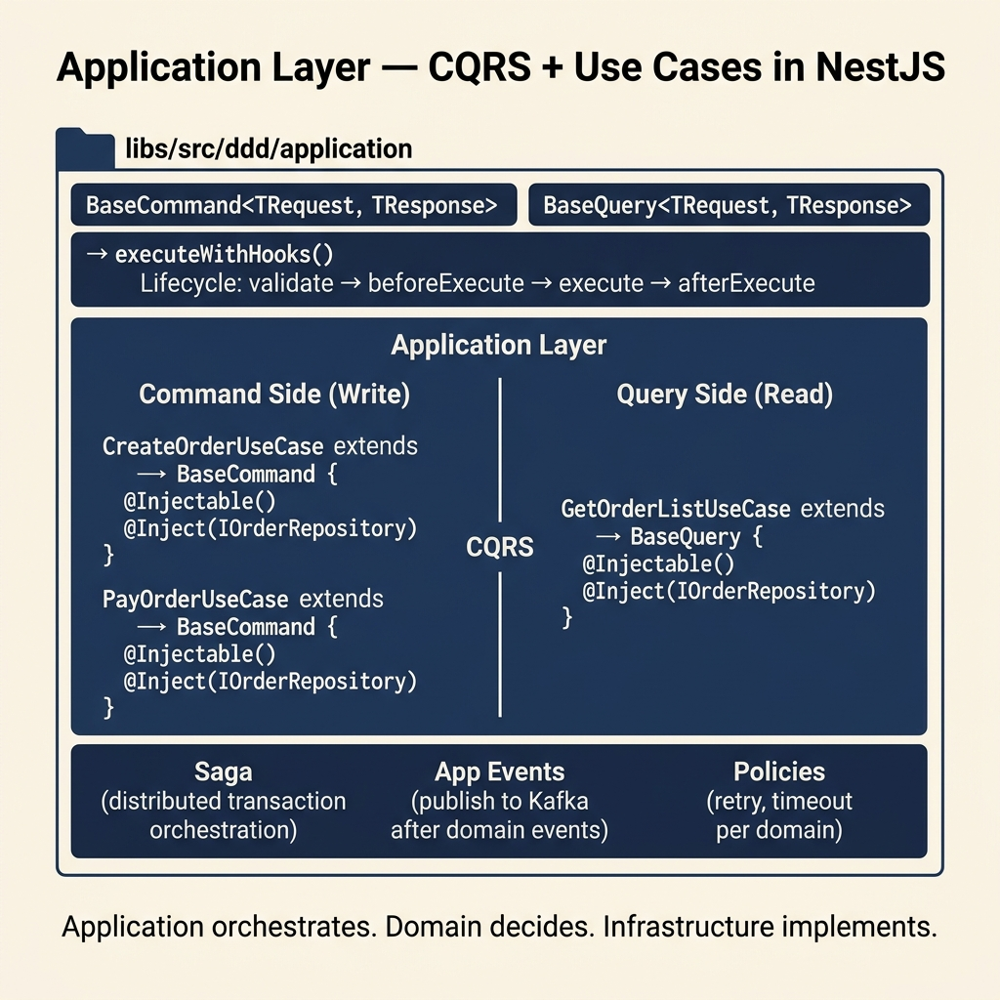

<!-- tags: architecture, clean-architecture, nestjs, typescript, application-layer -->
# ⚙️ Application Layer — NestJS DDD

> Orchestrating use-cases, CQRS with BaseCommand/BaseQuery, Saga for distributed transactions

📅 Created: 2026-03-24 · 🔄 Updated: 2026-03-24 · ⏱️ 25 min read

| Aspect | Detail |
|--------|--------|
| **Layer** | Application (business orchestration) |
| **Dependencies** | Domain (interface only) |
| **Base Classes** | `BaseCommand`, `BaseQuery` |
| **Pattern** | CQRS (Command/Query Responsibility Segregation) |

---

## 1. DEFINE

### What does the Application Layer do?

The Application Layer is the **orchestrator** — it contains no domain business logic, only coordinates the flow:

1. Receives requests from the Presentation Layer
2. Calls Domain entities/services to execute business logic
3. Persists results via the Repository Port
4. Publishes events via the Event Port

**Rule**: The Application Layer knows **who does what** (orchestration). The Domain Layer knows **how to do it** (business rules).

### CQRS — Command Query Responsibility Segregation

CQRS completely separates **write** (Command) from **read** (Query):

| | Command | Query |
|-|---------|-------|
| **Purpose** | Change state | Read data |
| **Base class** | `BaseCommand` | `BaseQuery` |
| **Return** | Side effect (save entity) | Data (DTO/list) |
| **Idempotency** | Must be considered | Not needed |
| **Example** | `CreateOrder`, `PayOrder` | `GetOrder`, `ListOrders` |

### Application Layer Components

| Component | Role | Example |
|-----------|------|---------|
| **Use Cases** | Business unit (1 use-case/file) | `CreateOrderUseCase` |
| **Sagas** | Distributed transactions with compensation | `OrderSaga` |
| **Application Services** | Complex orchestration (multiple use-cases) | `CheckoutService` |
| **Policies** | Retry/timeout/idempotency per domain | `OrderRetryPolicy` |
| **Event Publishers** | Publish to Kafka/RabbitMQ after domain event | `OrderEventPublisher` |

### Failure Modes

| Mistake | Cause | Fix |
|---------|-------|-----|
| Business logic in Use-case | Unclear layer boundaries | Move into Domain entity method |
| Port interface in Application | Circular dependency risk | Place in `domain/ports/` |
| Multiple UseCase classes in one file | Hard to maintain | 1 file = 1 use-case |
| Use-case does not extend BaseCommand | Loses lifecycle hooks | Always extend BaseCommand/BaseQuery |

---

These failure modes sound easy to avoid. But there is a trap: a use case that injects a repository directly instead of through an interface kills testability, and a CQRS handler without validation lets invalid commands through. That trap will surface in PITFALLS.

## 2. VISUAL



### Application Layer Structure

```
src/application/
├── order/
│   ├── use-cases/
│   │   ├── create-order.use-case.ts      ← BaseCommand (write)
│   │   ├── pay-order.use-case.ts         ← BaseCommand (write)
│   │   ├── cancel-order.use-case.ts      ← BaseCommand (write)
│   │   ├── get-order.use-case.ts         ← BaseQuery (read)
│   │   └── list-orders.use-case.ts       ← BaseQuery (read)
│   ├── sagas/
│   │   └── order-fulfillment.saga.ts     ← Distributed txn (Inventory → Payment → Shipping)
│   ├── services/
│   │   └── checkout.service.ts           ← Orchestration (multi use-case)
│   ├── policies/
│   │   └── order-idempotency.policy.ts   ← Retry/timeout rules
│   └── events/
│       └── order-event.publisher.ts      ← Kafka/RabbitMQ publish
└── agreement/
    ├── use-cases/
    │   ├── create-agreement.use-case.ts
    │   └── approve-agreement.use-case.ts
    └── ...
```

### Command Use Case Flow

```
Controller.create(dto)
    │
    ▼ executeWithHooks(request)       ← BaseCommand lifecycle
    │
    ├─ validate(request)              ← Input validation (hook)
    │
    ▼ execute(request)                ← Our implementation
    │
    ├─ Order.create(...)              ← Domain: business logic
    ├─ orderRepository.save(order)    ← Persist via Port
    │   └─ dispatch domain events     ← After save
    │
    └─ return CreateOrderResponse
```

### Saga Flow (Distributed Transaction)

```
OrderFulfillmentSaga
│
├─ Step 1: Reserve Inventory
│   ├─ execute: inventoryPort.reserve(items)
│   └─ compensate: inventoryPort.release(items)   ← rollback if later steps fail
│
├─ Step 2: Process Payment
│   ├─ execute: paymentPort.charge(amount)
│   └─ compensate: paymentPort.refund(amount)
│
└─ Step 3: Create Shipment
    ├─ execute: shippingPort.create(orderId)
    └─ compensate: shippingPort.cancel(orderId)

If Step 3 fails:
  → compensate Step 2 (refund)
  → compensate Step 1 (release inventory)
```

---

## 3. CODE

### Basic: BaseCommand Use Case

```typescript
// application/order/use-cases/create-order.use-case.ts
import { Injectable, Inject } from '@nestjs/common';
import { BaseCommand } from '@ddd/application';

// ✅ Import from Domain layer (interface/entity) — do NOT import Infrastructure
import { IOrderRepository } from '@domain/order/repositories/order.repository.port';
import { Order } from '@domain/order/entities/order.entity';
import { PricingDomainService } from '@domain/order/services/pricing-domain.service';
import { ICustomerRepository } from '@domain/customer/repositories/customer.repository.port';

// ✅ Request/Response interfaces must be exported (avoids TS4053)
export interface CreateOrderRequest {
    customerId: string;
    items: Array<{
        productId: string;
        quantity: number;
        unitPrice: number;
        currency: string;
    }>;
    shippingAddress: {
        street: string;
        city: string;
        country: string;
    };
}

export interface CreateOrderResponse {
    orderId: string;
    totalAmount: number;
    currency: string;
    status: string;
    createdAt: Date;
}

@Injectable()
export class CreateOrderUseCase extends BaseCommand<CreateOrderRequest, CreateOrderResponse> {
    constructor(
        @Inject(IOrderRepository)
        private readonly orderRepository: IOrderRepository,

        @Inject(ICustomerRepository)
        private readonly customerRepository: ICustomerRepository,

        // ✅ Domain Service injected — it's allowed in Application layer
        private readonly pricingService: PricingDomainService,
    ) {
        super();
    }

    // ✅ execute() — called by executeWithHooks() (with lifecycle hooks)
    async execute(req: CreateOrderRequest): Promise<CreateOrderResponse> {
        // 1. Load customer to validate existence + get tier
        const customer = await this.customerRepository.findById(req.customerId);
        if (!customer) {
            throw new CustomerNotFoundError(req.customerId);
        }

        // 2. Create domain aggregate — business logic runs here
        const order = Order.create({
            customerId: req.customerId,
            items: req.items,
            shippingAddress: req.shippingAddress,
        });

        // 3. Apply pricing discount (domain service — needs both Order + Customer)
        const discount = this.pricingService.calculateDiscount(order, customer);
        // Note: applyDiscount would be a domain method on Order

        // 4. Persist — dispatches domain events after save
        const savedOrder = await this.orderRepository.save(order);

        // 5. Return response
        return {
            orderId: savedOrder.id.toString(),
            totalAmount: savedOrder.totalAmount.value,
            currency: savedOrder.totalAmount.currency,
            status: savedOrder.status,
            createdAt: savedOrder.createdAt,
        };
    }
}
```

### Basic: BaseQuery Use Case

```typescript
// application/order/use-cases/list-orders.use-case.ts
import { Injectable, Inject } from '@nestjs/common';
import { BaseQuery } from '@ddd/application';
import { IOrderRepository, OrderFilters } from '@domain/order/repositories/order.repository.port';
import { PaginatedResult } from '@shared/types';

export interface ListOrdersRequest {
    customerId?: string;
    status?: string;
    page: number;
    limit: number;
}

export interface OrderSummary {
    orderId: string;
    totalAmount: number;
    currency: string;
    status: string;
    itemCount: number;
    createdAt: Date;
}

export interface ListOrdersResponse extends PaginatedResult<OrderSummary> {}

@Injectable()
export class ListOrdersUseCase extends BaseQuery<ListOrdersRequest, ListOrdersResponse> {
    constructor(
        @Inject(IOrderRepository)
        private readonly orderRepository: IOrderRepository,
    ) {
        super();
    }

    // ✅ Query use-cases are called via queryWithHooks()
    async execute(req: ListOrdersRequest): Promise<ListOrdersResponse> {
        const filters: OrderFilters = {
            customerId: req.customerId,
            status: req.status,
        };

        const result = await this.orderRepository.findAll(filters, req.page, req.limit);

        return {
            data: result.data.map(order => ({
                orderId: order.id.toString(),
                totalAmount: order.totalAmount.value,
                currency: order.totalAmount.currency,
                status: order.status,
                itemCount: order.items.length,
                createdAt: order.createdAt,
            })),
            total: result.total,
            page: result.page,
            limit: result.limit,
        };
    }
}
```

Basic use cases are covered. But CQRS needs separated handlers — let us split them.

### Intermediate: Idempotency + Command

Mutation endpoints must have an idempotency key to prevent duplicate processing on retry.

```typescript
// application/order/use-cases/pay-order.use-case.ts
import { Injectable, Inject } from '@nestjs/common';
import { BaseCommand } from '@ddd/application';
import { IOrderRepository } from '@domain/order/repositories/order.repository.port';
import { IPaymentPort } from '@domain/order/ports/payment.port';
import { IIdempotencyStore } from '@domain/ports/idempotency.port';
import { StandardCancellationPolicy } from '@domain/order/policies/standard-cancellation.policy';
import { OrderAlreadyPaidError, OrderNotFoundError } from '@domain/order/exceptions';

export interface PayOrderRequest {
    orderId: string;
    paymentMethodId: string;
    idempotencyKey: string; // ⚠️ REQUIRED for mutation
}

export interface PayOrderResponse {
    orderId: string;
    status: string;
    paidAt: Date;
}

@Injectable()
export class PayOrderUseCase extends BaseCommand<PayOrderRequest, PayOrderResponse> {
    constructor(
        @Inject(IOrderRepository) private readonly orderRepo: IOrderRepository,
        @Inject(IPaymentPort) private readonly paymentPort: IPaymentPort,
        @Inject(IIdempotencyStore) private readonly idempotency: IIdempotencyStore,
    ) {
        super();
    }

    async execute(req: PayOrderRequest): Promise<PayOrderResponse> {
        // 1. ✅ Idempotency: check if already processed
        const existing = await this.idempotency.get<PayOrderResponse>(req.idempotencyKey);
        if (existing) {
            return existing; // Already processed — return same result
        }

        // 2. Load aggregate
        const order = await this.orderRepo.findById(req.orderId);
        if (!order) throw new OrderNotFoundError(req.orderId);

        // 3. Domain behavior (business rule in entity)
        order.pay(); // throws OrderAlreadyPaidError if status !== PENDING

        // 4. External call via port (implemented in Infrastructure with resilience)
        await this.paymentPort.charge({
            orderId: req.orderId,
            amount: order.totalAmount.value,
            currency: order.totalAmount.currency,
            paymentMethodId: req.paymentMethodId,
        });

        // 5. Persist — domain events dispatched to Outbox
        const savedOrder = await this.orderRepo.save(order);

        const response: PayOrderResponse = {
            orderId: savedOrder.id.toString(),
            status: savedOrder.status,
            paidAt: new Date(),
        };

        // 6. Mark idempotency key as processed
        await this.idempotency.set(req.idempotencyKey, response, { ttlSeconds: 86400 });

        return response;
    }
}
```

CQRS is covered. But saga orchestration needs state — let us coordinate.

### Advanced: Saga (Distributed Transaction)

Sagas ensure consistency when a transaction spans multiple services via Kafka orchestration.

> 📖 **See the full documentation**: [06-saga-pattern.md](./06-saga-pattern.md) — covers SagaDefinition, SagaStep builder, Reply Consumer, Participant pattern, and debug checklist.

The core pattern — the Orchestrator extends `SagaDefinition<TData>`, started from a Use Case:

```typescript
// application/order/sagas/order-placement.saga.ts
import { Injectable } from '@nestjs/common';
import { SagaDefinition, SagaStep } from '@ddd/saga';

export interface OrderPlacementSagaData {
    orderId: string;
    customerId: string;
    items: Array<{ productId: string; quantity: number }>;
    inventoryReservationId?: string;
    paymentId?: string;
}

@Injectable()
export class OrderPlacementSaga extends SagaDefinition<OrderPlacementSagaData> {
    readonly sagaType = 'OrderPlacementSaga';

    steps() {
        return [
            // Step 1: Local — track order in DB
            SagaStep.create<OrderPlacementSagaData>('TrackOrder')
                .withLocalInvoke(async (data) => data)
                .compensate(async (data) => {
                    await this.orderRepository.delete(data.orderId);
                    return { command: null, isLocal: true };
                })
                .build(),

            // Step 2: Remote — call inventory-service via Kafka
            SagaStep.create<OrderPlacementSagaData>('DecreaseInventory')
                .invoke(async (data) => ({
                    destination: 'inventory-service',
                    commandType: 'DecreaseInventoryCommand',
                    payload: { orderId: data.orderId, items: data.items },
                }))
                .handleReply(async (data, reply) => ({
                    ...data,
                    inventoryReservationId: reply?.reservationId,
                }))
                .compensate(async (data) => ({
                    destination: 'inventory-service',
                    commandType: 'IncreaseInventoryCommand',
                    payload: { orderId: data.orderId },
                }))
                .build(),

            // Step 3: Local — finalize order status
            SagaStep.create<OrderPlacementSagaData>('FinalizeOrder')
                .withLocalInvoke(async (data) => data)
                .build(),
        ];
    }
}
```

**Starting a Saga from a Use Case:**

```typescript
// Inside execute() of CreateOrderUseCase
await this.sagaManager.create<OrderPlacementSagaData>({
    sagaType: 'OrderPlacementSaga',
    idempotencyId: req.clientRef,       // ⚠️ REQUIRED — prevents duplicate sagas
    initialData: {
        orderId,
        customerId: req.customerId,
        items: req.items,
    },
});
```

**Important notes:**
- Local steps use `.withLocalInvoke()` — they run in-process, not through Kafka
- Remote steps use `.invoke()` — they send a command to another service and wait for a reply
- `compensate` runs in reverse order when any step fails
- The Participant service **must** echo back Kafka headers + set `reply_outcome: 'SUCCESS' | 'FAILURE'`

---

You have covered use cases, CQRS, and sagas. Now comes the dangerous part: direct repository injection and missing validation — the trap set up from the beginning of this article.

## 4. PITFALLS

| # | Mistake | Fix |
|---|---------|-----|
| 1 | Use-case computes business rules itself | Move logic into Domain entity method |
| 2 | Multiple use-case classes in one file | 1 file = 1 class — easy to find, easy to test |
| 3 | Not exporting Request/Response interface | TS4053 when Controller declares return type |
| 4 | Direct dependency on Infrastructure | Use Port interface — inject `@Inject(IOrderRepository)` |
| 5 | Saga missing compensate step | Data inconsistency on partial failure |
| 6 | No idempotency for Command | Duplicate records when client retries |
| 7 | `executeWithHooks()` vs `execute()` | Call `executeWithHooks()` from Controller (with hooks); `execute()` is internal |
| 8 | Application Service has business logic | Orchestration only — call use-cases, do not compute |
| 9 | Query use-case writes to DB | Violates CQRS — Query is read-only |
| 10 | Importing Infrastructure in Application | Circular dependency — only import Domain interfaces |

---

You have covered the NestJS Application Layer and its traps. The resources below help go deeper.

## 5. REF

| Resource | Link |
|----------|------|
| CQRS Pattern | https://martinfowler.com/bliki/CQRS.html |
| Saga Pattern | https://microservices.io/patterns/data/saga.html |
| Saga Implementation (project) | [06-saga-pattern.md](./06-saga-pattern.md) |
| NestJS CQRS | https://docs.nestjs.com/recipes/cqrs |
| Idempotency Pattern | https://aws.amazon.com/builders-library/making-retries-safe-with-idempotency-tokens/ |
| Khalil Stemmler — Application Layer | https://khalilstemmler.com/articles/enterprise-typescript-nodejs/application-layer-use-cases/ |

---

## 6. RECOMMEND

| Next step | When | Reason |
|-----------|------|--------|
| Saga with Outbox | When Saga needs reliable event delivery | Combine Saga + Outbox to prevent lost events |
| Event-driven Use Cases | When use-case is triggered from a message queue | Subscribe to Kafka event → execute use-case |
| BullMQ Job Queue | When you need async background processing | UseCase in job worker instead of HTTP request |
| Read Model (CQRS) | When Query performance matters | Create a separate denormalized read model, sync from events |

---

← [Domain Layer](./02-domain-layer.md) · → [Infrastructure Layer](./04-infrastructure-layer.md)
