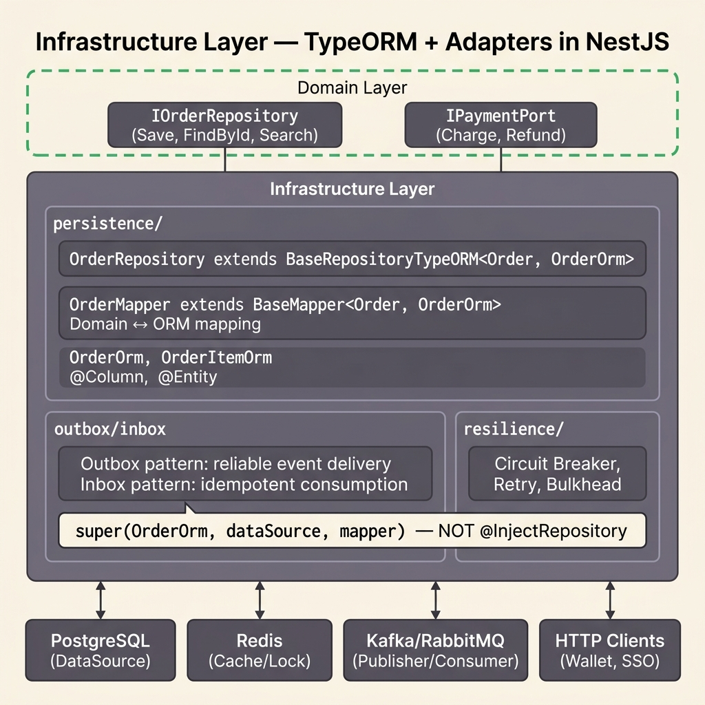

<!-- tags: architecture, clean-architecture, nestjs, typescript, infrastructure -->
# 🔧 Infrastructure Layer — NestJS DDD

> Implementing Domain Port/Interfaces: TypeORM Repository, Mapper, Redis, Outbox/Inbox, HTTP Clients, Resilience

📅 Created: 2026-03-24 · 🔄 Updated: 2026-03-24 · ⏱️ 30 min read

| Aspect | Detail |
|--------|--------|
| **Layer** | Infrastructure (adapter — implements ports) |
| **Dependencies** | Domain (implements interfaces) |
| **Base Classes** | `BaseRepositoryTypeORM<Domain, Orm>`, `BaseMapper<Domain, Orm>` |
| **Framework** | NestJS, TypeORM, Redis, Kafka/RabbitMQ |

---

## 1. DEFINE

### What does the Infrastructure Layer do?

The Infrastructure Layer is where **all technology-specific concerns live** — database, HTTP, message broker, cache. It implements the Port interfaces that the Domain defines.

**Principle**: Infrastructure knows about Domain (implements ports), but Domain knows nothing about Infrastructure.

### Infrastructure Components

| Component | Role | Example |
|-----------|------|---------|
| **Repository impl** | Persist/retrieve Domain entities | `OrderRepository extends BaseRepositoryTypeORM` |
| **ORM Entity** | Database schema definition | `OrderOrm` (has `@Entity`, `@Column`) |
| **Mapper** | Domain ↔ ORM conversion | `OrderMapper extends BaseMapper<Order, OrderOrm>` |
| **HTTP Client** | External API calls | `WalletHttpClient implements WalletPort` |
| **Outbox** | Reliable event delivery | Persist events → poll → publish to Kafka |
| **Inbox** | Idempotent message consuming | Dedup incoming messages |
| **Redis** | Cache, distributed lock, session | `RedisModule`, `RedisManager` |
| **Resilience** | Circuit breaker, retry, timeout | Wrap HTTP/external calls |
| **RabbitMQ/Kafka** | Message publishing/consuming | `RabbitmqPublisher`, `KafkaConsumer` |

### Repository Pattern

```
Domain (Port)           Infrastructure (Impl)
IOrderRepository  ←──  OrderRepository extends BaseRepositoryTypeORM
     │                      │
  findById()            findById():
  save()                   ORM query → toDomain() via Mapper
  findAll()                Domain.save() → toOrm() → TypeORM.save()
```

### Mapper Pattern

```
Domain Entity ←───────────── Mapper ──────────────→ ORM Entity
Order                    OrderMapper                  OrderOrm
  .id                    toDomain(orm)                .id
  .customerId     ←──    .customerId  ──→             .customer_id
  .totalAmount    ←──    Money.create(...)             .total_amount
  .items[]        ←──    items.map(toDomain) ──→      .items (relation)
```

### Failure Modes

| Mistake | Cause | Fix |
|---------|-------|-----|
| `@InjectRepository(OrderOrm)` | NestJS shortcut — bypasses BaseRepository | Use `DataSource` injection |
| `new OrderMapper()` | Missing initialization | Use `OrderMapper.create()` |
| Missing `export` on entity | TS4053 | Export all entities and interfaces |
| `findOneBy()` instead of `findOne()` | Missing relations | Use `findOne({ where: ..., relations: [...] })` |
| Repository does not dispatch events | Missing `dispatchDomainEventsForAggregates` | Call it inside `save()` override |

---

These failure modes sound basic. But there is a trap: using the same TypeORM entity for both domain and persistence locks coupling, and a repository that returns raw DB results breaks the abstraction. That trap will surface in PITFALLS.

## 2. VISUAL



### Infrastructure Layer Structure

```
src/infrastructure/
├── persistence/
│   ├── typeorm/
│   │   └── typeorm.module.ts         ← TypeORM config + DataSource
│   ├── order/
│   │   ├── order.orm.entity.ts       ← @Entity, @Column (database schema)
│   │   ├── order-item.orm.entity.ts
│   │   └── order.repository.ts       ← extends BaseRepositoryTypeORM
│   ├── outbox/
│   │   ├── outbox.orm.entity.ts      ← Events waiting to be published
│   │   └── outbox.repository.ts
│   └── inbox/
│       ├── inbox.orm.entity.ts       ← Dedup incoming messages
│       └── inbox.repository.ts
│
├── http/
│   ├── wallet.http-client.ts         ← implements WalletPort
│   ├── connector.http-client.ts
│   ├── rule.http-client.ts
│   └── sso.http-client.ts
│
├── resilience/
│   ├── circuit-breaker.ts            ← opossum circuit breaker
│   ├── retry.strategy.ts
│   ├── timeout.interceptor.ts
│   └── bulkhead.limiter.ts
│
├── redis/
│   └── redis.module.ts               ← Redis connection config
│
└── rabbitmq/
    ├── rabbitmq.module.ts
    └── rabbitmq-config/
        ├── order.config.ts
        └── user.config.ts

src/shared/
└── mappers/                          ← Mappers shared across modules
    ├── order.mapper.ts               ← extends BaseMapper<Order, OrderOrm>
    ├── order-item.mapper.ts
    ├── agreement.mapper.ts
    └── customer.mapper.ts
```

### Outbox Pattern Flow

```
Application Layer
  │
  ▼ Repository.save(order)
  │
  ▼ BaseRepositoryTypeORM.saveOne()
  │   ├─ TypeORM.save(ormEntity)         ← Persist entity
  │   └─ dispatchDomainEventsForAggregates()
  │       └─ DomainEventDispatcher.dispatch(events)
  │
  ▼ Outbox Table (PostgreSQL)
  │   INSERT INTO outbox_events (event_type, payload, status='PENDING')
  │   (in SAME transaction as entity save — atomicity!)
  │
  ⏰ Outbox Poller (every 5s)
  │   SELECT * FROM outbox_events WHERE status='PENDING'
  │
  ▼ Kafka/RabbitMQ Publisher
  │   publish(event)
  │
  ▼ UPDATE outbox_events SET status='PUBLISHED'
```

### Resilience Stack

```
HTTP Client Call
  │
  ▼ BulkheadLimiter (max concurrent requests)
  │
  ▼ CircuitBreaker (open after N failures)
  │   CLOSED ──(failures > threshold)──▶ OPEN
  │   OPEN ──(timeout elapsed)──────────▶ HALF-OPEN
  │   HALF-OPEN ──(success)────────────▶ CLOSED
  │
  ▼ Timeout (abort after N ms)
  │
  ▼ Retry (exponential backoff)
  │
  ▼ External API Call
```

---

## 3. CODE

### Basic: ORM Entity

The ORM Entity contains the database schema — completely separate from the Domain Entity.

```typescript
// infrastructure/persistence/order/order.orm.entity.ts
// ✅ ORM Entity: TypeORM decorators live here, NOT in the Domain entity

import { Entity, Column, PrimaryColumn, CreateDateColumn, UpdateDateColumn, OneToMany } from 'typeorm';
import { OrderItemOrm } from './order-item.orm.entity';

@Entity('orders')   // ✅ database table name
export class OrderOrm {
    @PrimaryColumn('uuid')
    id: string;

    @Column('uuid', { name: 'customer_id' })
    customerId: string;

    @Column('decimal', { precision: 15, scale: 2, name: 'total_amount' })
    totalAmount: number;

    @Column('varchar', { length: 3 })
    currency: string;

    @Column('varchar', { length: 20, default: 'PENDING' })
    status: string;

    // ✅ Relations mapped by ORM, not Domain
    @OneToMany(() => OrderItemOrm, (item) => item.order, { cascade: true })
    items: OrderItemOrm[];

    @CreateDateColumn({ name: 'created_at' })
    createdAt: Date;

    @UpdateDateColumn({ name: 'updated_at' })
    updatedAt: Date;
}
```

### Basic: Mapper

The Mapper bridges Domain entities and ORM entities.

```typescript
// src/shared/mappers/order.mapper.ts
// ✅ Mapper: separates mapping logic, easy to test, easy to change

import { BaseMapper } from '@ddd/infrastructure';
import { UniqueEntityId } from '@ddd/domain';
import { Order } from '@domain/order/entities/order.entity';
import { OrderOrm } from '@infrastructure/persistence/order/order.orm.entity';
import { OrderItemOrm } from '@infrastructure/persistence/order/order-item.orm.entity';
import { Money } from '@domain/order/value-objects/money.vo';
import { OrderItemMapper } from './order-item.mapper';

export class OrderMapper extends BaseMapper<Order, OrderOrm> {
    private readonly itemMapper: OrderItemMapper;

    // ✅ Do not use constructor directly — use static create()
    private constructor() {
        super();
        this.itemMapper = OrderItemMapper.create();
    }

    static create(): OrderMapper {
        return new OrderMapper();
    }

    // ✅ toDomain: ORM → Domain (reconstitute — does not emit events)
    toDomain(orm: OrderOrm): Order {
        return Order.reconstitute(
            new UniqueEntityId(orm.id),
            {
                customerId: orm.customerId,
                totalAmount: Money.create(Number(orm.totalAmount), orm.currency),
                status: orm.status as any,
                items: orm.items
                    ? orm.items.map(item => this.itemMapper.toDomain(item))
                    : [],
                createdAt: orm.createdAt,
                updatedAt: orm.updatedAt,
            },
        );
    }

    // ✅ toOrm: Domain → ORM (for persistence)
    toOrm(domain: Order): OrderOrm {
        const orm = new OrderOrm();
        orm.id = domain.id.toString();
        orm.customerId = domain.customerId;
        orm.totalAmount = domain.totalAmount.value;
        orm.currency = domain.totalAmount.currency;
        orm.status = domain.status;
        orm.items = domain.items.map(item => this.itemMapper.toOrm(item));
        // ⚠️ createdAt and updatedAt are managed by TypeORM
        return orm;
    }
}
```

The basic repository is covered. But the mapper needs a separate ORM entity — let us map it.

### Intermediate: Repository Implementation

```typescript
// infrastructure/persistence/order/order.repository.ts
import { Injectable } from '@nestjs/common';
import { DataSource } from 'typeorm';

import { BaseRepositoryTypeORM } from '@ddd/infrastructure';
import { IOrderRepository, OrderFilters } from '@domain/order/repositories/order.repository.port';
import { Order } from '@domain/order/entities/order.entity';
import { OrderOrm } from './order.orm.entity';
import { OrderMapper } from '@modules-shared/mappers/order.mapper';
import { PaginatedResult } from '@shared/types';

@Injectable()
export class OrderRepository
    extends BaseRepositoryTypeORM<Order, OrderOrm>
    implements IOrderRepository
{
    constructor(
        // ✅ Inject DataSource (do not use @InjectRepository)
        dataSource: DataSource,
    ) {
        // ✅ Use OrderMapper.create() — not new OrderMapper()
        super(OrderOrm, dataSource, OrderMapper.create());
    }

    async findById(id: string): Promise<Order | null> {
        // ✅ Use explicit findOne() with relations — not findOneBy()
        const orm = await this.repository.findOne({
            where: { id },
            relations: ['items'], // ⚠️ must declare relations to load
        });

        if (!orm) return null;

        // ✅ Mapper toDomain() will reconstitute (no events emitted)
        return this.mapper.toDomain(orm);
    }

    async findAll(
        filters: OrderFilters,
        page: number,
        limit: number,
    ): Promise<PaginatedResult<Order>> {
        const qb = this.repository
            .createQueryBuilder('order')
            .leftJoinAndSelect('order.items', 'items')
            .orderBy('order.createdAt', 'DESC');

        // ✅ Parameterized queries — prevent SQL injection
        if (filters.customerId) {
            qb.andWhere('order.customerId = :customerId', { customerId: filters.customerId });
        }
        if (filters.status) {
            qb.andWhere('order.status = :status', { status: filters.status });
        }
        if (filters.fromDate) {
            qb.andWhere('order.createdAt >= :fromDate', { fromDate: filters.fromDate });
        }

        const [orms, total] = await qb
            .skip((page - 1) * limit)
            .take(limit)
            .getManyAndCount();

        return {
            data: orms.map(orm => this.mapper.toDomain(orm)),
            total,
            page,
            limit,
        };
    }

    // ✅ Override save() to dispatch domain events
    override async save(domain: Order): Promise<Order> {
        const result = await super.saveOne(domain);
        // ✅ Dispatch domain events after successful persist
        await this.dispatchDomainEventsForAggregates(result);
        return result;
    }

    async existsById(id: string): Promise<boolean> {
        return this.repository.existsBy({ id });
    }
}
```

The basic repository is covered. But the mapper needs a separate ORM entity — let us map it.

### Intermediate: HTTP Client with Resilience

```typescript
// infrastructure/http/wallet.http-client.ts
import { Injectable } from '@nestjs/common';
import { HttpService } from '@nestjs/axios';
import { firstValueFrom } from 'rxjs';
import { timeout, retry } from 'rxjs/operators';

import { WalletPort, ChargeRequest, ChargeResult } from '@domain/order/ports/wallet.port';

@Injectable()
export class WalletHttpClient implements WalletPort {
    private readonly circuitBreaker: CircuitBreaker;

    constructor(
        private readonly httpService: HttpService,
        private readonly config: WalletConfig,
    ) {
        // ✅ Circuit breaker wrapping — auto-open after 5 failures
        this.circuitBreaker = new CircuitBreaker(
            this.doCharge.bind(this),
            {
                timeout: 3000,        // Abort if > 3s
                errorThresholdPercentage: 50,  // Open if > 50% fail
                resetTimeout: 30000,  // Try again after 30s
                volumeThreshold: 10,  // Min 10 requests before deciding
            },
        );
    }

    // ✅ Public method with resilience wrapper
    async charge(req: ChargeRequest): Promise<ChargeResult> {
        try {
            return await this.circuitBreaker.fire(req);
        } catch (error) {
            if (error.type === 'CIRCUIT_OPEN') {
                throw new ServiceUnavailableError('Wallet service temporarily unavailable');
            }
            throw new WalletChargeFailedError(error.message);
        }
    }

    // ✅ Actual HTTP call — wrapped by circuit breaker
    private async doCharge(req: ChargeRequest): Promise<ChargeResult> {
        const response = await firstValueFrom(
            this.httpService.post<ChargeResult>(
                `${this.config.baseUrl}/charge`,
                {
                    order_id: req.orderId,
                    amount: req.amount,
                    currency: req.currency,
                },
                {
                    headers: {
                        'Authorization': `Bearer ${this.config.apiKey}`,
                        'Content-Type': 'application/json',
                    },
                    timeout: 3000,
                },
            ).pipe(
                timeout(3000),
                retry({ count: 2, delay: 1000 }), // ✅ Retry 2x with 1s delay
            ),
        );

        return response.data;
    }
}
```

The mapper is covered. But the outbox pattern needs transactional publishing — let us make it atomic.

### Advanced: Outbox Pattern

The Outbox ensures **atomic** entity + event persistence — no events are lost when the service crashes.

```typescript
// infrastructure/persistence/outbox/outbox.orm.entity.ts
import { Entity, Column, PrimaryGeneratedColumn, CreateDateColumn } from 'typeorm';

@Entity('outbox_events')
export class OutboxEventOrm {
    @PrimaryGeneratedColumn('uuid')
    id: string;

    @Column('varchar')
    aggregateId: string;

    @Column('varchar')
    aggregateType: string;  // 'Order', 'Agreement', etc.

    @Column('varchar')
    eventType: string;      // 'OrderCreated', 'OrderPaid', etc.

    @Column('jsonb')
    payload: object;

    @Column('varchar', { default: 'PENDING' })
    status: 'PENDING' | 'PUBLISHED' | 'FAILED';

    @Column('int', { default: 0 })
    retryCount: number;

    @CreateDateColumn()
    createdAt: Date;
}

// ---

// infrastructure/persistence/outbox/outbox.processor.ts
// ✅ Outbox Poller: runs every 5s, publishes pending events
import { Injectable } from '@nestjs/common';
import { Cron, CronExpression } from '@nestjs/schedule';
import { InjectDataSource } from '@nestjs/typeorm';
import { DataSource } from 'typeorm';

@Injectable()
export class OutboxProcessor {
    constructor(
        @InjectDataSource() private readonly dataSource: DataSource,
        private readonly kafkaPublisher: KafkaPublisher,
    ) {}

    @Cron(CronExpression.EVERY_5_SECONDS)
    async processOutbox(): Promise<void> {
        const pendingEvents = await this.dataSource
            .getRepository(OutboxEventOrm)
            .find({
                where: { status: 'PENDING' },
                order: { createdAt: 'ASC' },
                take: 100, // process in batches
            });

        for (const event of pendingEvents) {
            try {
                // ✅ Publish to Kafka
                await this.kafkaPublisher.publish(event.eventType, event.payload);

                // ✅ Mark as published
                await this.dataSource
                    .getRepository(OutboxEventOrm)
                    .update(event.id, { status: 'PUBLISHED' });
            } catch (error) {
                // ✅ Increment retry count — dead letter after N retries
                await this.dataSource.getRepository(OutboxEventOrm).update(event.id, {
                    retryCount: event.retryCount + 1,
                    status: event.retryCount >= 3 ? 'FAILED' : 'PENDING',
                });
            }
        }
    }
}
```

---

You have covered repository, mapper, and outbox. Now comes the dangerous part: dual entity coupling and raw DB leaks — the trap set up from the beginning of this article.

## 4. PITFALLS

| # | Mistake | Fix |
|---|---------|-----|
| 1 | `@InjectRepository(OrderOrm)` in constructor | Use `DataSource` — `super(OrderOrm, dataSource, mapper)` |
| 2 | `new OrderMapper()` instead of `OrderMapper.create()` | Use static factory method |
| 3 | `findOneBy({ id })` missing relations | Use `findOne({ where: { id }, relations: ['items'] })` |
| 4 | Repository does not dispatch domain events | Override `save()` and call `dispatchDomainEventsForAggregates()` |
| 5 | String concatenation in query | Always use parameterized: `.where('x = :val', { val })` |
| 6 | Mapper inside Repository file | Extract to `shared/mappers/` — mappers are reusable |
| 7 | `LibTypeormModule` (typo) | `LibTypeOrmModule` — capital O |
| 8 | HTTP client without circuit breaker | External calls are not resilient — wrap with opossum |
| 9 | Outbox + entity in 2 separate transactions | Must be in the same transaction — atomicity |
| 10 | DI fails due to missing mapper provider | Must declare Mapper in Module providers |

---

You have covered the NestJS Infrastructure Layer and its traps. The resources below help go deeper.

## 5. REF

| Resource | Link |
|----------|------|
| TypeORM Documentation | https://typeorm.io |
| Outbox Pattern | https://microservices.io/patterns/data/transactional-outbox.html |
| Circuit Breaker (opossum) | https://nodeshift.dev/opossum/ |
| Redis (ioredis) | https://github.com/luin/ioredis |
| NestJS Modules | https://docs.nestjs.com/modules |
| Inbox Pattern | https://microservices.io/patterns/data/idempotent-consumer.html |
| Repository Pattern — Fowler | https://martinfowler.com/eaaCatalog/repository.html |

---

## 6. RECOMMEND

| Next step | When | Reason |
|-----------|------|--------|
| Event Store | When using Event Sourcing | Persist events instead of state |
| Read Replicas | When Query load is high | Separate read DB for Query use-cases |
| Database Connection Pool | Production tuning | `max: 20, min: 5` per instance |
| Redis Distributed Lock | Race condition prevention | `SET key value NX PX 30000` — atomic |
| Health Checks | Service monitoring | TypeORM + Redis ping endpoints |

---

← [Application Layer](./03-application-layer.md) · → [Presentation Layer](./05-presentation-layer.md)
