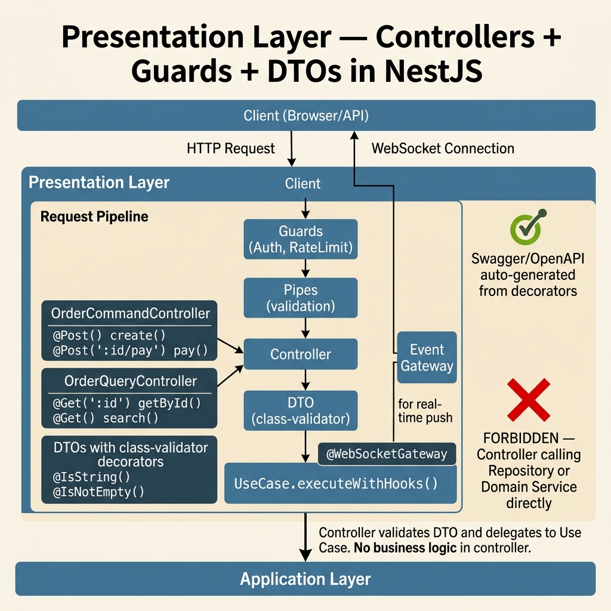

<!-- tags: architecture, clean-architecture, nestjs, typescript, api -->
# 🌐 Presentation Layer — NestJS DDD

> REST Controllers, DTOs (class-validator), Guards, Pipes, Swagger decorators, WebSocket Gateways

📅 Created: 2026-03-24 · 🔄 Updated: 2026-03-24 · ⏱️ 20 min read

| Aspect | Detail |
|--------|--------|
| **Layer** | Presentation (outermost layer) |
| **Dependencies** | Application (calls use-cases) |
| **Framework** | NestJS REST + WebSocket |
| **Validation** | `class-validator` + `class-transformer` |
| **Docs** | Swagger/OpenAPI |

---

## 1. DEFINE

### What does the Presentation Layer do?

The Presentation Layer **communicates with the outside world** — it receives HTTP requests, WebSocket messages, validates input, calls use-cases, and returns properly formatted responses.

**Rule**: Controllers must not contain business logic. A Controller may only:
1. Validate DTO (class-validator handles this automatically)
2. Map DTO → Use Case Request
3. Call `useCase.executeWithHooks(request)`
4. Return the response

### CQRS in Controllers

Controllers are split by Command/Query separation:

| Controller | Calls | HTTP Methods |
|------------|-------|-------------|
| `OrderCommandController` | Command use-cases | `POST`, `PUT`, `PATCH`, `DELETE` |
| `OrderQueryController` | Query use-cases | `GET` |

### Presentation Components

| Component | Role | Example |
|-----------|------|---------|
| **Controller** | REST endpoint, calls use-case | `OrderCommandController` |
| **DTO** | Request/Response shape + validation | `CreateOrderDto`, `OrderResponseDto` |
| **Guard** | Authentication, authorization | `JwtAuthGuard`, `RateLimitGuard` |
| **Pipe** | Transform + validate input | `AppValidationPipe` |
| **Filter** | Exception → HTTP error format | `ExceptionFilter` |
| **Gateway** | WebSocket (real-time push) | `OrderEventGateway` |
| **Subscriber** | Listen to internal events | `OrderCreatedSubscriber` |

### Failure Modes

| Mistake | Cause | Fix |
|---------|-------|-----|
| Controller contains business logic | Unclear layer boundaries | Move into Domain/Application |
| DTO has no validation decorators | Bypasses class-validator | Add `@IsString()`, `@IsNotEmpty()` |
| Controller does not declare return type | Swagger schema is missing | Declare `Promise<XxxResponseDto>` |
| `@Body() body: any` | Bypasses validation | Always use a typed DTO class |

---

These failure modes sound familiar. But there is a trap: a controller with business logic becomes a fat controller, and missing DTO validation lets invalid input reach the use case. That trap will surface in PITFALLS.

## 2. VISUAL



### Presentation Layer Structure

```
src/presentation/portal/
├── order/
│   ├── controllers/
│   │   ├── order-command.controller.ts  ← POST/PUT/DELETE
│   │   └── order-query.controller.ts    ← GET
│   ├── subscribers/
│   │   ├── order-created.subscriber.ts  ← React to domain events
│   │   └── order-paid.subscriber.ts
│   └── dtos/
│       ├── create-order.dto.ts          ← Request DTO (validation)
│       ├── pay-order.dto.ts
│       ├── search-orders.dto.ts
│       └── order-response.dto.ts        ← Response DTO (transformation)
└── product/
    ├── controllers/
    ├── subscribers/
    └── dtos/
```

### Request Lifecycle

```
HTTP Request
  │
  ▼ Middleware (RequestContext: set correlationId, userId)
  │
  ▼ Guard (JwtAuthGuard: verify token, set user on request)
  │
  ▼ Pipe (AppValidationPipe: validate DTO, transform types)
  │
  ▼ Controller.method(dto: CreateOrderDto)
  │   │
  │   ▼ UseCase.executeWithHooks({ customerId, items })
  │       │
  │       ▼ [Application → Domain → Infrastructure]
  │       │
  │       ▼ returns CreateOrderResponse
  │
  ▼ Interceptor (serialize response, logging)
  │
  ▼ HTTP 201 { orderId, totalAmount, status }
```

### Swagger Auto-documentation

```
Controller decorators
  @SwaggerApiTags('Orders')
  @SwaggerApiCreatedResponse({ summary: 'Create order', body: CreateOrderDto })
        │
        ▼ Swagger UI
        POST /orders
        Request Body: CreateOrderDto schema
        Response 201: OrderResponseDto schema
        Auth: Bearer token required
```

---

## 3. CODE

### Basic: Request DTO with Validation

```typescript
// presentation/portal/order/dtos/create-order.dto.ts
// ✅ DTO: defines shape + validates input — no business logic here

import {
    IsString,
    IsNotEmpty,
    IsUUID,
    IsArray,
    ValidateNested,
    IsNumber,
    Min,
    IsPositive,
    MaxLength,
} from 'class-validator';
import { Type } from 'class-transformer';
import { ApiProperty } from '@nestjs/swagger';

export class OrderItemDto {
    @ApiProperty({ description: 'Product ID', example: 'uuid-here' })
    @IsUUID()
    @IsNotEmpty()
    productId: string;

    @ApiProperty({ description: 'Quantity', example: 2, minimum: 1 })
    @IsNumber()
    @Min(1)
    quantity: number;

    @ApiProperty({ description: 'Unit price in VND', example: 150000 })
    @IsNumber()
    @IsPositive()
    unitPrice: number;

    @ApiProperty({ description: 'Currency code', example: 'VND' })
    @IsString()
    @IsNotEmpty()
    @MaxLength(3)
    currency: string;
}

export class ShippingAddressDto {
    @ApiProperty({ example: '123 Nguyen Hue' })
    @IsString()
    @IsNotEmpty()
    @MaxLength(255)
    street: string;

    @ApiProperty({ example: 'Ho Chi Minh City' })
    @IsString()
    @IsNotEmpty()
    city: string;

    @ApiProperty({ example: 'VN' })
    @IsString()
    @IsNotEmpty()
    country: string;
}

export class CreateOrderDto {
    @ApiProperty({ description: 'Customer ID' })
    @IsUUID()
    @IsNotEmpty()
    customerId: string;

    @ApiProperty({ description: 'Order items', type: [OrderItemDto] })
    @IsArray()
    @ValidateNested({ each: true })  // ✅ Validate nested objects
    @Type(() => OrderItemDto)         // ✅ Transform plain object to class
    items: OrderItemDto[];

    @ApiProperty({ description: 'Shipping address' })
    @ValidateNested()
    @Type(() => ShippingAddressDto)
    shippingAddress: ShippingAddressDto;
}
```

### Basic: Response DTO with Static Factory

```typescript
// presentation/portal/order/dtos/order-response.dto.ts
import { ApiProperty } from '@nestjs/swagger';
import { CreateOrderResponse } from '@application/order/use-cases/create-order.use-case';

export class OrderResponseDto {
    @ApiProperty({ example: 'uuid-here' })
    orderId: string;

    @ApiProperty({ example: 300000 })
    totalAmount: number;

    @ApiProperty({ example: 'VND' })
    currency: string;

    @ApiProperty({ example: 'PENDING' })
    status: string;

    @ApiProperty()
    createdAt: Date;

    // ✅ Static factory — maps from use-case response to DTO
    static from(response: CreateOrderResponse): OrderResponseDto {
        const dto = new OrderResponseDto();
        dto.orderId = response.orderId;
        dto.totalAmount = response.totalAmount;
        dto.currency = response.currency;
        dto.status = response.status;
        dto.createdAt = response.createdAt;
        return dto;
    }
}
```

The basic controller is covered. But the DTO pipeline needs validation — let us pipe it.

### Intermediate: CQRS Controller Pattern

```typescript
// presentation/portal/order/controllers/order-command.controller.ts
// ✅ Command Controller: POST, PUT, PATCH, DELETE only

import { Controller, Post, Patch, Body, Param, Headers, HttpCode, HttpStatus } from '@nestjs/common';
import { ApiTags, ApiOperation, ApiCreatedResponse, ApiBearerAuth, ApiHeader } from '@nestjs/swagger';

import { CreateOrderUseCase } from '@application/order/use-cases/create-order.use-case';
import { PayOrderUseCase } from '@application/order/use-cases/pay-order.use-case';
import { CancelOrderUseCase } from '@application/order/use-cases/cancel-order.use-case';
import { CreateOrderDto } from '../dtos/create-order.dto';
import { PayOrderDto } from '../dtos/pay-order.dto';
import { OrderResponseDto } from '../dtos/order-response.dto';

@ApiTags('Orders')
@ApiBearerAuth()
@Controller('orders')
export class OrderCommandController {
    constructor(
        private readonly createOrderUseCase: CreateOrderUseCase,
        private readonly payOrderUseCase: PayOrderUseCase,
        private readonly cancelOrderUseCase: CancelOrderUseCase,
    ) {}

    @Post()
    @HttpCode(HttpStatus.CREATED)
    @ApiOperation({ summary: 'Create a new order' })
    @ApiCreatedResponse({ type: OrderResponseDto })
    // ✅ Explicit return type — required for Swagger + TS4053 prevention
    async create(@Body() dto: CreateOrderDto): Promise<OrderResponseDto> {
        const result = await this.createOrderUseCase.executeWithHooks({
            customerId: dto.customerId,
            items: dto.items,
            shippingAddress: dto.shippingAddress,
        });
        return OrderResponseDto.from(result);
    }

    @Patch(':orderId/pay')
    @HttpCode(HttpStatus.OK)
    @ApiOperation({ summary: 'Pay an order' })
    @ApiHeader({ name: 'X-Idempotency-Key', description: 'Idempotency key', required: true })
    async pay(
        @Param('orderId') orderId: string,
        @Body() dto: PayOrderDto,
        @Headers('X-Idempotency-Key') idempotencyKey: string, // ✅ Header for mutation
    ): Promise<void> {
        await this.payOrderUseCase.executeWithHooks({
            orderId,
            paymentMethodId: dto.paymentMethodId,
            idempotencyKey,
        });
    }
}

// ---

// presentation/portal/order/controllers/order-query.controller.ts
// ✅ Query Controller: GET only

import { Controller, Get, Query, Param } from '@nestjs/common';
import { ApiTags, ApiOperation, ApiOkResponse, ApiBearerAuth } from '@nestjs/swagger';

import { GetOrderUseCase } from '@application/order/use-cases/get-order.use-case';
import { ListOrdersUseCase } from '@application/order/use-cases/list-orders.use-case';
import { SearchOrdersDto } from '../dtos/search-orders.dto';
import { OrderResponseDto } from '../dtos/order-response.dto';
import { PaginatedResponseDto } from '@shared/dto/paginated.response.dto';

@ApiTags('Orders')
@ApiBearerAuth()
@Controller('orders')
export class OrderQueryController {
    constructor(
        private readonly getOrderUseCase: GetOrderUseCase,
        private readonly listOrdersUseCase: ListOrdersUseCase,
    ) {}

    @Get(':orderId')
    @ApiOperation({ summary: 'Get order by ID' })
    @ApiOkResponse({ type: OrderResponseDto })
    async getOne(@Param('orderId') orderId: string): Promise<OrderResponseDto> {
        // ✅ queryWithHooks() for query use-cases
        const result = await this.getOrderUseCase.queryWithHooks({ orderId });
        return OrderResponseDto.from(result);
    }

    @Get()
    @ApiOperation({ summary: 'List orders with filters' })
    async list(@Query() dto: SearchOrdersDto): Promise<PaginatedResponseDto<OrderResponseDto>> {
        const result = await this.listOrdersUseCase.queryWithHooks({
            customerId: dto.customerId,
            status: dto.status,
            page: dto.page ?? 1,
            limit: dto.limit ?? 20,
        });
        return PaginatedResponseDto.from(result, OrderResponseDto.from);
    }
}
```

The DTO pipeline is covered. But the error filter needs a standard response — let us standardize it.

### Advanced: Guard + Subscriber

```typescript
// ✅ JWT Auth Guard — verify token, inject user to request
import { Injectable, CanActivate, ExecutionContext, UnauthorizedException } from '@nestjs/common';
import { JwtService } from '@nestjs/jwt';
import { Request } from 'express';

@Injectable()
export class JwtAuthGuard implements CanActivate {
    constructor(private readonly jwtService: JwtService) {}

    async canActivate(context: ExecutionContext): Promise<boolean> {
        const request = context.switchToHttp().getRequest<Request>();
        const token = this.extractToken(request);

        if (!token) throw new UnauthorizedException('No token provided');

        try {
            const payload = await this.jwtService.verifyAsync(token);
            request['user'] = payload; // ✅ Attach user to request
            return true;
        } catch {
            throw new UnauthorizedException('Invalid token');
        }
    }

    private extractToken(request: Request): string | null {
        const [type, token] = request.headers.authorization?.split(' ') ?? [];
        return type === 'Bearer' ? token : null;
    }
}

// ---

// ✅ Event Subscriber — react to domain events published locally
// presentation/portal/order/subscribers/order-created.subscriber.ts
import { Injectable } from '@nestjs/common';
import { OnEvent } from '@nestjs/event-emitter';
import { OrderCreatedEvent } from '@domain/order/events/order-created.event';

@Injectable()
export class OrderCreatedSubscriber {
    // ✅ Listen to domain event name
    @OnEvent('OrderCreated')
    async handle(event: OrderCreatedEvent): Promise<void> {
        // Send confirmation email, update analytics, etc.
        console.log(`Order created: ${event.orderId} by customer ${event.customerId}`);
    }
}

// ---

// ✅ WebSocket Gateway — push real-time events to client
import { WebSocketGateway, WebSocketServer, SubscribeMessage } from '@nestjs/websockets';
import { Server, Socket } from 'socket.io';
import { OnEvent } from '@nestjs/event-emitter';

@WebSocketGateway({ cors: { origin: '*' }, namespace: '/orders' })
export class OrderEventGateway {
    @WebSocketServer()
    server: Server;

    // ✅ Push update to specific customer's room
    @OnEvent('OrderPaid')
    async handleOrderPaid(event: OrderPaidEvent): Promise<void> {
        this.server.to(`customer:${event.customerId}`).emit('order:paid', {
            orderId: event.orderId,
            paidAt: new Date(),
        });
    }

    @SubscribeMessage('subscribe:orders')
    handleSubscribe(client: Socket, customerId: string): void {
        client.join(`customer:${customerId}`);
    }
}
```

---

You have covered controllers, DTO pipeline, and error filters. Now comes the dangerous part: fat controllers and missing validation — the trap set up from the beginning of this article.

## 4. PITFALLS

| # | Mistake | Fix |
|---|---------|-----|
| 1 | Business logic in Controller | Move into Domain entity or Use Case |
| 2 | `@Body() body: any` | Always use a typed DTO class with validators |
| 3 | Controller does not declare return type | Add `: Promise<OrderResponseDto>` |
| 4 | Command Controller has `GET` methods | Split into a separate QueryController |
| 5 | DTO missing `@Type(() => NestedDto)` | Nested objects will not be validated |
| 6 | No `@ApiProperty()` | Swagger schema will be empty |
| 7 | Guard injects Infrastructure directly | Guard should use service/use-case for auth checks |
| 8 | Mutation endpoint missing idempotency header | Duplicate records on client retry |
| 9 | WebSocket Gateway missing CORS | Frontend cannot connect |
| 10 | Response DTO exposes internal fields | Add `@Exclude()` with class-transformer |

---

You have covered the NestJS Presentation Layer and its traps. The resources below help go deeper.

## 5. REF

| Resource | Link |
|----------|------|
| NestJS Controllers | https://docs.nestjs.com/controllers |
| NestJS Guards | https://docs.nestjs.com/guards |
| class-validator | https://github.com/typestack/class-validator |
| class-transformer | https://github.com/typestack/class-transformer |
| NestJS Swagger | https://docs.nestjs.com/openapi/introduction |
| NestJS WebSockets | https://docs.nestjs.com/websockets/gateways |
| NestJS Event Emitter | https://docs.nestjs.com/techniques/events |

---

## 6. RECOMMEND

| Next step | When | Reason |
|-----------|------|--------|
| Rate Limiting | Public APIs | `@nestjs/throttler` — prevent abuse |
| Request Logging | Production observability | Log correlationId, duration, status |
| Response Caching | GET endpoints with stable data | `@CacheKey()` + Redis |
| Versioning | Breaking API changes | `app.enableVersioning()` — `/v1/orders` |
| GraphQL Resolver | Complex nested queries | Replace Controller when query flexibility matters |

---

← [Infrastructure Layer](./04-infrastructure-layer.md) · → [README](./README.md)
