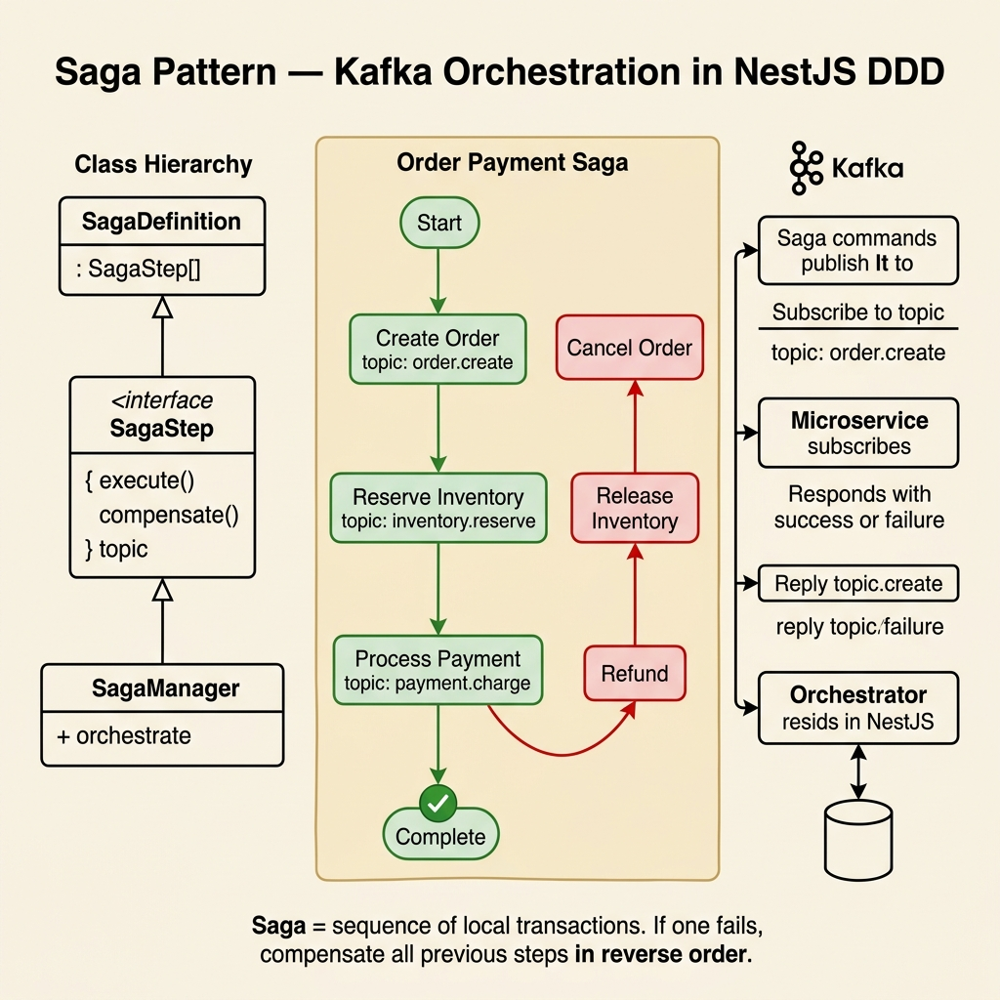

<!-- tags: architecture, clean-architecture, nestjs, typescript, saga-pattern -->
# 🔄 Saga Pattern — Distributed Transactions (NestJS DDD + Kafka)

> Orchestration Saga with `SagaDefinition`, `SagaStep`, `SagaManager` from `libs/src/ddd/saga` — ensuring distributed transactions with automatic compensation via Kafka

📅 Created: 2026-03-24 · 🔄 Updated: 2026-03-24 · ⏱️ 30 min read

| Aspect | Detail |
|--------|--------|
| **Pattern** | Saga Orchestration (not Choreography) |
| **Core libs** | `libs/src/ddd/saga` — `SagaDefinition`, `SagaStep`, `SagaManager` |
| **Transport** | Kafka (command topic → reply topic) |
| **Idempotency** | `idempotencyId` is required on `create` |
| **Reference** | `src/application/order/saga/order-placement.saga.ts` |

---

## 1. DEFINE

### What is a Saga?

A Saga solves the **distributed transaction** problem — when a business operation must ensure data consistency across multiple services without 2-phase commit.

**2 types of Saga:**

| Type | Mechanism | Use when |
|------|-----------|----------|
| **Choreography** | Each service publishes events, others react | Simple flow, few steps |
| **Orchestration** ✅ | A central Orchestrator coordinates all steps | Complex flow, clear rollback needed |

This project uses **Orchestration** — a single `SagaDefinition` controls the entire flow.

### Core Abstractions (`libs/src/ddd/saga`)

| Class/File | Role |
|------------|------|
| `SagaDefinition<TData>` | Abstract class — orchestrator extends it, implements `steps()` |
| `SagaStep.create<TData>('name')` | Builder for each step with `invoke`, `compensate`, `handleReply` |
| `SagaManager` | Start saga (`create`), resume from reply, trigger compensation |
| `KafkaSagaReplyConsumerBase` | Base class for the reply consumer |
| `SagaModule.forKafka(...)` | Register saga into NestJS DI |

### Actors in a Saga

```
Orchestrator (SagaDefinition)
  └─ coordinates steps, decides forward/compensate

Participant (another Service)
  └─ receives command, executes, sends reply with outcome

Reply Consumer
  └─ listens to Kafka reply topic, delegates to SagaManager
```

### Step Types

| Type | Builder method | Description |
|------|---------------|-------------|
| **Local** | `.withLocalInvoke(fn)` | Runs in same service, no Kafka |
| **Remote** | `.invoke(fn)` | Sends command via Kafka to another service |
| **Local Compensation** | `.compensate(fn)` with `{ isLocal: true }` | Rollback locally — no reply needed |
| **Remote Compensation** | `.compensate(fn)` with `{ destination, commandType }` | Rollback via Kafka |

### Reply Outcome Contract

```
reply_outcome = 'SUCCESS'  →  SagaManager advances to next step
reply_outcome = 'FAILURE'  →  SagaManager triggers compensation (reverse order)
```

### Invariants (MANDATORY)

- `idempotencyId` must be provided on `SagaManager.create()`
- Participant must **echo back all** `command_reply_*` headers in the reply
- Every remote step with side-effects must have a `compensate`
- Reply topic format: `${sagaType}-reply`
- Do not hardcode env keys in `libs/` — mapping belongs in `src/infrastructure/**`

---

These failure modes are clear. But there is a trap: compensation without idempotency causes incorrect rollback, and mixing orchestration with choreography makes the flow hard to debug. That trap will surface in PITFALLS.

## 2. VISUAL



### Saga Flow (Happy Path)

```
Use Case
  │ sagaManager.create({ sagaType: 'OrderPlacementSaga', initialData, idempotencyId })
  ▼
SagaManager
  │
  ▼ Step 1: TrackOrder (Local)
  │   withLocalInvoke: persist tracking record
  │
  ▼ Step 2: DecreaseInventory (Remote → Kafka)
  │   publish command to topic: 'inventory-service'
  │   headers: { command_reply_saga_id, command_reply_saga_type, ... }
  │
  │   [Kafka] ──────────────────────────────────────────────────────────────►
  │                                                                Inventory Service
  │                                                                  execute command
  │                                                                  reply_outcome = 'SUCCESS'
  │   [Kafka reply] ◄───────────────────────────────────────────────────────
  │
  ▼ OrderPlacementSagaReplyConsumer.handleReply()
  │   topic: 'OrderPlacementSaga-reply'
  │   delegate to SagaManager.processReply()
  │
  ▼ Step 3: FinalizeOrder (Local)
  │   withLocalInvoke: update order status = CONFIRMED
  │
  ▼ emitCompleted() → saga COMPLETED
```

### Compensation Flow (Failure)

```
...Step 2 fails (reply_outcome = 'FAILURE')...

SagaManager enters compensation mode
  │
  ▼ Compensate Step 2: IncreaseInventory (Remote)
  │   publish to 'inventory-service'
  │   wait reply_outcome = 'SUCCESS'
  │
  ▼ Compensate Step 1: TrackOrder (Local)
  │   { isLocal: true } — delete tracking record
  │
  ▼ emitCompensated() → saga COMPENSATED
```

### Kafka Header Flow (Stateless Routing)

```
Orchestrator publishes command:
  {
    topic: 'inventory-service',
    headers: {
      command_reply_saga_id:      '<uuid>',   ← identify saga instance
      command_reply_saga_type:    'OrderPlacementSaga',
      command_reply_type:         'DecreaseInventoryCommand',
      command_reply_reply_to:     'OrderPlacementSaga-reply',  ← where to reply
      command_reply_destination:  'inventory-service',
      sessionId:                  '<session>',
      metadata:                   '<trace>',
    }
  }

Participant must ECHO all headers in reply:
  {
    topic: headers.command_reply_reply_to,  ← 'OrderPlacementSaga-reply'
    key: headers.command_reply_saga_id,
    headers: {
      ...headers,                           ← ECHO everything
      reply_outcome: 'SUCCESS' | 'FAILURE',
      reply_type: 'InventoryDeducted' | 'InventoryDeductionFailed',
    }
  }
```

### Folder Structure

```
src/application/order/saga/
├── order-placement.saga.ts                     ← Orchestrator (SagaDefinition)
├── order-placement-saga-reply.consumer.ts      ← Reply Consumer (KafkaSagaReplyConsumerBase)
└── order-placement-saga-participant.consumer.ts ← Participant (local test only)

libs/src/ddd/saga/
├── saga-definition.abstract.ts     ← SagaDefinition<TData>
├── saga-step.builder.ts            ← SagaStep.create<TData>()
├── saga-manager.ts                 ← SagaManager
├── saga-message.parser.ts          ← Parse Kafka message
├── kafka-message-publisher.adapter.ts
├── contracts/
│   └── order-placement-saga-reply.contract.ts
└── README.md
```

---

## 3. CODE

### Basic: SagaData Model

```typescript
// application/order/saga/order-placement.saga.ts
// ✅ SagaData: cross-step mutable state — holds all data needed between steps

export interface OrderPlacementSagaData extends Record<string, unknown> {
    // Business fields
    orderId: string;
    customerId: string;
    clientRef: string;         // Idempotency key for order creation

    // Technical fields — populated by handleReply
    inventoryReservationId?: string;   // Set after inventory success
    paymentTransactionId?: string;      // Set after payment success

    // Rollback markers
    inventoryReserved?: boolean;
    paymentCharged?: boolean;

    // Test/Debug
    testScenario?: string;
}
```

### Basic: Orchestrator (SagaDefinition)

```typescript
// application/order/saga/order-placement.saga.ts
import { Injectable, Inject } from '@nestjs/common';
import { SagaDefinition, SagaStep } from '@ddd/saga';   // libs/src/ddd/saga
import { IOrderRepository } from '@domain/order/repositories/order.repository.port';

@Injectable()
export class OrderPlacementSaga extends SagaDefinition<OrderPlacementSagaData> {
    // ✅ sagaType: used as Kafka topic prefix → reply topic = 'OrderPlacementSaga-reply'
    readonly sagaType = 'OrderPlacementSaga';

    constructor(
        @Inject(IOrderRepository)
        private readonly orderRepository: IOrderRepository,
    ) {
        super();
    }

    // ✅ steps() — execution order: 1 Local tracking → N Remote commands → 1 Local finalize
    steps() {
        return [
            // ─────────────────────────────────────
            // Step 1: Local — Track order (create tracking record)
            // ─────────────────────────────────────
            SagaStep.create<OrderPlacementSagaData>('TrackOrder')
                .withLocalInvoke(async (data) => {
                    // ✅ Local invoke: runs in this service
                    console.log(`[Saga] TrackOrder: orderId=${data.orderId}`);
                    return data; // pass data to next step
                })
                .compensate(async (data) => {
                    // ✅ Local compensation: delete order on rollback
                    await this.orderRepository.delete(data.orderId);
                    return { command: null, isLocal: true }; // ✅ isLocal: no Kafka reply needed
                })
                .build(),

            // ─────────────────────────────────────
            // Step 2: Remote — Decrease inventory (send Kafka command)
            // ─────────────────────────────────────
            SagaStep.create<OrderPlacementSagaData>('DecreaseInventory')
                .invoke(async (data) => ({
                    destination: 'inventory-service',           // Kafka topic
                    commandType: 'DecreaseInventoryCommand',    // Command type for participant
                    payload: {
                        orderId: data.orderId,
                        items: data.items,
                        scenario: data.testScenario,            // Debug only
                    },
                }))
                .handleReply(async (data, replyPayload) => {
                    // ✅ Merge reply data into saga state
                    return {
                        ...data,
                        inventoryReservationId: replyPayload?.reservationId,
                        inventoryReserved: true,
                    };
                })
                .compensate(async (data) => ({
                    // ✅ Remote compensation: reverse the inventory deduction
                    destination: 'inventory-service',
                    commandType: 'IncreaseInventoryCommand',
                    payload: {
                        orderId: data.orderId,
                        reservationId: data.inventoryReservationId,
                    },
                }))
                .build(),

            // ─────────────────────────────────────
            // Step 3: Remote — Charge payment
            // ─────────────────────────────────────
            SagaStep.create<OrderPlacementSagaData>('ChargePayment')
                .invoke(async (data) => ({
                    destination: 'payment-service',
                    commandType: 'ChargePaymentCommand',
                    payload: {
                        orderId: data.orderId,
                        amount: data.totalAmount,
                        currency: data.currency,
                        paymentMethodId: data.paymentMethodId,
                    },
                }))
                .handleReply(async (data, replyPayload) => ({
                    ...data,
                    paymentTransactionId: replyPayload?.transactionId,
                    paymentCharged: true,
                }))
                .compensate(async (data) => ({
                    destination: 'payment-service',
                    commandType: 'RefundPaymentCommand',
                    payload: {
                        orderId: data.orderId,
                        transactionId: data.paymentTransactionId,
                    },
                }))
                .build(),

            // ─────────────────────────────────────
            // Step 4: Local — Finalize order
            // ─────────────────────────────────────
            SagaStep.create<OrderPlacementSagaData>('FinalizeOrder')
                .withLocalInvoke(async (data) => {
                    const order = await this.orderRepository.findById(data.orderId);
                    if (order) {
                        order.confirm(); // Domain method
                        await this.orderRepository.save(order);
                    }
                    return data;
                })
                // ✅ No compensation needed for finalize — order is already confirmed
                .build(),
        ];
    }

    // ✅ Lifecycle hooks — log and publish events
    async emitCompleted(data: OrderPlacementSagaData): Promise<void> {
        console.log(`[Saga] COMPLETED: orderId=${data.orderId}, clientRef=${data.clientRef}`);
        // Optionally publish OrderFulfilledEvent
    }

    async emitCompensated(data: OrderPlacementSagaData): Promise<void> {
        console.log(`[Saga] COMPENSATED: orderId=${data.orderId}, reason=see logs`);
        // Optionally publish OrderFailedEvent
    }
}
```

The basic saga is covered. But compensation needs rollback — let us reverse.

### Intermediate: Starting a Saga from a Use Case

```typescript
// application/order/use-cases/create-order.use-case.ts
import { Injectable, Inject } from '@nestjs/common';
import { BaseCommand } from '@ddd/application';
import { SagaManager } from '@ddd/saga';
import { IOrderRepository } from '@domain/order/repositories/order.repository.port';
import { Order } from '@domain/order/entities/order.entity';
import { OrderPlacementSagaData } from '../saga/order-placement.saga';

export interface CreateOrderRequest {
    clientRef: string;     // ✅ Idempotency key — unique per business operation
    customerId: string;
    items: Array<{ productId: string; quantity: number; price: number; currency: string }>;
    paymentMethodId: string;
    shippingAddress: { street: string; city: string; country: string };
}

@Injectable()
export class CreateOrderUseCase extends BaseCommand<CreateOrderRequest, { orderId: string }> {
    constructor(
        @Inject(IOrderRepository) private readonly orderRepo: IOrderRepository,
        private readonly sagaManager: SagaManager,
    ) {
        super();
    }

    async execute(req: CreateOrderRequest): Promise<{ orderId: string }> {
        // 1. ✅ Idempotency pre-check — prevent duplicate saga
        const existingSaga = await this.sagaManager.findByIdempotency(req.clientRef);
        if (existingSaga) {
            return { orderId: existingSaga.data.orderId as string };
        }

        // 2. Create domain aggregate
        const order = Order.create({
            customerId: req.customerId,
            items: req.items,
            shippingAddress: req.shippingAddress,
        });

        // 3. Persist order (status = PENDING)
        const savedOrder = await this.orderRepo.save(order);

        // 4. ✅ Start saga orchestration
        await this.sagaManager.create<OrderPlacementSagaData>({
            sagaType: 'OrderPlacementSaga',

            // ✅ idempotencyId: stable business key (clientRef from client)
            idempotencyId: req.clientRef,

            initialData: {
                orderId: savedOrder.id.toString(),
                customerId: req.customerId,
                clientRef: req.clientRef,
                items: req.items,
                totalAmount: savedOrder.totalAmount.value,
                currency: savedOrder.totalAmount.currency,
                paymentMethodId: req.paymentMethodId,
            },
        });

        return { orderId: savedOrder.id.toString() };
        // ⚠️ Returns EARLY — saga continues async via Kafka
    }
}
```

The basic saga is covered. But compensation needs rollback — let us reverse.

### Intermediate: Reply Consumer

```typescript
// application/order/saga/order-placement-saga-reply.consumer.ts
// ✅ Reply Consumer: listens to Kafka reply topic, delegates to SagaManager

import { Controller } from '@nestjs/common';
import { Payload, Ctx, KafkaContext } from '@nestjs/microservices';
import { KafkaSagaReplyConsumerBase } from '@ddd/saga';
import { SubscribeEventPattern } from '@common/decorators';

@Controller()
export class OrderPlacementSagaReplyConsumer extends KafkaSagaReplyConsumerBase {
    // ✅ Topic = sagaType + '-reply' (convention)
    @SubscribeEventPattern('OrderPlacementSaga-reply')
    async handleReply(
        @Payload() value: unknown,
        @Ctx() context: KafkaContext,
    ): Promise<void> {
        // ✅ Fully delegates to base class
        // Base class: parse headers → find saga → forward/compensate
        await this.processKafkaMessage(value, context);
    }
}
```

Compensation is covered. But persistent saga needs an event store — let us persist.

### Advanced: Participant Consumer (Another Service)

The Participant is a service that receives a command, executes it, and **MUST echo back all headers** in the reply.

```typescript
// application/order/saga/order-placement-saga-participant.consumer.ts
// (In production: lives in inventory-service / payment-service)
// (In monorepo: used for local testing)

import { Controller } from '@nestjs/common';
import { Payload, Ctx, KafkaContext } from '@nestjs/microservices';
import { KafkaService } from '@core/kafka';
import { SagaMessageParser } from '@ddd/saga';
import { SubscribeEventPattern } from '@common/decorators';

@Controller()
export class OrderPlacementSagaParticipantConsumer {
    constructor(private readonly kafkaService: KafkaService) {}

    @SubscribeEventPattern('inventory-service')
    async handleInventoryCommand(
        @Payload() value: unknown,
        @Ctx() context: KafkaContext,
    ): Promise<void> {
        const envelope = SagaMessageParser.parse(value);
        const headers = this.extractSagaHeaders(context); // command_reply_* headers

        // ⚠️ Validate: must have all required headers
        if (!headers.command_reply_saga_id || !headers.command_reply_reply_to) {
            console.warn('[Participant] Missing required saga headers — skip');
            return; // ✅ Do not publish an invalid reply
        }

        let outcome: 'SUCCESS' | 'FAILURE' = 'SUCCESS';
        let replyType: string = 'InventoryDeducted';
        let replyData: object = {};

        try {
            // Execute the actual side effect
            if (envelope.commandType === 'DecreaseInventoryCommand') {
                // ✅ Test scenario support
                if (envelope.payload?.scenario === 'CASE_3') {
                    throw new Error('Inventory insufficient');
                }
                const reservationId = await this.decreaseInventory(envelope.payload);
                replyData = { reservationId };
            } else if (envelope.commandType === 'IncreaseInventoryCommand') {
                await this.increaseInventory(envelope.payload);
                replyType = 'InventoryRestored';
            }
        } catch (error) {
            outcome = 'FAILURE';
            replyType = 'InventoryDeductionFailed';
        }

        // ✅ Publish reply: echo headers + outcome
        await this.kafkaService.publish({
            topic: headers.command_reply_reply_to,  // ← reply to saga's inbox
            key: headers.command_reply_saga_id,
            headers: {
                // ✅ MUST echo all command_reply_* headers
                ...headers,
                reply_outcome: outcome,
                reply_type: replyType,
            },
            message: { data: replyData },
        });
    }

    private extractSagaHeaders(context: KafkaContext) {
        const kafkaHeaders = context.getMessage().headers ?? {};
        return {
            command_reply_saga_id:      kafkaHeaders['command_reply_saga_id']?.toString(),
            command_reply_saga_type:    kafkaHeaders['command_reply_saga_type']?.toString(),
            command_reply_type:         kafkaHeaders['command_reply_type']?.toString(),
            command_reply_reply_to:     kafkaHeaders['command_reply_reply_to']?.toString(),
            command_reply_destination:  kafkaHeaders['command_reply_destination']?.toString(),
            sessionId:                  kafkaHeaders['sessionId']?.toString(),
            metadata:                   kafkaHeaders['metadata']?.toString(),
        };
    }

    private async decreaseInventory(payload: any): Promise<string> {
        // Actual inventory logic here
        return `reservation-${Date.now()}`;
    }

    private async increaseInventory(payload: any): Promise<void> {
        // Rollback inventory here
    }
}
```

Compensation is covered. But persistent saga needs an event store — let us persist.

### Advanced: SagaModule Registration

```typescript
// infrastructure/modules/order/order-infrastructure.module.ts
import { Module } from '@nestjs/common';
import { SagaModule } from '@ddd/saga';

import { OrderPlacementSaga } from '@application/order/saga/order-placement.saga';
import { OrderPlacementSagaReplyConsumer } from '@application/order/saga/order-placement-saga-reply.consumer';
import { OrderPlacementSagaParticipantConsumer } from '@application/order/saga/order-placement-saga-participant.consumer';
import { OrderRepository } from '../persistence/order.repository';
import { OrderMapper } from '@modules-shared/mappers/order.mapper';
import { IOrderRepository } from '@domain/order/repositories/order.repository.port';

@Module({
    imports: [
        // ✅ Register saga with Kafka config
        SagaModule.forKafkaAsync({
            sagas: [OrderPlacementSaga],
            useFactory: (configService: ConfigService) => ({
                kafkaBrokers: configService.get('KAFKA_BROKERS').split(','),
                clientId: configService.get('KAFKA_CLIENT_ID'),
                groupId: configService.get('KAFKA_GROUP_ID'),
            }),
            inject: [ConfigService],
        }),
    ],
    providers: [
        OrderMapper,
        { provide: IOrderRepository, useClass: OrderRepository },
        OrderPlacementSagaReplyConsumer,
        OrderPlacementSagaParticipantConsumer,
    ],
    exports: [SagaModule],
})
export class OrderInfrastructureModule {}
```

---

You have covered saga, compensation, and persistent state. Now comes the dangerous part: non-idempotent rollback and mixed orchestration — the trap set up from the beginning of this article.

## 4. PITFALLS

| # | Mistake | Fix |
|---|---------|-----|
| 1 | Participant does not echo `command_reply_*` headers | SagaManager cannot route reply — saga stuck forever |
| 2 | `reply_outcome` has wrong value | Must be `'SUCCESS'` or `'FAILURE'` (exact string) |
| 3 | Reply topic has wrong format | Must be `${sagaType}-reply` — do not invent names |
| 4 | Missing `idempotencyId` on `create()` | Duplicate saga when Use Case retries |
| 5 | Remote step missing `compensate` | Data inconsistency on later step failure |
| 6 | `compensate` returns `void` | Must return `{ command: null, isLocal: true }` for local or `{ destination, commandType }` for remote |
| 7 | `isLocal: false` for local compensation | Saga waits for a Kafka reply that never arrives |
| 8 | Participant silently ignores missing headers | Invalid reply causes hard error in SagaManager |
| 9 | Hardcoding Kafka broker in `libs/` | `libs/src/ddd/saga` must not know env keys — mapping belongs in `src/infrastructure/**` |
| 10 | `SagaManager` injected directly into Domain Layer | SagaManager belongs to Application layer — do not import into Domain |

---

You have covered the NestJS Saga Pattern and its traps. The resources below help go deeper.

## 5. REF

| Resource | Link |
|----------|------|
| Saga Pattern | https://microservices.io/patterns/data/saga.html |
| Saga Orchestration vs Choreography | https://microservices.io/post/microservices/2019/07/09/developing-sagas-e-book.html |
| libs source of truth | `libs/src/ddd/saga/saga-definition.abstract.ts` |
| Reference orchestrator | `src/application/order/saga/order-placement.saga.ts` |
| Reference reply consumer | `src/application/order/saga/order-placement-saga-reply.consumer.ts` |
| Saga README | `libs/src/ddd/saga/README.md` |

---

## 6. RECOMMEND

| Next step | When | Reason |
|-----------|------|--------|
| Saga State Persistence | Production | Persist saga state — resume after restart |
| Dead Letter Queue | Failed compensations | Saga COMPENSATED failed → manual intervention |
| Saga Timeout | Stuck sagas | Kill saga if no reply after N minutes |
| Saga Monitoring | Observability | Dashboard: PENDING/COMPLETED/COMPENSATED counts |
| Idempotent Participants | Kafka retry | Participant must be safe on duplicate commands |

---

## 🃏 Quick Reference

```
Start saga:
  sagaManager.create({ sagaType, idempotencyId: clientRef, initialData })

Orchestrator:
  class MySaga extends SagaDefinition<TData> {
    readonly sagaType = 'MySaga';
    steps() { return [...] }
  }

Local step:
  SagaStep.create<T>('Name').withLocalInvoke(fn).compensate(fn).build()

Remote step:
  SagaStep.create<T>('Name')
    .invoke(data => ({ destination, commandType, payload }))
    .handleReply((data, reply) => ({ ...data, ...reply }))
    .compensate(data => ({ destination, commandType, payload }))
    .build()

Reply topic:   ${sagaType}-reply
Reply outcome: 'SUCCESS' | 'FAILURE'
Headers echo:  command_reply_saga_id, command_reply_saga_type,
               command_reply_type, command_reply_reply_to,
               command_reply_destination, sessionId, metadata
```

## 🔍 Debug Checklist

| # | Check | How |
|---|-------|-----|
| 1 | Saga does not advance to next step | Verify participant echoes all headers |
| 2 | Saga does not compensate | Verify `reply_outcome = 'FAILURE'` is correct |
| 3 | Duplicate saga | Verify `findByIdempotency(clientRef)` before `create()` |
| 4 | Reply consumer not receiving | Verify topic name = `${sagaType}-reply` |
| 5 | Compensation does not run | Verify `compensate()` is defined, verify `isLocal` is correct |
| 6 | DI error on start | Verify `SagaModule.forKafka()` is in imports |

## 🎯 Interview Angle

**Q: Why use Orchestration Saga instead of Choreography?**

> Orchestration has a single central point (`SagaDefinition`) that controls the entire flow — easy to debug, easy to track state, and compensation logic follows a clear reverse order. Choreography fits simple flows, but when N services participate with many conditions, tracing becomes very difficult.

**Q: How does the Saga ensure idempotency?**

> `idempotencyId` is required on `SagaManager.create()`. SagaManager checks `findByIdempotency` before creating a new saga — if one already exists, it returns the existing instance. Participants should also implement their own idempotency (check for duplicate `orderId` before executing side-effects).

**Q: How do you handle a stuck Saga (no reply)?**

> A Saga Timeout mechanism is needed — monitor PENDING sagas, and if no reply arrives after N minutes, trigger compensation. Typically a cron job checks the DB and forces compensation. A Dead Letter Queue handles replies that fail to parse.

---

← [Application Layer](./03-application-layer.md) · → [README](./README.md)
