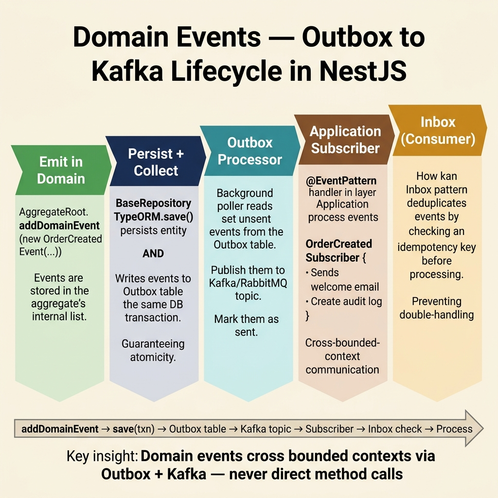

<!-- tags: architecture, clean-architecture, nestjs, typescript, ddd, domain-events -->
# 📡 Domain Events — NestJS DDD

> Vòng đời thực tế của Domain Event: `addDomainEvent()` → `DomainEventDispatcher` → `KafkaEventBus` → Consumer

📅 Ngày tạo: 2026-03-24 · 🔄 Cập nhật: 2026-03-24 · ⏱️ 20 phút đọc

| Aspect | Detail |
|--------|--------|
| **Base Class** | `BaseDomainEvents<T>` (`libs/src/ddd/domain/domain-event.base.ts`) |
| **Dispatcher** | `DomainEventDispatcher` (static, singleton) |
| **Publisher** | `DomainEventPublisherEventBusService` → `KafkaEventBus` |
| **Module** | `LibDDDModule` (Global) — inject vào `AppModule` một lần |
| **Topic** | Default: `EventBusKafka.DOMAIN_EVENTS` · Per-event: `EVENT_TOPIC_MAP` |

---

## 1. DEFINE

### Domain Event là gì?

Domain Event là **bản ghi bất biến** của sự kiện đã xảy ra trong domain — tên đặt theo ngôn ngữ nghiệp vụ, past tense:

> `OrderCreatedEvent`, `OrderPaidEvent` — KHÔNG phải `CreateOrderCommand`

### Pipeline thực tế (libs/src/ddd)

```
aggregate.addDomainEvent(event)
    │
    ▼ DomainEventDispatcher.markAggregateForDispatch(aggregate)
    │   (aggregate được đánh dấu vào markedAggregates Map)
    │
repository.dispatchDomainEventsForAggregates(aggregate)   ← manual call sau save
    │
    ▼ aggregate.dispatchEventsForAggregate()
    │
    ▼ DomainEventDispatcher.dispatchEventsForAggregate()
    │   → DomainEventPublisherService.emitAllEvent(events)
    │
    ▼ DomainEventPublisherEventBusService   ← default trong LibDDDModule
    │
    ▼ KafkaEventBus.publishAll(events)
    │   → wrap thành DomainEventEnvelope
    │   → KafkaService.publish({ topic, message, key, headers })
    │
    ▼ Kafka topic: EventBusKafka.DOMAIN_EVENTS
        (hoặc per-event topic từ EVENT_TOPIC_MAP)
```

### Ba implementation của DomainEventPublisherService

| Class | Cơ chế | Dùng khi |
|-------|--------|---------|
| `DomainEventPublisherServiceImpl` | EventEmitter2 only (in-process) | Monolith, dev/test |
| `DomainEventPublisherHybridService` | EventEmitter2 + Kafka | Transition period |
| **`DomainEventPublisherEventBusService`** | **Kafka only (IEventBus)** | **Production default** |

`LibDDDModule` hiện wire `DomainEventPublisherEventBusService` — events đi thẳng Kafka, không qua EventEmitter2.

---

Các failure mode trên nghe dễ tránh. Nhưng có trap: event publish ngoài transaction = dual-write, và handler side-effect không idempotent = duplicate action. Trap đó sẽ xuất hiện ở PITFALLS.

## 2. VISUAL



### Folder Structure

```
libs/src/ddd/
├── domain/
│   ├── domain-event.base.ts          ← BaseDomainEvents<T>
│   ├── domain-event-dispatcher.ts    ← DomainEventDispatcher (static)
│   └── base-aggregate-root.ts        ← addDomainEvent(), dispatchEventsForAggregate()
├── infrastructure/
│   ├── domain-event-publisher.service.ts          ← EventEmitter2 only
│   ├── domain-event-publisher-hybrid.service.ts   ← EventEmitter2 + Kafka
│   └── domain-event-publisher-event-bus.service.ts ← Kafka only (default)
├── event-bus/
│   ├── kafka-event-bus.ts             ← KafkaEventBus (IEventBus impl)
│   ├── domain-event-kafka.consumer.ts ← consume từ Kafka → dispatch local
│   └── event-bus.module.ts
├── interfaces/
│   ├── domain-event.interface.ts      ← IBaseDomainEvent, DomainEventPublisherService
│   └── event-bus.interface.ts         ← IEventBus
└── ddd.module.ts                      ← LibDDDModule (Global)

src/domain/order/events/
├── order-created.event.ts
├── order-paid.event.ts
└── order-cancelled.event.ts
```

### Complete Flow Diagram

```
┌──── DOMAIN ───────────────────────────────────┐
│  Order.pay()                                  │
│    └─ addDomainEvent(new OrderPaidEvent(...)) │
│         └─ DomainEventDispatcher.mark(this)  │
└───────────────────────────────────────────────┘
                     │
                     ▼ orderRepo.save(order)
┌──── INFRASTRUCTURE (Repository) ──────────────┐
│  TypeORM INSERT/UPDATE                        │
│  ↓ dispatchDomainEventsForAggregates(result)  │  ← manual, gọi sau save
│    └─ aggregate.dispatchEventsForAggregate()  │
│         └─ DomainEventDispatcher.dispatch()   │
│              └─ PublisherService.emitAll()    │
└───────────────────────────────────────────────┘
                     │
                     ▼
┌──── EVENT BUS (KafkaEventBus) ─────────────────┐
│  wrap → DomainEventEnvelope                   │
│  topic = EVENT_TOPIC_MAP[eventName]           │
│       ?? 'EventBusKafka.DOMAIN_EVENTS'        │
│  KafkaService.publish(topic, envelope)        │
└───────────────────────────────────────────────┘
                     │
           ┌─────────┴──────────┐
           ▼                    ▼
  [Same service]         [Other services]
  DomainEventKafka       Kafka Consumer
  Consumer               (payment-svc, etc.)
    └─ KafkaEventBus
       .dispatchReceivedEvent()
       └─ local handlers
          (eventBus.subscribe())
```

---

## 3. CODE

### Step 1 — Domain Event Class

Real `BaseDomainEvents<T>` API: constructor nhận `(aggregateId, props?)` — **KHÔNG phải individual fields**.

```typescript
// domain/order/events/order-paid.event.ts
import { BaseDomainEvents } from '@ddd/domain';
import { IUniqueEntityID } from '@ddd/interfaces';

// ✅ Định nghĩa props type riêng
export interface OrderPaidProps {
    customerId: string;
    amount: number;
    currency: string;
    paidAt: Date;
}

// ✅ Extends BaseDomainEvents<Props> — eventName tự lấy từ constructor.name
export class OrderPaidEvent extends BaseDomainEvents<OrderPaidProps> {
    constructor(aggregateId: IUniqueEntityID, props: OrderPaidProps) {
        super(aggregateId, props);
    }

    // ✅ KHÔNG cần override eventName — tự là 'OrderPaidEvent'
    // get eventName() { return this.constructor.name } ← base đã làm rồi

    // ✅ Nếu cần static factory (tùy chọn)
    static from(aggregateId: IUniqueEntityID, props: OrderPaidProps): OrderPaidEvent {
        return new OrderPaidEvent(aggregateId, props);
    }
}

// Truy cập props:
// event.props.customerId
// event.props.amount
// event.aggregateId.toValue()
// event.eventName  → 'OrderPaidEvent'
// event.eventId    → uuidv7 string
// event.occurredAt → Date
```

### Step 2 — Emit từ Aggregate

```typescript
// domain/order/entities/order.entity.ts
import { BaseAggregateRoot } from '@ddd/domain';
import { OrderPaidEvent } from '../events/order-paid.event';

export class Order extends BaseAggregateRoot<OrderProps> {

    pay(): void {
        if (this.props.status !== 'PENDING') {
            throw new InvalidOrderStatusError(this.props.status);
        }
        this.props.status = 'PAID';
        this.props.paidAt = new Date();

        // ✅ addDomainEvent() = queue event + mark aggregate for dispatch
        // Event CHƯA được publish ở đây — chờ Repository.save()
        this.addDomainEvent(new OrderPaidEvent(this.id, {
            customerId: this.props.customerId,
            amount: this.props.totalAmount.value,
            currency: this.props.totalAmount.currency,
            paidAt: this.props.paidAt,
        }));
    }
}
```

> ⚠️ **`reconstitute()`** — KHÔNG gọi `addDomainEvent()`. Chỉ rebuild state từ DB, không phát sinh event mới.

Event emit từ aggregate đã cover. Nhưng repository dispatch cần manual wiring — hãy connect.

### Step 3 — Repository Dispatch (Manual)

`BaseRepositoryTypeORM.save()` **không** tự dispatch events. Subclass phải gọi `dispatchDomainEventsForAggregates()` sau save:

```typescript
// infrastructure/persistence/order/order.repository.ts
import { BaseRepositoryTypeORM } from '@ddd/infrastructure';

export class OrderRepository extends BaseRepositoryTypeORM<Order, OrderOrm>
    implements IOrderRepository {

    constructor(dataSource: DataSource) {
        super(OrderOrm, dataSource, OrderMapper.create());
    }

    // ✅ Override save() để dispatch events sau persist thành công
    override async save(domain: Order): Promise<Order> {
        // 1. TypeORM persist
        const result = await super.saveOne(domain);

        // 2. Dispatch domain events
        //    → aggregate.dispatchEventsForAggregate()
        //    → DomainEventDispatcher → PublisherService → KafkaEventBus
        await this.dispatchDomainEventsForAggregates(result);

        return result;
    }
}
```

### Step 4 — Consume từ Kafka (Same Service)

Khi service nhận lại event từ Kafka topic (`DomainEventKafkaConsumer`), nó dispatch đến các handler đã đăng ký qua `eventBus.subscribe()`:

```typescript
// Đăng ký handler trong module init hoặc service constructor
import { IEventBus } from '@ddd/interfaces';
import { OrderPaidEvent } from '@domain/order/events/order-paid.event';

@Injectable()
export class OrderReadModelProjection implements OnModuleInit {
    constructor(
        @Inject(IEventBus)
        private readonly eventBus: IEventBus,
    ) {}

    onModuleInit(): void {
        // ✅ Subscribe by eventName (class name)
        this.eventBus.subscribe(
            OrderPaidEvent.name,           // 'OrderPaidEvent'
            this.onOrderPaid.bind(this),
        );
    }

    private async onOrderPaid(event: IBaseDomainEvent): Promise<void> {
        const props = event.props as OrderPaidProps;
        await this.readModelService.markOrderAsPaid(
            event.aggregateId.toValue(),
            props.paidAt,
        );
    }
}
```

> **Lưu ý**: `DomainEventKafkaConsumer` (trong `EventBusModule`) consume từ Kafka topic `EventBusKafka.DOMAIN_EVENTS` và gọi `kafkaEventBus.dispatchReceivedEvent(envelope)` → route đến handlers đã `subscribe()`.

### Step 5 — Per-Event Topic Routing

Mặc định, mọi domain event đi vào `EventBusKafka.DOMAIN_EVENTS`. Để route một event sang dedicated topic:

```typescript
// event-bus/kafka-event-bus.ts — EVENT_TOPIC_MAP
export const EVENT_TOPIC_MAP: Record<string, string> = {
    OrderCreatedEvent: 'EventBusKafka.ORDER_CREATED',
    // Thêm event cần dedicated topic:
    // OrderPaidEvent: 'EventBusKafka.ORDER_PAID',
};

// KafkaEventBus.publish() tự lookup:
// topic = EVENT_TOPIC_MAP[event.eventName] ?? DOMAIN_EVENTS_TOPIC
```

### Step 6 — Module Setup

```typescript
// app.module.ts
import { LibDDDModule } from '@ddd';    // Global module

@Module({
    imports: [
        LibDDDModule,    // ✅ Import một lần — Global, available toàn app
        OrderModule,
        // ...
    ],
})
export class AppModule {}

// order.module.ts
@Module({
    providers: [
        OrderMapper,
        { provide: IOrderRepository, useClass: OrderRepository },
        CreateOrderUseCase,
        PayOrderUseCase,
        OrderReadModelProjection,   // ✅ Register subscriber
    ],
})
export class OrderModule {}
```

---

## 4. CHỌN PUBLISHER PHÙ HỢP

| Scenario | Publisher | Config trong LibDDDModule |
|----------|-----------|--------------------------|
| **Production microservices** | `DomainEventPublisherEventBusService` | Default ✅ |
| **Monolith + local handlers** | `DomainEventPublisherServiceImpl` | Swap `useClass` |
| **Migration period** | `DomainEventPublisherHybridService` | Dùng tạm |

```typescript
// Swap publisher trong LibDDDModule nếu cần:
{
    provide: DomainEventPublisherService,
    useClass: DomainEventPublisherHybridService,   // vừa EventEmitter2 vừa Kafka
}
```

---

Bạn đã đi qua domain events và publisher selection. Bây giờ đến phần nguy hiểm: dual-write và non-idempotent handlers — trap đã được setup từ đầu bài.

## 5. PITFALLS

| # | Lỗi | Fix |
|---|-----|-----|
| 1 | `BaseDomainEvents` constructor nhận individual fields | Constructor thực là `(aggregateId, props: T)` — dùng typed props object |
| 2 | Override `get eventName()` | Không cần — base tự lấy `this.constructor.name` |
| 3 | Không gọi `dispatchDomainEventsForAggregates()` sau save | Events mất — base `save()` không auto-dispatch, phải override |
| 4 | Gọi `addDomainEvent()` trong `reconstitute()` | Spurious events khi load từ DB — chỉ emit trong state-changing methods |
| 5 | Dùng `@OnEvent()` với EventEmitter2 khi LibDDDModule là Kafka-only | Handlers không được gọi — dùng `eventBus.subscribe()` thay thế |
| 6 | Không register subscriber trong Module providers | NestJS không quản lý lifecycle — `onModuleInit` không được gọi |
| 7 | Event payload chứa quá nhiều data | Chỉ gửi IDs — consumer tự query DB nếu cần thêm thông tin |
| 8 | `LibDDDModule` import nhiều lần | Là `@Global()` — chỉ import một lần ở `AppModule` |
| 9 | Không có idempotency ở consumer | Kafka at-least-once → consumer phải idempotent với `eventId` |
| 10 | Topic mapping sai | Kiểm tra `EVENT_TOPIC_MAP` trong `kafka-event-bus.ts` — mặc định dùng `DOMAIN_EVENTS_TOPIC` |

---

Bạn đã đi qua NestJS Domain Events và cạm bẫy. Các resources dưới đây giúp đi sâu hơn.

## 6. REF

| Resource | Link |
|----------|------|
| Source code | `libs/src/ddd/domain/domain-event.base.ts` |
| Event Bus | `libs/src/ddd/event-bus/kafka-event-bus.ts` |
| Kafka Consumer | `libs/src/ddd/event-bus/domain-event-kafka.consumer.ts` |
| Martin Fowler — Domain Event | https://martinfowler.com/eaaDev/DomainEvent.html |
| Domain Events vs Integration Events | https://learn.microsoft.com/en-us/dotnet/architecture/microservices/microservice-ddd-cqrs-patterns/domain-events-design-implementation |

---

## 7. RECOMMEND

| Mở rộng | Khi nào | Lý do |
|---------|---------|-------|
| Thêm event vào `EVENT_TOPIC_MAP` | Event cần dedicated Kafka topic | Cross-service consumers cần subscribe topic riêng |
| Idempotent consumer với `eventId` | Luôn luôn với Kafka consumer | At-least-once delivery — có thể nhận event 2 lần |
| Dead Letter Queue | Khi consumer fail liên tục | Không mất event — xử lý manual sau |
| Hybrid publisher cho migration | Chuyển từ EventEmitter sang Kafka | Đảm bảo backward compat với existing `@OnEvent()` handlers |
| Event Versioning | Khi schema props thay đổi | Add `version` field vào props, consumer handle cả v1 và v2 |

---

← [Saga Pattern](./06-saga-pattern.md) · → [README](./README.md)
