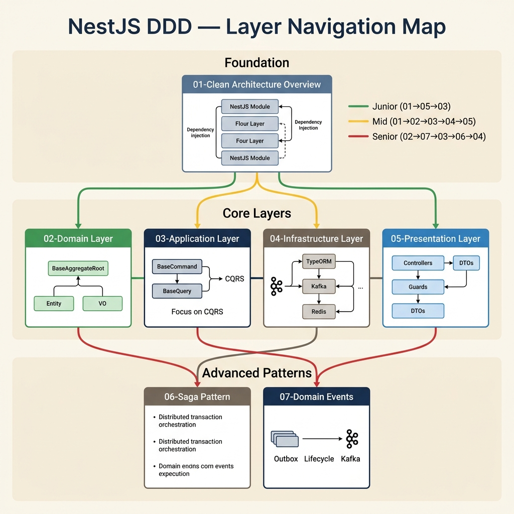
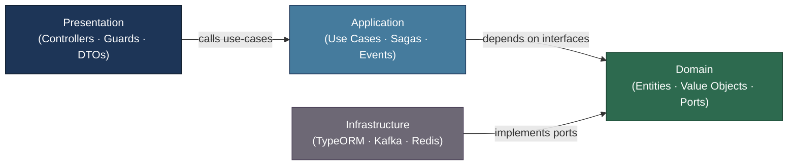

<!-- tags: architecture, clean-architecture, nestjs, typescript, overview -->
# 🐈 NestJS DDD Architecture

> Comprehensive architecture documentation for a NestJS Monorepo applying Clean Architecture + Domain-Driven Design

---

## 📚 Document List



| # | File | Content | Complexity |
|---|------|---------|------------|
| 01 | [Clean Architecture Overview](./01-clean-architecture-overview.md) | Overview of 4 layers, dependency rules, project structure | ⭐⭐ |
| 02 | [Domain Layer](./02-domain-layer.md) | Entity, AggregateRoot, ValueObject, Domain Events, Ports | ⭐⭐⭐ |
| 03 | [Application Layer](./03-application-layer.md) | Use Cases (CQRS), BaseCommand/BaseQuery, Saga, Policies | ⭐⭐⭐ |
| 04 | [Infrastructure Layer](./04-infrastructure-layer.md) | Repository, Mapper, Outbox/Inbox, Redis, Resilience | ⭐⭐⭐ |
| 05 | [Presentation Layer](./05-presentation-layer.md) | Controller, DTO, Guards, Pipes, Swagger, WebSocket | ⭐⭐ |
| 06 | [Saga Pattern](./06-saga-pattern.md) | Distributed transactions, SagaDefinition/SagaStep/SagaManager, Kafka Orchestration | ⭐⭐⭐⭐ |
| 07 | [Domain Events](./07-domain-events.md) | Full lifecycle: addDomainEvent → Outbox → Kafka, Application EventPublisher, Subscriber | ⭐⭐⭐ |

---

## 🗺️ Learning Path

### 🟢 Junior Backend Developer
```
01 → 05 → 03 (basic use cases)
```
Understand the overall architecture → Learn how to write Controller/DTO → Create simple Use Cases

### 🟡 Mid-level Developer
```
01 → 02 → 03 → 04 → 05
```
Learn from Domain outward — master each layer from core to edge

### 🔴 Senior / Architect
```
02 (advanced patterns) → 07 (Domain Events) → 03 (CQRS) → 06 (Saga) → 04 (Outbox/Resilience) → 01 (design decisions)
```
Focus on advanced DDD patterns, distributed transactions, and reliability patterns

---

## 🏛️ Architecture Summary

```
┌─────────────────────────────────────────────────────┐
│                  PRESENTATION LAYER                 │
│  Controllers · DTOs · Guards · Pipes · WebSocket    │
└────────────────────────┬────────────────────────────┘
                         │ calls use-cases
┌────────────────────────▼────────────────────────────┐
│                 APPLICATION LAYER                   │
│  Use Cases (BaseCommand/BaseQuery) · Sagas · Events │
└────────────────────────┬────────────────────────────┘
                         │ depends on Domain interfaces
┌────────────────────────▼────────────────────────────┐
│                   DOMAIN LAYER                      │
│  Entity · AggregateRoot · ValueObject · Events      │
│  Repository Ports · Domain Services · Policies      │
└────────────────────────▲────────────────────────────┘
                         │ implements ports
┌────────────────────────┴────────────────────────────┐
│               INFRASTRUCTURE LAYER                  │
│  TypeORM Repository · Mappers · HTTP Clients        │
│  Redis · Kafka/RabbitMQ · Resilience · Outbox       │
└─────────────────────────────────────────────────────┘
```

**Golden Rule**: Domain must not import from Infrastructure. Dependencies flow in one direction only.

### Diagram: Layer Dependency



---

## 📦 Core Base Classes (`libs/src/ddd`)

| Base Class | Layer | Purpose |
|------------|-------|---------|
| `BaseAggregateRoot` | Domain | Manages domain events, auto-dispatch |
| `BaseEntity` | Domain | Entity that is not an aggregate root |
| `BaseDomainEvents` | Domain | Domain event base class |
| `BaseCommand` | Application | Write use-case (create/update/delete) |
| `BaseQuery` | Application | Read use-case (get/list/search) |
| `BaseRepositoryTypeORM<D,O>` | Infrastructure | TypeORM repository with mapper |
| `BaseMapper<D,O>` | Shared | Maps Domain ↔ ORM entity |

---

## ⚡ Quick Reference: Layer Violations (FORBIDDEN)

```
❌ Domain → Infrastructure  (import NestJS/TypeORM in Domain)
❌ Application → Presentation
❌ Infrastructure → Application
❌ Port interface in Application (must be in Domain/ports/)
```
