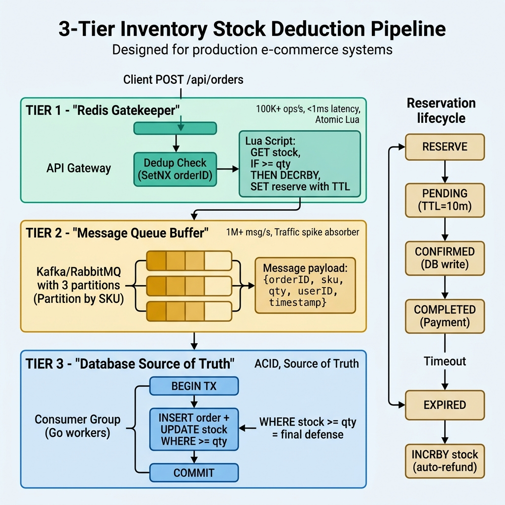

<!-- tags: best-practice, production, distributed-lock, ecommerce -->
# 🏪 Inventory Stock Deduction — ACID + High Throughput

> Kiến trúc 3 tầng khấu trừ tồn kho: Redis → Queue → DB, đảm bảo consistency mà vẫn chịu tải flash sale hàng triệu request/s

📅 Ngày tạo: 2026-03-21 · 🔄 Cập nhật: 2026-04-04 · ⏱️ 14 phút đọc

| Aspect           | Detail                                                             |
| ---------------- | ------------------------------------------------------------------ |
| **Concept**      | 3-tier stock deduction: Redis atomic → Async queue → DB safety net |
| **Use case**     | Flash sale, e-commerce checkout, ticket booking, limited inventory |
| **Go relevance** | Redis Lua, Kafka consumer, database/sql, goroutine pipeline        |
| **Throughput**   | 50K-200K req/s (Redis layer), tuỳ cluster size                     |

---

## 1. DEFINE

Đêm flash sale, 23:59:58. Hệ thống vừa mở cửa 12 giây, dashboard nhảy 47,000 orders. Đến 00:00:10, Slack explode: "Stock product HOT-001 đang hiện -234." Bạn bán 234 sản phẩm không tồn tại. Refund manual cho 234 khách, mỗi case mất 15 phút ops. Tổng damage: 58 giờ ops + brand trust mất không đo được.

Flash sale vừa mở 12 giây, dashboard order nhảy như điên, và câu hỏi khó nhất không còn là “chịu tải bao nhiêu request” mà là “làm sao không bán quá số hàng thực có”. `Inventory Stock Deduction` là bài production kinh điển vì throughput và correctness kéo ngược nhau rất mạnh.

Nếu bạn khóa mọi thứ ở database để giữ ACID, hot product sẽ biến row lock thành nút thắt cổ chai. Nếu bạn đẩy hết lên cache hoặc queue để lấy tốc độ, oversell và desync sẽ xuất hiện rất nhanh. Bài này chỉ sáng khi bạn chấp nhận một kiến trúc nhiều lớp, nơi mỗi lớp giữ một lời hứa khác nhau.

Core insight: **Best practice ở đây không phải chọn Redis hay DB, mà là phân vai đúng cho Redis, queue, và database để vừa chặn oversell sớm vừa còn một source of truth cuối cùng.**

### Bài toán

Khi user đặt hàng, hệ thống cần **trừ số lượng tồn kho** (stock) sao cho:

- **Atomicity**: Không bán quá số lượng có (no oversell)
- **Consistency**: Stock luôn >= 0, mọi order đều có inventory backing
- **Isolation**: Hàng triệu request đồng thời không race condition
- **Durability**: Dữ liệu không mất khi crash

Nhưng đồng thời phải đạt **high throughput** (hàng chục nghìn req/s) và **low latency** (< 10ms P99).

### Tại sao không chỉ dùng DB?

| Approach                    | Throughput  | Latency  | Consistency   | Vấn đề                                        |
| --------------------------- | ----------- | -------- | ------------- | --------------------------------------------- |
| `SELECT ... FOR UPDATE`     | ~1K req/s   | 50-200ms | ✅ Strong     | Lock contention, deadlock khi concurrent cao  |
| `UPDATE WHERE stock >= qty` | ~5K req/s   | 10-50ms  | ✅ Strong     | Row-level lock vẫn bottleneck khi hot product |
| **Redis + Queue + DB**      | ~100K req/s | 1-5ms    | ✅ Eventually | 3 tầng phối hợp, phức tạp hơn                 |

### Actors & Roles

| Component            | Role                                | Đặc điểm                                                |
| -------------------- | ----------------------------------- | ------------------------------------------------------- |
| **Redis**            | Gatekeeper — chặn sớm               | Single-threaded, atomic Lua script, microsecond latency |
| **Kafka/RabbitMQ**   | Buffer — đệm tải                    | Async decouple, absorb traffic spike                    |
| **PostgreSQL/MySQL** | Source of Truth — dữ liệu cuối cùng | ACID, `WHERE stock >= qty` làm safety net               |
| **TTL/Scheduler**    | Watchdog — dọn dẹp                  | Tự động hoàn stock khi timeout                          |

### Invariants (Bất biến)

1. `stock_redis >= 0` — Redis không bao giờ trừ xuống âm
2. `stock_db >= 0` — DB là source of truth cuối cùng
3. `stock_db >= actual_sold` — Mọi đơn hàng đã confirm đều có stock backing
4. **Exactly-once processing** — Mỗi order chỉ trừ stock 1 lần duy nhất

### Failure Modes

| Failure           | Hậu quả                    | Mitigation                            |
| ----------------- | -------------------------- | ------------------------------------- |
| Redis crash       | Mất stock cache            | Warm-up lại từ DB, trừ pending orders |
| Kafka lag         | Order bị delay ghi DB      | Consumer auto-scale, monitor lag      |
| DB down           | Không confirm được         | Queue retry + dead letter queue       |
| Network partition | Redis-DB desync            | DB luôn thắng, compensate Redis       |
| Duplicate request | Trừ stock 2 lần            | Deduplication key (orderID + SetNX)   |
| Payment timeout   | Stock trừ nhưng order fail | Reservation pattern + TTL auto-refund |

---

Các failure mode trên nghe quen thuộc — nhưng có trap thật sự đau: Redis crash mà không warm-up = request đi thẳng DB = SELECT FOR UPDATE serialize = sập cascade. Và duplicate request xuyên qua dedup key = stock bị trừ 2 lần. Trap đó sẽ xuất hiện ở PITFALLS.

## 2. VISUAL

Khái niệm 3 tầng nghe hợp lý trên giấy, nhưng chỉ khi nhìn request chảy qua từng lớp bạn mới thấy vì sao mỗi lớp đều tồn tại. Sơ đồ dưới đây bóc tách đúng luồng đó.



### Kiến trúc tổng quan — 3 tầng

```
                        ┌─────────────────────────────────────────────────┐
                        │              CLIENT (Browser/App)               │
                        └─────────────────┬───────────────────────────────┘
                                          │ POST /api/orders
                                          ▼
                  ┌───────────────────────────────────────────────┐
                  │              API GATEWAY / LB                 │
                  │         (Rate limit, Auth, Routing)           │
                  └───────────────────┬───────────────────────────┘
                                      │
                                      ▼
┌─────────────────────────────────────────────────────────────────────────┐
│                     TẦNG 1: REDIS (Gatekeeper)                         │
│                                                                         │
│  ┌──────────────┐    ┌────────────────────────────────────────┐        │
│  │ Dedup Check  │───▶│ Lua Script (EVALSHA)                   │        │
│  │ SetNX orderID│    │                                        │        │
│  └──────────────┘    │  1. GET stock:{sku}                    │        │
│                      │  2. IF stock >= qty THEN               │        │
│                      │       DECRBY stock:{sku} qty           │        │
│                      │       SET reserve:{orderID} qty EX 600 │        │
│                      │       RETURN 1  -- success             │        │
│                      │  3. ELSE RETURN 0 -- sold out          │        │
│                      └───────────────┬────────────────────────┘        │
│                                      │                                  │
│  Throughput: 100K+ ops/s             │ SUCCESS                          │
│  Latency: < 1ms                      │                                  │
└──────────────────────────────────────┼──────────────────────────────────┘
                                       │
                                       ▼
┌─────────────────────────────────────────────────────────────────────────┐
│                    TẦNG 2: MESSAGE QUEUE (Buffer)                       │
│                                                                         │
│  ┌─────────────────────────────────────────────────────────────┐       │
│  │                    Kafka / RabbitMQ                          │       │
│  │                                                             │       │
│  │  Topic: stock.deducted                                      │       │
│  │  Key: SKU (đảm bảo ordering per product)                    │       │
│  │  Payload: {orderID, sku, qty, userID, timestamp}            │       │
│  │                                                             │       │
│  │  ┌─────────┐ ┌─────────┐ ┌─────────┐                      │       │
│  │  │ Part. 0 │ │ Part. 1 │ │ Part. 2 │  ← Partition by SKU   │       │
│  │  └─────────┘ └─────────┘ └─────────┘                      │       │
│  └─────────────────────────────────────────────────────────────┘       │
│                                                                         │
│  Throughput: 1M+ msg/s (Kafka cluster)                                  │
│  Buffering: Absorb traffic spike                                        │
└──────────────────────────────────────┬──────────────────────────────────┘
                                       │
                                       ▼
┌─────────────────────────────────────────────────────────────────────────┐
│                    TẦNG 3: DATABASE (Source of Truth)                    │
│                                                                         │
│  ┌─────────────────────────────────────────────────────────────┐       │
│  │  Consumer Group (Go workers)                                │       │
│  │                                                             │       │
│  │  BEGIN TX                                                   │       │
│  │    INSERT INTO orders (...) VALUES (...)                     │       │
│  │    UPDATE products SET stock = stock - $qty                 │       │
│  │      WHERE sku = $sku AND stock >= $qty  ← SAFETY NET      │       │
│  │    IF rows_affected = 0 THEN                                │       │
│  │      ROLLBACK + compensate Redis                            │       │
│  │    END                                                      │       │
│  │  COMMIT                                                     │       │
│  └─────────────────────────────────────────────────────────────┘       │
│                                                                         │
│  Source of Truth: PostgreSQL/MySQL                                       │
│  Safety: WHERE stock >= qty là lớp bảo vệ cuối cùng                    │
└─────────────────────────────────────────────────────────────────────────┘
```

### Sequence — Happy Path

```
Client          API Server        Redis             Kafka          DB Consumer        PostgreSQL
  │                │                │                 │                │                 │
  │─── POST ──────▶│                │                 │                │                 │
  │    /orders      │                │                 │                │                 │
  │                │── SetNX ──────▶│                 │                │                 │
  │                │   dedup:orderID │                 │                │                 │
  │                │◀── OK ─────────│                 │                │                 │
  │                │                │                 │                │                 │
  │                │── EVALSHA ────▶│                 │                │                 │
  │                │   (Lua script)  │                 │                │                 │
  │                │◀── 1 (success) │                 │                │                 │
  │                │                │                 │                │                 │
  │                │── Produce ─────────────────────▶│                │                 │
  │                │   stock.deducted                 │                │                 │
  │◀── 202 ────────│                                  │                │                 │
  │    Accepted     │                                  │                │                 │
  │                │                                  │── Consume ───▶│                 │
  │                │                                  │                │── BEGIN TX ────▶│
  │                │                                  │                │   INSERT order   │
  │                │                                  │                │   UPDATE stock   │
  │                │                                  │                │   WHERE >= qty   │
  │                │                                  │                │◀── COMMIT ──────│
  │                │                                  │                │                 │
  │                │                                  │                │── DEL reserve ─▶│ Redis
  │                │                                  │                │   (confirm)      │
```

### Reservation Pattern — Timeout Flow

```
┌──────────────────────────────────────────────────────────────────┐
│                    RESERVATION LIFECYCLE                          │
│                                                                  │
│  ┌─────────┐    ┌──────────┐    ┌───────────┐    ┌───────────┐ │
│  │ RESERVE  │───▶│ PENDING  │───▶│ CONFIRMED │───▶│ COMPLETED │ │
│  │ (Redis)  │    │ (TTL=10m)│    │ (DB write)│    │ (Payment) │ │
│  └─────────┘    └────┬─────┘    └───────────┘    └───────────┘ │
│                      │                                           │
│                      │ Timeout (TTL expired)                     │
│                      ▼                                           │
│                 ┌──────────┐                                     │
│                 │ EXPIRED  │──▶ INCRBY stock:{sku} qty           │
│                 │ (refund) │    (tự động hoàn stock)             │
│                 └──────────┘                                     │
└──────────────────────────────────────────────────────────────────┘
```

### Bucket Sharding — Phân tán Hot Key

```
                    Trước: 1 key chịu toàn bộ tải
                    ┌──────────────────────┐
                    │  stock:SKU-001       │◀── 100K req/s
                    │  value: 10000        │    (contention!)
                    └──────────────────────┘

                    Sau: Chia N buckets
          ┌────────────────┐  ┌────────────────┐  ┌────────────────┐
          │ stock:SKU-001:0│  │ stock:SKU-001:1│  │ stock:SKU-001:2│
          │ value: 3334    │  │ value: 3333    │  │ value: 3333    │
          └────────────────┘  └────────────────┘  └────────────────┘
                  ▲                   ▲                   ▲
                33K req/s           33K req/s           33K req/s
                (hash(orderID) % N chọn bucket)
```

### Throughput Comparison — DB Direct vs 3-tier

```text
Throughput (req/s)
  100K ┤                                        ██████ Redis Lua
       │                                        ██████ (100K-200K req/s)
   50K ┤                                        ██████
       │
   10K ┤               ████ DB UPDATE WHERE     ██████
       │               ████ (5K-10K req/s)      ██████
    5K ┤               ████
       │
    1K ┤  ██ SELECT    ████                     ██████
       │  ██ FOR UPDATE████                     ██████
   500 ┤  ██ (~1K req/s████                     ██████
       │  ██           ████                     ██████
       └──────────────────────────────────────────────────▶
          SELECT       UPDATE                   Redis Lua
          FOR UPDATE   WHERE stock>=qty         (3-tier)

Latency P99:
  SELECT FOR UPDATE : 50-200ms (lock wait)
  UPDATE WHERE      : 10-50ms
  Redis Lua         : < 1ms ✅

Cost of complexity:
  DB direct  : Simple code, low throughput
  3-tier     : Complex code, high throughput + exactly-once
```

---

Flow đã hiện ra — Redis gatekeeper, Kafka buffer, DB safety net. Giờ ta hạ từng lớp xuống code để thấy chính xác constraint nào giữ stock không bao giờ âm.

## 3. CODE

Khi đường đi của request đã rõ, code nên phản ánh đúng ranh giới trách nhiệm giữa gatekeeper, buffer, và source of truth. Ta bắt đầu từ lớp atomic nhất rồi leo dần lên pipeline hoàn chỉnh.

### Example 1: Basic — Redis Lua Script trừ stock atomic

Bước đơn giản nhất: dùng Lua script chạy trên Redis single-thread để kiểm tra + trừ stock trong 1 thao tác atomic, không cần lock.

```go
package stock

import (
	"context"
	"fmt"
	"time"

	"github.com/redis/go-redis/v9"
)

// ─── Lua script: kiểm tra + trừ stock + đặt reservation ───
// Chạy atomic trên Redis single-thread → không race condition
var deductStockScript = redis.NewScript(`
	local stock_key = KEYS[1]
	local reserve_key = KEYS[2]
	local qty = tonumber(ARGV[1])
	local ttl = tonumber(ARGV[2])

	-- ① Kiểm tra stock hiện tại
	local current = tonumber(redis.call('GET', stock_key) or 0)
	if current < qty then
		return -1  -- ⚠️ Hết hàng
	end

	-- ② Trừ stock + đặt reservation kèm TTL
	redis.call('DECRBY', stock_key, qty)
	redis.call('SET', reserve_key, qty, 'EX', ttl)

	return current - qty  -- ✅ Stock còn lại
`)

type RedisStockService struct {
	client     *redis.Client
	reserveTTL time.Duration // Thời gian giữ chỗ trước khi auto-refund
}

func NewRedisStockService(client *redis.Client) *RedisStockService {
	return &RedisStockService{
		client:     client,
		reserveTTL: 10 * time.Minute, // 10 phút để thanh toán
	}
}

// DeductStock trừ stock atomic, trả về stock còn lại hoặc error
func (s *RedisStockService) DeductStock(ctx context.Context, sku string, qty int, orderID string) (int64, error) {
	stockKey := fmt.Sprintf("stock:%s", sku)
	reserveKey := fmt.Sprintf("reserve:%s", orderID)

	// ✅ Chạy Lua script — atomic, không cần distributed lock
	remaining, err := deductStockScript.Run(ctx, s.client,
		[]string{stockKey, reserveKey},
		qty, int(s.reserveTTL.Seconds()),
	).Int64()

	if err != nil {
		return 0, fmt.Errorf("redis stock deduct failed: %w", err)
	}

	if remaining < 0 {
		return 0, ErrOutOfStock
	}

	return remaining, nil
}

// ConfirmReservation — xoá reservation sau khi DB ghi thành công
func (s *RedisStockService) ConfirmReservation(ctx context.Context, orderID string) error {
	reserveKey := fmt.Sprintf("reserve:%s", orderID)
	return s.client.Del(ctx, reserveKey).Err()
}

// RefundStock — hoàn lại stock khi order bị cancel
func (s *RedisStockService) RefundStock(ctx context.Context, sku string, qty int, orderID string) error {
	stockKey := fmt.Sprintf("stock:%s", sku)
	reserveKey := fmt.Sprintf("reserve:%s", orderID)

	// ✅ Chỉ hoàn nếu reservation còn tồn tại (chưa expire)
	exists, err := s.client.Exists(ctx, reserveKey).Result()
	if err != nil {
		return err
	}
	if exists == 0 {
		return nil // Reservation đã expire, TTL đã tự hoàn
	}

	pipe := s.client.Pipeline()
	pipe.IncrBy(ctx, stockKey, int64(qty))
	pipe.Del(ctx, reserveKey)
	_, err = pipe.Exec(ctx)
	return err
}

var ErrOutOfStock = fmt.Errorf("out of stock")
```
```typescript
// TypeScript — Redis Lua atomic stock deduction (ioredis)
import Redis from 'ioredis';

const deductStockScript = `
  local stock_key = KEYS[1]
  local reserve_key = KEYS[2]
  local qty = tonumber(ARGV[1])
  local ttl = tonumber(ARGV[2])
  local current = tonumber(redis.call('GET', stock_key) or 0)
  if current < qty then
    return -1
  end
  redis.call('DECRBY', stock_key, qty)
  redis.call('SET', reserve_key, qty, 'EX', ttl)
  return current - qty
`;

class RedisStockService {
  private client: Redis;
  private reserveTTLSeconds = 600; // 10 minutes

  constructor(client: Redis) {
    this.client = client;
    this.client.defineCommand('deductStock', {
      numberOfKeys: 2,
      lua: deductStockScript,
    });
  }

  async deductStock(sku: string, qty: number, orderID: string): Promise<number> {
    const stockKey = `stock:${sku}`;
    const reserveKey = `reserve:${orderID}`;

    const remaining = await (this.client as any).deductStock(
      stockKey, reserveKey,
      qty, this.reserveTTLSeconds,
    ) as number;

    if (remaining < 0) throw new Error('out of stock');
    return remaining;
  }

  async confirmReservation(orderID: string): Promise<void> {
    await this.client.del(`reserve:${orderID}`);
  }

  async refundStock(sku: string, qty: number, orderID: string): Promise<void> {
    const reserveKey = `reserve:${orderID}`;
    const exists = await this.client.exists(reserveKey);
    if (exists === 0) return;

    const pipe = this.client.pipeline();
    pipe.incrby(`stock:${sku}`, qty);
    pipe.del(reserveKey);
    await pipe.exec();
  }
}
```
```rust
// Rust — Redis Lua atomic stock deduction (redis crate + tokio)
use redis::{AsyncCommands, Script};
use std::time::Duration;

const DEDUCT_SCRIPT: &str = r#"
  local stock_key = KEYS[1]
  local reserve_key = KEYS[2]
  local qty = tonumber(ARGV[1])
  local ttl = tonumber(ARGV[2])
  local current = tonumber(redis.call('GET', stock_key) or 0)
  if current < qty then
    return -1
  end
  redis.call('DECRBY', stock_key, qty)
  redis.call('SET', reserve_key, qty, 'EX', ttl)
  return current - qty
"#;

struct RedisStockService {
    client: redis::Client,
    reserve_ttl: Duration,
}

impl RedisStockService {
    fn new(client: redis::Client) -> Self {
        Self { client, reserve_ttl: Duration::from_secs(600) }
    }

    async fn deduct_stock(&self, sku: &str, qty: i64, order_id: &str) -> anyhow::Result<i64> {
        let mut con = self.client.get_async_connection().await?;
        let stock_key = format!("stock:{}", sku);
        let reserve_key = format!("reserve:{}", order_id);
        let ttl = self.reserve_ttl.as_secs() as i64;

        let remaining: i64 = Script::new(DEDUCT_SCRIPT)
            .key(&stock_key)
            .key(&reserve_key)
            .arg(qty)
            .arg(ttl)
            .invoke_async(&mut con)
            .await?;

        if remaining < 0 {
            anyhow::bail!("out of stock");
        }
        Ok(remaining)
    }

    async fn confirm_reservation(&self, order_id: &str) -> anyhow::Result<()> {
        let mut con = self.client.get_async_connection().await?;
        con.del(format!("reserve:{}", order_id)).await?;
        Ok(())
    }

    async fn refund_stock(&self, sku: &str, qty: i64, order_id: &str) -> anyhow::Result<()> {
        let mut con = self.client.get_async_connection().await?;
        let reserve_key = format!("reserve:{}", order_id);
        let exists: bool = con.exists(&reserve_key).await?;
        if !exists { return Ok(()); }

        redis::pipe()
            .incr(format!("stock:{}", sku), qty)
            .del(&reserve_key)
            .query_async(&mut con)
            .await?;
        Ok(())
    }
}
```
```cpp
// C++ — Redis Lua atomic stock deduction (hiredis + cpp_redis)
#include <cpp_redis/cpp_redis>
#include <stdexcept>
#include <string>

const std::string DEDUCT_SCRIPT = R"(
  local stock_key = KEYS[1]
  local reserve_key = KEYS[2]
  local qty = tonumber(ARGV[1])
  local ttl = tonumber(ARGV[2])
  local current = tonumber(redis.call('GET', stock_key) or 0)
  if current < qty then return -1 end
  redis.call('DECRBY', stock_key, qty)
  redis.call('SET', reserve_key, qty, 'EX', ttl)
  return current - qty
)";

class RedisStockService {
    cpp_redis::client& client_;
    int reserve_ttl_seconds_ = 600;

public:
    explicit RedisStockService(cpp_redis::client& client) : client_(client) {}

    int64_t deduct_stock(const std::string& sku, int64_t qty, const std::string& order_id) {
        auto stock_key   = "stock:" + sku;
        auto reserve_key = "reserve:" + order_id;

        auto fut = client_.eval(
            DEDUCT_SCRIPT,
            2,                                     // numkeys
            {stock_key, reserve_key},              // KEYS
            {std::to_string(qty),
             std::to_string(reserve_ttl_seconds_)} // ARGV
        );
        client_.sync_commit();

        auto reply = fut.get();
        if (!reply.is_integer()) throw std::runtime_error("script error");
        int64_t remaining = reply.as_integer();
        if (remaining < 0) throw std::runtime_error("out of stock");
        return remaining;
    }

    void confirm_reservation(const std::string& order_id) {
        client_.del({"reserve:" + order_id});
        client_.sync_commit();
    }

    void refund_stock(const std::string& sku, int64_t qty, const std::string& order_id) {
        auto reserve_key = "reserve:" + order_id;
        auto exists_fut  = client_.exists({reserve_key});
        client_.sync_commit();
        if (exists_fut.get().as_integer() == 0) return;

        client_.incrby("stock:" + sku, qty);
        client_.del({reserve_key});
        client_.sync_commit();
    }
};
```
```python
import redis

DEDUCT_SCRIPT = """
local stock_key = KEYS[1]
local reserve_key = KEYS[2]
local qty = tonumber(ARGV[1])
local ttl = tonumber(ARGV[2])
local current = tonumber(redis.call('GET', stock_key) or 0)
if current < qty then return -1 end
redis.call('DECRBY', stock_key, qty)
redis.call('SET', reserve_key, qty, 'EX', ttl)
return current - qty
"""

class RedisStockService:
    def __init__(self, client: redis.Redis, reserve_ttl_seconds: int = 600) -> None:
        self.client = client
        self.reserve_ttl_seconds = reserve_ttl_seconds
        self.deduct_stock_script = self.client.register_script(DEDUCT_SCRIPT)

    def deduct_stock(self, sku: str, qty: int, order_id: str) -> int:
        remaining = int(
            self.deduct_stock_script(
                keys=[f"stock:{sku}", f"reserve:{order_id}"],
                args=[qty, self.reserve_ttl_seconds],
            )
        )
        if remaining < 0:
            raise ValueError("out of stock")
        return remaining

    def confirm_reservation(self, order_id: str) -> None:
        self.client.delete(f"reserve:{order_id}")

    def refund_stock(self, sku: str, qty: int, order_id: str) -> None:
        reserve_key = f"reserve:{order_id}"
        if not self.client.exists(reserve_key):
            return
        pipe = self.client.pipeline()
        pipe.incrby(f"stock:{sku}", qty)
        pipe.delete(reserve_key)
        pipe.execute()
```

**Kết luận**: Lua script đảm bảo check + deduct là 1 thao tác atomic. Redis single-threaded nên không cần mutex hay distributed lock. Reservation có TTL tự động hoàn stock nếu không confirm.

---

Redis Lua đã cho atomic deduction. Nhưng duplicate request vẫn xuyên qua — dedup + Kafka là lớp phòng thủ tiếp theo.

### Example 2: Intermediate — Deduplication + Kafka Producer

Thêm lớp chống duplicate request (user bấm 2 lần) và đẩy message vào Kafka để consumer bên dưới ghi DB bất đồng bộ.

```go
package order

import (
	"context"
	"encoding/json"
	"fmt"
	"time"

	"github.com/redis/go-redis/v9"
	"github.com/segmentio/kafka-go"
)

// ─── Order Event gửi qua Kafka ───
type StockDeductedEvent struct {
	OrderID   string    `json:"order_id"`
	SKU       string    `json:"sku"`
	Quantity  int       `json:"quantity"`
	UserID    string    `json:"user_id"`
	Timestamp time.Time `json:"timestamp"`
}

type OrderService struct {
	redis       *redis.Client
	stockSvc    *stock.RedisStockService
	kafkaWriter *kafka.Writer
	dedupTTL    time.Duration
}

func NewOrderService(rdb *redis.Client, stockSvc *stock.RedisStockService, kw *kafka.Writer) *OrderService {
	return &OrderService{
		redis:       rdb,
		stockSvc:    stockSvc,
		kafkaWriter: kw,
		dedupTTL:    24 * time.Hour, // giữ dedup key 24h
	}
}

// PlaceOrder — full flow: dedup → trừ stock → đẩy Kafka
func (s *OrderService) PlaceOrder(ctx context.Context, req PlaceOrderRequest) error {
	// ① Deduplication — chặn duplicate request
	// SetNX trả true nếu key chưa tồn tại (request mới)
	dedupKey := fmt.Sprintf("dedup:order:%s", req.OrderID)
	isNew, err := s.redis.SetNX(ctx, dedupKey, "processing", s.dedupTTL).Result()
	if err != nil {
		return fmt.Errorf("dedup check failed: %w", err)
	}
	if !isNew {
		// ⚠️ Request đã xử lý trước đó — trả về idempotent response
		return ErrDuplicateOrder
	}

	// ② Trừ stock ở Redis (atomic Lua script)
	remaining, err := s.stockSvc.DeductStock(ctx, req.SKU, req.Quantity, req.OrderID)
	if err != nil {
		// Xoá dedup key để cho phép retry với order ID khác
		s.redis.Del(ctx, dedupKey)
		return fmt.Errorf("stock deduction failed: %w", err)
	}

	// ③ Produce event lên Kafka
	event := StockDeductedEvent{
		OrderID:   req.OrderID,
		SKU:       req.SKU,
		Quantity:  req.Quantity,
		UserID:    req.UserID,
		Timestamp: time.Now(),
	}

	payload, err := json.Marshal(event)
	if err != nil {
		// ⚠️ Compensate: hoàn stock nếu marshal thất bại
		s.stockSvc.RefundStock(ctx, req.SKU, req.Quantity, req.OrderID)
		s.redis.Del(ctx, dedupKey)
		return fmt.Errorf("marshal event: %w", err)
	}

	err = s.kafkaWriter.WriteMessages(ctx, kafka.Message{
		// ✅ Key = SKU đảm bảo cùng product đi cùng partition → ordering
		Key:   []byte(req.SKU),
		Value: payload,
	})
	if err != nil {
		// ⚠️ Kafka write fail → compensate Redis
		s.stockSvc.RefundStock(ctx, req.SKU, req.Quantity, req.OrderID)
		s.redis.Del(ctx, dedupKey)
		return fmt.Errorf("kafka produce failed: %w", err)
	}

	fmt.Printf("✅ Order %s: stock remaining = %d, event published\n", req.OrderID, remaining)
	return nil
}

type PlaceOrderRequest struct {
	OrderID  string
	SKU      string
	Quantity int
	UserID   string
}

var ErrDuplicateOrder = fmt.Errorf("duplicate order")
```
```typescript
// TypeScript — Deduplication + Kafka Producer (ioredis + kafkajs)
import Redis from 'ioredis';
import { Kafka, Producer } from 'kafkajs';

interface StockDeductedEvent {
  order_id: string;
  sku: string;
  quantity: number;
  user_id: string;
  timestamp: string;
}

interface PlaceOrderRequest {
  orderID: string;
  sku: string;
  quantity: number;
  userID: string;
}

class OrderService {
  constructor(
    private redis: Redis,
    private stockSvc: RedisStockService,
    private producer: Producer,
    private dedupTTLSeconds = 86400,
  ) {}

  async placeOrder(req: PlaceOrderRequest): Promise<void> {
    const dedupKey = `dedup:order:${req.orderID}`;

    // ① Deduplication
    const isNew = await this.redis.set(dedupKey, 'processing', 'EX', this.dedupTTLSeconds, 'NX');
    if (!isNew) throw new Error('duplicate order');

    // ② Deduct stock
    let remaining: number;
    try {
      remaining = await this.stockSvc.deductStock(req.sku, req.quantity, req.orderID);
    } catch (err) {
      await this.redis.del(dedupKey);
      throw err;
    }

    // ③ Produce to Kafka
    const event: StockDeductedEvent = {
      order_id: req.orderID,
      sku: req.sku,
      quantity: req.quantity,
      user_id: req.userID,
      timestamp: new Date().toISOString(),
    };

    try {
      await this.producer.send({
        topic: 'stock.deducted',
        messages: [{ key: req.sku, value: JSON.stringify(event) }], // Key=SKU for ordering
      });
    } catch (err) {
      await this.stockSvc.refundStock(req.sku, req.quantity, req.orderID);
      await this.redis.del(dedupKey);
      throw err;
    }

    console.log(`✅ Order ${req.orderID}: stock remaining=${remaining}, event published`);
  }
}

declare class RedisStockService {
  deductStock(sku: string, qty: number, orderID: string): Promise<number>;
  refundStock(sku: string, qty: number, orderID: string): Promise<void>;
}
```
```rust
// Rust — Deduplication + Kafka Producer (redis + rdkafka)
use rdkafka::producer::{FutureProducer, FutureRecord};
use redis::AsyncCommands;
use serde::{Deserialize, Serialize};
use std::time::Duration;

#[derive(Serialize)]
struct StockDeductedEvent {
    order_id: String,
    sku: String,
    quantity: i64,
    user_id: String,
    timestamp: String,
}

struct PlaceOrderRequest {
    order_id: String,
    sku: String,
    quantity: i64,
    user_id: String,
}

struct OrderService {
    redis: redis::Client,
    producer: FutureProducer,
    dedup_ttl: u64,
}

impl OrderService {
    async fn place_order(&self, req: PlaceOrderRequest) -> anyhow::Result<()> {
        let mut con = self.redis.get_async_connection().await?;
        let dedup_key = format!("dedup:order:{}", req.order_id);

        // ① Deduplication via SET NX
        let is_new: bool = con
            .set_options(
                &dedup_key,
                "processing",
                redis::SetOptions::default()
                    .with_expiration(redis::SetExpiry::EX(self.dedup_ttl))
                    .conditional_set(redis::ExistenceCheck::NX),
            )
            .await?;
        if !is_new { anyhow::bail!("duplicate order"); }

        // ② Deduct stock (delegate to RedisStockService)
        // let remaining = stock_svc.deduct_stock(&req.sku, req.quantity, &req.order_id).await?;

        // ③ Produce to Kafka
        let event = StockDeductedEvent {
            order_id: req.order_id.clone(),
            sku: req.sku.clone(),
            quantity: req.quantity,
            user_id: req.user_id,
            timestamp: chrono::Utc::now().to_rfc3339(),
        };
        let payload = serde_json::to_string(&event)?;

        self.producer
            .send(
                FutureRecord::to("stock.deducted")
                    .key(&req.sku) // Partition by SKU for ordering
                    .payload(&payload),
                Duration::from_secs(5),
            )
            .await
            .map_err(|(e, _)| anyhow::anyhow!("kafka produce: {}", e))?;

        Ok(())
    }
}
```
```cpp
// C++ — Deduplication + Kafka Producer (cpp_redis + librdkafka)
#include <cpp_redis/cpp_redis>
#include <librdkafka/rdkafkacpp.h>
#include <nlohmann/json.hpp>
#include <stdexcept>

class OrderService {
    cpp_redis::client& redis_;
    RdKafka::Producer* producer_;
    std::string topic_{"stock.deducted"};
    int dedup_ttl_seconds_{86400};

public:
    OrderService(cpp_redis::client& redis, RdKafka::Producer* producer)
        : redis_(redis), producer_(producer) {}

    void place_order(const std::string& order_id, const std::string& sku,
                     int qty, const std::string& user_id) {
        auto dedup_key = "dedup:order:" + order_id;

        // ① Deduplication via SET NX EX
        auto fut = redis_.set(dedup_key, "processing",
                              [](cpp_redis::reply&) {},
                              dedup_ttl_seconds_,
                              cpp_redis::client::set_condition::NX);
        redis_.sync_commit();
        auto reply = fut.get();
        if (reply.is_null()) throw std::runtime_error("duplicate order");

        // ② Deduct stock (call RedisStockService separately)

        // ③ Produce to Kafka
        nlohmann::json event = {
            {"order_id",  order_id},
            {"sku",       sku},
            {"quantity",  qty},
            {"user_id",   user_id},
        };
        auto payload = event.dump();

        RdKafka::ErrorCode err = producer_->produce(
            topic_,
            RdKafka::Topic::PARTITION_UA,
            RdKafka::Producer::RK_MSG_COPY,
            const_cast<char*>(payload.c_str()), payload.size(),
            sku.c_str(), sku.size(), // Key = SKU for partition ordering
            0, nullptr, nullptr
        );
        if (err != RdKafka::ERR_NO_ERROR)
            throw std::runtime_error(RdKafka::err2str(err));
        producer_->poll(0);
    }
};
```
```python
from dataclasses import asdict, dataclass
from datetime import datetime, timezone
import json

@dataclass
class StockDeductedEvent:
    order_id: str
    sku: str
    quantity: int
    user_id: str
    timestamp: str

class OrderService:
    def __init__(self, redis_client, stock_service, producer, dedup_ttl_seconds: int = 86400) -> None:
        self.redis = redis_client
        self.stock_service = stock_service
        self.producer = producer
        self.dedup_ttl_seconds = dedup_ttl_seconds

    def place_order(self, order_id: str, sku: str, quantity: int, user_id: str) -> None:
        dedup_key = f"dedup:order:{order_id}"
        if not self.redis.set(dedup_key, "processing", ex=self.dedup_ttl_seconds, nx=True):
            raise ValueError("duplicate order")

        try:
            remaining = self.stock_service.deduct_stock(sku, quantity, order_id)
            event = StockDeductedEvent(
                order_id=order_id,
                sku=sku,
                quantity=quantity,
                user_id=user_id,
                timestamp=datetime.now(timezone.utc).isoformat(),
            )
            self.producer.send("stock.deducted", key=sku.encode(), value=json.dumps(asdict(event)).encode())
            print(f"✅ Order {order_id}: stock remaining={remaining}, event published")
        except Exception:
            self.stock_service.refund_stock(sku, quantity, order_id)
            self.redis.delete(dedup_key)
            raise
```

**Kết luận**: Flow dedup → trừ stock → produce Kafka đảm bảo mỗi order chỉ trừ stock 1 lần. Nếu bước nào fail, luôn có compensate ngược lại (hoàn stock, xoá dedup key). Kafka partition by SKU giữ ordering cho cùng product.

---

Dedup + Kafka đã buffer tải. Nhưng DB consumer cần safety net cho exactly-once — hãy implement.

### Example 3: Advanced — DB Consumer + Safety Net + Compensation

Consumer Kafka ghi DB với `WHERE stock >= qty` làm safety net cuối cùng. Nếu DB reject (stock thực tế không đủ), compensate ngược Redis.

```go
package consumer

import (
	"context"
	"database/sql"
	"encoding/json"
	"fmt"
	"log"
	"time"

	"github.com/redis/go-redis/v9"
	"github.com/segmentio/kafka-go"
)

type StockConsumer struct {
	db          *sql.DB
	redis       *redis.Client
	kafkaReader *kafka.Reader
}

func NewStockConsumer(db *sql.DB, rdb *redis.Client, reader *kafka.Reader) *StockConsumer {
	return &StockConsumer{db: db, redis: rdb, kafkaReader: reader}
}

// Run — main consumer loop
func (c *StockConsumer) Run(ctx context.Context) error {
	log.Println("🚀 Stock consumer started")

	for {
		select {
		case <-ctx.Done():
			return ctx.Err()
		default:
		}

		msg, err := c.kafkaReader.FetchMessage(ctx)
		if err != nil {
			log.Printf("⚠️ fetch message: %v", err)
			continue
		}

		var event StockDeductedEvent
		if err := json.Unmarshal(msg.Value, &event); err != nil {
			log.Printf("⚠️ unmarshal: %v", err)
			// Dead letter — skip corrupt message
			c.kafkaReader.CommitMessages(ctx, msg)
			continue
		}

		// ✅ Xử lý event với retry
		if err := c.processEvent(ctx, event); err != nil {
			log.Printf("❌ process event %s: %v", event.OrderID, err)
			// Không commit → Kafka sẽ re-deliver
			continue
		}

		// ✅ Commit offset sau khi xử lý thành công
		c.kafkaReader.CommitMessages(ctx, msg)
	}
}

func (c *StockConsumer) processEvent(ctx context.Context, event StockDeductedEvent) error {
	// ─── Database Transaction ───
	tx, err := c.db.BeginTx(ctx, &sql.TxOptions{
		Isolation: sql.LevelReadCommitted,
	})
	if err != nil {
		return fmt.Errorf("begin tx: %w", err)
	}
	defer tx.Rollback()

	// ① Insert order record
	_, err = tx.ExecContext(ctx, `
		INSERT INTO orders (order_id, sku, quantity, user_id, status, created_at)
		VALUES ($1, $2, $3, $4, 'confirmed', $5)
		ON CONFLICT (order_id) DO NOTHING
	`, event.OrderID, event.SKU, event.Quantity, event.UserID, event.Timestamp)
	if err != nil {
		return fmt.Errorf("insert order: %w", err)
	}

	// ② Update stock với safety net WHERE stock >= qty
	// ⚠️ ĐÂY LÀ LỚP BẢO VỆ CUỐI CÙNG — DB là source of truth
	result, err := tx.ExecContext(ctx, `
		UPDATE products
		SET stock = stock - $1, updated_at = NOW()
		WHERE sku = $2 AND stock >= $1
	`, event.Quantity, event.SKU)
	if err != nil {
		return fmt.Errorf("update stock: %w", err)
	}

	rowsAffected, _ := result.RowsAffected()
	if rowsAffected == 0 {
		// ⚠️ DB stock không đủ — Redis và DB bị desync
		// Compensate: hoàn stock Redis + cancel order
		log.Printf("⚠️ DB stock insufficient for %s, compensating Redis", event.OrderID)
		c.compensateRedis(ctx, event)
		return fmt.Errorf("db stock insufficient, compensated")
	}

	// ③ Commit transaction
	if err := tx.Commit(); err != nil {
		return fmt.Errorf("commit: %w", err)
	}

	// ④ Xoá reservation ở Redis (đã confirm thành công)
	reserveKey := fmt.Sprintf("reserve:%s", event.OrderID)
	c.redis.Del(ctx, reserveKey)

	log.Printf("✅ Order %s committed to DB, stock deducted", event.OrderID)
	return nil
}

// compensateRedis — hoàn stock Redis khi DB reject
func (c *StockConsumer) compensateRedis(ctx context.Context, event StockDeductedEvent) {
	stockKey := fmt.Sprintf("stock:%s", event.SKU)
	reserveKey := fmt.Sprintf("reserve:%s", event.OrderID)

	pipe := c.redis.Pipeline()
	pipe.IncrBy(ctx, stockKey, int64(event.Quantity))
	pipe.Del(ctx, reserveKey)
	if _, err := pipe.Exec(ctx); err != nil {
		log.Printf("❌ compensate Redis failed for %s: %v", event.OrderID, err)
		// TODO: Alert + manual intervention
	}

	// Update dedup key status
	dedupKey := fmt.Sprintf("dedup:order:%s", event.OrderID)
	c.redis.Set(ctx, dedupKey, "failed", 24*time.Hour)
}
```
```typescript
// TypeScript — Kafka Consumer + DB Safety Net + Compensation (kafkajs + pg)
import { Consumer, EachMessagePayload } from 'kafkajs';
import { Pool, PoolClient } from 'pg';
import Redis from 'ioredis';

interface StockDeductedEvent {
  order_id: string;
  sku: string;
  quantity: number;
  user_id: string;
  timestamp: string;
}

class StockConsumer {
  constructor(
    private db: Pool,
    private redis: Redis,
    private consumer: Consumer,
  ) {}

  async run(): Promise<void> {
    await this.consumer.run({
      eachMessage: async ({ message }: EachMessagePayload) => {
        if (!message.value) return;
        const event: StockDeductedEvent = JSON.parse(message.value.toString());
        await this.processEvent(event);
      },
    });
  }

  private async processEvent(event: StockDeductedEvent): Promise<void> {
    const client: PoolClient = await this.db.connect();
    try {
      await client.query('BEGIN');

      // ① Idempotent insert
      await client.query(
        `INSERT INTO orders (order_id, sku, quantity, user_id, status, created_at)
         VALUES ($1, $2, $3, $4, 'confirmed', $5)
         ON CONFLICT (order_id) DO NOTHING`,
        [event.order_id, event.sku, event.quantity, event.user_id, event.timestamp],
      );

      // ② Safety net: WHERE stock >= qty
      const result = await client.query(
        `UPDATE products SET stock = stock - $1, updated_at = NOW()
         WHERE sku = $2 AND stock >= $1`,
        [event.quantity, event.sku],
      );

      if (result.rowCount === 0) {
        await client.query('ROLLBACK');
        await this.compensateRedis(event);
        return;
      }

      await client.query('COMMIT');

      // ④ Remove reservation
      await this.redis.del(`reserve:${event.order_id}`);
    } catch (err) {
      await client.query('ROLLBACK');
      throw err;
    } finally {
      client.release();
    }
  }

  private async compensateRedis(event: StockDeductedEvent): Promise<void> {
    const pipe = this.redis.pipeline();
    pipe.incrby(`stock:${event.sku}`, event.quantity);
    pipe.del(`reserve:${event.order_id}`);
    pipe.set(`dedup:order:${event.order_id}`, 'failed', 'EX', 86400);
    await pipe.exec();
  }
}
```
```rust
// Rust — Kafka Consumer + DB Safety Net + Compensation (rdkafka + sqlx)
use rdkafka::consumer::{CommitMode, Consumer, StreamConsumer};
use rdkafka::message::BorrowedMessage;
use rdkafka::Message;
use redis::AsyncCommands;
use sqlx::PgPool;
use serde::Deserialize;

#[derive(Deserialize)]
struct StockDeductedEvent {
    order_id: String,
    sku: String,
    quantity: i64,
    user_id: String,
    timestamp: chrono::DateTime<chrono::Utc>,
}

struct StockConsumer {
    db: PgPool,
    redis: redis::Client,
    consumer: StreamConsumer,
}

impl StockConsumer {
    async fn process_message(&self, msg: &BorrowedMessage<'_>) -> anyhow::Result<()> {
        let payload = msg.payload_view::<str>().unwrap_or(Ok(""))?;
        let event: StockDeductedEvent = serde_json::from_str(payload)?;
        self.process_event(event).await
    }

    async fn process_event(&self, event: StockDeductedEvent) -> anyhow::Result<()> {
        let mut tx = self.db.begin().await?;

        // ① Idempotent insert
        sqlx::query!(
            r#"INSERT INTO orders (order_id, sku, quantity, user_id, status, created_at)
               VALUES ($1, $2, $3, $4, 'confirmed', $5)
               ON CONFLICT (order_id) DO NOTHING"#,
            event.order_id, event.sku, event.quantity, event.user_id, event.timestamp,
        )
        .execute(&mut *tx)
        .await?;

        // ② Safety net: WHERE stock >= qty
        let rows = sqlx::query!(
            "UPDATE products SET stock = stock - $1, updated_at = NOW()
             WHERE sku = $2 AND stock >= $1",
            event.quantity, event.sku,
        )
        .execute(&mut *tx)
        .await?;

        if rows.rows_affected() == 0 {
            tx.rollback().await?;
            self.compensate_redis(&event).await?;
            return Ok(());
        }

        tx.commit().await?;

        let mut con = self.redis.get_async_connection().await?;
        con.del(format!("reserve:{}", event.order_id)).await?;
        Ok(())
    }

    async fn compensate_redis(&self, event: &StockDeductedEvent) -> anyhow::Result<()> {
        let mut con = self.redis.get_async_connection().await?;
        redis::pipe()
            .incr(format!("stock:{}", event.sku), event.quantity)
            .del(format!("reserve:{}", event.order_id))
            .set_ex(format!("dedup:order:{}", event.order_id), "failed", 86400)
            .query_async(&mut con)
            .await?;
        Ok(())
    }
}
```
```cpp
// C++ — Kafka Consumer + DB Safety Net + Compensation (librdkafka + libpqxx)
#include <librdkafka/rdkafkacpp.h>
#include <pqxx/pqxx>
#include <cpp_redis/cpp_redis>
#include <nlohmann/json.hpp>
#include <stdexcept>

class StockConsumer {
    pqxx::connection& db_;
    cpp_redis::client& redis_;

public:
    StockConsumer(pqxx::connection& db, cpp_redis::client& redis)
        : db_(db), redis_(redis) {}

    void process_event(const std::string& payload) {
        auto ev = nlohmann::json::parse(payload);
        std::string order_id = ev["order_id"];
        std::string sku      = ev["sku"];
        int64_t     quantity = ev["quantity"];
        std::string user_id  = ev["user_id"];

        try {
            pqxx::work tx(db_);

            // ① Idempotent insert
            tx.exec_params(
                "INSERT INTO orders (order_id, sku, quantity, user_id, status)"
                " VALUES ($1,$2,$3,$4,'confirmed') ON CONFLICT (order_id) DO NOTHING",
                order_id, sku, quantity, user_id);

            // ② Safety net: WHERE stock >= qty
            pqxx::result r = tx.exec_params(
                "UPDATE products SET stock = stock - $1, updated_at = NOW()"
                " WHERE sku = $2 AND stock >= $1",
                quantity, sku);

            if (r.affected_rows() == 0) {
                tx.abort();
                compensate_redis(sku, quantity, order_id);
                return;
            }

            tx.commit();
        } catch (const std::exception& e) {
            compensate_redis(sku, quantity, order_id);
            throw;
        }

        redis_.del({"reserve:" + order_id});
        redis_.sync_commit();
    }

private:
    void compensate_redis(const std::string& sku, int64_t qty,
                          const std::string& order_id) {
        redis_.incrby("stock:" + sku, qty);
        redis_.del({"reserve:" + order_id});
        redis_.setex("dedup:order:" + order_id, 86400, "failed");
        redis_.sync_commit();
    }
};
```
```python
import json

class StockConsumer:
    def __init__(self, db, redis_client, consumer) -> None:
        self.db = db
        self.redis = redis_client
        self.consumer = consumer

    def process_event(self, payload: bytes) -> None:
        event = json.loads(payload)
        with self.db.transaction() as tx:
            tx.execute(
                """
                INSERT INTO orders (order_id, sku, quantity, user_id, status, created_at)
                VALUES (%s, %s, %s, %s, 'confirmed', %s)
                ON CONFLICT (order_id) DO NOTHING
                """,
                (event["order_id"], event["sku"], event["quantity"], event["user_id"], event["timestamp"]),
            )
            updated = tx.execute(
                """
                UPDATE products
                SET stock = stock - %s, updated_at = NOW()
                WHERE sku = %s AND stock >= %s
                """,
                (event["quantity"], event["sku"], event["quantity"]),
            )
            if updated.rowcount == 0:
                tx.rollback()
                self.compensate_redis(event)
                return

        self.redis.delete(f"reserve:{event['order_id']}")

    def compensate_redis(self, event: dict) -> None:
        pipe = self.redis.pipeline()
        pipe.incrby(f"stock:{event['sku']}", event["quantity"])
        pipe.delete(f"reserve:{event['order_id']}")
        pipe.setex(f"dedup:order:{event['order_id']}", 86400, "failed")
        pipe.execute()
```

**Kết luận**: Consumer ghi DB trong transaction với `WHERE stock >= qty` — nếu Redis và DB bị desync, DB từ chối và trigger compensation ngược Redis. Pattern này đảm bảo DB luôn là source of truth, Redis chỉ là cache tăng tốc.

---

Safety net đã cover. Nhưng hot key vẫn là bottleneck — bucket sharding là lớp cuối cùng.

### Example 4: Expert — Bucket Sharding + Warm-up + Recovery

Khi 1 product quá hot (flash sale iPhone), phân tán stock ra N buckets để giảm contention. Kèm warm-up từ DB lên Redis trước sale và recovery khi Redis restart.

```go
package stock

import (
	"context"
	"database/sql"
	"fmt"
	"math/rand"
	"time"

	"github.com/redis/go-redis/v9"
)

const DefaultBucketCount = 8 // Chia stock ra 8 bucket

// ─── Lua script cho bucketed stock ───
// Random chọn 1 bucket, nếu hết thì thử bucket khác
var bucketDeductScript = redis.NewScript(`
	local sku = ARGV[1]
	local qty = tonumber(ARGV[2])
	local buckets = tonumber(ARGV[3])
	local start = tonumber(ARGV[4])  -- random start bucket
	local order_id = ARGV[5]
	local ttl = tonumber(ARGV[6])

	-- Thử từ start bucket, vòng qua tất cả buckets
	for i = 0, buckets - 1 do
		local idx = (start + i) % buckets
		local key = "stock:" .. sku .. ":" .. idx
		local current = tonumber(redis.call('GET', key) or 0)

		if current >= qty then
			redis.call('DECRBY', key, qty)
			redis.call('SET', "reserve:" .. order_id, qty, 'EX', ttl)
			return current - qty  -- ✅ Thành công
		end
	end

	return -1  -- ⚠️ Tất cả buckets đều hết
`)

type BucketedStockService struct {
	redis      *redis.Client
	db         *sql.DB
	bucketCount int
	reserveTTL  time.Duration
}

func NewBucketedStockService(rdb *redis.Client, db *sql.DB) *BucketedStockService {
	return &BucketedStockService{
		redis:       rdb,
		db:          db,
		bucketCount: DefaultBucketCount,
		reserveTTL:  10 * time.Minute,
	}
}

// WarmUp — Load stock từ DB lên Redis trước flash sale
// ✅ Gọi function này trước khi bắt đầu sale event
func (s *BucketedStockService) WarmUp(ctx context.Context, sku string) error {
	// ① Lấy stock hiện tại từ DB (source of truth)
	var dbStock int
	err := s.db.QueryRowContext(ctx,
		"SELECT stock FROM products WHERE sku = $1", sku,
	).Scan(&dbStock)
	if err != nil {
		return fmt.Errorf("query db stock: %w", err)
	}

	// ② Trừ đi các pending orders chưa ghi DB
	var pendingQty int
	err = s.db.QueryRowContext(ctx, `
		SELECT COALESCE(SUM(quantity), 0)
		FROM orders
		WHERE sku = $1 AND status = 'pending'
	`, sku).Scan(&pendingQty)
	if err != nil {
		return fmt.Errorf("query pending: %w", err)
	}

	availableStock := dbStock - pendingQty
	if availableStock < 0 {
		availableStock = 0
	}

	// ③ Chia đều stock vào N buckets
	perBucket := availableStock / s.bucketCount
	remainder := availableStock % s.bucketCount

	pipe := s.redis.Pipeline()
	for i := 0; i < s.bucketCount; i++ {
		key := fmt.Sprintf("stock:%s:%d", sku, i)
		qty := perBucket
		if i < remainder {
			qty++ // Bucket đầu nhận thêm 1 nếu chia không đều
		}
		pipe.Set(ctx, key, qty, 0) // Không expire — stock key tồn tại vĩnh viễn
	}

	_, err = pipe.Exec(ctx)
	if err != nil {
		return fmt.Errorf("warm up redis: %w", err)
	}

	fmt.Printf("✅ Warm-up %s: available=%d, %d buckets\n", sku, availableStock, s.bucketCount)
	return nil
}

// DeductStock — Random bucket selection + fallback
func (s *BucketedStockService) DeductStock(ctx context.Context, sku string, qty int, orderID string) (int64, error) {
	startBucket := rand.Intn(s.bucketCount) // Random start để phân tán load

	remaining, err := bucketDeductScript.Run(ctx, s.redis,
		nil, // Không dùng KEYS vì Lua script tự build key
		sku, qty, s.bucketCount, startBucket, orderID, int(s.reserveTTL.Seconds()),
	).Int64()

	if err != nil {
		return 0, fmt.Errorf("bucketed deduct: %w", err)
	}
	if remaining < 0 {
		return 0, ErrOutOfStock
	}

	return remaining, nil
}

// RecoverFromCrash — Khi Redis restart, rebuild stock từ DB
func (s *BucketedStockService) RecoverFromCrash(ctx context.Context, sku string) error {
	fmt.Printf("🔄 Recovering stock for %s from DB...\n", sku)

	// ① Lấy stock DB
	var dbStock int
	err := s.db.QueryRowContext(ctx,
		"SELECT stock FROM products WHERE sku = $1", sku,
	).Scan(&dbStock)
	if err != nil {
		return err
	}

	// ② Lấy tổng quantity của orders pending + confirmed gần đây (chưa trừ DB)
	var unprocessedQty int
	err = s.db.QueryRowContext(ctx, `
		SELECT COALESCE(SUM(quantity), 0)
		FROM orders
		WHERE sku = $1
		  AND status IN ('pending', 'processing')
		  AND created_at > NOW() - INTERVAL '1 hour'
	`, sku).Scan(&unprocessedQty)
	if err != nil {
		return err
	}

	// ③ Available = DB stock - unprocessed orders
	available := dbStock - unprocessedQty
	if available < 0 {
		available = 0
	}

	// ④ Re-warm Redis buckets
	perBucket := available / s.bucketCount
	remainder := available % s.bucketCount

	pipe := s.redis.Pipeline()
	for i := 0; i < s.bucketCount; i++ {
		key := fmt.Sprintf("stock:%s:%d", sku, i)
		qty := perBucket
		if i < remainder {
			qty++
		}
		pipe.Set(ctx, key, qty, 0)
	}

	_, err = pipe.Exec(ctx)
	fmt.Printf("✅ Recovered %s: available=%d\n", sku, available)
	return err
}

// GetTotalStock — Tổng stock trên tất cả buckets (cho monitoring)
func (s *BucketedStockService) GetTotalStock(ctx context.Context, sku string) (int64, error) {
	pipe := s.redis.Pipeline()
	results := make([]*redis.StringCmd, s.bucketCount)

	for i := 0; i < s.bucketCount; i++ {
		key := fmt.Sprintf("stock:%s:%d", sku, i)
		results[i] = pipe.Get(ctx, key)
	}

	pipe.Exec(ctx)

	var total int64
	for _, r := range results {
		val, err := r.Int64()
		if err == nil {
			total += val
		}
	}

	return total, nil
}
```
```typescript
// TypeScript — Bucket Sharding + Warm-up + Recovery (ioredis + pg)
import Redis from 'ioredis';
import { Pool } from 'pg';

const BUCKET_COUNT = 8;
const BUCKET_DEDUCT_SCRIPT = `
  local sku = ARGV[1]
  local qty = tonumber(ARGV[2])
  local buckets = tonumber(ARGV[3])
  local start = tonumber(ARGV[4])
  local order_id = ARGV[5]
  local ttl = tonumber(ARGV[6])
  for i = 0, buckets - 1 do
    local idx = (start + i) % buckets
    local key = "stock:" .. sku .. ":" .. idx
    local current = tonumber(redis.call('GET', key) or 0)
    if current >= qty then
      redis.call('DECRBY', key, qty)
      redis.call('SET', "reserve:" .. order_id, qty, 'EX', ttl)
      return current - qty
    end
  end
  return -1
`;

class BucketedStockService {
  private reserveTTLSeconds = 600;

  constructor(private redis: Redis, private db: Pool) {
    (this.redis as any).defineCommand('bucketDeduct', {
      numberOfKeys: 0,
      lua: BUCKET_DEDUCT_SCRIPT,
    });
  }

  async warmUp(sku: string): Promise<void> {
    const { rows: stockRows } = await this.db.query(
      'SELECT stock FROM products WHERE sku = $1', [sku]);
    const dbStock: number = stockRows[0]?.stock ?? 0;

    const { rows: pendingRows } = await this.db.query(
      `SELECT COALESCE(SUM(quantity), 0) AS pending FROM orders
       WHERE sku = $1 AND status = 'pending'`, [sku]);
    const pending: number = Number(pendingRows[0]?.pending ?? 0);

    const available = Math.max(0, dbStock - pending);
    const perBucket = Math.floor(available / BUCKET_COUNT);
    const remainder = available % BUCKET_COUNT;

    const pipe = this.redis.pipeline();
    for (let i = 0; i < BUCKET_COUNT; i++) {
      const qty = perBucket + (i < remainder ? 1 : 0);
      pipe.set(`stock:${sku}:${i}`, qty);
    }
    await pipe.exec();
    console.log(`✅ Warm-up ${sku}: available=${available}, ${BUCKET_COUNT} buckets`);
  }

  async deductStock(sku: string, qty: number, orderID: string): Promise<number> {
    const startBucket = Math.floor(Math.random() * BUCKET_COUNT);
    const remaining = await (this.redis as any).bucketDeduct(
      sku, qty, BUCKET_COUNT, startBucket, orderID, this.reserveTTLSeconds,
    ) as number;
    if (remaining < 0) throw new Error('out of stock');
    return remaining;
  }

  async getTotalStock(sku: string): Promise<number> {
    const pipe = this.redis.pipeline();
    for (let i = 0; i < BUCKET_COUNT; i++) {
      pipe.get(`stock:${sku}:${i}`);
    }
    const results = await pipe.exec();
    return (results ?? []).reduce((sum, [, val]) => sum + (Number(val) || 0), 0);
  }
}
```
```rust
// Rust — Bucket Sharding + Warm-up + Recovery (redis + sqlx)
use redis::{AsyncCommands, Script};
use sqlx::PgPool;
use rand::Rng;

const BUCKET_COUNT: usize = 8;
const BUCKET_DEDUCT_SCRIPT: &str = r#"
  local sku = ARGV[1]
  local qty = tonumber(ARGV[2])
  local buckets = tonumber(ARGV[3])
  local start = tonumber(ARGV[4])
  local order_id = ARGV[5]
  local ttl = tonumber(ARGV[6])
  for i = 0, buckets - 1 do
    local idx = (start + i) % buckets
    local key = "stock:" .. sku .. ":" .. idx
    local current = tonumber(redis.call('GET', key) or 0)
    if current >= qty then
      redis.call('DECRBY', key, qty)
      redis.call('SET', "reserve:" .. order_id, qty, 'EX', ttl)
      return current - qty
    end
  end
  return -1
"#;

struct BucketedStockService {
    redis: redis::Client,
    db: PgPool,
    reserve_ttl: i64,
}

impl BucketedStockService {
    async fn warm_up(&self, sku: &str) -> anyhow::Result<()> {
        let db_stock: i64 = sqlx::query_scalar!(
            "SELECT stock FROM products WHERE sku = $1", sku)
            .fetch_one(&self.db).await?;

        let pending: i64 = sqlx::query_scalar!(
            "SELECT COALESCE(SUM(quantity), 0) FROM orders WHERE sku = $1 AND status = 'pending'", sku)
            .fetch_one(&self.db).await?.unwrap_or(0);

        let available = (db_stock - pending).max(0);
        let per_bucket = available / BUCKET_COUNT as i64;
        let remainder  = (available % BUCKET_COUNT as i64) as usize;

        let mut con = self.redis.get_async_connection().await?;
        let mut pipe = redis::pipe();
        for i in 0..BUCKET_COUNT {
            let qty = per_bucket + if i < remainder { 1 } else { 0 };
            pipe.set(format!("stock:{}:{}", sku, i), qty);
        }
        pipe.query_async(&mut con).await?;
        println!("✅ Warm-up {}: available={}, {} buckets", sku, available, BUCKET_COUNT);
        Ok(())
    }

    async fn deduct_stock(&self, sku: &str, qty: i64, order_id: &str) -> anyhow::Result<i64> {
        let start = rand::thread_rng().gen_range(0..BUCKET_COUNT) as i64;
        let mut con = self.redis.get_async_connection().await?;

        let remaining: i64 = Script::new(BUCKET_DEDUCT_SCRIPT)
            .arg(sku)
            .arg(qty)
            .arg(BUCKET_COUNT as i64)
            .arg(start)
            .arg(order_id)
            .arg(self.reserve_ttl)
            .invoke_async(&mut con)
            .await?;

        if remaining < 0 { anyhow::bail!("out of stock"); }
        Ok(remaining)
    }

    async fn get_total_stock(&self, sku: &str) -> anyhow::Result<i64> {
        let mut con = self.redis.get_async_connection().await?;
        let mut pipe = redis::pipe();
        for i in 0..BUCKET_COUNT {
            pipe.get(format!("stock:{}:{}", sku, i));
        }
        let vals: Vec<Option<i64>> = pipe.query_async(&mut con).await?;
        Ok(vals.into_iter().flatten().sum())
    }
}
```
```cpp
// C++ — Bucket Sharding + Warm-up + Recovery (cpp_redis + libpqxx)
#include <cpp_redis/cpp_redis>
#include <pqxx/pqxx>
#include <cstdlib>
#include <string>
#include <vector>

const int BUCKET_COUNT = 8;
const std::string BUCKET_SCRIPT = R"(
  local sku = ARGV[1]
  local qty = tonumber(ARGV[2])
  local buckets = tonumber(ARGV[3])
  local start = tonumber(ARGV[4])
  local order_id = ARGV[5]
  local ttl = tonumber(ARGV[6])
  for i = 0, buckets - 1 do
    local idx = (start + i) % buckets
    local key = "stock:" .. sku .. ":" .. idx
    local current = tonumber(redis.call('GET', key) or 0)
    if current >= qty then
      redis.call('DECRBY', key, qty)
      redis.call('SET', "reserve:" .. order_id, qty, 'EX', ttl)
      return current - qty
    end
  end
  return -1
)";

class BucketedStockService {
    cpp_redis::client& redis_;
    pqxx::connection&  db_;
    int reserve_ttl_seconds_{600};

public:
    BucketedStockService(cpp_redis::client& redis, pqxx::connection& db)
        : redis_(redis), db_(db) {}

    void warm_up(const std::string& sku) {
        pqxx::work tx(db_);
        auto r1 = tx.exec_params1("SELECT stock FROM products WHERE sku = $1", sku);
        int64_t db_stock = r1[0].as<int64_t>();

        auto r2 = tx.exec_params1(
            "SELECT COALESCE(SUM(quantity),0) FROM orders WHERE sku=$1 AND status='pending'", sku);
        int64_t pending = r2[0].as<int64_t>();
        tx.commit();

        int64_t available  = std::max<int64_t>(0, db_stock - pending);
        int64_t per_bucket = available / BUCKET_COUNT;
        int     remainder  = static_cast<int>(available % BUCKET_COUNT);

        for (int i = 0; i < BUCKET_COUNT; i++) {
            int64_t qty = per_bucket + (i < remainder ? 1 : 0);
            redis_.set("stock:" + sku + ":" + std::to_string(i), std::to_string(qty));
        }
        redis_.sync_commit();
    }

    int64_t deduct_stock(const std::string& sku, int64_t qty,
                         const std::string& order_id) {
        int start = std::rand() % BUCKET_COUNT;

        auto fut = redis_.eval(BUCKET_SCRIPT, 0, {},
            {sku, std::to_string(qty), std::to_string(BUCKET_COUNT),
             std::to_string(start), order_id, std::to_string(reserve_ttl_seconds_)});
        redis_.sync_commit();

        int64_t remaining = fut.get().as_integer();
        if (remaining < 0) throw std::runtime_error("out of stock");
        return remaining;
    }

    int64_t get_total_stock(const std::string& sku) {
        std::vector<std::future<cpp_redis::reply>> futs;
        for (int i = 0; i < BUCKET_COUNT; i++)
            futs.push_back(redis_.get("stock:" + sku + ":" + std::to_string(i)));
        redis_.sync_commit();

        int64_t total = 0;
        for (auto& f : futs) {
            auto r = f.get();
            if (!r.is_null()) total += std::stoll(r.as_string());
        }
        return total;
    }
};
```
```python
import random

BUCKET_COUNT = 8
BUCKET_SCRIPT = """
local sku = ARGV[1]
local qty = tonumber(ARGV[2])
local buckets = tonumber(ARGV[3])
local start = tonumber(ARGV[4])
local order_id = ARGV[5]
local ttl = tonumber(ARGV[6])
for i = 0, buckets - 1 do
  local idx = (start + i) % buckets
  local key = "stock:" .. sku .. ":" .. idx
  local current = tonumber(redis.call('GET', key) or 0)
  if current >= qty then
    redis.call('DECRBY', key, qty)
    redis.call('SET', "reserve:" .. order_id, qty, 'EX', ttl)
    return current - qty
  end
end
return -1
"""

class BucketedStockService:
    def __init__(self, redis_client, db, reserve_ttl_seconds: int = 600) -> None:
        self.redis = redis_client
        self.db = db
        self.reserve_ttl_seconds = reserve_ttl_seconds
        self.bucket_deduct = self.redis.register_script(BUCKET_SCRIPT)

    def warm_up(self, sku: str) -> None:
        db_stock = int(self.db.query_scalar("SELECT stock FROM products WHERE sku = %s", (sku,)))
        pending = int(self.db.query_scalar("SELECT COALESCE(SUM(quantity), 0) FROM orders WHERE sku = %s AND status = 'pending'", (sku,)))
        available = max(0, db_stock - pending)
        per_bucket, remainder = divmod(available, BUCKET_COUNT)
        pipe = self.redis.pipeline()
        for idx in range(BUCKET_COUNT):
            pipe.set(f"stock:{sku}:{idx}", per_bucket + (1 if idx < remainder else 0))
        pipe.execute()

    def deduct_stock(self, sku: str, qty: int, order_id: str) -> int:
        remaining = int(self.bucket_deduct(args=[sku, qty, BUCKET_COUNT, random.randrange(BUCKET_COUNT), order_id, self.reserve_ttl_seconds]))
        if remaining < 0:
            raise ValueError("out of stock")
        return remaining

    def get_total_stock(self, sku: str) -> int:
        values = self.redis.mget([f"stock:{sku}:{idx}" for idx in range(BUCKET_COUNT)])
        return sum(int(value or 0) for value in values)
```

**Kết luận**: Bucket sharding chia tải ra N key giảm contention. Warm-up trước sale đảm bảo Redis đồng bộ DB. Recovery sau crash tính `DB stock - pending orders` để rebuild chính xác. Pattern này đã được Shopee, Lazada, Tokopedia dùng trong flash sale hàng triệu concurrent users.

---

Bạn đã đi qua 4 tầng kiến trúc: Redis Lua, dedup, DB consumer, và bucket sharding. Bây giờ đến phần nguy hiểm nhất: những lỗi trông đúng nhưng chỉ sập khi traffic thật — trap đã được setup từ đầu bài.

## 4. PITFALLS

Kiến trúc này thường không vỡ ở happy path. Nó vỡ ở timeout, duplicate request, queue lag, và những chỗ compensation bị quên hoặc chạy sai thứ tự.

| # | Severity | Lỗi | Hậu quả | Fix |
| --- | --- | --- | --- | --- |
| 1 | 🔴 Fatal | Không dùng Lua script, dùng GET rồi DECRBY riêng | Race condition → oversell khi concurrent cao | Luôn dùng Lua script hoặc Redis Transaction để đảm bảo atomic |
| 2 | 🔴 Fatal | Không có deduplication key | User bấm 2 lần → trừ stock 2 lần | `SetNX` với orderID trước khi xử lý, TTL 24h |
| 3 | 🟡 Common | Reservation không có TTL | Stock bị lock vĩnh viễn khi payment fail | Luôn set TTL (10-15 phút), có scheduler dọn expired reservations |
| 4 | 🔴 Fatal | Không có `WHERE stock >= qty` ở DB | Oversell khi Redis-DB desync | DB update **luôn** kèm condition, đây là safety net cuối cùng |
| 5 | 🔴 Fatal | Kafka consumer không idempotent | Message re-delivery → trừ stock DB 2 lần | `ON CONFLICT (order_id) DO NOTHING` + check trước khi update |
| 6 | 🟡 Common | Warm-up Redis không trừ pending orders | Redis stock > DB stock → oversell | `available = db_stock - SUM(pending_orders)` |
| 7 | 🟡 Common | Compensate Redis fail (network error) | Redis và DB desync vĩnh viễn | Alert + reconciliation job chạy định kỳ so sánh Redis vs DB |
| 8 | 🔵 Minor | Dùng `MULTI/EXEC` thay Lua script | `WATCH` bị race khi concurrent cao, retry storm | Lua script chạy atomic trên server, không cần client-side retry |

### Anti-pattern: GET → check → SET (race condition)

```go
// ❌ SAI — Race condition giữa GET và DECRBY
stock, _ := redis.Get(ctx, "stock:SKU-001").Int64()
if stock >= qty {
    // Giữa 2 dòng này, 1000 goroutine khác cũng đọc stock = 10
    redis.DecrBy(ctx, "stock:SKU-001", qty) // → stock = -990 !!!
}

// ✅ ĐÚNG — Lua script atomic
remaining, _ := deductStockScript.Run(ctx, redis,
    []string{"stock:SKU-001", "reserve:order-123"},
    qty, 600,
).Int64()
```
```typescript
// ❌ SAI — Race condition (TypeScript)
const stock = await redis.get('stock:SKU-001');
if (Number(stock) >= qty) {
  // 1000 concurrent requests all read stock=10 here
  await redis.decrby('stock:SKU-001', qty); // → stock = -990 !!!
}

// ✅ ĐÚNG — Lua script atomic (TypeScript)
const remaining = await (redis as any).deductStock(
  'stock:SKU-001', 'reserve:order-123', qty, 600,
);
```
```rust
// ❌ SAI — Race condition (Rust)
// let stock: i64 = con.get("stock:SKU-001").await?;
// if stock >= qty { con.decr("stock:SKU-001", qty).await?; } // race!

// ✅ ĐÚNG — Lua script atomic (Rust)
let remaining: i64 = Script::new(DEDUCT_SCRIPT)
    .key("stock:SKU-001")
    .key("reserve:order-123")
    .arg(qty)
    .arg(600i64)
    .invoke_async(&mut con)
    .await?;
```
```cpp
// ❌ SAI — Race condition (C++)
// auto stock_fut = redis.get("stock:SKU-001"); redis.sync_commit();
// int64_t stock = std::stoll(stock_fut.get().as_string());
// if (stock >= qty) { redis.decrby("stock:SKU-001", qty); } // race!

// ✅ ĐÚNG — Lua script atomic (C++)
auto fut = redis.eval(DEDUCT_SCRIPT, 2,
    {"stock:SKU-001", "reserve:order-123"},
    {std::to_string(qty), "600"});
redis.sync_commit();
int64_t remaining = fut.get().as_integer();
```
```python
# ❌ SAI — Race condition (Python)
stock = int(redis_client.get("stock:SKU-001") or 0)
if stock >= qty:
    redis_client.decrby("stock:SKU-001", qty)  # race!

# ✅ ĐÚNG — Lua script atomic (Python)
remaining = int(
    deduct_stock_script(
        keys=["stock:SKU-001", "reserve:order-123"],
        args=[qty, 600],
    )
)
```

---

Bạn đã đi qua Inventory Stock Deduction và cạm bẫy production. Các resources dưới đây giúp đi sâu hơn.

## 5. REF

| Resource                       | Link                                                                                                                                          |
| ------------------------------ | --------------------------------------------------------------------------------------------------------------------------------------------- |
| Redis Lua Scripting            | [redis.io/docs/interact/programmability/eval](https://redis.io/docs/latest/develop/interact/programmability/eval-intro/)                      |
| go-redis Documentation         | [redis.uptrace.dev](https://redis.uptrace.dev/)                                                                                               |
| segmentio/kafka-go             | [github.com/segmentio/kafka-go](https://github.com/segmentio/kafka-go)                                                                        |
| Kafka Exactly-Once             | [confluent.io/blog/exactly-once-semantics](https://www.confluent.io/blog/exactly-once-semantics-are-possible-heres-how-apache-kafka-does-it/) |
| Transactional Outbox Pattern   | [microservices.io/patterns/data/transactional-outbox](https://microservices.io/patterns/data/transactional-outbox.html)                       |
| Reservation Pattern            | [enterpriseintegrationpatterns.com](https://www.enterpriseintegrationpatterns.com/)                                                           |
| Martin Kleppmann — DDIA        | [dataintensive.net](https://dataintensive.net/)                                                                                               |
| Shopee Flash Sale Architecture | [medium.com/shopee](https://medium.com/shopee)                                                                                                |

---

## 6. RECOMMEND

Khi đã nắm stock deduction nhiều lớp, bước tiếp theo là nối nó sang idempotency, flash-sale throttling, và consistency patterns ở các bài production liền kề.

| Mở rộng                        | Khi nào                           | Lý do                                                                            |
| ------------------------------ | --------------------------------- | -------------------------------------------------------------------------------- |
| **Transactional Outbox**       | Khi cần exactly-once end-to-end   | Ghi event + data trong cùng DB transaction, CDC publish ra Kafka                 |
| **Idempotency key ở mọi tầng** | Khi hệ thống có retry mechanism   | Đảm bảo re-process không gây side effect                                         |
| **Circuit Breaker (Redis)**    | Khi Redis không ổn định           | Fallback xuống DB trực tiếp khi Redis down, chấp nhận latency cao hơn            |
| **Read-your-writes**           | Khi user cần thấy stock real-time | Sau khi trừ Redis, trả stock từ Redis (không phải DB) cho UI                     |
| **Saga Pattern**               | Khi order liên quan nhiều service | Orchestrate stock + payment + shipping với compensating transactions             |
| **CDC (Debezium)**             | Khi cần sync DB → Redis tự động   | Change Data Capture từ PostgreSQL WAL, sync real-time thay vì reconciliation job |
| **Rate Limiter per user**      | Flash sale chống bot              | Sliding window rate limit trước cả Redis stock check                             |
| **Monitoring & Alerting**      | Production luôn cần               | Prometheus metrics: stock_redis vs stock_db gap, consumer lag, dedup hit rate    |

---

## 7. QUICK REF

| # | Pattern | Code / Config |
|---|---------|---------------|
| 1 | Redis Lua atomic deduct | `if tonumber(redis.call('GET', key)) >= qty then redis.call('DECRBY', key, qty) end` |
| 2 | DB safety net | `UPDATE products SET stock = stock - ? WHERE id = ? AND stock >= ?` |
| 3 | Deduplication claim | `SET order:{id} processing NX EX 30` |
| 4 | Reservation TTL | `SET reservation:{id} 1 EX 600` (10 phút timeout) |
| 5 | Warm-up khi Redis restart | Load `stock_db - pending_orders` → Redis khi startup |
| 6 | Kafka dedup key | Message key = `orderID` → same partition → ordered processing |
| 7 | Alert threshold | `stock_redis - stock_db > 100` → page on-call |
| 8 | Throughput target | Redis layer: 50K-200K req/s · DB layer: 1K-5K req/s (batch) |

---

---

**Callback**: Quay lại cái stock -234 lúc đầu. Bây giờ bạn biết: Redis Lua atomic chặn oversell ở microsecond, Kafka buffer absorb spike, DB `WHERE stock >= qty` là safety net cuối cùng. 3 lớp, 3 lời hứa khác nhau. Thiếu bất kỳ lớp nào, -234 sẽ quay lại.

← Quay về [Best Practices](./README.md) · → Xem thêm: [Flash Sale Crash](./02-flash-sale-checkout-crash.md)
## 8. INTERVIEW ANGLE

**System design questions liên quan:**
- *"Design a flash sale system that handles 100,000 requests/second"*
- *"How do you prevent overselling in an e-commerce platform?"*
- *"Design an inventory management system with high consistency and high throughput"*

**Điểm interviewer muốn nghe:**

| Chủ đề | Talking point |
|--------|---------------|
| **Bottleneck nhận biết** | DB row-level lock serializes requests → throughput = 1/tx_time |
| **3-tier rationale** | Redis (microsecond, atomic) → Queue (buffer spike) → DB (durability) |
| **Consistency trade-off** | Strong consistency vs eventual consistency — chọn theo use case |
| **Exactly-once** | Dedup bằng orderID + SetNX trước khi dequeue |
| **Failure handling** | Redis crash → warm-up từ DB; Kafka lag → consumer auto-scale |
| **Numbers** | Redis: 50K-200K req/s, P99 < 1ms; DB direct: ~1K req/s, P99 50ms |

**Follow-up questions thường gặp:**
- *"What happens if Redis crashes mid-sale?"* → Warm-up strategy, chênh lệch stock
- *"How do you handle a refund?"* → Compensating transaction, SAGA pattern
- *"What if two users buy the last item at the same time?"* → Lua script atomicity

---

## 10. DETECTION CHECKLIST

Khi nghi ngờ vấn đề tồn kho, kiểm tra theo thứ tự này:

| # | Dấu hiệu | Cách kiểm tra | Ý nghĩa |
|---|----------|---------------|---------|
| 1 | **Oversell alert** | `stock_redis < 0` hoặc order > stock_available | Redis bị bypass hoặc Lua script lỗi |
| 2 | **Redis-DB gap tăng** | `stock_redis - stock_db > threshold` | Consumer lag đang tích đống |
| 3 | **Kafka lag tăng** | `kafka_consumer_lag` metric tăng liên tục | Consumer không theo kịp producer |
| 4 | **Duplicate order** | `SELECT count(*) WHERE order_id GROUP BY order_id HAVING count > 1` | Thiếu deduplication |
| 5 | **Stock âm sau refund** | `stock_db < 0` | Refund không kiểm tra bounds |
| 6 | **Reservation expired nhưng không hoàn** | TTL job không chạy | Scheduler / cron bị lỗi |

---

