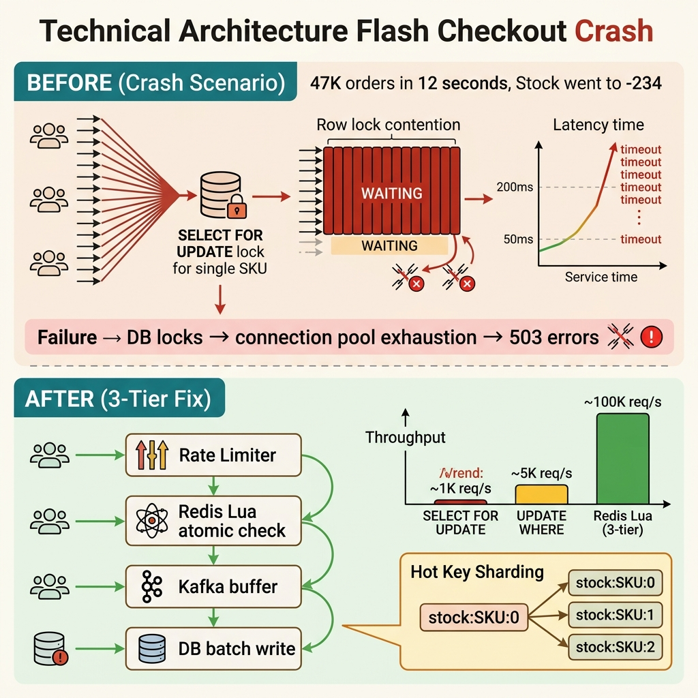

<!-- tags: best-practice, production, high-traffic, ecommerce -->
# 💥 Flash Sale Sập Checkout — Post-mortem & Kiến Trúc Chịu Tải

> Câu chuyện đêm flash sale sập hệ thống thanh toán, khám nghiệm tử thi, và kiến trúc 3 tầng để không bao giờ lặp lại

📅 Ngày tạo: 2026-03-22 · 🔄 Cập nhật: 2026-04-04 · ⏱️ 14 phút đọc

| Aspect          | Detail                                                            |
| --------------- | ----------------------------------------------------------------- |
| **Incident**    | 20,000 req/s → DB CPU 100% → toàn bộ checkout trả 500             |
| **Root cause**  | `SELECT FOR UPDATE` serialize 20K requests vào 1 row              |
| **Fix**         | 3-tier: Redis Lua (gatekeeper) → Kafka (buffer) → DB (safety net) |
| **Go packages** | `go-redis/v9`, `segmentio/kafka-go`, `database/sql`               |

---

## 1. DEFINE

Flash sale mở lúc 20:00. 20:00:03, checkout API response time nhảy từ 200ms lên 45 giây. 20:00:07, connection pool exhausted. 20:00:12, health check fail, pod restart. 20:00:15, tất cả 8 pods đang restart cùng lúc — zero capacity. 30,000 users thấy 502 Bad Gateway. Marketing team đã chi $200K quảng cáo cho event này.

Checkout không chết vì business logic quá phức tạp. Nó thường chết vì một nút nóng duy nhất bị hàng chục nghìn request đập vào cùng lúc. `Flash Sale Checkout Crash` là bài post-mortem điển hình: hệ thống tưởng như bình thường ở ngày thường, nhưng đêm event lại lộ hết những bottleneck từng được tha thứ.

Điều nguy hiểm nhất ở flash sale là mọi sai lầm đều bị khuếch đại. Một câu `SELECT ... FOR UPDATE`, một cache cold start, hay một upstream chậm hơn 50ms cũng đủ kéo cả chuỗi checkout vào thundering herd. Best practice ở đây phải được viết từ góc nhìn sự cố, không phải từ góc nhìn demo.

Core insight: **Flash-sale resilience đến từ việc cắt peak đúng chỗ và giảm contention trên hot path trước khi nghĩ đến scale ngang đơn thuần.**

### 📖 Câu chuyện: "Đêm flash sale sập hệ thống"

**11:59 PM.** Flash sale bắt đầu lúc 00:00. Team ngồi trực. Slack im lặng. Mọi người tự tin — "đã test load 5,000 req/s rồi, ổn mà."

**00:00:00** — 20,000 request/giây đổ vào endpoint `/checkout`.

Hệ thống cũ: mỗi request → **lock row** trong bảng `orders` → check stock → trừ stock → tạo order → commit.

**00:03:12** — DB CPU 100%, connection pool cạn kiệt, toàn bộ service trả về **500 Internal Server Error**. Slack nổ. Hotline reo. CTO gọi điện.

**00:05:00** — Team hotfix: tắt flash sale, scale DB lên gấp đôi. Nhưng đã muộn — 40% user đã rời đi, Twitter trending #[BrandName]SậpSale.

### 🔍 Khám nghiệm tử thi (Root Cause Analysis)

```
User → API Gateway → Application Server
                         │
                         ▼
              ┌─────────────────────────────────────┐
              │  BEGIN TRANSACTION                   │
              │                                     │
              │  SELECT * FROM products              │
              │  WHERE id = 'iPhone-16'              │
              │  FOR UPDATE;  ◄── TỬ HUYỆT          │
              │                                     │
              │  -- 20,000 request xếp hàng ở đây   │
              │  -- Chỉ 1 transaction hold lock      │
              │  -- 19,999 request chờ → timeout     │
              │  -- Timeout → retry → càng tệ hơn   │
              │                                     │
              │  UPDATE products                     │
              │  SET stock = stock - 1               │
              │  WHERE id = 'iPhone-16';             │
              │                                     │
              │  INSERT INTO orders (...) VALUES (); │
              │                                     │
              │  COMMIT;                             │
              └─────────────────────────────────────┘
```

**Tại sao `SELECT FOR UPDATE` là tử huyệt?**

| Đặc điểm                       | Giải thích                                                                        |
| ------------------------------ | --------------------------------------------------------------------------------- |
| **Row-level exclusive lock**   | Chỉ 1 transaction hold lock trên row `iPhone-16` tại 1 thời điểm                  |
| **Serialized execution**       | 20,000 requests bị xếp hàng tuần tự, throughput = 1 request / transaction time    |
| **Lock wait timeout**          | Transaction chờ quá lâu → timeout → client retry → **thundering herd**            |
| **Connection pool exhaustion** | Mỗi transaction giữ 1 connection chờ lock → pool cạn → mọi service khác cũng chết |
| **Cascading failure**          | DB overload → app timeout → LB health check fail → toàn bộ pod restart            |

**Toán nhanh**: Giả sử mỗi transaction mất **50ms** (best case). Throughput tối đa = `1000ms / 50ms = 20 transactions/s`. Với 20,000 req/s, thời gian chờ trung bình = **20,000 / 20 = 1,000 giây ≈ 16 phút**. Không user nào chờ được.

### So sánh: Trước vs Sau

| Metric         | Trước (DB direct)             | Sau (3-tier)                             |
| -------------- | ----------------------------- | ---------------------------------------- |
| Throughput     | ~20 req/s (serialized)        | 100,000+ req/s                           |
| P99 latency    | Timeout (30s+)                | < 5ms (Redis layer)                      |
| DB load        | CPU 100%, connection pool cạn | < 10% CPU, consumer batch write          |
| Stock accuracy | ✅ Strong consistency         | ✅ Eventually consistent (DB safety net) |
| Recovery       | Manual intervention           | Auto (reservation TTL + warm-up)         |

---

Các failure mode trên nghe rõ — nhưng có trap thật sự đau: SELECT FOR UPDATE trên hot product row = serialize 20,000 request = throughput = 1/tx_time = toán học bảo chắc phải sập. Và cache stampede khi Redis restart = DB nhận full load. Trap đó sẽ xuất hiện ở PITFALLS.

## 2. VISUAL

Muốn hiểu vì sao checkout sập, bạn phải nhìn được request storm đập vào đâu và hàng đợi hình thành ở lớp nào. Trace dưới đây làm lộ đúng điểm nghẽn đó.



### Kiến trúc "Sau đêm đó" — 3 tầng chịu tải

```
  20,000 req/s
       │
       ▼
┌──────────────────────────────────────────────────────────────────────┐
│  TẦNG 1: REDIS — Quầy thu ngân (< 1ms)                              │
│                                                                      │
│  ┌───────────────┐     ┌─────────────────────────────────────────┐  │
│  │  ① Dedup      │────▶│  ② Lua Script (atomic)                  │  │
│  │  SetNX        │     │                                         │  │
│  │  order:{id}   │     │  local stock = GET stock:{sku}          │  │
│  │  EX 300       │     │  if stock >= qty then                   │  │
│  │               │     │    DECRBY stock:{sku} qty               │  │
│  │  Lần 2 bấm?  │     │    SET reserve:{orderID} qty EX 600     │  │
│  │  → reject!    │     │    return 1  ✅                          │  │
│  └───────────────┘     │  else                                   │  │
│                        │    return 0  ❌ hết hàng                 │  │
│  Kết quả:              │  end                                    │  │
│  18,000 req → reject   └─────────────────────────────────────────┘  │
│   2,000 req → success                                                │
│   DB không thấy 18,000 req kia!                                      │
└────────────────────────────┬─────────────────────────────────────────┘
                             │ 2,000 events (đã lọc)
                             ▼
┌──────────────────────────────────────────────────────────────────────┐
│  TẦNG 2: KAFKA — Hàng rào chắn sóng                                 │
│                                                                      │
│  Topic: order.created                                                │
│  ┌──────────┐ ┌──────────┐ ┌──────────┐                            │
│  │ Part. 0  │ │ Part. 1  │ │ Part. 2  │  ← Key = SKU               │
│  │ 700 msgs │ │ 650 msgs │ │ 650 msgs │                            │
│  └──────────┘ └──────────┘ └──────────┘                            │
│                                                                      │
│  Spike 2,000 msg đổ vào → Consumer kéo ra từ từ                     │
│  DB nhận đều đặn 200 writes/s thay vì 2,000 cùng lúc                │
└────────────────────────────┬─────────────────────────────────────────┘
                             │ batch 50-100 msgs
                             ▼
┌──────────────────────────────────────────────────────────────────────┐
│  TẦNG 3: DATABASE — Kho hàng (Source of Truth)                       │
│                                                                      │
│  Consumer Group (3 workers):                                         │
│  ┌───────────────────────────────────────────────────────────────┐  │
│  │  BEGIN TX;                                                     │  │
│  │    INSERT INTO orders (...) ON CONFLICT (order_id) DO NOTHING; │  │
│  │    UPDATE products SET stock = stock - qty                     │  │
│  │      WHERE sku = $1 AND stock >= qty;  ← SAFETY NET           │  │
│  │    IF rows_affected = 0 → ROLLBACK + compensate Redis          │  │
│  │  COMMIT;                                                       │  │
│  └───────────────────────────────────────────────────────────────┘  │
│                                                                      │
│  Ẩn dụ: DB là kho hàng — không ai xông vào kho lấy đồ              │
│          Redis là quầy thu ngân — kiểm phiếu trước khi xuất kho     │
└──────────────────────────────────────────────────────────────────────┘
```

### Timeline — Trước vs Sau

```
TRƯỚC (DB Direct):
00:00 ─────|████████████████████████████████████████| CPU 100%
           |▓▓▓▓▓▓▓▓▓▓▓▓▓▓▓▓▓▓▓▓▓▓▓▓▓▓▓▓▓▓▓▓▓▓▓▓▓▓| Connections: FULL
           |░░░░░░░░░░░░░░░░░░░░░░░░░░░░░░░░░░░░░░░░| Orders: 20/20,000
00:03 ───── SYSTEM DOWN ❌  (3 phút)

SAU (3-tier):
00:00 ─────|██░░░░░░░░░░░░░░░░░░░░░░░░░░░░░░░░░░░░░░| Redis: 15% CPU
           |█░░░░░░░░░░░░░░░░░░░░░░░░░░░░░░░░░░░░░░░░| DB: 8% CPU
           |████████████████████████████████████████████| Orders: 2,000/2,000
00:00:03 ── DONE ✅  (3 giây!)
```

### Reservation Pattern — Xử lý payment timeout

```
┌─────────────────────────────────────────────────────────────┐
│                  RESERVATION LIFECYCLE                        │
│                                                              │
│  User click "Mua"     Payment gateway      Kết quả           │
│       │                    │                   │              │
│       ▼                    │                   │              │
│  ┌─────────┐              │                   │              │
│  │ RESERVE  │ DECRBY stock │                   │              │
│  │ stock=99 │ SET reserve  │                   │              │
│  │ TTL=10m  │ {id} EX 600  │                   │              │
│  └────┬─────┘              │                   │              │
│       │                    │                   │              │
│       ├────── Path A: Payment success ────────▶│              │
│       │       (< 10 phút)  │                   │              │
│       │    DEL reserve:{id}│              ┌────┴────┐        │
│       │    INSERT DB order │              │CONFIRMED│        │
│       │                    │              └─────────┘        │
│       │                    │                                  │
│       └────── Path B: Timeout (10 phút) ──────▶│              │
│            TTL expire tự động                   │              │
│            Cron: INCRBY stock qty         ┌────┴────┐        │
│            Cancel order                   │ REFUNDED │        │
│                                           └─────────┘        │
│                                                              │
│  ✅ Stock không bao giờ bị "treo" vĩnh viễn                  │
└─────────────────────────────────────────────────────────────┘
```

### Redis Crash Recovery

```
             Redis crash!
                 💥
                 │
                 ▼
    ┌────────────────────────┐
    │  Redis Startup Hook    │
    │                        │
    │  ① Query DB:           │
    │     stock_db = 1000    │
    │                        │
    │  ② Query pending:      │
    │     SUM(pending) = 150 │
    │                        │
    │  ③ Calculate:          │
    │     1000 - 150 = 850   │
    │                        │
    │  ④ SET stock:{sku} 850 │
    │                        │
    │  ⑤ Warm-up complete    │
    │     → Mở traffic       │
    └────────────────────────┘

    ⚠️ Rule: Traffic chỉ được vào SAU KHI warm-up xong
```

---

Bây giờ bạn đã thấy cascade crash diễn ra. Câu hỏi tiếp theo: code nào ngăn nó xảy ra lần nữa? Ta bắt đầu từ connection pool management rồi leo đến kiến trúc chịu tải.

## 3. CODE

Khi bottleneck đã hiện ra, code fix không còn là vá một câu query. Nó phải phản ánh rõ tầng nào chịu tải, tầng nào tách nhịp, và tầng nào chịu trách nhiệm hồi phục.

### Example 1: Basic — Hệ thống cũ bị sập (Anti-pattern)

Đây là code gốc gây ra sự cố. Mỗi request chạy full transaction với `SELECT FOR UPDATE`. Khi 20,000 request cùng lock 1 row → serialize → timeout → crash.

```go
package checkout

import (
	"context"
	"database/sql"
	"fmt"
	"time"
)

// ❌ ANTI-PATTERN: Code gốc gây sập flash sale
// Mỗi request lock row → chỉ 1 transaction chạy tại 1 thời điểm
type LegacyCheckoutService struct {
	db *sql.DB
}

func (s *LegacyCheckoutService) Checkout(ctx context.Context, req CheckoutRequest) error {
	// ⚠️ Bắt đầu transaction — giữ 1 connection từ pool
	tx, err := s.db.BeginTx(ctx, &sql.TxOptions{
		Isolation: sql.LevelReadCommitted,
	})
	if err != nil {
		return fmt.Errorf("begin tx: %w", err)
	}
	defer tx.Rollback()

	// ⚠️ TỬ HUYỆT: SELECT FOR UPDATE lock row
	// 20,000 request xếp hàng ở ĐÂY
	// Transaction 1 hold lock → 19,999 request chờ
	// Mỗi transaction ~50ms → throughput = 20 req/s
	var currentStock int
	err = tx.QueryRowContext(ctx, `
		SELECT stock FROM products
		WHERE id = $1
		FOR UPDATE
	`, req.ProductID).Scan(&currentStock)
	if err != nil {
		return fmt.Errorf("select for update: %w", err)
	}

	if currentStock < req.Quantity {
		return fmt.Errorf("out of stock: have %d, need %d", currentStock, req.Quantity)
	}

	// ⚠️ Lock vẫn đang hold — các request khác vẫn chờ
	_, err = tx.ExecContext(ctx, `
		UPDATE products
		SET stock = stock - $1
		WHERE id = $2
	`, req.Quantity, req.ProductID)
	if err != nil {
		return fmt.Errorf("update stock: %w", err)
	}

	_, err = tx.ExecContext(ctx, `
		INSERT INTO orders (id, product_id, user_id, quantity, status, created_at)
		VALUES ($1, $2, $3, $4, 'confirmed', $5)
	`, req.OrderID, req.ProductID, req.UserID, req.Quantity, time.Now())
	if err != nil {
		return fmt.Errorf("insert order: %w", err)
	}

	// Commit xong mới release lock → request tiếp theo mới chạy được
	return tx.Commit()
}

type CheckoutRequest struct {
	OrderID   string
	ProductID string
	UserID    string
	Quantity  int
}
```
```typescript
// ❌ ANTI-PATTERN — Legacy SELECT FOR UPDATE (TypeScript + pg)
import { Pool } from 'pg';

class LegacyCheckoutService {
  constructor(private db: Pool) {}

  async checkout(orderID: string, productID: string, userID: string, quantity: number): Promise<void> {
    const client = await this.db.connect();
    try {
      await client.query('BEGIN');

      // ⚠️ TỬ HUYỆT: SELECT FOR UPDATE — serializes all requests on this row
      const { rows } = await client.query(
        `SELECT stock FROM products WHERE id = $1 FOR UPDATE`,
        [productID],
      );
      const currentStock: number = rows[0]?.stock ?? 0;
      if (currentStock < quantity) throw new Error(`out of stock: have ${currentStock}`);

      await client.query(
        `UPDATE products SET stock = stock - $1 WHERE id = $2`,
        [quantity, productID],
      );
      await client.query(
        `INSERT INTO orders (id, product_id, user_id, quantity, status, created_at)
         VALUES ($1, $2, $3, $4, 'confirmed', NOW())`,
        [orderID, productID, userID, quantity],
      );

      await client.query('COMMIT');
    } catch (err) {
      await client.query('ROLLBACK');
      throw err;
    } finally {
      client.release();
    }
  }
}
```
```rust
// ❌ ANTI-PATTERN — Legacy SELECT FOR UPDATE (Rust + sqlx)
use sqlx::PgPool;

struct LegacyCheckoutService { db: PgPool }

impl LegacyCheckoutService {
    async fn checkout(&self, order_id: &str, product_id: &str,
                      user_id: &str, quantity: i64) -> anyhow::Result<()> {
        let mut tx = self.db.begin().await?;

        // ⚠️ TỬ HUYỆT: SELECT FOR UPDATE — serializes all concurrent requests
        let row = sqlx::query!("SELECT stock FROM products WHERE id = $1 FOR UPDATE", product_id)
            .fetch_one(&mut *tx).await?;
        if row.stock < quantity { anyhow::bail!("out of stock"); }

        sqlx::query!("UPDATE products SET stock = stock - $1 WHERE id = $2", quantity, product_id)
            .execute(&mut *tx).await?;
        sqlx::query!(
            "INSERT INTO orders (id, product_id, user_id, quantity, status, created_at)
             VALUES ($1, $2, $3, $4, 'confirmed', NOW())",
            order_id, product_id, user_id, quantity,
        )
        .execute(&mut *tx).await?;

        tx.commit().await?;
        Ok(())
    }
}
```
```cpp
// ❌ ANTI-PATTERN — Legacy SELECT FOR UPDATE (C++ + libpqxx)
#include <pqxx/pqxx>
#include <stdexcept>

class LegacyCheckoutService {
    pqxx::connection& db_;
public:
    explicit LegacyCheckoutService(pqxx::connection& db) : db_(db) {}

    void checkout(const std::string& order_id, const std::string& product_id,
                  const std::string& user_id, int quantity) {
        pqxx::work tx(db_);

        // ⚠️ TỬ HUYỆT: SELECT FOR UPDATE — serializes all concurrent requests
        auto r = tx.exec_params1("SELECT stock FROM products WHERE id = $1 FOR UPDATE", product_id);
        int stock = r[0].as<int>();
        if (stock < quantity) throw std::runtime_error("out of stock");

        tx.exec_params("UPDATE products SET stock = stock - $1 WHERE id = $2",
                       quantity, product_id);
        tx.exec_params(
            "INSERT INTO orders (id, product_id, user_id, quantity, status)"
            " VALUES ($1,$2,$3,$4,'confirmed')",
            order_id, product_id, user_id, quantity);

        tx.commit();
    }
};
```
```python
# ❌ ANTI-PATTERN — Legacy SELECT FOR UPDATE (Python + psycopg)
class LegacyCheckoutService:
    def __init__(self, db) -> None:
        self.db = db

    def checkout(self, order_id: str, product_id: str, user_id: str, quantity: int) -> None:
        with self.db.transaction() as tx:
            row = tx.query_one(
                "SELECT stock FROM products WHERE id = %s FOR UPDATE",
                (product_id,),
            )
            stock = int(row["stock"])
            if stock < quantity:
                raise ValueError("out of stock")

            tx.execute("UPDATE products SET stock = stock - %s WHERE id = %s", (quantity, product_id))
            tx.execute(
                """
                INSERT INTO orders (id, product_id, user_id, quantity, status, created_at)
                VALUES (%s, %s, %s, %s, 'confirmed', NOW())
                """,
                (order_id, product_id, user_id, quantity),
            )
```

**Hậu quả**: Với 20,000 req/s và mỗi transaction 50ms, throughput = 20 req/s. Request cuối cùng chờ **20,000 / 20 = 1,000 giây ≈ 16 phút**. Connection pool (default 100) cạn sau 5 giây. Game over.

---

Anti-pattern đã lộ tử huyệt. Redis Lua + dedup là lớp phòng thủ đầu tiên — hãy fix.

### Example 2: Intermediate — Redis Lua + Deduplication

Hệ thống mới: chặn tại Redis, user bấm 2 lần cũng chỉ xử lý 1 lần. DB không bao giờ thấy 18,000 request hết stock.

```go
package checkout

import (
	"context"
	"fmt"
	"time"

	"github.com/redis/go-redis/v9"
)

// ─── Lua script: dedup + check stock + reserve — 1 roundtrip ───
// ✅ Tất cả chạy atomic trên Redis single-thread
var checkoutScript = redis.NewScript(`
	local dedup_key = KEYS[1]     -- dedup:order:{orderID}
	local stock_key = KEYS[2]     -- stock:{sku}
	local reserve_key = KEYS[3]   -- reserve:{orderID}
	local qty = tonumber(ARGV[1])
	local ttl = tonumber(ARGV[2])

	-- ① Dedup: đã xử lý order này chưa?
	if redis.call('EXISTS', dedup_key) == 1 then
		return -2  -- duplicate request
	end

	-- ② Check + trừ stock
	local stock = tonumber(redis.call('GET', stock_key) or 0)
	if stock < qty then
		return -1  -- hết hàng
	end

	-- ③ Atomic: trừ stock + mark dedup + tạo reservation
	redis.call('DECRBY', stock_key, qty)
	redis.call('SET', dedup_key, '1', 'EX', 86400)       -- dedup 24h
	redis.call('SET', reserve_key, qty, 'EX', ttl)        -- reservation 10m

	return stock - qty  -- ✅ stock còn lại
`)

type FlashSaleCheckout struct {
	redis      *redis.Client
	reserveTTL time.Duration
}

func NewFlashSaleCheckout(rdb *redis.Client) *FlashSaleCheckout {
	return &FlashSaleCheckout{
		redis:      rdb,
		reserveTTL: 10 * time.Minute,
	}
}

// TryReserve — chặn cổng tại Redis, < 1ms
func (c *FlashSaleCheckout) TryReserve(ctx context.Context, orderID, sku string, qty int) (int64, error) {
	dedupKey := fmt.Sprintf("dedup:order:%s", orderID)
	stockKey := fmt.Sprintf("stock:%s", sku)
	reserveKey := fmt.Sprintf("reserve:%s", orderID)

	result, err := checkoutScript.Run(ctx, c.redis,
		[]string{dedupKey, stockKey, reserveKey},
		qty, int(c.reserveTTL.Seconds()),
	).Int64()

	if err != nil {
		return 0, fmt.Errorf("redis checkout script: %w", err)
	}

	switch {
	case result == -2:
		// ⚠️ User bấm "Mua" 2 lần trong 0.3s → reject lần 2
		return 0, ErrDuplicateOrder
	case result == -1:
		// ⚠️ Hết hàng — 18,000 request reject ở đây, DB không thấy
		return 0, ErrSoldOut
	default:
		// ✅ Chỉ 2,000 request thành công đi tiếp
		return result, nil
	}
}

// ConfirmPayment — gọi sau khi payment gateway trả success
func (c *FlashSaleCheckout) ConfirmPayment(ctx context.Context, orderID string) error {
	reserveKey := fmt.Sprintf("reserve:%s", orderID)
	// Xoá reservation — stock đã trừ vĩnh viễn
	return c.redis.Del(ctx, reserveKey).Err()
}

// CancelReservation — hoàn stock khi user cancel hoặc payment fail
func (c *FlashSaleCheckout) CancelReservation(ctx context.Context, orderID, sku string) error {
	reserveKey := fmt.Sprintf("reserve:%s", orderID)

	// Lấy số lượng đã reserve
	qtyStr, err := c.redis.Get(ctx, reserveKey).Result()
	if err == redis.Nil {
		return nil // Đã expire hoặc đã confirm
	}
	if err != nil {
		return err
	}

	qty, _ := fmt.Sscanf(qtyStr, "%d")

	// Hoàn stock + xoá reservation
	pipe := c.redis.Pipeline()
	pipe.IncrBy(ctx, fmt.Sprintf("stock:%s", sku), int64(qty))
	pipe.Del(ctx, reserveKey)
	_, err = pipe.Exec(ctx)
	return err
}

var (
	ErrDuplicateOrder = fmt.Errorf("duplicate order: already processing")
	ErrSoldOut        = fmt.Errorf("sold out")
)
```
```typescript
// TypeScript — Redis Lua + Deduplication (ioredis)
import Redis from 'ioredis';

const checkoutScript = `
  local dedup_key    = KEYS[1]
  local stock_key    = KEYS[2]
  local reserve_key  = KEYS[3]
  local qty          = tonumber(ARGV[1])
  local ttl          = tonumber(ARGV[2])
  if redis.call('EXISTS', dedup_key) == 1 then return -2 end
  local stock = tonumber(redis.call('GET', stock_key) or 0)
  if stock < qty then return -1 end
  redis.call('DECRBY', stock_key, qty)
  redis.call('SET', dedup_key, '1', 'EX', 86400)
  redis.call('SET', reserve_key, qty, 'EX', ttl)
  return stock - qty
`;

class FlashSaleCheckout {
  private reserveTTLSeconds = 600;

  constructor(private redis: Redis) {
    (this.redis as any).defineCommand('flashCheckout', {
      numberOfKeys: 3,
      lua: checkoutScript,
    });
  }

  async tryReserve(orderID: string, sku: string, qty: number): Promise<number> {
    const result = await (this.redis as any).flashCheckout(
      `dedup:order:${orderID}`,
      `stock:${sku}`,
      `reserve:${orderID}`,
      qty,
      this.reserveTTLSeconds,
    ) as number;

    if (result === -2) throw new Error('duplicate order: already processing');
    if (result === -1) throw new Error('sold out');
    return result;
  }

  async confirmPayment(orderID: string): Promise<void> {
    await this.redis.del(`reserve:${orderID}`);
  }

  async cancelReservation(orderID: string, sku: string): Promise<void> {
    const reserveKey = `reserve:${orderID}`;
    const qtyStr = await this.redis.get(reserveKey);
    if (!qtyStr) return;
    const qty = parseInt(qtyStr, 10);
    const pipe = this.redis.pipeline();
    pipe.incrby(`stock:${sku}`, qty);
    pipe.del(reserveKey);
    await pipe.exec();
  }
}
```
```rust
// Rust — Redis Lua + Deduplication (redis crate)
use redis::{AsyncCommands, Script};

const CHECKOUT_SCRIPT: &str = r#"
  local dedup_key   = KEYS[1]
  local stock_key   = KEYS[2]
  local reserve_key = KEYS[3]
  local qty = tonumber(ARGV[1])
  local ttl = tonumber(ARGV[2])
  if redis.call('EXISTS', dedup_key) == 1 then return -2 end
  local stock = tonumber(redis.call('GET', stock_key) or 0)
  if stock < qty then return -1 end
  redis.call('DECRBY', stock_key, qty)
  redis.call('SET', dedup_key, '1', 'EX', 86400)
  redis.call('SET', reserve_key, qty, 'EX', ttl)
  return stock - qty
"#;

struct FlashSaleCheckout {
    client: redis::Client,
    reserve_ttl: i64,
}

impl FlashSaleCheckout {
    async fn try_reserve(&self, order_id: &str, sku: &str, qty: i64) -> anyhow::Result<i64> {
        let mut con = self.client.get_async_connection().await?;
        let result: i64 = Script::new(CHECKOUT_SCRIPT)
            .key(format!("dedup:order:{}", order_id))
            .key(format!("stock:{}", sku))
            .key(format!("reserve:{}", order_id))
            .arg(qty)
            .arg(self.reserve_ttl)
            .invoke_async(&mut con)
            .await?;

        match result {
            -2 => anyhow::bail!("duplicate order"),
            -1 => anyhow::bail!("sold out"),
            r  => Ok(r),
        }
    }

    async fn confirm_payment(&self, order_id: &str) -> anyhow::Result<()> {
        let mut con = self.client.get_async_connection().await?;
        con.del(format!("reserve:{}", order_id)).await?;
        Ok(())
    }

    async fn cancel_reservation(&self, order_id: &str, sku: &str) -> anyhow::Result<()> {
        let mut con = self.client.get_async_connection().await?;
        let reserve_key = format!("reserve:{}", order_id);
        let qty: Option<i64> = con.get(&reserve_key).await?;
        if let Some(q) = qty {
            redis::pipe()
                .incr(format!("stock:{}", sku), q)
                .del(&reserve_key)
                .query_async(&mut con)
                .await?;
        }
        Ok(())
    }
}
```
```cpp
// C++ — Redis Lua + Deduplication (cpp_redis)
#include <cpp_redis/cpp_redis>
#include <stdexcept>
#include <string>

const std::string CHECKOUT_SCRIPT = R"(
  local dedup_key   = KEYS[1]
  local stock_key   = KEYS[2]
  local reserve_key = KEYS[3]
  local qty = tonumber(ARGV[1])
  local ttl = tonumber(ARGV[2])
  if redis.call('EXISTS', dedup_key) == 1 then return -2 end
  local stock = tonumber(redis.call('GET', stock_key) or 0)
  if stock < qty then return -1 end
  redis.call('DECRBY', stock_key, qty)
  redis.call('SET', dedup_key, '1', 'EX', 86400)
  redis.call('SET', reserve_key, qty, 'EX', ttl)
  return stock - qty
)";

class FlashSaleCheckout {
    cpp_redis::client& redis_;
    int reserve_ttl_{600};

public:
    explicit FlashSaleCheckout(cpp_redis::client& redis) : redis_(redis) {}

    int64_t try_reserve(const std::string& order_id,
                        const std::string& sku, int64_t qty) {
        auto fut = redis_.eval(CHECKOUT_SCRIPT, 3,
            {"dedup:order:" + order_id, "stock:" + sku, "reserve:" + order_id},
            {std::to_string(qty), std::to_string(reserve_ttl_)});
        redis_.sync_commit();

        int64_t result = fut.get().as_integer();
        if (result == -2) throw std::runtime_error("duplicate order");
        if (result == -1) throw std::runtime_error("sold out");
        return result;
    }

    void confirm_payment(const std::string& order_id) {
        redis_.del({"reserve:" + order_id});
        redis_.sync_commit();
    }

    void cancel_reservation(const std::string& order_id, const std::string& sku) {
        auto fut = redis_.get("reserve:" + order_id);
        redis_.sync_commit();
        auto r = fut.get();
        if (r.is_null()) return;
        int64_t qty = std::stoll(r.as_string());
        redis_.incrby("stock:" + sku, qty);
        redis_.del({"reserve:" + order_id});
        redis_.sync_commit();
    }
};
```
```python
import redis

CHECKOUT_SCRIPT = """
local dedup_key = KEYS[1]
local stock_key = KEYS[2]
local reserve_key = KEYS[3]
local qty = tonumber(ARGV[1])
local ttl = tonumber(ARGV[2])
if redis.call('EXISTS', dedup_key) == 1 then return -2 end
local stock = tonumber(redis.call('GET', stock_key) or 0)
if stock < qty then return -1 end
redis.call('DECRBY', stock_key, qty)
redis.call('SET', dedup_key, '1', 'EX', 86400)
redis.call('SET', reserve_key, qty, 'EX', ttl)
return stock - qty
"""

class FlashSaleCheckout:
    def __init__(self, client: redis.Redis, reserve_ttl_seconds: int = 600) -> None:
        self.redis = client
        self.reserve_ttl_seconds = reserve_ttl_seconds
        self.flash_checkout = self.redis.register_script(CHECKOUT_SCRIPT)

    def try_reserve(self, order_id: str, sku: str, qty: int) -> int:
        result = int(
            self.flash_checkout(
                keys=[f"dedup:order:{order_id}", f"stock:{sku}", f"reserve:{order_id}"],
                args=[qty, self.reserve_ttl_seconds],
            )
        )
        if result == -2:
            raise ValueError("duplicate order")
        if result == -1:
            raise ValueError("sold out")
        return result

    def confirm_payment(self, order_id: str) -> None:
        self.redis.delete(f"reserve:{order_id}")

    def cancel_reservation(self, order_id: str, sku: str) -> None:
        reserve_key = f"reserve:{order_id}"
        qty = self.redis.get(reserve_key)
        if qty is None:
            return
        pipe = self.redis.pipeline()
        pipe.incrby(f"stock:{sku}", int(qty))
        pipe.delete(reserve_key)
        pipe.execute()
```

**Kết luận**: 1 Lua script = 1 Redis roundtrip xử lý dedup + stock check + reservation. 18,000 request hết stock bị reject trong < 1ms mỗi request. DB hoàn toàn không biết có flash sale đang diễn ra.

---

Redis đã chặn sớm. Nhưng DB consumer cần exactly-once + compensation — hãy đảm bảo.

### Example 3: Advanced — Kafka Consumer + DB Safety Net + Compensation

Consumer kéo event từ Kafka, batch write DB. Nếu Redis-DB desync → DB reject → compensate ngược Redis. Handler HTTP trả 202 Accepted thay vì chờ DB write.

```go
package consumer

import (
	"context"
	"database/sql"
	"encoding/json"
	"fmt"
	"log"
	"time"

	"github.com/redis/go-redis/v9"
	"github.com/segmentio/kafka-go"
)

type OrderEvent struct {
	OrderID   string    `json:"order_id"`
	SKU       string    `json:"sku"`
	Quantity  int       `json:"quantity"`
	UserID    string    `json:"user_id"`
	Timestamp time.Time `json:"timestamp"`
}

// ─── HTTP Handler: trả 202 ngay sau Redis, không chờ DB ───
// File: handler.go (simplified)
/*
func (h *Handler) Checkout(w http.ResponseWriter, r *http.Request) {
    var req CheckoutRequest
    json.NewDecoder(r.Body).Decode(&req)

    // ① Redis: < 1ms
    remaining, err := h.flashSale.TryReserve(r.Context(), req.OrderID, req.SKU, req.Qty)
    if err != nil {
        http.Error(w, err.Error(), http.StatusConflict) // 409
        return
    }

    // ② Kafka: produce event (async)
    h.producer.Publish(OrderEvent{...})

    // ③ Trả 202 Accepted — không chờ DB
    // Client poll /api/orders/{id}/status để check kết quả
    w.WriteHeader(http.StatusAccepted)
    json.NewEncoder(w).Encode(map[string]any{
        "order_id":  req.OrderID,
        "remaining": remaining,
        "status":    "processing",
    })
}
*/

// ─── Kafka Consumer: ghi DB từ từ, không spike ───
type OrderConsumer struct {
	db    *sql.DB
	redis *redis.Client
	reader *kafka.Reader
}

func NewOrderConsumer(db *sql.DB, rdb *redis.Client, reader *kafka.Reader) *OrderConsumer {
	return &OrderConsumer{db: db, redis: rdb, reader: reader}
}

func (c *OrderConsumer) Run(ctx context.Context) error {
	log.Println("🚀 Order consumer started, processing events from Kafka...")

	for {
		select {
		case <-ctx.Done():
			log.Println("⏹️ Consumer shutting down gracefully")
			return ctx.Err()
		default:
		}

		// Fetch message — blocking call
		msg, err := c.reader.FetchMessage(ctx)
		if err != nil {
			log.Printf("⚠️ fetch: %v", err)
			time.Sleep(100 * time.Millisecond)
			continue
		}

		var event OrderEvent
		if err := json.Unmarshal(msg.Value, &event); err != nil {
			log.Printf("⚠️ bad message, skipping: %v", err)
			c.reader.CommitMessages(ctx, msg) // Skip corrupt
			continue
		}

		// Process with idempotent DB write
		if err := c.processOrder(ctx, event); err != nil {
			log.Printf("❌ order %s failed: %v — will retry", event.OrderID, err)
			// Không commit → Kafka tự re-deliver
			time.Sleep(time.Second) // Backoff trước khi retry
			continue
		}

		// ✅ Commit offset — message đã xử lý thành công
		if err := c.reader.CommitMessages(ctx, msg); err != nil {
			log.Printf("⚠️ commit offset: %v", err)
		}
	}
}

func (c *OrderConsumer) processOrder(ctx context.Context, event OrderEvent) error {
	tx, err := c.db.BeginTx(ctx, &sql.TxOptions{
		Isolation: sql.LevelReadCommitted,
	})
	if err != nil {
		return fmt.Errorf("begin tx: %w", err)
	}
	defer tx.Rollback()

	// ① Idempotent insert — ON CONFLICT DO NOTHING
	// Kafka re-delivery sẽ không tạo duplicate order
	result, err := tx.ExecContext(ctx, `
		INSERT INTO orders (order_id, sku, quantity, user_id, status, created_at)
		VALUES ($1, $2, $3, $4, 'confirmed', $5)
		ON CONFLICT (order_id) DO NOTHING
	`, event.OrderID, event.SKU, event.Quantity, event.UserID, event.Timestamp)
	if err != nil {
		return fmt.Errorf("insert order: %w", err)
	}

	rowsInserted, _ := result.RowsAffected()
	if rowsInserted == 0 {
		// Order đã tồn tại (idempotent) — skip
		log.Printf("ℹ️ order %s already exists, skipping", event.OrderID)
		return nil
	}

	// ② Safety net: UPDATE WHERE stock >= qty
	// ⚠️ Đây là lớp bảo vệ cuối cùng — DB là source of truth
	stockResult, err := tx.ExecContext(ctx, `
		UPDATE products
		SET stock = stock - $1, updated_at = NOW()
		WHERE sku = $2 AND stock >= $1
	`, event.Quantity, event.SKU)
	if err != nil {
		return fmt.Errorf("update stock: %w", err)
	}

	stockRows, _ := stockResult.RowsAffected()
	if stockRows == 0 {
		// ⚠️ DB stock không đủ — Redis và DB bị desync!
		// Compensate: hoàn stock Redis + mark order failed
		log.Printf("⚠️ DB STOCK INSUFFICIENT for %s — compensating Redis", event.OrderID)

		// Rollback DB insert
		tx.Rollback()

		// Compensate Redis
		c.compensate(ctx, event)
		return nil // Đã xử lý xong, không retry
	}

	// ③ Commit
	if err := tx.Commit(); err != nil {
		return fmt.Errorf("commit: %w", err)
	}

	// ④ Xoá reservation (đã confirm chính thức)
	c.redis.Del(ctx, fmt.Sprintf("reserve:%s", event.OrderID))

	log.Printf("✅ Order %s committed — sku=%s qty=%d", event.OrderID, event.SKU, event.Quantity)
	return nil
}

func (c *OrderConsumer) compensate(ctx context.Context, event OrderEvent) {
	stockKey := fmt.Sprintf("stock:%s", event.SKU)
	reserveKey := fmt.Sprintf("reserve:%s", event.OrderID)
	dedupKey := fmt.Sprintf("dedup:order:%s", event.OrderID)

	pipe := c.redis.Pipeline()
	pipe.IncrBy(ctx, stockKey, int64(event.Quantity))  // Hoàn stock
	pipe.Del(ctx, reserveKey)                           // Xoá reservation
	pipe.Set(ctx, dedupKey, "failed", 24*time.Hour)     // Mark failed

	if _, err := pipe.Exec(ctx); err != nil {
		// ❌ CRITICAL: Compensate thất bại → cần alert + manual fix
		log.Printf("❌ CRITICAL: compensate failed for %s: %v", event.OrderID, err)
		// TODO: Push to dead letter queue + PagerDuty alert
	}

	log.Printf("🔄 Compensated order %s — stock returned to Redis", event.OrderID)
}
```
```typescript
// TypeScript — Kafka Consumer + DB Safety Net + Compensation (kafkajs + pg)
import { Consumer, EachMessagePayload } from 'kafkajs';
import { Pool, PoolClient } from 'pg';
import Redis from 'ioredis';

interface OrderEvent {
  order_id: string;
  sku: string;
  quantity: number;
  user_id: string;
  timestamp: string;
}

class OrderConsumer {
  constructor(
    private db: Pool,
    private redis: Redis,
    private consumer: Consumer,
  ) {}

  async run(): Promise<void> {
    await this.consumer.run({
      eachMessage: async ({ message }: EachMessagePayload) => {
        if (!message.value) return;
        const event: OrderEvent = JSON.parse(message.value.toString());
        await this.processOrder(event);
      },
    });
  }

  private async processOrder(event: OrderEvent): Promise<void> {
    const client: PoolClient = await this.db.connect();
    try {
      await client.query('BEGIN');

      // ① Idempotent insert — ON CONFLICT DO NOTHING
      const insertResult = await client.query(
        `INSERT INTO orders (order_id, sku, quantity, user_id, status, created_at)
         VALUES ($1,$2,$3,$4,'confirmed',$5) ON CONFLICT (order_id) DO NOTHING`,
        [event.order_id, event.sku, event.quantity, event.user_id, event.timestamp],
      );

      if (insertResult.rowCount === 0) {
        await client.query('COMMIT');
        return; // Idempotent — already exists
      }

      // ② Safety net: WHERE stock >= qty
      const stockResult = await client.query(
        `UPDATE products SET stock = stock - $1, updated_at = NOW()
         WHERE sku = $2 AND stock >= $1`,
        [event.quantity, event.sku],
      );

      if (stockResult.rowCount === 0) {
        await client.query('ROLLBACK');
        await this.compensate(event);
        return;
      }

      await client.query('COMMIT');
      await this.redis.del(`reserve:${event.order_id}`);
    } catch (err) {
      await client.query('ROLLBACK');
      throw err;
    } finally {
      client.release();
    }
  }

  private async compensate(event: OrderEvent): Promise<void> {
    const pipe = this.redis.pipeline();
    pipe.incrby(`stock:${event.sku}`, event.quantity);
    pipe.del(`reserve:${event.order_id}`);
    pipe.set(`dedup:order:${event.order_id}`, 'failed', 'EX', 86400);
    await pipe.exec();
  }
}
```
```rust
// Rust — Kafka Consumer + DB Safety Net + Compensation (rdkafka + sqlx)
use rdkafka::consumer::{CommitMode, Consumer as _, StreamConsumer};
use rdkafka::Message;
use redis::AsyncCommands;
use serde::Deserialize;
use sqlx::PgPool;

#[derive(Deserialize)]
struct OrderEvent {
    order_id: String,
    sku: String,
    quantity: i64,
    user_id: String,
    timestamp: chrono::DateTime<chrono::Utc>,
}

struct OrderConsumer {
    db: PgPool,
    redis: redis::Client,
    consumer: StreamConsumer,
}

impl OrderConsumer {
    async fn process_order(&self, event: OrderEvent) -> anyhow::Result<()> {
        let mut tx = self.db.begin().await?;

        // ① Idempotent insert
        let inserted = sqlx::query!(
            r#"INSERT INTO orders (order_id, sku, quantity, user_id, status, created_at)
               VALUES ($1,$2,$3,$4,'confirmed',$5) ON CONFLICT (order_id) DO NOTHING"#,
            event.order_id, event.sku, event.quantity, event.user_id, event.timestamp,
        )
        .execute(&mut *tx).await?.rows_affected();

        if inserted == 0 {
            tx.commit().await?;
            return Ok(());
        }

        // ② Safety net
        let updated = sqlx::query!(
            "UPDATE products SET stock = stock - $1, updated_at = NOW()
             WHERE sku = $2 AND stock >= $1",
            event.quantity, event.sku,
        )
        .execute(&mut *tx).await?.rows_affected();

        if updated == 0 {
            tx.rollback().await?;
            self.compensate(&event).await?;
            return Ok(());
        }

        tx.commit().await?;
        let mut con = self.redis.get_async_connection().await?;
        con.del(format!("reserve:{}", event.order_id)).await?;
        Ok(())
    }

    async fn compensate(&self, event: &OrderEvent) -> anyhow::Result<()> {
        let mut con = self.redis.get_async_connection().await?;
        redis::pipe()
            .incr(format!("stock:{}", event.sku), event.quantity)
            .del(format!("reserve:{}", event.order_id))
            .set_ex(format!("dedup:order:{}", event.order_id), "failed", 86400)
            .query_async(&mut con)
            .await?;
        Ok(())
    }
}
```
```cpp
// C++ — Kafka Consumer + DB Safety Net + Compensation (librdkafka + libpqxx + cpp_redis)
#include <librdkafka/rdkafkacpp.h>
#include <pqxx/pqxx>
#include <cpp_redis/cpp_redis>
#include <nlohmann/json.hpp>
#include <stdexcept>

class OrderConsumer {
    pqxx::connection& db_;
    cpp_redis::client& redis_;

public:
    OrderConsumer(pqxx::connection& db, cpp_redis::client& redis)
        : db_(db), redis_(redis) {}

    void process_order(const std::string& payload) {
        auto ev = nlohmann::json::parse(payload);
        std::string order_id = ev["order_id"];
        std::string sku      = ev["sku"];
        int64_t     quantity = ev["quantity"];
        std::string user_id  = ev["user_id"];

        try {
            pqxx::work tx(db_);

            // ① Idempotent insert
            auto r1 = tx.exec_params(
                "INSERT INTO orders (order_id,sku,quantity,user_id,status)"
                " VALUES ($1,$2,$3,$4,'confirmed') ON CONFLICT (order_id) DO NOTHING",
                order_id, sku, quantity, user_id);

            if (r1.affected_rows() == 0) { tx.commit(); return; }

            // ② Safety net: WHERE stock >= qty
            auto r2 = tx.exec_params(
                "UPDATE products SET stock = stock - $1, updated_at = NOW()"
                " WHERE sku = $2 AND stock >= $1",
                quantity, sku);

            if (r2.affected_rows() == 0) {
                tx.abort();
                compensate(sku, quantity, order_id);
                return;
            }

            tx.commit();
        } catch (const std::exception& e) {
            compensate(sku, quantity, order_id);
            throw;
        }

        redis_.del({"reserve:" + order_id});
        redis_.sync_commit();
    }

private:
    void compensate(const std::string& sku, int64_t qty,
                    const std::string& order_id) {
        redis_.incrby("stock:" + sku, qty);
        redis_.del({"reserve:" + order_id});
        redis_.setex("dedup:order:" + order_id, 86400, "failed");
        redis_.sync_commit();
    }
};
```
```python
class OrderConsumer:
    def __init__(self, db, redis_client, consumer) -> None:
        self.db = db
        self.redis = redis_client
        self.consumer = consumer

    def process_order(self, event: dict) -> None:
        with self.db.transaction() as tx:
            inserted = tx.execute(
                """
                INSERT INTO orders (order_id, sku, quantity, user_id, status, created_at)
                VALUES (%s, %s, %s, %s, 'confirmed', %s)
                ON CONFLICT (order_id) DO NOTHING
                """,
                (event["order_id"], event["sku"], event["quantity"], event["user_id"], event["timestamp"]),
            )
            if inserted.rowcount == 0:
                return

            updated = tx.execute(
                """
                UPDATE products
                SET stock = stock - %s, updated_at = NOW()
                WHERE sku = %s AND stock >= %s
                """,
                (event["quantity"], event["sku"], event["quantity"]),
            )
            if updated.rowcount == 0:
                tx.rollback()
                self.compensate(event)
                return

        self.redis.delete(f"reserve:{event['order_id']}")

    def compensate(self, event: dict) -> None:
        pipe = self.redis.pipeline()
        pipe.incrby(f"stock:{event['sku']}", event["quantity"])
        pipe.delete(f"reserve:{event['order_id']}")
        pipe.setex(f"dedup:order:{event['order_id']}", 86400, "failed")
        pipe.execute()
```

**Kết luận**: HTTP handler trả 202 trong < 5ms. Consumer ghi DB với tốc độ ổn định 200 writes/s thay vì 20,000 spike. `ON CONFLICT DO NOTHING` đảm bảo idempotent. `WHERE stock >= qty` là safety net cuối. Nếu Redis-DB desync → compensate + alert.

---

Consumer đã cover. Nhưng warm-up, recovery, và monitoring cần hoàn thiện — hãy production-ready.

### Example 4: Expert — Warm-up, Recovery & Monitoring

Trước flash sale: warm-up stock từ DB lên Redis. Sau Redis crash: recover chính xác. Monitoring: Prometheus metrics theo dõi desync.

```go
package ops

import (
	"context"
	"database/sql"
	"fmt"
	"log"
	"sync"
	"time"

	"github.com/redis/go-redis/v9"
)

type FlashSaleOps struct {
	db    *sql.DB
	redis *redis.Client
	mu    sync.Mutex
	ready bool // Flag: đã warm-up chưa?
}

func NewFlashSaleOps(db *sql.DB, rdb *redis.Client) *FlashSaleOps {
	return &FlashSaleOps{db: db, redis: rdb}
}

// ─────────────────────────────────────────────
// ① WARM-UP: Gọi TRƯỚC khi mở flash sale
// ─────────────────────────────────────────────
func (ops *FlashSaleOps) WarmUp(ctx context.Context, skus []string) error {
	ops.mu.Lock()
	defer ops.mu.Unlock()

	log.Println("🔥 Flash sale warm-up starting...")
	start := time.Now()

	for _, sku := range skus {
		// Lấy stock hiện tại từ DB (source of truth)
		var dbStock int
		err := ops.db.QueryRowContext(ctx,
			"SELECT stock FROM products WHERE sku = $1", sku,
		).Scan(&dbStock)
		if err != nil {
			return fmt.Errorf("query stock %s: %w", sku, err)
		}

		// Trừ đi pending orders (đã reserve nhưng chưa ghi DB)
		var pendingQty int
		err = ops.db.QueryRowContext(ctx, `
			SELECT COALESCE(SUM(quantity), 0)
			FROM orders
			WHERE sku = $1 AND status IN ('pending', 'processing')
		`, sku).Scan(&pendingQty)
		if err != nil {
			return fmt.Errorf("query pending %s: %w", sku, err)
		}

		available := dbStock - pendingQty
		if available < 0 {
			available = 0
		}

		// Set stock lên Redis
		stockKey := fmt.Sprintf("stock:%s", sku)
		if err := ops.redis.Set(ctx, stockKey, available, 0).Err(); err != nil {
			return fmt.Errorf("set redis %s: %w", sku, err)
		}

		log.Printf("  ✅ %s: db_stock=%d pending=%d → redis_stock=%d",
			sku, dbStock, pendingQty, available)
	}

	ops.ready = true
	elapsed := time.Since(start)
	log.Printf("🔥 Warm-up complete! %d SKUs in %v — traffic ready", len(skus), elapsed)
	return nil
}

// IsReady — Middleware check: chỉ cho traffic vào sau warm-up
func (ops *FlashSaleOps) IsReady() bool {
	ops.mu.Lock()
	defer ops.mu.Unlock()
	return ops.ready
}

// ─────────────────────────────────────────────
// ② RECOVERY: Gọi khi Redis restart giữa sale
// ─────────────────────────────────────────────
func (ops *FlashSaleOps) RecoverAfterCrash(ctx context.Context, skus []string) error {
	ops.mu.Lock()
	defer ops.mu.Unlock()
	ops.ready = false // Tạm chặn traffic

	log.Println("🔄 Redis crash recovery starting...")

	for _, sku := range skus {
		// DB stock hiện tại
		var dbStock int
		ops.db.QueryRowContext(ctx,
			"SELECT stock FROM products WHERE sku = $1", sku,
		).Scan(&dbStock)

		// Tất cả orders chưa hoàn tất (pending + processing + reserved)
		var committedQty int
		ops.db.QueryRowContext(ctx, `
			SELECT COALESCE(SUM(quantity), 0)
			FROM orders
			WHERE sku = $1 AND status IN ('confirmed', 'pending', 'processing')
			  AND created_at > NOW() - INTERVAL '2 hours'
		`, sku).Scan(&committedQty)

		// ✅ Available = DB stock (DB đã trừ confirmed orders)
		// Chỉ cần trừ pending (chưa ghi DB nhưng đã reserve Redis)
		var pendingQty int
		ops.db.QueryRowContext(ctx, `
			SELECT COALESCE(SUM(quantity), 0)
			FROM orders
			WHERE sku = $1 AND status IN ('pending', 'processing')
		`, sku).Scan(&pendingQty)

		available := dbStock - pendingQty
		if available < 0 {
			available = 0
		}

		stockKey := fmt.Sprintf("stock:%s", sku)
		ops.redis.Set(ctx, stockKey, available, 0)

		log.Printf("  🔄 %s: db=%d pending=%d → redis=%d", sku, dbStock, pendingQty, available)
	}

	ops.ready = true
	log.Println("🔄 Recovery complete — traffic resumed")
	return nil
}

// ─────────────────────────────────────────────
// ③ RECONCILIATION: Cron job chạy mỗi 5 phút
// So sánh Redis vs DB, alert nếu desync
// ─────────────────────────────────────────────
func (ops *FlashSaleOps) Reconcile(ctx context.Context, skus []string) error {
	for _, sku := range skus {
		// Redis stock
		stockKey := fmt.Sprintf("stock:%s", sku)
		redisStock, err := ops.redis.Get(ctx, stockKey).Int64()
		if err != nil {
			continue
		}

		// DB: available = stock - pending
		var dbStock int
		ops.db.QueryRowContext(ctx,
			"SELECT stock FROM products WHERE sku = $1", sku,
		).Scan(&dbStock)

		var pendingQty int
		ops.db.QueryRowContext(ctx, `
			SELECT COALESCE(SUM(quantity), 0) FROM orders
			WHERE sku = $1 AND status IN ('pending', 'processing')
		`, sku).Scan(&pendingQty)

		dbAvailable := int64(dbStock - pendingQty)
		drift := redisStock - dbAvailable

		if drift < -5 || drift > 5 {
			// ⚠️ Desync > 5 units — alert!
			log.Printf("⚠️ DESYNC %s: redis=%d db_available=%d drift=%d",
				sku, redisStock, dbAvailable, drift)
			// TODO: Push Prometheus metric + Slack alert
			// metrics.StockDrift.WithLabelValues(sku).Set(float64(drift))
		}
	}
	return nil
}

// ─────────────────────────────────────────────
// ④ EXPIRED RESERVATION CLEANUP: Cron mỗi 1 phút
// Hoàn stock cho reservation đã expire mà chưa confirm
// ─────────────────────────────────────────────
func (ops *FlashSaleOps) CleanupExpiredReservations(ctx context.Context) error {
	// Scan tất cả reservation keys
	iter := ops.redis.Scan(ctx, 0, "reserve:*", 100).Iterator()

	// Nếu key vẫn tồn tại → chưa expire → skip
	// Redis TTL tự xoá expired keys
	// Nhưng cần check DB: order pending quá lâu mà reserve đã expire

	rows, err := ops.db.QueryContext(ctx, `
		SELECT order_id, sku, quantity FROM orders
		WHERE status = 'pending'
		  AND created_at < NOW() - INTERVAL '15 minutes'
	`)
	if err != nil {
		return err
	}
	defer rows.Close()

	for rows.Next() {
		var orderID, sku string
		var qty int
		rows.Scan(&orderID, &sku, &qty)

		// Check reservation còn trong Redis không
		reserveKey := fmt.Sprintf("reserve:%s", orderID)
		exists, _ := ops.redis.Exists(ctx, reserveKey).Result()

		if exists == 0 {
			// Reservation expired (TTL) nhưng order vẫn pending
			// → Hoàn stock + cancel order
			stockKey := fmt.Sprintf("stock:%s", sku)
			ops.redis.IncrBy(ctx, stockKey, int64(qty))

			ops.db.ExecContext(ctx, `
				UPDATE orders SET status = 'cancelled', updated_at = NOW()
				WHERE order_id = $1 AND status = 'pending'
			`, orderID)

			log.Printf("🧹 Cleaned up expired reservation: order=%s sku=%s qty=%d",
				orderID, sku, qty)
		}
	}

	_ = iter // suppress unused warning
	return rows.Err()
}
```
```typescript
// TypeScript — Warm-up, Recovery & Reconciliation (ioredis + pg)
import Redis from 'ioredis';
import { Pool } from 'pg';

class FlashSaleOps {
  private ready = false;

  constructor(private db: Pool, private redis: Redis) {}

  async warmUp(skus: string[]): Promise<void> {
    console.log('🔥 Flash sale warm-up starting...');
    const start = Date.now();

    for (const sku of skus) {
      const { rows: stockRows } = await this.db.query(
        'SELECT stock FROM products WHERE sku = $1', [sku]);
      const dbStock: number = stockRows[0]?.stock ?? 0;

      const { rows: pendingRows } = await this.db.query(
        `SELECT COALESCE(SUM(quantity),0) AS pending FROM orders
         WHERE sku = $1 AND status IN ('pending','processing')`, [sku]);
      const pending = Number(pendingRows[0]?.pending ?? 0);

      const available = Math.max(0, dbStock - pending);
      await this.redis.set(`stock:${sku}`, available);
      console.log(`  ✅ ${sku}: db=${dbStock} pending=${pending} → redis=${available}`);
    }

    this.ready = true;
    console.log(`🔥 Warm-up complete! ${skus.length} SKUs in ${Date.now() - start}ms`);
  }

  isReady(): boolean { return this.ready; }

  async recoverAfterCrash(skus: string[]): Promise<void> {
    this.ready = false;
    console.log('🔄 Redis crash recovery starting...');

    for (const sku of skus) {
      const { rows: s } = await this.db.query(
        'SELECT stock FROM products WHERE sku = $1', [sku]);
      const dbStock: number = s[0]?.stock ?? 0;

      const { rows: p } = await this.db.query(
        `SELECT COALESCE(SUM(quantity),0) AS pending FROM orders
         WHERE sku = $1 AND status IN ('pending','processing')`, [sku]);
      const pending = Number(p[0]?.pending ?? 0);

      const available = Math.max(0, dbStock - pending);
      await this.redis.set(`stock:${sku}`, available);
      console.log(`  🔄 ${sku}: db=${dbStock} pending=${pending} → redis=${available}`);
    }

    this.ready = true;
    console.log('🔄 Recovery complete — traffic resumed');
  }

  async reconcile(skus: string[]): Promise<void> {
    for (const sku of skus) {
      const redisStockStr = await this.redis.get(`stock:${sku}`);
      if (redisStockStr === null) continue;
      const redisStock = Number(redisStockStr);

      const { rows: s } = await this.db.query(
        'SELECT stock FROM products WHERE sku = $1', [sku]);
      const dbStock: number = s[0]?.stock ?? 0;

      const { rows: p } = await this.db.query(
        `SELECT COALESCE(SUM(quantity),0) AS pending FROM orders
         WHERE sku=$1 AND status IN ('pending','processing')`, [sku]);
      const pending = Number(p[0]?.pending ?? 0);

      const dbAvailable = dbStock - pending;
      const drift = redisStock - dbAvailable;
      if (Math.abs(drift) > 5) {
        console.warn(`⚠️ DESYNC ${sku}: redis=${redisStock} db_available=${dbAvailable} drift=${drift}`);
      }
    }
  }
}
```
```rust
// Rust — Warm-up, Recovery & Reconciliation (redis + sqlx)
use redis::AsyncCommands;
use sqlx::PgPool;
use std::sync::atomic::{AtomicBool, Ordering};
use std::sync::Arc;

struct FlashSaleOps {
    db: PgPool,
    redis: redis::Client,
    ready: Arc<AtomicBool>,
}

impl FlashSaleOps {
    async fn warm_up(&self, skus: &[&str]) -> anyhow::Result<()> {
        println!("🔥 Flash sale warm-up starting...");
        let mut con = self.redis.get_async_connection().await?;

        for &sku in skus {
            let db_stock: i64 = sqlx::query_scalar!(
                "SELECT stock FROM products WHERE sku = $1", sku)
                .fetch_one(&self.db).await?;

            let pending: i64 = sqlx::query_scalar!(
                "SELECT COALESCE(SUM(quantity),0) FROM orders
                 WHERE sku=$1 AND status IN ('pending','processing')", sku)
                .fetch_one(&self.db).await?.unwrap_or(0);

            let available = (db_stock - pending).max(0);
            con.set(format!("stock:{}", sku), available).await?;
            println!("  ✅ {}: db={} pending={} → redis={}", sku, db_stock, pending, available);
        }

        self.ready.store(true, Ordering::SeqCst);
        println!("🔥 Warm-up complete!");
        Ok(())
    }

    fn is_ready(&self) -> bool {
        self.ready.load(Ordering::SeqCst)
    }

    async fn reconcile(&self, skus: &[&str]) -> anyhow::Result<()> {
        let mut con = self.redis.get_async_connection().await?;

        for &sku in skus {
            let redis_stock: Option<i64> = con.get(format!("stock:{}", sku)).await?;
            let Some(redis_stock) = redis_stock else { continue };

            let db_stock: i64 = sqlx::query_scalar!(
                "SELECT stock FROM products WHERE sku = $1", sku)
                .fetch_one(&self.db).await?;

            let pending: i64 = sqlx::query_scalar!(
                "SELECT COALESCE(SUM(quantity),0) FROM orders
                 WHERE sku=$1 AND status IN ('pending','processing')", sku)
                .fetch_one(&self.db).await?.unwrap_or(0);

            let drift = redis_stock - (db_stock - pending);
            if drift.abs() > 5 {
                eprintln!("⚠️ DESYNC {}: redis={} db_available={} drift={}",
                          sku, redis_stock, db_stock - pending, drift);
            }
        }
        Ok(())
    }
}
```
```cpp
// C++ — Warm-up, Recovery & Reconciliation (cpp_redis + libpqxx)
#include <cpp_redis/cpp_redis>
#include <pqxx/pqxx>
#include <atomic>
#include <cstdlib>
#include <iostream>
#include <string>
#include <vector>

class FlashSaleOps {
    pqxx::connection&  db_;
    cpp_redis::client& redis_;
    std::atomic<bool>  ready_{false};

public:
    FlashSaleOps(pqxx::connection& db, cpp_redis::client& redis)
        : db_(db), redis_(redis) {}

    void warm_up(const std::vector<std::string>& skus) {
        std::cout << "🔥 Flash sale warm-up starting...\n";
        for (const auto& sku : skus) {
            pqxx::work tx(db_);
            auto r1 = tx.exec_params1("SELECT stock FROM products WHERE sku=$1", sku);
            int64_t db_stock = r1[0].as<int64_t>();

            auto r2 = tx.exec_params1(
                "SELECT COALESCE(SUM(quantity),0) FROM orders"
                " WHERE sku=$1 AND status IN ('pending','processing')", sku);
            int64_t pending = r2[0].as<int64_t>();
            tx.commit();

            int64_t available = std::max<int64_t>(0, db_stock - pending);
            redis_.set("stock:" + sku, std::to_string(available));
            std::cout << "  ✅ " << sku << ": db=" << db_stock
                      << " pending=" << pending << " → redis=" << available << "\n";
        }
        redis_.sync_commit();
        ready_.store(true);
        std::cout << "🔥 Warm-up complete!\n";
    }

    bool is_ready() const { return ready_.load(); }

    void reconcile(const std::vector<std::string>& skus) {
        for (const auto& sku : skus) {
            auto fut = redis_.get("stock:" + sku);
            redis_.sync_commit();
            auto r = fut.get();
            if (r.is_null()) continue;
            int64_t redis_stock = std::stoll(r.as_string());

            pqxx::work tx(db_);
            auto r1 = tx.exec_params1("SELECT stock FROM products WHERE sku=$1", sku);
            int64_t db_stock = r1[0].as<int64_t>();
            auto r2 = tx.exec_params1(
                "SELECT COALESCE(SUM(quantity),0) FROM orders"
                " WHERE sku=$1 AND status IN ('pending','processing')", sku);
            int64_t pending = r2[0].as<int64_t>();
            tx.commit();

            int64_t drift = redis_stock - (db_stock - pending);
            if (std::abs(drift) > 5) {
                std::cerr << "⚠️ DESYNC " << sku
                          << ": redis=" << redis_stock
                          << " db_available=" << (db_stock - pending)
                          << " drift=" << drift << "\n";
            }
        }
    }
};
```
```python
class FlashSaleOps:
    def __init__(self, db, redis_client) -> None:
        self.db = db
        self.redis = redis_client
        self.ready = False

    def warm_up(self, skus: list[str]) -> None:
        for sku in skus:
            db_stock = int(self.db.query_scalar("SELECT stock FROM products WHERE sku = %s", (sku,)))
            pending = int(
                self.db.query_scalar(
                    """
                    SELECT COALESCE(SUM(quantity), 0)
                    FROM orders
                    WHERE sku = %s AND status IN ('pending', 'processing')
                    """,
                    (sku,),
                )
            )
            self.redis.set(f"stock:{sku}", max(0, db_stock - pending))
        self.ready = True

    def reconcile(self, skus: list[str]) -> None:
        for sku in skus:
            redis_stock = int(self.redis.get(f"stock:{sku}") or 0)
            db_stock = int(self.db.query_scalar("SELECT stock FROM products WHERE sku = %s", (sku,)))
            pending = int(self.db.query_scalar("SELECT COALESCE(SUM(quantity), 0) FROM orders WHERE sku = %s AND status IN ('pending', 'processing')", (sku,)))
            drift = redis_stock - (db_stock - pending)
            if abs(drift) > 5:
                print(f"⚠️ DESYNC {sku}: redis={redis_stock} db_available={db_stock - pending} drift={drift}")
```

**Kết luận**:

- **Warm-up** chạy trước sale, tính `DB stock - pending orders` để Redis chính xác.
- **Recovery** sau crash dùng cùng logic, tạm chặn traffic cho đến khi Redis sẵn sàng.
- **Reconciliation** chạy mỗi 5 phút so Redis vs DB, alert nếu desync > 5 units.
- **Cleanup** dọn reservation expired + cancel order timeout.

**Bài học rút ra**: _"DB là kho hàng — không ai xông vào kho lấy đồ. Redis là quầy thu ngân — kiểm phiếu trước khi xuất kho."_

---

Bạn đã đi qua anti-pattern, Redis fix, DB consumer, và monitoring. Bây giờ đến phần nguy hiểm: những lỗi chỉ xuất hiện dưới production load — trap đã được setup từ đầu bài.

## 4. PITFALLS

Flash sale rất hay đánh lừa bằng những fix cục bộ pass load test nhỏ nhưng vỡ ở peak thật. Đây là những chỗ đội vận hành hay trượt nhất.

| # | Severity | Lỗi | Hậu quả | Fix |
| --- | --- | --- | --- | --- |
| 1 | 🟡 Common | Dùng `SELECT FOR UPDATE` cho hot product | Serialize 20K req → timeout → crash | Redis Lua script chặn cổng, DB chỉ nhận từ consumer |
| 2 | 🟡 Common | Không warm-up Redis trước flash sale | Redis stock = 0 → bán 0 sản phẩm | Warm-up script: `SET stock:{sku} (db_stock - pending)` |
| 3 | 🟡 Common | Client retry khi timeout | Thundering herd: 20K → 40K → 80K requests | Exponential backoff + jitter + dedup key |
| 4 | 🟡 Common | Kafka consumer không idempotent | Re-delivery → ghi order 2 lần | `ON CONFLICT (order_id) DO NOTHING` |
| 5 | 🟡 Common | Reservation không có TTL | Stock bị "treo" vĩnh viễn khi payment gateway timeout | `SET reserve:{id} qty EX 600` + cleanup cron |
| 6 | 🟡 Common | Recovery sau Redis crash thiếu trừ pending | Redis stock > DB stock → oversell | `available = db_stock - SUM(pending + processing)` |
| 7 | 🟡 Common | Trả 200 OK ngay khi Redis trừ xong | Client nghĩ order đã hoàn tất, nhưng DB chưa ghi | Trả 202 Accepted + client poll `/orders/{id}/status` |
| 8 | 🟡 Common | Không monitor Redis-DB drift | Desync âm thầm, phát hiện khi đã oversell | Reconciliation job mỗi 5 phút + Prometheus alert |

### Anti-pattern: Retry storm (Thundering Herd)

```go
// ❌ SAI — Client retry không có backoff
func buyProduct(ctx context.Context) error {
    for i := 0; i < 10; i++ {
        err := checkout(ctx)
        if err == nil {
            return nil
        }
        // Retry ngay lập tức → 20K * 10 = 200K requests
        // Hệ thống càng tệ hơn
    }
    return fmt.Errorf("failed after 10 retries")
}

// ✅ ĐÚNG — Exponential backoff + jitter
func buyProductSafe(ctx context.Context) error {
    for i := 0; i < 5; i++ {
        err := checkout(ctx)
        if err == nil {
            return nil
        }
        // Backoff: 100ms, 200ms, 400ms, 800ms, 1600ms
        // Jitter: ±50% để tránh synchronized retry
        backoff := time.Duration(100<<i) * time.Millisecond
        jitter := time.Duration(rand.Int63n(int64(backoff) / 2))
        time.Sleep(backoff + jitter)
    }
    return fmt.Errorf("failed after 5 retries with backoff")
}
```
```typescript
// ❌ SAI — Retry không có backoff (TypeScript)
async function buyProduct(): Promise<void> {
  for (let i = 0; i < 10; i++) {
    try { await checkout(); return; } catch { /* retry immediately */ }
  }
  throw new Error('failed after 10 retries');
}

// ✅ ĐÚNG — Exponential backoff + jitter (TypeScript)
async function buyProductSafe(): Promise<void> {
  for (let i = 0; i < 5; i++) {
    try { await checkout(); return; } catch (err) {
      if (i === 4) throw err;
      const backoff = 100 * Math.pow(2, i);
      const jitter  = Math.random() * backoff * 0.5;
      await new Promise(r => setTimeout(r, backoff + jitter));
    }
  }
}
```
```rust
// ❌ SAI — Retry ngay lập tức (Rust)
// for _ in 0..10 { if checkout().await.is_ok() { return Ok(()); } }

// ✅ ĐÚNG — Exponential backoff + jitter (Rust)
async fn buy_product_safe() -> anyhow::Result<()> {
    use rand::Rng;
    for i in 0u32..5 {
        if checkout().await.is_ok() { return Ok(()); }
        let backoff_ms = 100u64 << i;
        let jitter_ms  = rand::thread_rng().gen_range(0..backoff_ms / 2);
        tokio::time::sleep(std::time::Duration::from_millis(backoff_ms + jitter_ms)).await;
    }
    anyhow::bail!("failed after 5 retries with backoff")
}

async fn checkout() -> anyhow::Result<()> { Ok(()) }
```
```cpp
// ❌ SAI — Retry ngay lập tức (C++)
// for (int i = 0; i < 10; i++) { if (checkout()) return; }

// ✅ ĐÚNG — Exponential backoff + jitter (C++)
#include <chrono>
#include <stdexcept>
#include <thread>
#include <cstdlib>

void buy_product_safe() {
    for (int i = 0; i < 5; i++) {
        try { checkout(); return; }
        catch (...) {
            if (i == 4) throw;
            auto backoff_ms = 100L << i;
            auto jitter_ms  = std::rand() % (backoff_ms / 2);
            std::this_thread::sleep_for(
                std::chrono::milliseconds(backoff_ms + jitter_ms));
        }
    }
}

void checkout() { /* ... */ }
```
```python
import random
import time

def buy_product() -> None:
    for _ in range(10):
        try:
            checkout()
            return
        except Exception:
            pass
    raise RuntimeError("failed after 10 retries")

def buy_product_safe() -> None:
    for attempt in range(5):
        try:
            checkout()
            return
        except Exception:
            if attempt == 4:
                raise
            backoff_ms = 100 * (2**attempt)
            jitter_ms = random.randint(0, backoff_ms // 2)
            time.sleep((backoff_ms + jitter_ms) / 1000)

def checkout() -> None:
    pass
```

---

Bạn đã đi qua Flash Sale Checkout Crash và cạm bẫy. Các resources dưới đây giúp đi sâu hơn.

## 5. REF

| Resource                                     | Link                                                                                                                                           |
| -------------------------------------------- | ---------------------------------------------------------------------------------------------------------------------------------------------- |
| Redis EVAL (Lua scripting)                   | [redis.io/docs/latest/commands/eval/](https://redis.io/docs/latest/commands/eval/)                                                             |
| go-redis/v9                                  | [github.com/redis/go-redis](https://github.com/redis/go-redis)                                                                                 |
| segmentio/kafka-go                           | [github.com/segmentio/kafka-go](https://github.com/segmentio/kafka-go)                                                                         |
| Thundering Herd Problem                      | [en.wikipedia.org/wiki/Thundering_herd_problem](https://en.wikipedia.org/wiki/Thundering_herd_problem)                                         |
| Designing Data-Intensive Applications (DDIA) | [dataintensive.net](https://dataintensive.net/)                                                                                                |
| Transactional Outbox Pattern                 | [microservices.io/patterns/data/transactional-outbox](https://microservices.io/patterns/data/transactional-outbox.html)                        |
| Shopee: Architecture Behind Flash Sales      | [medium.com/shopee](https://medium.com/shopee)                                                                                                 |
| Retry with Exponential Backoff               | [aws.amazon.com/blogs/architecture/exponential-backoff-and-jitter/](https://aws.amazon.com/blogs/architecture/exponential-backoff-and-jitter/) |

---

## 6. RECOMMEND

Khi đã đi qua post-mortem này, bước tiếp theo là ghép nó với stock reservation, circuit breaker, và queue buffering để tạo một checkout lane chịu sự kiện lớn tốt hơn.

| Mở rộng                        | Khi nào                                    | Lý do                                                            |
| ------------------------------ | ------------------------------------------ | ---------------------------------------------------------------- |
| **Rate Limiter per user**      | Flash sale chống bot                       | Sliding window trước cả Redis stock check, block bot mua 100 cái |
| **Circuit Breaker**            | Khi Redis/Kafka không ổn định              | Fallback graceful thay vì cascade failure                        |
| **Transactional Outbox + CDC** | Cần exactly-once end-to-end                | Ghi event + data cùng DB transaction, Debezium CDC publish Kafka |
| **Saga Pattern**               | Order liên quan stock + payment + shipping | Compensating transactions khi 1 step fail                        |
| **Bucket Sharding**            | 1 product quá hot (>100K req/s trên 1 key) | Chia `stock:{sku}` ra N bucket, `hash(orderID) % N` chọn bucket  |
| **Webhook + Polling**          | Client cần biết order status real-time     | Webhook push khi order confirmed + polling `/orders/{id}/status` |
| **Load Testing**               | Trước MỌI flash sale                       | k6/Locust simulate 50K concurrent, tìm bottleneck trước khi sập  |
| **Feature Flag**               | Tắt flash sale khẩn cấp                    | LaunchDarkly/Unleash: kill switch không cần deploy               |

---

## 7. QUICK REF

| # | Pattern | Rule / Code |
|---|---------|-------------|
| 1 | **Throughput tính nhanh** | `max_tps = 1000ms / avg_tx_time_ms` — với 50ms tx → 20 TPS |
| 2 | **3-tier architecture** | Redis (gatekeeper) → Kafka (buffer) → DB (source of truth) |
| 3 | **Thundering herd fix** | Retry với jitter: `sleep = base * 2^attempt + rand(0, base)` |
| 4 | **Connection pool size** | `max_connections = num_cpu_cores × 2 + effective_spindle_count` |
| 5 | **Redis warm-up** | Pre-load stock vào Redis ít nhất 30 phút trước flash sale |
| 6 | **Rollback plan** | Feature flag kill switch — tắt flash sale không cần redeploy |
| 7 | **Load test threshold** | Simulate 3× expected peak — tìm bottleneck trước khi sập thật |
| 8 | **Alert signal** | `db_active_connections / db_max_connections > 80%` → page |

---

---

**Callback**: Quay lại 30,000 users thấy 502 lúc đầu. Bây giờ bạn biết: connection pool có limit, circuit breaker fail fast, rate limiter chặn sớm, auto-scaling react. Không phải một giải pháp — mà là 4 lớp phòng thủ, mỗi lớp chặn một failure mode khác nhau.

← Quay về [Best Practices](./README.md) · ← Xem thêm: [Inventory Stock Deduction](./01-inventory-stock-deduction.md)
## 8. INTERVIEW ANGLE

**System design questions liên quan:**
- *"Your checkout system crashes every flash sale. How do you fix it?"*
- *"Design a system to handle 20,000 concurrent checkout requests"*
- *"Walk me through a production incident you've resolved"* (behavioral)

**Điểm interviewer muốn nghe:**

| Chủ đề | Talking point |
|--------|---------------|
| **Root cause analysis** | `SELECT FOR UPDATE` trên hot row → throughput = 1/lock_hold_time |
| **"Toán nhanh"** | 50ms/tx × 20K concurrent = 1,000s average wait → không ai chờ được |
| **Thundering herd** | Retry khuếch đại vấn đề — cần retry với jitter + circuit breaker |
| **Layered defense** | Rate limit → Redis gate → Kafka buffer → DB safety net |
| **Recovery plan** | Warm-up Redis trước, feature flag kill switch, load test 3× expected |
| **Numbers** | Before: ~20 TPS; After: 100K+ TPS với Redis layer |

**Follow-up questions thường gặp:**
- *"How would you prevent this from happening again?"* → Load test, monitoring, feature flag
- *"What if Redis goes down during the sale?"* → Fallback to DB với rate limit thấp hơn
- *"How did you communicate during the incident?"* → Incident commander, war room, postmortem

---

## 10. DETECTION CHECKLIST

| # | Dấu hiệu | Cách kiểm tra | Ý nghĩa |
|---|----------|---------------|---------|
| 1 | **DB CPU đột ngột 100%** | `pg_stat_activity` — số waiting queries | Lock contention |
| 2 | **Connection pool cạn** | `db.Stats().WaitCount > 0` liên tục | Requests blocked chờ connection |
| 3 | **P99 latency = timeout value** | Grafana / Datadog latency percentile | Requests đang timeout, không hoàn thành |
| 4 | **Lock wait timeout logs** | `ERROR: lock wait timeout exceeded` trong DB log | `SELECT FOR UPDATE` bottleneck |
| 5 | **Request queue growing** | LB active connections tăng không giảm | Thundering herd — retry khuếch đại traffic |
| 6 | **Healthy instances restart** | K8s pod restart không do crash | LB health check fail vì DB timeout |

---

