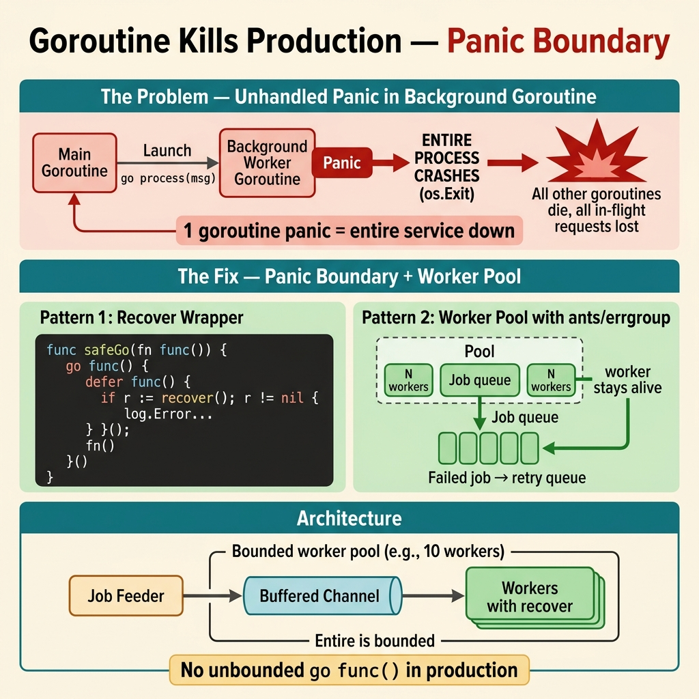

<!-- tags: best-practice, production, golang, concurrency -->
# 💀 Goroutine Giết Production Lúc 3h Sáng — Panic Recovery & Worker Pool

> Câu chuyện goroutine không có recover crash toàn bộ production, và cách phòng thủ đúng với panic, nil pointer, worker pool

📅 Ngày tạo: 2026-03-22 · 🔄 Cập nhật: 2026-04-04 · ⏱️ 13 phút đọc

| Aspect           | Detail                                                            |
| ---------------- | ----------------------------------------------------------------- |
| **Incident**     | Goroutine panic (nil pointer) → crash toàn bộ process lúc 3h sáng |
| **Root cause**   | `go func()` không có `recover()`, upstream trả nil response       |
| **Fix**          | Panic recovery wrapper, defensive nil check, worker pool bounded  |
| **Go relevance** | `recover()`, `debug.Stack()`, semaphore pattern, `errgroup`       |

---

## 1. DEFINE

3:17 AM, PagerDuty kêu. Service payment-processor restart 14 lần trong 20 phút. Log cuối cùng trước mỗi lần crash: `runtime: goroutine stack exceeds 1000000000-byte limit`. Không phải memory leak — một goroutine panic không có recover, kéo sập toàn bộ process. 14 lần restart = 14 lần mất toàn bộ in-flight transactions.

Goroutine làm Go trông nhẹ nhàng và mạnh mẽ, cho đến khi một panic nhỏ trong background task kéo sập cả process lúc 3 giờ sáng. `Goroutine Kills Production` không phải bài về syntax của `go func()`. Nó là bài về trách nhiệm mà bạn vừa tạo ra mỗi lần spawn một execution path mới.

Điều khó chịu của kiểu sự cố này là nó đến từ code nhìn rất vô hại: một nil response hiếm gặp, một `recover()` bị quên, một worker pool không giới hạn. Production không thưởng cho sự “trông có vẻ đơn giản” đó. Nó phạt bạn bằng crash loop và log không đủ để tái dựng chuyện gì đã xảy ra.

Core insight: **Best practice với goroutine không dừng ở concurrency primitive; nó bắt đầu ở panic boundary, spawn control, và observability đủ để một lỗi nền không giết toàn bộ service.**

### 📖 Câu chuyện: "Con goroutine giết cả production lúc 3 giờ sáng"

Service Go đang chạy ngon. Không có deploy mới. Không có thay đổi config. Monitoring xanh lè.

Rồi tự nhiên — **crash**. Process restart đột ngột. **Không có error log**.

Team ngủ dậy lúc 7h sáng, thấy 4 tiếng downtime. Kubernetes đã restart pod 17 lần. Không ai hiểu tại sao.

### 🔍 Tìm thủ phạm

```go
// Code nhìn có vẻ vô hại — nằm trong production 6 tháng không sao
go func() {
    data := fetchFromUpstream(id)  // upstream trả về nil đột xuất
    process(data.Items)             // 💥 PANIC: nil pointer dereference
}()
```
```typescript
// ❌ TypeScript — unhandled rejection, same crash risk in Node.js
fetchFromUpstream(id).then(data => {
    process(data!.items); // 💥 TypeError: Cannot read properties of null
});
// In Node.js < 15, unhandledRejection silently exits process; in >= 15, crashes it
```
```rust
// ❌ Rust — unwrap on None panics the task (similar effect)
tokio::spawn(async move {
    let data = fetch_from_upstream(&id).await; // returns Option<Data>
    process(&data.unwrap().items); // 💥 called `Option::unwrap()` on a `None` value
});
```
```cpp
// ❌ C++ — null pointer dereference crashes the process
std::thread([id] {
    auto data = fetch_from_upstream(id); // returns nullptr on failure
    process(data->items); // 💥 SIGSEGV: null pointer dereference
}).detach();
```
```python
# ❌ Python — background task raises unhandled exception
import asyncio

async def worker(item_id: str) -> None:
    data = await fetch_from_upstream(item_id)  # may return None
    process(data["items"])  # 💥 TypeError: 'NoneType' is not subscriptable

asyncio.create_task(worker(item_id))
```

**Chuỗi sự kiện**:

1. **03:00 AM** — Team upstream deploy hotfix, API trả `nil` response trong 30s
2. Goroutine gọi `data.Items` trên `nil` pointer → **panic**
3. Goroutine này **không có `recover()`** → panic propagate lên main goroutine
4. **Toàn bộ Go process crash** — không có log error (panic output ra stderr, log system chỉ capture stdout)
5. Kubernetes restart pod → upstream vẫn nil → crash lặp lại → **CrashLoopBackOff**
6. **03:30 AM** — Upstream fix xong, pod tự recover. Nhưng 30 phút downtime đã xảy ra

### Tại sao panic trong goroutine giết cả process?

| Concept                       | Giải thích                                                                                  |
| ----------------------------- | ------------------------------------------------------------------------------------------- |
| **Go panic behavior**         | Panic trong bất kỳ goroutine nào mà không có `recover()` → crash toàn bộ process            |
| **Khác với Java/C#**          | Unhandled exception trong thread chỉ kill thread đó. Go không có exception — panic là fatal |
| **Không có "global recover"** | Không thể `recover()` ở main goroutine cho panic ở child goroutine                          |
| **stderr vs stdout**          | Panic output ra stderr. Nếu log collector chỉ capture stdout → mất log panic                |

### Phân loại panic phổ biến

| #   | Loại panic                  | Ví dụ                                            | Tần suất   |
| --- | --------------------------- | ------------------------------------------------ | ---------- |
| 1   | **Nil pointer dereference** | `data.Items` khi `data == nil`                   | ⭐⭐⭐⭐⭐ |
| 2   | **Nil map assignment**      | `cache["key"] = 1` khi `cache` chưa `make()`     | ⭐⭐⭐⭐   |
| 3   | **Index out of range**      | `items[5]` khi `len(items) == 3`                 | ⭐⭐⭐     |
| 4   | **Send on closed channel**  | `ch <- value` sau `close(ch)`                    | ⭐⭐⭐     |
| 5   | **Concurrent map write**    | 2 goroutines cùng write map không có mutex       | ⭐⭐⭐     |
| 6   | **Type assertion fail**     | `val.(string)` khi val là `int`                  | ⭐⭐       |
| 7   | **Panic trong init()**      | DB connect fail trong `init()` → app không start | ⭐⭐       |

---

Các failure mode trên nghe dễ tránh — nhưng có trap thật sự nguy hiểm: goroutine panic mà không recover = cả process crash, và unbounded goroutine spawn = memory spike + OOM kill. Trap đó sẽ xuất hiện ở PITFALLS.

## 2. VISUAL

Panic trong goroutine rất dễ bị hiểu nhầm nếu chỉ đọc giải thích bằng chữ. Sơ đồ dưới đây cho thấy đường crash thực sự lan ra sao và vì sao một goroutine có thể giết cả process.



### Panic Propagation — Tại sao 1 goroutine giết cả process

```
┌──────────────────────────────────────────────────────────┐
│                    GO RUNTIME                             │
│                                                          │
│  main goroutine          child goroutine                 │
│  ┌──────────┐           ┌──────────────────┐            │
│  │          │           │ go func() {      │            │
│  │ func     │ spawn ──▶ │   data := fetch()│            │
│  │ main() { │           │   data.Items     │            │
│  │   ...    │           │     💥 PANIC!     │            │
│  │ }        │           │ }()              │            │
│  └──────────┘           └────────┬─────────┘            │
│                                  │                       │
│                          No recover() found              │
│                                  │                       │
│                                  ▼                       │
│                    ┌──────────────────────┐              │
│                    │  CRASH ENTIRE PROCESS │              │
│                    │  Exit code: 2         │              │
│                    │  goroutine 42 [running]:             │
│                    │  runtime.gopanic(...)  │              │
│                    └──────────────────────┘              │
└──────────────────────────────────────────────────────────┘

VS. Với recover():

┌──────────────────────────────────────────────────────────┐
│                    GO RUNTIME                             │
│                                                          │
│  main goroutine          child goroutine                 │
│  ┌──────────┐           ┌──────────────────┐            │
│  │          │           │ go func() {      │            │
│  │ func     │ spawn ──▶ │   defer recover()│            │
│  │ main() { │           │   data := fetch()│            │
│  │   ...    │           │   data.Items     │            │
│  │   ...    │           │     💥 PANIC!     │            │
│  │   ...    │           │   recover() ← ✅  │            │
│  │ }        │           │   log error      │            │
│  │ (vẫn OK) │           │ }()              │            │
│  └──────────┘           └──────────────────┘            │
│                                                          │
│              Process vẫn chạy, chỉ goroutine đó dừng    │
└──────────────────────────────────────────────────────────┘
```

### Goroutine Spawn Control

```
❌ TRƯỚC: Spawn không kiểm soát
┌────────────────────────────────────────────────┐
│  for _, item := range items {  // 100,000 items│
│      go process(item)          // 100,000 goroutines!
│  }                                              │
│                                                 │
│  Memory: 100,000 × 4KB stack = 400MB minimum   │
│  CPU: context switch overhead cực lớn            │
│  Kết quả: OOM kill hoặc performance sập         │
└────────────────────────────────────────────────┘

✅ SAU: Worker pool bounded
┌────────────────────────────────────────────────┐
│  sem := make(chan struct{}, 100)  // max 100    │
│                                                 │
│  ┌─────┐ ┌─────┐ ┌─────┐     ┌─────┐         │
│  │ W1  │ │ W2  │ │ W3  │ ... │W100 │         │
│  └──┬──┘ └──┬──┘ └──┬──┘     └──┬──┘         │
│     │       │       │            │              │
│     ▼       ▼       ▼            ▼              │
│  ┌──────────────────────────────────┐          │
│  │  100,000 items queue             │          │
│  │  Chỉ 100 goroutine chạy cùng lúc │          │
│  │  Memory stable: ~400KB           │          │
│  └──────────────────────────────────┘          │
└────────────────────────────────────────────────┘
```

### init() Panic vs Constructor Pattern

```
❌ init() panic — không recover được:
┌────────────────────────────────┐
│  func init() {                 │
│    conn := db.MustConnect(url) │──▶ PANIC! App không start
│  }                             │    Không recover được
└────────────────────────────────┘    Không có error message rõ ràng

✅ Constructor — trả error, có thể xử lý:
┌────────────────────────────────┐
│  func NewService(cfg) (*S, err)│
│    conn, err := db.Connect(url)│──▶ return nil, err
│    if err != nil {             │    Caller quyết định làm gì
│      return nil, err           │    Log rõ ràng
│    }                           │    Graceful shutdown
│  }                             │
└────────────────────────────────┘
```

---

Flow đã rõ: panic không có recover = process crash. Bây giờ ta implement đúng: từ basic recover pattern đến production-grade worker pool với panic isolation.

## 3. CODE

Khi crash path đã rõ, code fix phải bọc đúng boundary của panic và bó hẹp số goroutine đang sống. Ta đi từ wrapper tối thiểu sang worker-pool có kiểm soát.

### Example 1: Basic — Recover wrapper cho mọi goroutine

Nguyên tắc: **Mọi goroutine spawn ra đều phải có recover**. Tạo helper function để không quên.

```go
package safe

import (
	"fmt"
	"log/slog"
	"runtime/debug"
)

// Go — spawn goroutine an toàn với panic recovery
// ✅ Dùng thay cho `go func() { ... }()` ở mọi nơi
func Go(fn func()) {
	go func() {
		defer func() {
			if r := recover(); r != nil {
				// Log đủ context — không log thì recover = vứt evidence
				slog.Error("goroutine panic recovered",
					"error", fmt.Sprintf("%v", r),
					"stack", string(debug.Stack()),
				)
			}
		}()
		fn()
	}()
}

// GoWithContext — spawn goroutine với metadata cho tracing
func GoWithContext(name string, fn func()) {
	go func() {
		defer func() {
			if r := recover(); r != nil {
				slog.Error("goroutine panic recovered",
					"goroutine", name,
					"error", fmt.Sprintf("%v", r),
					"stack", string(debug.Stack()),
				)
				// TODO: Push metric
				// metrics.PanicRecovered.WithLabelValues(name).Inc()
			}
		}()
		fn()
	}()
}

// ─── Sử dụng ───

func ProcessOrder(orderID string) {
	// ❌ TRƯỚC: panic = crash cả process
	// go func() {
	//     data := fetchFromUpstream(orderID)
	//     process(data.Items)  // nil pointer → 💥
	// }()

	// ✅ SAU: panic được recover, process vẫn sống
	Go(func() {
		data := fetchFromUpstream(orderID)
		if data == nil {
			// Defensive check — đừng tin upstream
			slog.Warn("upstream returned nil", "orderID", orderID)
			return
		}
		process(data.Items)
	})
}

// ─── Với context name cho monitoring ───

func ProcessBatch(items []Item) {
	for _, item := range items {
		item := item // capture loop variable
		GoWithContext("process-item", func() {
			if err := processItem(item); err != nil {
				slog.Error("item processing failed",
					"itemID", item.ID,
					"error", err,
				)
			}
		})
	}
}

// Stub functions for compilation
type Item struct{ ID string }

func fetchFromUpstream(id string) *UpstreamResponse { return nil }
func process(items []string)                        {}
func processItem(item Item) error                   { return nil }

type UpstreamResponse struct {
	Items []string
}
```
```typescript
// TypeScript — Safe async task wrapper with error boundary
import { Logger } from './logger'; // assume structured logger

// safeRun — wraps an async task, catches all errors, prevents unhandled rejections
function safeRun(name: string, fn: () => Promise<void>): void {
  fn().catch((err: unknown) => {
    // Log full error + stack — equivalent of debug.Stack()
    Logger.error('async task error', {
      task: name,
      error: err instanceof Error ? err.message : String(err),
      stack: err instanceof Error ? err.stack : undefined,
    });
    // Optionally push a metric
    // metrics.taskErrors.labels({ task: name }).inc();
  });
}

// Usage — equivalent of safe.Go()
function processOrder(orderID: string): void {
  // ❌ BEFORE: unhandled rejection crashes Node.js process (in some configs)
  // fetchFromUpstream(orderID).then(data => process(data.items));

  // ✅ AFTER: errors are caught and logged
  safeRun('process-order', async () => {
    const data = await fetchFromUpstream(orderID);
    if (!data) {
      Logger.warn('upstream returned null', { orderID });
      return;
    }
    processData(data.items);
  });
}

// Batch processing — equivalent of GoWithContext
function processBatch(items: Array<{ id: string }>): void {
  for (const item of items) {
    safeRun(`process-item-${item.id}`, async () => {
      await processItem(item);
    });
  }
}

// Stubs
async function fetchFromUpstream(id: string) { return null as { items: string[] } | null; }
function processData(items: string[]) {}
async function processItem(item: { id: string }) {}
```
```rust
// Rust — Safe tokio task spawn with panic recovery
use std::panic::AssertUnwindSafe;
use std::future::Future;
use tokio::task::JoinHandle;
use tracing::{error, warn};

// safe_spawn — spawns a task that catches panics and errors
fn safe_spawn<F, Fut>(name: &'static str, f: F) -> JoinHandle<()>
where
    F: FnOnce() -> Fut + Send + 'static,
    Fut: Future<Output = anyhow::Result<()>> + Send + 'static,
{
    tokio::spawn(async move {
        // catch_unwind prevents panic from propagating beyond this task
        let result = std::panic::catch_unwind(AssertUnwindSafe(|| f()))
            .map_err(|e| anyhow::anyhow!("panic: {:?}", e));

        match result {
            Err(e) => error!(task = name, error = %e, "task panicked"),
            Ok(fut) => {
                if let Err(e) = fut.await {
                    error!(task = name, error = %e, "task failed");
                }
            }
        }
    })
}

// Usage — equivalent of safe.Go()
fn process_order(order_id: String) {
    safe_spawn("process-order", move || async move {
        let data = fetch_from_upstream(&order_id).await;
        if data.is_none() {
            warn!(order_id = %order_id, "upstream returned None");
            return Ok(());
        }
        process_data(data.unwrap());
        Ok(())
    });
}

async fn fetch_from_upstream(_id: &str) -> Option<Vec<String>> { None }
fn process_data(_items: Vec<String>) {}
```
```cpp
// C++ — Safe std::thread/std::async wrapper with exception recovery
#include <exception>
#include <functional>
#include <future>
#include <iostream>
#include <string>

// safe_async — launches async task, catches all exceptions
std::future<void> safe_async(const std::string& name,
                              std::function<void()> fn) {
    return std::async(std::launch::async, [name, fn = std::move(fn)]() {
        try {
            fn();
        } catch (const std::exception& e) {
            // Log — equivalent of slog.Error + debug.Stack()
            std::cerr << "[ERROR] task=" << name
                      << " error=" << e.what() << "\n";
            // TODO: push metric / alert
        } catch (...) {
            std::cerr << "[ERROR] task=" << name << " unknown exception\n";
        }
    });
}

// Usage
void process_order(const std::string& order_id) {
    // ❌ BEFORE: exception in std::thread without catch → std::terminate
    // std::thread([=]{ auto data = fetch(order_id); process(data->items); }).detach();

    // ✅ AFTER: exceptions caught and logged
    safe_async("process-order", [order_id]() {
        auto data = fetch_from_upstream(order_id); // returns nullptr on failure
        if (!data) {
            std::cerr << "[WARN] upstream returned null for " << order_id << "\n";
            return;
        }
        process_data(data->items);
    }).detach(); // fire-and-forget; keep future if you want to wait
}

struct UpstreamResponse { std::vector<std::string> items; };
std::unique_ptr<UpstreamResponse> fetch_from_upstream(const std::string&) { return nullptr; }
void process_data(const std::vector<std::string>&) {}
```
```python
# Python — Safe task wrapper with panic recovery
import asyncio
import logging
import traceback
from collections.abc import Awaitable, Callable

logger = logging.getLogger(__name__)

def safe_spawn(name: str, fn: Callable[[], Awaitable[None]]) -> asyncio.Task[None]:
    async def runner() -> None:
        try:
            await fn()
        except Exception:
            logger.exception("task failed", extra={"task": name})

    return asyncio.create_task(runner(), name=name)

def process_order(order_id: str) -> None:
    async def run() -> None:
        data = await fetch_from_upstream(order_id)
        if data is None:
            logger.warning("upstream returned None", extra={"order_id": order_id})
            return
        process_data(data["items"])

    safe_spawn("process-order", run)

def process_batch(items: list[dict[str, str]]) -> None:
    for item in items:
        safe_spawn(
            f"process-item-{item['id']}",
            lambda item=item: process_item(item),
        )

async def fetch_from_upstream(_order_id: str) -> dict[str, list[str]] | None:
    return None

def process_data(_items: list[str]) -> None:
    pass

async def process_item(_item: dict[str, str]) -> None:
    pass
```

**Kết luận**: `safe.Go()` wrap mọi goroutine với `recover()` + structured logging. Process không bao giờ crash vì 1 goroutine panic. Stack trace được log đầy đủ để debug.

---

Recover wrapper đã chặn crash. Nhưng unbounded spawn vẫn là bom hẹn giờ — worker pool là lớp tiếp theo.

### Example 2: Intermediate — Worker Pool với Semaphore

Kiểm soát số goroutine concurrent thay vì spawn vô hạn. Mỗi worker có panic recovery.

```go
package pool

import (
	"context"
	"fmt"
	"log/slog"
	"runtime/debug"
	"sync"
)

// WorkerPool — bounded goroutine pool với panic recovery
type WorkerPool struct {
	maxWorkers int
	sem        chan struct{}
	wg         sync.WaitGroup
}

func NewWorkerPool(maxWorkers int) *WorkerPool {
	return &WorkerPool{
		maxWorkers: maxWorkers,
		sem:        make(chan struct{}, maxWorkers),
	}
}

// Submit — gửi task vào pool, block nếu pool đầy
func (p *WorkerPool) Submit(ctx context.Context, name string, task func() error) error {
	select {
	case p.sem <- struct{}{}: // Acquire slot
	case <-ctx.Done():
		return ctx.Err() // Context cancelled, không chờ nữa
	}

	p.wg.Add(1)
	go func() {
		defer p.wg.Done()
		defer func() { <-p.sem }() // Release slot

		// ✅ Panic recovery cho mỗi worker
		defer func() {
			if r := recover(); r != nil {
				slog.Error("worker panic",
					"task", name,
					"error", fmt.Sprintf("%v", r),
					"stack", string(debug.Stack()),
				)
			}
		}()

		if err := task(); err != nil {
			slog.Error("task failed", "task", name, "error", err)
		}
	}()

	return nil
}

// Wait — chờ tất cả task hoàn thành
func (p *WorkerPool) Wait() {
	p.wg.Wait()
}

// ─── Sử dụng ───

func ProcessLargeDataset(ctx context.Context, items []DataItem) error {
	// ✅ Tối đa 50 goroutine, thay vì 100,000
	pool := NewWorkerPool(50)

	for _, item := range items {
		item := item // capture loop variable

		err := pool.Submit(ctx, fmt.Sprintf("process-%s", item.ID), func() error {
			// Nếu panic ở đây, chỉ worker này dừng
			// Pool và process vẫn chạy bình thường
			return processDataItem(item)
		})
		if err != nil {
			slog.Warn("submit failed, context cancelled", "itemID", item.ID)
			break
		}
	}

	pool.Wait()
	slog.Info("batch processing complete", "total", len(items))
	return nil
}

// Stub
type DataItem struct{ ID string }
func processDataItem(item DataItem) error { return nil }
```
```typescript
// TypeScript — Bounded Worker Pool with error recovery (p-limit)
import pLimit from 'p-limit'; // npm install p-limit

interface DataItem { id: string; }

async function processLargeDataset(
  items: DataItem[],
  maxWorkers = 50,
): Promise<void> {
  const limit = pLimit(maxWorkers); // Bounded concurrency — equivalent of semaphore

  const tasks = items.map(item =>
    limit(async () => {
      try {
        await processDataItem(item);
      } catch (err: unknown) {
        // Per-task error — other tasks keep running (pool survives)
        console.error('[ERROR] task failed', {
          itemID: item.id,
          error: err instanceof Error ? err.message : String(err),
        });
      }
    }),
  );

  await Promise.all(tasks);
  console.log(`[INFO] batch complete, total=${items.length}`);
}

async function processDataItem(_item: DataItem): Promise<void> {}
```
```rust
// Rust — Bounded Worker Pool via tokio + semaphore
use std::sync::Arc;
use tokio::sync::Semaphore;
use tracing::{error, info};

struct DataItem { id: String }

async fn process_large_dataset(items: Vec<DataItem>, max_workers: usize) {
    let sem = Arc::new(Semaphore::new(max_workers));
    let mut handles = Vec::with_capacity(items.len());

    for item in items {
        let permit = sem.clone().acquire_owned().await.unwrap();
        let handle = tokio::spawn(async move {
            let _permit = permit; // released when dropped

            // Per-task panic recovery
            let result = std::panic::catch_unwind(std::panic::AssertUnwindSafe(|| {
                // synchronous portion; for async, use tokio::task::spawn_blocking
            }));

            if let Err(e) = result {
                error!(item_id = %item.id, "worker panicked: {:?}", e);
            }

            // Async portion
            if let Err(e) = process_data_item(&item).await {
                error!(item_id = %item.id, error = %e, "task failed");
            }
        });
        handles.push(handle);
    }

    for h in handles { let _ = h.await; }
    info!("batch complete");
}

async fn process_data_item(_item: &DataItem) -> anyhow::Result<()> { Ok(()) }
```
```cpp
// C++ — Bounded Thread Pool (C++17 + std::counting_semaphore / manual)
#include <condition_variable>
#include <exception>
#include <functional>
#include <iostream>
#include <mutex>
#include <queue>
#include <string>
#include <thread>
#include <vector>

class WorkerPool {
    std::vector<std::thread>          workers_;
    std::queue<std::function<void()>> tasks_;
    std::mutex                        mu_;
    std::condition_variable           cv_;
    bool                              stop_{false};

public:
    explicit WorkerPool(int n) {
        for (int i = 0; i < n; ++i) {
            workers_.emplace_back([this] {
                while (true) {
                    std::function<void()> task;
                    {
                        std::unique_lock<std::mutex> lk(mu_);
                        cv_.wait(lk, [this] { return stop_ || !tasks_.empty(); });
                        if (stop_ && tasks_.empty()) return;
                        task = std::move(tasks_.front());
                        tasks_.pop();
                    }
                    // Per-task exception boundary — pool survives
                    try { task(); }
                    catch (const std::exception& e) {
                        std::cerr << "[ERROR] worker exception: " << e.what() << "\n";
                    } catch (...) {
                        std::cerr << "[ERROR] worker unknown exception\n";
                    }
                }
            });
        }
    }

    void submit(std::function<void()> task) {
        { std::lock_guard<std::mutex> lk(mu_); tasks_.push(std::move(task)); }
        cv_.notify_one();
    }

    ~WorkerPool() {
        { std::lock_guard<std::mutex> lk(mu_); stop_ = true; }
        cv_.notify_all();
        for (auto& w : workers_) w.join();
    }
};

struct DataItem { std::string id; };
void process_data_item(const DataItem& item) { /* ... */ }

void process_large_dataset(const std::vector<DataItem>& items,
                            int max_workers = 50) {
    WorkerPool pool(max_workers);
    for (const auto& item : items) {
        pool.submit([&item] { process_data_item(item); });
    }
    // Pool destructor waits for all tasks
}
```
```python
# Python — Bounded worker pool with semaphore
import asyncio
import logging

logger = logging.getLogger(__name__)

async def process_large_dataset(
    items: list[dict[str, str]],
    max_workers: int = 50,
) -> None:
    sem = asyncio.Semaphore(max_workers)

    async def run(item: dict[str, str]) -> None:
        async with sem:
            try:
                await process_data_item(item)
            except Exception:
                logger.exception("task failed", extra={"item_id": item["id"]})

    await asyncio.gather(*(run(item) for item in items))
    logger.info("batch complete", extra={"total": len(items)})

async def process_data_item(_item: dict[str, str]) -> None:
    pass
```

**Kết luận**: Worker pool giới hạn concurrent goroutine, tránh OOM. Mỗi worker có panic recovery riêng — 1 worker crash không ảnh hưởng pool. `Submit()` hỗ trợ context cancellation.

---

Worker pool đã giới hạn. Nhưng context cancellation cần propagation — errgroup là evolution.

### Example 3: Advanced — errgroup + Context Cancellation

Dùng `errgroup` từ stdlib để quản lý goroutine group: auto-cancel khi 1 goroutine fail, collect errors, bounded concurrency.

```go
package pipeline

import (
	"context"
	"fmt"
	"log/slog"
	"runtime/debug"
	"time"

	"golang.org/x/sync/errgroup"
)

// ─── Production Pipeline: Fetch → Transform → Persist ───
// errgroup quản lý lifecycle, cancel tất cả khi 1 stage fail

type OrderPipeline struct {
	maxConcurrency int
}

func NewOrderPipeline(maxConcurrency int) *OrderPipeline {
	return &OrderPipeline{maxConcurrency: maxConcurrency}
}

func (p *OrderPipeline) Process(ctx context.Context, orderIDs []string) error {
	// ✅ errgroup.WithContext: cancel toàn bộ khi 1 goroutine error
	g, gCtx := errgroup.WithContext(ctx)
	g.SetLimit(p.maxConcurrency) // Bounded concurrency

	for _, id := range orderIDs {
		id := id
		g.Go(func() error {
			// ✅ Panic recovery bên trong errgroup
			// errgroup KHÔNG có built-in recover
			defer func() {
				if r := recover(); r != nil {
					slog.Error("pipeline panic",
						"orderID", id,
						"error", fmt.Sprintf("%v", r),
						"stack", string(debug.Stack()),
					)
				}
			}()

			// Check context trước khi bắt đầu (có thể đã cancel)
			select {
			case <-gCtx.Done():
				return gCtx.Err()
			default:
			}

			return p.processOrder(gCtx, id)
		})
	}

	// Wait: block cho đến khi tất cả goroutine xong
	// Trả về error đầu tiên (nếu có)
	if err := g.Wait(); err != nil {
		return fmt.Errorf("pipeline failed: %w", err)
	}

	slog.Info("pipeline complete", "processed", len(orderIDs))
	return nil
}

func (p *OrderPipeline) processOrder(ctx context.Context, orderID string) error {
	// Stage 1: Fetch
	data, err := fetchOrder(ctx, orderID)
	if err != nil {
		return fmt.Errorf("fetch %s: %w", orderID, err)
	}

	// ✅ Defensive nil check — đừng tin upstream
	if data == nil {
		slog.Warn("nil response from upstream", "orderID", orderID)
		return nil // Skip, không crash
	}

	// Stage 2: Transform
	result, err := transformOrder(ctx, data)
	if err != nil {
		return fmt.Errorf("transform %s: %w", orderID, err)
	}

	// Stage 3: Persist
	if err := persistOrder(ctx, result); err != nil {
		return fmt.Errorf("persist %s: %w", orderID, err)
	}

	return nil
}

// ─── Graceful Shutdown: Chờ goroutine xong trước khi exit ───

func RunWithGracefulShutdown() {
	ctx, cancel := context.WithTimeout(context.Background(), 30*time.Second)
	defer cancel()

	pipeline := NewOrderPipeline(20)
	orderIDs := []string{"order-1", "order-2", "order-3"}

	if err := pipeline.Process(ctx, orderIDs); err != nil {
		slog.Error("pipeline error", "error", err)
		// Graceful: log error, cleanup, exit
		// KHÔNG panic trong main — dùng os.Exit(1) hoặc return error
	}
}

// Stubs
type OrderData struct{ ID string }
type OrderResult struct{ ID string }

func fetchOrder(ctx context.Context, id string) (*OrderData, error)            { return &OrderData{}, nil }
func transformOrder(ctx context.Context, data *OrderData) (*OrderResult, error) { return &OrderResult{}, nil }
func persistOrder(ctx context.Context, result *OrderResult) error              { return nil }
```
```typescript
// TypeScript — errgroup equivalent: bounded concurrency + cancel on error
import pLimit from 'p-limit';

interface OrderData { id: string; }
interface OrderResult { id: string; }

class OrderPipeline {
  constructor(private maxConcurrency: number) {}

  async process(orderIDs: string[], signal?: AbortSignal): Promise<void> {
    const limit = pLimit(this.maxConcurrency);
    const errors: Error[] = [];

    const tasks = orderIDs.map(id =>
      limit(async () => {
        if (signal?.aborted) return; // Honour cancellation

        try {
          await this.processOrder(id, signal);
        } catch (err) {
          errors.push(err instanceof Error ? err : new Error(String(err)));
          // Optionally abort remaining tasks:
          // controller.abort();
        }
      }),
    );

    await Promise.all(tasks);

    if (errors.length > 0) {
      throw new AggregateError(errors, `pipeline failed: ${errors[0].message}`);
    }

    console.log(`[INFO] pipeline complete, processed=${orderIDs.length}`);
  }

  private async processOrder(orderID: string, signal?: AbortSignal): Promise<void> {
    const data = await fetchOrder(orderID, signal);
    if (!data) return; // nil guard
    const result = await transformOrder(data, signal);
    await persistOrder(result, signal);
  }
}

async function fetchOrder(_id: string, _s?: AbortSignal): Promise<OrderData | null> { return { id: _id }; }
async function transformOrder(d: OrderData, _s?: AbortSignal): Promise<OrderResult> { return { id: d.id }; }
async function persistOrder(_r: OrderResult, _s?: AbortSignal): Promise<void> {}
```
```rust
// Rust — errgroup equivalent: tokio::task + JoinSet + context cancellation
use std::sync::Arc;
use tokio::task::JoinSet;
use tokio_util::sync::CancellationToken;
use tracing::{error, info, warn};

struct OrderData { id: String }
struct OrderResult { id: String }

struct OrderPipeline { max_concurrency: usize }

impl OrderPipeline {
    async fn process(&self, order_ids: Vec<String>,
                     token: CancellationToken) -> anyhow::Result<()> {
        let sem   = Arc::new(tokio::sync::Semaphore::new(self.max_concurrency));
        let token = Arc::new(token);
        let mut set = JoinSet::new();

        for id in order_ids {
            let permit = sem.clone().acquire_owned().await?;
            let token  = token.clone();
            set.spawn(async move {
                let _permit = permit;

                // Panic recovery
                let r = std::panic::catch_unwind(std::panic::AssertUnwindSafe(|| ()));
                if r.is_err() { error!(order_id=%id, "pipeline panic"); return; }

                // Check cancellation before work
                if token.is_cancelled() { return; }

                if let Err(e) = process_order(&id).await {
                    error!(order_id=%id, error=%e, "pipeline error");
                }
            });
        }

        // Collect results
        while let Some(res) = set.join_next().await {
            if let Err(e) = res { error!("task join error: {}", e); }
        }

        info!("pipeline complete");
        Ok(())
    }
}

async fn process_order(id: &str) -> anyhow::Result<()> {
    let data = fetch_order(id).await?;
    if data.is_none() { warn!(order_id=%id, "nil response"); return Ok(()); }
    let result = transform_order(data.unwrap()).await?;
    persist_order(result).await
}

async fn fetch_order(id: &str) -> anyhow::Result<Option<OrderData>> { Ok(Some(OrderData { id: id.into() })) }
async fn transform_order(d: OrderData) -> anyhow::Result<OrderResult> { Ok(OrderResult { id: d.id }) }
async fn persist_order(_r: OrderResult) -> anyhow::Result<()> { Ok(()) }
```
```cpp
// C++ — Bounded pipeline with cancellation (C++20 std::stop_token + std::jthread)
#include <atomic>
#include <exception>
#include <iostream>
#include <stop_token>
#include <string>
#include <thread>
#include <vector>

struct OrderData  { std::string id; };
struct OrderResult{ std::string id; };

class OrderPipeline {
    int max_concurrency_;

public:
    explicit OrderPipeline(int max) : max_concurrency_(max) {}

    void process(const std::vector<std::string>& order_ids,
                 std::stop_token stoken = {}) {
        std::atomic<int> active{0};
        std::mutex       mu;
        std::condition_variable cv;
        std::atomic<bool> had_error{false};

        std::vector<std::jthread> threads;
        threads.reserve(order_ids.size());

        for (const auto& id : order_ids) {
            // Backpressure — wait until a slot is free
            std::unique_lock<std::mutex> lk(mu);
            cv.wait(lk, [&] {
                return active < max_concurrency_ || stoken.stop_requested();
            });
            if (stoken.stop_requested()) break;
            ++active;

            threads.emplace_back([&, id] {
                try {
                    if (!stoken.stop_requested()) process_order(id);
                } catch (const std::exception& e) {
                    std::cerr << "[ERROR] order=" << id << " " << e.what() << "\n";
                    had_error.store(true);
                } catch (...) {
                    std::cerr << "[ERROR] order=" << id << " unknown\n";
                }
                { std::lock_guard<std::mutex> lk2(mu); --active; }
                cv.notify_one();
            });
        }

        // Wait for all workers
        for (auto& t : threads) t.join();
        std::cout << "[INFO] pipeline complete\n";
    }

private:
    void process_order(const std::string& id) {
        // Fetch → transform → persist
        OrderData data{id};
        OrderResult result{data.id};
        (void)result;
    }
};
```
```python
# Python — TaskGroup + cancellation-aware pipeline
import asyncio
import logging

logger = logging.getLogger(__name__)

class OrderPipeline:
    def __init__(self, max_concurrency: int) -> None:
        self._max_concurrency = max_concurrency

    async def process(self, order_ids: list[str]) -> None:
        sem = asyncio.Semaphore(self._max_concurrency)

        async def run(order_id: str) -> None:
            async with sem:
                try:
                    await self.process_order(order_id)
                except Exception:
                    logger.exception("pipeline error", extra={"order_id": order_id})
                    raise

        async with asyncio.TaskGroup() as tg:
            for order_id in order_ids:
                tg.create_task(run(order_id), name=f"order-{order_id}")

        logger.info("pipeline complete", extra={"processed": len(order_ids)})

    async def process_order(self, order_id: str) -> None:
        data = await fetch_order(order_id)
        if data is None:
            logger.warning("nil response from upstream", extra={"order_id": order_id})
            return
        result = await transform_order(data)
        await persist_order(result)

async def fetch_order(order_id: str) -> dict[str, str] | None:
    return {"id": order_id}

async def transform_order(data: dict[str, str]) -> dict[str, str]:
    return {"id": data["id"]}

async def persist_order(_result: dict[str, str]) -> None:
    pass
```

**Kết luận**: `errgroup` cung cấp: bounded concurrency (`SetLimit`), auto-cancel khi error (`WithContext`), và error collection (`Wait`). Nhưng **không có built-in recover** — luôn thêm `defer recover()` bên trong mỗi `g.Go()`.

---

errgroup đã cover. Nhưng nil pointer, closed channel vẫn giết production — defensive patterns là lớp cuối.

### Example 4: Expert — Nil Safety Patterns & Defensive Go

Tổng hợp các pattern phòng thủ nil pointer, map initialization, channel safety, và type assertion.

```go
package defensive

import (
	"fmt"
	"log/slog"
	"sync"
)

// ════════════════════════════════════════════════════
// Pattern 1: Nil-safe method receiver
// ════════════════════════════════════════════════════

type User struct {
	Name  string
	Email string
}

// ✅ Nil-safe method — không panic khi receiver là nil
func (u *User) GetName() string {
	if u == nil {
		return "" // Trả zero value thay vì panic
	}
	return u.Name
}

// ✅ Nil-safe chained access
func (u *User) GetEmailDomain() string {
	if u == nil || u.Email == "" {
		return ""
	}
	for i := len(u.Email) - 1; i >= 0; i-- {
		if u.Email[i] == '@' {
			return u.Email[i+1:]
		}
	}
	return ""
}

// ════════════════════════════════════════════════════
// Pattern 2: Safe map — tự initialize khi cần
// ════════════════════════════════════════════════════

type SafeCache struct {
	mu   sync.RWMutex
	data map[string]int
}

func NewSafeCache() *SafeCache {
	return &SafeCache{
		data: make(map[string]int), // ✅ Luôn make() trong constructor
	}
}

// ✅ Thread-safe Get/Set
func (c *SafeCache) Get(key string) (int, bool) {
	c.mu.RLock()
	defer c.mu.RUnlock()
	val, ok := c.data[key]
	return val, ok
}

func (c *SafeCache) Set(key string, val int) {
	c.mu.Lock()
	defer c.mu.Unlock()
	if c.data == nil {
		c.data = make(map[string]int) // Defensive: lazy init
	}
	c.data[key] = val
}

// ════════════════════════════════════════════════════
// Pattern 3: Type assertion an toàn
// ════════════════════════════════════════════════════

func ProcessValue(val interface{}) string {
	// ❌ Unsafe: panic nếu val không phải string
	// result := val.(string)

	// ✅ Safe: comma-ok pattern
	str, ok := val.(string)
	if !ok {
		slog.Warn("unexpected type", "got", fmt.Sprintf("%T", val))
		return ""
	}
	return str
}

// ✅ Type switch — xử lý nhiều type an toàn
func FormatValue(val interface{}) string {
	switch v := val.(type) {
	case string:
		return v
	case int:
		return fmt.Sprintf("%d", v)
	case float64:
		return fmt.Sprintf("%.2f", v)
	case nil:
		return "<nil>"
	default:
		return fmt.Sprintf("%v", v)
	}
}

// ════════════════════════════════════════════════════
// Pattern 4: Channel safety — send on closed channel
// ════════════════════════════════════════════════════

type SafeChannel struct {
	ch     chan string
	once   sync.Once
	closed bool
	mu     sync.RWMutex
}

func NewSafeChannel(size int) *SafeChannel {
	return &SafeChannel{ch: make(chan string, size)}
}

// ✅ Safe close — chỉ close 1 lần duy nhất
func (sc *SafeChannel) Close() {
	sc.once.Do(func() {
		sc.mu.Lock()
		sc.closed = true
		sc.mu.Unlock()
		close(sc.ch)
	})
}

// ✅ Safe send — không panic khi channel đã close
func (sc *SafeChannel) Send(val string) bool {
	sc.mu.RLock()
	defer sc.mu.RUnlock()
	if sc.closed {
		return false
	}
	sc.ch <- val
	return true
}

// ════════════════════════════════════════════════════
// Pattern 5: Constructor thay vì init()
// ════════════════════════════════════════════════════

// ❌ init() panic — không recover được, app không start
// func init() {
//     conn, err := db.Connect(os.Getenv("DB_URL"))
//     if err != nil {
//         panic(err) // → app crash, không có context
//     }
// }

// ✅ Constructor trả error — caller quyết định xử lý thế nào
type Service struct {
	// db *sql.DB
}

type Config struct {
	DBURL      string
	MaxRetries int
}

func NewService(cfg Config) (*Service, error) {
	if cfg.DBURL == "" {
		return nil, fmt.Errorf("DB_URL is required") // Rõ ràng, không panic
	}

	// conn, err := db.Connect(cfg.DBURL)
	// if err != nil {
	//     return nil, fmt.Errorf("db connect: %w", err) // Wrap error với context
	// }

	return &Service{}, nil
}

// ✅ Main function xử lý error từ constructor
// func main() {
//     cfg := loadConfig()
//     svc, err := NewService(cfg)
//     if err != nil {
//         slog.Error("failed to start service", "error", err)
//         os.Exit(1) // Graceful exit, không panic
//     }
//     svc.Run()
// }
```
```typescript
// TypeScript — Nil safety patterns & defensive code

// Pattern 1: Optional chaining — nil-safe access
class User {
  constructor(public name?: string, public email?: string) {}

  getName(): string { return this.name ?? ''; }

  getEmailDomain(): string {
    const at = this.email?.lastIndexOf('@') ?? -1;
    return at >= 0 ? (this.email!.slice(at + 1)) : '';
  }
}

// Pattern 2: Map with lazy init (type-safe)
class SafeCache {
  private data = new Map<string, number>();

  get(key: string): number | undefined { return this.data.get(key); }
  set(key: string, val: number): void  { this.data.set(key, val); }
}

// Pattern 3: Type-safe value extraction (replaces type assertion)
function processValue(val: unknown): string {
  if (typeof val !== 'string') {
    console.warn('unexpected type', typeof val);
    return '';
  }
  return val;
}

// Pattern 4: AbortController for safe async cancellation (replaces channel safety)
class SafeAbortController {
  private controller = new AbortController();
  get signal() { return this.controller.signal; }
  close() { this.controller.abort(); }
}

// Pattern 5: Constructor returns Result — never throws in constructor
class Service {
  private constructor(private dbUrl: string) {}

  static create(cfg: { dbUrl?: string }): { service: Service } | { error: string } {
    if (!cfg.dbUrl) return { error: 'DB_URL is required' };
    return { service: new Service(cfg.dbUrl) };
  }
}

// Usage
const result = Service.create({ dbUrl: process.env.DB_URL });
if ('error' in result) {
  console.error('failed to start service', result.error);
  process.exit(1);
}
```
```rust
// Rust — Nil safety patterns & defensive code

// Pattern 1: Option methods — nil-safe access (no null pointer dereference possible)
struct User { name: String, email: String }

impl User {
    fn get_name(&self) -> &str { &self.name }

    fn get_email_domain(&self) -> &str {
        self.email.find('@')
            .map(|i| &self.email[i + 1..])
            .unwrap_or("")
    }
}

// Pattern 2: HashMap — always initialized, thread-safe with RwLock
use std::collections::HashMap;
use std::sync::RwLock;

struct SafeCache(RwLock<HashMap<String, i32>>);

impl SafeCache {
    fn new() -> Self { Self(RwLock::new(HashMap::new())) }
    fn get(&self, key: &str) -> Option<i32> { self.0.read().unwrap().get(key).copied() }
    fn set(&self, key: &str, val: i32) { self.0.write().unwrap().insert(key.to_string(), val); }
}

// Pattern 3: Safe downcasting — no panic
fn process_value(val: &dyn std::any::Any) -> String {
    val.downcast_ref::<String>()
        .map(|s| s.clone())
        .unwrap_or_default()
}

// Pattern 4: Cancellation token (replaces channel safety)
use tokio_util::sync::CancellationToken;

struct SafeWorker { token: CancellationToken }

impl SafeWorker {
    fn new() -> Self { Self { token: CancellationToken::new() } }
    fn cancel(&self) { self.token.cancel(); }
    fn is_cancelled(&self) -> bool { self.token.is_cancelled() }
}

// Pattern 5: Constructor returns Result — never panics
struct Service { db_url: String }

impl Service {
    fn new(db_url: Option<&str>) -> anyhow::Result<Self> {
        let url = db_url.ok_or_else(|| anyhow::anyhow!("DB_URL is required"))?;
        Ok(Self { db_url: url.to_string() })
    }
}
```
```cpp
// C++ — Nil safety patterns & defensive code

#include <memory>
#include <optional>
#include <shared_mutex>
#include <stdexcept>
#include <string>
#include <unordered_map>
#include <variant>

// Pattern 1: Nil-safe methods via pointer check
struct User {
    std::string name, email;

    static std::string get_name(const User* u) {
        return u ? u->name : "";  // Nil-safe: check before deref
    }

    static std::string get_email_domain(const User* u) {
        if (!u || u->email.empty()) return "";
        auto pos = u->email.rfind('@');
        return pos != std::string::npos ? u->email.substr(pos + 1) : "";
    }
};

// Pattern 2: Thread-safe map — always initialized
class SafeCache {
    mutable std::shared_mutex mu_;
    std::unordered_map<std::string, int> data_; // Initialized in constructor

public:
    std::optional<int> get(const std::string& key) const {
        std::shared_lock lk(mu_);
        auto it = data_.find(key);
        return it != data_.end() ? std::optional<int>(it->second) : std::nullopt;
    }
    void set(const std::string& key, int val) {
        std::unique_lock lk(mu_);
        data_[key] = val;
    }
};

// Pattern 3: std::any safe cast — no UB
#include <any>
std::string process_value(const std::any& val) {
    try { return std::any_cast<std::string>(val); }
    catch (const std::bad_any_cast&) { return ""; }
}

// Pattern 4: std::stop_source for safe task cancellation (C++20)
#include <stop_token>
struct SafeWorker {
    std::stop_source src;
    std::stop_token  token() const { return src.get_token(); }
    void cancel() { src.request_stop(); }
};

// Pattern 5: Constructor returns via factory — throws on error (caller handles)
class Service {
    std::string db_url_;
    explicit Service(std::string url) : db_url_(std::move(url)) {}
public:
    static std::unique_ptr<Service> create(const std::string& db_url) {
        if (db_url.empty()) throw std::invalid_argument("DB_URL is required");
        return std::unique_ptr<Service>(new Service(db_url));
    }
};
```
```python
# Python — Defensive patterns for None, cache, type checks, and shutdown
from __future__ import annotations

from dataclasses import dataclass
from queue import Queue
from threading import Lock
from typing import Any

@dataclass
class User:
    name: str = ""
    email: str = ""

    def get_name(self) -> str:
        return self.name

    def get_email_domain(self) -> str:
        return self.email.split("@", 1)[1] if "@" in self.email else ""

class SafeCache:
    def __init__(self) -> None:
        self._data: dict[str, int] = {}
        self._lock = Lock()

    def get(self, key: str) -> int | None:
        with self._lock:
            return self._data.get(key)

    def set(self, key: str, value: int) -> None:
        with self._lock:
            self._data[key] = value

def process_value(value: Any) -> str:
    if not isinstance(value, str):
        return ""
    return value

class SafeChannel:
    def __init__(self, maxsize: int = 0) -> None:
        self._queue: Queue[str | None] = Queue(maxsize=maxsize)
        self._closed = False
        self._lock = Lock()

    def close(self) -> None:
        with self._lock:
            if self._closed:
                return
            self._closed = True
            self._queue.put_nowait(None)

    def send(self, value: str) -> bool:
        with self._lock:
            if self._closed:
                return False
            self._queue.put_nowait(value)
            return True

class Service:
    def __init__(self, db_url: str) -> None:
        if not db_url:
            raise ValueError("DB_URL is required")
        self.db_url = db_url
```

**Kết luận**:

- **Nil receiver**: method trên nil pointer trả zero value thay vì panic
- **Map**: luôn `make()` trong constructor, hoặc lazy init trong setter
- **Type assertion**: dùng comma-ok pattern hoặc type switch
- **Channel**: `sync.Once` đảm bảo close 1 lần, check `closed` trước send
- **init()**: thay bằng constructor trả `error`, caller quyết định

**Bài học**: _"Goroutine trong Go như nhân viên freelance — spawn ra mà không quản lý, đến lúc chết không ai biết tại sao."_

---

Bạn đã đi qua recover, worker pool, errgroup, và defensive patterns. Bây giờ đến phần nguy hiểm: những panic trông innocent nhưng crash production — trap đã được setup từ đầu bài.

## 4. PITFALLS

Những sự cố kiểu này không đến từ goroutine nói chung, mà từ chỗ spawn thiếu giới hạn, recover sai vị trí, hoặc nil safety bị bỏ qua trên hot path.

| # | Severity | Lỗi | Hậu quả | Fix |
| --- | --- | --- | --- | --- |
| 1 | 🟡 Common | `go func()` không có `recover()` | 1 goroutine panic → crash cả process | Dùng `safe.Go()` wrapper hoặc luôn thêm `defer recover()` |
| 2 | 🟡 Common | `var m map[string]int; m["key"] = 1` | Panic: nil map assignment | Luôn `make(map[...])` trước khi dùng |
| 3 | 🟡 Common | Spawn 100K goroutine cùng lúc | OOM kill hoặc extreme context switch overhead | Worker pool bounded, `errgroup.SetLimit()`, hoặc semaphore channel |
| 4 | 🟡 Common | `recover()` không log stack trace | Biết là panic nhưng không biết panic ở đâu | `slog.Error("panic", "stack", debug.Stack())` |
| 5 | 🟡 Common | Logic trong `init()` mà có thể fail | Crash lúc startup, không recover, không có error context | Chuyển vào constructor `NewXxx() (*T, error)` |
| 6 | 🟡 Common | Capture loop variable sai trong goroutine | Tất cả goroutine xử lý item cuối cùng | `item := item` trước `go func()`, hoặc dùng Go 1.22+ |
| 7 | 🟡 Common | Send on closed channel | Panic không có error message rõ ràng | `sync.Once` cho close, check flag trước send |
| 8 | 🟡 Common | `defer recover()` ở vị trí sai | Recover không bắt được panic | `defer func() { if r := recover(); r != nil { ... } }()` — đúng pattern |

### Anti-pattern: recover() nhưng nuốt error

```go
// ❌ SAI — Recover nhưng không log
go func() {
    defer func() {
        recover() // Nuốt panic, mất hoàn toàn thông tin debug
    }()
    dangerousWork()
}()

// ✅ ĐÚNG — Log chi tiết
go func() {
    defer func() {
        if r := recover(); r != nil {
            slog.Error("panic recovered",
                "error", fmt.Sprintf("%v", r),
                "stack", string(debug.Stack()),
                // Thêm business context
                "orderID", orderID,
                "userID", userID,
            )
        }
    }()
    dangerousWork()
}()
```
```typescript
// ❌ SAI — Error swallowed silently (TypeScript)
// Promise rejection silently discarded in old Node.js versions:
// asyncTask().catch(() => {}); // swallows error, no log, no metric

// ✅ ĐÚNG — Log full context (TypeScript)
function safeRunWithContext(
  ctx: { orderID: string; userID: string },
  fn: () => Promise<void>,
): void {
  fn().catch((err: unknown) => {
    console.error('[ERROR] task failed', {
      error: err instanceof Error ? err.message : String(err),
      stack: err instanceof Error ? err.stack : undefined,
      orderID: ctx.orderID,
      userID:  ctx.userID,
    });
    // metrics.panicRecovered.inc({ task: 'dangerous-work' });
  });
}
```
```rust
// ❌ SAI — Panic swallowed silently (Rust)
// let _ = std::panic::catch_unwind(|| dangerous_work()); // no log!

// ✅ ĐÚNG — Log chi tiết với context (Rust)
fn safe_run_with_context(order_id: &str, user_id: &str, f: impl FnOnce() + std::panic::UnwindSafe) {
    let result = std::panic::catch_unwind(f);
    if let Err(panic_val) = result {
        let msg = if let Some(s) = panic_val.downcast_ref::<&str>() {
            s.to_string()
        } else if let Some(s) = panic_val.downcast_ref::<String>() {
            s.clone()
        } else {
            "unknown panic".to_string()
        };
        // backtrace captured automatically with RUST_BACKTRACE=1
        tracing::error!(
            error = %msg,
            order_id = %order_id,
            user_id  = %user_id,
            "panic recovered"
        );
    }
}
```
```cpp
// ❌ SAI — Exception swallowed (C++)
// try { dangerous_work(); } catch (...) {} // no log!

// ✅ ĐÚNG — Log chi tiết với context (C++)
#include <exception>
#include <iostream>

void safe_run_with_context(const std::string& order_id,
                            const std::string& user_id,
                            std::function<void()> fn) {
    try {
        fn();
    } catch (const std::exception& e) {
        std::cerr << "[ERROR] panic recovered"
                  << " error="    << e.what()
                  << " orderID="  << order_id
                  << " userID="   << user_id << "\n";
        // TODO: push metric / alert
    } catch (...) {
        std::cerr << "[ERROR] unknown exception"
                  << " orderID=" << order_id
                  << " userID="  << user_id << "\n";
    }
}
```
```python
# ❌ SAI — swallow exception, mất hoàn toàn context
# try:
#     dangerous_work()
# except Exception:
#     pass

# ✅ ĐÚNG — log full context
import logging

logger = logging.getLogger(__name__)

async def safe_run_with_context(
    order_id: str,
    user_id: str,
    fn,
) -> None:
    try:
        await fn()
    except Exception:
        logger.exception(
            "panic recovered",
            extra={"order_id": order_id, "user_id": user_id},
        )
```

---

Bạn đã đi qua Goroutine Production Issues và cạm bẫy. Các resources dưới đây giúp đi sâu hơn.

## 5. REF

| Resource                                 | Link                                                                                   |
| ---------------------------------------- | -------------------------------------------------------------------------------------- |
| Go Blog: Error Handling                  | [go.dev/blog/error-handling-and-go](https://go.dev/blog/error-handling-and-go)         |
| Go Blog: Defer, Panic, Recover           | [go.dev/blog/defer-panic-and-recover](https://go.dev/blog/defer-panic-and-recover)     |
| Go Wiki: Recovery                        | [go.dev/wiki/PanicAndRecover](https://go.dev/wiki/PanicAndRecover)                     |
| golang.org/x/sync/errgroup               | [pkg.go.dev/golang.org/x/sync/errgroup](https://pkg.go.dev/golang.org/x/sync/errgroup) |
| Effective Go: Goroutines                 | [go.dev/doc/effective_go#goroutines](https://go.dev/doc/effective_go#goroutines)       |
| Go Concurrency Patterns (Rob Pike)       | [youtube.com/watch?v=f6kdp27TYZs](https://www.youtube.com/watch?v=f6kdp27TYZs)         |
| uber-go/goleak — Goroutine leak detector | [github.com/uber-go/goleak](https://github.com/uber-go/goleak)                         |

---

## 6. RECOMMEND

Khi panic boundary đã vững, bước tiếp theo là nối bài này sang graceful shutdown, errgroup, memory leak, và queue consumer design để hoàn thiện lane Go production.

| Mở rộng                              | Khi nào                     | Lý do                                                                        |
| ------------------------------------ | --------------------------- | ---------------------------------------------------------------------------- |
| **uber-go/goleak**                   | CI/CD test                  | Detect goroutine leak trong unit test                                        |
| **OpenTelemetry tracing**            | Production monitoring       | Trace goroutine lifecycle, tìm goroutine chạy quá lâu                        |
| **pprof goroutine profiling**        | Debug memory/goroutine leak | `runtime/pprof` hoặc `net/http/pprof` expose goroutine count                 |
| **Context timeout**                  | Mọi goroutine gọi external  | Không để goroutine chờ vĩnh viễn: `context.WithTimeout`                      |
| **Structured concurrency (nursery)** | Go 1.24+ experimental       | Pattern từ Python Trio: parent goroutine chờ tất cả children xong mới return |
| **Circuit breaker**                  | Upstream không ổn định      | `sony/gobreaker`: tạm ngừng gọi upstream khi fail rate cao                   |
| **Graceful shutdown**                | Production service          | `signal.NotifyContext` + `errgroup` để chờ goroutine cleanup                 |

---

## 7. QUICK REF

| # | Pattern | Code |
|---|---------|------|
| 1 | **Goroutine recover wrapper** | `go func() { defer func() { if r := recover(); r != nil { log.Error(r) } }(); work() }()` |
| 2 | **Nil check trước dereference** | `if data == nil { return ErrNilResponse }` |
| 3 | **errgroup với recover** | `g.Go(func() error { defer recover(); return work() })` |
| 4 | **Worker pool bounded** | `sem := make(chan struct{}, maxWorkers)` |
| 5 | **Capture stderr trong K8s** | Log collector config: `stderr: true` (Fluentd/Vector) |
| 6 | **Stack trace trong recover** | `debug.Stack()` → log với error |
| 7 | **Upstream nil guard** | Validate response trước khi dereference: `if resp.Data == nil` |
| 8 | **Alert** | `goroutine_count > baseline × 3` → investigate |

---

---

**Callback**: Quay lại 3:17 AM, 14 lần restart. Bây giờ bạn biết: mỗi goroutine cần recover, mỗi worker pool cần graceful shutdown, mỗi panic cần được log trước khi swallow. Không recover = crash. Recover sai = silent bug. Balance nằm ở giữa.

← Quay về [Best Practices](./README.md) · ← Trước: [Flash Sale Crash](./02-flash-sale-checkout-crash.md) · → Tiếp: [Double Charge](./04-fintech-double-charge.md)
## 8. INTERVIEW ANGLE

**System design / technical questions liên quan:**
- *"How does Go handle errors in goroutines?"*
- *"What happens if a goroutine panics and there's no recover?"*
- *"How do you build a resilient worker pool in Go?"*

**Điểm interviewer muốn nghe:**

| Chủ đề | Talking point |
|--------|---------------|
| **Go panic model** | Panic trong goroutine không có recover → crash toàn process (khác Java/C#) |
| **stderr vs stdout** | Panic output ra stderr — log collector chỉ capture stdout → mất log |
| **Defense in depth** | Mỗi `go func()` cần recover wrapper; validate input trước khi dereference |
| **errgroup** | `golang.org/x/sync/errgroup` — propagate error, cancel context khi 1 goroutine fail |
| **Bounded concurrency** | Semaphore pattern: `sem := make(chan struct{}, N)` — tránh goroutine explosion |
| **Production lesson** | Upstream trả nil trong 30s → pod crash loop 17 lần → 4h downtime |

**Follow-up questions thường gặp:**
- *"How would you test that your recover is working?"* → Inject panic trong test, verify process survives
- *"What's the difference between panic and error in Go?"* → Error: expected, recoverable; Panic: programmer error, unrecoverable ideally
- *"How do you debug a CrashLoopBackOff?"* → `kubectl logs --previous`, check stderr, pprof

---

## 10. DETECTION CHECKLIST

| # | Dấu hiệu | Cách kiểm tra | Ý nghĩa |
|---|----------|---------------|---------|
| 1 | **Pod restart không có error log** | K8s events: `Reason=OOMKilled` hoặc exit code 2 | Panic ra stderr — log collector bỏ qua |
| 2 | **CrashLoopBackOff** | `kubectl get pods` → `CrashLoopBackOff` | Process crash lặp lại |
| 3 | **Goroutine count spike** | `/debug/pprof/goroutine` — count tăng không giảm | Goroutine leak |
| 4 | **Log gap** | Không có log trong khoảng thời gian nhất định | Process crash, no graceful log |
| 5 | **Upstream error rate tăng** | Upstream API error % spike cùng thời điểm crash | Nil response từ upstream |
| 6 | **Stderr trống trong K8s** | `kubectl logs --previous` không có gì | Panic output bị mất |

---

