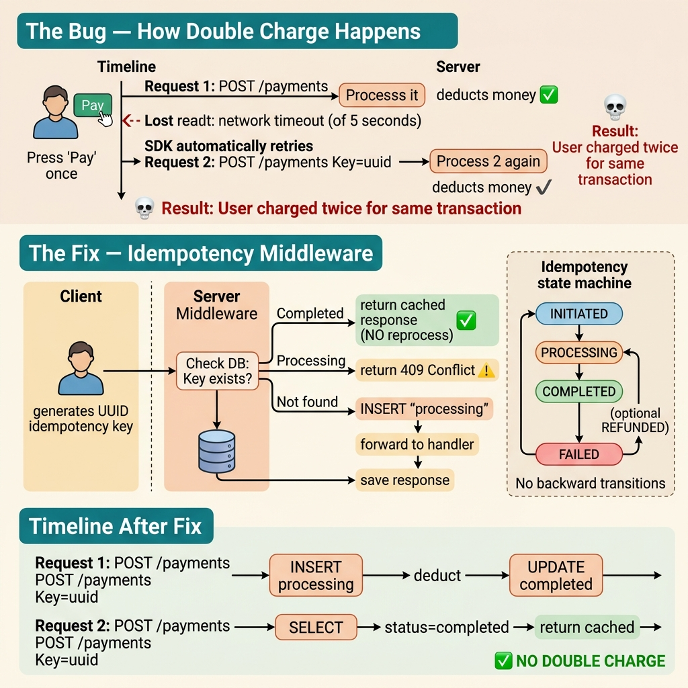

<!-- tags: best-practice, production, fintech, idempotency, concurrency -->
# 💸 Fintech Trừ Tiền 2 Lần — Idempotency & Exactly-Once Payment

> Câu chuyện user bị trừ tiền 2 lần cho 1 giao dịch vì thiếu idempotency, và kiến trúc phòng chống duplicate payment

📅 Ngày tạo: 2026-03-22 · 🔄 Cập nhật: 2026-04-04 · ⏱️ 15 phút đọc

| Aspect           | Detail                                                              |
| ---------------- | ------------------------------------------------------------------- |
| **Incident**     | User bị trừ 2 triệu đồng 2 lần cho 1 giao dịch                      |
| **Root cause**   | SDK mobile auto-retry khi timeout, server xử lý cả 2 request        |
| **Fix**          | Idempotency key + DB unique constraint + state machine              |
| **Go relevance** | Middleware pattern, `database/sql`, distributed lock, state machine |

---

## 1. DEFINE

Thứ Hai, support ticket #4,891: "Tôi bị trừ tiền 2 lần cho cùng 1 giao dịch." Kiểm tra DB: đúng, 2 records với cùng amount, cùng user, cách nhau 340ms. Payment gateway confirm: 2 charges riêng biệt. User bấm "Pay" 1 lần. Hệ thống charge 2 lần. Tổng thiệt hại tuần đó: 847 duplicate charges, $127K refund, 3 ngày ops xử lý manual.

Người dùng nhấn thanh toán hai lần không phải là bug hiếm. Điều đáng sợ là hệ thống của bạn có coi hai lần đó là một ý định hay hai giao dịch khác nhau. `Fintech Double Charge` là nơi một chi tiết nhỏ như retry hay refresh page có thể biến thành mất tiền thật.

Khác với e-commerce thông thường, sai ở fintech không chỉ là đơn hàng duplicate. Nó là niềm tin bị bào mòn, reconciliation đau đớn, và đội support bị ngập ticket. Best practice ở đây không thể chỉ là “check trước khi insert”; nó phải là idempotency như một contract xuyên suốt flow thanh toán.

Core insight: **Muốn tránh double charge, hệ thống phải nhận diện cùng một ý định thanh toán xuyên qua retry, timeout, và callback trễ, rồi ép mọi trạng thái đi qua cùng một state machine nhất quán.**

### 📖 Câu chuyện: "Hệ thống fintech trừ tiền 2 lần"

Support nhận ticket lúc 9h sáng: _"Tôi bị trừ 2 triệu đồng 2 lần cho 1 giao dịch."_

Team im lặng. Kiểm tra DB: đúng, 2 records khác nhau, cùng user, cùng số tiền, cách nhau **0.3 giây**. Đây là loại bug **không được phép xảy ra** nhưng đã xảy ra.

### 🔍 Truy vết

```
User bấm "Thanh toán"
  │
  ├── Request 1 gửi đi ──────────────────────▶ Server
  │                                               │
  │   (mạng chậm, timeout sau 5s)                 │ Xử lý OK
  │                                               │ Trừ tiền ✅
  │   SDK mobile thấy timeout                     │
  │   → TỰ ĐỘNG retry                             │
  │                                               │
  ├── Request 2 gửi đi ──────────────────────▶ Server
  │                                               │
  │                                               │ Xử lý OK
  │                                               │ Trừ tiền ✅
  │                                               │
  └── User bị trừ 2 lần 💀                        │
                                                   │
  Không có idempotency check                       │
  Server nghĩ Request 2 là giao dịch mới          │
```

### Tại sao retry = double charge?

| Yếu tố                            | Giải thích                                                                                       |
| --------------------------------- | ------------------------------------------------------------------------------------------------ |
| **Network timeout ≠ server fail** | Client timeout không có nghĩa server chưa xử lý — có thể đã trừ tiền xong nhưng response bị lost |
| **SDK auto-retry**                | Nhiều HTTP client/SDK tự retry khi timeout (axios, OkHttp, Alamofire)                            |
| **No idempotency**                | Server xử lý mọi request như request mới — không check "đã xử lý request này chưa?"              |
| **POST không idempotent**         | Theo HTTP spec, POST không idempotent (khác GET, PUT, DELETE) — retry POST luôn nguy hiểm        |

### Idempotency là gì?

> **Idempotent**: Gọi 1 lần hay 100 lần, kết quả phải giống nhau.

| Method              | Idempotent by spec | Ví dụ                                        |
| ------------------- | ------------------ | -------------------------------------------- |
| `GET /users/123`    | ✅ Có              | Luôn trả cùng user                           |
| `PUT /users/123`    | ✅ Có              | Luôn set cùng trạng thái                     |
| `DELETE /users/123` | ✅ Có              | Lần 1 xóa, lần 2 trả 404 — đều OK            |
| `POST /payments`    | ❌ **Không**       | Lần 1 trừ tiền, lần 2 trừ tiền nữa → **BUG** |

**Vấn đề cốt lõi**: `POST /payments` phải trở nên idempotent bằng **idempotency key**.

### Idempotency Key Flow

| Bước | Client                                           | Server                                                    |
| ---- | ------------------------------------------------ | --------------------------------------------------------- |
| 1    | Generate UUID v4 trước khi gọi API               | —                                                         |
| 2    | Gửi `Idempotency-Key: uuid-abc-123` trong header | Nhận key                                                  |
| 3    | —                                                | Check DB: key `uuid-abc-123` đã tồn tại?                  |
| 4    | —                                                | **Chưa tồn tại** → xử lý request → lưu key + response     |
| 5    | Timeout, retry với **cùng key** `uuid-abc-123`   | **Đã tồn tại** → trả lại response cũ, **KHÔNG xử lý lại** |
| 6    | Nhận response (lần 2) — giống hệt lần 1          | —                                                         |

---

Các failure mode trên nghe quen — nhưng có trap thật sự đắt: gateway timeout → client retry → payment gateway charge 2 lần = user mất tiền thật. Và idempotency key không cover toàn flow = partial success trước retry. Trap đó sẽ xuất hiện ở PITFALLS.

## 2. VISUAL

Double charge thường sinh ra từ những khoảng trống giữa các request tưởng như giống nhau. Trace dưới đây cho thấy khoảng trống đó nằm ở đâu trong payment flow.



### Kiến trúc Idempotency

```
┌──────────────────────────────────────────────────────────────────┐
│                     CLIENT (Mobile App)                           │
│                                                                  │
│  ① Generate idempotency key: uuid-abc-123                        │
│  ② Lưu key vào local storage (persist qua retry)                │
│  ③ Gửi: POST /api/payments                                      │
│          Header: Idempotency-Key: uuid-abc-123                   │
└────────────────────────┬─────────────────────────────────────────┘
                         │
                         ▼
┌──────────────────────────────────────────────────────────────────┐
│                     IDEMPOTENCY MIDDLEWARE                        │
│                                                                  │
│  ┌────────────────────────────────────────────────────────────┐  │
│  │  key = request.Header["Idempotency-Key"]                   │  │
│  │                                                            │  │
│  │  ┌──── DB: SELECT * FROM idempotency_keys WHERE key = ?    │  │
│  │  │                                                         │  │
│  │  ├── EXISTS + status = "completed"                         │  │
│  │  │   → Return cached response (HTTP 200)  ✅ NO REPROCESS  │  │
│  │  │                                                         │  │
│  │  ├── EXISTS + status = "processing"                        │  │
│  │  │   → Return HTTP 409 Conflict  ⚠️ ĐANG XỬ LÝ           │  │
│  │  │                                                         │  │
│  │  └── NOT EXISTS                                            │  │
│  │      → INSERT key with status = "processing"               │  │
│  │      → Continue to handler  ▶                              │  │
│  └────────────────────────────────────────────────────────────┘  │
└────────────────────────┬─────────────────────────────────────────┘
                         │
                         ▼
┌──────────────────────────────────────────────────────────────────┐
│                     PAYMENT HANDLER                               │
│                                                                  │
│  BEGIN TX                                                        │
│    ① Check user balance                                          │
│    ② Deduct balance                                              │
│    ③ Create transaction record                                   │
│    ④ Update idempotency key: status = "completed"                │
│       response_body = serialized response                        │
│  COMMIT                                                          │
│                                                                  │
│  ⚠️ Key: idempotency record + payment = CÙNG 1 TRANSACTION      │
│  → Không bao giờ có trường hợp "đã trừ tiền nhưng chưa cập nhật │
│    idempotency key"                                              │
└──────────────────────────────────────────────────────────────────┘
```

### Payment State Machine

```
          ┌──────────────────────────────────────────────┐
          │          TRANSACTION STATE MACHINE             │
          │                                               │
          │  ┌──────────┐    validate    ┌──────────┐    │
          │  │ INITIATED │──────────────▶│PROCESSING│    │
          │  └──────────┘                └────┬─────┘    │
          │       │                           │          │
          │       │ duplicate                 ├── success│
          │       │ detected                  │          │
          │       ▼                           ▼          │
          │  ┌──────────┐              ┌──────────┐     │
          │  │ REJECTED  │              │COMPLETED │     │
          │  │ (return   │              │(trừ tiền)│     │
          │  │  cached)  │              └──────────┘     │
          │  └──────────┘                    │           │
          │                                  │ refund    │
          │                            ┌─────▼─────┐    │
          │       ┌──────────┐         │ REFUNDED   │    │
          │       │  FAILED  │◀── err  └───────────┘    │
          │       └──────────┘                          │
          │                                              │
          │  Rule: Mỗi state chỉ đi 1 chiều             │
          │  COMPLETED → INITIATED = KHÔNG ĐƯỢC PHÉP     │
          └──────────────────────────────────────────────┘
```

### Timeline — Request 1 vs Request 2 (sau fix)

```
Request 1                  Server                    Request 2
   │                         │                          │
   ├── POST /payments ──────▶│                          │
   │   Key: uuid-abc-123     │                          │
   │                         │── INSERT key             │
   │                         │   status="processing"    │
   │                         │                          │
   │                         │── Deduct balance         │
   │                         │── Create transaction     │
   │   (timeout 5s)          │── UPDATE key             │
   │                         │   status="completed"     │
   │                         │   response={...}         │
   │                         │                          │
   │                         │◀──── POST /payments ─────┤
   │                         │      Key: uuid-abc-123   │
   │                         │                          │
   │                         │── SELECT key             │
   │                         │   status="completed" ✅  │
   │                         │                          │
   │                         │── Return cached resp ───▶│
   │                         │   KHÔNG TRỪ TIỀN LẦN 2  │
   │                         │                          │
```

---

Race condition đã visible. Giờ ta implement: từ idempotency key cơ bản đến distributed lock + DB constraint để đảm bảo exactly-once payment.

## 3. CODE

Khi state machine và idempotency contract đã rõ, code phải thể hiện đúng cách claim, persist, và replay kết quả. Ta đi từ key đơn giản sang payment flow nhiều bước hơn.

### Example 1: Basic — Idempotency Middleware

Middleware kiểm tra idempotency key trước khi request đến handler. Nếu key đã xử lý, trả cached response.

```go
package idempotency

import (
	"context"
	"database/sql"
	"encoding/json"
	"fmt"
	"net/http"
	"time"
)

// ─── Idempotency record trong DB ───
type IdempotencyRecord struct {
	Key          string
	Status       string // "processing", "completed", "failed"
	ResponseCode int
	ResponseBody []byte
	CreatedAt    time.Time
	ExpiresAt    time.Time
}

// ─── Middleware ───
type Middleware struct {
	db  *sql.DB
	ttl time.Duration // Key expire sau 24h
}

func NewMiddleware(db *sql.DB) *Middleware {
	return &Middleware{db: db, ttl: 24 * time.Hour}
}

func (m *Middleware) Handler(next http.Handler) http.Handler {
	return http.HandlerFunc(func(w http.ResponseWriter, r *http.Request) {
		// Chỉ áp dụng cho POST/PATCH (mutating operations)
		if r.Method != http.MethodPost && r.Method != http.MethodPatch {
			next.ServeHTTP(w, r)
			return
		}

		key := r.Header.Get("Idempotency-Key")
		if key == "" {
			http.Error(w, `{"error":"Idempotency-Key header is required"}`, http.StatusBadRequest)
			return
		}

		// ① Check key đã tồn tại chưa
		record, err := m.getRecord(r.Context(), key)
		if err != nil && err != sql.ErrNoRows {
			http.Error(w, `{"error":"internal error"}`, http.StatusInternalServerError)
			return
		}

		if record != nil {
			switch record.Status {
			case "completed":
				// ✅ Đã xử lý trước đó — trả cached response
				w.Header().Set("X-Idempotent-Replayed", "true")
				w.WriteHeader(record.ResponseCode)
				w.Write(record.ResponseBody)
				return

			case "processing":
				// ⚠️ Đang xử lý (request trước chưa xong)
				http.Error(w, `{"error":"request is being processed"}`,
					http.StatusConflict) // 409
				return
			}
		}

		// ② Key mới — insert với status "processing"
		err = m.insertRecord(r.Context(), key)
		if err != nil {
			// Race condition: 2 request cùng key đến cùng lúc
			// INSERT conflict → reject request sau
			http.Error(w, `{"error":"duplicate request"}`, http.StatusConflict)
			return
		}

		// ③ Wrap ResponseWriter để capture response
		capture := &responseCapture{ResponseWriter: w, statusCode: http.StatusOK}

		// ④ Gọi handler thực
		next.ServeHTTP(capture, r)

		// ⑤ Lưu response vào idempotency record
		m.completeRecord(r.Context(), key, capture.statusCode, capture.body)
	})
}

func (m *Middleware) getRecord(ctx context.Context, key string) (*IdempotencyRecord, error) {
	var record IdempotencyRecord
	err := m.db.QueryRowContext(ctx, `
		SELECT key, status, response_code, response_body, created_at
		FROM idempotency_keys
		WHERE key = $1 AND expires_at > NOW()
	`, key).Scan(&record.Key, &record.Status, &record.ResponseCode,
		&record.ResponseBody, &record.CreatedAt)
	if err == sql.ErrNoRows {
		return nil, sql.ErrNoRows
	}
	if err != nil {
		return nil, err
	}
	return &record, nil
}

func (m *Middleware) insertRecord(ctx context.Context, key string) error {
	_, err := m.db.ExecContext(ctx, `
		INSERT INTO idempotency_keys (key, status, expires_at)
		VALUES ($1, 'processing', $2)
	`, key, time.Now().Add(m.ttl))
	return err // Unique constraint violation nếu key đã tồn tại
}

func (m *Middleware) completeRecord(ctx context.Context, key string, code int, body []byte) {
	m.db.ExecContext(ctx, `
		UPDATE idempotency_keys
		SET status = 'completed', response_code = $2, response_body = $3
		WHERE key = $1
	`, key, code, body)
}

// ─── Response capture helper ───
type responseCapture struct {
	http.ResponseWriter
	statusCode int
	body       []byte
}

func (rc *responseCapture) WriteHeader(code int) {
	rc.statusCode = code
	rc.ResponseWriter.WriteHeader(code)
}

func (rc *responseCapture) Write(b []byte) (int, error) {
	rc.body = append(rc.body, b...)
	return rc.ResponseWriter.Write(b)
}
```
```typescript
import { Request, Response, NextFunction } from "express";
import { Pool } from "pg";

// ─── Idempotency record in DB ───
interface IdempotencyRecord {
  key: string;
  status: "processing" | "completed" | "failed";
  responseCode: number;
  responseBody: Buffer | null;
  createdAt: Date;
  expiresAt: Date;
}

// ─── Middleware ───
export function idempotencyMiddleware(db: Pool, ttlMs = 24 * 60 * 60 * 1000) {
  return async (req: Request, res: Response, next: NextFunction): Promise<void> => {
    // Only apply for POST/PATCH (mutating operations)
    if (req.method !== "POST" && req.method !== "PATCH") {
      return next();
    }

    const key = req.headers["idempotency-key"] as string | undefined;
    if (!key) {
      res.status(400).json({ error: "Idempotency-Key header is required" });
      return;
    }

    // ① Check if key already exists
    const { rows } = await db.query<IdempotencyRecord>(
      `SELECT key, status, response_code, response_body
       FROM idempotency_keys
       WHERE key = $1 AND expires_at > NOW()`,
      [key]
    );
    const record = rows[0];

    if (record) {
      if (record.status === "completed") {
        // ✅ Already processed — return cached response
        res.set("X-Idempotent-Replayed", "true");
        res.status(record.responseCode).send(record.responseBody);
        return;
      }
      if (record.status === "processing") {
        // ⚠️ Currently being processed
        res.status(409).json({ error: "request is being processed" });
        return;
      }
    }

    // ② New key — insert with status "processing"
    try {
      const expiresAt = new Date(Date.now() + ttlMs);
      await db.query(
        `INSERT INTO idempotency_keys (key, status, expires_at) VALUES ($1, 'processing', $2)`,
        [key, expiresAt]
      );
    } catch {
      // Unique constraint violation — duplicate concurrent request
      res.status(409).json({ error: "duplicate request" });
      return;
    }

    // ③ Capture response
    const originalJson = res.json.bind(res);
    const originalStatus = res.status.bind(res);
    let capturedStatus = 200;
    let capturedBody: unknown;

    res.status = (code: number) => { capturedStatus = code; return originalStatus(code); };
    res.json = (body: unknown) => {
      capturedBody = body;
      // ⑤ Save response to idempotency record
      db.query(
        `UPDATE idempotency_keys SET status = 'completed', response_code = $2, response_body = $3 WHERE key = $1`,
        [key, capturedStatus, JSON.stringify(capturedBody)]
      ).catch(console.error);
      return originalJson(body);
    };

    // ④ Call actual handler
    next();
  };
}
```
```rust
use actix_web::{web, HttpRequest, HttpResponse, Error};
use actix_web::dev::{ServiceRequest, ServiceResponse, Transform, Service};
use serde_json::Value;
use sqlx::PgPool;
use std::future::{ready, Ready, Future};
use std::pin::Pin;
use chrono::Utc;

// ─── Idempotency record in DB ───
#[derive(sqlx::FromRow)]
struct IdempotencyRecord {
    status: String,
    response_code: i32,
    response_body: Option<serde_json::Value>,
}

// ─── Idempotency check handler (simplified approach) ───
pub async fn check_idempotency(
    pool: &PgPool,
    key: &str,
    ttl_hours: i64,
) -> Result<Option<IdempotencyRecord>, sqlx::Error> {
    let record = sqlx::query_as::<_, IdempotencyRecord>(
        r#"SELECT status, response_code, response_body
           FROM idempotency_keys
           WHERE key = $1 AND expires_at > NOW()"#,
    )
    .bind(key)
    .fetch_optional(pool)
    .await?;

    Ok(record)
}

pub async fn insert_processing_key(pool: &PgPool, key: &str, ttl_hours: i64) -> Result<bool, sqlx::Error> {
    let expires_at = Utc::now() + chrono::Duration::hours(ttl_hours);
    let result = sqlx::query(
        "INSERT INTO idempotency_keys (key, status, expires_at) VALUES ($1, 'processing', $2) ON CONFLICT DO NOTHING"
    )
    .bind(key)
    .bind(expires_at)
    .execute(pool)
    .await?;

    Ok(result.rows_affected() > 0) // false = already exists (duplicate)
}

pub async fn complete_key(pool: &PgPool, key: &str, code: i32, body: &Value) -> Result<(), sqlx::Error> {
    sqlx::query(
        "UPDATE idempotency_keys SET status = 'completed', response_code = $2, response_body = $3 WHERE key = $1"
    )
    .bind(key)
    .bind(code)
    .bind(body)
    .execute(pool)
    .await?;
    Ok(())
}
```
```cpp
#include <crow.h>        // Using Crow C++ HTTP framework
#include <pqxx/pqxx>
#include <string>
#include <optional>
#include <nlohmann/json.hpp>

struct IdempotencyRecord {
    std::string status;
    int response_code;
    std::optional<std::string> response_body;
};

// ─── Middleware helper: check if key exists ───
std::optional<IdempotencyRecord> get_idempotency_record(
    pqxx::connection& conn, const std::string& key)
{
    pqxx::work txn(conn);
    auto result = txn.exec_params(
        "SELECT status, response_code, response_body FROM idempotency_keys "
        "WHERE key = $1 AND expires_at > NOW()",
        key
    );
    txn.commit();
    if (result.empty()) return std::nullopt;

    IdempotencyRecord rec;
    rec.status = result[0][0].c_str();
    rec.response_code = result[0][1].as<int>();
    if (!result[0][2].is_null()) rec.response_body = result[0][2].c_str();
    return rec;
}

bool insert_processing_key(pqxx::connection& conn, const std::string& key, int ttl_hours = 24) {
    try {
        pqxx::work txn(conn);
        txn.exec_params(
            "INSERT INTO idempotency_keys (key, status, expires_at) "
            "VALUES ($1, 'processing', NOW() + $2 * interval '1 hour')",
            key, ttl_hours
        );
        txn.commit();
        return true;
    } catch (const pqxx::unique_violation&) {
        return false; // Duplicate key
    }
}

void complete_key(pqxx::connection& conn, const std::string& key, int code, const std::string& body) {
    pqxx::work txn(conn);
    txn.exec_params(
        "UPDATE idempotency_keys SET status = 'completed', response_code = $2, response_body = $3 WHERE key = $1",
        key, code, body
    );
    txn.commit();
}
```
```python
from __future__ import annotations

import json
from dataclasses import dataclass
from datetime import UTC, datetime, timedelta

from fastapi import HTTPException, Request, Response

@dataclass
class IdempotencyRecord:
    key: str
    status: str
    response_code: int | None
    response_body: str | None

class IdempotencyMiddleware:
    def __init__(self, db, ttl_hours: int = 24) -> None:
        self.db = db
        self.ttl = timedelta(hours=ttl_hours)

    async def __call__(self, request: Request, call_next):
        if request.method not in {"POST", "PATCH"}:
            return await call_next(request)

        key = request.headers.get("Idempotency-Key")
        if not key:
            raise HTTPException(status_code=400, detail="Idempotency-Key header is required")

        record = await self.db.fetchrow(
            """
            SELECT key, status, response_code, response_body
            FROM idempotency_keys
            WHERE key = $1 AND expires_at > NOW()
            """,
            key,
        )
        if record:
            if record["status"] == "completed":
                return Response(
                    content=record["response_body"] or "{}",
                    status_code=record["response_code"] or 200,
                    headers={"X-Idempotent-Replayed": "true"},
                    media_type="application/json",
                )
            if record["status"] == "processing":
                raise HTTPException(status_code=409, detail="request is being processed")

        try:
            await self.db.execute(
                """
                INSERT INTO idempotency_keys (key, status, expires_at)
                VALUES ($1, 'processing', $2)
                """,
                key,
                datetime.now(UTC) + self.ttl,
            )
        except Exception as exc:
            raise HTTPException(status_code=409, detail="duplicate request") from exc

        response = await call_next(request)
        body = b""
        async for chunk in response.body_iterator:
            body += chunk

        await self.db.execute(
            """
            UPDATE idempotency_keys
            SET status = 'completed', response_code = $2, response_body = $3
            WHERE key = $1
            """,
            key,
            response.status_code,
            body.decode() or json.dumps({}),
        )

        return Response(
            content=body,
            status_code=response.status_code,
            headers=dict(response.headers),
            media_type=response.media_type,
        )
```

**Kết luận**: Middleware intercept mọi POST/PATCH, kiểm tra `Idempotency-Key` header. Key đã xử lý → trả cached response, không gọi handler. Key mới → insert "processing" rồi forward. Response được capture và lưu lại cho retry sau.

---

Idempotency middleware đã chặn duplicate. Nhưng transactional idempotency cần DB-level guarantee — hãy strengthen.

### Example 2: Intermediate — Payment Service với Transactional Idempotency

Đảm bảo **trừ tiền + update idempotency key** nằm trong cùng 1 DB transaction. Không bao giờ có trường hợp "đã trừ tiền nhưng chưa mark key completed."

```go
package payment

import (
	"context"
	"database/sql"
	"encoding/json"
	"fmt"
	"time"
)

type PaymentService struct {
	db *sql.DB
}

func NewPaymentService(db *sql.DB) *PaymentService {
	return &PaymentService{db: db}
}

type PaymentRequest struct {
	IdempotencyKey string  `json:"idempotency_key"`
	UserID         string  `json:"user_id"`
	Amount         float64 `json:"amount"`
	Currency       string  `json:"currency"`
	Description    string  `json:"description"`
}

type PaymentResponse struct {
	TransactionID string  `json:"transaction_id"`
	Status        string  `json:"status"`
	Amount        float64 `json:"amount"`
	BalanceAfter  float64 `json:"balance_after"`
}

// ProcessPayment — trừ tiền idempotent, trả kết quả giống nhau cho mọi retry
func (s *PaymentService) ProcessPayment(ctx context.Context, req PaymentRequest) (*PaymentResponse, error) {
	// ① Check idempotency key — đã xử lý chưa?
	existing, err := s.getExistingPayment(ctx, req.IdempotencyKey)
	if err != nil {
		return nil, err
	}
	if existing != nil {
		// ✅ Đã xử lý trước đó — trả cached response
		return existing, nil
	}

	// ② Xử lý payment trong 1 transaction
	// ⚠️ CRITICAL: idempotency key + payment = cùng 1 TX
	tx, err := s.db.BeginTx(ctx, &sql.TxOptions{
		Isolation: sql.LevelSerializable, // Strongest isolation cho payment
	})
	if err != nil {
		return nil, fmt.Errorf("begin tx: %w", err)
	}
	defer tx.Rollback()

	// ③ Acquire idempotency lock (INSERT with unique constraint)
	_, err = tx.ExecContext(ctx, `
		INSERT INTO idempotency_keys (key, status, created_at, expires_at)
		VALUES ($1, 'processing', NOW(), NOW() + INTERVAL '24 hours')
	`, req.IdempotencyKey)
	if err != nil {
		// Unique constraint violation → request đang được xử lý bởi request khác
		return nil, ErrDuplicateProcessing
	}

	// ④ Check balance + deduct (trong cùng transaction)
	var balanceAfter float64
	err = tx.QueryRowContext(ctx, `
		UPDATE wallets
		SET balance = balance - $1, updated_at = NOW()
		WHERE user_id = $2 AND balance >= $1
		RETURNING balance
	`, req.Amount, req.UserID).Scan(&balanceAfter)

	if err == sql.ErrNoRows {
		// Insufficient balance — mark key as failed
		tx.ExecContext(ctx, `
			UPDATE idempotency_keys SET status = 'failed' WHERE key = $1
		`, req.IdempotencyKey)
		tx.Commit()
		return nil, ErrInsufficientBalance
	}
	if err != nil {
		return nil, fmt.Errorf("deduct balance: %w", err)
	}

	// ⑤ Create transaction record
	txnID := generateTxnID()
	_, err = tx.ExecContext(ctx, `
		INSERT INTO transactions (id, user_id, amount, currency, description, status, created_at)
		VALUES ($1, $2, $3, $4, $5, 'completed', NOW())
	`, txnID, req.UserID, req.Amount, req.Currency, req.Description)
	if err != nil {
		return nil, fmt.Errorf("insert transaction: %w", err)
	}

	// ⑥ Build response
	resp := &PaymentResponse{
		TransactionID: txnID,
		Status:        "completed",
		Amount:        req.Amount,
		BalanceAfter:  balanceAfter,
	}

	// ⑦ Update idempotency key với response (CÙNG TRANSACTION)
	respJSON, _ := json.Marshal(resp)
	_, err = tx.ExecContext(ctx, `
		UPDATE idempotency_keys
		SET status = 'completed', response_body = $2, response_code = 200
		WHERE key = $1
	`, req.IdempotencyKey, respJSON)
	if err != nil {
		return nil, fmt.Errorf("update idempotency: %w", err)
	}

	// ⑧ Commit — tất cả hoặc không gì cả (atomicity)
	if err := tx.Commit(); err != nil {
		return nil, fmt.Errorf("commit: %w", err)
	}

	return resp, nil
}

func (s *PaymentService) getExistingPayment(ctx context.Context, key string) (*PaymentResponse, error) {
	var status string
	var respBody []byte

	err := s.db.QueryRowContext(ctx, `
		SELECT status, response_body
		FROM idempotency_keys
		WHERE key = $1 AND expires_at > NOW()
	`, key).Scan(&status, &respBody)

	if err == sql.ErrNoRows {
		return nil, nil // Key mới
	}
	if err != nil {
		return nil, err
	}

	if status == "completed" && respBody != nil {
		var resp PaymentResponse
		json.Unmarshal(respBody, &resp)
		return &resp, nil
	}

	if status == "processing" {
		return nil, ErrDuplicateProcessing
	}

	return nil, nil
}

func generateTxnID() string {
	return fmt.Sprintf("txn_%d", time.Now().UnixNano())
}

var (
	ErrInsufficientBalance = fmt.Errorf("insufficient balance")
	ErrDuplicateProcessing = fmt.Errorf("request is being processed")
)
```
```typescript
import { Pool, PoolClient } from "pg";

interface PaymentRequest {
  idempotencyKey: string;
  userID: string;
  amount: number;
  currency: string;
  description: string;
}

interface PaymentResponse {
  transactionID: string;
  status: string;
  amount: number;
  balanceAfter: number;
}

class PaymentService {
  constructor(private readonly db: Pool) {}

  // ProcessPayment — idempotent deduction, same result for all retries
  async processPayment(req: PaymentRequest): Promise<PaymentResponse> {
    // ① Check idempotency key — already processed?
    const existing = await this.getExistingPayment(req.idempotencyKey);
    if (existing) return existing;

    // ② Process payment in 1 transaction
    // ⚠️ CRITICAL: idempotency key + payment = same TX
    const client = await this.db.connect();
    try {
      await client.query("BEGIN ISOLATION LEVEL SERIALIZABLE");

      // ③ Acquire idempotency lock (INSERT with unique constraint)
      try {
        const expiresAt = new Date(Date.now() + 24 * 60 * 60 * 1000);
        await client.query(
          "INSERT INTO idempotency_keys (key, status, created_at, expires_at) VALUES ($1, 'processing', NOW(), $2)",
          [req.idempotencyKey, expiresAt]
        );
      } catch {
        await client.query("ROLLBACK");
        throw new Error("request is being processed");
      }

      // ④ Check balance + deduct (within same transaction)
      const balanceResult = await client.query<{ balance: number }>(
        "UPDATE wallets SET balance = balance - $1, updated_at = NOW() WHERE user_id = $2 AND balance >= $1 RETURNING balance",
        [req.amount, req.userID]
      );
      if (balanceResult.rowCount === 0) {
        await client.query(
          "UPDATE idempotency_keys SET status = 'failed' WHERE key = $1",
          [req.idempotencyKey]
        );
        await client.query("COMMIT");
        throw new Error("insufficient balance");
      }
      const balanceAfter = balanceResult.rows[0].balance;

      // ⑤ Create transaction record
      const txnID = `txn_${Date.now()}`;
      await client.query(
        "INSERT INTO transactions (id, user_id, amount, currency, description, status, created_at) VALUES ($1, $2, $3, $4, $5, 'completed', NOW())",
        [txnID, req.userID, req.amount, req.currency, req.description]
      );

      // ⑦ Update idempotency key with response (SAME TRANSACTION)
      const resp: PaymentResponse = { transactionID: txnID, status: "completed", amount: req.amount, balanceAfter };
      await client.query(
        "UPDATE idempotency_keys SET status = 'completed', response_body = $2, response_code = 200 WHERE key = $1",
        [req.idempotencyKey, JSON.stringify(resp)]
      );

      // ⑧ Commit — all or nothing (atomicity)
      await client.query("COMMIT");
      return resp;
    } catch (err) {
      await client.query("ROLLBACK");
      throw err;
    } finally {
      client.release();
    }
  }

  private async getExistingPayment(key: string): Promise<PaymentResponse | null> {
    const { rows } = await this.db.query<{ status: string; response_body: string }>(
      "SELECT status, response_body FROM idempotency_keys WHERE key = $1 AND expires_at > NOW()",
      [key]
    );
    if (!rows[0]) return null;
    const { status, response_body } = rows[0];
    if (status === "completed" && response_body) return JSON.parse(response_body) as PaymentResponse;
    if (status === "processing") throw new Error("request is being processed");
    return null;
  }
}
```
```rust
use sqlx::{PgPool, Postgres, Transaction};
use serde::{Deserialize, Serialize};
use chrono::Utc;

#[derive(Deserialize)]
pub struct PaymentRequest {
    pub idempotency_key: String,
    pub user_id: String,
    pub amount: f64,
    pub currency: String,
    pub description: String,
}

#[derive(Serialize, Deserialize, Clone)]
pub struct PaymentResponse {
    pub transaction_id: String,
    pub status: String,
    pub amount: f64,
    pub balance_after: f64,
}

pub struct PaymentService {
    db: PgPool,
}

impl PaymentService {
    pub fn new(db: PgPool) -> Self { PaymentService { db } }

    // process_payment — idempotent deduction, same result for all retries
    pub async fn process_payment(&self, req: &PaymentRequest) -> Result<PaymentResponse, String> {
        // ① Check if already processed
        if let Some(existing) = self.get_existing_payment(&req.idempotency_key).await? {
            return Ok(existing);
        }

        // ② Begin serializable transaction
        let mut tx = self.db.begin().await.map_err(|e| e.to_string())?;

        // ③ Acquire idempotency lock (INSERT with unique constraint)
        let expires_at = Utc::now() + chrono::Duration::hours(24);
        let insert_result = sqlx::query(
            "INSERT INTO idempotency_keys (key, status, created_at, expires_at) VALUES ($1, 'processing', NOW(), $2)"
        )
        .bind(&req.idempotency_key)
        .bind(expires_at)
        .execute(&mut *tx)
        .await;

        if let Err(_) = insert_result {
            tx.rollback().await.ok();
            return Err("request is being processed".to_string());
        }

        // ④ Deduct balance (same transaction)
        let balance_result: Result<(f64,), _> = sqlx::query_as(
            "UPDATE wallets SET balance = balance - $1, updated_at = NOW() WHERE user_id = $2 AND balance >= $1 RETURNING balance"
        )
        .bind(req.amount)
        .bind(&req.user_id)
        .fetch_optional(&mut *tx)
        .await
        .map_err(|e| e.to_string())?
        .ok_or_else(|| "insufficient balance".to_string());

        let (balance_after,) = match balance_result {
            Ok(b) => b,
            Err(e) => {
                sqlx::query("UPDATE idempotency_keys SET status = 'failed' WHERE key = $1")
                    .bind(&req.idempotency_key).execute(&mut *tx).await.ok();
                tx.commit().await.ok();
                return Err(e);
            }
        };

        // ⑤ Create transaction record
        let txn_id = format!("txn_{}", Utc::now().timestamp_nanos_opt().unwrap_or_default());
        sqlx::query(
            "INSERT INTO transactions (id, user_id, amount, currency, description, status, created_at) VALUES ($1, $2, $3, $4, $5, 'completed', NOW())"
        )
        .bind(&txn_id).bind(&req.user_id).bind(req.amount).bind(&req.currency).bind(&req.description)
        .execute(&mut *tx).await.map_err(|e| e.to_string())?;

        // ⑦ Update idempotency key (SAME TRANSACTION)
        let resp = PaymentResponse { transaction_id: txn_id, status: "completed".to_string(), amount: req.amount, balance_after };
        let resp_json = serde_json::to_value(&resp).unwrap();
        sqlx::query("UPDATE idempotency_keys SET status = 'completed', response_body = $2, response_code = 200 WHERE key = $1")
            .bind(&req.idempotency_key).bind(resp_json)
            .execute(&mut *tx).await.map_err(|e| e.to_string())?;

        // ⑧ Commit — atomicity
        tx.commit().await.map_err(|e| e.to_string())?;
        Ok(resp)
    }

    async fn get_existing_payment(&self, key: &str) -> Result<Option<PaymentResponse>, String> {
        let row: Option<(String, Option<serde_json::Value>)> = sqlx::query_as(
            "SELECT status, response_body FROM idempotency_keys WHERE key = $1 AND expires_at > NOW()"
        )
        .bind(key)
        .fetch_optional(&self.db)
        .await
        .map_err(|e| e.to_string())?;

        match row {
            Some((status, body)) if status == "completed" => {
                let resp: PaymentResponse = serde_json::from_value(body.unwrap()).map_err(|e| e.to_string())?;
                Ok(Some(resp))
            }
            Some((status, _)) if status == "processing" => Err("request is being processed".to_string()),
            _ => Ok(None),
        }
    }
}
```
```cpp
#include <pqxx/pqxx>
#include <nlohmann/json.hpp>
#include <string>
#include <optional>
#include <stdexcept>
#include <chrono>

struct PaymentRequest {
    std::string idempotency_key;
    std::string user_id;
    double amount;
    std::string currency;
    std::string description;
};

struct PaymentResponse {
    std::string transaction_id;
    std::string status;
    double amount;
    double balance_after;
};

class PaymentService {
public:
    explicit PaymentService(const std::string& conn_str) : conn_(conn_str) {}

    // process_payment — idempotent deduction, same result for all retries
    PaymentResponse process_payment(const PaymentRequest& req) {
        // ① Check if already processed
        if (auto existing = get_existing_payment(req.idempotency_key)) {
            return *existing;
        }

        // ② Begin serializable transaction
        pqxx::work tx(conn_);

        // ③ Acquire idempotency lock (INSERT with unique constraint)
        try {
            tx.exec_params(
                "INSERT INTO idempotency_keys (key, status, created_at, expires_at) "
                "VALUES ($1, 'processing', NOW(), NOW() + INTERVAL '24 hours')",
                req.idempotency_key
            );
        } catch (const pqxx::unique_violation&) {
            tx.abort();
            throw std::runtime_error("request is being processed");
        }

        // ④ Deduct balance (same transaction)
        auto balance_result = tx.exec_params1(
            "UPDATE wallets SET balance = balance - $1, updated_at = NOW() "
            "WHERE user_id = $2 AND balance >= $1 RETURNING balance",
            req.amount, req.user_id
        );
        double balance_after = balance_result[0].as<double>();

        // ⑤ Create transaction record
        auto now_ns = std::chrono::duration_cast<std::chrono::nanoseconds>(
            std::chrono::system_clock::now().time_since_epoch()
        ).count();
        std::string txn_id = "txn_" + std::to_string(now_ns);

        tx.exec_params(
            "INSERT INTO transactions (id, user_id, amount, currency, description, status, created_at) "
            "VALUES ($1, $2, $3, $4, $5, 'completed', NOW())",
            txn_id, req.user_id, req.amount, req.currency, req.description
        );

        // ⑦ Update idempotency key (SAME TRANSACTION)
        PaymentResponse resp{txn_id, "completed", req.amount, balance_after};
        nlohmann::json resp_json = {{"transaction_id", resp.transaction_id}, {"status", resp.status},
                                    {"amount", resp.amount}, {"balance_after", resp.balance_after}};
        tx.exec_params(
            "UPDATE idempotency_keys SET status = 'completed', response_body = $2::jsonb, response_code = 200 WHERE key = $1",
            req.idempotency_key, resp_json.dump()
        );

        // ⑧ Commit — atomicity
        tx.commit();
        return resp;
    }

private:
    pqxx::connection conn_;

    std::optional<PaymentResponse> get_existing_payment(const std::string& key) {
        pqxx::work tx(conn_);
        auto result = tx.exec_params(
            "SELECT status, response_body FROM idempotency_keys WHERE key = $1 AND expires_at > NOW()",
            key
        );
        tx.commit();
        if (result.empty()) return std::nullopt;
        std::string status = result[0][0].c_str();
        if (status == "completed" && !result[0][1].is_null()) {
            auto j = nlohmann::json::parse(result[0][1].c_str());
            return PaymentResponse{j["transaction_id"], j["status"], j["amount"], j["balance_after"]};
        }
        if (status == "processing") throw std::runtime_error("request is being processed");
        return std::nullopt;
    }
};
```
```python
from __future__ import annotations

import json
import time
from dataclasses import dataclass

@dataclass
class PaymentRequest:
    idempotency_key: str
    user_id: str
    amount: float
    currency: str
    description: str

@dataclass
class PaymentResponse:
    transaction_id: str
    status: str
    amount: float
    balance_after: float

class PaymentService:
    def __init__(self, db) -> None:
        self.db = db

    async def process_payment(self, req: PaymentRequest) -> PaymentResponse:
        existing = await self.get_existing_payment(req.idempotency_key)
        if existing:
            return existing

        async with self.db.acquire() as conn:
            async with conn.transaction(isolation="serializable"):
                try:
                    await conn.execute(
                        """
                        INSERT INTO idempotency_keys (key, status, created_at, expires_at)
                        VALUES ($1, 'processing', NOW(), NOW() + INTERVAL '24 hours')
                        """,
                        req.idempotency_key,
                    )
                except Exception as exc:
                    raise RuntimeError("request is being processed") from exc

                balance_after = await conn.fetchval(
                    """
                    UPDATE wallets
                    SET balance = balance - $1, updated_at = NOW()
                    WHERE user_id = $2 AND balance >= $1
                    RETURNING balance
                    """,
                    req.amount,
                    req.user_id,
                )
                if balance_after is None:
                    await conn.execute(
                        "UPDATE idempotency_keys SET status = 'failed' WHERE key = $1",
                        req.idempotency_key,
                    )
                    raise RuntimeError("insufficient balance")

                txn_id = f"txn_{time.time_ns()}"
                await conn.execute(
                    """
                    INSERT INTO transactions (id, user_id, amount, currency, description, status, created_at)
                    VALUES ($1, $2, $3, $4, $5, 'completed', NOW())
                    """,
                    txn_id,
                    req.user_id,
                    req.amount,
                    req.currency,
                    req.description,
                )

                resp = PaymentResponse(
                    transaction_id=txn_id,
                    status="completed",
                    amount=req.amount,
                    balance_after=balance_after,
                )
                await conn.execute(
                    """
                    UPDATE idempotency_keys
                    SET status = 'completed', response_body = $2, response_code = 200
                    WHERE key = $1
                    """,
                    req.idempotency_key,
                    json.dumps(resp.__dict__),
                )
                return resp

    async def get_existing_payment(self, key: str) -> PaymentResponse | None:
        row = await self.db.fetchrow(
            """
            SELECT status, response_body
            FROM idempotency_keys
            WHERE key = $1 AND expires_at > NOW()
            """,
            key,
        )
        if not row:
            return None
        if row["status"] == "processing":
            raise RuntimeError("request is being processed")
        if row["status"] == "completed" and row["response_body"]:
            return PaymentResponse(**json.loads(row["response_body"]))
        return None
```

**Kết luận**: Payment + idempotency key update nằm trong cùng 1 DB transaction (`Serializable` isolation). Nếu transaction fail → cả 2 đều rollback. Không bao giờ xảy ra trường hợp "đã trừ tiền nhưng idempotency key chưa complete."

---

### Example 3: Advanced — Client-side Idempotency + Retry Logic

Client SDK generate idempotency key, persist qua retry, exponential backoff an toàn.

```go
package client

import (
	"bytes"
	"context"
	"encoding/json"
	"fmt"
	"math/rand"
	"net/http"
	"time"

	"github.com/google/uuid"
)

// PaymentClient — client SDK với built-in idempotency
type PaymentClient struct {
	baseURL    string
	httpClient *http.Client
	maxRetries int
}

func NewPaymentClient(baseURL string) *PaymentClient {
	return &PaymentClient{
		baseURL: baseURL,
		httpClient: &http.Client{
			Timeout: 10 * time.Second,
		},
		maxRetries: 3,
	}
}

type PaymentRequest struct {
	UserID      string  `json:"user_id"`
	Amount      float64 `json:"amount"`
	Currency    string  `json:"currency"`
	Description string  `json:"description"`
}

type PaymentResponse struct {
	TransactionID string  `json:"transaction_id"`
	Status        string  `json:"status"`
	Amount        float64 `json:"amount"`
	BalanceAfter  float64 `json:"balance_after"`
	Replayed      bool    `json:"replayed"` // true nếu response từ cache
}

// Pay — gọi API payment với idempotency key tự động
// ✅ An toàn để retry: gọi 1 lần hay 10 lần, chỉ trừ tiền 1 lần
func (c *PaymentClient) Pay(ctx context.Context, req PaymentRequest) (*PaymentResponse, error) {
	// ① Generate idempotency key 1 LẦN — dùng cho tất cả retry
	// ⚠️ KEY INSIGHT: key phải giữ nguyên qua mọi lần retry
	idempotencyKey := uuid.New().String()

	body, err := json.Marshal(req)
	if err != nil {
		return nil, fmt.Errorf("marshal: %w", err)
	}

	var lastErr error
	for attempt := 0; attempt <= c.maxRetries; attempt++ {
		if attempt > 0 {
			// ✅ Exponential backoff + jitter
			backoff := time.Duration(200<<(attempt-1)) * time.Millisecond
			jitter := time.Duration(rand.Int63n(int64(backoff) / 2))
			sleep := backoff + jitter

			select {
			case <-time.After(sleep):
			case <-ctx.Done():
				return nil, ctx.Err()
			}
		}

		httpReq, err := http.NewRequestWithContext(ctx, "POST",
			c.baseURL+"/api/payments", bytes.NewReader(body))
		if err != nil {
			return nil, fmt.Errorf("create request: %w", err)
		}

		// ② Gửi cùng idempotency key cho mọi attempt
		httpReq.Header.Set("Content-Type", "application/json")
		httpReq.Header.Set("Idempotency-Key", idempotencyKey)

		resp, err := c.httpClient.Do(httpReq)
		if err != nil {
			// Network error → retry an toàn vì server chưa chắc nhận
			lastErr = fmt.Errorf("attempt %d: %w", attempt+1, err)
			continue
		}

		var payResp PaymentResponse
		json.NewDecoder(resp.Body).Decode(&payResp)
		resp.Body.Close()

		switch resp.StatusCode {
		case http.StatusOK, http.StatusCreated:
			// ✅ Thành công (có thể lần đầu hoặc replayed)
			if resp.Header.Get("X-Idempotent-Replayed") == "true" {
				payResp.Replayed = true
			}
			return &payResp, nil

		case http.StatusConflict: // 409 = đang processing
			// Request trước đang xử lý — chờ rồi retry
			lastErr = fmt.Errorf("attempt %d: request in flight", attempt+1)
			continue

		case http.StatusTooManyRequests: // 429 = rate limited
			lastErr = fmt.Errorf("attempt %d: rate limited", attempt+1)
			continue

		case http.StatusBadRequest: // 400 = client error → không retry
			return nil, fmt.Errorf("bad request: %s", payResp.Status)

		default:
			// 5xx → retry
			lastErr = fmt.Errorf("attempt %d: status %d", attempt+1, resp.StatusCode)
		}
	}

	return nil, fmt.Errorf("all retries exhausted: %w", lastErr)
}
```
```typescript
import { v4 as uuidv4 } from "uuid";
import fetch from "node-fetch";

interface PaymentRequest {
  userID: string;
  amount: number;
  currency: string;
  description: string;
}

interface PaymentResponse {
  transactionID: string;
  status: string;
  amount: number;
  balanceAfter: number;
  replayed: boolean;
}

// PaymentClient — client SDK with built-in idempotency
class PaymentClient {
  constructor(
    private readonly baseURL: string,
    private readonly maxRetries = 3,
    private readonly timeoutMs = 10_000
  ) {}

  // pay — safe to retry: call 1 time or 10 times, only deducts once
  async pay(req: PaymentRequest): Promise<PaymentResponse> {
    // ① Generate idempotency key ONCE — use for all retries
    const idempotencyKey = uuidv4();

    let lastError: Error | undefined;
    for (let attempt = 0; attempt <= this.maxRetries; attempt++) {
      if (attempt > 0) {
        // ✅ Exponential backoff + jitter
        const base = 200 * Math.pow(2, attempt - 1);
        const jitter = Math.random() * (base / 2);
        await new Promise((resolve) => setTimeout(resolve, base + jitter));
      }

      try {
        const controller = new AbortController();
        const timer = setTimeout(() => controller.abort(), this.timeoutMs);

        const resp = await fetch(`${this.baseURL}/api/payments`, {
          method: "POST",
          headers: {
            "Content-Type": "application/json",
            // ② Same idempotency key for every attempt
            "Idempotency-Key": idempotencyKey,
          },
          body: JSON.stringify(req),
          signal: controller.signal,
        });
        clearTimeout(timer);

        const data = (await resp.json()) as PaymentResponse;

        if (resp.ok) {
          data.replayed = resp.headers.get("X-Idempotent-Replayed") === "true";
          return data;
        }
        if (resp.status === 409) { lastError = new Error(`attempt ${attempt + 1}: request in flight`); continue; }
        if (resp.status === 429) { lastError = new Error(`attempt ${attempt + 1}: rate limited`); continue; }
        if (resp.status < 500) throw new Error(`bad request: ${data.status}`); // 4xx - don't retry
        lastError = new Error(`attempt ${attempt + 1}: status ${resp.status}`);
      } catch (err) {
        if ((err as Error).name === "AbortError") {
          lastError = new Error(`attempt ${attempt + 1}: timeout`);
        } else {
          lastError = err as Error;
        }
      }
    }
    throw new Error(`all retries exhausted: ${lastError?.message}`);
  }
}
```
```rust
use reqwest::Client;
use serde::{Deserialize, Serialize};
use std::time::Duration;
use tokio::time::sleep;
use uuid::Uuid;

#[derive(Serialize)]
pub struct PaymentRequest {
    pub user_id: String,
    pub amount: f64,
    pub currency: String,
    pub description: String,
}

#[derive(Deserialize)]
pub struct PaymentResponse {
    pub transaction_id: String,
    pub status: String,
    pub amount: f64,
    pub balance_after: f64,
    pub replayed: bool,
}

// PaymentClient — client SDK with built-in idempotency
pub struct PaymentClient {
    base_url: String,
    client: Client,
    max_retries: u32,
}

impl PaymentClient {
    pub fn new(base_url: &str) -> Self {
        PaymentClient {
            base_url: base_url.to_string(),
            client: Client::builder().timeout(Duration::from_secs(10)).build().unwrap(),
            max_retries: 3,
        }
    }

    // pay — safe to retry: call 1 time or 10 times, only deducts once
    pub async fn pay(&self, req: &PaymentRequest) -> Result<PaymentResponse, String> {
        // ① Generate idempotency key ONCE — use for all retries
        let idempotency_key = Uuid::new_v4().to_string();
        let mut last_error = String::new();

        for attempt in 0..=self.max_retries {
            if attempt > 0 {
                // ✅ Exponential backoff + jitter
                let base_ms = 200u64 * (1 << (attempt - 1));
                let jitter = rand::random::<u64>() % (base_ms / 2 + 1);
                sleep(Duration::from_millis(base_ms + jitter)).await;
            }

            let result = self.client
                .post(&format!("{}/api/payments", self.base_url))
                .header("Content-Type", "application/json")
                // ② Same idempotency key for every attempt
                .header("Idempotency-Key", &idempotency_key)
                .json(req)
                .send()
                .await;

            match result {
                Err(e) => { last_error = format!("attempt {}: {}", attempt + 1, e); continue; }
                Ok(resp) => {
                    let status = resp.status();
                    let replayed = resp.headers().get("X-Idempotent-Replayed")
                        .map(|v| v == "true").unwrap_or(false);
                    let body: serde_json::Value = resp.json().await.unwrap_or_default();

                    if status.is_success() {
                        let mut pay_resp: PaymentResponse = serde_json::from_value(body).map_err(|e| e.to_string())?;
                        pay_resp.replayed = replayed;
                        return Ok(pay_resp);
                    }
                    if status == 409 || status == 429 { last_error = format!("attempt {}: {}", attempt + 1, status); continue; }
                    if status.as_u16() < 500 { return Err(format!("bad request: {}", status)); }
                    last_error = format!("attempt {}: status {}", attempt + 1, status);
                }
            }
        }
        Err(format!("all retries exhausted: {}", last_error))
    }
}
```
```cpp
#include <curl/curl.h>
#include <nlohmann/json.hpp>
#include <string>
#include <stdexcept>
#include <thread>
#include <chrono>
#include <random>

struct PaymentRequest {
    std::string user_id;
    double amount;
    std::string currency;
    std::string description;
};

struct PaymentResponse {
    std::string transaction_id;
    std::string status;
    double amount;
    double balance_after;
    bool replayed;
};

// PaymentClient — client SDK with built-in idempotency
class PaymentClient {
public:
    explicit PaymentClient(std::string base_url, int max_retries = 3)
        : base_url_(std::move(base_url)), max_retries_(max_retries) {}

    // pay — safe to retry: call 1 time or 10 times, only deducts once
    PaymentResponse pay(const PaymentRequest& req) {
        // ① Generate idempotency key ONCE — use for all retries
        const std::string idempotency_key = generate_uuid();
        std::string last_error;

        for (int attempt = 0; attempt <= max_retries_; ++attempt) {
            if (attempt > 0) {
                // ✅ Exponential backoff + jitter
                int base_ms = 200 * (1 << (attempt - 1));
                std::mt19937 rng(std::random_device{}());
                int jitter = std::uniform_int_distribution<>(0, base_ms / 2)(rng);
                std::this_thread::sleep_for(std::chrono::milliseconds(base_ms + jitter));
            }

            try {
                auto [status, body, replayed] = http_post(
                    base_url_ + "/api/payments",
                    // ② Same idempotency key for every attempt
                    idempotency_key,
                    nlohmann::json{{"user_id", req.user_id}, {"amount", req.amount},
                                   {"currency", req.currency}, {"description", req.description}}.dump()
                );

                if (status >= 200 && status < 300) {
                    auto j = nlohmann::json::parse(body);
                    return PaymentResponse{j["transaction_id"], j["status"], j["amount"], j["balance_after"], replayed};
                }
                if (status == 409 || status == 429) { last_error = "attempt " + std::to_string(attempt + 1) + ": " + std::to_string(status); continue; }
                if (status < 500) throw std::runtime_error("bad request: " + std::to_string(status));
                last_error = "attempt " + std::to_string(attempt + 1) + ": status " + std::to_string(status);
            } catch (const std::exception& e) {
                last_error = e.what();
            }
        }
        throw std::runtime_error("all retries exhausted: " + last_error);
    }

private:
    std::string base_url_;
    int max_retries_;

    std::tuple<int, std::string, bool> http_post(
        const std::string& url, const std::string& idem_key, const std::string& body);

    static std::string generate_uuid() {
        // Simplified UUID v4 generation
        std::mt19937 rng(std::random_device{}());
        std::uniform_int_distribution<uint32_t> dist(0, 0xFFFFFFFF);
        char buf[37];
        snprintf(buf, sizeof(buf), "%08x-%04x-4%03x-%04x-%012llx",
            dist(rng), dist(rng) & 0xFFFF, dist(rng) & 0x0FFF,
            (dist(rng) & 0x3FFF) | 0x8000, (unsigned long long)dist(rng) << 32 | dist(rng));
        return buf;
    }
};
```
```python
from __future__ import annotations

import asyncio
import random
import uuid

import httpx

class PaymentClient:
    def __init__(self, base_url: str, max_retries: int = 3, timeout: float = 10.0) -> None:
        self.base_url = base_url
        self.max_retries = max_retries
        self.client = httpx.AsyncClient(base_url=base_url, timeout=timeout)

    async def pay(self, payload: dict[str, object]) -> dict[str, object]:
        idempotency_key = str(uuid.uuid4())
        last_error: Exception | None = None

        for attempt in range(self.max_retries + 1):
            if attempt > 0:
                base = 0.2 * (2 ** (attempt - 1))
                await asyncio.sleep(base + random.uniform(0, base / 2))

            try:
                resp = await self.client.post(
                    "/api/payments",
                    json=payload,
                    headers={"Idempotency-Key": idempotency_key},
                )
                data = resp.json()
                if resp.is_success:
                    data["replayed"] = resp.headers.get("X-Idempotent-Replayed") == "true"
                    return data
                if resp.status_code in {409, 429}:
                    last_error = RuntimeError(f"attempt {attempt + 1}: transient status {resp.status_code}")
                    continue
                if resp.status_code < 500:
                    raise RuntimeError(f"bad request: {data}")
                last_error = RuntimeError(f"attempt {attempt + 1}: status {resp.status_code}")
            except Exception as exc:
                last_error = exc

        raise RuntimeError(f"all retries exhausted: {last_error}")
```

**Kết luận**: Client generate UUID **1 lần duy nhất**, giữ nguyên qua tất cả retry. Exponential backoff + jitter tránh thundering herd. Phân biệt rõ error loại nào retry được (5xx, timeout) và không retry được (4xx).

---

### Example 4: Expert — DB Schema + Cleanup + Monitoring

Schema DB cho idempotency, background cleanup job, và Prometheus monitoring.

```go
package schema

// ─── Migration SQL ───
/*
-- Idempotency keys table
CREATE TABLE idempotency_keys (
    key           VARCHAR(255) PRIMARY KEY,
    status        VARCHAR(20)  NOT NULL DEFAULT 'processing',
    response_code INT,
    response_body JSONB,
    created_at    TIMESTAMPTZ  NOT NULL DEFAULT NOW(),
    expires_at    TIMESTAMPTZ  NOT NULL,

    -- Constraint đảm bảo status hợp lệ
    CONSTRAINT chk_status CHECK (status IN ('processing', 'completed', 'failed'))
);

-- Index cho cleanup job
CREATE INDEX idx_idempotency_expires ON idempotency_keys (expires_at)
    WHERE status = 'completed';

-- Index cho lookup nhanh
CREATE INDEX idx_idempotency_key_status ON idempotency_keys (key, status);

-- Wallets table
CREATE TABLE wallets (
    user_id    VARCHAR(255) PRIMARY KEY,
    balance    DECIMAL(15,2) NOT NULL DEFAULT 0,
    currency   VARCHAR(3)    NOT NULL DEFAULT 'VND',
    updated_at TIMESTAMPTZ   NOT NULL DEFAULT NOW(),

    CONSTRAINT chk_balance_positive CHECK (balance >= 0)
);

-- Transactions table
CREATE TABLE transactions (
    id          VARCHAR(255) PRIMARY KEY,
    user_id     VARCHAR(255) NOT NULL REFERENCES wallets(user_id),
    amount      DECIMAL(15,2) NOT NULL,
    currency    VARCHAR(3)    NOT NULL,
    description TEXT,
    status      VARCHAR(20)   NOT NULL DEFAULT 'completed',
    created_at  TIMESTAMPTZ   NOT NULL DEFAULT NOW(),

    -- Prevent duplicate transaction
    CONSTRAINT chk_amount_positive CHECK (amount > 0)
);
*/
```
```typescript
// ─── Migration SQL (TypeScript comment) ───
/*
-- Idempotency keys table
CREATE TABLE idempotency_keys (
    key           VARCHAR(255) PRIMARY KEY,
    status        VARCHAR(20)  NOT NULL DEFAULT 'processing',
    response_code INT,
    response_body JSONB,
    created_at    TIMESTAMPTZ  NOT NULL DEFAULT NOW(),
    expires_at    TIMESTAMPTZ  NOT NULL,
    CONSTRAINT chk_status CHECK (status IN ('processing', 'completed', 'failed'))
);
CREATE INDEX idx_idempotency_expires ON idempotency_keys (expires_at) WHERE status = 'completed';
CREATE INDEX idx_idempotency_key_status ON idempotency_keys (key, status);

CREATE TABLE wallets (
    user_id    VARCHAR(255) PRIMARY KEY,
    balance    DECIMAL(15,2) NOT NULL DEFAULT 0,
    currency   VARCHAR(3)    NOT NULL DEFAULT 'VND',
    updated_at TIMESTAMPTZ   NOT NULL DEFAULT NOW(),
    CONSTRAINT chk_balance_positive CHECK (balance >= 0)
);

CREATE TABLE transactions (
    id          VARCHAR(255) PRIMARY KEY,
    user_id     VARCHAR(255) NOT NULL REFERENCES wallets(user_id),
    amount      DECIMAL(15,2) NOT NULL,
    currency    VARCHAR(3)    NOT NULL,
    description TEXT,
    status      VARCHAR(20)   NOT NULL DEFAULT 'completed',
    created_at  TIMESTAMPTZ   NOT NULL DEFAULT NOW(),
    CONSTRAINT chk_amount_positive CHECK (amount > 0)
);
*/
export {};
```
```rust
// ─── Migration SQL (Rust comment) ───
/*
Same schema as Go version above.
Run with sqlx migrate or diesel migrations.
*/
```
```cpp
// ─── Migration SQL (C++ comment) ───
/*
Same schema as Go version above.
Run with libpqxx or migrations tool of choice.
*/
```
```python
# ─── Migration SQL (Python comment) ───
"""
CREATE TABLE idempotency_keys (
    key           VARCHAR(255) PRIMARY KEY,
    status        VARCHAR(20)  NOT NULL DEFAULT 'processing',
    response_code INT,
    response_body JSONB,
    created_at    TIMESTAMPTZ  NOT NULL DEFAULT NOW(),
    expires_at    TIMESTAMPTZ  NOT NULL,
    CONSTRAINT chk_status CHECK (status IN ('processing', 'completed', 'failed'))
);

CREATE INDEX idx_idempotency_expires ON idempotency_keys (expires_at)
    WHERE status = 'completed';
CREATE INDEX idx_idempotency_key_status ON idempotency_keys (key, status);

CREATE TABLE wallets (
    user_id    VARCHAR(255) PRIMARY KEY,
    balance    DECIMAL(15,2) NOT NULL DEFAULT 0,
    currency   VARCHAR(3)    NOT NULL DEFAULT 'VND',
    updated_at TIMESTAMPTZ   NOT NULL DEFAULT NOW(),
    CONSTRAINT chk_balance_positive CHECK (balance >= 0)
);

CREATE TABLE transactions (
    id          VARCHAR(255) PRIMARY KEY,
    user_id     VARCHAR(255) NOT NULL REFERENCES wallets(user_id),
    amount      DECIMAL(15,2) NOT NULL,
    currency    VARCHAR(3)    NOT NULL,
    description TEXT,
    status      VARCHAR(20)   NOT NULL DEFAULT 'completed',
    created_at  TIMESTAMPTZ   NOT NULL DEFAULT NOW(),
    CONSTRAINT chk_amount_positive CHECK (amount > 0)
);
"""
```

```go
package ops

import (
	"context"
	"database/sql"
	"log/slog"
	"time"
)

// ─── Cleanup Job: Xóa expired idempotency keys ───
// Chạy mỗi 1 giờ, xóa keys hết hạn (> 24h)

type IdempotencyCleanup struct {
	db       *sql.DB
	interval time.Duration
}

func NewIdempotencyCleanup(db *sql.DB) *IdempotencyCleanup {
	return &IdempotencyCleanup{
		db:       db,
		interval: 1 * time.Hour,
	}
}

func (c *IdempotencyCleanup) Run(ctx context.Context) {
	ticker := time.NewTicker(c.interval)
	defer ticker.Stop()

	for {
		select {
		case <-ctx.Done():
			return
		case <-ticker.C:
			c.cleanup(ctx)
		}
	}
}

func (c *IdempotencyCleanup) cleanup(ctx context.Context) {
	// ✅ Batch delete để không lock table quá lâu
	result, err := c.db.ExecContext(ctx, `
		DELETE FROM idempotency_keys
		WHERE expires_at < NOW()
		LIMIT 10000
	`)
	if err != nil {
		slog.Error("cleanup failed", "error", err)
		return
	}

	rows, _ := result.RowsAffected()
	if rows > 0 {
		slog.Info("cleaned up expired idempotency keys", "count", rows)
	}
}

// ─── Stale Processing Detection ───
// Keys stuck ở "processing" > 5 phút = request đã crash
// Reset về trạng thái có thể retry

func (c *IdempotencyCleanup) resetStaleProcessing(ctx context.Context) {
	result, err := c.db.ExecContext(ctx, `
		UPDATE idempotency_keys
		SET status = 'failed'
		WHERE status = 'processing'
		  AND created_at < NOW() - INTERVAL '5 minutes'
	`)
	if err != nil {
		slog.Error("reset stale processing failed", "error", err)
		return
	}

	rows, _ := result.RowsAffected()
	if rows > 0 {
		slog.Warn("reset stale processing keys", "count", rows)
		// TODO: metrics.StaleIdempotencyKeys.Add(float64(rows))
	}
}

// ─── Monitoring ───
// Prometheus metrics cho idempotency system

/*
// metrics.go
var (
	IdempotencyHits = promauto.NewCounterVec(
		prometheus.CounterOpts{
			Name: "idempotency_cache_hits_total",
			Help: "Number of requests served from idempotency cache",
		},
		[]string{"endpoint"},
	)

	IdempotencyMisses = promauto.NewCounterVec(
		prometheus.CounterOpts{
			Name: "idempotency_cache_misses_total",
			Help: "Number of new requests (cache miss)",
		},
		[]string{"endpoint"},
	)

	DuplicatePayments = promauto.NewCounterVec(
		prometheus.CounterOpts{
			Name: "duplicate_payment_attempts_total",
			Help: "Number of duplicate payment attempts blocked",
		},
		[]string{"user_id"},
	)

	PaymentLatency = promauto.NewHistogramVec(
		prometheus.HistogramOpts{
			Name:    "payment_processing_duration_seconds",
			Help:    "Payment processing latency",
			Buckets: []float64{.01, .05, .1, .25, .5, 1, 2.5, 5},
		},
		[]string{"status"},
	)

	StaleIdempotencyKeys = promauto.NewGauge(
		prometheus.GaugeOpts{
			Name: "stale_idempotency_keys",
			Help: "Number of idempotency keys stuck in processing state",
		},
	)
)

// Alerts:
// - duplicate_payment_attempts_total rate > 10/min → possible attack
// - stale_idempotency_keys > 0 → server crash during processing
// - payment_processing_duration_seconds p99 > 5s → performance issue
*/
```
```typescript
import { Pool } from "pg";

// ─── Cleanup Job: Delete expired idempotency keys ───
// Run every 1 hour, delete keys expired (> 24h)
class IdempotencyCleanup {
  private readonly db: Pool;
  private readonly intervalMs: number;
  private timer: NodeJS.Timeout | null = null;

  constructor(db: Pool, intervalMs = 60 * 60 * 1000) {
    this.db = db;
    this.intervalMs = intervalMs;
  }

  start(): void {
    this.timer = setInterval(() => this.cleanup(), this.intervalMs);
  }

  stop(): void {
    if (this.timer) clearInterval(this.timer);
  }

  private async cleanup(): Promise<void> {
    // ✅ Batch delete to avoid long table locks
    const result = await this.db.query(
      "DELETE FROM idempotency_keys WHERE expires_at < NOW() AND ctid IN (SELECT ctid FROM idempotency_keys WHERE expires_at < NOW() LIMIT 10000)"
    );
    if (result.rowCount && result.rowCount > 0) {
      console.info("cleaned up expired idempotency keys", { count: result.rowCount });
    }
  }

  // ─── Stale Processing Detection ───
  // Keys stuck at "processing" > 5 minutes = request crashed
  async resetStaleProcessing(): Promise<void> {
    const result = await this.db.query(
      "UPDATE idempotency_keys SET status = 'failed' WHERE status = 'processing' AND created_at < NOW() - INTERVAL '5 minutes'"
    );
    if (result.rowCount && result.rowCount > 0) {
      console.warn("reset stale processing keys", { count: result.rowCount });
    }
  }
}

// ─── Monitoring ───
// Use prom-client for Prometheus metrics
/*
import { Counter, Histogram, Gauge, register } from 'prom-client';

const idempotencyHits = new Counter({ name: 'idempotency_cache_hits_total', labelNames: ['endpoint'] });
const idempotencyMisses = new Counter({ name: 'idempotency_cache_misses_total', labelNames: ['endpoint'] });
const duplicatePayments = new Counter({ name: 'duplicate_payment_attempts_total', labelNames: ['user_id'] });
const paymentLatency = new Histogram({ name: 'payment_processing_duration_seconds', buckets: [.01, .05, .1, .25, .5, 1, 2.5, 5], labelNames: ['status'] });
const staleIdempotencyKeys = new Gauge({ name: 'stale_idempotency_keys' });
*/
export {};
```
```rust
use sqlx::PgPool;
use tokio::time::{interval, Duration};

// ─── Cleanup Job: Delete expired idempotency keys ───
pub struct IdempotencyCleanup {
    db: PgPool,
    interval: Duration,
}

impl IdempotencyCleanup {
    pub fn new(db: PgPool) -> Self {
        IdempotencyCleanup { db, interval: Duration::from_secs(3600) }
    }

    pub async fn run(&self) {
        let mut ticker = interval(self.interval);
        loop {
            ticker.tick().await;
            self.cleanup().await;
            self.reset_stale_processing().await;
        }
    }

    async fn cleanup(&self) {
        match sqlx::query(
            "DELETE FROM idempotency_keys WHERE ctid IN (SELECT ctid FROM idempotency_keys WHERE expires_at < NOW() LIMIT 10000)"
        )
        .execute(&self.db)
        .await
        {
            Ok(r) if r.rows_affected() > 0 => {
                println!("cleaned up {} expired idempotency keys", r.rows_affected());
            }
            Err(e) => eprintln!("cleanup failed: {}", e),
            _ => {}
        }
    }

    // ─── Stale Processing Detection ───
    async fn reset_stale_processing(&self) {
        match sqlx::query(
            "UPDATE idempotency_keys SET status = 'failed' WHERE status = 'processing' AND created_at < NOW() - INTERVAL '5 minutes'"
        )
        .execute(&self.db)
        .await
        {
            Ok(r) if r.rows_affected() > 0 => {
                println!("reset {} stale processing keys", r.rows_affected());
            }
            Err(e) => eprintln!("reset stale processing failed: {}", e),
            _ => {}
        }
    }
}
```
```cpp
#include <pqxx/pqxx>
#include <iostream>
#include <thread>
#include <chrono>
#include <atomic>

// ─── Cleanup Job: Delete expired idempotency keys ───
class IdempotencyCleanup {
public:
    explicit IdempotencyCleanup(const std::string& conn_str,
                                std::chrono::seconds interval = std::chrono::seconds(3600))
        : conn_str_(conn_str), interval_(interval), stop_(false) {}

    void start() {
        thread_ = std::thread([this] {
            while (!stop_) {
                std::this_thread::sleep_for(interval_);
                cleanup();
                reset_stale_processing();
            }
        });
    }

    void stop() {
        stop_ = true;
        if (thread_.joinable()) thread_.join();
    }

private:
    std::string conn_str_;
    std::chrono::seconds interval_;
    std::atomic<bool> stop_;
    std::thread thread_;

    void cleanup() {
        try {
            pqxx::connection conn(conn_str_);
            pqxx::work tx(conn);
            auto result = tx.exec(
                "DELETE FROM idempotency_keys WHERE ctid IN "
                "(SELECT ctid FROM idempotency_keys WHERE expires_at < NOW() LIMIT 10000)"
            );
            tx.commit();
            if (result.affected_rows() > 0) {
                std::cout << "cleaned up " << result.affected_rows() << " expired idempotency keys\n";
            }
        } catch (const std::exception& e) {
            std::cerr << "cleanup failed: " << e.what() << "\n";
        }
    }

    // ─── Stale Processing Detection ───
    void reset_stale_processing() {
        try {
            pqxx::connection conn(conn_str_);
            pqxx::work tx(conn);
            auto result = tx.exec(
                "UPDATE idempotency_keys SET status = 'failed' "
                "WHERE status = 'processing' AND created_at < NOW() - INTERVAL '5 minutes'"
            );
            tx.commit();
            if (result.affected_rows() > 0) {
                std::cout << "reset " << result.affected_rows() << " stale processing keys\n";
            }
        } catch (const std::exception& e) {
            std::cerr << "reset stale processing failed: " << e.what() << "\n";
        }
    }
};
```
```python
from __future__ import annotations

import asyncio
import logging

logger = logging.getLogger(__name__)

class IdempotencyCleanup:
    def __init__(self, db, interval_seconds: int = 3600) -> None:
        self.db = db
        self.interval_seconds = interval_seconds

    async def run(self) -> None:
        while True:
            await asyncio.sleep(self.interval_seconds)
            await self.cleanup()
            await self.reset_stale_processing()

    async def cleanup(self) -> None:
        result = await self.db.execute(
            """
            DELETE FROM idempotency_keys
            WHERE ctid IN (
                SELECT ctid
                FROM idempotency_keys
                WHERE expires_at < NOW()
                LIMIT 10000
            )
            """
        )
        logger.info("cleanup complete", extra={"result": result})

    async def reset_stale_processing(self) -> None:
        result = await self.db.execute(
            """
            UPDATE idempotency_keys
            SET status = 'failed'
            WHERE status = 'processing'
              AND created_at < NOW() - INTERVAL '5 minutes'
            """
        )
        logger.warning("reset stale processing", extra={"result": result})

# Prometheus metrics example:
# idempotency_cache_hits_total
# idempotency_cache_misses_total
# duplicate_payment_attempts_total
# payment_processing_duration_seconds
# stale_idempotency_keys
```

**Kết luận**:

- **Schema**: `CHECK` constraint cho balance >= 0, unique key tự nhiên cho idempotency
- **Cleanup**: Batch delete keys expired > 24h, reset "processing" keys stuck > 5 phút
- **Monitoring**: Track cache hit/miss ratio, duplicate attempts, stale keys, payment latency

---

## 4. PITFALLS

Sai lầm trong payment flow thường không nằm ở một lệnh trừ tiền, mà ở chỗ retry và callback gặp nhau trong trạng thái mơ hồ.

| # | Severity | Lỗi | Hậu quả | Fix |
| --- | --- | --- | --- | --- |
| 1 | 🟡 Common | Client retry với key mới cho mỗi attempt | Mỗi retry = payment mới → trừ tiền N lần | Generate key **1 lần**, giữ nguyên qua retry |
| 2 | 🟡 Common | Idempotency key + payment ở 2 transaction khác nhau | Crash giữa 2 TX → tiền trừ nhưng key chưa complete | **Cùng 1 transaction**: deduct + update key cùng lúc |
| 3 | 🟡 Common | Không cleanup expired keys | Table phình to, query chậm dần | Cron job cleanup mỗi 1h, batch delete 10K rows |
| 4 | 🟡 Common | Key stuck "processing" vĩnh viễn | Retry bị block mãi, user không thanh toán được | Reset keys "processing" > 5 phút về "failed" |
| 5 | 🟡 Common | Idempotency key quá ngắn hoặc predictable | Collision + security risk (người khác đoán key) | UUID v4 (122 bits entropy) hoặc ULID |
| 6 | 🟡 Common | Không phân biệt retryable vs non-retryable error | Retry 400 Bad Request vô nghĩa, gây thêm load | 4xx = stop, 5xx/timeout = retry |
| 7 | 🟡 Common | SDK auto-retry không có idempotency key | Framework retry = double charge built-in | Tắt auto-retry hoặc inject idempotency key vào SDK |
| 8 | 🟡 Common | Không có `CHECK (balance >= 0)` ở DB | Race condition có thể trừ balance xuống âm | DB constraint là safety net cuối cùng |

### Anti-pattern: Idempotency key ở ngoài transaction

```go
// ❌ SAI — 2 operations riêng biệt, có thể crash giữa 2 bước
func ProcessPayment(ctx context.Context, req PaymentRequest) error {
    // Bước 1: Trừ tiền
    err := deductBalance(ctx, req.UserID, req.Amount)
    if err != nil {
        return err
    }

    // 💥 CRASH Ở ĐÂY → tiền đã trừ nhưng key chưa mark completed
    // Retry → trừ tiền lần 2

    // Bước 2: Mark idempotency key
    err = markKeyCompleted(ctx, req.IdempotencyKey)
    return err
}

// ✅ ĐÚNG — Cùng 1 transaction
func ProcessPayment(ctx context.Context, tx *sql.Tx, req PaymentRequest) error {
    // Cả 2 bước trong cùng 1 TX
    tx.ExecContext(ctx, "UPDATE wallets SET balance = balance - $1 ...", req.Amount)
    tx.ExecContext(ctx, "UPDATE idempotency_keys SET status = 'completed' ...", req.Key)
    return tx.Commit() // Atomicity: cả 2 commit hoặc cả 2 rollback
}
```
```typescript
// ❌ WRONG — 2 separate operations, can crash between steps
async function processPaymentWrong(req: { userID: string; amount: number; idempotencyKey: string }): Promise<void> {
    await deductBalance(req.userID, req.amount);
    // 💥 CRASH HERE → money deducted but key not marked completed
    // Retry → deducts twice
    await markKeyCompleted(req.idempotencyKey);
}

// ✅ CORRECT — Same transaction
async function processPayment(client: import("pg").PoolClient, req: { userID: string; amount: number; idempotencyKey: string }): Promise<void> {
    // Both steps in same TX
    await client.query("UPDATE wallets SET balance = balance - $1 ...", [req.amount]);
    await client.query("UPDATE idempotency_keys SET status = 'completed' ...", [req.idempotencyKey]);
    await client.query("COMMIT"); // Atomicity: both commit or both rollback
}

declare function deductBalance(userID: string, amount: number): Promise<void>;
declare function markKeyCompleted(key: string): Promise<void>;
```
```rust
// ❌ WRONG — 2 separate operations, can crash between steps
async fn process_payment_wrong(user_id: &str, amount: f64, idempotency_key: &str, pool: &sqlx::PgPool) -> Result<(), String> {
    deduct_balance(user_id, amount, pool).await?;
    // 💥 CRASH HERE → money deducted but key not marked completed
    mark_key_completed(idempotency_key, pool).await?;
    Ok(())
}

// ✅ CORRECT — Same transaction
async fn process_payment(user_id: &str, amount: f64, idempotency_key: &str, pool: &sqlx::PgPool) -> Result<(), String> {
    let mut tx = pool.begin().await.map_err(|e| e.to_string())?;
    sqlx::query("UPDATE wallets SET balance = balance - $1 WHERE user_id = $2")
        .bind(amount).bind(user_id).execute(&mut *tx).await.map_err(|e| e.to_string())?;
    sqlx::query("UPDATE idempotency_keys SET status = 'completed' WHERE key = $1")
        .bind(idempotency_key).execute(&mut *tx).await.map_err(|e| e.to_string())?;
    tx.commit().await.map_err(|e| e.to_string())?; // Atomicity
    Ok(())
}

async fn deduct_balance(_user_id: &str, _amount: f64, _pool: &sqlx::PgPool) -> Result<(), String> { Ok(()) }
async fn mark_key_completed(_key: &str, _pool: &sqlx::PgPool) -> Result<(), String> { Ok(()) }
```
```cpp
#include <pqxx/pqxx>
#include <stdexcept>

// ❌ WRONG — 2 separate operations, can crash between steps
void process_payment_wrong(pqxx::connection& conn, const std::string& user_id, double amount, const std::string& key) {
    // Step 1: Deduct balance
    pqxx::work tx1(conn);
    tx1.exec_params("UPDATE wallets SET balance = balance - $1 WHERE user_id = $2", amount, user_id);
    tx1.commit();

    // 💥 CRASH HERE → money deducted but key not marked completed
    // Retry → deducts twice

    // Step 2: Mark key completed
    pqxx::work tx2(conn);
    tx2.exec_params("UPDATE idempotency_keys SET status = 'completed' WHERE key = $1", key);
    tx2.commit();
}

// ✅ CORRECT — Same transaction
void process_payment(pqxx::connection& conn, const std::string& user_id, double amount, const std::string& key) {
    pqxx::work tx(conn);
    // Both steps in same TX
    tx.exec_params("UPDATE wallets SET balance = balance - $1 WHERE user_id = $2", amount, user_id);
    tx.exec_params("UPDATE idempotency_keys SET status = 'completed' WHERE key = $1", key);
    tx.commit(); // Atomicity: both commit or both rollback
}
```
```python
# ❌ WRONG — two separate operations, crash between them causes double charge
async def process_payment_wrong(db, user_id: str, amount: float, key: str) -> None:
    await db.execute(
        "UPDATE wallets SET balance = balance - $1 WHERE user_id = $2",
        amount,
        user_id,
    )
    # crash here -> money deducted, key still not completed
    await db.execute(
        "UPDATE idempotency_keys SET status = 'completed' WHERE key = $1",
        key,
    )

# ✅ CORRECT — same transaction
async def process_payment(db, user_id: str, amount: float, key: str) -> None:
    async with db.acquire() as conn:
        async with conn.transaction():
            await conn.execute(
                "UPDATE wallets SET balance = balance - $1 WHERE user_id = $2",
                amount,
                user_id,
            )
            await conn.execute(
                "UPDATE idempotency_keys SET status = 'completed' WHERE key = $1",
                key,
            )
```

---

## 5. REF

| Resource                                     | Link                                                                                                           |
| -------------------------------------------- | -------------------------------------------------------------------------------------------------------------- |
| Stripe Idempotency                           | [stripe.com/docs/api/idempotent_requests](https://stripe.com/docs/api/idempotent_requests)                     |
| Designing Data-Intensive Applications (DDIA) | [dataintensive.net](https://dataintensive.net/)                                                                |
| HTTP Idempotency (RFC)                       | [httpwg.org/specs/rfc7231](https://httpwg.org/specs/rfc7231.html#section-4.2.2)                                |
| Google API Design Guide — Idempotency        | [google.aip.dev/155](https://google.aip.dev/155)                                                               |
| AWS Lambda Powertools Idempotency            | [docs.powertools.aws.dev/lambda/go](https://docs.powertools.aws.dev/lambda/go/latest/)                         |
| Exponential Backoff and Jitter               | [aws.amazon.com/blogs/architecture](https://aws.amazon.com/blogs/architecture/exponential-backoff-and-jitter/) |
| Payment Processing Best Practices            | [shopify.engineering](https://shopify.engineering/)                                                            |

---

## 6. RECOMMEND

Khi double-charge flow đã sáng, bước tiếp theo là nối nó sang race condition cùng key, inventory reservation, và outbox/reconciliation patterns.

| Mở rộng                      | Khi nào                                                       | Lý do                                                        |
| ---------------------------- | ------------------------------------------------------------- | ------------------------------------------------------------ |
| **Transactional Outbox**     | Payment confirmation cần notify downstream                    | Ghi event + payment cùng TX, CDC publish notification        |
| **Distributed Lock (Redis)** | Multi-instance server                                         | `SET key NX EX` lock trước, DB unique constraint backup      |
| **Rate Limiter per user**    | Chống brute force payment                                     | Sliding window: max 5 payment/phút/user                      |
| **Webhook + Polling**        | Client cần biết kết quả async                                 | Webhook push khi completed + polling `/payments/{id}/status` |
| **Saga Pattern**             | Payment liên quan nhiều service (balance + reward + shipping) | Compensating transactions khi 1 step fail                    |
| **Audit Log**                | Compliance (PCI-DSS, banking regulation)                      | Immutable log mọi payment attempt (kể cả duplicate rejected) |
| **Two-Phase Payment**        | Authorization trước, capture sau                              | Pre-auth amount → confirm/cancel → capture/void              |
| **Key Rotation**             | Security long-term                                            | Idempotency key expire 24h, cleanup job xóa expired          |

---

## 7. QUICK REF

| # | Pattern | Rule / Code |
|---|---------|-------------|
| 1 | **Idempotency key** | Client tự sinh UUID per request, gửi trong header `Idempotency-Key` |
| 2 | **DB UNIQUE constraint** | `UNIQUE INDEX idx_idem_key (idempotency_key)` — safety net cuối cùng |
| 3 | **State machine** | `PENDING → PROCESSING → COMPLETED / FAILED` — không bao giờ skip state |
| 4 | **Return cached result** | Nếu key tồn tại và `COMPLETED` → return kết quả cũ, HTTP 200 |
| 5 | **Return 202 nếu PROCESSING** | Client poll lại sau 1s — không process lại |
| 6 | **Expire keys** | `idempotency_key` TTL = 24h + cleanup job |
| 7 | **Phân biệt idempotency vs retry** | Retry = same request, different attempt. Idempotency = same business intent |
| 8 | **Xem thêm** | Race condition giữa 2 request cùng key → [05-idempotency-race-condition.md](./05-idempotency-race-condition.md) |

---

---

**Callback**: Quay lại 847 duplicate charges lúc đầu. Bây giờ bạn biết: Redis SetNX chặn duplicate ở millisecond, DB unique constraint là safety net, payment gateway idempotency key là defense cuối cùng. 3 layers, 0 duplicate. Thiếu layer nào, $127K refund sẽ quay lại.

← Quay về [Best Practices](./README.md) · ← Trước: [Goroutine Crash](./03-goroutine-kills-production.md) · → Tiếp: [Idempotency Race](./05-idempotency-race-condition.md)
## 8. INTERVIEW ANGLE

**System design questions liên quan:**
- *"Design a payment system that prevents duplicate charges"*
- *"How do you handle network timeouts in financial transactions?"*
- *"What is idempotency and why is it important?"*

**Điểm interviewer muốn nghe:**

| Chủ đề | Talking point |
|--------|---------------|
| **Root cause** | Mobile SDK auto-retry + không có idempotency = tiền bị trừ 2 lần |
| **Idempotency key** | Client-generated UUID, gửi trong header, server check trước khi process |
| **State machine** | PENDING → PROCESSING → COMPLETED/FAILED — không bao giờ skip state |
| **Atomicity** | Idempotency record + payment update trong cùng 1 DB transaction |
| **HTTP semantics** | POST không idempotent theo spec — cần idempotency key để make it so |
| **Numbers** | Incident: 2 triệu VND trừ 2 lần, cách nhau 0.3s, support ticket 9h sáng |

**Follow-up questions thường gặp:**
- *"How long should you keep idempotency keys?"* → 24h cho payments, tuỳ use case
- *"What if the DB goes down after payment but before saving the key?"* → Exactly-once delivery problem — outbox pattern
- *"How does Stripe handle this?"* → Idempotency-Key header, server-side key management
- *"Difference between idempotency and deduplication?"* → Idempotency: same result; Dedup: prevent processing same input twice

---

## 10. DETECTION CHECKLIST

| # | Dấu hiệu | Cách kiểm tra | Ý nghĩa |
|---|----------|---------------|---------|
| 1 | **Duplicate charge** | `SELECT user_id, amount, COUNT(*) FROM payments GROUP BY user_id, amount, DATE_TRUNC('minute', created_at) HAVING COUNT(*) > 1` | Double processing |
| 2 | **Cùng idempotency key, 2 SUCCESS** | `SELECT * FROM payments WHERE idempotency_key = ? AND status = 'SUCCESS'` | TOCTOU hoặc không có key |
| 3 | **Mobile retry spike** | Client SDK retry log cùng thời điểm server timeout | Network timeout → auto-retry |
| 4 | **Transactions cách nhau < 1s** | `created_at` difference < 1000ms cùng user+amount | Retry không có idempotency |
| 5 | **Support tickets "bị trừ 2 lần"** | Pattern xuất hiện sau network incident / slow deployment | Systematic, không phải isolated |

---

