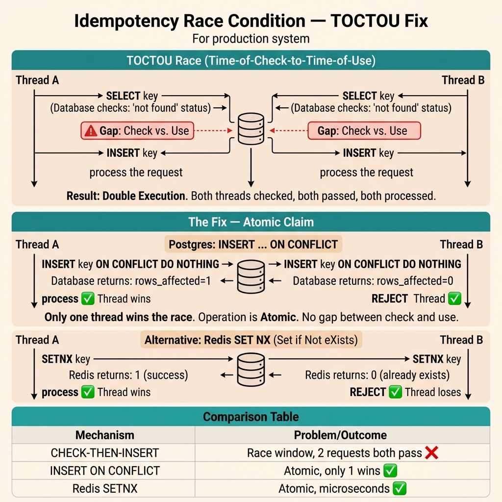

<!-- tags: best-practice, production, idempotency, concurrency -->
# 🔐 Idempotency Key Race Condition — Distributed Lock & Exactly-Once Mutation

> Khi "check rồi mới xử lý" vẫn race — câu chuyện 2 request cùng idempotency key đến cùng lúc, và cách dùng Redis SET NX + DB constraint để đảm bảo exactly-once

📅 Ngày tạo: 2026-03-22 · 🔄 Cập nhật: 2026-04-04 · ⏱️ 14 phút đọc

| Aspect           | Detail                                                                         |
| ---------------- | ------------------------------------------------------------------------------ |
| **Bug**          | 2 request cùng idempotency key qua check → cả 2 đều xử lý → duplicate mutation |
| **Root cause**   | Check-then-act pattern không atomic — TOCTOU (Time of Check, Time of Use)      |
| **Fix**          | Redis `SET NX` claim lock + DB `UNIQUE` constraint safety net + poll pattern   |
| **Go relevance** | `go-redis/v9`, `database/sql`, distributed lock, polling with backoff          |

---

## 1. DEFINE

Bạn đã có idempotency key. Bạn check "key đã xử lý chưa?" trước khi mutation. Bạn tự tin. Rồi Grafana alert: 2 records cùng idempotency key, cách nhau 12ms. Check-then-act race — 2 requests đến cùng lúc, cả 2 đều thấy "chưa xử lý", cả 2 đều xử lý. Idempotency key tồn tại nhưng không idempotent.

Nhiều đội nói đã có idempotency key, rồi vẫn bị duplicate side effect. Lý do thường không nằm ở việc thiếu key, mà ở chỗ hai request cùng key chạm hệ thống gần như đồng thời. `Idempotency Race Condition` là bài học rằng “check rồi mới set” trong distributed system gần như luôn có cửa thua.

Đây là một bài production rất thật vì nó sống ở khoảng thời gian vài mili giây mà local testing hiếm khi tái hiện. Chính khoảng trống cực ngắn đó tạo ra TOCTOU: cả hai request cùng tin mình là người đầu tiên, và side effect chạy đôi trước khi ai kịp nhận ra.

Core insight: **Idempotency chỉ đáng tin khi việc claim quyền xử lý và việc ghi nhận kết quả nằm trong một boundary đủ atomic để request đến cùng lúc không thể cùng thắng.**

### 📖 Câu chuyện: "Idempotency key đã có mà vẫn race"

Team vừa implement idempotency key theo best practice. Code review xong, test pass. Deploy production.

2 ngày sau — support báo 1 user bị trừ tiền 2 lần. Nhưng idempotency key **giống nhau**.

Team kiểm tra log: cả 2 request đến server **cách nhau 3ms**. Cùng key, cùng payload, cả 2 đều xử lý thành công.

### 🔍 Root Cause: TOCTOU (Time of Check, Time of Use)

```go
// ❌ Code "nhìn đúng" nhưng vẫn race
func (h *PaymentHandler) CreatePayment(ctx context.Context, req *PaymentRequest) (*PaymentResponse, error) {
    key := req.IdempotencyKey

    // ① Check — cả 2 request đều query ở đây
    existing, err := h.store.GetByIdempotencyKey(ctx, key)
    if err == nil {
        return existing, nil  // trả kết quả cũ
    }

    // ② Khoảng trống chết chóc (3ms)
    // Request 1: check → không có → tiếp tục
    // Request 2: check → không có → tiếp tục  ← VẪN RACE!

    // ③ Act — cả 2 đều chạy đến đây
    result, err := h.processPayment(ctx, req)  // DUPLICATE MUTATION 💀
    if err != nil {
        return nil, err
    }

    h.store.SaveIdempotencyResult(ctx, key, result, 24*time.Hour)
    return result, nil
}
```
```typescript
// ❌ Code "looks correct" but still races
async function createPayment(req: { idempotencyKey: string; userID: string; amount: number }): Promise<unknown> {
    const key = req.idempotencyKey;

    // ① Check — both requests query here
    const existing = await store.getByIdempotencyKey(key);
    if (existing) return existing; // return old result

    // ② Deadly gap (3ms)
    // Request 1: check → not found → continue
    // Request 2: check → not found → continue ← STILL RACES!

    // ③ Act — both reach here
    const result = await processPayment(req); // DUPLICATE MUTATION 💀
    await store.saveIdempotencyResult(key, result, 24 * 60 * 60 * 1000);
    return result;
}

declare const store: {
    getByIdempotencyKey(key: string): Promise<unknown>;
    saveIdempotencyResult(key: string, result: unknown, ttlMs: number): Promise<void>;
};
declare function processPayment(req: unknown): Promise<unknown>;
```
```rust
// ❌ Code "looks correct" but still races
async fn create_payment(req: &PaymentRequest, store: &dyn Store) -> Result<PaymentResponse, String> {
    let key = &req.idempotency_key;

    // ① Check — both requests query here
    if let Some(existing) = store.get_by_idempotency_key(key).await? {
        return Ok(existing); // return old result
    }

    // ② Deadly gap (3ms)
    // Request 1: check → not found → continue
    // Request 2: check → not found → continue ← STILL RACES!

    // ③ Act — both reach here
    let result = process_payment(req).await?; // DUPLICATE MUTATION 💀
    store.save_idempotency_result(key, &result, 24 * 3600).await?;
    Ok(result)
}

#[async_trait::async_trait]
trait Store: Send + Sync {
    async fn get_by_idempotency_key(&self, key: &str) -> Result<Option<PaymentResponse>, String>;
    async fn save_idempotency_result(&self, key: &str, result: &PaymentResponse, ttl_secs: u64) -> Result<(), String>;
}

struct PaymentRequest { idempotency_key: String, user_id: String, amount: f64 }
#[derive(Clone)] struct PaymentResponse {}
async fn process_payment(_req: &PaymentRequest) -> Result<PaymentResponse, String> { Ok(PaymentResponse{}) }
```
```cpp
#include <string>
#include <optional>
#include <stdexcept>

// ❌ Code "looks correct" but still races
struct PaymentRequest { std::string idempotency_key; std::string user_id; double amount; };
struct PaymentResponse {};

// Both requests query simultaneously — race window between check and act
PaymentResponse create_payment_wrong(const PaymentRequest& req) {
    const auto& key = req.idempotency_key;

    // ① Check — both requests reach here
    auto existing = get_by_idempotency_key(key);
    if (existing) return *existing; // return old result

    // ② Deadly gap: both see "not found" → both continue

    // ③ Act — both reach here → DUPLICATE MUTATION 💀
    auto result = process_payment(req);
    save_idempotency_result(key, result);
    return result;
}

std::optional<PaymentResponse> get_by_idempotency_key(const std::string& key);
PaymentResponse process_payment(const PaymentRequest& req);
void save_idempotency_result(const std::string& key, const PaymentResponse& result);
```
```python
# ❌ Code "looks correct" but still races
async def create_payment(req: dict[str, object], store) -> object:
    key = req["idempotency_key"]

    existing = await store.get_by_idempotency_key(key)
    if existing:
        return existing

    # Both requests can still pass this gap
    result = await process_payment(req)  # DUPLICATE MUTATION
    await store.save_idempotency_result(key, result, ttl_seconds=24 * 3600)
    return result
```

**Chuỗi sự kiện**:

```
Timeline (ms):
  0ms   Request 1: GetByIdempotencyKey("key-abc") → NOT FOUND
  3ms   Request 2: GetByIdempotencyKey("key-abc") → NOT FOUND (chưa lưu!)
  5ms   Request 1: processPayment() → trừ tiền lần 1 ✅
  8ms   Request 2: processPayment() → trừ tiền lần 2 ✅ ← BUG!
 10ms   Request 1: SaveIdempotencyResult("key-abc")
 11ms   Request 2: SaveIdempotencyResult("key-abc") → ghi đè hoặc ignore
```

### Tại sao xảy ra thường xuyên hơn bạn nghĩ?

| Scenario                   | Tần suất      | Nguyên nhân                                              |
| -------------------------- | ------------- | -------------------------------------------------------- |
| **Mobile double tap**      | Rất cao       | User bấm nhanh 2 lần, SDK gửi 2 request với cùng key     |
| **Load balancer retry**    | Cao           | LB timeout 3s → retry → 2 request hit 2 server khác nhau |
| **Network hiccup**         | Trung bình    | TCP retransmit, client nhận timeout giả                  |
| **Kubernetes pod scaling** | Cao khi scale | Sticky session bị phá, request đi pod khác               |
| **Queue consumer restart** | Cao           | Consumer crash → message re-delivery → 2 consumers xử lý |

### Check-then-act vs Atomic claim

| Approach                     | Thread-safe?   | Distributed-safe?      | Performance |
| ---------------------------- | -------------- | ---------------------- | ----------- |
| `SELECT` → check → `INSERT`  | ❌ Race window | ❌                     | Fast        |
| `INSERT ... ON CONFLICT`     | ✅ DB level    | ✅ Single DB           | Medium      |
| Redis `SET NX` → claim       | ✅ Atomic      | ✅ Multi-instance      | **Fast**    |
| Redis `SET NX` + DB `UNIQUE` | ✅ Two layers  | ✅✅ Belt + suspenders | **Best**    |

---

Race condition giữa check và act nghe trừu tượng. Nhưng khi trace 2 requests qua từng bước — check, insert, process — bạn thấy chính xác window mà cả 2 xuyên qua.

## 2. VISUAL

Race condition cùng key rất khó thấy nếu không nhìn hai request song song trên một timeline. Trace dưới đây làm lộ đúng khoảnh khắc TOCTOU xuất hiện.



### Race Condition — Trước và Sau fix

```
❌ TRƯỚC: Check-then-act (TOCTOU race)

  Request 1                    DB/Store                     Request 2
     │                           │                              │
     ├── GetByKey("abc") ──────▶ │                              │
     │                           │── NOT FOUND ──▶              │
     │◀── nil ───────────────────│                              │
     │                           │ ◀── GetByKey("abc") ────────┤
     │                           │── NOT FOUND ──▶              │
     │   processPayment()        │          nil ──────────────▶ │
     │   💰 trừ tiền lần 1       │                              │
     │                           │              processPayment()│
     │                           │              💰 trừ tiền lần 2│
     │── Save("abc", result1) ──▶│                              │
     │                           │◀── Save("abc", result2) ────┤
     │                           │                              │
     DUPLICATE! 💀                                    DUPLICATE! 💀

✅ SAU: Atomic claim with Redis SET NX

  Request 1                Redis              DB              Request 2
     │                       │                 │                  │
     ├── SET NX "abc" ──────▶│                 │                  │
     │◀── OK (claimed!) ─────│                 │                  │
     │                       │ ◀── SET NX "abc" ─────────────────┤
     │                       │── FAIL (exists) ──────────────────▶│
     │                       │                 │                  │
     │  processPayment()     │                 │      waitForResult()
     │  💰 trừ tiền          │                 │      (poll every 200ms)
     │                       │                 │                  │
     │── Save result ────────────────────────▶│                  │
     │── SET "abc" = result ▶│                 │                  │
     │                       │                 │                  │
     │                       │◀── GET "abc" ──────────────────────┤
     │                       │── result ─────────────────────────▶│
     │                       │                 │                  │
     ✅ Xử lý 1 lần duy nhất                        ✅ Trả cached result
```

### Multi-layer Defense

```
┌──────────────────────────────────────────────────────────────────┐
│                    DEFENSE IN DEPTH                               │
│                                                                  │
│  Layer 1: CLIENT                                                 │
│  ┌────────────────────────────────────────────────────────────┐  │
│  │  Generate UUID v4 ONCE → persist in localStorage          │  │
│  │  Mọi retry dùng cùng UUID                                │  │
│  │  Disable button sau khi click (debounce UI)               │  │
│  └────────────────────────────────────────────────────────────┘  │
│                              │                                   │
│  Layer 2: REDIS (Distributed Lock)                               │
│  ┌────────────────────────────────────────────────────────────┐  │
│  │  SET idem:{key} "processing" NX EX 30                     │  │
│  │  → Chỉ 1 request claim thành công                        │  │
│  │  → Request khác poll kết quả                              │  │
│  │  → TTL 30s tự giải phóng nếu crash                       │  │
│  └────────────────────────────────────────────────────────────┘  │
│                              │                                   │
│  Layer 3: DATABASE (Unique Constraint)                           │
│  ┌────────────────────────────────────────────────────────────┐  │
│  │  ALTER TABLE payments                                     │  │
│  │    ADD CONSTRAINT uq_idempotency_key                      │  │
│  │    UNIQUE (idempotency_key);                              │  │
│  │                                                           │  │
│  │  → Dù code có bug, DB KHÔNG CHO insert trùng             │  │
│  │  → Safety net cuối cùng — belt AND suspenders             │  │
│  └────────────────────────────────────────────────────────────┘  │
│                                                                  │
│  ⚠️ Mỗi layer bảo vệ failure mode của layer trên:              │
│     Client fail → Redis chặn                                     │
│     Redis fail → DB chặn                                         │
│     Code bug   → DB constraint vẫn chặn                          │
└──────────────────────────────────────────────────────────────────┘
```

### Poll Pattern — Request thua chờ kết quả

```
Request 1 (winner)              Redis                Request 2 (loser)
     │                            │                        │
     │── SET NX ────────────────▶ │                        │
     │   status = "processing"    │                        │
     │                            │◀── SET NX (fail) ──────┤
     │                            │                        │
     │  processPayment()...       │              ┌─────────┤
     │  (đang xử lý, 500ms)      │              │ Poll 1  │
     │                            │◀── GET ──────┤         │
     │                            │── "processing" ──────▶ │
     │                            │              │ sleep    │
     │                            │              │ 200ms    │
     │                            │              │ Poll 2   │
     │   done!                    │◀── GET ──────┤         │
     │── SET value = result ────▶ │              │         │
     │                            │── result ────────────▶ │
     │                            │              └─────────┘
     │                            │                        │
     ✅ Processed                                 ✅ Got cached result
```

---

Window đã visible. Bây giờ ta đóng window đó: từ Redis SET NX atomic lock đến DB unique constraint, đảm bảo exactly-once dù 100 requests đến cùng millisecond.

## 3. CODE

Khi race window đã rõ, code fix phải khóa nó bằng primitive đủ atomic. Ta đi từ anti-pattern check-then-set sang SET NX, Lua, và database constraint đúng vai trò.

### Example 1: Basic — Redis SET NX Claim Lock

Thay thế check-then-act bằng atomic claim. Chỉ 1 request "thắng" cuộc đua, còn lại chờ kết quả.

```go
package idempotency

import (
	"context"
	"encoding/json"
	"fmt"
	"time"

	"github.com/redis/go-redis/v9"
)

// ─── Atomic claim — không race condition ───
type IdempotencyGuard struct {
	redis   *redis.Client
	lockTTL time.Duration // TTL cho processing lock
	dataTTL time.Duration // TTL cho result cache
}

func NewIdempotencyGuard(rdb *redis.Client) *IdempotencyGuard {
	return &IdempotencyGuard{
		redis:   rdb,
		lockTTL: 30 * time.Second, // Processing timeout
		dataTTL: 24 * time.Hour,   // Cached result giữ 24h
	}
}

type ClaimResult int

const (
	ClaimWon     ClaimResult = iota // Bạn xử lý request này
	ClaimLost                       // Request khác đang xử lý
	ClaimCached                     // Đã có kết quả sẵn
)

// TryClaim — atomic claim quyền xử lý
// Return: ClaimWon (bạn xử lý), ClaimLost (chờ), ClaimCached (trả cache)
func (g *IdempotencyGuard) TryClaim(ctx context.Context, key string) (ClaimResult, error) {
	lockKey := fmt.Sprintf("idem:lock:%s", key)
	dataKey := fmt.Sprintf("idem:data:%s", key)

	// ① Check cached result trước (fast path)
	exists, err := g.redis.Exists(ctx, dataKey).Result()
	if err == nil && exists > 0 {
		return ClaimCached, nil
	}

	// ② Atomic claim bằng SET NX
	// ✅ SET NX là 1 operation atomic trên Redis single-thread
	// Chỉ 1 request SET thành công, mọi request khác nhận false
	claimed, err := g.redis.SetNX(ctx, lockKey, "processing", g.lockTTL).Result()
	if err != nil {
		return 0, fmt.Errorf("redis claim: %w", err)
	}

	if claimed {
		return ClaimWon, nil // 🏆 Bạn xử lý
	}

	return ClaimLost, nil // ⏳ Request khác đang xử lý
}

// SaveResult — lưu kết quả sau khi xử lý xong
func (g *IdempotencyGuard) SaveResult(ctx context.Context, key string, result interface{}) error {
	dataKey := fmt.Sprintf("idem:data:%s", key)
	lockKey := fmt.Sprintf("idem:lock:%s", key)

	data, err := json.Marshal(result)
	if err != nil {
		return fmt.Errorf("marshal result: %w", err)
	}

	pipe := g.redis.Pipeline()
	pipe.Set(ctx, dataKey, data, g.dataTTL)  // Lưu result
	pipe.Del(ctx, lockKey)                    // Release lock
	_, err = pipe.Exec(ctx)
	return err
}

// GetCachedResult — lấy kết quả đã cache
func (g *IdempotencyGuard) GetCachedResult(ctx context.Context, key string, dest interface{}) error {
	dataKey := fmt.Sprintf("idem:data:%s", key)
	data, err := g.redis.Get(ctx, dataKey).Bytes()
	if err != nil {
		return fmt.Errorf("get cached: %w", err)
	}
	return json.Unmarshal(data, dest)
}

// WaitForResult — poll cho đến khi result available
func (g *IdempotencyGuard) WaitForResult(ctx context.Context, key string, dest interface{}) error {
	dataKey := fmt.Sprintf("idem:data:%s", key)

	// Poll với backoff: 100ms, 200ms, 400ms...
	for attempt := 0; attempt < 15; attempt++ {
		data, err := g.redis.Get(ctx, dataKey).Bytes()
		if err == nil {
			return json.Unmarshal(data, dest)
		}

		backoff := time.Duration(100<<attempt) * time.Millisecond
		if backoff > 2*time.Second {
			backoff = 2 * time.Second // Cap tại 2s
		}

		select {
		case <-time.After(backoff):
		case <-ctx.Done():
			return ctx.Err()
		}
	}

	return fmt.Errorf("timeout waiting for result of key %s", key)
}
```
```typescript
import { Redis } from "ioredis";

type ClaimResult = "won" | "lost" | "cached";

class IdempotencyGuard {
  private readonly lockTTL: number; // seconds
  private readonly dataTTL: number; // seconds

  constructor(
    private readonly redis: Redis,
    lockTTL = 30,
    dataTTL = 86_400
  ) {
    this.lockTTL = lockTTL;
    this.dataTTL = dataTTL;
  }

  // tryClaim — atomic claim using SET NX
  async tryClaim(key: string): Promise<ClaimResult> {
    const lockKey = `idem:lock:${key}`;
    const dataKey = `idem:data:${key}`;

    // ① Check cached result first (fast path)
    const exists = await this.redis.exists(dataKey);
    if (exists > 0) return "cached";

    // ② Atomic claim using SET NX
    // ✅ SET NX is 1 atomic operation on Redis single-thread
    const claimed = await this.redis.set(lockKey, "processing", "EX", this.lockTTL, "NX");
    return claimed === "OK" ? "won" : "lost";
  }

  // saveResult — store result after processing
  async saveResult(key: string, result: unknown): Promise<void> {
    const dataKey = `idem:data:${key}`;
    const lockKey = `idem:lock:${key}`;
    const pipeline = this.redis.pipeline();
    pipeline.set(dataKey, JSON.stringify(result), "EX", this.dataTTL);
    pipeline.del(lockKey);
    await pipeline.exec();
  }

  // getCachedResult — retrieve cached result
  async getCachedResult<T>(key: string): Promise<T> {
    const dataKey = `idem:data:${key}`;
    const data = await this.redis.get(dataKey);
    if (!data) throw new Error(`no cached result for key ${key}`);
    return JSON.parse(data) as T;
  }

  // waitForResult — poll until result is available
  async waitForResult<T>(key: string): Promise<T> {
    const dataKey = `idem:data:${key}`;
    for (let attempt = 0; attempt < 15; attempt++) {
      const data = await this.redis.get(dataKey);
      if (data) return JSON.parse(data) as T;

      const backoffMs = Math.min(100 * Math.pow(2, attempt), 2_000);
      await new Promise((resolve) => setTimeout(resolve, backoffMs));
    }
    throw new Error(`timeout waiting for result of key ${key}`);
  }
}
```
```rust
use redis::AsyncCommands;
use serde::{de::DeserializeOwned, Serialize};
use std::time::Duration;
use tokio::time::sleep;

#[derive(Debug, PartialEq)]
pub enum ClaimResult { Won, Lost, Cached }

pub struct IdempotencyGuard {
    redis: redis::Client,
    lock_ttl: usize,  // seconds
    data_ttl: usize,  // seconds
}

impl IdempotencyGuard {
    pub fn new(redis: redis::Client) -> Self {
        IdempotencyGuard { redis, lock_ttl: 30, data_ttl: 86_400 }
    }

    // try_claim — atomic claim using SET NX
    pub async fn try_claim(&self, key: &str) -> Result<ClaimResult, String> {
        let mut conn = self.redis.get_multiplexed_async_connection().await.map_err(|e| e.to_string())?;
        let lock_key = format!("idem:lock:{}", key);
        let data_key = format!("idem:data:{}", key);

        // ① Check cached result first
        let exists: bool = conn.exists(&data_key).await.map_err(|e| e.to_string())?;
        if exists { return Ok(ClaimResult::Cached); }

        // ② Atomic claim using SET NX
        let claimed: Option<String> = redis::cmd("SET")
            .arg(&lock_key).arg("processing").arg("NX").arg("EX").arg(self.lock_ttl)
            .query_async(&mut conn).await.map_err(|e| e.to_string())?;

        Ok(if claimed.is_some() { ClaimResult::Won } else { ClaimResult::Lost })
    }

    // save_result — store result after processing
    pub async fn save_result<T: Serialize>(&self, key: &str, result: &T) -> Result<(), String> {
        let mut conn = self.redis.get_multiplexed_async_connection().await.map_err(|e| e.to_string())?;
        let data_key = format!("idem:data:{}", key);
        let lock_key = format!("idem:lock:{}", key);
        let data = serde_json::to_string(result).map_err(|e| e.to_string())?;

        let mut pipe = redis::pipe();
        pipe.set_ex(&data_key, &data, self.data_ttl as u64).del(&lock_key);
        pipe.query_async(&mut conn).await.map_err(|e| e.to_string())?;
        Ok(())
    }

    // wait_for_result — poll until result is available
    pub async fn wait_for_result<T: DeserializeOwned>(&self, key: &str) -> Result<T, String> {
        let mut conn = self.redis.get_multiplexed_async_connection().await.map_err(|e| e.to_string())?;
        let data_key = format!("idem:data:{}", key);

        for attempt in 0..15u64 {
            let data: Option<String> = conn.get(&data_key).await.map_err(|e| e.to_string())?;
            if let Some(d) = data {
                return serde_json::from_str(&d).map_err(|e| e.to_string());
            }
            let backoff = Duration::from_millis((100 * (1 << attempt)).min(2000));
            sleep(backoff).await;
        }
        Err(format!("timeout waiting for result of key {}", key))
    }
}
```
```cpp
#include <hiredis/hiredis.h>
#include <nlohmann/json.hpp>
#include <string>
#include <optional>
#include <stdexcept>
#include <thread>
#include <chrono>
#include <algorithm>

enum class ClaimResult { Won, Lost, Cached };

class IdempotencyGuard {
public:
    explicit IdempotencyGuard(const std::string& redis_host, int redis_port = 6379,
                              int lock_ttl = 30, int data_ttl = 86400)
        : lock_ttl_(lock_ttl), data_ttl_(data_ttl) {
        ctx_ = redisConnect(redis_host.c_str(), redis_port);
        if (!ctx_ || ctx_->err) throw std::runtime_error("Redis connection failed");
    }

    ~IdempotencyGuard() { if (ctx_) redisFree(ctx_); }

    // try_claim — atomic claim using SET NX
    ClaimResult try_claim(const std::string& key) {
        const std::string data_key = "idem:data:" + key;
        const std::string lock_key = "idem:lock:" + key;

        // ① Check cached result first
        auto* exists_reply = static_cast<redisReply*>(redisCommand(ctx_, "EXISTS %s", data_key.c_str()));
        bool cached = exists_reply && exists_reply->integer > 0;
        freeReplyObject(exists_reply);
        if (cached) return ClaimResult::Cached;

        // ② Atomic claim using SET NX EX
        auto* reply = static_cast<redisReply*>(
            redisCommand(ctx_, "SET %s processing NX EX %d", lock_key.c_str(), lock_ttl_)
        );
        bool won = reply && reply->type == REDIS_REPLY_STATUS;
        freeReplyObject(reply);
        return won ? ClaimResult::Won : ClaimResult::Lost;
    }

    // save_result — store result after processing
    void save_result(const std::string& key, const nlohmann::json& result) {
        const std::string data_key = "idem:data:" + key;
        const std::string lock_key = "idem:lock:" + key;
        const std::string data = result.dump();
        redisCommand(ctx_, "SETEX %s %d %s", data_key.c_str(), data_ttl_, data.c_str());
        redisCommand(ctx_, "DEL %s", lock_key.c_str());
    }

    // wait_for_result — poll until result is available
    nlohmann::json wait_for_result(const std::string& key) {
        const std::string data_key = "idem:data:" + key;
        for (int attempt = 0; attempt < 15; ++attempt) {
            auto* reply = static_cast<redisReply*>(redisCommand(ctx_, "GET %s", data_key.c_str()));
            if (reply && reply->type == REDIS_REPLY_STRING) {
                auto result = nlohmann::json::parse(reply->str);
                freeReplyObject(reply);
                return result;
            }
            freeReplyObject(reply);
            int backoff_ms = static_cast<int>(std::min(100 * (1 << attempt), 2000));
            std::this_thread::sleep_for(std::chrono::milliseconds(backoff_ms));
        }
        throw std::runtime_error("timeout waiting for result of key " + key);
    }

private:
    redisContext* ctx_;
    int lock_ttl_;
    int data_ttl_;
};
```
```python
from __future__ import annotations

import asyncio
import json
from enum import Enum

class ClaimResult(str, Enum):
    WON = "won"
    LOST = "lost"
    CACHED = "cached"

class IdempotencyGuard:
    def __init__(self, redis, lock_ttl: int = 30, data_ttl: int = 86_400) -> None:
        self.redis = redis
        self.lock_ttl = lock_ttl
        self.data_ttl = data_ttl

    async def try_claim(self, key: str) -> ClaimResult:
        data_key = f"idem:data:{key}"
        lock_key = f"idem:lock:{key}"

        if await self.redis.exists(data_key):
            return ClaimResult.CACHED

        claimed = await self.redis.set(lock_key, "processing", ex=self.lock_ttl, nx=True)
        return ClaimResult.WON if claimed else ClaimResult.LOST

    async def save_result(self, key: str, result: object) -> None:
        async with self.redis.pipeline(transaction=True) as pipe:
            await pipe.set(f"idem:data:{key}", json.dumps(result), ex=self.data_ttl)
            await pipe.delete(f"idem:lock:{key}")
            await pipe.execute()

    async def wait_for_result(self, key: str) -> object:
        data_key = f"idem:data:{key}"
        for attempt in range(15):
            data = await self.redis.get(data_key)
            if data:
                return json.loads(data)
            await asyncio.sleep(min(0.1 * (2**attempt), 2.0))
        raise TimeoutError(f"timeout waiting for result of key {key}")
```

**Kết luận**: `SET NX` đảm bảo chỉ 1 request claim thành công — atomic trên Redis single-thread, không cần mutex hay distributed lock phức tạp. Request thua chờ poll kết quả với exponential backoff.

---

### Example 2: Intermediate — Payment Handler với Idempotency Guard

Tích hợp guard vào handler thực tế. 3 nhánh xử lý: won → process, cached → return, lost → wait.

```go
package payment

import (
	"context"
	"database/sql"
	"encoding/json"
	"fmt"
	"net/http"
	"time"
)

type PaymentHandler struct {
	guard   *idempotency.IdempotencyGuard
	service *PaymentService
}

func NewPaymentHandler(guard *idempotency.IdempotencyGuard, svc *PaymentService) *PaymentHandler {
	return &PaymentHandler{guard: guard, service: svc}
}

func (h *PaymentHandler) ServeHTTP(w http.ResponseWriter, r *http.Request) {
	var req PaymentRequest
	if err := json.NewDecoder(r.Body).Decode(&req); err != nil {
		writeError(w, http.StatusBadRequest, "invalid request body")
		return
	}

	// ① Validate idempotency key
	key := r.Header.Get("Idempotency-Key")
	if key == "" {
		writeError(w, http.StatusBadRequest, "Idempotency-Key header required")
		return
	}

	// ② Try claim
	claim, err := h.guard.TryClaim(r.Context(), key)
	if err != nil {
		writeError(w, http.StatusInternalServerError, "claim failed")
		return
	}

	var resp PaymentResponse

	switch claim {
	case idempotency.ClaimCached:
		// ✅ Đã xử lý trước đó — trả cached result
		if err := h.guard.GetCachedResult(r.Context(), key, &resp); err != nil {
			writeError(w, http.StatusInternalServerError, "get cached failed")
			return
		}
		w.Header().Set("X-Idempotent-Replayed", "true")

	case idempotency.ClaimWon:
		// 🏆 Request này xử lý — chỉ mình nó chạy
		result, err := h.service.ProcessPayment(r.Context(), req)
		if err != nil {
			// Xử lý fail — release lock (để retry mới có thể claim)
			// Không lưu result vào cache
			writeError(w, http.StatusInternalServerError, err.Error())
			return
		}

		// Lưu result cho request khác đang chờ
		h.guard.SaveResult(r.Context(), key, result)
		resp = *result

	case idempotency.ClaimLost:
		// ⏳ Request khác đang xử lý — chờ kết quả
		if err := h.guard.WaitForResult(r.Context(), key, &resp); err != nil {
			writeError(w, http.StatusConflict, "request in flight, try again")
			return
		}
		w.Header().Set("X-Idempotent-Replayed", "true")
	}

	w.Header().Set("Content-Type", "application/json")
	w.WriteHeader(http.StatusOK)
	json.NewEncoder(w).Encode(resp)
}

type PaymentRequest struct {
	UserID   string  `json:"user_id"`
	Amount   float64 `json:"amount"`
	Currency string  `json:"currency"`
}

type PaymentResponse struct {
	TransactionID string  `json:"transaction_id"`
	Status        string  `json:"status"`
	Amount        float64 `json:"amount"`
	BalanceAfter  float64 `json:"balance_after"`
}

func writeError(w http.ResponseWriter, code int, msg string) {
	w.Header().Set("Content-Type", "application/json")
	w.WriteHeader(code)
	json.NewEncoder(w).Encode(map[string]string{"error": msg})
}
```
```typescript
import { Request, Response } from "express";

interface PaymentRequest { userID: string; amount: number; currency: string; }
interface PaymentResponse { transactionID: string; status: string; amount: number; balanceAfter: number; }

class PaymentHandler {
  constructor(
    private readonly guard: IdempotencyGuard,
    private readonly service: { processPayment(req: PaymentRequest): Promise<PaymentResponse> }
  ) {}

  async handle(req: Request, res: Response): Promise<void> {
    let body: PaymentRequest;
    try { body = req.body as PaymentRequest; } catch {
      res.status(400).json({ error: "invalid request body" }); return;
    }

    const key = req.headers["idempotency-key"] as string | undefined;
    if (!key) { res.status(400).json({ error: "Idempotency-Key header required" }); return; }

    // ② Try claim
    const claim = await this.guard.tryClaim(key);

    switch (claim) {
      case "cached": {
        // ✅ Already processed — return cached result
        const cached = await this.guard.getCachedResult<PaymentResponse>(key);
        res.set("X-Idempotent-Replayed", "true").json(cached);
        return;
      }
      case "won": {
        // 🏆 This request processes — only it runs
        try {
          const result = await this.service.processPayment(body);
          await this.guard.saveResult(key, result);
          res.json(result);
        } catch (err) {
          // Fail — don't save to cache, so retry can claim again
          res.status(500).json({ error: (err as Error).message });
        }
        return;
      }
      case "lost": {
        // ⏳ Another request is processing — wait for result
        try {
          const result = await this.guard.waitForResult<PaymentResponse>(key);
          res.set("X-Idempotent-Replayed", "true").json(result);
        } catch {
          res.status(409).json({ error: "request in flight, try again" });
        }
        return;
      }
    }
  }
}

declare class IdempotencyGuard {
  tryClaim(key: string): Promise<"won" | "lost" | "cached">;
  getCachedResult<T>(key: string): Promise<T>;
  saveResult(key: string, result: unknown): Promise<void>;
  waitForResult<T>(key: string): Promise<T>;
}
```
```rust
use actix_web::{web, HttpRequest, HttpResponse};
use serde::{Deserialize, Serialize};

#[derive(Deserialize)]
pub struct PaymentRequest { pub user_id: String, pub amount: f64, pub currency: String }

#[derive(Serialize, Deserialize, Clone)]
pub struct PaymentResponse { pub transaction_id: String, pub status: String, pub amount: f64, pub balance_after: f64 }

pub async fn payment_handler(
    http_req: HttpRequest,
    body: web::Json<PaymentRequest>,
    guard: web::Data<IdempotencyGuard>,
    service: web::Data<dyn PaymentServiceTrait>,
) -> HttpResponse {
    let key = match http_req.headers().get("Idempotency-Key").and_then(|v| v.to_str().ok()) {
        Some(k) => k.to_string(),
        None => return HttpResponse::BadRequest().json(serde_json::json!({"error": "Idempotency-Key header required"})),
    };

    match guard.try_claim(&key).await {
        Ok(ClaimResult::Cached) => {
            // ✅ Already processed — return cached result
            match guard.get_cached_result::<PaymentResponse>(&key).await {
                Ok(cached) => HttpResponse::Ok().insert_header(("X-Idempotent-Replayed", "true")).json(cached),
                Err(e) => HttpResponse::InternalServerError().json(serde_json::json!({"error": e})),
            }
        }
        Ok(ClaimResult::Won) => {
            // 🏆 This request processes — only it runs
            match service.process_payment(&body.0).await {
                Ok(result) => {
                    let _ = guard.save_result(&key, &result).await;
                    HttpResponse::Ok().json(result)
                }
                Err(e) => HttpResponse::InternalServerError().json(serde_json::json!({"error": e})),
            }
        }
        Ok(ClaimResult::Lost) => {
            // ⏳ Another request is processing — wait for result
            match guard.wait_for_result::<PaymentResponse>(&key).await {
                Ok(result) => HttpResponse::Ok().insert_header(("X-Idempotent-Replayed", "true")).json(result),
                Err(_) => HttpResponse::Conflict().json(serde_json::json!({"error": "request in flight, try again"})),
            }
        }
        Err(e) => HttpResponse::InternalServerError().json(serde_json::json!({"error": e})),
    }
}

#[async_trait::async_trait]
pub trait PaymentServiceTrait: Send + Sync {
    async fn process_payment(&self, req: &PaymentRequest) -> Result<PaymentResponse, String>;
}
```
```cpp
#include <crow.h>
#include <nlohmann/json.hpp>
#include <string>

// Payment handler with 3 clear branches: won / cached / lost
crow::response payment_handler(const crow::request& req, IdempotencyGuard& guard, PaymentService& service) {
    auto body = nlohmann::json::parse(req.body, nullptr, false);
    if (body.is_discarded()) {
        return crow::response(400, R"({"error":"invalid request body"})");
    }

    const auto* key_header = req.get_header_value("Idempotency-Key").c_str();
    if (!key_header || std::string(key_header).empty()) {
        return crow::response(400, R"({"error":"Idempotency-Key header required"})");
    }
    std::string key(key_header);

    // Try claim
    auto claim = guard.try_claim(key);

    if (claim == ClaimResult::Cached) {
        // ✅ Already processed — return cached result
        try {
            auto cached = guard.get_cached_result(key);
            crow::response r(200, cached.dump());
            r.add_header("X-Idempotent-Replayed", "true");
            return r;
        } catch (...) {
            return crow::response(500, R"({"error":"get cached failed"})");
        }
    }

    if (claim == ClaimResult::Won) {
        // 🏆 This request processes — only it runs
        try {
            auto result = service.process_payment(body);
            guard.save_result(key, result);
            return crow::response(200, result.dump());
        } catch (const std::exception& e) {
            return crow::response(500, nlohmann::json{{"error", e.what()}}.dump());
        }
    }

    // ClaimResult::Lost — ⏳ Another request is processing — wait for result
    try {
        auto result = guard.wait_for_result(key);
        crow::response r(200, result.dump());
        r.add_header("X-Idempotent-Replayed", "true");
        return r;
    } catch (...) {
        return crow::response(409, R"({"error":"request in flight, try again"})");
    }
}
```
```python
from __future__ import annotations

import json

from fastapi import HTTPException, Request
from fastapi.responses import JSONResponse

async def _get_cached_result(self, key: str) -> object:
    data = await self.redis.get(f"idem:data:{key}")
    if not data:
        raise KeyError(key)
    return json.loads(data)

IdempotencyGuard.get_cached_result = _get_cached_result

class PaymentHandler:
    def __init__(self, guard: IdempotencyGuard, service) -> None:
        self.guard = guard
        self.service = service

    async def handle(self, request: Request) -> JSONResponse:
        body = await request.json()
        key = request.headers.get("Idempotency-Key")
        if not key:
            raise HTTPException(status_code=400, detail="Idempotency-Key header required")

        claim = await self.guard.try_claim(key)
        if claim == ClaimResult.CACHED:
            cached = await self.guard.get_cached_result(key)
            return JSONResponse(cached, headers={"X-Idempotent-Replayed": "true"})

        if claim == ClaimResult.WON:
            result = await self.service.process_payment(body)
            await self.guard.save_result(key, result)
            return JSONResponse(result)

        try:
            result = await self.guard.wait_for_result(key)
            return JSONResponse(result, headers={"X-Idempotent-Replayed": "true"})
        except TimeoutError as exc:
            raise HTTPException(status_code=409, detail="request in flight, try again") from exc
```

**Kết luận**: Handler có 3 nhánh rõ ràng: won (xử lý), cached (trả cache), lost (chờ poll). `X-Idempotent-Replayed: true` header cho client biết đây là response từ cache. Nếu processing fail → không lưu cache → retry mới có thể claim lại.

---

### Example 3: Advanced — DB Constraint Safety Net + Transaction

Dù Redis claim đúng, DB `UNIQUE` constraint vẫn phải có. Redis là tốc độ, DB là an toàn. Belt AND suspenders.

```go
package payment

import (
	"context"
	"database/sql"
	"fmt"
	"time"
)

type PaymentService struct {
	db *sql.DB
}

func NewPaymentService(db *sql.DB) *PaymentService {
	return &PaymentService{db: db}
}

// ProcessPayment — idempotent payment trong DB transaction
// ⚠️ DB UNIQUE constraint là safety net CUỐI CÙNG
func (s *PaymentService) ProcessPayment(ctx context.Context, req PaymentRequest) (*PaymentResponse, error) {
	tx, err := s.db.BeginTx(ctx, &sql.TxOptions{
		Isolation: sql.LevelReadCommitted,
	})
	if err != nil {
		return nil, fmt.Errorf("begin tx: %w", err)
	}
	defer tx.Rollback()

	// ① Check DB-level idempotency (backup cho Redis)
	// Trường hợp: Redis crash reset → 2 request claim lại → DB chặn
	var existingTxnID string
	err = tx.QueryRowContext(ctx, `
		SELECT transaction_id FROM payments
		WHERE idempotency_key = $1
	`, req.IdempotencyKey).Scan(&existingTxnID)

	if err == nil {
		// ✅ Đã xử lý trong DB — trả kết quả cũ
		return s.getPaymentByTxnID(ctx, tx, existingTxnID)
	}
	if err != sql.ErrNoRows {
		return nil, fmt.Errorf("check existing: %w", err)
	}

	// ② Deduct balance
	var balanceAfter float64
	err = tx.QueryRowContext(ctx, `
		UPDATE wallets
		SET balance = balance - $1, updated_at = NOW()
		WHERE user_id = $2 AND balance >= $1
		RETURNING balance
	`, req.Amount, req.UserID).Scan(&balanceAfter)

	if err == sql.ErrNoRows {
		return nil, fmt.Errorf("insufficient balance")
	}
	if err != nil {
		return nil, fmt.Errorf("deduct: %w", err)
	}

	// ③ Insert payment với idempotency_key (UNIQUE constraint)
	txnID := fmt.Sprintf("txn_%d", time.Now().UnixNano())
	_, err = tx.ExecContext(ctx, `
		INSERT INTO payments (
			transaction_id, idempotency_key, user_id,
			amount, currency, status, created_at
		) VALUES ($1, $2, $3, $4, $5, 'completed', NOW())
	`, txnID, req.IdempotencyKey, req.UserID, req.Amount, req.Currency)

	if err != nil {
		// ⚠️ UNIQUE violation = duplicate — DB đã chặn
		// Dù Redis không chặn được, DB vẫn bảo vệ
		return nil, fmt.Errorf("insert payment (possible duplicate): %w", err)
	}

	// ④ Commit
	if err := tx.Commit(); err != nil {
		return nil, fmt.Errorf("commit: %w", err)
	}

	return &PaymentResponse{
		TransactionID: txnID,
		Status:        "completed",
		Amount:        req.Amount,
		BalanceAfter:  balanceAfter,
	}, nil
}

func (s *PaymentService) getPaymentByTxnID(ctx context.Context, tx *sql.Tx, txnID string) (*PaymentResponse, error) {
	var resp PaymentResponse
	err := tx.QueryRowContext(ctx, `
		SELECT transaction_id, status, amount
		FROM payments WHERE transaction_id = $1
	`, txnID).Scan(&resp.TransactionID, &resp.Status, &resp.Amount)
	if err != nil {
		return nil, err
	}
	return &resp, nil
}

// ─── Migration SQL ───
/*
-- Payment table với UNIQUE constraint trên idempotency_key
CREATE TABLE payments (
    transaction_id   VARCHAR(255) PRIMARY KEY,
    idempotency_key  VARCHAR(255) NOT NULL,
    user_id          VARCHAR(255) NOT NULL,
    amount           DECIMAL(15,2) NOT NULL,
    currency         VARCHAR(3) NOT NULL DEFAULT 'VND',
    status           VARCHAR(20) NOT NULL DEFAULT 'pending',
    created_at       TIMESTAMPTZ NOT NULL DEFAULT NOW(),

    -- ⚠️ SAFETY NET: DB không bao giờ cho 2 payment cùng key
    CONSTRAINT uq_payments_idempotency_key UNIQUE (idempotency_key),
    CONSTRAINT chk_amount_positive CHECK (amount > 0)
);

-- Index cho lookup nhanh
CREATE INDEX idx_payments_user_id ON payments(user_id);
CREATE INDEX idx_payments_created_at ON payments(created_at);

-- Wallet table
CREATE TABLE wallets (
    user_id    VARCHAR(255) PRIMARY KEY,
    balance    DECIMAL(15,2) NOT NULL DEFAULT 0,
    currency   VARCHAR(3) NOT NULL DEFAULT 'VND',
    updated_at TIMESTAMPTZ NOT NULL DEFAULT NOW(),

    -- Balance không bao giờ âm
    CONSTRAINT chk_balance_positive CHECK (balance >= 0)
);
*/
```
```typescript
import { Pool } from "pg";

interface PaymentRequest { idempotencyKey: string; userID: string; amount: number; currency: string; }
interface PaymentResponse { transactionID: string; status: string; amount: number; balanceAfter: number; }

class PaymentService {
  constructor(private readonly db: Pool) {}

  // process_payment — idempotent with DB UNIQUE constraint as safety net
  async processPayment(req: PaymentRequest): Promise<PaymentResponse> {
    const client = await this.db.connect();
    try {
      await client.query("BEGIN");

      // ① Check DB-level idempotency (backup for Redis)
      const existing = await client.query<{ transaction_id: string }>(
        "SELECT transaction_id FROM payments WHERE idempotency_key = $1",
        [req.idempotencyKey]
      );
      if (existing.rowCount) {
        const resp = await this.getPaymentByTxnID(client, existing.rows[0].transaction_id);
        await client.query("COMMIT");
        return resp;
      }

      // ② Deduct balance
      const balanceResult = await client.query<{ balance: number }>(
        "UPDATE wallets SET balance = balance - $1, updated_at = NOW() WHERE user_id = $2 AND balance >= $1 RETURNING balance",
        [req.amount, req.userID]
      );
      if (!balanceResult.rowCount) {
        await client.query("ROLLBACK");
        throw new Error("insufficient balance");
      }
      const balanceAfter = balanceResult.rows[0].balance;

      // ③ Insert payment with idempotency_key (UNIQUE constraint)
      const txnID = `txn_${Date.now()}`;
      try {
        await client.query(
          "INSERT INTO payments (transaction_id, idempotency_key, user_id, amount, currency, status, created_at) VALUES ($1, $2, $3, $4, $5, 'completed', NOW())",
          [txnID, req.idempotencyKey, req.userID, req.amount, req.currency]
        );
      } catch {
        // ⚠️ UNIQUE violation = duplicate — DB already blocked it
        await client.query("ROLLBACK");
        throw new Error("insert payment (possible duplicate)");
      }

      await client.query("COMMIT");
      return { transactionID: txnID, status: "completed", amount: req.amount, balanceAfter };
    } catch (err) {
      await client.query("ROLLBACK").catch(() => {});
      throw err;
    } finally {
      client.release();
    }
  }

  private async getPaymentByTxnID(client: import("pg").PoolClient, txnID: string): Promise<PaymentResponse> {
    const { rows } = await client.query<PaymentResponse>(
      "SELECT transaction_id as \"transactionID\", status, amount FROM payments WHERE transaction_id = $1",
      [txnID]
    );
    return rows[0];
  }
}
```
```rust
use sqlx::PgPool;
use serde::{Deserialize, Serialize};

#[derive(Deserialize)]
pub struct PaymentRequest { pub idempotency_key: String, pub user_id: String, pub amount: f64, pub currency: String }

#[derive(Serialize, sqlx::FromRow)]
pub struct PaymentResponse { pub transaction_id: String, pub status: String, pub amount: f64, pub balance_after: f64 }

pub struct PaymentService { db: PgPool }

impl PaymentService {
    pub fn new(db: PgPool) -> Self { PaymentService { db } }

    // process_payment — idempotent with DB UNIQUE constraint as safety net
    pub async fn process_payment(&self, req: &PaymentRequest) -> Result<PaymentResponse, String> {
        let mut tx = self.db.begin().await.map_err(|e| e.to_string())?;

        // ① Check DB-level idempotency (backup for Redis)
        let existing: Option<(String,)> = sqlx::query_as(
            "SELECT transaction_id FROM payments WHERE idempotency_key = $1"
        )
        .bind(&req.idempotency_key)
        .fetch_optional(&mut *tx)
        .await.map_err(|e| e.to_string())?;

        if let Some((txn_id,)) = existing {
            let resp: PaymentResponse = sqlx::query_as(
                "SELECT transaction_id, status, amount, 0.0::float8 as balance_after FROM payments WHERE transaction_id = $1"
            )
            .bind(&txn_id)
            .fetch_one(&mut *tx)
            .await.map_err(|e| e.to_string())?;
            tx.commit().await.ok();
            return Ok(resp);
        }

        // ② Deduct balance
        let balance: Option<(f64,)> = sqlx::query_as(
            "UPDATE wallets SET balance = balance - $1, updated_at = NOW() WHERE user_id = $2 AND balance >= $1 RETURNING balance"
        )
        .bind(req.amount).bind(&req.user_id)
        .fetch_optional(&mut *tx)
        .await.map_err(|e| e.to_string())?;

        let (balance_after,) = balance.ok_or("insufficient balance")?;

        // ③ Insert payment with idempotency_key (UNIQUE constraint)
        let txn_id = format!("txn_{}", chrono::Utc::now().timestamp_nanos_opt().unwrap_or_default());
        sqlx::query(
            "INSERT INTO payments (transaction_id, idempotency_key, user_id, amount, currency, status, created_at) VALUES ($1, $2, $3, $4, $5, 'completed', NOW())"
        )
        .bind(&txn_id).bind(&req.idempotency_key).bind(&req.user_id).bind(req.amount).bind(&req.currency)
        .execute(&mut *tx).await
        .map_err(|e| format!("insert payment (possible duplicate): {}", e))?;

        tx.commit().await.map_err(|e| e.to_string())?;
        Ok(PaymentResponse { transaction_id: txn_id, status: "completed".to_string(), amount: req.amount, balance_after })
    }
}
```
```cpp
#include <pqxx/pqxx>
#include <nlohmann/json.hpp>
#include <string>
#include <optional>
#include <stdexcept>
#include <chrono>

struct PaymentRequest { std::string idempotency_key, user_id, currency; double amount; };
struct PaymentResponse { std::string transaction_id, status; double amount, balance_after; };

class PaymentService {
public:
    explicit PaymentService(const std::string& conn_str) : conn_(conn_str) {}

    // process_payment — idempotent with DB UNIQUE constraint as safety net
    PaymentResponse process_payment(const PaymentRequest& req) {
        pqxx::work tx(conn_);

        // ① Check DB-level idempotency (backup for Redis)
        auto existing = tx.exec_params(
            "SELECT transaction_id FROM payments WHERE idempotency_key = $1", req.idempotency_key
        );
        if (!existing.empty()) {
            auto resp_row = tx.exec_params1(
                "SELECT transaction_id, status, amount FROM payments WHERE transaction_id = $1",
                existing[0][0].c_str()
            );
            tx.commit();
            return {resp_row[0].c_str(), resp_row[1].c_str(), resp_row[2].as<double>(), 0.0};
        }

        // ② Deduct balance
        auto balance_result = tx.exec_params(
            "UPDATE wallets SET balance = balance - $1, updated_at = NOW() WHERE user_id = $2 AND balance >= $1 RETURNING balance",
            req.amount, req.user_id
        );
        if (balance_result.empty()) {
            tx.abort();
            throw std::runtime_error("insufficient balance");
        }
        double balance_after = balance_result[0][0].as<double>();

        // ③ Insert payment with idempotency_key (UNIQUE constraint)
        auto now_ns = std::chrono::duration_cast<std::chrono::nanoseconds>(
            std::chrono::system_clock::now().time_since_epoch()
        ).count();
        std::string txn_id = "txn_" + std::to_string(now_ns);

        try {
            tx.exec_params(
                "INSERT INTO payments (transaction_id, idempotency_key, user_id, amount, currency, status, created_at) VALUES ($1, $2, $3, $4, $5, 'completed', NOW())",
                txn_id, req.idempotency_key, req.user_id, req.amount, req.currency
            );
        } catch (const pqxx::unique_violation&) {
            // ⚠️ UNIQUE violation = duplicate — DB already blocked it
            tx.abort();
            throw std::runtime_error("insert payment (possible duplicate)");
        }

        tx.commit();
        return {txn_id, "completed", req.amount, balance_after};
    }

private:
    pqxx::connection conn_;
};
```
```python
from __future__ import annotations

import time
from dataclasses import dataclass

@dataclass
class PaymentRequest:
    idempotency_key: str
    user_id: str
    amount: float
    currency: str

@dataclass
class PaymentResponse:
    transaction_id: str
    status: str
    amount: float
    balance_after: float

class PaymentService:
    def __init__(self, db) -> None:
        self.db = db

    async def process_payment(self, req: PaymentRequest) -> PaymentResponse:
        async with self.db.acquire() as conn:
            async with conn.transaction():
                existing_txn_id = await conn.fetchval(
                    "SELECT transaction_id FROM payments WHERE idempotency_key = $1",
                    req.idempotency_key,
                )
                if existing_txn_id:
                    row = await conn.fetchrow(
                        """
                        SELECT transaction_id, status, amount, 0.0 AS balance_after
                        FROM payments
                        WHERE transaction_id = $1
                        """,
                        existing_txn_id,
                    )
                    return PaymentResponse(**dict(row))

                balance_after = await conn.fetchval(
                    """
                    UPDATE wallets
                    SET balance = balance - $1, updated_at = NOW()
                    WHERE user_id = $2 AND balance >= $1
                    RETURNING balance
                    """,
                    req.amount,
                    req.user_id,
                )
                if balance_after is None:
                    raise RuntimeError("insufficient balance")

                txn_id = f"txn_{time.time_ns()}"
                try:
                    await conn.execute(
                        """
                        INSERT INTO payments (
                            transaction_id, idempotency_key, user_id,
                            amount, currency, status, created_at
                        ) VALUES ($1, $2, $3, $4, $5, 'completed', NOW())
                        """,
                        txn_id,
                        req.idempotency_key,
                        req.user_id,
                        req.amount,
                        req.currency,
                    )
                except Exception as exc:
                    raise RuntimeError("insert payment (possible duplicate)") from exc

                return PaymentResponse(
                    transaction_id=txn_id,
                    status="completed",
                    amount=req.amount,
                    balance_after=balance_after,
                )
```

**Kết luận**: Redis chặn nhanh (< 1ms), DB chặn chắc (`UNIQUE` constraint). Nếu Redis crash/reset → DB vẫn từ chối duplicate. `WHERE balance >= $1` đảm bảo balance không âm. 2 lớp bảo vệ độc lập — failure ở 1 lớp không gây duplicate.

---

### Example 4: Expert — Idempotency Middleware Reusable + Lua Script Atomic

Middleware tách biệt khỏi business logic, plug vào bất kỳ handler nào. Lua script kiểm tra cache + claim trong 1 roundtrip.

```go
package middleware

import (
	"context"
	"encoding/json"
	"fmt"
	"log/slog"
	"net/http"
	"time"

	"github.com/redis/go-redis/v9"
)

// ─── Lua script: check cache + claim lock — 1 roundtrip ───
// ✅ Atomic: không có window giữa check và claim
var idempotencyScript = redis.NewScript(`
	local data_key = KEYS[1]   -- idem:data:{key}
	local lock_key = KEYS[2]   -- idem:lock:{key}
	local lock_ttl = tonumber(ARGV[1])  -- seconds

	-- ① Check cached result
	local cached = redis.call('GET', data_key)
	if cached then
		return cached  -- Hit cache, trả cached result
	end

	-- ② Try claim (atomic SET NX)
	local claimed = redis.call('SET', lock_key, 'processing', 'NX', 'EX', lock_ttl)
	if claimed then
		return '__CLAIMED__'   -- Bạn xử lý
	end

	return '__WAITING__'  -- Ai đó đang xử lý
`)

func Idempotent(rdb *redis.Client, lockTTL, dataTTL time.Duration) func(http.Handler) http.Handler {
	return func(next http.Handler) http.Handler {
		return http.HandlerFunc(func(w http.ResponseWriter, r *http.Request) {
			// Chỉ apply cho mutating methods
			if r.Method != http.MethodPost && r.Method != http.MethodPatch {
				next.ServeHTTP(w, r)
				return
			}

			key := r.Header.Get("Idempotency-Key")
			if key == "" {
				writeJSON(w, http.StatusBadRequest, map[string]string{
					"error": "Idempotency-Key header is required for POST/PATCH requests",
				})
				return
			}

			dataKey := fmt.Sprintf("idem:data:%s", key)
			lockKey := fmt.Sprintf("idem:lock:%s", key)

			// ① Lua script: check + claim trong 1 roundtrip
			result, err := idempotencyScript.Run(r.Context(), rdb,
				[]string{dataKey, lockKey},
				int(lockTTL.Seconds()),
			).Text()

			if err != nil && err != redis.Nil {
				slog.Error("idempotency check failed", "key", key, "error", err)
				// Redis down → fallback: cho request đi qua, DB constraint sẽ chặn
				next.ServeHTTP(w, r)
				return
			}

			switch result {
			case "__CLAIMED__":
				// 🏆 Claim thành công — xử lý request
				capture := &responseCapture{ResponseWriter: w}
				next.ServeHTTP(capture, r)

				// Lưu response vào cache
				if capture.statusCode >= 200 && capture.statusCode < 300 {
					pipe := rdb.Pipeline()
					pipe.Set(r.Context(), dataKey, capture.body, dataTTL)
					pipe.Del(r.Context(), lockKey)
					pipe.Exec(r.Context())
				} else {
					// Handler trả error → release lock cho retry
					rdb.Del(r.Context(), lockKey)
				}

			case "__WAITING__":
				// ⏳ Ai đó đang xử lý — poll kết quả
				var cachedResp []byte
				for i := 0; i < 15; i++ {
					data, err := rdb.Get(r.Context(), dataKey).Bytes()
					if err == nil {
						cachedResp = data
						break
					}
					select {
					case <-time.After(200 * time.Millisecond):
					case <-r.Context().Done():
						writeJSON(w, http.StatusGatewayTimeout, map[string]string{
							"error": "timeout waiting for processing",
						})
						return
					}
				}

				if cachedResp != nil {
					w.Header().Set("Content-Type", "application/json")
					w.Header().Set("X-Idempotent-Replayed", "true")
					w.WriteHeader(http.StatusOK)
					w.Write(cachedResp)
				} else {
					writeJSON(w, http.StatusConflict, map[string]string{
						"error": "request is being processed, please retry",
					})
				}

			default:
				// ✅ Cached result — trả lại ngay
				w.Header().Set("Content-Type", "application/json")
				w.Header().Set("X-Idempotent-Replayed", "true")
				w.WriteHeader(http.StatusOK)
				w.Write([]byte(result))
			}
		})
	}
}

// ─── Response capture ───
type responseCapture struct {
	http.ResponseWriter
	statusCode int
	body       []byte
}

func (rc *responseCapture) WriteHeader(code int) {
	rc.statusCode = code
	rc.ResponseWriter.WriteHeader(code)
}

func (rc *responseCapture) Write(b []byte) (int, error) {
	rc.body = append(rc.body, b...)
	return rc.ResponseWriter.Write(b)
}

// ─── Sử dụng ───
/*
func main() {
    rdb := redis.NewClient(&redis.Options{Addr: "localhost:6379"})

    mux := http.NewServeMux()
    mux.Handle("/api/payments", &PaymentHandler{...})
    mux.Handle("/api/transfers", &TransferHandler{...})

    // ✅ Plug middleware vào — mọi POST/PATCH tự động idempotent
    handler := Idempotent(rdb, 30*time.Second, 24*time.Hour)(mux)

    http.ListenAndServe(":8080", handler)
}
*/

func writeJSON(w http.ResponseWriter, code int, data interface{}) {
	w.Header().Set("Content-Type", "application/json")
	w.WriteHeader(code)
	json.NewEncoder(w).Encode(data)
}
```
```typescript
import { Redis } from "ioredis";
import { Request, Response, NextFunction } from "express";

// ─── Lua script: check cache + claim lock — 1 roundtrip ───
// ✅ Atomic: no window between check and claim
const IDEMPOTENCY_SCRIPT = `
  local data_key = KEYS[1]
  local lock_key = KEYS[2]
  local lock_ttl = tonumber(ARGV[1])

  local cached = redis.call('GET', data_key)
  if cached then return cached end

  local claimed = redis.call('SET', lock_key, 'processing', 'NX', 'EX', lock_ttl)
  if claimed then return '__CLAIMED__' end

  return '__WAITING__'
`;

export function idempotent(rdb: Redis, lockTTL = 30, dataTTL = 86400) {
  return async (req: Request, res: Response, next: NextFunction): Promise<void> => {
    if (req.method !== "POST" && req.method !== "PATCH") { next(); return; }

    const key = req.headers["idempotency-key"] as string | undefined;
    if (!key) { res.status(400).json({ error: "Idempotency-Key header is required" }); return; }

    const dataKey = `idem:data:${key}`;
    const lockKey = `idem:lock:${key}`;

    // ① Lua script: check + claim in 1 roundtrip
    let result: string;
    try {
      result = await rdb.eval(IDEMPOTENCY_SCRIPT, 2, dataKey, lockKey, lockTTL) as string;
    } catch (err) {
      console.error("idempotency check failed", { key, err });
      // Redis down → fallback: let request through, DB constraint will block
      next(); return;
    }

    if (result === "__CLAIMED__") {
      // 🏆 Claim succeeded — process request
      const originalJson = res.json.bind(res);
      let capturedStatus = 200;
      let capturedBody: unknown;
      (res as unknown as { _status: number })._status = 200;

      const origStatus = res.status.bind(res);
      res.status = (code: number) => { capturedStatus = code; return origStatus(code); };
      res.json = (body: unknown) => {
        capturedBody = body;
        if (capturedStatus >= 200 && capturedStatus < 300) {
          rdb.pipeline()
            .set(dataKey, JSON.stringify(capturedBody), "EX", dataTTL)
            .del(lockKey)
            .exec();
        } else {
          rdb.del(lockKey); // Release lock on error
        }
        return originalJson(body);
      };
      next();
    } else if (result === "__WAITING__") {
      // ⏳ Someone is processing — poll for result
      for (let i = 0; i < 15; i++) {
        const data = await rdb.get(dataKey);
        if (data) {
          res.set("Content-Type", "application/json").set("X-Idempotent-Replayed", "true").status(200).send(data);
          return;
        }
        await new Promise((r) => setTimeout(r, 200));
      }
      res.status(409).json({ error: "request is being processed, please retry" });
    } else {
      // ✅ Cached result — return immediately
      res.set("Content-Type", "application/json").set("X-Idempotent-Replayed", "true").status(200).send(result);
    }
  };
}
```
```rust
use actix_web::{web, HttpRequest, HttpResponse, Error};
use actix_web::dev::{ServiceRequest, ServiceResponse, Transform, Service};
use redis::AsyncCommands;
use std::future::{ready, Ready, Future};
use std::pin::Pin;
use tokio::time::{sleep, Duration};

// ─── Lua script: check cache + claim lock — 1 roundtrip ───
const IDEMPOTENCY_SCRIPT: &str = r#"
  local data_key = KEYS[1]
  local lock_key = KEYS[2]
  local lock_ttl = tonumber(ARGV[1])

  local cached = redis.call('GET', data_key)
  if cached then return cached end

  local claimed = redis.call('SET', lock_key, 'processing', 'NX', 'EX', lock_ttl)
  if claimed then return '__CLAIMED__' end

  return '__WAITING__'
"#;

pub async fn check_and_claim(
    redis: &redis::Client,
    key: &str,
    lock_ttl: usize,
) -> Result<String, String> {
    let mut conn = redis.get_multiplexed_async_connection().await.map_err(|e| e.to_string())?;
    let data_key = format!("idem:data:{}", key);
    let lock_key = format!("idem:lock:{}", key);

    let result: String = redis::Script::new(IDEMPOTENCY_SCRIPT)
        .key(&data_key)
        .key(&lock_key)
        .arg(lock_ttl)
        .invoke_async(&mut conn)
        .await
        .map_err(|e| e.to_string())?;

    Ok(result)
}

pub async fn poll_for_result(redis: &redis::Client, key: &str) -> Option<String> {
    let mut conn = redis.get_multiplexed_async_connection().await.ok()?;
    let data_key = format!("idem:data:{}", key);

    for _ in 0..15 {
        let data: Option<String> = conn.get(&data_key).await.ok()?;
        if data.is_some() { return data; }
        sleep(Duration::from_millis(200)).await;
    }
    None
}
```
```cpp
#include <hiredis/hiredis.h>
#include <string>
#include <optional>
#include <thread>
#include <chrono>
#include <nlohmann/json.hpp>

// ─── Lua script: check cache + claim lock — 1 roundtrip ───
static const char* IDEMPOTENCY_SCRIPT = R"(
  local data_key = KEYS[1]
  local lock_key = KEYS[2]
  local lock_ttl = tonumber(ARGV[1])
  local cached = redis.call('GET', data_key)
  if cached then return cached end
  local claimed = redis.call('SET', lock_key, 'processing', 'NX', 'EX', lock_ttl)
  if claimed then return '__CLAIMED__' end
  return '__WAITING__'
)";

class IdempotencyMiddleware {
public:
    explicit IdempotencyMiddleware(redisContext* ctx, int lock_ttl = 30, int data_ttl = 86400)
        : ctx_(ctx), lock_ttl_(lock_ttl), data_ttl_(data_ttl) {}

    std::string check_and_claim(const std::string& key) {
        const std::string data_key = "idem:data:" + key;
        const std::string lock_key = "idem:lock:" + key;

        auto* reply = static_cast<redisReply*>(redisCommand(ctx_,
            "EVAL %s 2 %s %s %d",
            IDEMPOTENCY_SCRIPT, data_key.c_str(), lock_key.c_str(), lock_ttl_
        ));
        std::string result;
        if (reply && reply->type == REDIS_REPLY_STRING) result = reply->str;
        freeReplyObject(reply);
        return result;
    }

    void save_result(const std::string& key, const std::string& body) {
        const std::string data_key = "idem:data:" + key;
        const std::string lock_key = "idem:lock:" + key;
        redisCommand(ctx_, "SETEX %s %d %s", data_key.c_str(), data_ttl_, body.c_str());
        redisCommand(ctx_, "DEL %s", lock_key.c_str());
    }

    std::optional<std::string> poll_for_result(const std::string& key) {
        const std::string data_key = "idem:data:" + key;
        for (int i = 0; i < 15; ++i) {
            auto* reply = static_cast<redisReply*>(redisCommand(ctx_, "GET %s", data_key.c_str()));
            if (reply && reply->type == REDIS_REPLY_STRING) {
                std::string result = reply->str;
                freeReplyObject(reply);
                return result;
            }
            freeReplyObject(reply);
            std::this_thread::sleep_for(std::chrono::milliseconds(200));
        }
        return std::nullopt;
    }

private:
    redisContext* ctx_;
    int lock_ttl_, data_ttl_;
};
```
```python
from __future__ import annotations

import asyncio
import logging

from fastapi import HTTPException, Request, Response

logger = logging.getLogger(__name__)

IDEMPOTENCY_SCRIPT = """
local data_key = KEYS[1]
local lock_key = KEYS[2]
local lock_ttl = tonumber(ARGV[1])

local cached = redis.call('GET', data_key)
if cached then return cached end

local claimed = redis.call('SET', lock_key, 'processing', 'NX', 'EX', lock_ttl)
if claimed then return '__CLAIMED__' end

return '__WAITING__'
"""

def idempotent(redis, lock_ttl: int = 30, data_ttl: int = 86_400):
    async def middleware(request: Request, call_next):
        if request.method not in {"POST", "PATCH"}:
            return await call_next(request)

        key = request.headers.get("Idempotency-Key")
        if not key:
            raise HTTPException(status_code=400, detail="Idempotency-Key header is required")

        data_key = f"idem:data:{key}"
        lock_key = f"idem:lock:{key}"

        try:
            result = await redis.eval(IDEMPOTENCY_SCRIPT, 2, data_key, lock_key, lock_ttl)
        except Exception:
            logger.exception("idempotency check failed", extra={"key": key})
            return await call_next(request)

        if result == "__CLAIMED__":
            response = await call_next(request)
            body = b""
            async for chunk in response.body_iterator:
                body += chunk
            if 200 <= response.status_code < 300:
                async with redis.pipeline(transaction=True) as pipe:
                    await pipe.set(data_key, body.decode(), ex=data_ttl)
                    await pipe.delete(lock_key)
                    await pipe.execute()
            else:
                await redis.delete(lock_key)
            return Response(content=body, status_code=response.status_code, headers=dict(response.headers))

        if result == "__WAITING__":
            for _ in range(15):
                data = await redis.get(data_key)
                if data:
                    return Response(
                        content=data,
                        status_code=200,
                        headers={"X-Idempotent-Replayed": "true"},
                        media_type="application/json",
                    )
                await asyncio.sleep(0.2)
            raise HTTPException(status_code=409, detail="request is being processed, please retry")

        return Response(
            content=result,
            status_code=200,
            headers={"X-Idempotent-Replayed": "true"},
            media_type="application/json",
        )

    return middleware
```

**Kết luận**:

- **Lua script**: Check cache + claim lock trong **1 Redis roundtrip** — không có window giữa check và claim.
- **Middleware reusable**: Plug vào bất kỳ handler nào — handler không cần biết idempotency logic.
- **Graceful degradation**: Redis down → fallback cho request đi qua → DB `UNIQUE` constraint chặn.
- **Error handling**: Handler trả error → release lock → retry mới có thể claim lại.

**Bài học**: _"Với tiền — paranoid là đức tính tốt. Assume mọi request đều có thể retry. Assume mọi network đều có thể timeout."_

---

## 4. PITFALLS

Những bài idempotency kiểu này thường chết ở khoảng trống giữa read và write, không phải ở chỗ thiếu một if-condition.

| # | Severity | Lỗi | Hậu quả | Fix |
| --- | --- | --- | --- | --- |
| 1 | 🟡 Common | Check-then-act không atomic | 2 request qua check cùng lúc → duplicate mutation | `SET NX` atomic hoặc Lua script |
| 2 | 🟡 Common | Chỉ dùng Redis, không có DB constraint | Redis crash/flush → mất idempotency → duplicate khi retry | `UNIQUE (idempotency_key)` ở DB luôn luôn cần |
| 3 | 🟡 Common | Lock không có TTL | Request crash → lock giữ vĩnh viễn → mọi retry bị block | `SET NX EX 30` — auto-release sau 30s |
| 4 | 🟡 Common | Lưu error response vào cache | Retry sau khi fix bug vẫn trả error cũ | Chỉ cache **success** response, release lock khi error |
| 5 | 🟡 Common | Client tạo key mới cho mỗi retry | Mỗi retry = request mới → idempotency vô nghĩa | Generate UUID **1 lần**, persist qua retry |
| 6 | 🟡 Common | Poll không có timeout/backoff | Busy loop CPU 100% hoặc chờ vĩnh viễn | Exponential backoff 100ms→2s, max 15 attempts |
| 7 | 🟡 Common | Redis fallback khiến DB bị flood | Redis down → tất cả request hit DB trực tiếp | Circuit breaker + rate limit khi fallback |
| 8 | 🟡 Common | Idempotency key quá ngắn | Collision risk → reject request hợp lệ | UUID v4 (122 bits) hoặc ULID, tối thiểu 128 bits |

### Anti-pattern: Check-then-act trong goroutine

```go
// ❌ SAI — Race condition kinh điển
func handlePayment(ctx context.Context, key string) {
    // 2 goroutine chạy cùng lúc, cả 2 đều thấy "chưa có"
    exists, _ := redis.Get(ctx, "idem:"+key).Result()
    if exists != "" {
        return // cached
    }

    // Khoảng trống: cả 2 goroutine đều đến đây
    processPayment()                            // ← DUPLICATE!
    redis.Set(ctx, "idem:"+key, result, 24*time.Hour)
}

// ✅ ĐÚNG — Atomic claim
func handlePayment(ctx context.Context, key string) {
    // SET NX: chỉ 1 goroutine claim thành công
    claimed, _ := redis.SetNX(ctx, "idem:lock:"+key, "processing", 30*time.Second)
    if !claimed {
        return waitForResult(ctx, key) // Chờ kết quả
    }

    processPayment()                   // Chỉ 1 goroutine chạy
    redis.Set(ctx, "idem:data:"+key, result, 24*time.Hour)
    redis.Del(ctx, "idem:lock:"+key)   // Release lock
}
```
```typescript
import { Redis } from "ioredis";

const redis = new Redis();

// ❌ WRONG — Race condition classic
async function handlePaymentWrong(key: string): Promise<void> {
    // 2 coroutines run simultaneously, both see "not found"
    const exists = await redis.get(`idem:${key}`);
    if (exists) return; // cached

    // Gap: both coroutines reach here
    await processPayment();                             // ← DUPLICATE!
    await redis.set(`idem:${key}`, "result", "EX", 86400);
}

// ✅ CORRECT — Atomic claim
async function handlePayment(key: string): Promise<void> {
    // SET NX: only 1 coroutine claims successfully
    const claimed = await redis.set(`idem:lock:${key}`, "processing", "EX", 30, "NX");
    if (!claimed) {
        return waitForResult(key); // Wait for result
    }

    await processPayment();   // Only 1 coroutine runs
    await redis.set(`idem:data:${key}`, "result", "EX", 86400);
    await redis.del(`idem:lock:${key}`); // Release lock
}

async function processPayment(): Promise<void> {}
async function waitForResult(_key: string): Promise<void> {}
```
```rust
use redis::AsyncCommands;
use tokio::time::{sleep, Duration};

// ❌ WRONG — Race condition classic
async fn handle_payment_wrong(redis: &redis::Client, key: &str) -> Result<(), String> {
    let mut conn = redis.get_multiplexed_async_connection().await.map_err(|e| e.to_string())?;

    // 2 tasks run simultaneously, both see "not found"
    let exists: Option<String> = conn.get(format!("idem:{}", key)).await.map_err(|e| e.to_string())?;
    if exists.is_some() { return Ok(()); } // cached

    // Gap: both tasks reach here
    process_payment().await?;  // ← DUPLICATE!
    conn.set_ex(format!("idem:{}", key), "result", 86400).await.map_err(|e| e.to_string())?;
    Ok(())
}

// ✅ CORRECT — Atomic claim
async fn handle_payment(redis: &redis::Client, key: &str) -> Result<(), String> {
    let mut conn = redis.get_multiplexed_async_connection().await.map_err(|e| e.to_string())?;

    // SET NX: only 1 task claims successfully
    let claimed: Option<String> = redis::cmd("SET")
        .arg(format!("idem:lock:{}", key))
        .arg("processing").arg("NX").arg("EX").arg(30)
        .query_async(&mut conn).await.map_err(|e| e.to_string())?;

    if claimed.is_none() {
        return wait_for_result(redis, key).await; // Wait for result
    }

    process_payment().await?;  // Only 1 task runs
    conn.set_ex(format!("idem:data:{}", key), "result", 86400u64).await.map_err(|e| e.to_string())?;
    conn.del(format!("idem:lock:{}", key)).await.map_err(|e| e.to_string())?;
    Ok(())
}

async fn process_payment() -> Result<(), String> { Ok(()) }
async fn wait_for_result(_redis: &redis::Client, _key: &str) -> Result<(), String> { Ok(()) }
```
```cpp
#include <hiredis/hiredis.h>
#include <string>
#include <stdexcept>

// ❌ WRONG — Race condition classic
void handle_payment_wrong(redisContext* ctx, const std::string& key) {
    // 2 threads run simultaneously, both see "not found"
    auto* reply = static_cast<redisReply*>(redisCommand(ctx, "GET idem:%s", key.c_str()));
    bool cached = reply && reply->type == REDIS_REPLY_STRING;
    freeReplyObject(reply);
    if (cached) return; // cached

    // Gap: both threads reach here
    process_payment(); // ← DUPLICATE!
    redisCommand(ctx, "SETEX idem:%s 86400 result", key.c_str());
}

// ✅ CORRECT — Atomic claim
void handle_payment(redisContext* ctx, const std::string& key) {
    // SET NX: only 1 thread claims successfully
    auto* reply = static_cast<redisReply*>(
        redisCommand(ctx, "SET idem:lock:%s processing NX EX 30", key.c_str())
    );
    bool claimed = reply && reply->type == REDIS_REPLY_STATUS;
    freeReplyObject(reply);

    if (!claimed) {
        wait_for_result(ctx, key); // Wait for result
        return;
    }

    process_payment();   // Only 1 thread runs
    redisCommand(ctx, "SETEX idem:data:%s 86400 result", key.c_str());
    redisCommand(ctx, "DEL idem:lock:%s", key.c_str()); // Release lock
}

void process_payment() {}
void wait_for_result(redisContext* ctx, const std::string& key) {}
```
```python
# ❌ WRONG — classic check-then-act race
async def handle_payment_wrong(redis, key: str) -> None:
    exists = await redis.get(f"idem:{key}")
    if exists:
        return

    await process_payment()  # DUPLICATE!
    await redis.set(f"idem:{key}", "result", ex=86_400)

# ✅ CORRECT — atomic claim with SET NX
async def handle_payment(redis, key: str) -> None:
    claimed = await redis.set(f"idem:lock:{key}", "processing", ex=30, nx=True)
    if not claimed:
        await wait_for_result(redis, key)
        return

    await process_payment()
    await redis.set(f"idem:data:{key}", "result", ex=86_400)
    await redis.delete(f"idem:lock:{key}")

async def process_payment() -> None:
    pass

async def wait_for_result(_redis, _key: str) -> None:
    pass
```

---

## 5. REF

| Resource                                      | Link                                                                                                                    |
| --------------------------------------------- | ----------------------------------------------------------------------------------------------------------------------- |
| Stripe: Idempotent Requests                   | [stripe.com/docs/api/idempotent_requests](https://stripe.com/docs/api/idempotent_requests)                              |
| TOCTOU Race Condition                         | [en.wikipedia.org/wiki/TOCTOU](https://en.wikipedia.org/wiki/Time-of-check_to_time-of-use)                              |
| Redis SET NX Documentation                    | [redis.io/docs/latest/commands/set](https://redis.io/docs/latest/commands/set/)                                         |
| Redis Distributed Locks (Redlock)             | [redis.io/docs/manual/patterns/distributed-locks](https://redis.io/docs/latest/develop/use/patterns/distributed-locks/) |
| Google AIP-155: Request Identification        | [google.aip.dev/155](https://google.aip.dev/155)                                                                        |
| Brandur: Implementing Stripe-like Idempotency | [brandur.org/idempotency-keys](https://brandur.org/idempotency-keys)                                                    |
| DDIA: Chapter 11 — Stream Processing          | [dataintensive.net](https://dataintensive.net/)                                                                         |

---

## 6. RECOMMEND

Khi race cùng key đã được khóa, bước tiếp theo là ghép nó với payment state machine, queue dedup, và inventory reservation để giữ idempotency xuyên nhiều tầng.

| Mở rộng                              | Khi nào                   | Lý do                                                             |
| ------------------------------------ | ------------------------- | ----------------------------------------------------------------- |
| **Lua script (check + claim + get)** | Tối ưu latency            | 1 roundtrip thay vì 2-3 commands riêng biệt                       |
| **Redlock**                          | Multi-Redis cluster       | SET NX chỉ safe trên single Redis, Redlock cho cluster            |
| **Fingerprint key**                  | Detect thay đổi payload   | Hash(method + path + body) → reject nếu key giống nhưng body khác |
| **Per-endpoint TTL**                 | Tuỳ business logic        | Payment: 24h, notification: 5 phút, report: 1h                    |
| **Monitoring**                       | Production luôn cần       | Track: claim win/lose ratio, cache hit rate, stale lock count     |
| **Transactional Outbox**             | Exactly-once side effects | Event publish + idempotency update trong cùng DB transaction      |
| **Sliding window dedup**             | Event stream processing   | Kafka consumer dedup bằng sliding window trên message key         |
| **OpenTelemetry tracing**            | Debug race condition      | Trace 2 requests cùng key qua các layers                          |

---

## 7. QUICK REF

| # | Pattern | Code |
|---|---------|------|
| 1 | **Redis atomic claim** | `SET key processing NX EX 30` — returns OK only once |
| 2 | **TOCTOU fix** | Không dùng GET rồi SET riêng — dùng SET NX hoặc Lua script |
| 3 | **DB constraint safety net** | `UNIQUE (idempotency_key)` — bắt race cuối cùng |
| 4 | **Return 202 while processing** | `{"status": "processing", "poll_url": "/payments/{id}"}` |
| 5 | **Polling với backoff** | Client poll: 500ms → 1s → 2s → timeout |
| 6 | **Cleanup** | `DELETE FROM idempotency_keys WHERE created_at < NOW() - INTERVAL '24h'` |
| 7 | **2 lớp bảo vệ** | Layer 1: Redis NX (fast) · Layer 2: DB UNIQUE (safe) |
| 8 | **Xem thêm** | Không có idempotency key ngay từ đầu → [04-fintech-double-charge.md](./04-fintech-double-charge.md) |

---

---

**Callback**: Quay lại 2 records cùng idempotency key, cách nhau 12ms. Bây giờ bạn biết: check-then-act luôn race. Atomic operation (SET NX) + DB constraint = defense in depth. Window giữa check và act phải bằng 0, không phải "đủ nhỏ".

← Quay về [Best Practices](./README.md) · ← Trước: [Double Charge](./04-fintech-double-charge.md) · → Tiếp: [Consumer Lag](./06-queue-consumer-lag.md)
## 8. INTERVIEW ANGLE

**System design questions liên quan:**
- *"How do you implement idempotency at scale?"*
- *"Explain a TOCTOU race condition and how to fix it"*
- *"Two users submit the same request at the same time — what happens?"*

**Điểm interviewer muốn nghe:**

| Chủ đề | Talking point |
|--------|---------------|
| **TOCTOU definition** | Check-then-act không atomic: cả 2 requests thấy "NOT FOUND" trước khi 1 cái INSERT |
| **Fix: atomic claim** | Redis `SET key value NX EX 30` — atomic, chỉ 1 request thắng |
| **2-layer defense** | Layer 1: Redis NX (fast path); Layer 2: DB UNIQUE constraint (safety net) |
| **Polling pattern** | Return 202 khi PROCESSING, client poll — không process lại khi đang xử lý |
| **Distributed context** | Multi-instance: SET NX trên Redis (shared) vs local cache (không đủ) |
| **Numbers** | Race window: 3ms — đủ để 2 concurrent requests cùng pass check |

**Follow-up questions thường gặp:**
- *"What if Redis is down?"* → DB UNIQUE constraint làm safety net — throw 500, retry
- *"How is this different from a distributed lock?"* → Idempotency key is per-business-operation, distributed lock is per-resource
- *"What if the key expires while still processing?"* → Extend TTL khi processing, hoặc TTL đủ dài

---

## 10. DETECTION CHECKLIST

| # | Dấu hiệu | Cách kiểm tra | Ý nghĩa |
|---|----------|---------------|---------|
| 1 | **Duplicate mutations dù có idempotency key** | `SELECT idempotency_key, COUNT(*) FROM mutations GROUP BY 1 HAVING COUNT(*) > 1` | TOCTOU race — key chưa được claim atomic |
| 2 | **2 requests cách nhau < 10ms cùng key** | Distributed trace: 2 spans cùng `idempotency_key` | Network retry cùng lúc server xử lý |
| 3 | **Redis SET NX success cho cùng key** | Log Redis responses — cả 2 đều trả `1` (success) | Redis key expired giữa chừng hoặc race |
| 4 | **DB UNIQUE violation sau khi "fix"** | `duplicate key value violates unique constraint` | Safety net hoạt động, nhưng race vẫn xảy ra |
| 5 | **409 Conflict rate tăng** | API metrics `http_status=409` spike | Polling pattern đang hoạt động — expected |

---

