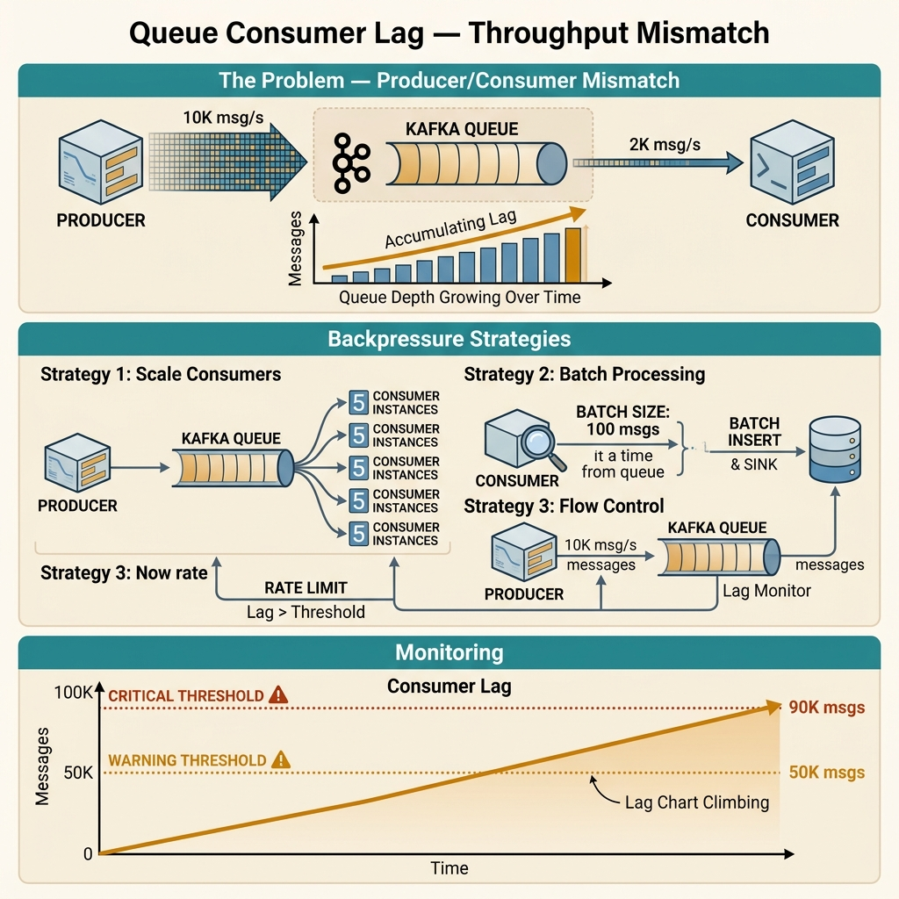

<!-- tags: best-practice, production, message-queue, kafka -->
# 📬 Queue "Nhỏ Thôi" Nuốt Chửng Hệ Thống — Consumer Lag & Kafka Scaling

> Câu chuyện consumer lag tăng từ 0 lên 2 triệu message trong 2 giờ vì không ai đo throughput thực tế

📅 Ngày tạo: 2026-03-22 · 🔄 Cập nhật: 2026-04-04 · ⏱️ 10 phút đọc

| Aspect          | Detail                                                                     |
| --------------- | -------------------------------------------------------------------------- |
| **Incident**    | Consumer lag tăng 45,000 msg/phút → 5.4 triệu message tồn đọng             |
| **Root cause**  | Consumer gọi API 200ms/call → throughput 4,600 msg/phút vs producer 50,000 |
| **Fix**         | Fan-out worker pool + tăng partition + local cache cho third-party         |
| **Go packages** | `segmentio/kafka-go`, `sync`, worker pool, in-memory TTL cache             |

---

## 1. DEFINE

Kafka consumer lag: 0 → 200K → 2 triệu trong 2 giờ. Không ai thấy vì không ai monitor consumer offset. Producer đẩy 5,000 msg/s. Consumer xử lý 800 msg/s. Toán đơn giản: mỗi giây tụt 4,200 messages. Sau 2 giờ, 15 triệu messages pending. Order confirmation delay từ 1 giây lên 45 phút. Users gọi support: "Tôi đã thanh toán nhưng không thấy đơn hàng."

Consumer lag hiếm khi bắt đầu như một thảm họa. Nó thường bắt đầu như một con số tăng chậm trong dashboard, rồi vài giờ sau đội vận hành mới nhận ra đang có hàng triệu message chờ xử lý. `Queue Consumer Lag` là bài về throughput accounting trước khi hệ thống nợ quá nhiều việc phải làm.

Điều khó chịu ở lag là producer vẫn “thành công”, queue vẫn “ổn”, nhưng business outcome đã trễ rất xa. Khi đó vấn đề không còn là queue có hoạt động hay không, mà là mỗi tầng trong pipeline có cùng nhịp với nhau hay không.

Core insight: **Best practice với consumer lag bắt đầu từ việc đo đúng throughput, concurrency, và backpressure, trước khi nghĩ đến tăng số worker một cách mù quáng.**

### 📖 Câu chuyện: "Chỉ cần đẩy vào Kafka là xong"

_"Chỉ cần đẩy event vào Kafka là xong, consumer xử lý sau."_ — Câu nói hồn nhiên nhất trong career.

Hệ thống hoạt động ngon 3 tháng. Monitoring chỉ track producer (50,000 msg/phút). Không ai đo consumer throughput.

Rồi một ngày — **consumer lag từ 0 lên 2 triệu trong 2 giờ**. Alert reo nhưng team quen ignore. 4 giờ sau mới xem. 5.4 triệu message tồn đọng. Notification system hoàn toàn chết.

### 🔍 Khám nghiệm

```
Producer: 50,000 msg/phút

Consumer xử lý 1 message:
  ① Parse           →  0.5ms
  ② Validate        →  1ms
  ③ API bên thứ 3   → 200ms ← BOTTLENECK
  ④ Update DB       →  5ms
  ⑤ Commit offset   →  1ms
  Total: ~208ms/msg

Throughput thực tế:
  1 worker × 60s / 0.208s ≈ 288 msg/phút
  × 4 partitions × 4 instances ≈ 4,600 msg/phút

Deficit: 50,000 - 4,600 = 45,400 msg/phút
Sau 2 giờ: 45,400 × 120 = 5,448,000 messages 💀
```

### Tại sao 3 tháng đầu không thấy?

| Giai đoạn | Producer        | Consumer       | Lag                         |
| --------- | --------------- | -------------- | --------------------------- |
| Tháng 1   | 3,000/phút      | 4,600/phút     | 0 ✅                        |
| Tháng 2   | 8,000/phút      | 4,600/phút     | Tăng dần, catch up ban đêm  |
| Tháng 3   | 20,000/phút     | 4,600/phút     | Tăng 15K/phút, alert ignore |
| **Sự cố** | **50,000/phút** | **4,600/phút** | **💥 Bùng nổ**              |

---

Consumer lag nghe như metric. Nhưng khi lag biến thành user-facing delay, nó là incident. Diagram dưới đây trace luồng từ producer rate → consumer throughput → lag accumulation.

## 2. VISUAL

Lag chỉ trở nên rõ khi bạn nhìn được message đến nhanh hơn message đi ở đâu và tích lại trong partition nào. Trace dưới đây làm sáng phần đó.



### Trước vs Sau — Consumer Architecture

```
❌ TRƯỚC: Sequential, 1 worker/partition
┌────────────────────────────────────────┐
│  Part.0    Part.1    Part.2    Part.3  │
│  ┌────┐   ┌────┐   ┌────┐   ┌────┐   │
│  │ C0 │   │ C1 │   │ C2 │   │ C3 │   │
│  └─┬──┘   └─┬──┘   └─┬──┘   └─┬──┘   │
│    ▼         ▼         ▼         ▼     │
│  API 200ms  API 200ms API 200ms API    │
│  (tuần tự)  (tuần tự) (tuần tự) (tuần)│
│                                        │
│  Total: 4 × 288 = 1,152 msg/phút      │
└────────────────────────────────────────┘

✅ SAU: Fan-out 50 workers + 20 partitions + cache
┌──────────────────────────────────────────────┐
│  20 partitions → 20 consumer instances       │
│                                              │
│  Mỗi instance:                               │
│  ┌──────────────────────────────────────┐    │
│  │  50 concurrent workers               │    │
│  │  ┌──┐┌──┐┌──┐┌──┐...┌──┐           │    │
│  │  │W1││W2││W3││W4│   │50│           │    │
│  │  └──┘└──┘└──┘└──┘   └──┘           │    │
│  │       │                              │    │
│  │       ▼                              │    │
│  │  ┌──────────┐   miss  ┌──────────┐  │    │
│  │  │Local Cache│──────▶ │ API 200ms│  │    │
│  │  │ TTL 5min  │        └──────────┘  │    │
│  │  │ hit→0.1ms │                      │    │
│  │  └──────────┘                       │    │
│  └──────────────────────────────────────┘    │
│                                              │
│  20 × 60,000 = 1,200,000 msg/phút ✅        │
└──────────────────────────────────────────────┘
```

### Partition = Ceiling of Parallelism

```
Kafka Rule: 1 partition → max 1 consumer trong group

  4 partitions  → max 4  consumers (thêm = idle)
  20 partitions → max 20 consumers ✅

  ⚠️ Partition chỉ tăng, KHÔNG giảm được!
```

---

Lag accumulation đã rõ. Bây giờ ta implement: từ basic consumer scaling đến partition-aware consumer group với auto-scaling trigger.

## 3. CODE

Khi mismatch throughput đã rõ, code fix phải phản ánh đúng chiến lược scale, batching, cache, và backpressure. Ta đi từ consumer loop cơ bản sang lane xử lý có kiểm soát hơn.

### Example 1: Basic — Sequential Consumer (Anti-pattern)

```go
package consumer

import (
	"context"
	"log/slog"
	"time"

	"github.com/segmentio/kafka-go"
)

// ❌ ANTI-PATTERN: 1 message at a time → 288 msg/phút
func RunSequential(ctx context.Context, reader *kafka.Reader) {
	for {
		msg, err := reader.FetchMessage(ctx)
		if err != nil {
			continue
		}

		// ⚠️ 200ms blocking → throughput = 4.8 msg/s
		callThirdPartyAPI(ctx, msg.Value)
		reader.CommitMessages(ctx, msg)
	}
}

func callThirdPartyAPI(_ context.Context, _ []byte) error {
	time.Sleep(200 * time.Millisecond)
	return nil
}
```
```typescript
import { Kafka } from "kafkajs";

const kafka = new Kafka({ clientId: "consumer-app", brokers: ["localhost:9092"] });

// ❌ ANTI-PATTERN: 1 message at a time → 288 msg/min
async function runSequential(): Promise<void> {
  const consumer = kafka.consumer({ groupId: "sequential-group" });
  await consumer.connect();
  await consumer.subscribe({ topic: "notifications", fromBeginning: false });

  await consumer.run({
    eachMessage: async ({ message }) => {
      // ⚠️ 200ms blocking → throughput = 4.8 msg/s
      await callThirdPartyAPI(message.value!);
    },
  });
}

async function callThirdPartyAPI(_payload: Buffer): Promise<void> {
  await new Promise((resolve) => setTimeout(resolve, 200));
}
```
```rust
use rdkafka::config::ClientConfig;
use rdkafka::consumer::{Consumer, StreamConsumer};
use rdkafka::message::Message;
use tokio::time::{sleep, Duration};

// ❌ ANTI-PATTERN: 1 message at a time → 288 msg/min
async fn run_sequential(brokers: &str, group_id: &str) {
    let consumer: StreamConsumer = ClientConfig::new()
        .set("group.id", group_id)
        .set("bootstrap.servers", brokers)
        .create()
        .expect("Consumer creation failed");

    consumer.subscribe(&["notifications"]).expect("Subscribe failed");

    loop {
        match consumer.recv().await {
            Ok(msg) => {
                // ⚠️ 200ms blocking → throughput = 4.8 msg/s
                call_third_party_api(msg.payload()).await;
                consumer.commit_message(&msg, rdkafka::consumer::CommitMode::Async).unwrap();
            }
            Err(e) => eprintln!("Error: {}", e),
        }
    }
}

async fn call_third_party_api(_payload: Option<&[u8]>) {
    sleep(Duration::from_millis(200)).await;
}
```
```cpp
#include <librdkafka/rdkafkacpp.h>
#include <iostream>
#include <thread>
#include <chrono>

// ❌ ANTI-PATTERN: 1 message at a time → 288 msg/min
void call_third_party_api(const std::string& /*payload*/) {
    // ⚠️ 200ms blocking → throughput = 4.8 msg/s
    std::this_thread::sleep_for(std::chrono::milliseconds(200));
}

void run_sequential(const std::string& brokers, const std::string& group_id) {
    std::string errstr;
    auto* conf = RdKafka::Conf::create(RdKafka::Conf::CONF_GLOBAL);
    conf->set("bootstrap.servers", brokers, errstr);
    conf->set("group.id", group_id, errstr);

    auto* consumer = RdKafka::KafkaConsumer::create(conf, errstr);
    consumer->subscribe({"notifications"});

    while (true) {
        auto* msg = consumer->consume(1000);
        if (!msg || msg->err()) { delete msg; continue; }

        call_third_party_api(std::string(static_cast<const char*>(msg->payload()), msg->len()));
        consumer->commitSync(msg);
        delete msg;
    }
}
```
```python
import time

def call_third_party_api(_payload: bytes) -> None:
    # ⚠️ 200ms blocking → throughput = 4.8 msg/s
    time.sleep(0.2)

def run_sequential(consumer) -> None:
    # ❌ ANTI-PATTERN: 1 message at a time → 288 msg/phút
    for message in consumer:
        call_third_party_api(message.value)
        consumer.commit(message)
```

---

### Example 2: Intermediate — Fan-out Worker Pool

```go
package consumer

import (
	"context"
	"log/slog"
	"sync"
	"time"

	"github.com/segmentio/kafka-go"
)

// ✅ 50 workers concurrent → 15,000 msg/phút per instance
func RunFanOut(ctx context.Context, reader *kafka.Reader, maxWorkers int) {
	sem := make(chan struct{}, maxWorkers)
	var mu sync.Mutex

	slog.Info("fan-out consumer started", "workers", maxWorkers)

	for {
		select {
		case <-ctx.Done():
			// Drain workers trước khi exit
			for i := 0; i < maxWorkers; i++ {
				sem <- struct{}{}
			}
			return
		default:
		}

		msg, err := reader.FetchMessage(ctx)
		if err != nil {
			time.Sleep(100 * time.Millisecond)
			continue
		}

		sem <- struct{}{} // Acquire slot

		go func(m kafka.Message) {
			defer func() { <-sem }()

			if err := callThirdPartyAPI(ctx, m.Value); err != nil {
				slog.Error("process failed",
					"partition", m.Partition,
					"offset", m.Offset,
					"error", err,
				)
				return // Không commit → re-deliver
			}

			mu.Lock()
			reader.CommitMessages(ctx, m)
			mu.Unlock()
		}(msg)
	}
}
```
```typescript
import { Kafka, EachMessagePayload } from "kafkajs";

// ✅ 50 workers concurrent → 15,000 msg/min per instance
async function runFanOut(maxWorkers: number): Promise<void> {
  const kafka = new Kafka({ clientId: "fanout-consumer", brokers: ["localhost:9092"] });
  const consumer = kafka.consumer({ groupId: "fanout-group" });
  await consumer.connect();
  await consumer.subscribe({ topic: "notifications", fromBeginning: false });

  // Semaphore to limit concurrent workers
  let activeWorkers = 0;
  const queue: (() => void)[] = [];

  const release = () => {
    activeWorkers--;
    if (queue.length > 0) {
      const next = queue.shift()!;
      activeWorkers++;
      next();
    }
  };

  const acquire = (): Promise<void> =>
    new Promise((resolve) => {
      if (activeWorkers < maxWorkers) {
        activeWorkers++;
        resolve();
      } else {
        queue.push(resolve);
      }
    });

  await consumer.run({
    eachBatch: async ({ batch, resolveOffset, heartbeat }) => {
      for (const message of batch.messages) {
        await acquire();
        // Fire-and-forget worker
        (async () => {
          try {
            await callThirdPartyAPI(message.value!);
            resolveOffset(message.offset);
            await heartbeat();
          } catch (err) {
            console.error("process failed", { partition: batch.partition, offset: message.offset, err });
          } finally {
            release();
          }
        })();
      }
    },
  });
}

async function callThirdPartyAPI(_payload: Buffer): Promise<void> {
  await new Promise((resolve) => setTimeout(resolve, 200));
}
```
```rust
use rdkafka::config::ClientConfig;
use rdkafka::consumer::{Consumer, StreamConsumer};
use rdkafka::message::Message;
use std::sync::Arc;
use tokio::sync::Semaphore;

// ✅ 50 workers concurrent → 15,000 msg/min per instance
async fn run_fan_out(brokers: &str, group_id: &str, max_workers: usize) {
    let consumer: Arc<StreamConsumer> = Arc::new(
        ClientConfig::new()
            .set("group.id", group_id)
            .set("bootstrap.servers", brokers)
            .set("enable.auto.commit", "false")
            .create()
            .expect("Consumer creation failed"),
    );
    consumer.subscribe(&["notifications"]).expect("Subscribe failed");

    let sem = Arc::new(Semaphore::new(max_workers));

    loop {
        let msg = consumer.recv().await.expect("Kafka error");
        let permit = Arc::clone(&sem).acquire_owned().await.unwrap();
        let consumer_clone = Arc::clone(&consumer);
        let owned = msg.detach();

        tokio::spawn(async move {
            let _permit = permit; // Holds semaphore slot until drop
            if let Err(e) = call_third_party_api(owned.payload()).await {
                eprintln!("process failed: partition={} offset={} err={}", owned.partition(), owned.offset(), e);
                return; // Don't commit → re-deliver
            }
            consumer_clone
                .store_offset_from_message(&owned)
                .expect("commit failed");
        });
    }
}

async fn call_third_party_api(_payload: Option<&[u8]>) -> Result<(), String> {
    tokio::time::sleep(std::time::Duration::from_millis(200)).await;
    Ok(())
}
```
```cpp
#include <librdkafka/rdkafkacpp.h>
#include <iostream>
#include <thread>
#include <vector>
#include <queue>
#include <mutex>
#include <condition_variable>
#include <functional>

// ✅ 50 workers concurrent → 15,000 msg/min per instance
class ThreadPool {
public:
    explicit ThreadPool(size_t num_threads) : stop_(false) {
        for (size_t i = 0; i < num_threads; ++i) {
            workers_.emplace_back([this] {
                while (true) {
                    std::function<void()> task;
                    {
                        std::unique_lock<std::mutex> lock(mutex_);
                        cv_.wait(lock, [this] { return stop_ || !tasks_.empty(); });
                        if (stop_ && tasks_.empty()) return;
                        task = std::move(tasks_.front());
                        tasks_.pop();
                    }
                    task();
                }
            });
        }
    }

    void enqueue(std::function<void()> task) {
        { std::lock_guard<std::mutex> lock(mutex_); tasks_.push(std::move(task)); }
        cv_.notify_one();
    }

    ~ThreadPool() {
        { std::lock_guard<std::mutex> lock(mutex_); stop_ = true; }
        cv_.notify_all();
        for (auto& w : workers_) w.join();
    }

private:
    std::vector<std::thread> workers_;
    std::queue<std::function<void()>> tasks_;
    std::mutex mutex_;
    std::condition_variable cv_;
    bool stop_;
};

void run_fan_out(const std::string& brokers, const std::string& group_id, int max_workers) {
    std::string errstr;
    auto* conf = RdKafka::Conf::create(RdKafka::Conf::CONF_GLOBAL);
    conf->set("bootstrap.servers", brokers, errstr);
    conf->set("group.id", group_id, errstr);
    conf->set("enable.auto.commit", "false", errstr);

    auto* consumer = RdKafka::KafkaConsumer::create(conf, errstr);
    consumer->subscribe({"notifications"});

    ThreadPool pool(max_workers);

    while (true) {
        auto* msg = consumer->consume(1000);
        if (!msg || msg->err()) { delete msg; continue; }

        std::string payload(static_cast<const char*>(msg->payload()), msg->len());
        int32_t partition = msg->partition();
        int64_t offset = msg->offset();
        delete msg;

        pool.enqueue([payload, partition, offset]() {
            std::this_thread::sleep_for(std::chrono::milliseconds(200)); // API call
            std::cout << "processed partition=" << partition << " offset=" << offset << "\n";
        });
    }
}
```
```python
from concurrent.futures import ThreadPoolExecutor
import time

def call_third_party_api(_payload: bytes) -> None:
    time.sleep(0.2)

def run_fan_out(consumer, max_workers: int) -> None:
    # ✅ 50 workers concurrent → 15,000 msg/phút per instance
    with ThreadPoolExecutor(max_workers=max_workers) as pool:
        futures = []
        for message in consumer:
            futures.append(pool.submit(process_message, consumer, message))

def process_message(consumer, message) -> None:
    try:
        call_third_party_api(message.value)
        consumer.commit(message)
    except Exception as exc:
        print("process failed", {
            "partition": message.partition,
            "offset": message.offset,
            "error": str(exc),
        })
```

---

### Example 3: Advanced — Local Cache TTL

```go
package consumer

import (
	"context"
	"fmt"
	"sync"
	"time"
)

// ─── TTL Cache — skip API call khi data đã có ───
type TTLCache struct {
	mu    sync.RWMutex
	items map[string]cacheItem
	ttl   time.Duration
}

type cacheItem struct {
	value     interface{}
	expiresAt time.Time
}

func NewTTLCache(ttl time.Duration) *TTLCache {
	c := &TTLCache{items: make(map[string]cacheItem), ttl: ttl}
	go c.cleanup()
	return c
}

func (c *TTLCache) Get(key string) (interface{}, bool) {
	c.mu.RLock()
	defer c.mu.RUnlock()
	item, ok := c.items[key]
	if !ok || time.Now().After(item.expiresAt) {
		return nil, false
	}
	return item.value, true
}

func (c *TTLCache) Set(key string, val interface{}) {
	c.mu.Lock()
	defer c.mu.Unlock()
	c.items[key] = cacheItem{value: val, expiresAt: time.Now().Add(c.ttl)}
}

func (c *TTLCache) cleanup() {
	for range time.Tick(time.Minute) {
		c.mu.Lock()
		now := time.Now()
		for k, v := range c.items {
			if now.After(v.expiresAt) {
				delete(c.items, k)
			}
		}
		c.mu.Unlock()
	}
}

// ─── Usage: cache hit → 0.1ms vs 200ms API call ───
func processWithCache(ctx context.Context, cache *TTLCache, userID string) error {
	cacheKey := fmt.Sprintf("user:%s", userID)

	if cached, ok := cache.Get(cacheKey); ok {
		// ✅ Cache hit — skip 200ms API call
		_ = cached
		return nil
	}

	// Cache miss → API call 200ms
	result, err := fetchUserFromAPI(ctx, userID)
	if err != nil {
		return err
	}
	cache.Set(cacheKey, result)
	return nil
}

func fetchUserFromAPI(_ context.Context, _ string) (interface{}, error) {
	time.Sleep(200 * time.Millisecond)
	return "user-data", nil
}

/*
Throughput with 60% cache hit:
  Without cache: 50 workers × 300/min = 15,000 msg/min
  With cache:    ~60,000 msg/min per instance (4x improvement)

  Cache là đòn quyết định RẺ NHẤT
*/
```
```typescript
// ─── TTL Cache — skip API call when data already exists ───
interface CacheItem<T> {
  value: T;
  expiresAt: number;
}

class TTLCache<T> {
  private items = new Map<string, CacheItem<T>>();
  private readonly ttlMs: number;

  constructor(ttlMs: number) {
    this.ttlMs = ttlMs;
    setInterval(() => this.cleanup(), 60_000);
  }

  get(key: string): T | undefined {
    const item = this.items.get(key);
    if (!item || Date.now() > item.expiresAt) {
      this.items.delete(key);
      return undefined;
    }
    return item.value;
  }

  set(key: string, value: T): void {
    this.items.set(key, { value, expiresAt: Date.now() + this.ttlMs });
  }

  private cleanup(): void {
    const now = Date.now();
    for (const [k, v] of this.items) {
      if (now > v.expiresAt) this.items.delete(k);
    }
  }
}

// ─── Usage: cache hit → 0.1ms vs 200ms API call ───
const userCache = new TTLCache<string>(5 * 60 * 1000); // 5 min TTL

async function processWithCache(userID: string): Promise<void> {
  const cacheKey = `user:${userID}`;
  if (userCache.get(cacheKey) !== undefined) {
    // ✅ Cache hit — skip 200ms API call
    return;
  }
  // Cache miss → API call 200ms
  const result = await fetchUserFromAPI(userID);
  userCache.set(cacheKey, result);
}

async function fetchUserFromAPI(_userID: string): Promise<string> {
  await new Promise((resolve) => setTimeout(resolve, 200));
  return "user-data";
}
```
```rust
use std::collections::HashMap;
use std::sync::{Arc, RwLock};
use std::time::{Duration, Instant};
use tokio::time::sleep;

// ─── TTL Cache — skip API call when data already exists ───
struct CacheItem {
    value: String,
    expires_at: Instant,
}

#[derive(Clone)]
struct TTLCache {
    items: Arc<RwLock<HashMap<String, CacheItem>>>,
    ttl: Duration,
}

impl TTLCache {
    fn new(ttl: Duration) -> Self {
        let cache = TTLCache { items: Arc::new(RwLock::new(HashMap::new())), ttl };
        let items_clone = Arc::clone(&cache.items);
        tokio::spawn(async move {
            loop {
                sleep(Duration::from_secs(60)).await;
                let mut map = items_clone.write().unwrap();
                let now = Instant::now();
                map.retain(|_, v| v.expires_at > now);
            }
        });
        cache
    }

    fn get(&self, key: &str) -> Option<String> {
        let map = self.items.read().unwrap();
        map.get(key).and_then(|item| {
            if item.expires_at > Instant::now() { Some(item.value.clone()) } else { None }
        })
    }

    fn set(&self, key: String, value: String) {
        let mut map = self.items.write().unwrap();
        map.insert(key, CacheItem { value, expires_at: Instant::now() + self.ttl });
    }
}

// ─── Usage: cache hit → 0.1ms vs 200ms API call ───
async fn process_with_cache(cache: &TTLCache, user_id: &str) -> Result<(), String> {
    let cache_key = format!("user:{}", user_id);
    if cache.get(&cache_key).is_some() {
        // ✅ Cache hit — skip 200ms API call
        return Ok(());
    }
    // Cache miss → API call 200ms
    let result = fetch_user_from_api(user_id).await?;
    cache.set(cache_key, result);
    Ok(())
}

async fn fetch_user_from_api(_user_id: &str) -> Result<String, String> {
    sleep(Duration::from_millis(200)).await;
    Ok("user-data".to_string())
}
```
```cpp
#include <unordered_map>
#include <string>
#include <shared_mutex>
#include <chrono>
#include <thread>
#include <optional>

// ─── TTL Cache — skip API call when data already exists ───
class TTLCache {
public:
    using Clock = std::chrono::steady_clock;
    using TimePoint = std::chrono::time_point<Clock>;

    explicit TTLCache(std::chrono::milliseconds ttl) : ttl_(ttl) {
        cleanup_thread_ = std::thread([this] {
            while (!stop_) {
                std::this_thread::sleep_for(std::chrono::minutes(1));
                cleanup();
            }
        });
    }

    ~TTLCache() {
        stop_ = true;
        if (cleanup_thread_.joinable()) cleanup_thread_.join();
    }

    std::optional<std::string> get(const std::string& key) {
        std::shared_lock lock(mutex_);
        auto it = items_.find(key);
        if (it == items_.end() || Clock::now() > it->second.expires_at) return std::nullopt;
        return it->second.value;
    }

    void set(const std::string& key, std::string value) {
        std::unique_lock lock(mutex_);
        items_[key] = {std::move(value), Clock::now() + ttl_};
    }

private:
    struct Item { std::string value; TimePoint expires_at; };
    std::unordered_map<std::string, Item> items_;
    mutable std::shared_mutex mutex_;
    std::chrono::milliseconds ttl_;
    std::thread cleanup_thread_;
    std::atomic<bool> stop_{false};

    void cleanup() {
        std::unique_lock lock(mutex_);
        auto now = Clock::now();
        for (auto it = items_.begin(); it != items_.end(); ) {
            it = (now > it->second.expires_at) ? items_.erase(it) : std::next(it);
        }
    }
};

// ─── Usage: cache hit → 0.1ms vs 200ms API call ───
void process_with_cache(TTLCache& cache, const std::string& user_id) {
    const std::string cache_key = "user:" + user_id;
    if (cache.get(cache_key).has_value()) {
        // ✅ Cache hit — skip 200ms API call
        return;
    }
    // Cache miss → API call 200ms
    std::this_thread::sleep_for(std::chrono::milliseconds(200)); // simulate API
    cache.set(cache_key, "user-data");
}
```
```python
import threading
import time
from dataclasses import dataclass

@dataclass
class CacheItem:
    value: str
    expires_at: float

class TTLCache:
    def __init__(self, ttl_seconds: int) -> None:
        self._ttl = ttl_seconds
        self._items: dict[str, CacheItem] = {}
        self._lock = threading.RLock()
        threading.Thread(target=self._cleanup_loop, daemon=True).start()

    def get(self, key: str) -> str | None:
        with self._lock:
            item = self._items.get(key)
            if item is None or time.time() > item.expires_at:
                self._items.pop(key, None)
                return None
            return item.value

    def set(self, key: str, value: str) -> None:
        with self._lock:
            self._items[key] = CacheItem(value=value, expires_at=time.time() + self._ttl)

    def _cleanup_loop(self) -> None:
        while True:
            time.sleep(60)
            now = time.time()
            with self._lock:
                self._items = {
                    key: item
                    for key, item in self._items.items()
                    if item.expires_at > now
                }

user_cache = TTLCache(ttl_seconds=300)

def process_with_cache(user_id: str) -> None:
    cache_key = f"user:{user_id}"
    if user_cache.get(cache_key) is not None:
        return

    time.sleep(0.2)  # Cache miss → API call
    user_cache.set(cache_key, "user-data")
```

---

### Example 4: Expert — Lag Monitoring + Adaptive Pool

```go
package monitoring

import (
	"log/slog"
	"sync/atomic"
	"time"

	"github.com/segmentio/kafka-go"
)

// ─── Lag Monitor: vital sign của consumer ───
type LagMonitor struct {
	reader    *kafka.Reader
	threshold int64
}

func (m *LagMonitor) Run() {
	for range time.Tick(10 * time.Second) {
		stats := m.reader.Stats()
		lag := stats.Lag

		slog.Info("consumer lag", "topic", stats.Topic, "lag", lag)

		if lag > m.threshold {
			slog.Warn("⚠️ HIGH LAG — scale consumer!", "lag", lag)
			// TODO: PagerDuty + KEDA auto-scale trigger
		}
	}
}

// ─── Adaptive Pool: backpressure khi API chậm ───
type AdaptivePool struct {
	min, max   int
	current    atomic.Int32
	avgLatency atomic.Int64 // microseconds
}

func (p *AdaptivePool) Adjust() {
	avgMs := p.avgLatency.Load() / 1000
	cur := int(p.current.Load())

	switch {
	case avgMs > 500 && cur > p.min:
		// API chậm → giảm workers (tránh overwhelm)
		p.current.Store(int32(max(cur-10, p.min)))
		slog.Warn("⬇️ reducing workers", "avgLatency", avgMs)

	case avgMs < 100 && cur < p.max:
		// API nhanh → tăng workers
		p.current.Store(int32(min(cur+10, p.max)))
		slog.Info("⬆️ increasing workers", "avgLatency", avgMs)
	}
}

func min(a, b int) int { if a < b { return a }; return b }
func max(a, b int) int { if a > b { return a }; return b }

/*
Prometheus Alerts:
  - kafka_consumer_lag rate > 1000/min for 10m → warning
  - kafka_consumer_lag > 500K for 5m → critical (page!)
  - consumer_rate < 50% producer_rate for 15m → investigate
*/
```
```typescript
import { Kafka } from "kafkajs";

// ─── Lag Monitor: vital sign of consumer ───
class LagMonitor {
  private readonly threshold: number;

  constructor(threshold: number) {
    this.threshold = threshold;
  }

  start(consumer: ReturnType<InstanceType<typeof Kafka>["consumer"]>, topic: string): NodeJS.Timeout {
    return setInterval(async () => {
      // kafkajs doesn't expose lag directly; use admin API to compute it
      const kafka = new Kafka({ clientId: "monitor", brokers: ["localhost:9092"] });
      const admin = kafka.admin();
      await admin.connect();
      const offsets = await admin.fetchTopicOffsets(topic);
      const consumerOffsets = await admin.fetchOffsets({ groupId: "fanout-group", topics: [topic] });
      await admin.disconnect();

      let totalLag = 0;
      for (const partition of offsets) {
        const consumerPartition = consumerOffsets[0].partitions.find(
          (p) => p.partition === partition.partition
        );
        if (consumerPartition) {
          totalLag += parseInt(partition.high) - parseInt(consumerPartition.offset);
        }
      }

      console.info("consumer lag", { topic, lag: totalLag });
      if (totalLag > this.threshold) {
        console.warn("⚠️ HIGH LAG — scale consumer!", { lag: totalLag });
        // TODO: PagerDuty + KEDA auto-scale trigger
      }
    }, 10_000);
  }
}

// ─── Adaptive Pool: backpressure when API is slow ───
class AdaptivePool {
  private current: number;
  private totalLatencyMs = 0;
  private sampleCount = 0;

  constructor(
    private readonly min: number,
    private readonly max: number
  ) {
    this.current = min;
    setInterval(() => this.adjust(), 5_000);
  }

  recordLatency(ms: number): void {
    this.totalLatencyMs += ms;
    this.sampleCount++;
  }

  getWorkerCount(): number {
    return this.current;
  }

  private adjust(): void {
    if (this.sampleCount === 0) return;
    const avgMs = this.totalLatencyMs / this.sampleCount;
    this.totalLatencyMs = 0;
    this.sampleCount = 0;

    if (avgMs > 500 && this.current > this.min) {
      this.current = Math.max(this.current - 10, this.min);
      console.warn("⬇️ reducing workers", { avgLatency: avgMs, current: this.current });
    } else if (avgMs < 100 && this.current < this.max) {
      this.current = Math.min(this.current + 10, this.max);
      console.info("⬆️ increasing workers", { avgLatency: avgMs, current: this.current });
    }
  }
}
```
```rust
use std::sync::atomic::{AtomicI32, AtomicI64, Ordering};
use std::sync::Arc;
use tokio::time::{interval, Duration};

// ─── Lag Monitor: vital sign of consumer ───
struct LagMonitor {
    threshold: i64,
}

impl LagMonitor {
    fn new(threshold: i64) -> Self {
        LagMonitor { threshold }
    }

    async fn run(&self, topic: &str, current_lag: Arc<AtomicI64>) {
        let mut ticker = interval(Duration::from_secs(10));
        loop {
            ticker.tick().await;
            let lag = current_lag.load(Ordering::Relaxed);
            println!("consumer lag topic={} lag={}", topic, lag);
            if lag > self.threshold {
                println!("⚠️ HIGH LAG — scale consumer! lag={}", lag);
                // TODO: PagerDuty + KEDA auto-scale trigger
            }
        }
    }
}

// ─── Adaptive Pool: backpressure when API is slow ───
struct AdaptivePool {
    min: i32,
    max: i32,
    current: AtomicI32,
    avg_latency_us: AtomicI64, // microseconds
}

impl AdaptivePool {
    fn new(min: i32, max: i32) -> Self {
        AdaptivePool {
            min,
            max,
            current: AtomicI32::new(min),
            avg_latency_us: AtomicI64::new(0),
        }
    }

    fn adjust(&self) {
        let avg_ms = self.avg_latency_us.load(Ordering::Relaxed) / 1000;
        let cur = self.current.load(Ordering::Relaxed);

        if avg_ms > 500 && cur > self.min {
            self.current.store((cur - 10).max(self.min), Ordering::Relaxed);
            println!("⬇️ reducing workers avg_latency={}ms", avg_ms);
        } else if avg_ms < 100 && cur < self.max {
            self.current.store((cur + 10).min(self.max), Ordering::Relaxed);
            println!("⬆️ increasing workers avg_latency={}ms", avg_ms);
        }
    }
}
```
```cpp
#include <atomic>
#include <iostream>
#include <thread>
#include <chrono>
#include <algorithm>

// ─── Lag Monitor: vital sign of consumer ───
class LagMonitor {
public:
    LagMonitor(int64_t threshold, std::atomic<int64_t>& lag_counter)
        : threshold_(threshold), lag_(lag_counter) {}

    void run(const std::string& topic) {
        while (true) {
            std::this_thread::sleep_for(std::chrono::seconds(10));
            int64_t lag = lag_.load();
            std::cout << "[lag-monitor] topic=" << topic << " lag=" << lag << "\n";
            if (lag > threshold_) {
                std::cout << "⚠️ HIGH LAG — scale consumer! lag=" << lag << "\n";
                // TODO: PagerDuty + KEDA auto-scale trigger
            }
        }
    }

private:
    int64_t threshold_;
    std::atomic<int64_t>& lag_;
};

// ─── Adaptive Pool: backpressure when API is slow ───
class AdaptivePool {
public:
    AdaptivePool(int min_workers, int max_workers)
        : min_(min_workers), max_(max_workers) {
        current_.store(min_workers);
    }

    void adjust() {
        int64_t avg_ms = avg_latency_us_.load() / 1000;
        int cur = current_.load();

        if (avg_ms > 500 && cur > min_) {
            current_.store(std::max(cur - 10, min_));
            std::cout << "⬇️ reducing workers avg_latency=" << avg_ms << "ms\n";
        } else if (avg_ms < 100 && cur < max_) {
            current_.store(std::min(cur + 10, max_));
            std::cout << "⬆️ increasing workers avg_latency=" << avg_ms << "ms\n";
        }
    }

    int worker_count() const { return current_.load(); }

private:
    int min_, max_;
    std::atomic<int> current_;
    std::atomic<int64_t> avg_latency_us_{0};
};
```
```python
import threading
import time

class LagMonitor:
    def __init__(self, threshold: int) -> None:
        self.threshold = threshold

    def run(self, topic: str, lag_supplier) -> None:
        while True:
            lag = lag_supplier()
            print("consumer lag", {"topic": topic, "lag": lag})
            if lag > self.threshold:
                print("⚠️ HIGH LAG — scale consumer!", {"lag": lag})
            time.sleep(10)

class AdaptivePool:
    def __init__(self, min_workers: int, max_workers: int) -> None:
        self.min = min_workers
        self.max = max_workers
        self.current = min_workers
        self.avg_latency_ms = 0.0
        self._lock = threading.Lock()

    def record_latency(self, latency_ms: float) -> None:
        with self._lock:
            self.avg_latency_ms = latency_ms

    def adjust(self) -> None:
        with self._lock:
            avg_ms = self.avg_latency_ms
            if avg_ms > 500 and self.current > self.min:
                self.current = max(self.current - 10, self.min)
                print("⬇️ reducing workers", {"avgLatency": avg_ms, "current": self.current})
            elif avg_ms < 100 and self.current < self.max:
                self.current = min(self.current + 10, self.max)
                print("⬆️ increasing workers", {"avgLatency": avg_ms, "current": self.current})
```

**Bài học**: _"Consumer lag là vital sign. Không monitor lag = không biết hệ thống đang hấp hối."_

---

## 4. PITFALLS

Queue lag thường bị vá sai bằng cách tăng worker vô điều kiện, trong khi bottleneck thật nằm ở downstream hoặc payload cost.

| # | Severity | Lỗi | Hậu quả | Fix |
| --- | --- | --- | --- | --- |
| 1 | 🟡 Common | Sequential consumer | Throughput = 1/latency, quá chậm | Fan-out worker pool 50-100 workers |
| 2 | 🟡 Common | Không đo consumer throughput | Lag tăng âm thầm đến khi bùng nổ | Prometheus `kafka_consumer_lag` + alert |
| 3 | 🟡 Common | Partition quá ít | Max parallelism bị giới hạn | Tăng partition (không giảm được!) |
| 4 | 🟡 Common | Gọi API mọi message dù data giống | 1000 msg cùng userID = 1000 call | Local cache TTL 5 phút |
| 5 | 🟡 Common | Commit offset trước khi xử lý | Crash = mất message vĩnh viễn | Commit SAU khi process thành công |
| 6 | 🟡 Common | Không có DLQ | Poison message block consumer | Max 3 retry → DLQ → alert |
| 7 | 🟡 Common | Không backpressure khi API chậm | Overwhelm API → rate limit → worse | Adaptive worker count |
| 8 | 🟡 Common | Retry infinite loop | Consumer stuck 1 message mãi | Max retry + DLQ + alert |

---

## 5. REF

| Resource                        | Link                                                                                   |
| ------------------------------- | -------------------------------------------------------------------------------------- |
| Kafka Consumer Lag              | [kafka.apache.org/documentation](https://kafka.apache.org/documentation/)              |
| segmentio/kafka-go              | [github.com/segmentio/kafka-go](https://github.com/segmentio/kafka-go)                 |
| LinkedIn: Kafka at Scale        | [engineering.linkedin.com](https://engineering.linkedin.com/kafka/running-kafka-scale) |
| Confluent: Monitor Consumer Lag | [confluent.io/blog](https://www.confluent.io/blog/monitor-kafka-consumer-group-lag/)   |
| Burrow — Lag Monitor            | [github.com/linkedin/Burrow](https://github.com/linkedin/Burrow)                       |

---

## 6. RECOMMEND

Khi lane queue đã rõ, bước tiếp theo là nối nó sang graceful shutdown, consumer idempotency, stock pipeline, và memory-leak diagnostics trên worker systems.

| Mở rộng               | Khi nào           | Lý do                                      |
| --------------------- | ----------------- | ------------------------------------------ |
| **Dead Letter Queue** | Poison messages   | Max retry → DLQ → alert + manual fix       |
| **Batch API calls**   | API hỗ trợ batch  | 50 msg/batch → 1 call, throughput x50      |
| **KEDA auto-scaling** | K8s environment   | Scale pods dựa trên Kafka lag metric       |
| **Circuit breaker**   | API không ổn định | Fail fast, không tiêu hao worker           |
| **Schema Registry**   | Multi-team        | Avro/Protobuf schema evolution             |
| **Exactly-once**      | Financial data    | Transactional outbox + idempotent consumer |

---

## 7. QUICK REF

| # | Pattern | Rule / Formula |
|---|---------|----------------|
| 1 | **Throughput tính nhanh** | `tps = 1000ms / msg_time_ms × num_workers × num_partitions` |
| 2 | **Deficit formula** | `lag_rate = producer_rate - consumer_tps` → lag sau T giờ = `lag_rate × T × 60` |
| 3 | **Fan-out worker pool** | 1 Kafka message → goroutine pool N workers → N× throughput |
| 4 | **Local cache** | Cache third-party lookup: TTL 5-30s — reduce API calls 80-90% |
| 5 | **Partition scaling** | `target_partitions = ceil(target_throughput / single_partition_throughput)` |
| 6 | **Backpressure** | Channel buffer full → pause consumer `time.Sleep` → upstream awareness |
| 7 | **Alert threshold** | `lag > max_acceptable_delay_seconds × producer_rate` → scale |
| 8 | **Monitor cả 2 phía** | Track cả `producer_rate` lẫn `consumer_throughput` — chỉ track 1 bên là mù |

---

---

**Callback**: Quay lại consumer lag 2 triệu lúc đầu. Bây giờ bạn biết: monitor cả producer rate LẪN consumer throughput. Auto-scale consumer trước khi lag vượt threshold. Lag là debt — mỗi giây không trả, interest compound.

← Quay về [Best Practices](./README.md) · ← Trước: [Idempotency Race](./05-idempotency-race-condition.md) · → Tiếp: [Read Replica](./07-read-replica-betrayal.md)
## 8. INTERVIEW ANGLE

**System design questions liên quan:**
- *"Design a notification system that handles 50,000 events/minute"*
- *"How do you scale Kafka consumers when lag builds up?"*
- *"Your message queue is falling behind — what do you do?"*

**Điểm interviewer muốn nghe:**

| Chủ đề | Talking point |
|--------|---------------|
| **Throughput formula** | `tps = 1/msg_time × workers × partitions` — tính được trước khi scale |
| **Bottleneck identification** | Per-step profiling: parse(0.5ms) + validate(1ms) + **API(200ms)** + DB(5ms) |
| **Fix hierarchy** | Cache first (giảm latency) → fan-out workers → increase partitions |
| **Why 3 months OK then boom** | Traffic tăng dần qua ngưỡng: 3K → 8K → 20K → 50K msg/phút |
| **Partition constraint** | Số consumers ≤ số partitions — tăng consumer phải tăng partition trước |
| **Numbers** | Deficit: 50K - 4.6K = 45.4K/phút → 5.4M messages sau 2 giờ |

**Follow-up questions thường gặp:**
- *"How do you prevent this from happening?"* → Alert on lag rate (not just absolute lag), capacity planning
- *"What about message ordering?"* → Same partition key → guaranteed order trong partition
- *"How do you handle poison messages?"* → Dead Letter Queue + max retry count

---

## 9. MONITORING

### Metrics cần track (Prometheus / Datadog)

| Metric | Alert Threshold | Ý nghĩa |
|--------|----------------|---------|
| `kafka_consumer_group_lag` | > 10,000 messages | Lag đang tích lũy |
| `kafka_consumer_group_lag` tăng liên tục | lag_rate > 0 trong 5 phút | Producer > consumer throughput |
| `consumer_message_processing_duration_p99` | > 500ms | Bottleneck trong xử lý |
| `external_api_latency_p99` | > 200ms | Third-party API là bottleneck |
| `consumer_error_rate` | > 1% | Messages đang fail |
| `kafka_consumer_rebalance_count` | > 3/phút | Consumer group không ổn định |

### Dashboard panels khuyến nghị

```text
Row 1: Lag Overview
  ┌────────────────────┐  ┌────────────────────┐  ┌──────────────────┐
  │ Consumer Lag (now) │  │  Lag Rate (msg/min)│  │  Time to catch up│
  └────────────────────┘  └────────────────────┘  └──────────────────┘

Row 2: Throughput Breakdown
  ┌────────────────────┐  ┌────────────────────┐  ┌──────────────────┐
  │  Producer Rate     │  │  Consumer Rate     │  │  Deficit         │
  └────────────────────┘  └────────────────────┘  └──────────────────┘

Row 3: Per-step Latency
  ┌──────────────────────────────────────────────────────────────────┐
  │  parse │ validate │ third-party API │ DB write │ commit offset   │
  └──────────────────────────────────────────────────────────────────┘
```

### Runbook khi lag tăng

```text
1. Kiểm tra consumer_message_processing_duration_p99
   → Bước nào chậm nhất?

2. Nếu third-party API chậm:
   → Kiểm tra cache hit rate
   → Tăng TTL hoặc thêm workers

3. Nếu DB write chậm:
   → Kiểm tra DB connection pool
   → Xem xét batch write

4. Nếu throughput OK nhưng lag vẫn tăng:
   → Producer rate tăng đột biến
   → Cần tăng partition + consumer instances

5. Emergency: kafka_consumer_group_lag > 1,000,000
   → Scale consumer instances ngay
   → Alert on-call
```

---

## 10. DETECTION CHECKLIST

| # | Dấu hiệu | Cách kiểm tra | Ý nghĩa |
|---|----------|---------------|---------|
| 1 | **Consumer lag tăng liên tục** | `kafka_consumer_group_lag` metric — không bao giờ về 0 | Producer > consumer throughput |
| 2 | **Throughput < producer rate** | `producer_rate / consumer_throughput > 1.0` | Consumer cần scale |
| 3 | **Consumer P99 latency cao** | Trace per-message processing time — tìm slow step | Bottleneck ở third-party API hoặc DB |
| 4 | **Third-party timeout spike** | External API latency metrics | Cache hit rate thấp → quá nhiều API calls |
| 5 | **Alerts bị ignore** | Alert history — "already seen" pattern | Threshold quá nhạy hoặc alert fatigue |
| 6 | **Notification delay tăng** | End-to-end latency: event created → notification sent | Lag ảnh hưởng user-facing SLA |

---

