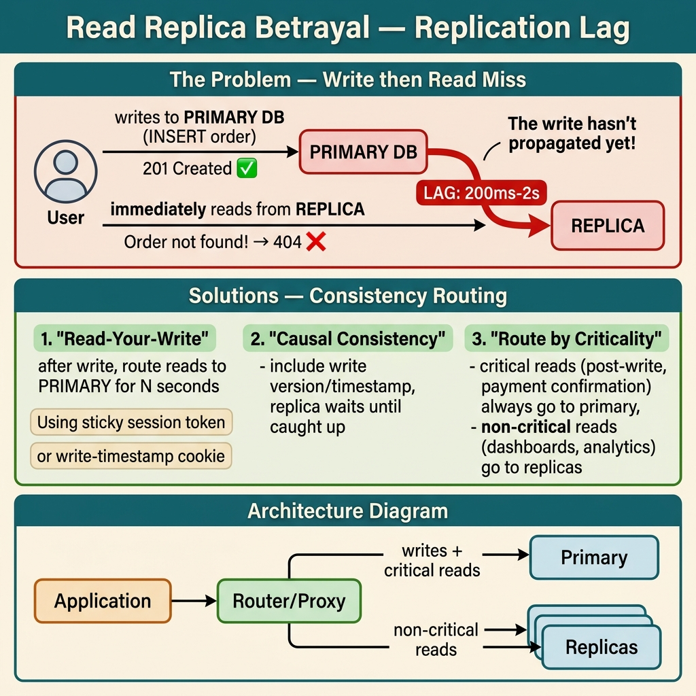

<!-- tags: best-practice, production, database, replication -->
# 🪞 Read Replica Phản Bội — Replication Lag & Read-Your-Write Consistency

> Câu chuyện user vừa đặt hàng xong nhưng bấm xem không thấy đơn, vì replica chưa kịp sync — và cách đảm bảo read-your-write consistency

📅 Ngày tạo: 2026-03-22 · 🔄 Cập nhật: 2026-04-04 · ⏱️ 9 phút đọc

| Aspect           | Detail                                                                       |
| ---------------- | ---------------------------------------------------------------------------- |
| **Bug**          | User tạo order → bấm xem ngay → không thấy → tưởng lỗi → bấm lại → duplicate |
| **Root cause**   | Write vào primary, read từ replica — replication lag P99 = 2 giây            |
| **Fix**          | Read-your-write pattern: flag user vừa write → đọc primary trong 5s          |
| **Go relevance** | DB routing middleware, Redis flag, `context.Value`, connection pool          |

---

## 1. DEFINE

User vừa đặt hàng thành công — payment confirmed, thank you page hiện. Bấm "Xem đơn hàng": trống. Refresh: trống. Gọi support: "Tiền đã trừ nhưng không có đơn." Nguyên nhân: write vào primary, read từ replica chưa sync. Replication lag: 340ms. Đã đủ để user panic và gọi bank cancel card.

Read replica làm hệ thống nhẹ hơn cho đến khi người dùng vừa tạo xong dữ liệu nhưng refresh lại không thấy gì. `Read Replica Betrayal` là loại sự cố đặc biệt khó chịu vì dữ liệu không mất, chỉ là consistency contract với người dùng đã bị phản bội trong vài trăm mili giây hoặc vài giây.

Nếu đội kỹ thuật chỉ nhìn replication lag như một con số hạ tầng, họ sẽ bỏ sót pain point thật: người dùng tin rằng thao tác của mình chưa được ghi nhận. Best practice ở đây không đơn thuần là “đọc từ primary”. Nó là chọn consistency behavior đúng cho từng loại request.

Core insight: **Replica chỉ hữu ích khi hệ thống biết request nào được phép eventual consistency và request nào phải giữ read-your-write để không phản bội kỳ vọng người dùng.**

### 📖 Câu chuyện: "Read replica phản bội"

_Làm đúng sách giáo khoa: write đến primary, read từ replica. Tự hào lắm. Rồi user complain._

"Tôi vừa đặt hàng xong, bấm vào 'Đơn hàng của tôi' — **không thấy đơn đâu cả**."

Team kiểm tra: order đã ghi vào primary. Nhưng user đọc từ replica — replica **chưa kịp sync**. Khoảng cách: 800ms. User bấm xem trong 200ms sau khi submit.

**Tệ hơn**: User tưởng order thất bại → bấm lại → **duplicate order**.

### 🔍 Nguyên nhân

```
User tạo order → ghi vào Primary DB
                      │
               replication lag: 800ms (P99: 2s)
                      │
                      ▼
User bấm xem ngay → đọc từ Replica
→ Replica chưa có data → trả rỗng
→ User tưởng thất bại → bấm lại
→ Duplicate order 💀
```

### Replication lag không phải con số cố định

| Tình huống              | Lag trung bình | P99   | P999  |
| ----------------------- | -------------- | ----- | ----- |
| Bình thường             | 50ms           | 200ms | 500ms |
| Primary bận (batch job) | 200ms          | 800ms | 2s    |
| Backup đang chạy        | 500ms          | 2s    | 5s    |
| Network congestion      | 100ms          | 1s    | 3s    |
| Large transaction (DDL) | 2s             | 10s   | 30s   |

**Thiết kế phải chịu được worst case, không phải trung bình.**

---

Replication lag 340ms nghe nhỏ. Nhưng trong 340ms đó, user đã refresh 2 lần và gọi support 1 lần. Diagram dưới trace chính xác timeline từ write → replicate → read.

## 2. VISUAL

Độ trễ replica khó cảm nhận nếu chỉ đọc định nghĩa. Sơ đồ dưới đây cho thấy đúng khoảnh khắc write đã commit nhưng read vẫn trỏ vào bản sao chưa kịp cập nhật.



### Read-Your-Write Pattern

```
┌──────────────────────────────────────────────────────────┐
│                READ-YOUR-WRITE FLOW                       │
│                                                          │
│  User creates order:                                     │
│  ┌────────┐    write    ┌─────────┐                     │
│  │ Client │────────────▶│ Primary │                     │
│  └────┬───┘             └────┬────┘                     │
│       │                      │ replication (async)       │
│       │                      ▼                           │
│       │                 ┌─────────┐                     │
│       │                 │ Replica │                     │
│       │                 └─────────┘                     │
│       │                                                  │
│       │  SET "read_primary:user123" EX 5                │
│       │  ──────────────▶ Redis                          │
│       │                                                  │
│  User reads orders (200ms later):                        │
│       │                                                  │
│       │  GET "read_primary:user123"                      │
│       │  ──────────────▶ Redis → EXISTS!                │
│       │                                                  │
│       │  Route to PRIMARY (not replica)                  │
│       │  ──────────────▶ Primary → order found ✅       │
│       │                                                  │
│  5 giây sau (replica đã sync):                           │
│       │  GET "read_primary:user123"                      │
│       │  ──────────────▶ Redis → EXPIRED                │
│       │                                                  │
│       │  Route to REPLICA (default)                      │
│       │  ──────────────▶ Replica → order found ✅       │
└──────────────────────────────────────────────────────────┘
```

### DB Routing Decision Tree

```
Request đến
    │
    ├── Mutation (INSERT/UPDATE/DELETE)?
    │   └── YES → Primary DB (luôn luôn)
    │
    └── Read (SELECT)?
        │
        ├── User vừa write (Redis flag exists)?
        │   └── YES → Primary DB (read-your-write)
        │
        ├── Query critical (payment, balance)?
        │   └── YES → Primary DB (strong consistency)
        │
        └── Regular read
            └── Replica DB (eventual consistency OK)
```

---

Timeline đã rõ: write thành công, read lệch timeline. Bây giờ ta implement read-your-write consistency: từ session-based routing đến causal consistency pattern.

## 3. CODE

Khi consistency gap đã rõ, code fix phải route đúng request sang primary, replica, hoặc một lớp flag tạm thời. Ta đi từ nguyên nhân sang routing strategy cụ thể.

### Example 1: Basic — DB Router với Redis Flag

```go
package db

import (
	"context"
	"database/sql"
	"fmt"
	"time"

	"github.com/redis/go-redis/v9"
)

type DBRouter struct {
	primary  *sql.DB
	replica  *sql.DB
	redis    *redis.Client
	flagTTL  time.Duration
}

func NewDBRouter(primary, replica *sql.DB, rdb *redis.Client) *DBRouter {
	return &DBRouter{
		primary: primary,
		replica: replica,
		redis:   rdb,
		flagTTL: 5 * time.Second, // Đọc primary trong 5s sau write
	}
}

// MarkRecentWrite — gọi sau mỗi write operation
func (r *DBRouter) MarkRecentWrite(ctx context.Context, userID string) {
	key := fmt.Sprintf("read_primary:%s", userID)
	r.redis.Set(ctx, key, "1", r.flagTTL)
}

// GetDB — trả về primary hoặc replica tuỳ context
func (r *DBRouter) GetDB(ctx context.Context, userID string) *sql.DB {
	key := fmt.Sprintf("read_primary:%s", userID)
	exists, _ := r.redis.Exists(ctx, key).Result()

	if exists > 0 {
		return r.primary // User vừa write → đọc primary
	}
	return r.replica // Default → replica
}

// ForceDB — cho query critical luôn đọc primary
func (r *DBRouter) ForceDB(forPrimary bool) *sql.DB {
	if forPrimary {
		return r.primary
	}
	return r.replica
}
```
```typescript
import { Pool } from 'pg';
import { createClient } from 'redis';

interface DBRouter {
  primary: Pool;
  replica: Pool;
  redis: ReturnType<typeof createClient>;
  flagTTL: number; // seconds
}

function createDBRouter(primary: Pool, replica: Pool, redis: ReturnType<typeof createClient>): DBRouter {
  return { primary, replica, redis, flagTTL: 5 };
}

// markRecentWrite — call after each write operation
async function markRecentWrite(router: DBRouter, userID: string): Promise<void> {
  const key = `read_primary:${userID}`;
  await router.redis.set(key, '1', { EX: router.flagTTL });
}

// getPool — returns primary or replica depending on user's recent write flag
async function getPool(router: DBRouter, userID: string): Promise<Pool> {
  const key = `read_primary:${userID}`;
  const exists = await router.redis.exists(key);
  return exists > 0 ? router.primary : router.replica;
}

// forcePool — for critical queries that always need primary
function forcePool(router: DBRouter, forPrimary: boolean): Pool {
  return forPrimary ? router.primary : router.replica;
}
```
```rust
use std::sync::Arc;
use std::time::Duration;
use sqlx::{PgPool, postgres::PgPoolOptions};
use redis::AsyncCommands;

pub struct DBRouter {
    primary: Arc<PgPool>,
    replica: Arc<PgPool>,
    redis: Arc<redis::Client>,
    flag_ttl: u64, // seconds
}

impl DBRouter {
    pub fn new(primary: Arc<PgPool>, replica: Arc<PgPool>, redis: Arc<redis::Client>) -> Self {
        Self { primary, replica, redis, flag_ttl: 5 }
    }

    /// mark_recent_write — call after each write operation
    pub async fn mark_recent_write(&self, user_id: &str) -> redis::RedisResult<()> {
        let mut conn = self.redis.get_async_connection().await?;
        let key = format!("read_primary:{}", user_id);
        conn.set_ex(&key, "1", self.flag_ttl).await
    }

    /// get_pool — returns primary or replica based on recent write flag
    pub async fn get_pool(&self, user_id: &str) -> Arc<PgPool> {
        let mut conn = match self.redis.get_async_connection().await {
            Ok(c) => c,
            Err(_) => return Arc::clone(&self.replica),
        };
        let key = format!("read_primary:{}", user_id);
        let exists: bool = conn.exists(&key).await.unwrap_or(false);
        if exists {
            Arc::clone(&self.primary)
        } else {
            Arc::clone(&self.replica)
        }
    }

    /// force_pool — for critical queries that always need primary
    pub fn force_pool(&self, for_primary: bool) -> Arc<PgPool> {
        if for_primary {
            Arc::clone(&self.primary)
        } else {
            Arc::clone(&self.replica)
        }
    }
}
```
```cpp
#include <string>
#include <memory>
#include <chrono>
#include <pqxx/pqxx>
#include <hiredis/hiredis.h>

class DBRouter {
public:
    DBRouter(std::shared_ptr<pqxx::connection> primary,
             std::shared_ptr<pqxx::connection> replica,
             redisContext* redis,
             int flag_ttl_seconds = 5)
        : primary_(primary), replica_(replica),
          redis_(redis), flag_ttl_(flag_ttl_seconds) {}

    // markRecentWrite — call after each write operation
    void markRecentWrite(const std::string& user_id) {
        std::string key = "read_primary:" + user_id;
        std::string cmd = "SET " + key + " 1 EX " + std::to_string(flag_ttl_);
        redisReply* reply = static_cast<redisReply*>(redisCommand(redis_, cmd.c_str()));
        if (reply) freeReplyObject(reply);
    }

    // getConnection — returns primary or replica based on recent write flag
    std::shared_ptr<pqxx::connection> getConnection(const std::string& user_id) {
        std::string key = "read_primary:" + user_id;
        redisReply* reply = static_cast<redisReply*>(
            redisCommand(redis_, "EXISTS %s", key.c_str()));
        bool exists = reply && reply->type == REDIS_REPLY_INTEGER && reply->integer > 0;
        if (reply) freeReplyObject(reply);
        return exists ? primary_ : replica_;
    }

    // forceConnection — for critical queries that always need primary
    std::shared_ptr<pqxx::connection> forceConnection(bool for_primary) {
        return for_primary ? primary_ : replica_;
    }

private:
    std::shared_ptr<pqxx::connection> primary_;
    std::shared_ptr<pqxx::connection> replica_;
    redisContext* redis_;
    int flag_ttl_;
};
```
```python
from dataclasses import dataclass

@dataclass
class DBRouter:
    primary: object
    replica: object
    redis: object
    flag_ttl: int = 5  # seconds

    def mark_recent_write(self, user_id: str) -> None:
        key = f"read_primary:{user_id}"
        self.redis.set(key, "1", ex=self.flag_ttl)

    def get_db(self, user_id: str):
        key = f"read_primary:{user_id}"
        return self.primary if self.redis.exists(key) else self.replica

    def force_db(self, for_primary: bool):
        return self.primary if for_primary else self.replica
```

---

### Example 2: Intermediate — Order Service Tích Hợp

```go
package order

import (
	"context"
	"database/sql"
	"fmt"
	"time"
)

type OrderService struct {
	router *db.DBRouter
}

func NewOrderService(router *db.DBRouter) *OrderService {
	return &OrderService{router: router}
}

// CreateOrder — write primary + đánh dấu user
func (s *OrderService) CreateOrder(ctx context.Context, req CreateOrderReq) (*Order, error) {
	order := &Order{
		ID:        generateID(),
		UserID:    req.UserID,
		Amount:    req.Amount,
		Status:    "confirmed",
		CreatedAt: time.Now(),
	}

	// ① Write vào primary (luôn luôn)
	_, err := s.router.ForceDB(true).ExecContext(ctx, `
		INSERT INTO orders (id, user_id, amount, status, created_at)
		VALUES ($1, $2, $3, $4, $5)
	`, order.ID, order.UserID, order.Amount, order.Status, order.CreatedAt)
	if err != nil {
		return nil, fmt.Errorf("insert order: %w", err)
	}

	// ② Đánh dấu: user này vừa write → đọc primary 5s
	s.router.MarkRecentWrite(ctx, req.UserID)

	return order, nil
}

// GetOrders — tự động route primary/replica
func (s *OrderService) GetOrders(ctx context.Context, userID string) ([]*Order, error) {
	// ✅ Router tự quyết định: primary (vừa write) hoặc replica
	db := s.router.GetDB(ctx, userID)

	rows, err := db.QueryContext(ctx, `
		SELECT id, user_id, amount, status, created_at
		FROM orders WHERE user_id = $1
		ORDER BY created_at DESC
	`, userID)
	if err != nil {
		return nil, err
	}
	defer rows.Close()

	var orders []*Order
	for rows.Next() {
		o := &Order{}
		rows.Scan(&o.ID, &o.UserID, &o.Amount, &o.Status, &o.CreatedAt)
		orders = append(orders, o)
	}
	return orders, nil
}

// GetBalance — luôn đọc primary (critical)
func (s *OrderService) GetBalance(ctx context.Context, userID string) (float64, error) {
	var balance float64
	err := s.router.ForceDB(true).QueryRowContext(ctx, `
		SELECT balance FROM wallets WHERE user_id = $1
	`, userID).Scan(&balance)
	return balance, err
}

type CreateOrderReq struct {
	UserID string
	Amount float64
}

type Order struct {
	ID        string
	UserID    string
	Amount    float64
	Status    string
	CreatedAt time.Time
}

func generateID() string {
	return fmt.Sprintf("ord_%d", time.Now().UnixNano())
}
```
```typescript
import { Pool } from 'pg';

interface Order {
  id: string;
  userID: string;
  amount: number;
  status: string;
  createdAt: Date;
}

interface CreateOrderReq {
  userID: string;
  amount: number;
}

class OrderService {
  constructor(private readonly router: DBRouter) {}

  // createOrder — write to primary + mark user flag
  async createOrder(req: CreateOrderReq): Promise<Order> {
    const order: Order = {
      id: `ord_${Date.now()}`,
      userID: req.userID,
      amount: req.amount,
      status: 'confirmed',
      createdAt: new Date(),
    };

    // ① Write to primary (always)
    const primary = forcePool(this.router, true);
    await primary.query(
      `INSERT INTO orders (id, user_id, amount, status, created_at)
       VALUES ($1, $2, $3, $4, $5)`,
      [order.id, order.userID, order.amount, order.status, order.createdAt]
    );

    // ② Mark: user just wrote → read from primary for 5s
    await markRecentWrite(this.router, req.userID);
    return order;
  }

  // getOrders — automatically routes to primary/replica
  async getOrders(userID: string): Promise<Order[]> {
    // ✅ Router decides: primary (recent write) or replica
    const pool = await getPool(this.router, userID);
    const result = await pool.query<Order>(
      `SELECT id, user_id AS "userID", amount, status, created_at AS "createdAt"
       FROM orders WHERE user_id = $1
       ORDER BY created_at DESC`,
      [userID]
    );
    return result.rows;
  }

  // getBalance — always reads from primary (critical)
  async getBalance(userID: string): Promise<number> {
    const primary = forcePool(this.router, true);
    const result = await primary.query<{ balance: number }>(
      `SELECT balance FROM wallets WHERE user_id = $1`,
      [userID]
    );
    return result.rows[0]?.balance ?? 0;
  }
}
```
```rust
use std::sync::Arc;
use chrono::Utc;

#[derive(Debug)]
pub struct Order {
    pub id: String,
    pub user_id: String,
    pub amount: f64,
    pub status: String,
    pub created_at: chrono::DateTime<Utc>,
}

pub struct CreateOrderReq {
    pub user_id: String,
    pub amount: f64,
}

pub struct OrderService {
    router: Arc<DBRouter>,
}

impl OrderService {
    pub fn new(router: Arc<DBRouter>) -> Self {
        Self { router }
    }

    /// create_order — write to primary + mark user flag
    pub async fn create_order(&self, req: CreateOrderReq) -> Result<Order, sqlx::Error> {
        let order = Order {
            id: format!("ord_{}", Utc::now().timestamp_nanos()),
            user_id: req.user_id.clone(),
            amount: req.amount,
            status: "confirmed".into(),
            created_at: Utc::now(),
        };

        // ① Write to primary (always)
        let primary = self.router.force_pool(true);
        sqlx::query!(
            "INSERT INTO orders (id, user_id, amount, status, created_at) VALUES ($1, $2, $3, $4, $5)",
            order.id, order.user_id, order.amount, order.status, order.created_at
        )
        .execute(&*primary)
        .await?;

        // ② Mark: user just wrote → read from primary for 5s
        let _ = self.router.mark_recent_write(&req.user_id).await;
        Ok(order)
    }

    /// get_orders — automatically routes to primary/replica
    pub async fn get_orders(&self, user_id: &str) -> Result<Vec<Order>, sqlx::Error> {
        let pool = self.router.get_pool(user_id).await;
        sqlx::query_as!(
            Order,
            "SELECT id, user_id, amount, status, created_at FROM orders WHERE user_id = $1 ORDER BY created_at DESC",
            user_id
        )
        .fetch_all(&*pool)
        .await
    }

    /// get_balance — always reads from primary (critical)
    pub async fn get_balance(&self, user_id: &str) -> Result<f64, sqlx::Error> {
        let primary = self.router.force_pool(true);
        let row = sqlx::query!("SELECT balance FROM wallets WHERE user_id = $1", user_id)
            .fetch_one(&*primary)
            .await?;
        Ok(row.balance)
    }
}
```
```cpp
#include <string>
#include <vector>
#include <chrono>
#include <pqxx/pqxx>

struct Order {
    std::string id;
    std::string user_id;
    double amount;
    std::string status;
    std::string created_at; // ISO 8601 string
};

struct CreateOrderReq {
    std::string user_id;
    double amount;
};

class OrderService {
public:
    explicit OrderService(DBRouter& router) : router_(router) {}

    // createOrder — write to primary + mark user flag
    Order createOrder(const CreateOrderReq& req) {
        auto now = std::chrono::system_clock::now();
        auto ts = std::chrono::duration_cast<std::chrono::nanoseconds>(
            now.time_since_epoch()).count();

        Order order;
        order.id = "ord_" + std::to_string(ts);
        order.user_id = req.user_id;
        order.amount = req.amount;
        order.status = "confirmed";
        order.created_at = "NOW()";

        // ① Write to primary (always)
        auto primary = router_.forceConnection(true);
        pqxx::work txn(*primary);
        txn.exec_params(
            "INSERT INTO orders (id, user_id, amount, status, created_at) "
            "VALUES ($1, $2, $3, $4, NOW())",
            order.id, order.user_id, order.amount, order.status
        );
        txn.commit();

        // ② Mark: user just wrote → read from primary for 5s
        router_.markRecentWrite(req.user_id);
        return order;
    }

    // getOrders — automatically routes to primary/replica
    std::vector<Order> getOrders(const std::string& user_id) {
        auto conn = router_.getConnection(user_id);
        pqxx::work txn(*conn);
        auto result = txn.exec_params(
            "SELECT id, user_id, amount, status, created_at FROM orders "
            "WHERE user_id = $1 ORDER BY created_at DESC",
            user_id
        );

        std::vector<Order> orders;
        for (const auto& row : result) {
            Order o;
            o.id = row["id"].as<std::string>();
            o.user_id = row["user_id"].as<std::string>();
            o.amount = row["amount"].as<double>();
            o.status = row["status"].as<std::string>();
            orders.push_back(o);
        }
        return orders;
    }

    // getBalance — always reads from primary (critical)
    double getBalance(const std::string& user_id) {
        auto primary = router_.forceConnection(true);
        pqxx::work txn(*primary);
        auto result = txn.exec_params(
            "SELECT balance FROM wallets WHERE user_id = $1", user_id);
        if (result.empty()) return 0.0;
        return result[0]["balance"].as<double>();
    }

private:
    DBRouter& router_;
};
```
```python
from dataclasses import dataclass
from datetime import datetime
import time

@dataclass
class CreateOrderReq:
    user_id: str
    amount: float

class OrderService:
    def __init__(self, router: DBRouter) -> None:
        self.router = router

    def create_order(self, req: CreateOrderReq) -> dict:
        order = {
            "id": f"ord_{time.time_ns()}",
            "user_id": req.user_id,
            "amount": req.amount,
            "status": "confirmed",
            "created_at": datetime.utcnow(),
        }

        primary = self.router.force_db(True)
        primary.execute(
            """
            INSERT INTO orders (id, user_id, amount, status, created_at)
            VALUES (%s, %s, %s, %s, %s)
            """,
            (
                order["id"],
                order["user_id"],
                order["amount"],
                order["status"],
                order["created_at"],
            ),
        )

        self.router.mark_recent_write(req.user_id)
        return order

    def get_orders(self, user_id: str) -> list[dict]:
        db = self.router.get_db(user_id)
        return db.query(
            """
            SELECT id, user_id, amount, status, created_at
            FROM orders
            WHERE user_id = %s
            ORDER BY created_at DESC
            """,
            (user_id,),
        )

    def get_balance(self, user_id: str) -> float:
        primary = self.router.force_db(True)
        row = primary.query_one(
            "SELECT balance FROM wallets WHERE user_id = %s",
            (user_id,),
        )
        return float(row["balance"]) if row else 0.0
```

---

### Example 3: Advanced — Middleware DB Routing

```go
package middleware

import (
	"context"
	"net/http"
)

type contextKey string
const dbRoutingKey contextKey = "db_routing"

// DBRoutingMiddleware — inject routing hint vào context
func DBRoutingMiddleware(router *db.DBRouter) func(http.Handler) http.Handler {
	return func(next http.Handler) http.Handler {
		return http.HandlerFunc(func(w http.ResponseWriter, r *http.Request) {
			userID := r.Header.Get("X-User-ID")
			if userID == "" {
				next.ServeHTTP(w, r)
				return
			}

			// Check: user vừa write?
			target := "replica"
			if router.ShouldReadPrimary(r.Context(), userID) {
				target = "primary"
			}

			// Mutation → luôn primary
			if r.Method == http.MethodPost || r.Method == http.MethodPut ||
				r.Method == http.MethodPatch || r.Method == http.MethodDelete {
				target = "primary"
			}

			ctx := context.WithValue(r.Context(), dbRoutingKey, target)
			next.ServeHTTP(w, r.WithContext(ctx))
		})
	}
}

// GetRoutingTarget — service layer dùng để route
func GetRoutingTarget(ctx context.Context) string {
	if target, ok := ctx.Value(dbRoutingKey).(string); ok {
		return target
	}
	return "replica"
}
```
```typescript
import { Request, Response, NextFunction } from 'express';

const DB_ROUTING_KEY = 'db_routing';

// dbRoutingMiddleware — inject routing hint into request context
function dbRoutingMiddleware(router: DBRouter) {
  return async (req: Request, res: Response, next: NextFunction): Promise<void> => {
    const userID = req.headers['x-user-id'] as string;
    if (!userID) {
      return next();
    }

    // Check: user just wrote?
    let target = 'replica';
    if (await shouldReadPrimary(router, userID)) {
      target = 'primary';
    }

    // Mutations always go to primary
    if (['POST', 'PUT', 'PATCH', 'DELETE'].includes(req.method)) {
      target = 'primary';
    }

    (req as any)[DB_ROUTING_KEY] = target;
    next();
  };
}

async function shouldReadPrimary(router: DBRouter, userID: string): Promise<boolean> {
  const key = `read_primary:${userID}`;
  const exists = await router.redis.exists(key);
  return exists > 0;
}

// getRoutingTarget — service layer uses this to route
function getRoutingTarget(req: Request): string {
  return (req as any)[DB_ROUTING_KEY] ?? 'replica';
}
```
```rust
use axum::{
    extract::{Request, State},
    middleware::Next,
    response::Response,
    http::{Method, HeaderMap},
};
use std::sync::Arc;

#[derive(Clone, Debug)]
pub enum DbTarget {
    Primary,
    Replica,
}

/// db_routing_middleware — inject routing hint into request extensions
pub async fn db_routing_middleware(
    State(router): State<Arc<DBRouter>>,
    headers: HeaderMap,
    method: Method,
    mut request: Request,
    next: Next,
) -> Response {
    let target = if matches!(method, Method::POST | Method::PUT | Method::PATCH | Method::DELETE) {
        DbTarget::Primary
    } else if let Some(user_id) = headers.get("x-user-id").and_then(|v| v.to_str().ok()) {
        let key = format!("read_primary:{}", user_id);
        let mut conn = router.redis.get_async_connection().await;
        let exists: bool = match conn {
            Ok(ref mut c) => {
                use redis::AsyncCommands;
                c.exists(&key).await.unwrap_or(false)
            }
            Err(_) => false,
        };
        if exists { DbTarget::Primary } else { DbTarget::Replica }
    } else {
        DbTarget::Replica
    };

    request.extensions_mut().insert(target);
    next.run(request).await
}
```
```cpp
#include <string>
#include <functional>
// Simple middleware concept using handler chain pattern

enum class DbTarget { Primary, Replica };

struct HttpRequest {
    std::string method;
    std::string user_id;
    DbTarget db_target = DbTarget::Replica;
};

// dbRoutingMiddleware — sets db_target on the request before handler runs
class DBRoutingMiddleware {
public:
    explicit DBRoutingMiddleware(DBRouter& router) : router_(router) {}

    void process(HttpRequest& req) {
        // Mutations always go to primary
        static const std::vector<std::string> mutations = {"POST","PUT","PATCH","DELETE"};
        for (const auto& m : mutations) {
            if (req.method == m) {
                req.db_target = DbTarget::Primary;
                return;
            }
        }

        // Check if user recently wrote
        if (!req.user_id.empty()) {
            std::string key = "read_primary:" + req.user_id;
            redisReply* reply = static_cast<redisReply*>(
                redisCommand(router_.redis_, "EXISTS %s", key.c_str()));
            bool exists = reply && reply->type == REDIS_REPLY_INTEGER && reply->integer > 0;
            if (reply) freeReplyObject(reply);
            req.db_target = exists ? DbTarget::Primary : DbTarget::Replica;
        } else {
            req.db_target = DbTarget::Replica;
        }
    }

private:
    DBRouter& router_;
};
```
```python
from dataclasses import dataclass, field

@dataclass
class HttpRequest:
    method: str
    headers: dict[str, str]
    context: dict[str, str] = field(default_factory=dict)

def db_routing_middleware(router: DBRouter):
    def middleware(next_handler):
        def handler(request: HttpRequest):
            user_id = request.headers.get("X-User-ID", "")
            target = "replica"

            if user_id and router.redis.exists(f"read_primary:{user_id}"):
                target = "primary"

            if request.method in {"POST", "PUT", "PATCH", "DELETE"}:
                target = "primary"

            request.context["db_routing"] = target
            return next_handler(request)

        return handler

    return middleware

def get_routing_target(request: HttpRequest) -> str:
    return request.context.get("db_routing", "replica")
```

---

### Example 4: Expert — Lag Monitoring + Fallback

```go
package replication

import (
	"context"
	"database/sql"
	"log/slog"
	"time"
)

// ─── Monitor replication lag ───
type LagMonitor struct {
	primary *sql.DB
	replica *sql.DB
}

func (m *LagMonitor) CheckLag(ctx context.Context) (time.Duration, error) {
	// PostgreSQL: kiểm tra replication lag
	var lagBytes int64
	err := m.primary.QueryRowContext(ctx, `
		SELECT pg_current_wal_lsn() - confirmed_flush_lsn
		FROM pg_replication_slots
		WHERE active = true
		LIMIT 1
	`).Scan(&lagBytes)
	if err != nil {
		return 0, err
	}

	// Rough estimate: 1MB WAL ≈ 100ms lag (tuỳ workload)
	lagMs := lagBytes / 10000
	return time.Duration(lagMs) * time.Millisecond, nil
}

func (m *LagMonitor) Run(ctx context.Context) {
	for range time.Tick(10 * time.Second) {
		lag, err := m.CheckLag(ctx)
		if err != nil {
			continue
		}

		// metrics.ReplicationLag.Set(lag.Seconds())
		slog.Info("replication lag", "lag", lag)

		if lag > 5*time.Second {
			slog.Warn("⚠️ HIGH REPLICATION LAG — routing ALL to primary", "lag", lag)
			// TODO: Circuit breaker → route tất cả read về primary
		}
	}
}

/*
Prometheus Alerts:
  - replication_lag_seconds > 1    for 5m  → warning
  - replication_lag_seconds > 5    for 2m  → critical
  - replication_lag_seconds > 30   for 1m  → page (DDL blocking?)
*/
```
```typescript
import { Pool } from 'pg';

// ─── Monitor replication lag ───
class LagMonitor {
  constructor(
    private readonly primary: Pool,
    private readonly replica: Pool
  ) {}

  async checkLag(): Promise<number> {
    // PostgreSQL: check replication lag in bytes
    const result = await this.primary.query<{ lag_bytes: string }>(`
      SELECT pg_current_wal_lsn() - confirmed_flush_lsn AS lag_bytes
      FROM pg_replication_slots
      WHERE active = true
      LIMIT 1
    `);
    if (!result.rows.length) return 0;
    const lagBytes = parseInt(result.rows[0].lag_bytes, 10);
    // Rough estimate: 1MB WAL ≈ 100ms lag
    return lagBytes / 10000; // ms
  }

  async run(): Promise<void> {
    const tick = async () => {
      try {
        const lagMs = await this.checkLag();
        console.log(`replication lag: ${lagMs}ms`);
        if (lagMs > 5000) {
          console.warn('⚠️ HIGH REPLICATION LAG — routing ALL to primary', { lagMs });
          // TODO: circuit breaker → route all reads to primary
        }
      } catch (err) {
        // ignore monitoring errors
      }
      setTimeout(tick, 10_000);
    };
    tick();
  }
}

/*
Prometheus Alerts:
  - replication_lag_seconds > 1    for 5m  → warning
  - replication_lag_seconds > 5    for 2m  → critical
  - replication_lag_seconds > 30   for 1m  → page (DDL blocking?)
*/
```
```rust
use std::sync::Arc;
use tokio::time::{self, Duration};
use sqlx::PgPool;

// ─── Monitor replication lag ───
pub struct LagMonitor {
    primary: Arc<PgPool>,
    replica: Arc<PgPool>,
}

impl LagMonitor {
    pub fn new(primary: Arc<PgPool>, replica: Arc<PgPool>) -> Self {
        Self { primary, replica }
    }

    pub async fn check_lag(&self) -> Result<i64, sqlx::Error> {
        // PostgreSQL: check replication lag in bytes
        let row = sqlx::query!(r#"
            SELECT (pg_current_wal_lsn() - confirmed_flush_lsn)::bigint AS lag_bytes
            FROM pg_replication_slots
            WHERE active = true
            LIMIT 1
        "#)
        .fetch_optional(&*self.primary)
        .await?;

        let lag_bytes = row.and_then(|r| r.lag_bytes).unwrap_or(0);
        // Rough estimate: 1MB WAL ≈ 100ms lag
        Ok(lag_bytes / 10_000) // ms
    }

    pub async fn run(&self) {
        let mut interval = time::interval(Duration::from_secs(10));
        loop {
            interval.tick().await;
            match self.check_lag().await {
                Ok(lag_ms) => {
                    tracing::info!(lag_ms, "replication lag");
                    if lag_ms > 5_000 {
                        tracing::warn!(lag_ms, "⚠️ HIGH REPLICATION LAG — routing ALL to primary");
                        // TODO: circuit breaker → route all reads to primary
                    }
                }
                Err(_) => continue,
            }
        }
    }
}

/*
Prometheus Alerts:
  - replication_lag_seconds > 1    for 5m  → warning
  - replication_lag_seconds > 5    for 2m  → critical
  - replication_lag_seconds > 30   for 1m  → page (DDL blocking?)
*/
```
```cpp
#include <iostream>
#include <thread>
#include <chrono>
#include <pqxx/pqxx>

// ─── Monitor replication lag ───
class LagMonitor {
public:
    LagMonitor(std::shared_ptr<pqxx::connection> primary,
               std::shared_ptr<pqxx::connection> replica)
        : primary_(primary), replica_(replica) {}

    long checkLag() {
        // PostgreSQL: check replication lag in bytes
        pqxx::work txn(*primary_);
        auto result = txn.exec(
            "SELECT (pg_current_wal_lsn() - confirmed_flush_lsn)::bigint AS lag_bytes "
            "FROM pg_replication_slots WHERE active = true LIMIT 1"
        );
        if (result.empty()) return 0;
        long lag_bytes = result[0]["lag_bytes"].as<long>(0);
        // Rough estimate: 1MB WAL ≈ 100ms lag
        return lag_bytes / 10000; // ms
    }

    void run() {
        while (true) {
            try {
                long lag_ms = checkLag();
                std::cout << "replication lag: " << lag_ms << "ms\n";
                if (lag_ms > 5000) {
                    std::cerr << "⚠️ HIGH REPLICATION LAG — routing ALL to primary"
                              << " lag=" << lag_ms << "ms\n";
                    // TODO: circuit breaker → route all reads to primary
                }
            } catch (...) {
                // ignore monitoring errors
            }
            std::this_thread::sleep_for(std::chrono::seconds(10));
        }
    }

    /*
    Prometheus Alerts:
      - replication_lag_seconds > 1    for 5m  → warning
      - replication_lag_seconds > 5    for 2m  → critical
      - replication_lag_seconds > 30   for 1m  → page (DDL blocking?)
    */

private:
    std::shared_ptr<pqxx::connection> primary_;
    std::shared_ptr<pqxx::connection> replica_;
};
```
```python
import time

class LagMonitor:
    def __init__(self, primary, replica) -> None:
        self.primary = primary
        self.replica = replica

    def check_lag(self) -> float:
        row = self.primary.query_one(
            """
            SELECT pg_current_wal_lsn() - confirmed_flush_lsn AS lag_bytes
            FROM pg_replication_slots
            WHERE active = true
            LIMIT 1
            """
        )
        lag_bytes = int(row["lag_bytes"]) if row else 0
        return lag_bytes / 10_000  # ms

    def run(self) -> None:
        while True:
            try:
                lag_ms = self.check_lag()
                print("replication lag", {"lag_ms": lag_ms})
                if lag_ms > 5_000:
                    print("⚠️ HIGH REPLICATION LAG — routing ALL to primary", {"lag_ms": lag_ms})
            except Exception:
                pass
            time.sleep(10)
```

**Bài học**: _"Replication lag không phải con số cố định. Lúc bình thường 50ms, lúc tải cao 3 giây. Thiết kế phải chịu được worst case."_

---

## 4. PITFALLS

Những sự cố kiểu này thường xuất hiện ở boundary giữa product expectation và database topology, không chỉ ở phần replication internals.

| # | Severity | Lỗi | Hậu quả | Fix |
| --- | --- | --- | --- | --- |
| 1 | 🟡 Common | Read từ replica ngay sau write | User không thấy data vừa tạo | Read-your-write: flag → primary 5s |
| 2 | 🟡 Common | Hardcode read = replica cho mọi query | Payment balance đọc stale data | Critical query luôn đọc primary |
| 3 | 🟡 Common | Flag TTL quá ngắn (< lag P99) | Vẫn đọc replica khi chưa sync | TTL >= replication lag P99 (ít nhất 5s) |
| 4 | 🟡 Common | Flag TTL quá dài (> 60s) | Primary chịu quá nhiều read | 5-10s là đủ, monitor lag để tune |
| 5 | 🟡 Common | Không monitor replication lag | Lag spike → stale reads → user complain | Prometheus metric + alert threshold |
| 6 | 🟡 Common | Replica fallback khi primary down | Write fail nhưng read vẫn OK | Health check riêng cho primary/replica |

---

## 5. REF

| Resource                          | Link                                                                                                       |
| --------------------------------- | ---------------------------------------------------------------------------------------------------------- |
| DDIA: Chapter 5 — Replication     | [dataintensive.net](https://dataintensive.net/)                                                            |
| PostgreSQL Replication Monitoring | [postgresql.org/docs/current/monitoring-stats](https://www.postgresql.org/docs/)                           |
| AWS RDS Read Replicas             | [docs.aws.amazon.com/AmazonRDS](https://docs.aws.amazon.com/AmazonRDS/latest/UserGuide/USER_ReadRepl.html) |
| MySQL Replication Lag             | [dev.mysql.com/doc/refman](https://dev.mysql.com/doc/refman/8.0/en/replication.html)                       |

---

## 6. RECOMMEND

Khi read-your-write đã sáng, bước tiếp theo là nối nó sang cache invalidation, outbox/eventual consistency, và idempotent user flows ở các bài liên quan.

| Mở rộng                     | Khi nào                               | Lý do                                        |
| --------------------------- | ------------------------------------- | -------------------------------------------- |
| **CQRS**                    | Read/write pattern phức tạp           | Tách read model (optimized) khỏi write model |
| **Synchronous replication** | Financial data cần strong consistency | Lag = 0 nhưng write latency tăng             |
| **ProxySQL / PgBouncer**    | Tự động route primary/replica         | DB proxy layer thay vì application code      |
| **Causal consistency**      | Distributed system                    | Vector clock / logical timestamp             |

---

## 7. QUICK REF

| # | Pattern | Code / Config |
|---|---------|---------------|
| 1 | **Read-your-write flag** | `SET ryw:{userID} 1 EX 5` sau khi write — route reads to primary trong 5s |
| 2 | **DB routing via context** | `ctx = context.WithValue(ctx, dbKey, "primary")` |
| 3 | **Header override** | `X-Read-Primary: true` trong request header cho critical reads |
| 4 | **Replica lag alert** | `replica_lag_seconds > 1` → page on-call |
| 5 | **Lag spike prevention** | Chạy analytics/backup trên dedicated replica, không phải primary |
| 6 | **Worst case design** | Design cho P99 lag, không phải median: staging 50ms ≠ production 2s |
| 7 | **ProxySQL/PgBouncer** | DB proxy tự động route — không cần application code |
| 8 | **Golden rule** | User luôn đọc writes của chính mình từ primary trong X giây sau khi write |

---

---

**Callback**: Quay lại user gọi bank cancel card lúc đầu. Bây giờ bạn biết: sau mỗi write, route read về primary trong X giây. Đơn giản, effective, không cần thay đổi replication topology. User đọc writes của chính mình — đó là contract tối thiểu.

← Quay về [Best Practices](./README.md) · ← Trước: [Consumer Lag](./06-queue-consumer-lag.md) · → Tiếp: [Circuit Breaker](./08-circuit-breaker-cascade.md)
## 8. INTERVIEW ANGLE

**System design questions liên quan:**
- *"How do you handle read-your-write consistency in a distributed database?"*
- *"A user creates an order but can't see it — what happened?"*
- *"Design a database layer for 10:1 read/write ratio"*

**Điểm interviewer muốn nghe:**

| Chủ đề | Talking point |
|--------|---------------|
| **Replication lag** | Async replication không phải instant — P99 có thể 2s khi primary bận |
| **User impact** | User tưởng order thất bại → click lại → duplicate order |
| **Read-your-write pattern** | Set Redis flag sau write → route reads to primary trong X giây |
| **Trade-off** | Strong consistency (primary only): no lag, higher DB load vs Eventual: lag, lower load |
| **Design cho worst case** | Thiết kế cho P99 lag, không phải median — staging 50ms ≠ production 2s |
| **Numbers** | Normal lag: 50ms; Primary bận: 800ms; Backup chạy: 2s; DDL: 30s |

**Follow-up questions thường gặp:**
- *"When would you always read from primary?"* → Financial balances, auth sessions, any user's own recent writes
- *"How does this differ from eventual consistency?"* → Read-your-write là subset: chỉ guarantee user đọc writes của chính mình
- *"What about cross-user consistency?"* → User A tạo post, User B có thể không thấy ngay — acceptable for most cases

---

## 10. DETECTION CHECKLIST

| # | Dấu hiệu | Cách kiểm tra | Ý nghĩa |
|---|----------|---------------|---------|
| 1 | **"Vừa tạo nhưng không thấy"** | Support ticket pattern + timeline → write/read cùng user cách < 2s | Replication lag > user reaction time |
| 2 | **Replica lag tăng** | `pg_stat_replication.write_lag` hoặc `SHOW SLAVE STATUS` | Primary bận → lag tăng |
| 3 | **Duplicate submissions tăng** | `SELECT user_id, COUNT(*) FROM orders GROUP BY 1, DATE(created_at) HAVING COUNT(*) > 1` | User retry vì tưởng thất bại |
| 4 | **Primary/Replica data mismatch** | Query cùng row trên primary vs replica cùng thời điểm | Replica lag đang xảy ra |
| 5 | **Lag spike sau batch job** | Replica lag tăng sau `pg_dump` hoặc analytics query | Backup/analytics chạy trên primary |

---

