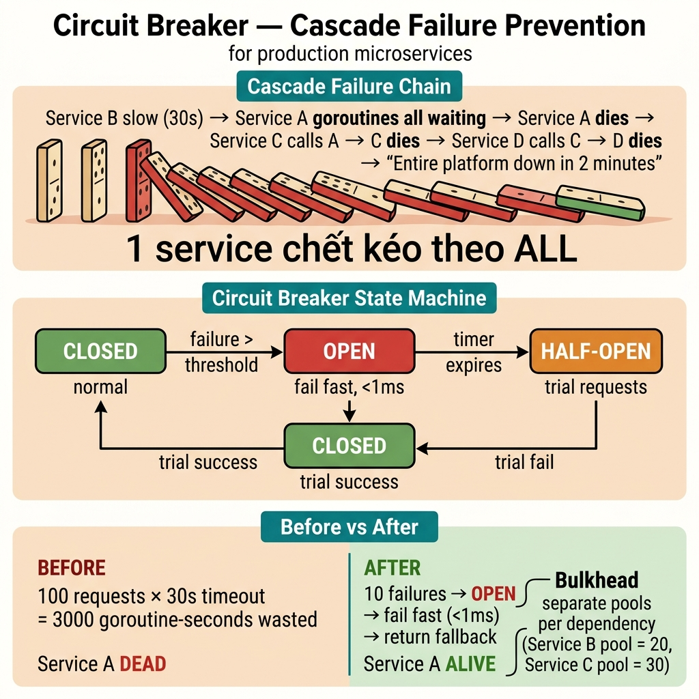

<!-- tags: best-practice, production, circuit-breaker, resilience -->
# ⚡ Circuit Breaker Cứu Hệ Thống Khi Downstream Chết — Cascade Failure Prevention

> Câu chuyện 1 service chậm kéo sập toàn bộ hệ thống vì thread pool cạn kiệt, và cách circuit breaker fail fast trong microseconds

📅 Ngày tạo: 2026-03-22 · 🔄 Cập nhật: 2026-04-04 · ⏱️ 10 phút đọc

| Aspect          | Detail                                                                               |
| --------------- | ------------------------------------------------------------------------------------ |
| **Incident**    | Service B chậm 30s → Service A thread pool cạn → cascade failure toàn hệ thống       |
| **Root cause**  | Timeout dài (30s) × 100 threads = 100 threads blocked = mọi request mới bị reject    |
| **Fix**         | Circuit breaker: fail fast khi downstream không khoẻ + fallback + bulkhead isolation |
| **Go packages** | `sony/gobreaker`, `context`, timeout pattern, bulkhead                               |

---

## 1. DEFINE

14:32 PM, payment service response time nhảy từ 50ms lên 30 giây. 14:33 PM, order service thread pool cạn vì tất cả threads đang chờ payment respond. 14:34 PM, API gateway timeout cascade — order, inventory, notification đều 503. 1 service chậm kéo sập 4 services khác. Entire platform down trong 7 phút. Revenue loss: $42,000/phút.

Một service chết không đáng sợ bằng việc nó kéo cả phần còn lại cùng ngã theo. `Circuit Breaker Cascade` là bài production kinh điển về failure isolation: nếu một dependency chậm hoặc lỗi, hệ thống của bạn có biết dừng đúng lúc không, hay sẽ tiếp tục chất thêm request cho đến khi mọi pool và queue cùng nghẹt.

Điều làm cascade nguy hiểm là nó thường bắt đầu bằng một lỗi nhỏ ở xa. Chỉ khi timeout, retry, và queue dồn chéo lên nhau, bạn mới nhận ra mình đang thiếu một đường ngắt mạch thực sự.

Core insight: **Circuit breaker chỉ có giá trị khi nó chặn đúng failure propagation path và đi cùng bulkhead, timeout, và fallback đủ rõ để hệ thống còn thở được khi downstream đang chết.**

### 📖 Câu chuyện: "1 service chết kéo theo tất cả"

Service A gọi Service B. Service B deploy lỗi, response time tăng từ 50ms lên **30 giây**. Không ai biết — cho đến khi Service A cũng chết.

Service A không chết vì lỗi logic. Chết vì **goroutine/thread pool cạn kiệt** — tất cả đang chờ Service B timeout.

### 🔍 Cascade Failure

```
Service B deploy lỗi → response time: 50ms → 30s
     │
     ▼
Service A: 100 goroutine đang chờ B (timeout 30s mỗi cái)
     │
     ▼
Goroutine pool cạn kiệt → request mới vào A không có goroutine xử lý
     │
     ▼
Service C gọi A → A không trả lời → C cũng timeout
     │
     ▼
Service D gọi C → C không trả lời → D cũng chết
     │
     ▼
Toàn bộ hệ thống freeze 💀
Domino effect: 1 service chết kéo theo TẤT CẢ
```

### Timeout là cần thiết nhưng KHÔNG ĐỦ

| Approach            | Latency khi B chết    | Resources consumed             |
| ------------------- | --------------------- | ------------------------------ |
| Không timeout       | Vĩnh viễn             | ∞ goroutines leak              |
| Timeout 30s         | 30s (rất chậm)        | 100 goroutines × 30s = blocked |
| Timeout 5s          | 5s (vẫn chậm)         | 100 goroutines × 5s            |
| **Circuit breaker** | **< 1ms (fail fast)** | **0 goroutines wasted**        |

**Toán**: Timeout 30s × 100 concurrent requests = hệ thống đứng 30 giây. Circuit breaker fail fast trong **microseconds**.

---

Cascade failure diễn ra trong 2 phút. Nhưng cơ chế đằng sau — thread pool exhaustion, timeout propagation, retry amplification — cần được nhìn rõ từng bước.

## 2. VISUAL

Cascade failure rất dễ bị đánh giá thấp nếu không nhìn đúng hướng lan của nó. Sơ đồ dưới đây cho thấy một dependency xấu có thể kéo sập cả request path như thế nào.



### 3 Trạng thái Circuit Breaker

```
┌──────────────────────────────────────────────────────────┐
│                 CIRCUIT BREAKER STATES                    │
│                                                          │
│  ┌──────────┐   fail > threshold   ┌──────────┐         │
│  │          │ ─────────────────────▶│          │         │
│  │  CLOSED  │                       │   OPEN   │         │
│  │          │   (mọi request đi     │          │         │
│  │ (bình    │    qua bình thường)   │ (fail    │         │
│  │ thường)  │                       │  fast!)  │         │
│  │          │◀──── success ─────────│          │         │
│  └──────────┘                       └────┬─────┘         │
│       ▲                                  │               │
│       │                            sau timeout           │
│       │                            (vd: 30s)             │
│       │                                  │               │
│       │                            ┌─────▼─────┐         │
│       │                            │           │         │
│       └──── trial success ─────────│ HALF-OPEN │         │
│                                    │           │         │
│             trial fail ──────────▶ │ (thử vài  │         │
│             (quay về OPEN)         │  request) │         │
│                                    └───────────┘         │
│                                                          │
│  CLOSED  → Request đi qua bình thường, đếm failures     │
│  OPEN    → Reject NGAY, không gọi downstream, trả fallback│
│  HALF-OPEN → Thử 3 request, nếu OK → close, fail → open │
└──────────────────────────────────────────────────────────┘
```

### Trước vs Sau Circuit Breaker

```
❌ TRƯỚC: Không có circuit breaker
  Service B chết
  ┌──────────────────────────────────────────┐
  │  Request 1 → wait 30s → timeout → error │
  │  Request 2 → wait 30s → timeout → error │
  │  Request 3 → wait 30s → timeout → error │
  │  ...                                     │
  │  Request 100 → NO GOROUTINE AVAILABLE    │
  │  → Service A DEAD 💀                     │
  └──────────────────────────────────────────┘
  Total waste: 100 × 30s = 3,000 goroutine-seconds

✅ SAU: Circuit breaker mở sau 10 failures
  Service B chết
  ┌──────────────────────────────────────────┐
  │  Request 1-10 → fail → circuit counts    │
  │  Request 11   → circuit OPEN!            │
  │  Request 12   → fail fast (< 1ms)        │
  │  Request 13   → fail fast → return fallback
  │  ...                                     │
  │  (30s later)  → HALF-OPEN → try 3 reqs  │
  │  → B still dead → OPEN lại              │
  │  → B recovered → CLOSED → normal        │
  │                                          │
  │  Service A vẫn SỐNG ✅ (trả fallback)    │
  └──────────────────────────────────────────┘
  Total waste: 10 × 30s = 300 goroutine-seconds (vs 3,000)
```

---

Cascade chain đã rõ. Bây giờ ta implement circuit breaker: từ state machine (CLOSED → OPEN → HALF-OPEN) đến production-grade implementation với gobreaker.

## 3. CODE

Khi propagation path đã rõ, code resilience phải thể hiện đúng timeout, breaker state, và fallback boundary. Ta đi từ anti-pattern retry mù sang lane fail-fast có kiểm soát.

### Example 1: Basic — gobreaker + Fallback

```go
package resilience

import (
	"context"
	"fmt"
	"log/slog"
	"net/http"
	"time"

	"github.com/sony/gobreaker/v2"
)

type ServiceBClient struct {
	cb         *gobreaker.CircuitBreaker[*http.Response]
	httpClient *http.Client
	baseURL    string
}

func NewServiceBClient(baseURL string) *ServiceBClient {
	settings := gobreaker.Settings{
		Name:        "service-b",
		MaxRequests: 3,              // Half-open: thử 3 request
		Interval:    10 * time.Second, // Reset counter mỗi 10s
		Timeout:     30 * time.Second, // Open → Half-open sau 30s

		ReadyToTrip: func(counts gobreaker.Counts) bool {
			// Mở circuit nếu > 50% fail trong 10+ request
			return counts.Requests >= 10 &&
				float64(counts.TotalFailures)/float64(counts.Requests) > 0.5
		},

		OnStateChange: func(name string, from, to gobreaker.State) {
			slog.Warn("circuit breaker state change",
				"name", name,
				"from", from.String(),
				"to", to.String(),
			)
			// TODO: Prometheus metric + Slack alert
		},
	}

	return &ServiceBClient{
		cb: gobreaker.NewCircuitBreaker[*http.Response](settings),
		httpClient: &http.Client{
			Timeout: 5 * time.Second, // Timeout ngắn cho từng call
		},
		baseURL: baseURL,
	}
}

func (c *ServiceBClient) GetUserProfile(ctx context.Context, userID string) (*UserProfile, error) {
	resp, err := c.cb.Execute(func() (*http.Response, error) {
		req, _ := http.NewRequestWithContext(ctx, "GET",
			fmt.Sprintf("%s/users/%s", c.baseURL, userID), nil)
		return c.httpClient.Do(req)
	})

	if err != nil {
		if err == gobreaker.ErrOpenState {
			// ⚡ Circuit OPEN — fail fast, trả fallback
			slog.Warn("circuit open, returning fallback", "userID", userID)
			return defaultUserProfile(userID), nil
		}
		return nil, fmt.Errorf("service-b call: %w", err)
	}
	defer resp.Body.Close()

	// Parse response...
	return &UserProfile{ID: userID, Name: "User"}, nil
}

func defaultUserProfile(userID string) *UserProfile {
	return &UserProfile{
		ID:   userID,
		Name: "Unknown User",
		// Trả data mặc định — UX degraded nhưng không crash
	}
}

type UserProfile struct {
	ID   string
	Name string
}
```
```typescript
import CircuitBreaker from 'opossum';
import axios from 'axios';

interface UserProfile {
  id: string;
  name: string;
}

function defaultUserProfile(userID: string): UserProfile {
  return { id: userID, name: 'Unknown User' };
}

async function fetchUserProfile(baseURL: string, userID: string): Promise<UserProfile> {
  const response = await axios.get<UserProfile>(`${baseURL}/users/${userID}`, {
    timeout: 5000,
  });
  return response.data;
}

function createServiceBClient(baseURL: string) {
  const options = {
    timeout: 5000,           // 5s per call
    errorThresholdPercentage: 50, // Open if >50% fail
    resetTimeout: 30000,     // Half-open after 30s
    volumeThreshold: 10,     // Minimum 10 requests before tripping
  };

  const breaker = new CircuitBreaker(
    (userID: string) => fetchUserProfile(baseURL, userID),
    options
  );

  breaker.on('open', () =>
    console.warn('circuit breaker OPENED — failing fast')
  );
  breaker.on('halfOpen', () =>
    console.info('circuit breaker HALF-OPEN — probing recovery')
  );
  breaker.on('close', () =>
    console.info('circuit breaker CLOSED — service recovered')
  );

  return {
    getUserProfile: async (userID: string): Promise<UserProfile> => {
      try {
        return await breaker.fire(userID) as UserProfile;
      } catch (err: any) {
        if (breaker.opened) {
          console.warn('circuit open, returning fallback', { userID });
          return defaultUserProfile(userID);
        }
        throw new Error(`service-b call: ${err.message}`);
      }
    },
  };
}
```
```rust
use std::sync::{Arc, Mutex};
use std::time::{Duration, Instant};
use reqwest::Client;

#[derive(Debug, Clone)]
pub struct UserProfile {
    pub id: String,
    pub name: String,
}

fn default_user_profile(user_id: &str) -> UserProfile {
    UserProfile { id: user_id.to_string(), name: "Unknown User".to_string() }
}

#[derive(Debug, PartialEq)]
enum BreakerState {
    Closed,
    Open { opened_at: Instant },
    HalfOpen,
}

pub struct CircuitBreakerState {
    state: BreakerState,
    failures: u32,
    requests: u32,
    threshold: u32,
    fail_rate: f64,
    timeout: Duration,
}

pub struct ServiceBClient {
    base_url: String,
    http: Client,
    breaker: Arc<Mutex<CircuitBreakerState>>,
}

impl ServiceBClient {
    pub fn new(base_url: String) -> Self {
        Self {
            base_url,
            http: Client::builder().timeout(Duration::from_secs(5)).build().unwrap(),
            breaker: Arc::new(Mutex::new(CircuitBreakerState {
                state: BreakerState::Closed,
                failures: 0,
                requests: 0,
                threshold: 10,
                fail_rate: 0.5,
                timeout: Duration::from_secs(30),
            })),
        }
    }

    pub async fn get_user_profile(&self, user_id: &str) -> Result<UserProfile, String> {
        // Check breaker state
        {
            let mut b = self.breaker.lock().unwrap();
            match &b.state {
                BreakerState::Open { opened_at } => {
                    if opened_at.elapsed() > b.timeout {
                        b.state = BreakerState::HalfOpen;
                    } else {
                        // ⚡ Fail fast — return fallback
                        tracing::warn!("circuit open, returning fallback");
                        return Ok(default_user_profile(user_id));
                    }
                }
                _ => {}
            }
        }

        let url = format!("{}/users/{}", self.base_url, user_id);
        match self.http.get(&url).send().await {
            Ok(resp) if resp.status().is_success() => {
                let mut b = self.breaker.lock().unwrap();
                b.requests += 1;
                Ok(resp.json::<UserProfile>().await.unwrap_or_else(|_| default_user_profile(user_id)))
            }
            Err(e) => {
                let mut b = self.breaker.lock().unwrap();
                b.requests += 1;
                b.failures += 1;
                if b.requests >= b.threshold
                    && (b.failures as f64 / b.requests as f64) > b.fail_rate
                {
                    tracing::warn!("circuit OPENED");
                    b.state = BreakerState::Open { opened_at: Instant::now() };
                }
                Err(format!("service-b call: {}", e))
            }
            Ok(resp) => {
                let mut b = self.breaker.lock().unwrap();
                b.requests += 1;
                b.failures += 1;
                Err(format!("service-b status: {}", resp.status()))
            }
        }
    }
}
```
```cpp
#include <string>
#include <functional>
#include <stdexcept>
#include <atomic>
#include <chrono>
#include <iostream>
#include <curl/curl.h>

struct UserProfile {
    std::string id;
    std::string name;
};

UserProfile defaultUserProfile(const std::string& user_id) {
    return { user_id, "Unknown User" };
}

enum class CBState { Closed, Open, HalfOpen };

class ServiceBClient {
public:
    ServiceBClient(const std::string& base_url)
        : base_url_(base_url), state_(CBState::Closed),
          failures_(0), requests_(0),
          threshold_(10), fail_rate_(0.5),
          timeout_sec_(30) {}

    UserProfile getUserProfile(const std::string& user_id) {
        // Check breaker state
        if (state_ == CBState::Open) {
            auto elapsed = std::chrono::steady_clock::now() - opened_at_;
            if (std::chrono::duration_cast<std::chrono::seconds>(elapsed).count() > timeout_sec_) {
                state_ = CBState::HalfOpen;
            } else {
                // ⚡ Fail fast — return fallback
                std::cerr << "circuit open, returning fallback for " << user_id << "\n";
                return defaultUserProfile(user_id);
            }
        }

        try {
            std::string url = base_url_ + "/users/" + user_id;
            std::string response_body = httpGet(url);
            requests_++;
            // Parse JSON response into UserProfile (simplified)
            return { user_id, "User" };
        } catch (const std::exception& e) {
            requests_++;
            failures_++;
            if (requests_ >= threshold_
                && (double)failures_ / requests_ > fail_rate_)
            {
                state_ = CBState::Open;
                opened_at_ = std::chrono::steady_clock::now();
                std::cerr << "circuit OPENED\n";
            }
            throw std::runtime_error(std::string("service-b call: ") + e.what());
        }
    }

private:
    std::string httpGet(const std::string& url) {
        // Simplified HTTP GET using libcurl
        CURL* curl = curl_easy_init();
        if (!curl) throw std::runtime_error("curl init failed");
        std::string result;
        curl_easy_setopt(curl, CURLOPT_URL, url.c_str());
        curl_easy_setopt(curl, CURLOPT_TIMEOUT, 5L);
        CURLcode res = curl_easy_perform(curl);
        curl_easy_cleanup(curl);
        if (res != CURLE_OK) throw std::runtime_error(curl_easy_strerror(res));
        return result;
    }

    std::string base_url_;
    CBState state_;
    uint32_t failures_, requests_;
    uint32_t threshold_;
    double fail_rate_;
    long timeout_sec_;
    std::chrono::steady_clock::time_point opened_at_;
};
```
```python
import time
import requests

class UserProfile(dict):
    pass

def default_user_profile(user_id: str) -> UserProfile:
    return UserProfile(id=user_id, name="Unknown User")

class ServiceBClient:
    def __init__(self, base_url: str) -> None:
        self.base_url = base_url
        self.failures = 0
        self.requests = 0
        self.threshold = 10
        self.fail_rate = 0.5
        self.timeout_seconds = 30
        self.opened_at: float | None = None

    def get_user_profile(self, user_id: str) -> UserProfile:
        if self.opened_at and time.time() - self.opened_at < self.timeout_seconds:
            print("circuit open, returning fallback", {"user_id": user_id})
            return default_user_profile(user_id)

        try:
            response = requests.get(f"{self.base_url}/users/{user_id}", timeout=5)
            response.raise_for_status()
            self.requests += 1
            return UserProfile(response.json())
        except Exception as exc:
            self.requests += 1
            self.failures += 1
            if self.requests >= self.threshold and self.failures / self.requests > self.fail_rate:
                self.opened_at = time.time()
                print("circuit OPENED")
            raise RuntimeError(f"service-b call: {exc}") from exc
```

---

### Example 2: Intermediate — Bulkhead Isolation

```go
package resilience

import (
	"context"
	"fmt"
	"time"
)

// Bulkhead — cách ly resource cho mỗi downstream service
// Service B chết → chỉ pool B bị ảnh hưởng, pool C vẫn chạy
type Bulkhead struct {
	name    string
	sem     chan struct{}
	timeout time.Duration
}

func NewBulkhead(name string, maxConcurrent int, timeout time.Duration) *Bulkhead {
	return &Bulkhead{
		name:    name,
		sem:     make(chan struct{}, maxConcurrent),
		timeout: timeout,
	}
}

func (b *Bulkhead) Execute(ctx context.Context, fn func() error) error {
	// Acquire slot với timeout
	select {
	case b.sem <- struct{}{}:
		defer func() { <-b.sem }()
	case <-time.After(b.timeout):
		return fmt.Errorf("bulkhead %s: no slots available", b.name)
	case <-ctx.Done():
		return ctx.Err()
	}

	return fn()
}

// ─── Usage: mỗi service có pool riêng ───
/*
serviceBPool := NewBulkhead("service-b", 20, 2*time.Second)
serviceCPool := NewBulkhead("service-c", 30, 2*time.Second)

// Service B chậm → chỉ 20 goroutine bị block
// Service C vẫn có 30 goroutine riêng, không ảnh hưởng
err := serviceBPool.Execute(ctx, func() error {
    return callServiceB(ctx, req)
})
*/
```
```typescript
import { setTimeout } from 'timers/promises';

// Bulkhead — isolate resources for each downstream service
// Service B dies → only pool B is affected, pool C continues
class Bulkhead {
  private activeCount = 0;

  constructor(
    private readonly name: string,
    private readonly maxConcurrent: number,
    private readonly timeoutMs: number
  ) {}

  async execute<T>(fn: () => Promise<T>): Promise<T> {
    if (this.activeCount >= this.maxConcurrent) {
      throw new Error(`bulkhead ${this.name}: no slots available`);
    }
    this.activeCount++;
    try {
      return await Promise.race([
        fn(),
        setTimeout(this.timeoutMs).then(() => {
          throw new Error(`bulkhead ${this.name}: timeout`);
        }),
      ]);
    } finally {
      this.activeCount--;
    }
  }
}

// Usage: each service has its own pool
/*
const serviceBPool = new Bulkhead('service-b', 20, 2000);
const serviceCPool = new Bulkhead('service-c', 30, 2000);

// Service B slow → only 20 concurrent blocked
// Service C still has 30 of its own — unaffected
await serviceBPool.execute(() => callServiceB(req));
*/
```
```rust
use std::sync::Arc;
use tokio::sync::Semaphore;
use tokio::time::{timeout, Duration};

/// Bulkhead — isolate resources for each downstream service
pub struct Bulkhead {
    name: String,
    sem: Arc<Semaphore>,
    timeout: Duration,
}

impl Bulkhead {
    pub fn new(name: &str, max_concurrent: usize, timeout: Duration) -> Self {
        Self {
            name: name.to_string(),
            sem: Arc::new(Semaphore::new(max_concurrent)),
            timeout,
        }
    }

    pub async fn execute<F, T, E>(&self, f: F) -> Result<T, String>
    where
        F: std::future::Future<Output = Result<T, E>>,
        E: std::fmt::Display,
    {
        let _permit = self.sem
            .acquire()
            .await
            .map_err(|_| format!("bulkhead {}: semaphore closed", self.name))?;

        timeout(self.timeout, f)
            .await
            .map_err(|_| format!("bulkhead {}: timeout", self.name))?
            .map_err(|e| format!("bulkhead {}: {}", self.name, e))
    }
}

// Usage: each service has its own pool
/*
let service_b_pool = Arc::new(Bulkhead::new("service-b", 20, Duration::from_secs(2)));
let service_c_pool = Arc::new(Bulkhead::new("service-c", 30, Duration::from_secs(2)));

// Service B slow → only 20 concurrent blocked
// Service C still has 30 of its own — unaffected
service_b_pool.execute(call_service_b(req)).await?;
*/
```
```cpp
#include <string>
#include <functional>
#include <future>
#include <stdexcept>
#include <semaphore>
#include <chrono>

// Bulkhead — isolate resources for each downstream service
class Bulkhead {
public:
    Bulkhead(std::string name, int max_concurrent, std::chrono::milliseconds timeout)
        : name_(std::move(name)), sem_(max_concurrent), timeout_(timeout) {}

    template<typename Fn>
    auto execute(Fn&& fn) -> decltype(fn()) {
        if (!sem_.try_acquire_for(timeout_)) {
            throw std::runtime_error("bulkhead " + name_ + ": no slots available");
        }
        struct Release { std::counting_semaphore<>& s; ~Release() { s.release(); } } guard{sem_};

        auto future = std::async(std::launch::async, std::forward<Fn>(fn));
        if (future.wait_for(timeout_) == std::future_status::timeout) {
            throw std::runtime_error("bulkhead " + name_ + ": timeout");
        }
        return future.get();
    }

private:
    std::string name_;
    std::counting_semaphore<> sem_;
    std::chrono::milliseconds timeout_;
};

// Usage: each service has its own pool
/*
Bulkhead serviceBPool("service-b", 20, std::chrono::milliseconds(2000));
Bulkhead serviceCPool("service-c", 30, std::chrono::milliseconds(2000));

// Service B slow → only 20 concurrent blocked
// Service C still has 30 of its own — unaffected
serviceBPool.execute([&]{ return callServiceB(req); });
*/
```
```python
from concurrent.futures import ThreadPoolExecutor, TimeoutError

class Bulkhead:
    def __init__(self, name: str, max_concurrent: int, timeout_seconds: float) -> None:
        self.name = name
        self.pool = ThreadPoolExecutor(max_workers=max_concurrent)
        self.timeout_seconds = timeout_seconds

    def execute(self, fn):
        future = self.pool.submit(fn)
        try:
            return future.result(timeout=self.timeout_seconds)
        except TimeoutError as exc:
            raise RuntimeError(f"bulkhead {self.name}: timeout") from exc
```

---

### Example 3: Advanced — Circuit Breaker + Bulkhead + Retry

```go
package resilience

import (
	"context"
	"fmt"
	"log/slog"
	"math/rand"
	"time"
)

// ResilienceWrapper — kết hợp 3 pattern
type ResilienceWrapper struct {
	cb       *CircuitBreaker
	bulkhead *Bulkhead
	maxRetry int
	name     string
}

func NewResilienceWrapper(name string, maxConcurrent, maxRetry int) *ResilienceWrapper {
	return &ResilienceWrapper{
		cb:       NewSimpleCircuitBreaker(name, 10, 0.5, 30*time.Second),
		bulkhead: NewBulkhead(name, maxConcurrent, 2*time.Second),
		maxRetry: maxRetry,
		name:     name,
	}
}

func (w *ResilienceWrapper) Execute(ctx context.Context, fn func() error, fallback func() error) error {
	// ① Circuit breaker check
	if !w.cb.AllowRequest() {
		slog.Warn("circuit open, using fallback", "service", w.name)
		return fallback()
	}

	// ② Bulkhead: limit concurrent
	return w.bulkhead.Execute(ctx, func() error {
		// ③ Retry with backoff
		var lastErr error
		for attempt := 0; attempt <= w.maxRetry; attempt++ {
			if attempt > 0 {
				backoff := time.Duration(100<<(attempt-1)) * time.Millisecond
				jitter := time.Duration(rand.Int63n(int64(backoff) / 2))
				time.Sleep(backoff + jitter)
			}

			err := fn()
			if err == nil {
				w.cb.RecordSuccess()
				return nil
			}
			lastErr = err
			w.cb.RecordFailure()
		}

		return fmt.Errorf("%s: all retries exhausted: %w", w.name, lastErr)
	})
}

// Simple circuit breaker for illustration
type CircuitBreaker struct {
	name       string
	threshold  int
	failRate   float64
	timeout    time.Duration
	failures   int
	requests   int
	isOpen     bool
	openedAt   time.Time
}

func NewSimpleCircuitBreaker(name string, threshold int, failRate float64, timeout time.Duration) *CircuitBreaker {
	return &CircuitBreaker{name: name, threshold: threshold, failRate: failRate, timeout: timeout}
}

func (cb *CircuitBreaker) AllowRequest() bool {
	if !cb.isOpen {
		return true
	}
	if time.Since(cb.openedAt) > cb.timeout {
		cb.isOpen = false // Half-open
		cb.failures = 0
		cb.requests = 0
		return true
	}
	return false
}

func (cb *CircuitBreaker) RecordSuccess() { cb.requests++ }
func (cb *CircuitBreaker) RecordFailure() {
	cb.requests++
	cb.failures++
	if cb.requests >= cb.threshold &&
		float64(cb.failures)/float64(cb.requests) > cb.failRate {
		cb.isOpen = true
		cb.openedAt = time.Now()
		slog.Warn("circuit OPENED", "service", cb.name)
	}
}
```
```typescript
import { setTimeout as sleep } from 'timers/promises';

// ResilienceWrapper — combines circuit breaker + bulkhead + retry
class ResilienceWrapper {
  private failures = 0;
  private requests = 0;
  private isOpen = false;
  private openedAt = 0;
  private activeCount = 0;

  constructor(
    private readonly name: string,
    private readonly maxConcurrent: number,
    private readonly maxRetry: number,
    private readonly threshold = 10,
    private readonly failRate = 0.5,
    private readonly timeoutMs = 30_000
  ) {}

  private allowRequest(): boolean {
    if (!this.isOpen) return true;
    if (Date.now() - this.openedAt > this.timeoutMs) {
      this.isOpen = false;
      this.failures = 0;
      this.requests = 0;
      return true; // half-open
    }
    return false;
  }

  async execute<T>(fn: () => Promise<T>, fallback: () => Promise<T>): Promise<T> {
    // ① Circuit breaker check
    if (!this.allowRequest()) {
      console.warn('circuit open, using fallback', { service: this.name });
      return fallback();
    }

    // ② Bulkhead: limit concurrent
    if (this.activeCount >= this.maxConcurrent) {
      throw new Error(`${this.name}: no slots available`);
    }
    this.activeCount++;

    try {
      // ③ Retry with exponential backoff + jitter
      let lastErr: Error | undefined;
      for (let attempt = 0; attempt <= this.maxRetry; attempt++) {
        if (attempt > 0) {
          const backoff = 100 * Math.pow(2, attempt - 1);
          const jitter = Math.random() * (backoff / 2);
          await sleep(backoff + jitter);
        }
        try {
          const result = await fn();
          this.requests++;
          return result;
        } catch (err: any) {
          lastErr = err;
          this.requests++;
          this.failures++;
          if (
            this.requests >= this.threshold &&
            this.failures / this.requests > this.failRate
          ) {
            this.isOpen = true;
            this.openedAt = Date.now();
            console.warn('circuit OPENED', { service: this.name });
          }
        }
      }
      throw new Error(`${this.name}: all retries exhausted: ${lastErr?.message}`);
    } finally {
      this.activeCount--;
    }
  }
}
```
```rust
use std::sync::{Arc, Mutex};
use std::time::{Duration, Instant};
use tokio::time::sleep;

/// ResilienceWrapper — combines circuit breaker + bulkhead + retry
pub struct ResilienceWrapper {
    name: String,
    max_concurrent: usize,
    max_retry: u32,
    inner: Arc<Mutex<BreakerInner>>,
    sem: Arc<tokio::sync::Semaphore>,
}

struct BreakerInner {
    failures: u32,
    requests: u32,
    is_open: bool,
    opened_at: Option<Instant>,
    threshold: u32,
    fail_rate: f64,
    timeout: Duration,
}

impl ResilienceWrapper {
    pub fn new(name: &str, max_concurrent: usize, max_retry: u32) -> Self {
        Self {
            name: name.to_string(),
            max_concurrent,
            max_retry,
            inner: Arc::new(Mutex::new(BreakerInner {
                failures: 0, requests: 0, is_open: false,
                opened_at: None, threshold: 10, fail_rate: 0.5,
                timeout: Duration::from_secs(30),
            })),
            sem: Arc::new(tokio::sync::Semaphore::new(max_concurrent)),
        }
    }

    fn allow_request(&self) -> bool {
        let mut b = self.inner.lock().unwrap();
        if !b.is_open { return true; }
        if b.opened_at.map(|t| t.elapsed() > b.timeout).unwrap_or(false) {
            b.is_open = false;
            b.failures = 0;
            b.requests = 0;
            return true; // half-open
        }
        false
    }

    pub async fn execute<F, Fut, Fb, FbFut, T, E>(
        &self, fn_: F, fallback: Fb,
    ) -> Result<T, String>
    where
        F: Fn() -> Fut,
        Fut: std::future::Future<Output = Result<T, E>>,
        Fb: Fn() -> FbFut,
        FbFut: std::future::Future<Output = Result<T, E>>,
        E: std::fmt::Display,
    {
        // ① Circuit breaker check
        if !self.allow_request() {
            tracing::warn!(service = %self.name, "circuit open, using fallback");
            return fallback().await.map_err(|e| e.to_string());
        }

        // ② Bulkhead: limit concurrent
        let _permit = self.sem.acquire().await
            .map_err(|_| format!("{}: semaphore closed", self.name))?;

        // ③ Retry with exponential backoff + jitter
        let mut last_err = String::new();
        for attempt in 0..=self.max_retry {
            if attempt > 0 {
                let backoff = 100u64 * (1 << (attempt - 1));
                let jitter = rand::random::<u64>() % (backoff / 2 + 1);
                sleep(Duration::from_millis(backoff + jitter)).await;
            }
            match fn_().await {
                Ok(v) => {
                    self.inner.lock().unwrap().requests += 1;
                    return Ok(v);
                }
                Err(e) => {
                    last_err = e.to_string();
                    let mut b = self.inner.lock().unwrap();
                    b.requests += 1;
                    b.failures += 1;
                    if b.requests >= b.threshold
                        && (b.failures as f64 / b.requests as f64) > b.fail_rate
                    {
                        b.is_open = true;
                        b.opened_at = Some(Instant::now());
                        tracing::warn!(service = %self.name, "circuit OPENED");
                    }
                }
            }
        }
        Err(format!("{}: all retries exhausted: {}", self.name, last_err))
    }
}
```
```cpp
#include <string>
#include <functional>
#include <stdexcept>
#include <chrono>
#include <thread>
#include <atomic>
#include <cmath>
#include <random>

// ResilienceWrapper — combines circuit breaker + bulkhead + retry
class ResilienceWrapper {
public:
    ResilienceWrapper(std::string name, int max_concurrent, int max_retry)
        : name_(std::move(name)), max_concurrent_(max_concurrent),
          max_retry_(max_retry), active_count_(0),
          failures_(0), requests_(0), is_open_(false),
          threshold_(10), fail_rate_(0.5),
          timeout_(std::chrono::seconds(30)) {}

    template<typename Fn, typename Fallback>
    auto execute(Fn&& fn, Fallback&& fallback) -> decltype(fn()) {
        using ResultType = decltype(fn());

        // ① Circuit breaker check
        if (!allowRequest()) {
            std::cerr << "circuit open, using fallback: " << name_ << "\n";
            return fallback();
        }

        // ② Bulkhead: limit concurrent
        if (active_count_.load() >= max_concurrent_) {
            throw std::runtime_error(name_ + ": no slots available");
        }
        active_count_++;
        struct Guard { std::atomic<int>& c; ~Guard() { c--; } } guard{active_count_};

        // ③ Retry with exponential backoff + jitter
        std::mt19937 rng(std::random_device{}());
        std::exception_ptr last_err;
        for (int attempt = 0; attempt <= max_retry_; attempt++) {
            if (attempt > 0) {
                int backoff_ms = 100 * static_cast<int>(std::pow(2, attempt - 1));
                std::uniform_int_distribution<int> dist(0, backoff_ms / 2);
                std::this_thread::sleep_for(
                    std::chrono::milliseconds(backoff_ms + dist(rng)));
            }
            try {
                auto result = fn();
                requests_++;
                return result;
            } catch (...) {
                last_err = std::current_exception();
                requests_++;
                failures_++;
                if (requests_ >= threshold_
                    && (double)failures_ / requests_ > fail_rate_)
                {
                    is_open_ = true;
                    opened_at_ = std::chrono::steady_clock::now();
                    std::cerr << "circuit OPENED: " << name_ << "\n";
                }
            }
        }
        std::rethrow_exception(last_err);
    }

private:
    bool allowRequest() {
        if (!is_open_) return true;
        auto elapsed = std::chrono::steady_clock::now() - opened_at_;
        if (elapsed > timeout_) {
            is_open_ = false;
            failures_ = 0;
            requests_ = 0;
            return true; // half-open
        }
        return false;
    }

    std::string name_;
    int max_concurrent_, max_retry_;
    std::atomic<int> active_count_;
    int failures_, requests_, threshold_;
    double fail_rate_;
    bool is_open_;
    std::chrono::steady_clock::time_point opened_at_;
    std::chrono::duration<double> timeout_;
};
```
```python
import random
import threading
import time

class ResilienceWrapper:
    def __init__(self, name: str, max_concurrent: int, max_retry: int) -> None:
        self.name = name
        self.max_retry = max_retry
        self.threshold = 10
        self.fail_rate = 0.5
        self.failures = 0
        self.requests = 0
        self.is_open = False
        self.opened_at = 0.0
        self.timeout_seconds = 30
        self.sem = threading.Semaphore(max_concurrent)

    def _allow_request(self) -> bool:
        if not self.is_open:
            return True
        if time.time() - self.opened_at > self.timeout_seconds:
            self.is_open = False
            self.failures = 0
            self.requests = 0
            return True
        return False

    def execute(self, fn, fallback):
        if not self._allow_request():
            print("circuit open, using fallback", {"service": self.name})
            return fallback()

        if not self.sem.acquire(timeout=2):
            raise RuntimeError(f"{self.name}: no slots available")

        try:
            last_error = None
            for attempt in range(self.max_retry + 1):
                if attempt > 0:
                    backoff = 0.1 * (2 ** (attempt - 1))
                    time.sleep(backoff + random.random() * backoff / 2)
                try:
                    result = fn()
                    self.requests += 1
                    return result
                except Exception as exc:
                    last_error = exc
                    self.requests += 1
                    self.failures += 1
                    if self.requests >= self.threshold and self.failures / self.requests > self.fail_rate:
                        self.is_open = True
                        self.opened_at = time.time()
                        print("circuit OPENED", {"service": self.name})
            raise RuntimeError(f"{self.name}: all retries exhausted: {last_error}")
        finally:
            self.sem.release()
```

---

### Example 4: Expert — Health Check + Monitoring

```go
package monitoring

import (
	"context"
	"log/slog"
	"net/http"
	"time"
)

// ─── Downstream Health Checker ───
type HealthChecker struct {
	services map[string]string // name → health URL
	client   *http.Client
}

func NewHealthChecker(services map[string]string) *HealthChecker {
	return &HealthChecker{
		services: services,
		client:   &http.Client{Timeout: 2 * time.Second},
	}
}

func (h *HealthChecker) Run(ctx context.Context) {
	for range time.Tick(10 * time.Second) {
		for name, url := range h.services {
			resp, err := h.client.Get(url)
			status := "DOWN"
			if err == nil && resp.StatusCode == 200 {
				status = "UP"
			}
			if resp != nil {
				resp.Body.Close()
			}

			// metrics.ServiceHealth.WithLabelValues(name).Set(healthValue)
			if status == "DOWN" {
				slog.Warn("downstream unhealthy", "service", name)
			}
		}
	}
}

/*
Prometheus Alerts:
  - circuit_breaker_state{state="open"} == 1 for 1m → warning
  - circuit_breaker_state{state="open"} == 1 for 5m → critical
  - downstream_health == 0 for 2m → page on-call
*/
```
```typescript
import axios from 'axios';
import { setTimeout as sleep } from 'timers/promises';

// ─── Downstream Health Checker ───
class HealthChecker {
  constructor(private readonly services: Record<string, string>) {}

  async run(): Promise<void> {
    const tick = async () => {
      for (const [name, url] of Object.entries(this.services)) {
        let status = 'DOWN';
        try {
          const resp = await axios.get(url, { timeout: 2000 });
          if (resp.status === 200) status = 'UP';
        } catch {
          // service unreachable
        }

        // metrics.serviceHealth.labels(name).set(status === 'UP' ? 1 : 0);
        if (status === 'DOWN') {
          console.warn('downstream unhealthy', { service: name });
        }
      }
      await sleep(10_000);
      tick();
    };
    tick();
  }
}

/*
Prometheus Alerts:
  - circuit_breaker_state{state="open"} == 1 for 1m → warning
  - circuit_breaker_state{state="open"} == 1 for 5m → critical
  - downstream_health == 0 for 2m → page on-call
*/
```
```rust
use std::collections::HashMap;
use tokio::time::{sleep, Duration};
use reqwest::Client;

// ─── Downstream Health Checker ───
pub struct HealthChecker {
    services: HashMap<String, String>, // name → health URL
    client: Client,
}

impl HealthChecker {
    pub fn new(services: HashMap<String, String>) -> Self {
        Self {
            services,
            client: Client::builder().timeout(Duration::from_secs(2)).build().unwrap(),
        }
    }

    pub async fn run(&self) {
        loop {
            for (name, url) in &self.services {
                let status = match self.client.get(url).send().await {
                    Ok(resp) if resp.status().is_success() => "UP",
                    _ => "DOWN",
                };

                // metrics::SERVICE_HEALTH.with_label_values(&[name]).set(if status == "UP" { 1.0 } else { 0.0 });
                if status == "DOWN" {
                    tracing::warn!(service = %name, "downstream unhealthy");
                }
            }
            sleep(Duration::from_secs(10)).await;
        }
    }
}

/*
Prometheus Alerts:
  - circuit_breaker_state{state="open"} == 1 for 1m → warning
  - circuit_breaker_state{state="open"} == 1 for 5m → critical
  - downstream_health == 0 for 2m → page on-call
*/
```
```cpp
#include <string>
#include <map>
#include <iostream>
#include <thread>
#include <chrono>
#include <curl/curl.h>

// ─── Downstream Health Checker ───
class HealthChecker {
public:
    explicit HealthChecker(std::map<std::string, std::string> services)
        : services_(std::move(services)) {}

    void run() {
        while (true) {
            for (const auto& [name, url] : services_) {
                std::string status = checkHealth(url) ? "UP" : "DOWN";

                // metrics.serviceHealth(name, status == "UP" ? 1 : 0);
                if (status == "DOWN") {
                    std::cerr << "downstream unhealthy: " << name << "\n";
                }
            }
            std::this_thread::sleep_for(std::chrono::seconds(10));
        }
    }

private:
    bool checkHealth(const std::string& url) {
        CURL* curl = curl_easy_init();
        if (!curl) return false;
        curl_easy_setopt(curl, CURLOPT_URL, url.c_str());
        curl_easy_setopt(curl, CURLOPT_TIMEOUT, 2L);
        curl_easy_setopt(curl, CURLOPT_NOBODY, 1L);
        CURLcode res = curl_easy_perform(curl);
        long http_code = 0;
        curl_easy_getinfo(curl, CURLINFO_RESPONSE_CODE, &http_code);
        curl_easy_cleanup(curl);
        return (res == CURLE_OK && http_code == 200);
    }

    /*
    Prometheus Alerts:
      - circuit_breaker_state{state="open"} == 1 for 1m → warning
      - circuit_breaker_state{state="open"} == 1 for 5m → critical
      - downstream_health == 0 for 2m → page on-call
    */

    std::map<std::string, std::string> services_;
};
```
```python
import time
import requests

class HealthChecker:
    def __init__(self, services: dict[str, str]) -> None:
        self.services = services

    def run(self) -> None:
        while True:
            for name, url in self.services.items():
                status = "DOWN"
                try:
                    response = requests.get(url, timeout=2)
                    if response.status_code == 200:
                        status = "UP"
                except Exception:
                    pass

                if status == "DOWN":
                    print("downstream unhealthy", {"service": name})

            time.sleep(10)
```

**Bài học**: _"Timeout là cần thiết nhưng không đủ. Timeout 30s × 100 threads = hệ thống đứng 30 giây. Circuit breaker fail fast trong microseconds."_

---

## 4. PITFALLS

Circuit breaker không cứu được gì nếu timeout, fallback, và concurrency isolation vẫn đang sai vai trò.

| # | Severity | Lỗi | Hậu quả | Fix |
| --- | --- | --- | --- | --- |
| 1 | 🟡 Common | Chỉ dùng timeout, không có circuit breaker | 100 goroutine × 30s timeout = system freeze | Circuit breaker: fail fast < 1ms |
| 2 | 🟡 Common | Không có fallback khi circuit open | User thấy error 100% khi downstream chết | Graceful degradation: default data/cached |
| 3 | 🟡 Common | Tất cả downstream dùng chung goroutine pool | 1 service chậm block pool cho mọi service | Bulkhead: pool riêng cho mỗi downstream |
| 4 | 🟡 Common | Circuit threshold quá nhạy | Circuit mở vì 1-2 transient error | threshold >= 10 requests + > 50% fail rate |
| 5 | 🟡 Common | Half-open thử quá nhiều request | Downstream chưa khoẻ đã bị flood | MaxRequests = 3 cho half-open |
| 6 | 🟡 Common | Không monitor circuit state | Không biết circuit đang open | Prometheus metric + Slack alert on state change |

---

## 5. REF

| Resource                           | Link                                                                                                                   |
| ---------------------------------- | ---------------------------------------------------------------------------------------------------------------------- |
| sony/gobreaker                     | [github.com/sony/gobreaker](https://github.com/sony/gobreaker)                                                         |
| Martin Fowler: Circuit Breaker     | [martinfowler.com/bliki/CircuitBreaker](https://martinfowler.com/bliki/CircuitBreaker.html)                            |
| Microsoft: Circuit Breaker Pattern | [docs.microsoft.com/azure/architecture](https://learn.microsoft.com/en-us/azure/architecture/patterns/circuit-breaker) |
| Release It! (Michael Nygard)       | [pragprog.com/titles/mnee2](https://pragprog.com/titles/mnee2/release-it-second-edition/)                              |
| Netflix Hystrix (archived)         | [github.com/Netflix/Hystrix](https://github.com/Netflix/Hystrix)                                                       |

---

## 6. RECOMMEND

Khi failure isolation đã sáng, bước tiếp theo là nối nó sang queue buffering, graceful degradation, retry budgeting, và observability để không chỉ ngắt mạch mà còn đo được khi nào phải ngắt.

| Mở rộng                          | Khi nào                | Lý do                                                         |
| -------------------------------- | ---------------------- | ------------------------------------------------------------- |
| **Service mesh (Istio/Linkerd)** | Microservice nhiều     | Circuit breaker ở infrastructure level, không cần code        |
| **Retry budget**                 | Cross-service retry    | Max 10% request là retry, tránh amplification                 |
| **Load shedding**                | Tự bảo vệ service mình | Reject request khi overload, trước khi cascade                |
| **Chaos engineering**            | Test resilience        | Inject failure: kill service, high latency, network partition |
| **OpenTelemetry**                | Distributed tracing    | Trace cascade failure path qua nhiều service                  |

---

## 7. QUICK REF

| # | Pattern | Code / Rule |
|---|---------|-------------|
| 1 | **Circuit breaker states** | `CLOSED` (normal) → `OPEN` (fail fast) → `HALF-OPEN` (probe) → `CLOSED` |
| 2 | **gobreaker config** | `MaxRequests: 1, Interval: 30s, Timeout: 60s, ReadyToTrip: failures > 5` |
| 3 | **Timeout budget** | `total_budget = sum(all_downstream_timeouts)` — phải < user-facing SLA |
| 4 | **Bulkhead** | Separate goroutine pool per dependency — 1 slow downstream không ảnh hưởng pool |
| 5 | **Fallback strategy** | OPEN → return cached data / default / degrade gracefully |
| 6 | **Fast fail** | Khi breaker OPEN: return error trong microseconds thay vì chờ 30s |
| 7 | **Alert on state change** | `circuit_breaker_state{service="payment"} == 1 (OPEN)` → page |
| 8 | **CLOSED → OPEN threshold** | Thường: 5 failures trong 10s, hoặc error rate > 50% trong 30s |

---

---

**Callback**: Quay lại 7 phút downtime, $42K/phút lúc đầu. Bây giờ bạn biết: circuit breaker fail fast trong microseconds thay vì chờ 30 giây timeout. 1 dòng `if cb.State() == OPEN { return fallback }` ngăn cascade. Simple mechanism, massive impact.

← Quay về [Best Practices](./README.md) · ← Trước: [Read Replica](./07-read-replica-betrayal.md) · → Tiếp: [Missing Index](./09-missing-composite-index.md)
## 8. INTERVIEW ANGLE

**System design questions liên quan:**
- *"How do you prevent one slow service from bringing down your entire system?"*
- *"Design a resilient microservice architecture"*
- *"What is a circuit breaker and when would you use it?"*

**Điểm interviewer muốn nghe:**

| Chủ đề | Talking point |
|--------|---------------|
| **Cascade failure mechanism** | Timeout × goroutines = pool exhaustion → upstream services cũng chết |
| **Why timeout alone isn't enough** | Timeout 30s × 100 threads = 3,000 thread-seconds wasted; breaker = microseconds |
| **3 states** | CLOSED (normal) → OPEN (fail fast) → HALF-OPEN (probe recovery) |
| **Bulkhead pattern** | Separate pools per dependency — 1 slow service không steal from others |
| **Fallback strategy** | OPEN → cached data / degraded response / queue for later |
| **Numbers** | Without breaker: 100 × 30s = 3,000s wasted; With breaker: 10 × 30s = 300s |

**Follow-up questions thường gặp:**
- *"How do you set the threshold?"* → Error rate % + time window (e.g., 50% errors in 30s)
- *"What's the difference between circuit breaker and retry?"* → Retry: hope it works; CB: stop trying when clearly broken
- *"How do you implement this without a library?"* → Atomic state counter + time-windowed error rate

---

## 9. MONITORING

### Metrics cần track

| Metric | Alert Threshold | Ý nghĩa |
|--------|----------------|---------|
| `circuit_breaker_state` (0=CLOSED, 1=OPEN, 2=HALF-OPEN) | state == 1 (OPEN) | Downstream unhealthy — page on-call |
| `circuit_breaker_requests_total{result="success\|failure"}` | failure rate > 50% trong 60s | Đang tiến tới OPEN |
| `goroutine_count` | > baseline × 3 | Pool depleting |
| `http_client_request_duration_p99{target="serviceB"}` | > timeout_value × 0.8 | Downstream slowing down |
| `connection_pool_wait_count` | > 0 liên tục | Pool saturation |
| `fallback_invocations_total` | > 0 | Circuit đã mở — user nhận fallback |

### Circuit Breaker State Diagram — để alert đúng

```text
   CLOSED                    OPEN                  HALF-OPEN
     │                         │                       │
     │ failures > threshold     │  timeout (30s)        │  trial success
     │─────────────────────────▶│──────────────────────▶│──────────────▶ CLOSED
     │                         │                       │
     │◀────────────────────────▶│  trial fail           │
     │        (không có         │◀──────────────────────│
     │         direct path)     │                       │

Alert on: CLOSED → OPEN transition (immediate page)
Alert on: OPEN state duration > 5 minutes (escalate)
```

### Dashboard panels khuyến nghị

```text
Row 1: Breaker Health
  ┌────────────────────┐  ┌────────────────────┐  ┌──────────────────┐
  │  Breaker State     │  │  Failure Rate %    │  │  Fallback Rate   │
  │  (per service)     │  │  (rolling 60s)     │  │  (req/s)         │
  └────────────────────┘  └────────────────────┘  └──────────────────┘

Row 2: Resource Health
  ┌────────────────────┐  ┌────────────────────┐  ┌──────────────────┐
  │  Goroutine Count   │  │  Pool Wait Count   │  │  P99 Latency     │
  └────────────────────┘  └────────────────────┘  └──────────────────┘
```

---

## 10. DETECTION CHECKLIST

| # | Dấu hiệu | Cách kiểm tra | Ý nghĩa |
|---|----------|---------------|---------|
| 1 | **Goroutine count tăng đều** | `/debug/pprof/goroutine` hoặc `runtime.NumGoroutine()` | Thread/goroutine pool depleting |
| 2 | **P99 = timeout value chính xác** | Latency histogram — spike đúng bằng timeout setting | Requests đang chờ timeout, không xử lý xong |
| 3 | **Downstream error rate > 50%** | External call success rate metric | Downstream unhealthy — cần circuit breaker mở |
| 4 | **Connection pool exhausted** | `db.Stats().WaitDuration > 0` hoặc HTTP transport metrics | Tất cả connections đang chờ downstream |
| 5 | **Cascade: service khác cũng chậm** | Latency tăng ở services không liên quan trực tiếp | Cascade failure đã lan rộng |
| 6 | **Health endpoint timeout** | `/health` endpoint của service bị timeout | Service A đã bị ảnh hưởng bởi service B |

---

