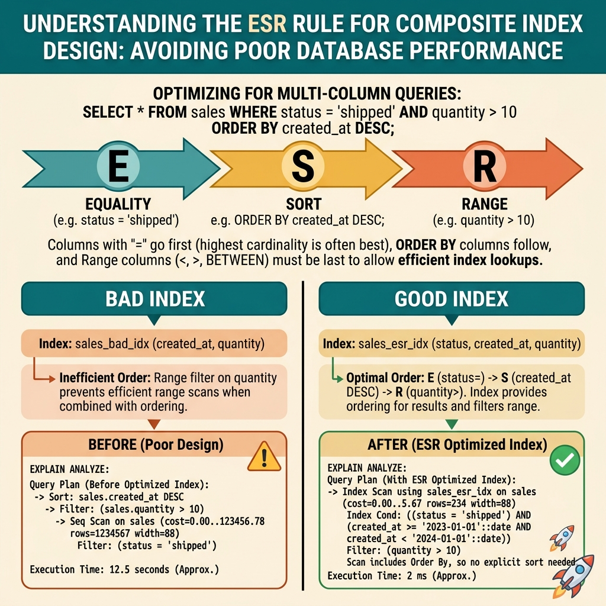

<!-- tags: best-practice, production, database, performance -->
# 🔍 Index Tưởng Có Mà Không Có — Composite Index & Query Optimization

> Query 20ms trên staging, 45 giây trên production 50M rows — vì thiếu composite index và không hiểu index column order

📅 Ngày tạo: 2026-03-22 · 🔄 Cập nhật: 2026-04-04 · ⏱️ 10 phút đọc

| Aspect         | Detail                                                                                     |
| -------------- | ------------------------------------------------------------------------------------------ |
| **Bug**        | Query 45s trên 50M rows dù có index trên `user_id` và `status` riêng lẻ                    |
| **Root cause** | Không có composite index → PostgreSQL chọn Seq Scan thay vì Index Scan                     |
| **Fix**        | `CREATE INDEX CONCURRENTLY (user_id, status, created_at DESC)` — equality trước, range sau |
| **Rule**       | ESR: Equality → Sort → Range column order                                                  |

---

## 1. DEFINE

Staging: query chạy 20ms. Production (50M rows): cùng query, 45 giây. EXPLAIN ANALYZE: Seq Scan on orders, 50 triệu rows scanned. Index on `status` tồn tại. Index on `created_at` tồn tại. Nhưng query filter cả 2 columns — và không có composite index. PostgreSQL chọn 1 index, scan 5M rows rồi filter. Đây không phải missing index — đây là wrong index.

Không phải mọi query chậm đều cần thêm “một cái index nào đó”. `Missing Composite Index` là bài production rất thực vì nó nhắc bạn rằng order của cột trong index quan trọng không kém việc có index hay không. Một query 45 giây trên 50 triệu dòng thường đến từ chỗ planner không tìm được con đường rẻ để đi.

Điều nguy hiểm của bài này là nó thường bị che bằng cache, rồi chỉ lộ ra khi traffic tăng hoặc dashboard cần báo cáo gấp. Lúc đó, việc hiểu ESR rule và đọc EXPLAIN không còn là tối ưu đẹp mắt; nó là kỹ năng cứu hệ thống khỏi full scan kéo dài.

Core insight: **Best practice với composite index bắt đầu ở việc match đúng pattern lọc/sắp xếp của query, thay vì thêm index theo cảm giác hoặc theo thứ tự cột trong bảng.**

### 📖 Câu chuyện: "Staging 20ms, production 45 giây"

Query chạy ngon trên staging — **20ms**. Lên production với 50 triệu rows — **45 giây**. DBA nhìn vào mặt developer không nói gì.

```sql
SELECT * FROM transactions
WHERE user_id = 123
  AND status = 'pending'
  AND created_at > NOW() - INTERVAL '7 days'
ORDER BY created_at DESC;
```

Có index trên `user_id`. Có index trên `status`. **Nhưng không có composite index.**

### 🔍 EXPLAIN ANALYZE — sự thật phũ phàng

```sql
-- Trên production (50M rows):
EXPLAIN ANALYZE SELECT * FROM transactions
WHERE user_id = 123 AND status = 'pending'
AND created_at > NOW() - INTERVAL '7 days'
ORDER BY created_at DESC;

-- Kết quả:
-- Seq Scan on transactions  (cost=0..1450000 rows=50000000)
--   Filter: (user_id = 123 AND status = 'pending' AND ...)
--   Rows Removed by Filter: 49,999,985
--   Actual time: 44823.456ms
--
-- PostgreSQL KHÔNG DÙNG index riêng lẻ vì:
-- idx_user_id chỉ lọc được ~10% (500K users)
-- idx_status chỉ lọc được ~20% (5 statuses)
-- Optimizer thấy: dùng index → random I/O nhiều → chậm hơn seq scan
```

### Tại sao staging ổn nhưng production chết?

| Metric              | Staging       | Production                    |
| ------------------- | ------------- | ----------------------------- |
| Rows                | 10,000        | 50,000,000                    |
| Data size           | 5MB           | 25GB                          |
| Seq scan time       | 20ms          | 45,000ms                      |
| Index riêng lẻ      | Đủ nhanh      | Không dùng (selectivity thấp) |
| **Composite index** | **Không cần** | **BẮT BUỘC**                  |

### Index Column Order — Rule ESR

| Rule             | Ý nghĩa                      | Ví dụ                                 |
| ---------------- | ---------------------------- | ------------------------------------- |
| **E** (Equality) | Cột `=` đặt trước            | `user_id = 123`, `status = 'pending'` |
| **S** (Sort)     | Cột `ORDER BY` tiếp theo     | `created_at DESC`                     |
| **R** (Range)    | Cột `>`, `<`, `BETWEEN` cuối | `created_at > '2026-03-15'`           |

```sql
-- ❌ SAI: range column ở giữa
CREATE INDEX idx_wrong ON transactions(user_id, created_at, status);
-- PostgreSQL dùng index cho user_id, rồi created_at range scan
-- nhưng KHÔNG thể dùng index cho status → filter thêm

-- ✅ ĐÚNG: equality trước, range sau
CREATE INDEX idx_right ON transactions(user_id, status, created_at DESC);
-- user_id = 123 → nhảy đến đúng vị trí (B-tree seek)
-- status = 'pending' → narrow down tiếp (B-tree seek)
-- created_at DESC → range scan trong phạm vi nhỏ
-- Kết quả: 1.2ms thay vì 45,000ms
```

---

Composite index miss nghe giống thiếu optimization. Nhưng khi nhìn execution plan — Seq Scan 50M rows vs Index Scan 200 rows — mới thấy nó là architectural gap.

## 2. VISUAL

Index issues chỉ sáng khi bạn thấy planner đang đi con đường nào và vì sao nó phải quét quá nhiều row. Sơ đồ/trace dưới đây làm lộ chính điều đó.



### B-tree Index — Tại sao column order quan trọng

```
Composite Index: (user_id, status, created_at DESC)

                    B-tree Root
                   /     |     \
               user=1  user=123  user=999
                        /    \
              status='done'  status='pending'
                              /       \
                     created_at      created_at
                     2026-03-22      2026-03-21
                     2026-03-21      2026-03-20
                     ...             ...

Query: user_id=123 AND status='pending' AND created_at > 7 days ago
  → Nhảy thẳng đến user=123 → pending → scan range
  → Chỉ đọc vài chục rows thay vì 50M
  → 1.2ms ✅

Index SAI: (user_id, created_at, status)

                    B-tree Root
                   /     |     \
               user=1  user=123  user=999
                        /    \
              created 3/22  created 3/21
              /    \        /    \
          done  pending  done  pending

Query: user_id=123 AND status='pending' AND created_at > 7 days
  → Nhảy đến user=123 ✅
  → Scan ALL created_at trong 7 ngày (hàng ngàn rows)
  → Filter status='pending' trên TỪNG ROW ❌
  → Chậm hơn nhiều
```

### CONCURRENTLY — Tạo index không downtime

```
❌ CREATE INDEX (không CONCURRENTLY):
┌────────────────────────────────────┐
│  CREATE INDEX ...                  │
│  ┌──────────────────────────────┐  │
│  │  LOCK TABLE (exclusive)      │  │
│  │  Duration: 10 phút           │  │
│  │  (50M rows)                  │  │
│  │                              │  │
│  │  Mọi SELECT/INSERT/UPDATE    │  │
│  │  phải CHỜ → DOWNTIME! 💀    │  │
│  └──────────────────────────────┘  │
└────────────────────────────────────┘

✅ CREATE INDEX CONCURRENTLY:
┌────────────────────────────────────┐
│  CREATE INDEX CONCURRENTLY ...     │
│  ┌──────────────────────────────┐  │
│  │  Phase 1: Scan table (share  │  │
│  │  lock only, reads OK)        │  │
│  │  Phase 2: Build index        │  │
│  │  Phase 3: Validate           │  │
│  │                              │  │
│  │  SELECT/INSERT/UPDATE vẫn OK │  │
│  │  Chậm hơn 2-3x nhưng NO     │  │
│  │  DOWNTIME ✅                  │  │
│  └──────────────────────────────┘  │
└────────────────────────────────────┘
```

---

Execution plan đã cho thấy gap. Bây giờ ta implement: từ basic composite index đến covering index, partial index, và index column order strategy.

## 3. CODE

Khi pattern truy vấn đã rõ, DDL và query fix phải phản ánh đúng order cột, selectivity, và migration strategy. Ta đi từ query symptom sang index shape phù hợp.

### Example 1: Basic — EXPLAIN ANALYZE wrapper

```go
package db

import (
	"context"
	"database/sql"
	"fmt"
	"log/slog"
	"strings"
	"time"
)

// ExplainAnalyze — chạy EXPLAIN ANALYZE và log kết quả
// ✅ Dùng trong development/staging, KHÔNG dùng production traffic
func ExplainAnalyze(ctx context.Context, db *sql.DB, query string, args ...interface{}) (string, error) {
	explainQuery := "EXPLAIN (ANALYZE, BUFFERS, FORMAT TEXT) " + query

	rows, err := db.QueryContext(ctx, explainQuery, args...)
	if err != nil {
		return "", fmt.Errorf("explain: %w", err)
	}
	defer rows.Close()

	var lines []string
	for rows.Next() {
		var line string
		rows.Scan(&line)
		lines = append(lines, line)
	}

	plan := strings.Join(lines, "\n")

	// ⚠️ Alert nếu thấy Seq Scan trên table lớn
	if strings.Contains(plan, "Seq Scan") {
		slog.Warn("⚠️ SEQUENTIAL SCAN detected!",
			"query", query,
			"plan", plan,
		)
	}

	return plan, nil
}

// SlowQueryLogger — middleware log query chậm
type SlowQueryLogger struct {
	threshold time.Duration
}

func NewSlowQueryLogger(threshold time.Duration) *SlowQueryLogger {
	return &SlowQueryLogger{threshold: threshold}
}

func (l *SlowQueryLogger) LogIfSlow(query string, duration time.Duration, args ...interface{}) {
	if duration > l.threshold {
		slog.Warn("🐌 SLOW QUERY",
			"query", query,
			"duration", duration,
			"args", fmt.Sprintf("%v", args),
		)
		// TODO: Push to slow_query_log table cho DBA review
	}
}
```
```typescript
import { Pool } from 'pg';

// explainAnalyze — run EXPLAIN ANALYZE and log result
// ✅ Use in development/staging, NOT on production traffic
async function explainAnalyze(
  db: Pool,
  query: string,
  args: unknown[] = []
): Promise<string> {
  const explainQuery = `EXPLAIN (ANALYZE, BUFFERS, FORMAT TEXT) ${query}`;
  const result = await db.query<{ 'QUERY PLAN': string }>(explainQuery, args);
  const plan = result.rows.map((r) => r['QUERY PLAN']).join('\n');

  // ⚠️ Alert if Seq Scan detected on a large table
  if (plan.includes('Seq Scan')) {
    console.warn('⚠️ SEQUENTIAL SCAN detected!', { query, plan });
  }

  return plan;
}

// SlowQueryLogger — middleware to log slow queries
class SlowQueryLogger {
  constructor(private readonly thresholdMs: number) {}

  logIfSlow(query: string, durationMs: number, args: unknown[] = []): void {
    if (durationMs > this.thresholdMs) {
      console.warn('🐌 SLOW QUERY', {
        query,
        duration: `${durationMs}ms`,
        args,
      });
      // TODO: Insert into slow_query_log table for DBA review
    }
  }
}
```
```rust
use std::time::{Duration, Instant};
use sqlx::PgPool;

/// explain_analyze — run EXPLAIN ANALYZE and log result
/// ✅ Use in development/staging, NOT on production traffic
pub async fn explain_analyze(
    db: &PgPool,
    query: &str,
    bind_args: &[&str],
) -> Result<String, sqlx::Error> {
    let explain_query = format!("EXPLAIN (ANALYZE, BUFFERS, FORMAT TEXT) {}", query);

    // For simplicity, run without bound parameters (dev only)
    let rows: Vec<(String,)> = sqlx::query_as(&explain_query)
        .fetch_all(db)
        .await?;

    let plan = rows.into_iter().map(|r| r.0).collect::<Vec<_>>().join("\n");

    // ⚠️ Alert if Seq Scan detected
    if plan.contains("Seq Scan") {
        tracing::warn!(query = %query, "⚠️ SEQUENTIAL SCAN detected!");
    }

    Ok(plan)
}

/// SlowQueryLogger — log queries exceeding threshold
pub struct SlowQueryLogger {
    threshold: Duration,
}

impl SlowQueryLogger {
    pub fn new(threshold: Duration) -> Self {
        Self { threshold }
    }

    pub fn log_if_slow(&self, query: &str, duration: Duration, args: &[&dyn std::fmt::Debug]) {
        if duration > self.threshold {
            tracing::warn!(
                query = %query,
                duration_ms = duration.as_millis(),
                "🐌 SLOW QUERY"
            );
            // TODO: Insert into slow_query_log for DBA review
        }
    }
}
```
```cpp
#include <string>
#include <vector>
#include <chrono>
#include <iostream>
#include <pqxx/pqxx>

// explainAnalyze — run EXPLAIN ANALYZE and log result
// ✅ Use in development/staging, NOT on production traffic
std::string explainAnalyze(pqxx::connection& conn, const std::string& query) {
    pqxx::work txn(conn);
    std::string explain_query = "EXPLAIN (ANALYZE, BUFFERS, FORMAT TEXT) " + query;
    auto result = txn.exec(explain_query);

    std::string plan;
    for (const auto& row : result) {
        plan += row[0].as<std::string>() + "\n";
    }

    // ⚠️ Alert if Seq Scan detected
    if (plan.find("Seq Scan") != std::string::npos) {
        std::cerr << "⚠️ SEQUENTIAL SCAN detected!\n"
                  << "Query: " << query << "\n"
                  << "Plan:\n" << plan << "\n";
    }

    return plan;
}

// SlowQueryLogger — log queries exceeding threshold
class SlowQueryLogger {
public:
    explicit SlowQueryLogger(std::chrono::milliseconds threshold)
        : threshold_(threshold) {}

    void logIfSlow(const std::string& query,
                   std::chrono::milliseconds duration,
                   const std::string& args = "") {
        if (duration > threshold_) {
            std::cerr << "🐌 SLOW QUERY"
                      << " duration=" << duration.count() << "ms"
                      << " query=" << query
                      << " args=" << args << "\n";
            // TODO: Insert into slow_query_log for DBA review
        }
    }

private:
    std::chrono::milliseconds threshold_;
};
```
```python
import logging

def explain_analyze(db, query: str, args: tuple = ()) -> str:
    explain_query = "EXPLAIN (ANALYZE, BUFFERS, FORMAT TEXT) " + query
    rows = db.execute(explain_query, args).fetchall()
    plan = "\n".join(row[0] for row in rows)

    if "Seq Scan" in plan:
        logging.warning("⚠️ SEQUENTIAL SCAN detected! query=%s\n%s", query, plan)

    return plan

class SlowQueryLogger:
    def __init__(self, threshold_ms: int) -> None:
        self.threshold_ms = threshold_ms

    def log_if_slow(self, query: str, duration_ms: float, args: tuple = ()) -> None:
        if duration_ms > self.threshold_ms:
            logging.warning("🐌 SLOW QUERY query=%s duration=%sms args=%s", query, duration_ms, args)
```

---

### Example 2: Intermediate — Migration an toàn cho Production

```go
package migration

// ─── Migration SQL cho composite index ───
/*
-- Step 1: Tạo index CONCURRENTLY (không lock table)
-- ⚠️ CONCURRENTLY không chạy được trong transaction block
-- → Phải chạy riêng, KHÔNG nằm trong BEGIN/COMMIT
CREATE INDEX CONCURRENTLY idx_transactions_user_status_date
ON transactions(user_id, status, created_at DESC);

-- Step 2: Verify index đã tạo xong
SELECT indexname, indexdef
FROM pg_indexes
WHERE tablename = 'transactions';

-- Step 3: Verify query plan dùng index mới
EXPLAIN ANALYZE SELECT * FROM transactions
WHERE user_id = 123 AND status = 'pending'
AND created_at > NOW() - INTERVAL '7 days'
ORDER BY created_at DESC;
-- Expected: Index Scan using idx_transactions_user_status_date
-- Actual time: ~1.2ms

-- Step 4: Drop index cũ (nếu redundant)
-- ⚠️ Chỉ drop SAU KHI verify index mới hoạt động
DROP INDEX CONCURRENTLY idx_transactions_user_id;
DROP INDEX CONCURRENTLY idx_transactions_status;

-- ─── Common composite indexes ───

-- Covering index — include columns để avoid table lookup
CREATE INDEX CONCURRENTLY idx_transactions_covering
ON transactions(user_id, status, created_at DESC)
INCLUDE (amount, description);
-- Index-only scan: không cần đọc table heap

-- Partial index — chỉ index rows cần thiết
CREATE INDEX CONCURRENTLY idx_transactions_pending
ON transactions(user_id, created_at DESC)
WHERE status = 'pending';
-- Nhỏ hơn nhiều — chỉ index pending transactions
-- Perfect cho query "lấy pending orders của user X"
*/
```
```typescript
import { Pool } from 'pg';

// Migration SQL for composite index — run outside a transaction block
// ⚠️ CONCURRENTLY cannot run inside BEGIN/COMMIT

async function runMigration(db: Pool): Promise<void> {
  // Step 1: Create composite index CONCURRENTLY (no table lock)
  await db.query(`
    CREATE INDEX CONCURRENTLY IF NOT EXISTS idx_transactions_user_status_date
    ON transactions(user_id, status, created_at DESC)
  `);

  // Step 2: Verify index was created
  const indexes = await db.query<{ indexname: string; indexdef: string }>(`
    SELECT indexname, indexdef
    FROM pg_indexes
    WHERE tablename = 'transactions'
  `);
  console.log('Indexes:', indexes.rows);

  // Step 3: Verify query plan uses the new index
  const plan = await db.query(`
    EXPLAIN ANALYZE SELECT * FROM transactions
    WHERE user_id = 123 AND status = 'pending'
    AND created_at > NOW() - INTERVAL '7 days'
    ORDER BY created_at DESC
  `);
  console.log('Query plan:', plan.rows.map((r) => r['QUERY PLAN']).join('\n'));

  // Step 4: Drop old redundant indexes (only after verifying new index works)
  await db.query(`DROP INDEX CONCURRENTLY IF EXISTS idx_transactions_user_id`);
  await db.query(`DROP INDEX CONCURRENTLY IF EXISTS idx_transactions_status`);

  // Covering index — include columns to avoid table heap lookup
  await db.query(`
    CREATE INDEX CONCURRENTLY IF NOT EXISTS idx_transactions_covering
    ON transactions(user_id, status, created_at DESC)
    INCLUDE (amount, description)
  `);

  // Partial index — only index rows we care about
  await db.query(`
    CREATE INDEX CONCURRENTLY IF NOT EXISTS idx_transactions_pending
    ON transactions(user_id, created_at DESC)
    WHERE status = 'pending'
  `);
}
```
```rust
use sqlx::PgPool;

/// Migration SQL for composite index — run outside a transaction block
/// ⚠️ CONCURRENTLY cannot run inside BEGIN/COMMIT

pub async fn run_migration(db: &PgPool) -> Result<(), sqlx::Error> {
    // Step 1: Create composite index CONCURRENTLY (no table lock)
    sqlx::query(
        "CREATE INDEX CONCURRENTLY IF NOT EXISTS idx_transactions_user_status_date \
         ON transactions(user_id, status, created_at DESC)"
    )
    .execute(db)
    .await?;

    // Step 2: Verify index was created
    let indexes = sqlx::query!(
        "SELECT indexname, indexdef FROM pg_indexes WHERE tablename = 'transactions'"
    )
    .fetch_all(db)
    .await?;
    for idx in &indexes {
        tracing::info!(name = ?idx.indexname, def = ?idx.indexdef, "index");
    }

    // Step 3: Verify query plan uses the new index
    let plan_rows = sqlx::query!(
        "EXPLAIN ANALYZE SELECT * FROM transactions \
         WHERE user_id = 123 AND status = 'pending' \
         AND created_at > NOW() - INTERVAL '7 days' \
         ORDER BY created_at DESC"
    )
    .fetch_all(db)
    .await?;
    tracing::info!("query plan verified, rows={}", plan_rows.len());

    // Step 4: Drop old redundant indexes (only after verifying new index works)
    sqlx::query("DROP INDEX CONCURRENTLY IF EXISTS idx_transactions_user_id")
        .execute(db).await?;
    sqlx::query("DROP INDEX CONCURRENTLY IF EXISTS idx_transactions_status")
        .execute(db).await?;

    // Covering index — include columns to avoid table heap lookup
    sqlx::query(
        "CREATE INDEX CONCURRENTLY IF NOT EXISTS idx_transactions_covering \
         ON transactions(user_id, status, created_at DESC) \
         INCLUDE (amount, description)"
    )
    .execute(db).await?;

    // Partial index — only index pending rows
    sqlx::query(
        "CREATE INDEX CONCURRENTLY IF NOT EXISTS idx_transactions_pending \
         ON transactions(user_id, created_at DESC) \
         WHERE status = 'pending'"
    )
    .execute(db).await?;

    Ok(())
}
```
```cpp
#include <iostream>
#include <pqxx/pqxx>

// Migration SQL for composite index — run outside a transaction block
// ⚠️ CONCURRENTLY cannot run inside BEGIN/COMMIT

void runMigration(pqxx::connection& conn) {
    // Step 1: Create composite index CONCURRENTLY (no table lock)
    // CONCURRENTLY requires non-transactional context
    conn.exec(
        "CREATE INDEX CONCURRENTLY IF NOT EXISTS idx_transactions_user_status_date "
        "ON transactions(user_id, status, created_at DESC)"
    );

    // Step 2: Verify index was created
    {
        pqxx::work txn(conn);
        auto result = txn.exec(
            "SELECT indexname, indexdef FROM pg_indexes WHERE tablename = 'transactions'"
        );
        for (const auto& row : result) {
            std::cout << "Index: " << row["indexname"].as<std::string>()
                      << " -> " << row["indexdef"].as<std::string>() << "\n";
        }
    }

    // Step 3: Verify query plan uses the new index
    {
        pqxx::work txn(conn);
        auto result = txn.exec(
            "EXPLAIN ANALYZE SELECT * FROM transactions "
            "WHERE user_id = 123 AND status = 'pending' "
            "AND created_at > NOW() - INTERVAL '7 days' "
            "ORDER BY created_at DESC"
        );
        for (const auto& row : result) {
            std::cout << row[0].as<std::string>() << "\n";
        }
    }

    // Step 4: Drop old redundant indexes (only after verifying new index works)
    conn.exec("DROP INDEX CONCURRENTLY IF EXISTS idx_transactions_user_id");
    conn.exec("DROP INDEX CONCURRENTLY IF EXISTS idx_transactions_status");

    // Covering index — include columns to avoid table heap lookup
    conn.exec(
        "CREATE INDEX CONCURRENTLY IF NOT EXISTS idx_transactions_covering "
        "ON transactions(user_id, status, created_at DESC) "
        "INCLUDE (amount, description)"
    );

    // Partial index — only index pending rows
    conn.exec(
        "CREATE INDEX CONCURRENTLY IF NOT EXISTS idx_transactions_pending "
        "ON transactions(user_id, created_at DESC) "
        "WHERE status = 'pending'"
    );
}
```
```python
def run_migration(db) -> None:
    db.execute(
        """
        CREATE INDEX CONCURRENTLY IF NOT EXISTS idx_transactions_user_status_date
        ON transactions(user_id, status, created_at DESC)
        """
    )

    indexes = db.execute(
        """
        SELECT indexname, indexdef
        FROM pg_indexes
        WHERE tablename = 'transactions'
        """
    ).fetchall()
    print("Indexes:", indexes)

    plan = db.execute(
        """
        EXPLAIN ANALYZE
        SELECT * FROM transactions
        WHERE user_id = 123
          AND status = 'pending'
          AND created_at > NOW() - INTERVAL '7 days'
        ORDER BY created_at DESC
        """
    ).fetchall()
    print("Query plan:", "\n".join(row[0] for row in plan))

    db.execute("DROP INDEX CONCURRENTLY IF EXISTS idx_transactions_user_id")
    db.execute("DROP INDEX CONCURRENTLY IF EXISTS idx_transactions_status")
```

---

### Example 3: Advanced — Query Builder với Index Hint

```go
package repository

import (
	"context"
	"database/sql"
	"fmt"
	"strings"
	"time"
)

type TransactionRepo struct {
	db          *sql.DB
	slowLogger  *SlowQueryLogger
}

func NewTransactionRepo(db *sql.DB) *TransactionRepo {
	return &TransactionRepo{
		db:         db,
		slowLogger: NewSlowQueryLogger(100 * time.Millisecond),
	}
}

// GetPendingByUser — query tối ưu cho composite index
func (r *TransactionRepo) GetPendingByUser(
	ctx context.Context, userID int64, since time.Time, limit int,
) ([]*Transaction, error) {
	start := time.Now()

	// ✅ Query viết đúng thứ tự composite index:
	// WHERE user_id = ? (equality)
	// AND status = ? (equality)
	// AND created_at > ? (range)
	// ORDER BY created_at DESC (sort — match index order)
	query := `
		SELECT id, user_id, amount, status, created_at
		FROM transactions
		WHERE user_id = $1
		  AND status = 'pending'
		  AND created_at > $2
		ORDER BY created_at DESC
		LIMIT $3
	`

	rows, err := r.db.QueryContext(ctx, query, userID, since, limit)
	if err != nil {
		return nil, fmt.Errorf("query: %w", err)
	}
	defer rows.Close()

	var txns []*Transaction
	for rows.Next() {
		t := &Transaction{}
		rows.Scan(&t.ID, &t.UserID, &t.Amount, &t.Status, &t.CreatedAt)
		txns = append(txns, t)
	}

	// Log slow query
	r.slowLogger.LogIfSlow(query, time.Since(start), userID, since, limit)

	return txns, nil
}

// ❌ Anti-pattern: SELECT * không cần thiết
// SELECT * đọc TẤT CẢ columns → table heap lookup bắt buộc
// Nếu chỉ cần id, amount → dùng covering index + SELECT cụ thể

// GetSummaryByUser — chỉ lấy fields cần thiết (covering index)
func (r *TransactionRepo) GetSummaryByUser(
	ctx context.Context, userID int64,
) (int, float64, error) {
	// Nếu có covering index INCLUDE (amount), query này chỉ đọc index
	var count int
	var total float64
	err := r.db.QueryRowContext(ctx, `
		SELECT COUNT(*), COALESCE(SUM(amount), 0)
		FROM transactions
		WHERE user_id = $1 AND status = 'pending'
	`, userID).Scan(&count, &total)
	return count, total, err
}

type Transaction struct {
	ID        int64
	UserID    int64
	Amount    float64
	Status    string
	CreatedAt time.Time
}

type SlowQueryLogger struct {
	threshold time.Duration
}

func NewSlowQueryLogger(t time.Duration) *SlowQueryLogger {
	return &SlowQueryLogger{threshold: t}
}

func (l *SlowQueryLogger) LogIfSlow(q string, d time.Duration, args ...interface{}) {
	if d > l.threshold {
		_ = fmt.Sprintf("slow: %s %v %v", q, d, args)
	}
}
```
```typescript
import { Pool } from 'pg';

interface Transaction {
  id: bigint;
  userID: bigint;
  amount: number;
  status: string;
  createdAt: Date;
}

class TransactionRepo {
  private slowLogger: SlowQueryLogger;

  constructor(private readonly db: Pool) {
    this.slowLogger = new SlowQueryLogger(100);
  }

  // getPendingByUser — query optimised for composite index
  async getPendingByUser(
    userID: bigint, since: Date, limit: number
  ): Promise<Transaction[]> {
    const start = Date.now();

    // ✅ Query written in composite index column order:
    // WHERE user_id = ? (equality)
    // AND status = ? (equality)
    // AND created_at > ? (range)
    // ORDER BY created_at DESC (sort — matches index order)
    const query = `
      SELECT id, user_id, amount, status, created_at
      FROM transactions
      WHERE user_id = $1
        AND status = 'pending'
        AND created_at > $2
      ORDER BY created_at DESC
      LIMIT $3
    `;

    const result = await this.db.query<{
      id: bigint; user_id: bigint; amount: string; status: string; created_at: Date;
    }>(query, [userID, since, limit]);

    this.slowLogger.logIfSlow(query, Date.now() - start, [userID, since, limit]);

    return result.rows.map((r) => ({
      id: r.id,
      userID: r.user_id,
      amount: parseFloat(r.amount),
      status: r.status,
      createdAt: r.created_at,
    }));
  }

  // getSummaryByUser — only fetch needed fields (covering index)
  async getSummaryByUser(userID: bigint): Promise<{ count: number; total: number }> {
    // With covering index INCLUDE (amount), this is index-only scan
    const result = await this.db.query<{ count: string; total: string }>(
      `SELECT COUNT(*)::int AS count, COALESCE(SUM(amount), 0) AS total
       FROM transactions
       WHERE user_id = $1 AND status = 'pending'`,
      [userID]
    );
    const row = result.rows[0];
    return { count: parseInt(row.count, 10), total: parseFloat(row.total) };
  }
}

class SlowQueryLogger {
  constructor(private readonly thresholdMs: number) {}

  logIfSlow(query: string, durationMs: number, args: unknown[]): void {
    if (durationMs > this.thresholdMs) {
      console.warn('slow query', { query, durationMs, args });
    }
  }
}
```
```rust
use std::time::Instant;
use sqlx::PgPool;
use chrono::{DateTime, Utc};

#[derive(Debug, sqlx::FromRow)]
pub struct Transaction {
    pub id: i64,
    pub user_id: i64,
    pub amount: f64,
    pub status: String,
    pub created_at: DateTime<Utc>,
}

pub struct TransactionRepo {
    db: PgPool,
    slow_threshold_ms: u128,
}

impl TransactionRepo {
    pub fn new(db: PgPool) -> Self {
        Self { db, slow_threshold_ms: 100 }
    }

    /// get_pending_by_user — query optimised for composite index
    /// Column order matches ESR: user_id (equality), status (equality), created_at (range)
    pub async fn get_pending_by_user(
        &self, user_id: i64, since: DateTime<Utc>, limit: i64,
    ) -> Result<Vec<Transaction>, sqlx::Error> {
        let start = Instant::now();

        let txns = sqlx::query_as!(
            Transaction,
            r#"SELECT id, user_id, amount, status, created_at
               FROM transactions
               WHERE user_id = $1
                 AND status = 'pending'
                 AND created_at > $2
               ORDER BY created_at DESC
               LIMIT $3"#,
            user_id, since, limit
        )
        .fetch_all(&self.db)
        .await?;

        let elapsed = start.elapsed().as_millis();
        if elapsed > self.slow_threshold_ms {
            tracing::warn!(
                query = "get_pending_by_user",
                duration_ms = elapsed,
                "🐌 SLOW QUERY"
            );
        }

        Ok(txns)
    }

    /// get_summary_by_user — only fetch needed fields (covering index)
    pub async fn get_summary_by_user(
        &self, user_id: i64,
    ) -> Result<(i64, f64), sqlx::Error> {
        // With covering index INCLUDE (amount), this is index-only scan
        let row = sqlx::query!(
            "SELECT COUNT(*)::bigint AS count, COALESCE(SUM(amount), 0) AS total
             FROM transactions WHERE user_id = $1 AND status = 'pending'",
            user_id
        )
        .fetch_one(&self.db)
        .await?;
        Ok((row.count.unwrap_or(0), row.total.unwrap_or(0.0)))
    }
}
```
```cpp
#include <string>
#include <vector>
#include <chrono>
#include <iostream>
#include <pqxx/pqxx>

struct Transaction {
    int64_t id;
    int64_t user_id;
    double amount;
    std::string status;
    std::string created_at;
};

class SlowQueryLogger {
public:
    explicit SlowQueryLogger(int threshold_ms) : threshold_ms_(threshold_ms) {}

    void logIfSlow(const std::string& query, int duration_ms) {
        if (duration_ms > threshold_ms_) {
            std::cerr << "🐌 SLOW QUERY"
                      << " duration=" << duration_ms << "ms"
                      << " query=" << query << "\n";
        }
    }
private:
    int threshold_ms_;
};

class TransactionRepo {
public:
    explicit TransactionRepo(pqxx::connection& conn)
        : conn_(conn), slow_logger_(100) {}

    // getPendingByUser — query optimised for composite index
    // Column order matches ESR: user_id (equality), status (equality), created_at (range)
    std::vector<Transaction> getPendingByUser(
        int64_t user_id, const std::string& since, int limit)
    {
        auto start = std::chrono::steady_clock::now();

        pqxx::work txn(conn_);
        auto result = txn.exec_params(
            "SELECT id, user_id, amount, status, created_at "
            "FROM transactions "
            "WHERE user_id = $1 AND status = 'pending' AND created_at > $2 "
            "ORDER BY created_at DESC LIMIT $3",
            user_id, since, limit
        );

        std::vector<Transaction> txns;
        for (const auto& row : result) {
            txns.push_back({
                row["id"].as<int64_t>(),
                row["user_id"].as<int64_t>(),
                row["amount"].as<double>(),
                row["status"].as<std::string>(),
                row["created_at"].as<std::string>(),
            });
        }

        auto elapsed = std::chrono::duration_cast<std::chrono::milliseconds>(
            std::chrono::steady_clock::now() - start).count();
        slow_logger_.logIfSlow("getPendingByUser", static_cast<int>(elapsed));

        return txns;
    }

    // getSummaryByUser — only fetch needed fields (covering index)
    std::pair<int, double> getSummaryByUser(int64_t user_id) {
        // With covering index INCLUDE (amount), this is an index-only scan
        pqxx::work txn(conn_);
        auto result = txn.exec_params(
            "SELECT COUNT(*)::bigint AS count, COALESCE(SUM(amount), 0) AS total "
            "FROM transactions WHERE user_id = $1 AND status = 'pending'",
            user_id
        );
        if (result.empty()) return {0, 0.0};
        return {
            result[0]["count"].as<int>(),
            result[0]["total"].as<double>()
        };
    }

private:
    pqxx::connection& conn_;
    SlowQueryLogger slow_logger_;
};
```
```python
import time

class TransactionRepo:
    def __init__(self, db) -> None:
        self.db = db
        self.slow_logger = SlowQueryLogger(100)

    def get_pending_by_user(self, user_id: int, since, limit: int) -> list[dict]:
        start = time.perf_counter()
        query = """
            SELECT id, user_id, amount, status, created_at
            FROM transactions
            WHERE user_id = %s
              AND status = 'pending'
              AND created_at > %s
            ORDER BY created_at DESC
            LIMIT %s
        """
        rows = self.db.execute(query, (user_id, since, limit)).fetchall()
        duration_ms = (time.perf_counter() - start) * 1000
        self.slow_logger.log_if_slow(query, duration_ms, (user_id, since, limit))
        return [dict(row) for row in rows]

    def get_summary_by_user(self, user_id: int) -> tuple[int, float]:
        row = self.db.execute(
            """
            SELECT COUNT(*) AS count, COALESCE(SUM(amount), 0) AS total
            FROM transactions
            WHERE user_id = %s AND status = 'pending'
            """,
            (user_id,),
        ).fetchone()
        return int(row["count"]), float(row["total"])
```

---

### Example 4: Expert — Index Health Monitor

```go
package monitoring

import (
	"context"
	"database/sql"
	"log/slog"
	"time"
)

// ─── Index Usage Monitor ───
func CheckUnusedIndexes(ctx context.Context, db *sql.DB) {
	rows, _ := db.QueryContext(ctx, `
		SELECT schemaname, tablename, indexname, idx_scan
		FROM pg_stat_user_indexes
		WHERE idx_scan = 0
		  AND indexname NOT LIKE 'pg_%'
		ORDER BY pg_relation_size(indexrelid) DESC
		LIMIT 20
	`)
	defer rows.Close()

	for rows.Next() {
		var schema, table, index string
		var scans int64
		rows.Scan(&schema, &table, &index, &scans)
		slog.Warn("🗑️ unused index (candidate for drop)",
			"table", table, "index", index, "scans", scans,
		)
	}
}

// ─── Missing Index Detection ───
func CheckMissingIndexes(ctx context.Context, db *sql.DB) {
	rows, _ := db.QueryContext(ctx, `
		SELECT relname, seq_scan, seq_tup_read,
			   idx_scan, n_live_tup
		FROM pg_stat_user_tables
		WHERE seq_scan > 100
		  AND n_live_tup > 10000
		  AND (idx_scan = 0 OR seq_scan > idx_scan * 10)
		ORDER BY seq_tup_read DESC
		LIMIT 10
	`)
	defer rows.Close()

	for rows.Next() {
		var table string
		var seqScan, seqRead, idxScan, rows_ int64
		rows.Scan(&table, &seqScan, &seqRead, &idxScan, &rows_)
		slog.Warn("⚠️ table doing too many seq scans — needs index",
			"table", table,
			"seq_scans", seqScan,
			"idx_scans", idxScan,
			"rows", rows_,
		)
	}
}

// ─── Index Bloat Check ───
func CheckIndexBloat(ctx context.Context, db *sql.DB) {
	rows, _ := db.QueryContext(ctx, `
		SELECT nspname, relname,
			   pg_size_pretty(pg_relation_size(c.oid)) as size
		FROM pg_class c
		JOIN pg_namespace n ON n.oid = c.relnamespace
		WHERE c.relkind = 'i'
		  AND pg_relation_size(c.oid) > 100 * 1024 * 1024
		ORDER BY pg_relation_size(c.oid) DESC
		LIMIT 10
	`)
	defer rows.Close()

	for rows.Next() {
		var schema, name, size string
		rows.Scan(&schema, &name, &size)
		slog.Info("📊 large index", "index", name, "size", size)
		// Consider REINDEX CONCURRENTLY nếu bloat > 30%
	}
}

/*
Cron schedule:
  - CheckUnusedIndexes:  weekly (dọn index không dùng)
  - CheckMissingIndexes: daily (phát hiện table cần index)
  - CheckIndexBloat:     weekly (REINDEX nếu bloat cao)
*/
```
```typescript
import { Pool } from 'pg';

// ─── Index Usage Monitor ───
async function checkUnusedIndexes(db: Pool): Promise<void> {
  const result = await db.query<{
    tablename: string; indexname: string; idx_scan: string;
  }>(`
    SELECT schemaname, tablename, indexname, idx_scan
    FROM pg_stat_user_indexes
    WHERE idx_scan = 0
      AND indexname NOT LIKE 'pg_%'
    ORDER BY pg_relation_size(indexrelid) DESC
    LIMIT 20
  `);

  for (const row of result.rows) {
    console.warn('🗑️ unused index (candidate for drop)', {
      table: row.tablename,
      index: row.indexname,
      scans: row.idx_scan,
    });
  }
}

// ─── Missing Index Detection ───
async function checkMissingIndexes(db: Pool): Promise<void> {
  const result = await db.query<{
    relname: string; seq_scan: string; idx_scan: string; n_live_tup: string;
  }>(`
    SELECT relname, seq_scan, seq_tup_read, idx_scan, n_live_tup
    FROM pg_stat_user_tables
    WHERE seq_scan > 100
      AND n_live_tup > 10000
      AND (idx_scan = 0 OR seq_scan > idx_scan * 10)
    ORDER BY seq_tup_read DESC
    LIMIT 10
  `);

  for (const row of result.rows) {
    console.warn('⚠️ table doing too many seq scans — needs index', {
      table: row.relname,
      seq_scans: row.seq_scan,
      idx_scans: row.idx_scan,
      rows: row.n_live_tup,
    });
  }
}

// ─── Index Bloat Check ───
async function checkIndexBloat(db: Pool): Promise<void> {
  const result = await db.query<{ relname: string; size: string }>(`
    SELECT nspname, relname, pg_size_pretty(pg_relation_size(c.oid)) AS size
    FROM pg_class c
    JOIN pg_namespace n ON n.oid = c.relnamespace
    WHERE c.relkind = 'i'
      AND pg_relation_size(c.oid) > 100 * 1024 * 1024
    ORDER BY pg_relation_size(c.oid) DESC
    LIMIT 10
  `);

  for (const row of result.rows) {
    console.info('📊 large index', { index: row.relname, size: row.size });
    // Consider REINDEX CONCURRENTLY if bloat > 30%
  }
}

/*
Cron schedule:
  - checkUnusedIndexes:  weekly (clean unused indexes)
  - checkMissingIndexes: daily  (detect tables needing indexes)
  - checkIndexBloat:     weekly (REINDEX if bloat is high)
*/
```
```rust
use sqlx::PgPool;

// ─── Index Usage Monitor ───
pub async fn check_unused_indexes(db: &PgPool) -> Result<(), sqlx::Error> {
    let rows = sqlx::query!(r#"
        SELECT tablename, indexname, idx_scan
        FROM pg_stat_user_indexes
        WHERE idx_scan = 0
          AND indexname NOT LIKE 'pg_%'
        ORDER BY pg_relation_size(indexrelid) DESC
        LIMIT 20
    "#)
    .fetch_all(db)
    .await?;

    for row in rows {
        tracing::warn!(
            table = ?row.tablename,
            index = ?row.indexname,
            scans = row.idx_scan,
            "🗑️ unused index (candidate for drop)"
        );
    }
    Ok(())
}

// ─── Missing Index Detection ───
pub async fn check_missing_indexes(db: &PgPool) -> Result<(), sqlx::Error> {
    let rows = sqlx::query!(r#"
        SELECT relname, seq_scan, seq_tup_read, idx_scan, n_live_tup
        FROM pg_stat_user_tables
        WHERE seq_scan > 100
          AND n_live_tup > 10000
          AND (idx_scan = 0 OR seq_scan > idx_scan * 10)
        ORDER BY seq_tup_read DESC
        LIMIT 10
    "#)
    .fetch_all(db)
    .await?;

    for row in rows {
        tracing::warn!(
            table = ?row.relname,
            seq_scans = row.seq_scan,
            idx_scans = row.idx_scan,
            rows = row.n_live_tup,
            "⚠️ table doing too many seq scans — needs index"
        );
    }
    Ok(())
}

// ─── Index Bloat Check ───
pub async fn check_index_bloat(db: &PgPool) -> Result<(), sqlx::Error> {
    let rows = sqlx::query!(r#"
        SELECT relname, pg_size_pretty(pg_relation_size(c.oid)) AS size
        FROM pg_class c
        JOIN pg_namespace n ON n.oid = c.relnamespace
        WHERE c.relkind = 'i'
          AND pg_relation_size(c.oid) > 100 * 1024 * 1024
        ORDER BY pg_relation_size(c.oid) DESC
        LIMIT 10
    "#)
    .fetch_all(db)
    .await?;

    for row in rows {
        tracing::info!(index = ?row.relname, size = ?row.size, "📊 large index");
        // Consider REINDEX CONCURRENTLY if bloat > 30%
    }
    Ok(())
}

/*
Cron schedule:
  - check_unused_indexes:  weekly (clean unused indexes)
  - check_missing_indexes: daily  (detect tables needing indexes)
  - check_index_bloat:     weekly (REINDEX if bloat is high)
*/
```
```cpp
#include <string>
#include <iostream>
#include <pqxx/pqxx>

// ─── Index Usage Monitor ───
void checkUnusedIndexes(pqxx::connection& conn) {
    pqxx::work txn(conn);
    auto result = txn.exec(R"(
        SELECT tablename, indexname, idx_scan
        FROM pg_stat_user_indexes
        WHERE idx_scan = 0
          AND indexname NOT LIKE 'pg_%'
        ORDER BY pg_relation_size(indexrelid) DESC
        LIMIT 20
    )");

    for (const auto& row : result) {
        std::cerr << "🗑️ unused index (candidate for drop)"
                  << " table=" << row["tablename"].as<std::string>()
                  << " index=" << row["indexname"].as<std::string>()
                  << " scans=" << row["idx_scan"].as<long>() << "\n";
    }
}

// ─── Missing Index Detection ───
void checkMissingIndexes(pqxx::connection& conn) {
    pqxx::work txn(conn);
    auto result = txn.exec(R"(
        SELECT relname, seq_scan, seq_tup_read, idx_scan, n_live_tup
        FROM pg_stat_user_tables
        WHERE seq_scan > 100
          AND n_live_tup > 10000
          AND (idx_scan = 0 OR seq_scan > idx_scan * 10)
        ORDER BY seq_tup_read DESC
        LIMIT 10
    )");

    for (const auto& row : result) {
        std::cerr << "⚠️ table doing too many seq scans — needs index"
                  << " table=" << row["relname"].as<std::string>()
                  << " seq_scans=" << row["seq_scan"].as<long>()
                  << " idx_scans=" << row["idx_scan"].as<long>()
                  << " rows=" << row["n_live_tup"].as<long>() << "\n";
    }
}

// ─── Index Bloat Check ───
void checkIndexBloat(pqxx::connection& conn) {
    pqxx::work txn(conn);
    auto result = txn.exec(R"(
        SELECT relname, pg_size_pretty(pg_relation_size(c.oid)) AS size
        FROM pg_class c
        JOIN pg_namespace n ON n.oid = c.relnamespace
        WHERE c.relkind = 'i'
          AND pg_relation_size(c.oid) > 100 * 1024 * 1024
        ORDER BY pg_relation_size(c.oid) DESC
        LIMIT 10
    )");

    for (const auto& row : result) {
        std::cout << "📊 large index"
                  << " index=" << row["relname"].as<std::string>()
                  << " size=" << row["size"].as<std::string>() << "\n";
        // Consider REINDEX CONCURRENTLY if bloat > 30%
    }
}

/*
Cron schedule:
  - checkUnusedIndexes:  weekly (clean unused indexes)
  - checkMissingIndexes: daily  (detect tables needing indexes)
  - checkIndexBloat:     weekly (REINDEX if bloat is high)
*/
```
```python
import logging

def check_unused_indexes(db) -> None:
    rows = db.execute(
        """
        SELECT tablename, indexname, idx_scan
        FROM pg_stat_user_indexes
        WHERE idx_scan = 0
          AND indexname NOT LIKE 'pg_%'
        ORDER BY pg_relation_size(indexrelid) DESC
        LIMIT 20
        """
    ).fetchall()
    for row in rows:
        logging.warning("🗑️ unused index (candidate for drop) %s", dict(row))

def check_missing_indexes(db) -> None:
    rows = db.execute(
        """
        SELECT relname, seq_scan, seq_tup_read, idx_scan, n_live_tup
        FROM pg_stat_user_tables
        WHERE seq_scan > 100
          AND n_live_tup > 10000
          AND (idx_scan = 0 OR seq_scan > idx_scan * 10)
        ORDER BY seq_tup_read DESC
        LIMIT 10
        """
    ).fetchall()
    for row in rows:
        logging.warning("⚠️ table doing too many seq scans — needs index %s", dict(row))

def check_index_bloat(db) -> None:
    rows = db.execute(
        """
        SELECT relname, pg_size_pretty(pg_relation_size(c.oid)) AS size
        FROM pg_class c
        JOIN pg_namespace n ON n.oid = c.relnamespace
        WHERE c.relkind = 'i'
          AND pg_relation_size(c.oid) > 100 * 1024 * 1024
        ORDER BY pg_relation_size(c.oid) DESC
        LIMIT 10
        """
    ).fetchall()
    for row in rows:
        logging.info("📊 large index %s", dict(row))
```

**Bài học**: _"Staging với 10,000 rows không nói lên điều gì. `EXPLAIN ANALYZE` trên production data mới là sự thật."_

---

## 4. PITFALLS

Sai lầm ở bài index thường không nằm ở thiếu index hoàn toàn, mà ở index gần đúng nhưng không khớp với filter-order pattern thật của query.

| # | Severity | Lỗi | Hậu quả | Fix |
| --- | --- | --- | --- | --- |
| 1 | 🟡 Common | Index riêng lẻ thay vì composite | Optimizer chọn Seq Scan trên table lớn | Composite index theo ESR rule |
| 2 | 🟡 Common | Range column ở giữa composite index | Index chỉ dùng được đến range column | Equality → Sort → Range |
| 3 | 🟡 Common | `CREATE INDEX` không có `CONCURRENTLY` | Lock table → downtime trên production | Luôn dùng `CONCURRENTLY` ở production |
| 4 | 🟡 Common | Test trên staging 10K rows | Query nhanh nhưng plan khác hoàn toàn production | EXPLAIN ANALYZE trên production data |
| 5 | 🟡 Common | `SELECT *` khi chỉ cần vài columns | Bắt buộc table heap lookup, không dùng covering index | SELECT cụ thể + covering index |
| 6 | 🟡 Common | Không drop index cũ sau khi tạo composite | Index thừa: tốn storage + chậm write | Drop redundant indexes |
| 7 | 🟡 Common | Index trên column low cardinality | Boolean/status index vô dụng một mình | Composite hoặc partial index |
| 8 | 🟡 Common | Không monitor unused indexes | Indexes tốn write performance + storage | Weekly check `pg_stat_user_indexes` |

---

## 5. REF

| Resource                       | Link                                                                                                             |
| ------------------------------ | ---------------------------------------------------------------------------------------------------------------- |
| Use The Index, Luke            | [use-the-index-luke.com](https://use-the-index-luke.com/)                                                        |
| PostgreSQL EXPLAIN             | [postgresql.org/docs/current/sql-explain](https://www.postgresql.org/docs/current/sql-explain.html)              |
| Markus Winand: SQL Performance | [winand.at](https://winand.at/)                                                                                  |
| pganalyze: Index Advisor       | [pganalyze.com](https://pganalyze.com/)                                                                          |
| CREATE INDEX CONCURRENTLY      | [postgresql.org/docs](https://www.postgresql.org/docs/current/sql-createindex.html#SQL-CREATEINDEX-CONCURRENTLY) |

---

## 6. RECOMMEND

Khi composite index đã sáng, bước tiếp theo là nối nó sang query plan reading, replica lag side effects, và schema evolution có kiểm soát để tránh tạo thêm debt mới.

| Mở rộng                      | Khi nào                           | Lý do                                     |
| ---------------------------- | --------------------------------- | ----------------------------------------- |
| **Partial index**            | Query luôn filter cùng condition  | Nhỏ hơn full index, nhanh hơn             |
| **Covering index (INCLUDE)** | Tránh table heap lookup           | Index-only scan cho SELECT cụ thể         |
| **pg_stat_statements**       | Monitor query performance         | Top slow queries + frequency              |
| **auto_explain**             | Log plan cho slow queries tự động | `auto_explain.log_min_duration = '100ms'` |
| **BRIN index**               | Time-series data (append only)    | Nhỏ hơn B-tree 100x cho sequential data   |
| **Partitioning**             | Table > 1 tỷ rows                 | Range partition theo created_at           |

---

## 7. QUICK REF

| # | Pattern | Rule / SQL |
|---|---------|------------|
| 1 | **ESR Rule** | **E**quality → **S**ort → **R**ange — column order trong composite index |
| 2 | **Tạo index không lock** | `CREATE INDEX CONCURRENTLY idx_name ON table (col1, col2, col3)` |
| 3 | **EXPLAIN ANALYZE** | `EXPLAIN (ANALYZE, BUFFERS) SELECT ...` — đọc `rows removed` và `actual time` |
| 4 | **Covering index** | Include all SELECT columns → Index Only Scan, không đọc heap |
| 5 | **Selective test** | `SELECT COUNT(DISTINCT col) / COUNT(*)` > 10% = selective enough |
| 6 | **Index không dùng được khi** | `WHERE LOWER(email) = ?` — dùng functional index: `CREATE INDEX ON users (LOWER(email))` |
| 7 | **Drop duplicate index** | `pg_stat_user_indexes.idx_scan = 0` → unused, có thể drop |
| 8 | **Golden rule** | Test với production data volume — staging data nhỏ không reveal index issues |

---

---

**Callback**: Quay lại 45 giây query trên 50M rows lúc đầu. Bây giờ bạn biết: composite index column order matters (left-most prefix rule), EXPLAIN ANALYZE trước khi deploy, staging data volume phải reflect production. 20ms → 45s không phải scale problem — đó là index strategy problem.

← Quay về [Best Practices](./README.md) · ← Trước: [Circuit Breaker](./08-circuit-breaker-cascade.md) · → Tiếp: [Graceful Shutdown](./10-graceful-shutdown.md)
## 8. INTERVIEW ANGLE

**System design / technical questions liên quan:**
- *"A query that ran fine in staging takes 45 seconds in production. Why?"*
- *"How would you optimize this SQL query on a 50M row table?"*
- *"What indexes would you add and in what order?"*

**Điểm interviewer muốn nghe:**

| Chủ đề | Talking point |
|--------|---------------|
| **Staging vs Production** | Staging data nhỏ → full scan nhanh; Production 50M rows → scan chi phí O(n) |
| **EXPLAIN ANALYZE** | Đọc: `Seq Scan`, `rows removed`, `actual time` — đây là chẩn đoán đầu tiên |
| **ESR Rule** | Equality → Sort → Range — column order trong composite index |
| **Why separate indexes don't help** | Optimizer thấy: random I/O dùng 2 indexes > sequential scan → chọn Seq Scan |
| **CONCURRENTLY** | Tạo index không lock table — bắt buộc cho production |
| **Numbers** | Before: 44,823ms (45s), rows removed: 49,999,985; After: < 5ms, Index Scan |

**Follow-up questions thường gặp:**
- *"When would you NOT add an index?"* → Write-heavy table (index slows writes), low cardinality columns, small tables
- *"What is a covering index?"* → INCLUDE all SELECT columns → Index Only Scan, no heap access
- *"How do you drop an index safely in production?"* → Verify `idx_scan = 0` in `pg_stat_user_indexes`, then DROP CONCURRENTLY

---

## 10. DETECTION CHECKLIST

| # | Dấu hiệu | Cách kiểm tra | Ý nghĩa |
|---|----------|---------------|---------|
| 1 | **Query chậm đột ngột sau data growth** | `slow_query_log` hoặc `pg_stat_statements` — queries > 1s | Table vượt ngưỡng optimizer tự chọn Seq Scan |
| 2 | **Seq Scan trên bảng lớn** | `EXPLAIN ANALYZE` → `Seq Scan` thay vì `Index Scan` | Thiếu index hoặc index không được dùng |
| 3 | **rows_removed >> rows_returned** | `Rows Removed by Filter: 49,999,985` nhưng chỉ return 15 rows | Index riêng lẻ không selective đủ |
| 4 | **Staging 20ms, production 45s** | Same query, same data model, khác volume | Staging data nhỏ — không trigger threshold |
| 5 | **DB CPU tăng đều theo data growth** | CPU metric vs `SELECT COUNT(*)` tăng tương quan | Không có index — query cost tỷ lệ O(n) |

---

