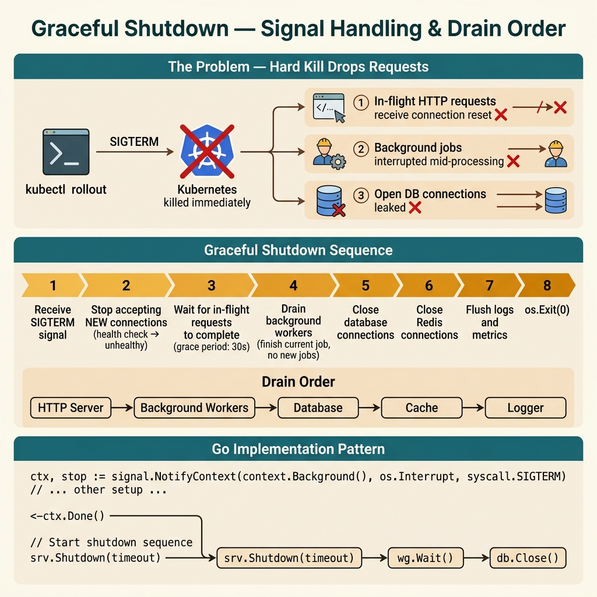

<!-- tags: best-practice, production, idempotency, concurrency, devops, golang -->
# 🛑 Graceful Shutdown — Không Ai Nghĩ Đến Cho Đến Khi Mất Data

> Pod bị kill, 5 request dở dang biến mất — data inconsistent vì Go runtime tắt ngay mà không drain inflight requests

📅 Ngày tạo: 2026-03-22 · 🔄 Cập nhật: 2026-04-04 · ⏱️ 9 phút đọc

| Aspect         | Detail                                                                          |
| -------------- | ------------------------------------------------------------------------------- |
| **Incident**   | K8s deploy → pod cũ bị SIGTERM → 5 payment requests dở dang → data inconsistent |
| **Root cause** | Go process tắt ngay khi nhận signal, không drain connections                    |
| **Fix**        | `signal.Notify` + `server.Shutdown()` + đúng thứ tự cleanup                     |
| **K8s config** | `terminationGracePeriodSeconds`, `preStop` sleep, readiness probe               |

---

## 1. DEFINE

Kubernetes rolling update, pod nhận SIGTERM. Go runtime: `os.Exit(0)` — tắt ngay. 5 HTTP requests đang xử lý giữa chừng: 2 đang write DB, 1 đang gọi payment gateway, 2 đang process queue message. Tất cả bị kill. DB transaction rollback. Payment gateway đã charge nhưng order chưa confirm. Queue message mất — Kafka offset chưa commit. 5 requests, 5 kiểu data inconsistency khác nhau.

Deploy thành công không có nghĩa là service đã rời sân an toàn. `Graceful Shutdown` là bài production mà nhiều đội chỉ thấy giá trị sau lần đầu mất request, mất message ack, hoặc cắt ngang một transaction đang dở dang đúng lúc pod bị kill.

Sự khó chịu của bài này là mọi thứ diễn ra ở đoạn cuối đời của process, nơi ít người đầu tư tư duy nhất. Nhưng chính đoạn cuối đó quyết định người dùng có thấy lỗi, queue có bị duplicate, và dữ liệu có bị bỏ dở hay không.

Core insight: **Graceful shutdown đúng không phải là bắt SIGTERM rồi thoát đẹp; nó là drain đúng inflight work theo thứ tự mà mỗi loại tài nguyên cần được đóng lại an toàn.**

### 📖 Câu chuyện: "Deploy mất data"

Deploy lên K8s. Pod cũ bị kill. **5 request đang xử lý dở** — biến mất. User thấy lỗi lạ. Data inconsistent.

Team kiểm tra: 3 payment transaction không commit, 2 Kafka message đã process nhưng chưa commit offset → bị process lại lần sau.

### 🔍 Chuyện gì xảy ra

```
K8s gửi SIGTERM
    │
    ▼
Go process tắt ngay lập tức   ← VẤN ĐỀ
    │
    ▼
5 goroutines đang xử lý payment:
  → Không kịp commit DB transaction
  → Không kịp rollback
  → Không kịp commit Kafka offset
    │
    ▼
Hậu quả:
  → DB: transaction lơ lửng (lock giữ đến khi timeout)
  → Kafka: message bị re-process lần sau
  → User: thấy error 502 giữa chừng
```

### Thứ tự shutdown ĐÚNG

| Bước | Action                              | Tại sao                           |
| ---- | ----------------------------------- | --------------------------------- |
| 1    | Stop nhận request mới               | Không nhận thêm việc              |
| 2    | Drain inflight requests             | Cho request đang xử lý hoàn thành |
| 3    | Flush message queue / commit offset | Không process lại message         |
| 4    | Close DB connections                | Giải phóng connection pool        |
| 5    | Exit                                | Clean exit                        |

---

Graceful shutdown không phải feature — nó là contract với infrastructure. Diagram dưới trace chính xác signal flow từ SIGTERM → drain → complete → exit.

## 2. VISUAL

Shutdown nghe đơn giản cho đến khi bạn nhìn thấy request, worker, và connection đang sống dở dang lúc tín hiệu kill tới. Sơ đồ dưới đây làm rõ thứ tự cần drain.



### SIGTERM Lifecycle — Trước vs Sau

```
❌ TRƯỚC: No graceful shutdown
┌──────────────────────────────────────────┐
│  K8s: SIGTERM                            │
│      │                                   │
│      ▼                                   │
│  Go: os.Exit(0)                          │
│      │                                   │
│      ├── Request 1: payment processing...│
│      │   → KILLED mid-transaction 💀     │
│      ├── Request 2: DB insert...         │
│      │   → KILLED mid-write 💀          │
│      └── Consumer: message processing... │
│          → offset not committed 💀       │
└──────────────────────────────────────────┘

✅ SAU: Graceful shutdown
┌──────────────────────────────────────────┐
│  K8s: SIGTERM                            │
│      │                                   │
│      ▼                                   │
│  Go: signal.Notify catches SIGTERM       │
│      │                                   │
│      ├── ① server.Shutdown()             │
│      │   → Stop accepting new requests   │
│      │   → Wait for inflight to finish   │
│      │                                   │
│      ├── ② kafkaConsumer.Close()         │
│      │   → Commit final offsets          │
│      │   → Leave consumer group cleanly  │
│      │                                   │
│      ├── ③ db.Close()                    │
│      │   → Wait for active queries       │
│      │   → Release connections           │
│      │                                   │
│      └── ④ os.Exit(0)                   │
│          → Clean exit ✅                 │
└──────────────────────────────────────────┘
```

### K8s preStop — Tại sao cần sleep?

```
K8s gửi SIGTERM   VÀ   xóa Pod khỏi Service endpoints
        │                        │
        ▼                        ▼
  Pod bắt đầu shutdown    Load balancer update
  (ngay lập tức)          (vài giây delay)
                                 │
                     ┌───────────┘
                     │
                     ▼
              Trong 3-5 giây này, LB VẪN gửi
              traffic đến pod đang shutdown
              → request bị reject → 502 error

  Fix: preStop sleep 5s
  → Pod chờ 5s trước khi shutdown
  → LB đã update xong → không còn traffic mới
  → Rồi mới bắt đầu drain + shutdown
```

---

Signal flow đã rõ: SIGTERM → stop accepting → drain in-flight → complete → exit. Bây giờ ta implement: từ basic signal handling đến production-grade shutdown với timeout và health check integration.

## 3. CODE

Khi shutdown sequence đã rõ, code phải thể hiện đúng signal handling, readiness flip, drain wait, và hard timeout cuối cùng. Ta đi từ web server đơn giản sang pipeline có background workers.

### Example 1: Basic — HTTP Server Graceful Shutdown

```go
package main

import (
	"context"
	"log/slog"
	"net/http"
	"os"
	"os/signal"
	"syscall"
	"time"
)

func main() {
	mux := http.NewServeMux()
	mux.HandleFunc("/api/health", healthHandler)
	mux.HandleFunc("/api/payments", paymentHandler)

	server := &http.Server{
		Addr:    ":8080",
		Handler: mux,
	}

	// ① Channel nhận OS signals
	quit := make(chan os.Signal, 1)
	signal.Notify(quit, syscall.SIGTERM, syscall.SIGINT)

	// ② Start server trong goroutine
	go func() {
		slog.Info("server starting", "addr", server.Addr)
		if err := server.ListenAndServe(); err != http.ErrServerClosed {
			slog.Error("server error", "error", err)
			os.Exit(1)
		}
	}()

	// ③ Block cho đến khi nhận signal
	sig := <-quit
	slog.Info("signal received, starting graceful shutdown",
		"signal", sig.String(),
	)

	// ④ Timeout cho shutdown (phải < terminationGracePeriodSeconds)
	ctx, cancel := context.WithTimeout(context.Background(), 30*time.Second)
	defer cancel()

	// ⑤ Graceful shutdown: stop accepting, drain inflight
	if err := server.Shutdown(ctx); err != nil {
		slog.Error("forced shutdown", "error", err)
	}

	slog.Info("server shutdown complete")
}

func healthHandler(w http.ResponseWriter, r *http.Request) {
	w.WriteHeader(http.StatusOK)
	w.Write([]byte(`{"status":"ok"}`))
}

func paymentHandler(w http.ResponseWriter, r *http.Request) {
	// Simulate long processing
	time.Sleep(2 * time.Second)
	w.Write([]byte(`{"status":"processed"}`))
}
```
```typescript
import http from 'http';
import express from 'express';

const app = express();

app.get('/api/health', (_req, res) => {
    res.json({ status: 'ok' });
});

app.get('/api/payments', async (_req, res) => {
    // Simulate long processing
    await new Promise(resolve => setTimeout(resolve, 2000));
    res.json({ status: 'processed' });
});

const server = http.createServer(app);

// ① Listen for OS signals
const shutdown = async (signal: string) => {
    console.log(`Signal received: ${signal}, starting graceful shutdown`);

    // ② Stop accepting new connections, drain in-flight
    server.close((err) => {
        if (err) {
            console.error('Forced shutdown', err);
            process.exit(1);
        }
        console.log('Server shutdown complete');
        process.exit(0);
    });

    // ③ Force exit after 30s timeout
    setTimeout(() => {
        console.error('Shutdown timeout — forcing exit');
        process.exit(1);
    }, 30_000);
};

process.on('SIGTERM', () => shutdown('SIGTERM'));
process.on('SIGINT', () => shutdown('SIGINT'));

server.listen(8080, () => {
    console.log('Server starting on :8080');
});
```
```rust
use std::time::Duration;
use tokio::signal;
use tokio::sync::watch;

#[tokio::main]
async fn main() {
    let (shutdown_tx, shutdown_rx) = watch::channel(false);

    // ① Start HTTP server in a task
    let server_handle = tokio::spawn(run_server(shutdown_rx));

    // ② Wait for OS signal
    match signal::ctrl_c().await {
        Ok(()) => println!("SIGINT received, starting graceful shutdown"),
        Err(e) => eprintln!("Signal error: {e}"),
    }

    // ③ Broadcast shutdown signal
    let _ = shutdown_tx.send(true);

    // ④ Wait for server with timeout
    match tokio::time::timeout(Duration::from_secs(30), server_handle).await {
        Ok(_) => println!("Server shutdown complete"),
        Err(_) => eprintln!("Shutdown timeout — forcing exit"),
    }
}

async fn run_server(mut shutdown_rx: watch::Receiver<bool>) {
    use axum::{routing::get, Router};

    let app = Router::new()
        .route("/api/health", get(health_handler))
        .route("/api/payments", get(payment_handler));

    let listener = tokio::net::TcpListener::bind("0.0.0.0:8080").await.unwrap();
    println!("Server starting on :8080");

    axum::serve(listener, app)
        .with_graceful_shutdown(async move {
            shutdown_rx.changed().await.ok();
        })
        .await
        .unwrap();
}

async fn health_handler() -> &'static str {
    r#"{"status":"ok"}"#
}

async fn payment_handler() -> &'static str {
    tokio::time::sleep(Duration::from_secs(2)).await;
    r#"{"status":"processed"}"#
}
```
```cpp
#include <atomic>
#include <csignal>
#include <iostream>
#include <thread>
#include <chrono>

std::atomic<bool> g_shutdown{false};

void signal_handler(int signum) {
    std::cout << "Signal " << signum << " received, starting graceful shutdown\n";
    g_shutdown.store(true);
}

class HttpServer {
public:
    void start(int port) {
        running_ = true;
        std::cout << "Server starting on :" << port << "\n";
        // Accept loop — simplified; use Boost.Asio or cpp-httplib in real code
        while (running_ && !g_shutdown.load()) {
            std::this_thread::sleep_for(std::chrono::milliseconds(100));
        }
    }

    // ① Stop accepting new requests, drain in-flight
    void shutdown() {
        running_ = false;
        // Wait for in-flight requests (use a real WaitGroup / semaphore)
        std::cout << "Server shutdown complete\n";
    }

private:
    std::atomic<bool> running_{false};
};

int main() {
    // ② Register signal handlers
    std::signal(SIGTERM, signal_handler);
    std::signal(SIGINT, signal_handler);

    HttpServer server;

    // ③ Run server in background thread
    std::thread server_thread([&server]() {
        server.start(8080);
    });

    // ④ Block until signal
    while (!g_shutdown.load()) {
        std::this_thread::sleep_for(std::chrono::milliseconds(100));
    }

    // ⑤ Graceful shutdown with 30s timeout
    server.shutdown();

    if (server_thread.joinable()) {
        server_thread.join();
    }
    return 0;
}
```
```python
import signal
import threading
import time
from http.server import BaseHTTPRequestHandler, ThreadingHTTPServer

shutdown_event = threading.Event()

class Handler(BaseHTTPRequestHandler):
    def do_GET(self) -> None:
        if self.path == "/api/health":
            self.send_response(200)
            self.end_headers()
            self.wfile.write(b'{"status":"ok"}')
            return

        if self.path == "/api/payments":
            time.sleep(2)
            self.send_response(200)
            self.end_headers()
            self.wfile.write(b'{"status":"processed"}')
            return

        self.send_response(404)
        self.end_headers()

def on_signal(signum, _frame) -> None:
    print(f"Signal received: {signum}, starting graceful shutdown")
    shutdown_event.set()

server = ThreadingHTTPServer(("0.0.0.0", 8080), Handler)

signal.signal(signal.SIGTERM, on_signal)
signal.signal(signal.SIGINT, on_signal)

thread = threading.Thread(target=server.serve_forever, daemon=True)
thread.start()
print("Server starting on :8080")

shutdown_event.wait()
server.shutdown()  # Stop accepting + drain request handlers
server.server_close()
thread.join(timeout=30)
print("Server shutdown complete")
```

---

### Example 2: Intermediate — Full Stack Shutdown (HTTP + Kafka + DB)

```go
package main

import (
	"context"
	"database/sql"
	"log/slog"
	"net/http"
	"os"
	"os/signal"
	"syscall"
	"time"

	"github.com/segmentio/kafka-go"
)

type App struct {
	server   *http.Server
	consumer *kafka.Reader
	db       *sql.DB
}

func (app *App) Run() {
	quit := make(chan os.Signal, 1)
	signal.Notify(quit, syscall.SIGTERM, syscall.SIGINT)

	// Start HTTP server
	go func() {
		if err := app.server.ListenAndServe(); err != http.ErrServerClosed {
			slog.Error("server error", "error", err)
		}
	}()

	// Start Kafka consumer
	consumerCtx, consumerCancel := context.WithCancel(context.Background())
	go app.consumeMessages(consumerCtx)

	// Wait for signal
	sig := <-quit
	slog.Info("shutdown initiated", "signal", sig)

	ctx, cancel := context.WithTimeout(context.Background(), 30*time.Second)
	defer cancel()

	// ─── SHUTDOWN ORDER MATTERS ───

	// ① HTTP: stop accepting, drain inflight (max 30s)
	slog.Info("step 1: shutting down HTTP server")
	if err := app.server.Shutdown(ctx); err != nil {
		slog.Error("http shutdown error", "error", err)
	}

	// ② Kafka: stop consuming, commit final offsets
	slog.Info("step 2: closing Kafka consumer")
	consumerCancel()
	if err := app.consumer.Close(); err != nil {
		slog.Error("kafka close error", "error", err)
	}

	// ③ DB: wait for active queries, close connections
	slog.Info("step 3: closing database connections")
	if err := app.db.Close(); err != nil {
		slog.Error("db close error", "error", err)
	}

	slog.Info("shutdown complete ✅")
}

func (app *App) consumeMessages(ctx context.Context) {
	for {
		select {
		case <-ctx.Done():
			slog.Info("consumer stopping")
			return
		default:
		}

		msg, err := app.consumer.FetchMessage(ctx)
		if err != nil {
			if ctx.Err() != nil {
				return // Context cancelled — clean exit
			}
			continue
		}

		processMessage(msg)
		app.consumer.CommitMessages(ctx, msg)
	}
}

func processMessage(msg kafka.Message) {
	time.Sleep(100 * time.Millisecond)
}
```
```typescript
import http from 'http';
import express from 'express';
import { Kafka, Consumer } from 'kafkajs';
import { Pool } from 'pg';

interface App {
    server: http.Server;
    consumer: Consumer;
    db: Pool;
}

async function run(app: App) {
    let isShuttingDown = false;

    const shutdown = async (signal: string) => {
        if (isShuttingDown) return;
        isShuttingDown = true;
        console.log(`Shutdown initiated: ${signal}`);

        const ctx = new AbortController();
        setTimeout(() => ctx.abort(), 30_000);

        // ① HTTP: stop accepting, drain in-flight
        console.log('Step 1: shutting down HTTP server');
        await new Promise<void>((resolve, reject) =>
            app.server.close(err => (err ? reject(err) : resolve()))
        );

        // ② Kafka: stop consuming, commit final offsets
        console.log('Step 2: closing Kafka consumer');
        await app.consumer.stop();
        await app.consumer.disconnect();

        // ③ DB: wait for active queries, close connections
        console.log('Step 3: closing database connections');
        await app.db.end();

        console.log('Shutdown complete ✅');
        process.exit(0);
    };

    process.on('SIGTERM', () => shutdown('SIGTERM'));
    process.on('SIGINT', () => shutdown('SIGINT'));

    app.server.listen(8080, () => console.log('Server listening on :8080'));
    await app.consumer.run({
        eachMessage: async ({ message }) => {
            await processMessage(message);
        },
    });
}

async function processMessage(_message: unknown) {
    await new Promise(resolve => setTimeout(resolve, 100));
}
```
```rust
use std::time::Duration;
use tokio::signal;
use tokio::sync::watch;

struct App {
    // server, kafka_consumer, db_pool fields omitted for brevity
}

impl App {
    async fn run(&self) {
        let (shutdown_tx, mut shutdown_rx) = watch::channel(false);

        // Start HTTP server
        let http_rx = shutdown_tx.subscribe();
        let http_handle = tokio::spawn(run_http_server(http_rx));

        // Start Kafka consumer
        let kafka_rx = shutdown_tx.subscribe();
        let kafka_handle = tokio::spawn(run_kafka_consumer(kafka_rx));

        // Wait for OS signal
        tokio::select! {
            _ = signal::ctrl_c() => println!("SIGINT received"),
        }
        println!("Shutdown initiated");

        // Broadcast shutdown
        let _ = shutdown_tx.send(true);

        // ─── SHUTDOWN ORDER MATTERS ───
        let timeout = Duration::from_secs(30);

        // ① HTTP: drain in-flight
        println!("Step 1: shutting down HTTP server");
        let _ = tokio::time::timeout(timeout, http_handle).await;

        // ② Kafka: commit final offsets
        println!("Step 2: closing Kafka consumer");
        let _ = tokio::time::timeout(timeout, kafka_handle).await;

        // ③ DB: close connection pool
        println!("Step 3: closing database connections");
        // db_pool.close().await;

        println!("Shutdown complete ✅");
    }
}

async fn run_http_server(mut rx: watch::Receiver<bool>) {
    // axum server with graceful shutdown (see Example 1)
    rx.changed().await.ok();
}

async fn run_kafka_consumer(mut rx: watch::Receiver<bool>) {
    loop {
        tokio::select! {
            _ = rx.changed() => {
                println!("Consumer stopping");
                return;
            }
            _ = consume_message() => {}
        }
    }
}

async fn consume_message() {
    tokio::time::sleep(Duration::from_millis(100)).await;
}
```
```cpp
#include <atomic>
#include <csignal>
#include <functional>
#include <iostream>
#include <thread>
#include <vector>
#include <chrono>

std::atomic<bool> g_shutdown{false};

void signal_handler(int signum) {
    std::cout << "Signal " << signum << " received — shutdown initiated\n";
    g_shutdown.store(true);
}

class App {
public:
    void run() {
        std::signal(SIGTERM, signal_handler);
        std::signal(SIGINT, signal_handler);

        // Start HTTP server thread
        std::thread http_thread(&App::run_http_server, this);
        // Start Kafka consumer thread
        std::thread kafka_thread(&App::run_kafka_consumer, this);

        // Block until signal
        while (!g_shutdown.load()) {
            std::this_thread::sleep_for(std::chrono::milliseconds(100));
        }

        // ─── SHUTDOWN ORDER MATTERS ───

        // ① HTTP: stop accepting, drain in-flight
        std::cout << "Step 1: shutting down HTTP server\n";
        http_running_ = false;
        if (http_thread.joinable()) http_thread.join();

        // ② Kafka: stop consumer, commit final offsets
        std::cout << "Step 2: closing Kafka consumer\n";
        kafka_running_ = false;
        if (kafka_thread.joinable()) kafka_thread.join();

        // ③ DB: close connection pool
        std::cout << "Step 3: closing database connections\n";
        // db_pool_.close();

        std::cout << "Shutdown complete ✅\n";
    }

private:
    std::atomic<bool> http_running_{false};
    std::atomic<bool> kafka_running_{false};

    void run_http_server() {
        http_running_ = true;
        while (http_running_ && !g_shutdown.load()) {
            std::this_thread::sleep_for(std::chrono::milliseconds(100));
        }
    }

    void run_kafka_consumer() {
        kafka_running_ = true;
        while (kafka_running_ && !g_shutdown.load()) {
            process_message();
        }
    }

    void process_message() {
        std::this_thread::sleep_for(std::chrono::milliseconds(100));
    }
};
```
```python
import signal
import threading
import time
from dataclasses import dataclass

@dataclass
class App:
    stop_event: threading.Event

    def run_http_server(self) -> None:
        while not self.stop_event.is_set():
            time.sleep(0.1)

    def run_kafka_consumer(self) -> None:
        while not self.stop_event.is_set():
            self.process_message()

    def process_message(self) -> None:
        time.sleep(0.1)

    def shutdown(self) -> None:
        print("Step 1: shutting down HTTP server")
        print("Step 2: closing Kafka consumer")
        print("Step 3: closing database connections")
        self.stop_event.set()

stop_event = threading.Event()
app = App(stop_event=stop_event)

def on_signal(signum, _frame) -> None:
    print(f"Shutdown initiated: {signum}")
    app.shutdown()

signal.signal(signal.SIGTERM, on_signal)
signal.signal(signal.SIGINT, on_signal)

http_thread = threading.Thread(target=app.run_http_server)
kafka_thread = threading.Thread(target=app.run_kafka_consumer)

http_thread.start()
kafka_thread.start()

stop_event.wait(timeout=30)
http_thread.join(timeout=30)
kafka_thread.join(timeout=30)
print("Shutdown complete ✅")
```

---

### Example 3: Advanced — K8s Deployment Config

```yaml
# deployment.yaml
apiVersion: apps/v1
kind: Deployment
metadata:
    name: payment-api
spec:
    replicas: 3
    strategy:
        type: RollingUpdate
        rollingUpdate:
            maxSurge: 1 # Tạo pod mới trước khi kill pod cũ
            maxUnavailable: 0 # Không bao giờ giảm dưới desired replicas
    template:
        spec:
            # ⚠️ Phải >= server shutdown timeout + preStop sleep
            terminationGracePeriodSeconds: 60

            containers:
                - name: api
                  image: payment-api:latest
                  ports:
                      - containerPort: 8080

                  # preStop: chờ LB update trước khi shutdown
                  lifecycle:
                      preStop:
                          exec:
                              command: ['/bin/sh', '-c', 'sleep 5']

                  # Readiness probe: K8s stop routing khi pod không ready
                  readinessProbe:
                      httpGet:
                          path: /api/health
                          port: 8080
                      initialDelaySeconds: 5
                      periodSeconds: 5

                  # Liveness probe: restart nếu pod treo
                  livenessProbe:
                      httpGet:
                          path: /api/health
                          port: 8080
                      initialDelaySeconds: 15
                      periodSeconds: 10

                  resources:
                      requests:
                          cpu: '100m'
                          memory: '128Mi'
                      limits:
                          cpu: '500m'
                          memory: '512Mi'
```

---

### Example 4: Expert — Shutdown-aware Handler

```go
package middleware

import (
	"net/http"
	"sync"
	"sync/atomic"
)

// ShutdownAware — track inflight requests
type ShutdownAware struct {
	isShuttingDown atomic.Bool
	wg             sync.WaitGroup
}

func NewShutdownAware() *ShutdownAware {
	return &ShutdownAware{}
}

// Middleware — reject mới khi đang shutdown, track inflight
func (s *ShutdownAware) Middleware(next http.Handler) http.Handler {
	return http.HandlerFunc(func(w http.ResponseWriter, r *http.Request) {
		if s.isShuttingDown.Load() {
			// Đang shutdown → reject request mới
			w.Header().Set("Connection", "close")
			w.Header().Set("Retry-After", "5")
			w.WriteHeader(http.StatusServiceUnavailable)
			w.Write([]byte(`{"error":"server shutting down, retry shortly"}`))
			return
		}

		s.wg.Add(1)
		defer s.wg.Done()

		next.ServeHTTP(w, r)
	})
}

// Drain — đánh dấu shutdown + chờ inflight xong
func (s *ShutdownAware) Drain() {
	s.isShuttingDown.Store(true)
	s.wg.Wait() // Chờ tất cả inflight requests hoàn thành
}
```
```typescript
import { Request, Response, NextFunction } from 'express';

// ShutdownAware — track in-flight requests
class ShutdownAware {
    private isShuttingDown = false;
    private inflightCount = 0;
    private drainResolve?: () => void;

    // Middleware — reject new requests when shutting down, track in-flight
    middleware() {
        return (req: Request, res: Response, next: NextFunction) => {
            if (this.isShuttingDown) {
                res.setHeader('Connection', 'close');
                res.setHeader('Retry-After', '5');
                return res.status(503).json({
                    error: 'server shutting down, retry shortly',
                });
            }

            this.inflightCount++;
            res.on('finish', () => {
                this.inflightCount--;
                if (this.isShuttingDown && this.inflightCount === 0) {
                    this.drainResolve?.();
                }
            });

            next();
        };
    }

    // Drain — mark shutdown + wait for all in-flight to complete
    async drain(): Promise<void> {
        this.isShuttingDown = true;
        if (this.inflightCount === 0) return;

        return new Promise(resolve => {
            this.drainResolve = resolve;
        });
    }
}

export const shutdownAware = new ShutdownAware();
```
```rust
use std::sync::atomic::{AtomicBool, AtomicUsize, Ordering};
use std::sync::Arc;
use tokio::sync::Notify;
use axum::{extract::State, middleware::Next, response::{IntoResponse, Response}, http::{Request, StatusCode}};

#[derive(Clone)]
pub struct ShutdownAware(Arc<ShutdownAwareInner>);

struct ShutdownAwareInner {
    is_shutting_down: AtomicBool,
    inflight_count: AtomicUsize,
    drain_notify: Notify,
}

impl ShutdownAware {
    pub fn new() -> Self {
        ShutdownAware(Arc::new(ShutdownAwareInner {
            is_shutting_down: AtomicBool::new(false),
            inflight_count: AtomicUsize::new(0),
            drain_notify: Notify::new(),
        }))
    }

    // Middleware — reject new requests when shutting down, track in-flight
    pub async fn middleware<B>(
        State(state): State<Self>,
        req: Request<B>,
        next: Next<B>,
    ) -> Response {
        if state.0.is_shutting_down.load(Ordering::Acquire) {
            return (
                StatusCode::SERVICE_UNAVAILABLE,
                [("Retry-After", "5"), ("Connection", "close")],
                r#"{"error":"server shutting down, retry shortly"}"#,
            ).into_response();
        }

        state.0.inflight_count.fetch_add(1, Ordering::AcqRel);
        let response = next.run(req).await;
        let prev = state.0.inflight_count.fetch_sub(1, Ordering::AcqRel);
        if prev == 1 && state.0.is_shutting_down.load(Ordering::Acquire) {
            state.0.drain_notify.notify_one();
        }
        response
    }

    // Drain — mark shutdown + wait for all in-flight to complete
    pub async fn drain(&self) {
        self.0.is_shutting_down.store(true, Ordering::Release);
        while self.0.inflight_count.load(Ordering::Acquire) > 0 {
            self.0.drain_notify.notified().await;
        }
    }
}
```
```cpp
#include <atomic>
#include <condition_variable>
#include <mutex>
#include <string>

// ShutdownAware — track in-flight requests
class ShutdownAware {
public:
    // Returns true if request should be processed, false if rejecting
    bool try_begin_request() {
        if (is_shutting_down_.load(std::memory_order_acquire)) {
            return false; // Reject — server shutting down
        }
        inflight_count_.fetch_add(1, std::memory_order_acq_rel);
        return true;
    }

    void end_request() {
        auto prev = inflight_count_.fetch_sub(1, std::memory_order_acq_rel);
        if (prev == 1 && is_shutting_down_.load(std::memory_order_acquire)) {
            cv_.notify_all();
        }
    }

    // Drain — mark shutdown + wait for all in-flight to complete
    void drain() {
        is_shutting_down_.store(true, std::memory_order_release);
        std::unique_lock<std::mutex> lock(mu_);
        cv_.wait(lock, [this] {
            return inflight_count_.load(std::memory_order_acquire) == 0;
        });
    }

    std::string shutdown_response() const {
        return R"({"error":"server shutting down, retry shortly"})";
    }

private:
    std::atomic<bool> is_shutting_down_{false};
    std::atomic<int> inflight_count_{0};
    std::mutex mu_;
    std::condition_variable cv_;
};
```
```python
import threading
from typing import Callable

class ShutdownAware:
    def __init__(self) -> None:
        self._is_shutting_down = False
        self._inflight_count = 0
        self._lock = threading.Lock()
        self._drained = threading.Event()
        self._drained.set()

    def middleware(self, next_handler: Callable[[], None]) -> Callable[[], tuple[int, dict, dict]]:
        def handler():
            with self._lock:
                if self._is_shutting_down:
                    return 503, {
                        "Connection": "close",
                        "Retry-After": "5",
                    }, {"error": "server shutting down, retry shortly"}

                self._inflight_count += 1
                self._drained.clear()

            try:
                next_handler()
                return 200, {}, {"status": "ok"}
            finally:
                with self._lock:
                    self._inflight_count -= 1
                    if self._is_shutting_down and self._inflight_count == 0:
                        self._drained.set()

        return handler

    def drain(self) -> None:
        with self._lock:
            self._is_shutting_down = True
            if self._inflight_count == 0:
                self._drained.set()
        self._drained.wait()
```

**Bài học**: _"SIGTERM là thông báo lịch sự 'hãy dọn dẹp rồi tắt'. Không handle = K8s brutal kill sau `terminationGracePeriodSeconds`. Data loss là hệ quả tất yếu."_

---

## 4. PITFALLS

Những deploy mất data thường không đến từ rollout tool, mà từ việc app không có contract shutdown rõ ràng với request và worker đang chạy.

| # | Severity | Lỗi | Hậu quả | Fix |
| --- | --- | --- | --- | --- |
| 1 | 🟡 Common | Không handle SIGTERM | Go process tắt ngay → inflight requests mất | `signal.Notify` + `server.Shutdown()` |
| 2 | 🟡 Common | Shutdown timeout > terminationGracePeriodSeconds | K8s `SIGKILL` trước khi app shutdown xong | App timeout < K8s grace period |
| 3 | 🟡 Common | Không có preStop sleep | LB vẫn gửi traffic đến pod đang shutdown → 502 | `preStop: sleep 5` |
| 4 | 🟡 Common | Close DB trước drain HTTP | Active queries bị kill giữa chừng | Shutdown order: HTTP → Kafka → DB |
| 5 | 🟡 Common | Consumer không commit offset trước exit | Message bị re-process lần sau | `consumer.Close()` commit final offsets |
| 6 | 🟡 Common | Health check không phản ánh shutdown | K8s vẫn route traffic đến pod đang drain | Readiness probe fail khi shutting down |

---

## 5. REF

| Resource                     | Link                                                                                                                          |
| ---------------------------- | ----------------------------------------------------------------------------------------------------------------------------- |
| Go: net/http Server.Shutdown | [pkg.go.dev/net/http#Server.Shutdown](https://pkg.go.dev/net/http#Server.Shutdown)                                            |
| K8s: Pod Termination         | [kubernetes.io/docs/concepts/workloads/pods/pod-lifecycle](https://kubernetes.io/docs/concepts/workloads/pods/pod-lifecycle/) |
| Learnk8s: Graceful Shutdown  | [learnk8s.io/graceful-shutdown](https://learnk8s.io/graceful-shutdown)                                                        |
| Go signal handling           | [pkg.go.dev/os/signal](https://pkg.go.dev/os/signal)                                                                          |

---

## 6. RECOMMEND

Khi graceful shutdown đã vững, bước tiếp theo là nối nó sang queue consumers, goroutine hygiene, Kubernetes lifecycle, và circuit breaker/fallback để hoàn thiện operational lane.

| Mở rộng                               | Khi nào         | Lý do                                             |
| ------------------------------------- | --------------- | ------------------------------------------------- |
| **PodDisruptionBudget**               | HA deployment   | Đảm bảo minimum pods available khi rolling update |
| **Connection draining** (Envoy/Istio) | Service mesh    | Infrastructure-level graceful shutdown            |
| **Health check toggle**               | Complex apps    | Toggle readiness off trước khi drain              |
| **Shutdown hooks registry**           | Multi-component | Register cleanup functions, execute in order      |

---

## 7. QUICK REF

| # | Pattern | Code / Config |
|---|---------|---------------|
| 1 | **Shutdown thứ tự** | Stop ingress → drain HTTP → flush queue → close DB connections → exit |
| 2 | **Catch SIGTERM** | `signal.NotifyContext(context.Background(), syscall.SIGTERM, syscall.SIGINT)` |
| 3 | **HTTP drain** | `server.Shutdown(ctx)` — chờ tất cả in-flight requests hoàn thành |
| 4 | **K8s preStop** | `lifecycle.preStop.exec.command: ["sleep", "5"]` — chờ iptables cập nhật |
| 5 | **terminationGracePeriodSeconds** | `30s` minimum cho payment services — đủ cho longest request |
| 6 | **WaitGroup cho workers** | `wg.Add(1); go func() { defer wg.Done() }()` — `wg.Wait()` trước khi exit |
| 7 | **Readiness probe** | Tắt readiness trước khi shutdown → LB ngừng route traffic |
| 8 | **Test** | `kill -SIGTERM <pid>` khi có in-flight request — verify graceful completion |

---

---

**Callback**: Quay lại 5 requests bị kill giữa chừng lúc đầu. Bây giờ bạn biết: `signal.NotifyContext` + `server.Shutdown(ctx)` + drain timeout. Không có graceful shutdown = mỗi deploy là một mini-incident. Có graceful shutdown = zero-downtime deployment thực sự.

← Quay về [Best Practices](./README.md) · ← Trước: [Missing Index](./09-missing-composite-index.md) · → Tiếp: [Memory Leak](./11-memory-leak-silent.md)
## 8. INTERVIEW ANGLE

**System design questions liên quan:**
- *"How do you deploy without any downtime or data loss?"*
- *"What is graceful shutdown and why does it matter?"*
- *"How does Kubernetes handle pod termination?"*

**Điểm interviewer muốn nghe:**

| Chủ đề | Talking point |
|--------|---------------|
| **Shutdown sequence** | Stop ingress → drain HTTP → flush queue → close DB → exit (thứ tự quan trọng) |
| **K8s SIGTERM flow** | SIGTERM → preStop hook → terminationGracePeriodSeconds → SIGKILL |
| **iptables delay** | LB cập nhật iptables không tức thì → preStop sleep 5s để tránh new requests |
| **In-flight protection** | `server.Shutdown(ctx)` drains HTTP; WaitGroup cho async workers |
| **Kafka commit** | Process message → process logic → commit offset (thứ tự này, không ngược lại) |
| **Numbers** | Incident: 3 payment transactions uncommitted + 2 Kafka messages re-processed sau deploy |

**Follow-up questions thường gặp:**
- *"What if shutdown takes too long?"* → `terminationGracePeriodSeconds` là hard deadline — SIGKILL sau đó
- *"How do you handle long-running requests during shutdown?"* → Context deadline, return 503 sau drain window
- *"What's the difference between liveness and readiness probes?"* → Liveness: restart if dead; Readiness: route traffic or not

---

## 10. DETECTION CHECKLIST

| # | Dấu hiệu | Cách kiểm tra | Ý nghĩa |
|---|----------|---------------|---------|
| 1 | **Data inconsistent sau deploy** | So sánh DB state trước/sau rolling update | Requests bị cắt ngang giữa chừng |
| 2 | **Kafka messages processed twice** | Consumer offset không commit trước khi pod die | Process rồi chết trước khi commit |
| 3 | **502 error spike trong deploy window** | `http_requests_total{status="502"}` tăng mỗi lần deploy | LB gửi request tới pod đang shutting down |
| 4 | **DB transactions in limbo** | `pg_stat_activity WHERE state = 'idle in transaction'` | Transactions không commit/rollback |
| 5 | **K8s pod exit code 143** | `kubectl describe pod` — `Exit Code: 143` | SIGTERM không được handle — process tắt ngay |

---

