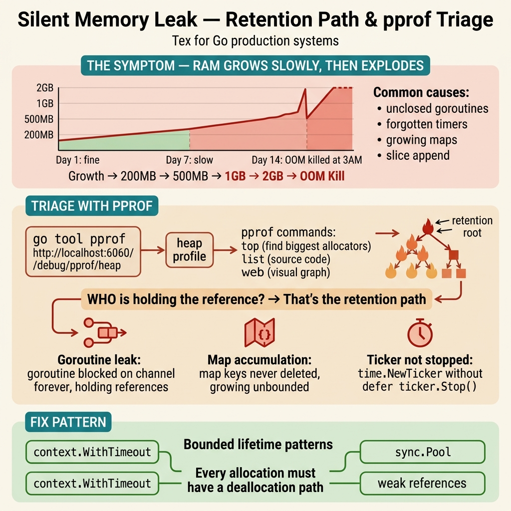

<!-- tags: best-practice, production, debugging, performance -->
# 🧠 Memory Leak Âm Thầm — 3 Tuần Mới Phát Hiện

> Service Go từ 200MB lên 4GB sau 3 tuần vì map chỉ grow không shrink, và cách dùng TTL cache + pprof để tìm và fix

📅 Ngày tạo: 2026-03-22 · 🔄 Cập nhật: 2026-04-04 · ⏱️ 11 phút đọc

| Aspect           | Detail                                                                  |
| ---------------- | ----------------------------------------------------------------------- |
| **Incident**     | Service Go: 200MB → 4GB sau 3 tuần, team restart pod hàng đêm           |
| **Root cause**   | Global `map[string]*Session` chỉ thêm không xóa, map Go không tự shrink |
| **Fix**          | TTL cache (`go-cache` hoặc tự implement) + pprof heap profiling         |
| **Go relevance** | `net/http/pprof`, `runtime`, `go-cache`, map internals                  |

---

## 1. DEFINE

Service Go deploy lên production. Ngày 1: 200MB RSS. Ngày 7: 800MB. Ngày 14: 2.1GB. Ngày 21: 4.2GB — OOM kill, pod restart, mất in-flight requests. Grafana thấy memory tăng tuyến tính nhưng không ai alert vì "Go có GC mà". Root cause: `map[string]UserSession` — map trong Go chỉ grow, không bao giờ shrink memory. 3 tuần, 2 triệu entries, GC không giúp được.

Memory leak nguy hiểm nhất không phải loại làm process nổ tung ngay. Nó là loại tăng từ từ: 200MB thành 4GB sau vài tuần, không panic, không obvious error, chỉ có latency và cost lặng lẽ xấu đi. `Memory Leak Silent` là bài về những thứ “không bao giờ tự nhỏ lại” trong một service sống đủ lâu.

Go làm nhiều người chủ quan vì có GC. Nhưng GC không xóa được những thứ bạn vẫn còn giữ reference, dù vô tình. Map chỉ lớn lên, timer không được stop, goroutine chờ mãi, slice giữ backing array quá to: tất cả đều là leak theo nghĩa production quan tâm.

Core insight: **Best practice với memory leak bắt đầu ở việc phân biệt allocation nhiều với retention lâu, rồi lần theo object nào vẫn còn bị giữ sau khi business value của nó đã hết.**

### 📖 Câu chuyện: "Restart pod hàng đêm để fix"

Service Go dùng ~200MB RAM lúc mới deploy. Sau 3 tuần — **4GB**. OOM killer restart pod. Team set cron restart pod hàng đêm để "fix". Không ai biết tại sao.

### 🔍 Tìm thủ phạm

```go
// Trông vô hại — đã chạy production 6 tháng
var globalCache = make(map[string]*UserSession)
var mu sync.RWMutex

func getSession(userID string) *UserSession {
    mu.RLock()
    if session, ok := globalCache[userID]; ok {
        mu.RUnlock()
        return session
    }
    mu.RUnlock()

    session := loadFromDB(userID)

    mu.Lock()
    globalCache[userID] = session  // ← chỉ thêm, KHÔNG BAO GIỜ XÓA
    mu.Unlock()

    return session
}
```
```typescript
// Trông vô hại — đã chạy production 6 tháng
const globalCache = new Map<string, UserSession>();

interface UserSession {
    userId: string;
    token: string;
    data: Record<string, unknown>;
}

function getSession(userId: string): UserSession {
    const cached = globalCache.get(userId);
    if (cached) return cached;

    const session = loadFromDB(userId);
    globalCache.set(userId, session); // ← chỉ thêm, KHÔNG BAO GIỜ XÓA

    return session;
}

function loadFromDB(userId: string): UserSession {
    return { userId, token: 'token', data: {} };
}

// In Node.js, heap grows monotonically — check with:
// process.memoryUsage().heapUsed
// Or use: node --inspect + Chrome DevTools heap snapshot
```
```rust
use std::collections::HashMap;
use std::sync::{Arc, RwLock};

#[derive(Clone)]
struct UserSession {
    user_id: String,
    token: String,
}

// Trông vô hại — nhưng sẽ grow mãi
static GLOBAL_CACHE: std::sync::LazyLock<Arc<RwLock<HashMap<String, UserSession>>>> =
    std::sync::LazyLock::new(|| Arc::new(RwLock::new(HashMap::new())));

fn get_session(user_id: &str) -> UserSession {
    {
        let cache = GLOBAL_CACHE.read().unwrap();
        if let Some(session) = cache.get(user_id) {
            return session.clone();
        }
    }

    let session = load_from_db(user_id);
    {
        let mut cache = GLOBAL_CACHE.write().unwrap();
        cache.insert(user_id.to_string(), session.clone()); // ← chỉ thêm, KHÔNG BAO GIỜ XÓA
    }
    session
}

fn load_from_db(user_id: &str) -> UserSession {
    UserSession { user_id: user_id.to_string(), token: "token".to_string() }
}
// Rust: HashMap cũng không tự shrink — dùng shrink_to_fit() hoặc rebuild định kỳ
// Hoặc dùng TTL cache: https://crates.io/crates/moka
```
```cpp
#include <mutex>
#include <string>
#include <unordered_map>

struct UserSession {
    std::string user_id;
    std::string token;
};

// Trông vô hại — nhưng sẽ grow mãi
std::unordered_map<std::string, UserSession> global_cache;
std::shared_mutex cache_mu;

UserSession load_from_db(const std::string& user_id) {
    return UserSession{user_id, "token"};
}

UserSession get_session(const std::string& user_id) {
    {
        std::shared_lock lock(cache_mu);
        auto it = global_cache.find(user_id);
        if (it != global_cache.end()) return it->second;
    }

    auto session = load_from_db(user_id);
    {
        std::unique_lock lock(cache_mu);
        global_cache[user_id] = session; // ← chỉ thêm, KHÔNG BAO GIỜ XÓA
    }
    return session;
}
// C++: unordered_map cũng không tự shrink
// Fix: dùng TTL eviction hoặc max_size với LRU policy
// Detect: valgrind --leak-check=full + AddressSanitizer
```
```python
# Trông vô hại — nhưng dict chỉ lớn dần nếu không evict
from threading import Lock

global_cache: dict[str, dict[str, object]] = {}
cache_mu = Lock()

def load_from_db(user_id: str) -> dict[str, object]:
    return {"user_id": user_id, "token": "token"}

def get_session(user_id: str) -> dict[str, object]:
    with cache_mu:
        cached = global_cache.get(user_id)
        if cached:
            return cached

    session = load_from_db(user_id)

    with cache_mu:
        global_cache[user_id] = session  # <- only add, NEVER delete

    return session

# Python dict also won't magically evict old keys.
# Fix: TTL/LRU cache or periodic rebuild.
```

### Tại sao map trong Go chỉ grow?

| Fact                  | Detail                                           |
| --------------------- | ------------------------------------------------ |
| Map bucket allocation | Go allocate buckets theo power of 2, chỉ grow    |
| Delete key            | Đánh dấu empty, KHÔNG giải phóng bucket          |
| Shrink                | Map Go **KHÔNG BAO GIỜ** tự shrink               |
| GC                    | GC collect value, nhưng map structure giữ nguyên |
| Workaround            | Tạo map mới, copy keys cần thiết, bỏ map cũ      |

```
Tháng 1:  10,000 sessions  → map: 200 buckets    → 50MB
Tháng 2:  50,000 sessions  → map: 1,000 buckets  → 200MB
Tháng 3: 200,000 sessions  → map: 4,000 buckets  → 800MB
3 tuần:  500,000 sessions  → map: 16,000 buckets → 4GB 💀
(DAU 50K × sessions/user × 3 weeks cumulative)
```

---

Memory leak trong Go nghe mâu thuẫn — Go có GC. Nhưng GC chỉ collect unreachable objects. Map entries vẫn reachable, map chỉ grow. Diagram dưới trace memory footprint theo thời gian.

## 2. VISUAL

Leak chậm rất khó cảm nếu không nhìn được object nào còn sống và vì sao GC không dọn nó đi. Trace dưới đây làm sáng chính retention path đó.



### Memory Growth — Map chỉ grow

```
Memory (MB)
  4000 ┤                                              ╱  ← OOM Kill
       │                                           ╱
  3000 ┤                                        ╱
       │                                     ╱
  2000 ┤                                  ╱
       │                              ╱
  1000 ┤                          ╱
       │                     ╱
   500 ┤               ╱
       │          ╱
   200 ┤─────╱                           ← deploy
       └──────────────────────────────────────────▶ Days
        0    3    6    9    12   15   18   21

Without TTL:  monotonically increasing ↗️
With TTL:     flat ~200MB after warm-up ─→
```

### pprof Workflow — Tìm leak

```
① Enable pprof endpoint:
    import _ "net/http/pprof"
    go http.ListenAndServe("localhost:6060", nil)

② Chụp heap snapshot:
    go tool pprof http://localhost:6060/debug/pprof/heap

③ Sau 10 phút, chụp snapshot thứ 2

④ So sánh 2 snapshots:
    go tool pprof -diff_base heap1.pb.gz heap2.pb.gz

⑤ Trong pprof shell:
    (pprof) top10              → top allocators
    (pprof) list getSession    → xem dòng nào allocate
    (pprof) web                → visual graph

⑥ Output:
    Showing top 10 nodes
    flat   flat%   cum    cum%
    850MB  42.5%   850MB  42.5%  main.getSession  ← THỦ PHẠM
    200MB  10.0%   200MB  10.0%  database/sql.(*DB).query
    ...
```

---

Growth curve đã rõ: linear, predictable, inevitable. Bây giờ ta implement: từ pprof profiling để tìm leak đến TTL cache pattern để fix.

## 3. CODE

Khi retention path đã rõ, code fix phải cắt đúng reference và đặt đúng lifecycle cho cache, timer, goroutine, hay buffer. Ta đi từ symptom sang pattern leak cụ thể.

### Example 1: Basic — TTL Cache thay Map

```go
package cache

import (
	"time"

	gocache "github.com/patrickmn/go-cache"
)

// ✅ go-cache: auto-expire + auto-cleanup
var sessionCache = gocache.New(
	15*time.Minute, // TTL cho mỗi entry
	30*time.Minute, // Interval cleanup goroutine
)

type UserSession struct {
	UserID string
	Token  string
	Data   map[string]interface{}
}

func GetSession(userID string) *UserSession {
	// Check cache
	if v, found := sessionCache.Get(userID); found {
		return v.(*UserSession)
	}

	// Cache miss → load from DB
	session := loadFromDB(userID)

	// ✅ TTL 15 phút — tự expire, không tích lũy mãi
	sessionCache.Set(userID, session, gocache.DefaultExpiration)

	return session
}

func loadFromDB(userID string) *UserSession {
	return &UserSession{UserID: userID, Token: "token"}
}
```
```typescript
// ✅ node-cache: auto-expire + auto-cleanup
import NodeCache from 'node-cache';

const sessionCache = new NodeCache({
    stdTTL: 15 * 60,       // 15 minutes TTL per entry
    checkperiod: 30 * 60,  // Cleanup interval: 30 minutes
    useClones: false,
});

interface UserSession {
    userId: string;
    token: string;
    data?: Record<string, unknown>;
}

function getSession(userId: string): UserSession {
    const cached = sessionCache.get<UserSession>(userId);
    if (cached) return cached;

    const session = loadFromDB(userId);
    // ✅ TTL 15 phút — tự expire, không tích lũy mãi
    sessionCache.set(userId, session);
    return session;
}

function loadFromDB(userId: string): UserSession {
    return { userId, token: 'token' };
}

// Monitor cache stats
setInterval(() => {
    const stats = sessionCache.getStats();
    console.log('Cache stats:', stats);
}, 60_000);
```
```rust
// ✅ moka: async TTL cache with auto-eviction
use moka::future::Cache;
use std::time::Duration;

#[derive(Clone)]
struct UserSession {
    user_id: String,
    token: String,
}

struct SessionStore {
    cache: Cache<String, UserSession>,
}

impl SessionStore {
    fn new() -> Self {
        let cache = Cache::builder()
            .time_to_live(Duration::from_secs(15 * 60))   // TTL 15 minutes
            .time_to_idle(Duration::from_secs(5 * 60))    // Evict if idle 5 min
            .max_capacity(50_000)                          // Bound memory
            .build();
        SessionStore { cache }
    }

    async fn get_session(&self, user_id: &str) -> UserSession {
        if let Some(session) = self.cache.get(user_id).await {
            return session;
        }
        let session = load_from_db(user_id).await;
        // ✅ TTL auto-evicts — memory stays bounded
        self.cache.insert(user_id.to_string(), session.clone()).await;
        session
    }
}

async fn load_from_db(user_id: &str) -> UserSession {
    UserSession { user_id: user_id.to_string(), token: "token".to_string() }
}
```
```cpp
#include <chrono>
#include <mutex>
#include <optional>
#include <string>
#include <unordered_map>

struct UserSession {
    std::string user_id;
    std::string token;
};

struct CacheEntry {
    UserSession session;
    std::chrono::steady_clock::time_point expires_at;
};

// ✅ Simple TTL cache — entries expire after 15 minutes
class SessionCache {
public:
    explicit SessionCache(std::chrono::seconds ttl = std::chrono::seconds(15 * 60))
        : ttl_(ttl) {}

    std::optional<UserSession> get(const std::string& user_id) {
        std::shared_lock lock(mu_);
        auto it = cache_.find(user_id);
        if (it == cache_.end()) return std::nullopt;
        if (std::chrono::steady_clock::now() > it->second.expires_at) {
            return std::nullopt; // Expired
        }
        return it->second.session;
    }

    void set(const std::string& user_id, const UserSession& session) {
        std::unique_lock lock(mu_);
        cache_[user_id] = CacheEntry{
            session,
            std::chrono::steady_clock::now() + ttl_,
        };
    }

    // ✅ Cleanup expired entries + rebuild map to actually free memory
    void cleanup() {
        std::unique_lock lock(mu_);
        auto now = std::chrono::steady_clock::now();
        std::unordered_map<std::string, CacheEntry> new_cache;
        for (auto& [k, v] : cache_) {
            if (now < v.expires_at) new_cache[k] = v;
        }
        cache_ = std::move(new_cache); // Old map freed
    }

private:
    std::shared_mutex mu_;
    std::unordered_map<std::string, CacheEntry> cache_;
    std::chrono::seconds ttl_;
};
```
```python
from __future__ import annotations

from cachetools import TTLCache

session_cache: TTLCache[str, dict[str, object]] = TTLCache(
    maxsize=50_000,
    ttl=15 * 60,
)

def get_session(user_id: str) -> dict[str, object]:
    cached = session_cache.get(user_id)
    if cached:
        return cached

    session = load_from_db(user_id)
    session_cache[user_id] = session
    return session

def load_from_db(user_id: str) -> dict[str, object]:
    return {"user_id": user_id, "token": "token"}
```

---

### Example 2: Intermediate — Custom TTL Cache (không dependency)

```go
package cache

import (
	"sync"
	"time"
)

// ─── Zero-dependency TTL cache ───
type TTLMap[K comparable, V any] struct {
	mu    sync.RWMutex
	items map[K]ttlItem[V]
	ttl   time.Duration
}

type ttlItem[V any] struct {
	value     V
	expiresAt time.Time
}

func NewTTLMap[K comparable, V any](ttl time.Duration) *TTLMap[K, V] {
	m := &TTLMap[K, V]{
		items: make(map[K]ttlItem[V]),
		ttl:   ttl,
	}
	go m.cleanupLoop()
	return m
}

func (m *TTLMap[K, V]) Get(key K) (V, bool) {
	m.mu.RLock()
	defer m.mu.RUnlock()
	item, ok := m.items[key]
	if !ok || time.Now().After(item.expiresAt) {
		var zero V
		return zero, false
	}
	return item.value, true
}

func (m *TTLMap[K, V]) Set(key K, value V) {
	m.mu.Lock()
	defer m.mu.Unlock()
	m.items[key] = ttlItem[V]{
		value:     value,
		expiresAt: time.Now().Add(m.ttl),
	}
}

// cleanupLoop — rebuild map định kỳ để THỰC SỰ giải phóng memory
func (m *TTLMap[K, V]) cleanupLoop() {
	ticker := time.NewTicker(m.ttl)
	defer ticker.Stop()

	for range ticker.C {
		m.mu.Lock()
		// ✅ Tạo map MỚI, chỉ copy entries còn sống
		// Map cũ sẽ được GC collect → memory thực sự giảm
		now := time.Now()
		newItems := make(map[K]ttlItem[V])
		for k, v := range m.items {
			if now.Before(v.expiresAt) {
				newItems[k] = v
			}
		}
		m.items = newItems
		m.mu.Unlock()
	}
}

// Stats — cho monitoring
func (m *TTLMap[K, V]) Len() int {
	m.mu.RLock()
	defer m.mu.RUnlock()
	return len(m.items)
}
```
```typescript
// Zero-dependency TTL Map
interface TTLEntry<V> {
    value: V;
    expiresAt: number; // Unix ms
}

class TTLMap<K, V> {
    private items = new Map<K, TTLEntry<V>>();
    private cleanupTimer: NodeJS.Timeout;

    constructor(private ttlMs: number) {
        // ✅ Cleanup loop — rebuild Map to actually free memory
        this.cleanupTimer = setInterval(() => this.cleanup(), ttlMs);
        this.cleanupTimer.unref(); // Don't prevent process exit
    }

    get(key: K): V | undefined {
        const entry = this.items.get(key);
        if (!entry || Date.now() > entry.expiresAt) return undefined;
        return entry.value;
    }

    set(key: K, value: V): void {
        this.items.set(key, { value, expiresAt: Date.now() + this.ttlMs });
    }

    // ✅ Rebuild Map — actually releases memory (JS Map doesn't shrink)
    private cleanup(): void {
        const now = Date.now();
        const newItems = new Map<K, TTLEntry<V>>();
        for (const [k, v] of this.items) {
            if (now < v.expiresAt) newItems.set(k, v);
        }
        this.items = newItems; // Old map GC'd
    }

    get size(): number { return this.items.size; }

    destroy(): void { clearInterval(this.cleanupTimer); }
}
```
```rust
use std::collections::HashMap;
use std::sync::{Arc, RwLock};
use std::time::{Duration, Instant};
use std::thread;

struct TtlItem<V> {
    value: V,
    expires_at: Instant,
}

pub struct TtlMap<K, V> {
    items: Arc<RwLock<HashMap<K, TtlItem<V>>>>,
    ttl: Duration,
}

impl<K, V> TtlMap<K, V>
where
    K: Clone + Eq + std::hash::Hash + Send + Sync + 'static,
    V: Clone + Send + Sync + 'static,
{
    pub fn new(ttl: Duration) -> Self {
        let items = Arc::new(RwLock::new(HashMap::new()));
        let items_clone = Arc::clone(&items);
        let ttl_clone = ttl;

        // ✅ Cleanup loop — rebuild map to actually free memory
        thread::spawn(move || loop {
            thread::sleep(ttl_clone);
            let now = Instant::now();
            let mut guard = items_clone.write().unwrap();
            // Rebuild map — old HashMap dropped, memory freed
            let new_map: HashMap<K, TtlItem<V>> = guard
                .drain()
                .filter(|(_, v)| now < v.expires_at)
                .collect();
            *guard = new_map;
        });

        TtlMap { items, ttl }
    }

    pub fn get(&self, key: &K) -> Option<V> {
        let guard = self.items.read().unwrap();
        guard.get(key).and_then(|item| {
            if Instant::now() < item.expires_at {
                Some(item.value.clone())
            } else {
                None
            }
        })
    }

    pub fn set(&self, key: K, value: V) {
        let mut guard = self.items.write().unwrap();
        guard.insert(key, TtlItem { value, expires_at: Instant::now() + self.ttl });
    }

    pub fn len(&self) -> usize {
        self.items.read().unwrap().len()
    }
}
```
```cpp
#include <algorithm>
#include <chrono>
#include <functional>
#include <mutex>
#include <shared_mutex>
#include <thread>
#include <unordered_map>

template<typename K, typename V>
class TtlMap {
    struct Item {
        V value;
        std::chrono::steady_clock::time_point expires_at;
    };

public:
    explicit TtlMap(std::chrono::seconds ttl) : ttl_(ttl), running_(true) {
        // ✅ Cleanup loop — rebuild map to actually free memory
        cleanup_thread_ = std::thread([this] {
            while (running_) {
                std::this_thread::sleep_for(ttl_);
                cleanup();
            }
        });
    }

    ~TtlMap() {
        running_ = false;
        if (cleanup_thread_.joinable()) cleanup_thread_.join();
    }

    std::optional<V> get(const K& key) {
        std::shared_lock lock(mu_);
        auto it = items_.find(key);
        if (it == items_.end() || std::chrono::steady_clock::now() > it->second.expires_at)
            return std::nullopt;
        return it->second.value;
    }

    void set(const K& key, V value) {
        std::unique_lock lock(mu_);
        items_[key] = Item{std::move(value), std::chrono::steady_clock::now() + ttl_};
    }

    size_t size() const {
        std::shared_lock lock(mu_);
        return items_.size();
    }

private:
    void cleanup() {
        auto now = std::chrono::steady_clock::now();
        std::unique_lock lock(mu_);
        // ✅ Rebuild map — old unordered_map freed, memory actually released
        std::unordered_map<K, Item> new_items;
        for (auto& [k, v] : items_) {
            if (now < v.expires_at) new_items[k] = std::move(v);
        }
        items_ = std::move(new_items);
    }

    mutable std::shared_mutex mu_;
    std::unordered_map<K, Item> items_;
    std::chrono::seconds ttl_;
    std::atomic<bool> running_;
    std::thread cleanup_thread_;
};
```
```python
from __future__ import annotations

import threading
import time
from dataclasses import dataclass
from typing import Generic, TypeVar

K = TypeVar("K")
V = TypeVar("V")

@dataclass
class TTLItem(Generic[V]):
    value: V
    expires_at: float

class TTLMap(Generic[K, V]):
    def __init__(self, ttl_seconds: float) -> None:
        self.ttl_seconds = ttl_seconds
        self.items: dict[K, TTLItem[V]] = {}
        self.lock = threading.RLock()
        self.thread = threading.Thread(target=self._cleanup_loop, daemon=True)
        self.thread.start()

    def get(self, key: K) -> V | None:
        with self.lock:
            item = self.items.get(key)
            if not item or time.time() > item.expires_at:
                return None
            return item.value

    def set(self, key: K, value: V) -> None:
        with self.lock:
            self.items[key] = TTLItem(value=value, expires_at=time.time() + self.ttl_seconds)

    def _cleanup_loop(self) -> None:
        while True:
            time.sleep(self.ttl_seconds)
            now = time.time()
            with self.lock:
                self.items = {
                    key: item
                    for key, item in self.items.items()
                    if now < item.expires_at
                }

    def __len__(self) -> int:
        with self.lock:
            return len(self.items)
```

---

### Example 3: Advanced — pprof Integration + Memory Monitor

```go
package main

import (
	"log/slog"
	"net/http"
	_ "net/http/pprof" // ✅ Enable pprof endpoints
	"runtime"
	"time"
)

func main() {
	// ① pprof trên port riêng (KHÔNG expose public!)
	go func() {
		slog.Info("pprof listening on :6060")
		http.ListenAndServe("localhost:6060", nil)
	}()

	// ② Monitor memory usage
	go monitorMemory()

	// ... app logic
	select {}
}

func monitorMemory() {
	ticker := time.NewTicker(30 * time.Second)
	defer ticker.Stop()

	var prevAlloc uint64

	for range ticker.C {
		var m runtime.MemStats
		runtime.ReadMemStats(&m)

		allocMB := m.Alloc / 1024 / 1024
		sysMB := m.Sys / 1024 / 1024
		numGC := m.NumGC

		// Detect rapid growth
		growthMB := int64(allocMB) - int64(prevAlloc)
		prevAlloc = allocMB

		slog.Info("memory stats",
			"alloc_mb", allocMB,
			"sys_mb", sysMB,
			"num_gc", numGC,
			"goroutines", runtime.NumGoroutine(),
			"growth_mb", growthMB,
		)

		// ⚠️ Alert nếu memory tăng > 100MB trong 30s
		if growthMB > 100 {
			slog.Warn("⚠️ RAPID MEMORY GROWTH",
				"growth_mb", growthMB,
				"total_mb", allocMB,
			)
		}

		// ⚠️ Alert nếu quá nhiều goroutines (leak?)
		if runtime.NumGoroutine() > 10000 {
			slog.Warn("⚠️ GOROUTINE LEAK?",
				"count", runtime.NumGoroutine(),
			)
		}
	}
}

/*
pprof commands — cheat sheet:

# Heap (memory allocation)
go tool pprof http://localhost:6060/debug/pprof/heap

# Goroutine (leak detection)
go tool pprof http://localhost:6060/debug/pprof/goroutine

# CPU profiling (30 seconds)
go tool pprof http://localhost:6060/debug/pprof/profile?seconds=30

# Diff 2 snapshots (tìm leak)
go tool pprof -diff_base heap_before.pb.gz heap_after.pb.gz

# In pprof interactive:
(pprof) top10          # Top allocators
(pprof) list funcName  # Source code view
(pprof) web            # Visual graph in browser
(pprof) svg > out.svg  # Export SVG
*/
```
```typescript
import v8 from 'v8';
import { createServer } from 'http';
import { writeFileSync } from 'fs';

// ① Expose memory monitoring endpoint (localhost only — NOT public!)
const monitorServer = createServer((req, res) => {
    if (req.url === '/heap-snapshot') {
        const snapshot = v8.writeHeapSnapshot();
        res.end(`Heap snapshot written: ${snapshot}`);
    } else if (req.url === '/memory') {
        res.setHeader('Content-Type', 'application/json');
        res.end(JSON.stringify(process.memoryUsage(), null, 2));
    }
});
monitorServer.listen(6060, '127.0.0.1', () =>
    console.log('Memory monitor on localhost:6060'),
);

// ② Periodic memory monitoring
let prevHeapUsed = 0;

setInterval(() => {
    const mem = process.memoryUsage();
    const heapMB = Math.round(mem.heapUsed / 1024 / 1024);
    const rssMB = Math.round(mem.rss / 1024 / 1024);
    const growthMB = heapMB - prevHeapUsed;
    prevHeapUsed = heapMB;

    console.log({
        heap_mb: heapMB,
        rss_mb: rssMB,
        external_mb: Math.round(mem.external / 1024 / 1024),
        growth_mb: growthMB,
    });

    // ⚠️ Alert if heap grows > 100MB in 30s
    if (growthMB > 100) {
        console.warn('⚠️ RAPID MEMORY GROWTH', { growth_mb: growthMB, total_mb: heapMB });
    }
}, 30_000);

/*
Node.js memory tools — cheat sheet:

# Heap snapshot via CLI
node --inspect app.js
# → Chrome DevTools → Memory → Take snapshot

# Heap diff (find leak)
# Take snapshot 1, wait, take snapshot 2 → Comparison view

# heapdump package (programmatic)
import heapdump from 'heapdump';
heapdump.writeSnapshot('./heap-' + Date.now() + '.heapsnapshot');

# clinic.js (production profiling)
npx clinic doctor -- node app.js
npx clinic heap -- node app.js
*/
```
```rust
use std::time::Duration;
use sysinfo::{System, SystemExt, ProcessExt};
use tokio::time;

#[tokio::main]
async fn main() {
    // ① Start debug HTTP server on localhost (NOT public!)
    tokio::spawn(async {
        use axum::{routing::get, Router};
        let app = Router::new().route("/memory", get(memory_stats));
        let listener = tokio::net::TcpListener::bind("127.0.0.1:6060").await.unwrap();
        println!("Memory monitor on localhost:6060");
        axum::serve(listener, app).await.unwrap();
    });

    // ② Monitor memory usage
    tokio::spawn(monitor_memory());

    // ... app logic
    tokio::signal::ctrl_c().await.unwrap();
}

async fn monitor_memory() {
    let mut interval = time::interval(Duration::from_secs(30));
    let mut sys = System::new_all();
    let pid = sysinfo::get_current_pid().unwrap();
    let mut prev_rss: u64 = 0;

    loop {
        interval.tick().await;
        sys.refresh_process(pid);

        if let Some(process) = sys.process(pid) {
            let rss_mb = process.memory() / 1024;
            let growth_mb = rss_mb.saturating_sub(prev_rss);
            prev_rss = rss_mb;

            tracing::info!(rss_mb, growth_mb, "memory stats");

            if growth_mb > 100 {
                tracing::warn!(growth_mb, rss_mb, "⚠️ RAPID MEMORY GROWTH");
            }
        }
    }
}

async fn memory_stats() -> axum::Json<serde_json::Value> {
    let mut sys = System::new_all();
    sys.refresh_all();
    let pid = sysinfo::get_current_pid().unwrap();
    if let Some(p) = sys.process(pid) {
        axum::Json(serde_json::json!({ "rss_mb": p.memory() / 1024 }))
    } else {
        axum::Json(serde_json::json!({ "error": "process not found" }))
    }
}

/*
Rust memory tools — cheat sheet:

# Valgrind (memory errors + leak check)
valgrind --leak-check=full --show-leak-kinds=all ./target/debug/app

# AddressSanitizer (fast runtime detection)
RUSTFLAGS="-Z sanitizer=address" cargo +nightly run

# heaptrack (heap profiling)
heaptrack ./target/release/app
heaptrack_gui heaptrack.app.*.zst

# cargo-flamegraph
cargo flamegraph --bin app
*/
```
```cpp
#include <chrono>
#include <iostream>
#include <thread>
#include <fstream>
#include <sstream>

// ① Read process RSS from /proc/self/status (Linux)
size_t get_rss_mb() {
    std::ifstream status("/proc/self/status");
    std::string line;
    while (std::getline(status, line)) {
        if (line.rfind("VmRSS:", 0) == 0) {
            size_t kb = 0;
            std::istringstream ss(line.substr(6));
            ss >> kb;
            return kb / 1024;
        }
    }
    return 0;
}

// ② Periodic memory monitor
void monitor_memory() {
    size_t prev_rss = 0;
    while (true) {
        std::this_thread::sleep_for(std::chrono::seconds(30));
        size_t rss_mb = get_rss_mb();
        long growth_mb = static_cast<long>(rss_mb) - static_cast<long>(prev_rss);
        prev_rss = rss_mb;

        std::cout << "[memory] rss_mb=" << rss_mb
                  << " growth_mb=" << growth_mb << "\n";

        if (growth_mb > 100) {
            std::cerr << "⚠️ RAPID MEMORY GROWTH: +" << growth_mb
                      << "MB (total: " << rss_mb << "MB)\n";
        }
    }
}

/*
C++ memory tools — cheat sheet:

# Valgrind (leak check)
valgrind --leak-check=full --track-origins=yes ./app

# AddressSanitizer (compile-time instrumentation)
g++ -fsanitize=address -fno-omit-frame-pointer -g app.cpp -o app
./app

# LeakSanitizer (standalone)
g++ -fsanitize=leak app.cpp -o app

# Heaptrack (heap profiler)
heaptrack ./app
heaptrack_gui heaptrack.app.*.zst

# gperftools (Google performance tools)
LD_PRELOAD=/usr/lib/libprofiler.so HEAPPROFILE=/tmp/heap ./app
pprof ./app /tmp/heap.0001.heap
*/
```
```python
import logging
import os
import tracemalloc
from http.server import BaseHTTPRequestHandler, HTTPServer
from threading import Thread
from time import sleep

import psutil

logger = logging.getLogger(__name__)

class MemoryHandler(BaseHTTPRequestHandler):
    def do_GET(self) -> None:  # noqa: N802
        process = psutil.Process(os.getpid())
        rss_mb = process.memory_info().rss // 1024 // 1024
        body = f'{{"rss_mb": {rss_mb}}}'.encode()
        self.send_response(200)
        self.send_header("Content-Type", "application/json")
        self.send_header("Content-Length", str(len(body)))
        self.end_headers()
        self.wfile.write(body)

def serve_debug() -> None:
    HTTPServer(("127.0.0.1", 6060), MemoryHandler).serve_forever()

def monitor_memory() -> None:
    tracemalloc.start()
    process = psutil.Process(os.getpid())
    prev_rss_mb = 0

    while True:
        sleep(30)
        rss_mb = process.memory_info().rss // 1024 // 1024
        growth_mb = rss_mb - prev_rss_mb
        prev_rss_mb = rss_mb
        logger.info("memory stats", extra={"rss_mb": rss_mb, "growth_mb": growth_mb})
        if growth_mb > 100:
            logger.warning("rapid memory growth", extra={"rss_mb": rss_mb, "growth_mb": growth_mb})

Thread(target=serve_debug, daemon=True).start()
Thread(target=monitor_memory, daemon=True).start()
```

---

### Example 4: Expert — Common Go Memory Leak Patterns

```go
package leaks

import (
	"context"
	"time"
)

// ─── Leak Pattern 1: Goroutine leak ───
// ❌ Goroutine chờ channel mãi mãi
func leakyGoroutine() {
	ch := make(chan int)
	go func() {
		val := <-ch // Block vĩnh viễn nếu không ai send
		_ = val
	}()
	// ch ra khỏi scope nhưng goroutine vẫn sống
}

// ✅ Fix: dùng context cancel
func safeGoroutine(ctx context.Context) {
	ch := make(chan int)
	go func() {
		select {
		case val := <-ch:
			_ = val
		case <-ctx.Done():
			return // Clean exit
		}
	}()
}

// ─── Leak Pattern 2: Ticker không Stop ───
// ❌ Ticker chạy mãi
func leakyTicker() {
	ticker := time.NewTicker(time.Second)
	// Quên defer ticker.Stop() → goroutine leak
	for range ticker.C {
		// ...
	}
}

// ✅ Fix: luôn stop ticker
func safeTicker(ctx context.Context) {
	ticker := time.NewTicker(time.Second)
	defer ticker.Stop() // ← QUAN TRỌNG

	for {
		select {
		case <-ticker.C:
			// ...
		case <-ctx.Done():
			return
		}
	}
}

// ─── Leak Pattern 3: Slice reslice giữ reference ───
// ❌ Slice nhỏ giữ backing array lớn
func leakySlice() []byte {
	big := make([]byte, 1<<20) // 1MB
	// ... fill big ...
	return big[:10] // Trả 10 bytes nhưng GIỮ 1MB backing array
}

// ✅ Fix: copy ra slice mới
func safeSlice() []byte {
	big := make([]byte, 1<<20)
	small := make([]byte, 10)
	copy(small, big[:10])
	return small // big sẽ được GC
}

// ─── Leak Pattern 4: String từ large read ───
// ❌ string(bigBuffer) giữ full buffer
func leakyString(data []byte) string {
	// data = 10MB buffer, chỉ cần 50 bytes đầu
	return string(data[:50]) // OK ở đây vì string() copy
	// Nhưng nếu dùng unsafe.String → giữ full buffer
}

// ─── Leak Pattern 5: time.After trong select loop ───
// ❌ Mỗi iteration tạo timer mới, GC chưa kịp collect
func leakyTimer(ch chan int) {
	for {
		select {
		case <-ch:
			// process
		case <-time.After(time.Minute): // Tạo timer MỚI mỗi iteration!
			// timeout
		}
	}
}

// ✅ Fix: reuse timer
func safeTimer(ch chan int) {
	timer := time.NewTimer(time.Minute)
	defer timer.Stop()

	for {
		timer.Reset(time.Minute)
		select {
		case <-ch:
			if !timer.Stop() {
				<-timer.C
			}
		case <-timer.C:
			// timeout
		}
	}
}
```
```typescript
import { EventEmitter } from 'events';
import { AbortController } from 'abort-controller';

// ─── Leak Pattern 1: EventEmitter listener leak ───
// ❌ Listener added but never removed
const emitter = new EventEmitter();
function leakyListener() {
    emitter.on('data', (d) => console.log(d)); // Accumulates on each call
}

// ✅ Fix: remove listener on cleanup
function safeListener(signal: AbortSignal): () => void {
    const handler = (d: unknown) => console.log(d);
    emitter.on('data', handler);
    signal.addEventListener('abort', () => emitter.off('data', handler));
    return () => emitter.off('data', handler);
}

// ─── Leak Pattern 2: setInterval without clearInterval ───
// ❌ Interval keeps callback + closure alive
function leakyInterval() {
    setInterval(() => {
        // closure captures outer scope — prevents GC
    }, 1000);
}

// ✅ Fix: always clear interval
function safeInterval(signal: AbortSignal): void {
    const id = setInterval(() => { /* work */ }, 1000);
    signal.addEventListener('abort', () => clearInterval(id));
}

// ─── Leak Pattern 3: Closure capturing large array ───
// ❌ Callback retains entire 1MB array
function leakyClosure(): () => number {
    const big = new Uint8Array(1 << 20); // 1MB
    big.fill(1);
    return () => big[0]; // Keeps 1MB alive
}

// ✅ Fix: capture only what you need
function safeClosure(): () => number {
    const big = new Uint8Array(1 << 20);
    big.fill(1);
    const first = big[0]; // Copy the value
    return () => first;   // big can be GC'd
}

// ─── Leak Pattern 4: Promise that never resolves ───
// ❌ Dangling promise prevents GC of its closure
async function leakyPromise(): Promise<void> {
    await new Promise<void>(() => { /* never resolves */ });
}

// ✅ Fix: use AbortController / timeout
async function safePromise(signal: AbortSignal): Promise<void> {
    await new Promise<void>((resolve, reject) => {
        const cleanup = () => reject(new Error('aborted'));
        signal.addEventListener('abort', cleanup, { once: true });
    });
}
```
```rust
use std::sync::{Arc, Weak};
use std::time::Duration;
use tokio::sync::mpsc;

// ─── Leak Pattern 1: Channel sender/receiver held forever ───
// ❌ Task waits forever — never cancelled
async fn leaky_task() {
    let (_tx, mut rx) = mpsc::channel::<i32>(1);
    tokio::spawn(async move {
        // Blocks forever — never dropped
        while let Some(val) = rx.recv().await {
            let _ = val;
        }
    });
}

// ✅ Fix: use select! with cancellation token
async fn safe_task(mut shutdown: tokio::sync::watch::Receiver<bool>) {
    let (_tx, mut rx) = mpsc::channel::<i32>(1);
    tokio::spawn(async move {
        loop {
            tokio::select! {
                Some(val) = rx.recv() => { let _ = val; }
                _ = shutdown.changed() => return, // Clean exit
            }
        }
    });
}

// ─── Leak Pattern 2: Arc cycle — reference cycle prevents drop ───
// ❌ Arc<Node> with back-reference creates cycle — never freed
struct Node {
    parent: Option<Arc<Node>>, // ← Arc creates cycle
    value: i32,
}

// ✅ Fix: use Weak for back-references
struct SafeNode {
    parent: Option<Weak<SafeNode>>, // ← Weak breaks cycle
    value: i32,
}

// ─── Leak Pattern 3: Vec holding large allocation via slice ───
// ❌ vec[..10] still owns backing allocation of 1MB
fn leaky_vec() -> Vec<u8> {
    let big = vec![0u8; 1 << 20]; // 1MB
    big[..10].to_vec() // Creates new vec but be aware of truncate patterns
}

// ✅ Rust RAII: Drop is automatic — just avoid holding unnecessary Arc/Rc refs
// ✅ Use shrink_to_fit() if you need to release excess capacity
fn safe_vec() -> Vec<u8> {
    let big = vec![0u8; 1 << 20];
    let mut small = big[..10].to_vec();
    small.shrink_to_fit(); // Release excess capacity
    small // big is dropped here
}

// ─── Leak Pattern 4: Interval timer without cancellation ───
// ❌ Interval runs forever
async fn leaky_timer() {
    let mut interval = tokio::time::interval(Duration::from_secs(1));
    tokio::spawn(async move {
        loop { interval.tick().await; } // Never stops
    });
}

// ✅ Fix: select with shutdown signal
async fn safe_timer(mut shutdown: tokio::sync::watch::Receiver<bool>) {
    let mut interval = tokio::time::interval(Duration::from_secs(1));
    tokio::spawn(async move {
        loop {
            tokio::select! {
                _ = interval.tick() => { /* work */ }
                _ = shutdown.changed() => return,
            }
        }
    });
}
```
```cpp
#include <atomic>
#include <functional>
#include <memory>
#include <thread>
#include <vector>

// ─── Leak Pattern 1: Thread not joined — resource leak ───
// ❌ Thread detached, captures dangling reference
void leaky_thread(std::vector<int>& data) {
    std::thread t([&data] { // Captures reference — UB if data destroyed first
        while (true) { /* process data */ }
    });
    t.detach(); // ← Never joined, runs forever
}

// ✅ Fix: join thread on shutdown, use shared_ptr for shared data
void safe_thread(std::shared_ptr<std::vector<int>> data, std::atomic<bool>& stop) {
    std::thread t([data, &stop] {
        while (!stop.load()) { /* process data safely */ }
    });
    t.join(); // ✅ Always join
}

// ─── Leak Pattern 2: shared_ptr cycle — ref cycle prevents delete ───
struct LeakyNode {
    std::shared_ptr<LeakyNode> parent; // ← shared_ptr cycle — never freed
    int value;
};

// ✅ Fix: use weak_ptr for back-references
struct SafeNode {
    std::weak_ptr<SafeNode> parent; // ← weak_ptr breaks cycle
    int value;
};

// ─── Leak Pattern 3: Raw pointer not deleted ───
// ❌ Classic C leak
void leaky_alloc() {
    int* p = new int[1000]; // Never deleted
    (void)p;
}

// ✅ Fix: use unique_ptr (RAII)
void safe_alloc() {
    auto p = std::make_unique<int[]>(1000); // Freed automatically
    (void)p;
}

// ─── Leak Pattern 4: Callback holds shared_ptr keeping object alive ───
class Service : public std::enable_shared_from_this<Service> {
    std::function<void()> callback_;
public:
    // ❌ Lambda captures shared_ptr to self — cycle if Service holds callback_
    void leaky_register() {
        auto self = shared_from_this();
        callback_ = [self] { /* self keeps Service alive forever */ };
    }

    // ✅ Fix: capture weak_ptr, check before use
    void safe_register() {
        std::weak_ptr<Service> weak_self = shared_from_this();
        callback_ = [weak_self] {
            if (auto self = weak_self.lock()) {
                /* use self safely */
            }
        };
    }
};
```
```python
from __future__ import annotations

import asyncio
import weakref

# Leak Pattern 1: task waits forever
async def leaky_task() -> None:
    queue: asyncio.Queue[int] = asyncio.Queue()
    asyncio.create_task(queue.get())  # never cancelled

async def safe_task(stop: asyncio.Event) -> None:
    queue: asyncio.Queue[int] = asyncio.Queue()
    task = asyncio.create_task(queue.get())
    done, pending = await asyncio.wait({task, asyncio.create_task(stop.wait())}, return_when=asyncio.FIRST_COMPLETED)
    for item in pending:
        item.cancel()

# Leak Pattern 2: closure captures large object
def leaky_closure():
    big = bytearray(1 << 20)
    return lambda: big[0]

def safe_closure():
    big = bytearray(1 << 20)
    first = big[0]
    return lambda: first

# Leak Pattern 3: reference cycle
class Node:
    def __init__(self) -> None:
        self.parent = None

class SafeNode:
    def __init__(self) -> None:
        self.parent: weakref.ReferenceType[SafeNode] | None = None
```

**Bài học**: _"Memory leak trong Go không crash ngay như C. Nó âm thầm tích lũy. Heap profile định kỳ là thói quen cần có — không phải chờ alert mới nhìn vào."_

---

## 4. PITFALLS

Những leak kiểu này thường bị nhầm với “traffic tăng nên RAM tăng”. Bẫy thực sự nằm ở chỗ không phân biệt được memory growth hợp lệ với retention không đáng có.

| # | Severity | Lỗi | Hậu quả | Fix |
| --- | --- | --- | --- | --- |
| 1 | 🟡 Common | Global map chỉ thêm không xóa | Memory tăng tuyến tính theo thời gian | TTL cache hoặc LRU cache |
| 2 | 🟡 Common | Nghĩ `delete(map, key)` giải phóng memory | Map Go không shrink, buckets giữ nguyên | Rebuild map mới định kỳ |
| 3 | 🟡 Common | Goroutine chờ channel mãi | Goroutine leak → memory + CPU waste | `context.Cancel` hoặc close channel |
| 4 | 🟡 Common | `time.After` trong select loop | Mỗi iteration tạo timer mới chưa kịp GC | `time.NewTimer` + `Reset` |
| 5 | 🟡 Common | Ticker không `Stop()` | Background goroutine chạy mãi | `defer ticker.Stop()` |
| 6 | 🟡 Common | Slice reslice giữ backing array | 10 bytes slice giữ 1MB backing array | `copy()` ra slice mới |
| 7 | 🟡 Common | Không enable pprof | Không biết memory đang tăng ở đâu | `import _ "net/http/pprof"` |
| 8 | 🟡 Common | Restart pod thay vì fix root cause | Che giấu vấn đề, lặp lại mãi | pprof diff → tìm allocator |

---

## 5. REF

| Resource                       | Link                                                                     |
| ------------------------------ | ------------------------------------------------------------------------ |
| Go pprof                       | [pkg.go.dev/net/http/pprof](https://pkg.go.dev/net/http/pprof)           |
| Go Blog: Profiling Go Programs | [go.dev/blog/pprof](https://go.dev/blog/pprof)                           |
| go-cache                       | [github.com/patrickmn/go-cache](https://github.com/patrickmn/go-cache)   |
| Dave Cheney: Memory Management | [dave.cheney.net](https://dave.cheney.net/2018/01/08/gos-hidden-pragmas) |
| Go runtime.MemStats            | [pkg.go.dev/runtime#MemStats](https://pkg.go.dev/runtime#MemStats)       |

---

## 6. RECOMMEND

Khi memory leak lane đã rõ, bước tiếp theo là nối nó sang pprof discipline, goroutine lifecycle, cache eviction, và shutdown hygiene để tránh leak quay lại dưới dạng khác.

| Mở rộng                              | Khi nào                 | Lý do                                         |
| ------------------------------------ | ----------------------- | --------------------------------------------- |
| **LRU Cache (groupcache)**           | Bound memory usage      | Max entries + eviction policy                 |
| **Continuous profiling (Pyroscope)** | Production monitoring   | Always-on pprof, compare across deploys       |
| **GOGC tuning**                      | High throughput service | `GOMEMLIMIT` + `GOGC` cho trade-off GC/memory |
| **Arena (Go 1.20+)**                 | Batch processing        | Manual memory management cho large batches    |
| **sync.Pool**                        | Short-lived objects     | Reuse buffers, reduce GC pressure             |

---

## 7. QUICK REF

| # | Pattern | Code / Tool |
|---|---------|-------------|
| 1 | **Enable pprof** | `import _ "net/http/pprof"` + `http.ListenAndServe(":6060", nil)` |
| 2 | **Heap snapshot** | `go tool pprof http://localhost:6060/debug/pprof/heap` |
| 3 | **Goroutine leak** | `curl localhost:6060/debug/pprof/goroutine?debug=1` |
| 4 | **TTL cache** | `go-cache`: `cache.New(5*time.Minute, 10*time.Minute)` |
| 5 | **Map không shrink** | Thay `map[K]V` bằng TTL cache hoặc `delete()` entries khi không cần |
| 6 | **Timer leak** | Luôn `defer timer.Stop()` hoặc `select { case <-timer.C: case <-ctx.Done(): timer.Stop() }` |
| 7 | **Slice leak** | `s = s[:0:0]` hoặc reassign — tránh giữ reference đến underlying array lớn |
| 8 | **Alert** | `container_memory_rss > baseline × 1.5` growing linearly → investigate |

---

---

**Callback**: Quay lại 200MB → 4.2GB trong 3 tuần lúc đầu. Bây giờ bạn biết: Go map không shrink, GC không giải quyết. TTL cache, pprof heap profile, và memory alert baseline — 3 tools để detect sớm, fix nhanh, không chờ OOM kill.

← Quay về [Best Practices](./README.md) · ← Trước: [Graceful Shutdown](./10-graceful-shutdown.md) · → Tiếp: [Testing Pyramid](./12-testing-pyramid.md)
## 8. INTERVIEW ANGLE

**System design / technical questions liên quan:**
- *"How do you debug a memory leak in a Go application?"*
- *"Your service memory grows 200MB → 4GB over 3 weeks. How do you investigate?"*
- *"What are common sources of memory leaks in Go?"*

**Điểm interviewer muốn nghe:**

| Chủ đề | Talking point |
|--------|---------------|
| **Go map behavior** | Map chỉ grow, không shrink khi delete — buckets vẫn giữ memory |
| **Leak patterns** | Map without eviction, goroutine leak, timer leak, slice holding large array |
| **pprof workflow** | Enable → heap snapshot → top10 → compare 2 snapshots → identify culprit |
| **Linear vs spiky** | Memory leak = linear growth; Normal = spiky + GC thu hồi |
| **Fix** | TTL cache (go-cache/ristretto) với eviction policy, không phải `map[K]V` unbounded |
| **Numbers** | 200MB → 4GB trong 3 tuần; team restart pod hàng đêm thay vì fix root cause |

**Follow-up questions thường gặp:**
- *"How do you enable pprof in production safely?"* → `net/http/pprof` trên internal port, không expose ra public
- *"What's the difference between heap and goroutine leak?"* → Heap: objects accumulate; Goroutine: goroutines block forever, hold references
- *"When would you use sync.Pool?"* → Short-lived objects allocated frequently (buffers, encoders) — không phải long-lived cache

---

## 9. MONITORING

### Metrics cần track

| Metric | Alert Threshold | Ý nghĩa |
|--------|----------------|---------|
| `container_memory_rss` | tăng > 20% mỗi ngày (linear trend) | Memory leak — không phải spiky usage |
| `go_goroutines` | > baseline × 2 liên tục sau traffic peak | Goroutine leak |
| `go_gc_duration_seconds_sum` rate | tăng nhưng heap không giảm | Objects still reachable — GC không thu được |
| `go_memstats_heap_inuse_bytes` | không giảm sau GC | Heap fragmentation hoặc leak |
| `go_memstats_sys_bytes` | tăng đều theo tuần | OS memory reservation tăng |
| K8s OOMKilled | bất kỳ OOMKilled event nào | Memory đã vượt limit — leak đã nghiêm trọng |

### Memory growth patterns — phân biệt bình thường vs leak

```text
✅ Bình thường (spiky):           ❌ Memory Leak (linear):
  RAM                               RAM
  │   ╱╲   ╱╲   ╱╲                  │              ╱
  │  ╱  ╲ ╱  ╲ ╱  ╲                 │           ╱
  │╱    ╲╱    ╲╱    ╲                │        ╱
  └──────────────────▶ time          │     ╱
    (GC thu hồi sau peak)           │  ╱
                                    │╱
                                    └──────────────▶ time (tuần)
                                    (không bao giờ giảm)
```

### pprof workflow khi nghi ngờ leak

```bash
# 1. Lấy heap profile hiện tại
go tool pprof http://localhost:6060/debug/pprof/heap

# 2. Trong pprof interactive:
(pprof) top10          # top 10 memory consumers
(pprof) web            # visualize call graph (cần graphviz)

# 3. So sánh 2 snapshots (trước và sau traffic)
go tool pprof -base heap1.pb.gz heap2.pb.gz

# 4. Goroutine leak
curl localhost:6060/debug/pprof/goroutine?debug=2 | grep -A5 "goroutine"
```

---

## 10. DETECTION CHECKLIST

| # | Dấu hiệu | Cách kiểm tra | Ý nghĩa |
|---|----------|---------------|---------|
| 1 | **RSS memory tăng tuyến tính** | `container_memory_rss` metric theo tuần — không plateau | Memory leak, không phải spiky usage |
| 2 | **GC chạy nhiều hơn nhưng heap không giảm** | `go_gc_duration_seconds` tăng + heap không giảm sau GC | Objects vẫn reachable — GC không thu được |
| 3 | **Goroutine count không về baseline** | `/debug/pprof/goroutine` — goroutine count sau traffic spike | Goroutine leak |
| 4 | **Heap profile dominated bởi map** | `go tool pprof http://localhost:6060/debug/pprof/heap` → map entries | Map chỉ grow không shrink |
| 5 | **OOM kill sau vài tuần** | `kubectl describe pod` — `OOMKilled` trong Events | Memory tăng chậm — bị bỏ qua đến khi quá muộn |
| 6 | **Team restart pod hàng đêm** | Cron job `kubectl rollout restart` trong codebase | "Fix" tạm thời thay vì root cause |

---

